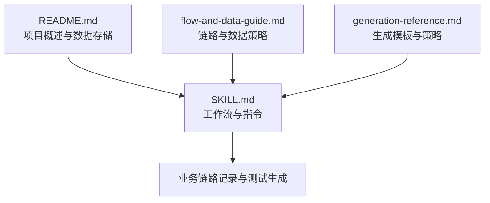
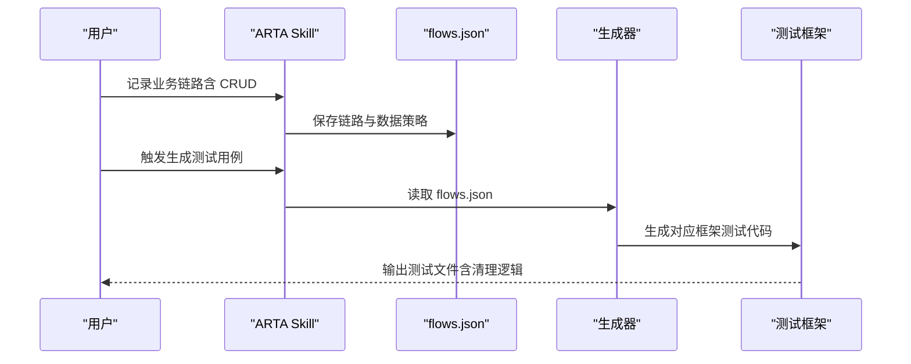
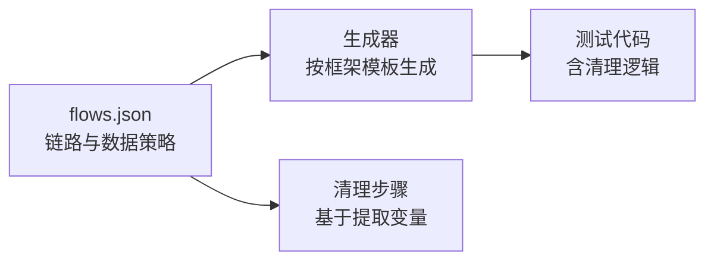

# CRUD 接口处理策略

<cite>
**本文引用的文件**
- [README.md](file://README.md)
- [SKILL.md](file://SKILL.md)
- [flow-and-data-guide.md](file://flow-and-data-guide.md)
- [generation-reference.md](file://generation-reference.md)
</cite>

## 目录
1. [简介](#简介)
2. [项目结构](#项目结构)
3. [核心组件](#核心组件)
4. [架构总览](#架构总览)
5. [详细组件分析](#详细组件分析)
6. [依赖关系分析](#依赖关系分析)
7. [性能考虑](#性能考虑)
8. [故障排查指南](#故障排查指南)
9. [结论](#结论)
10. [附录](#附录)

## 简介
本文件围绕 ARTA（自动化回归测试助手）在 CRUD 接口测试中的处理策略，系统阐述四类操作（创建、更新、删除、查询）的测试场景设计与实现策略，并结合 ARTA 的业务链路记录与测试生成能力，给出数据准备、前置条件、清理机制以及最佳实践与异常处理建议。目标读者既包括一线测试工程师，也包括希望理解 ARTA 流程与数据策略的非技术读者。

## 项目结构
ARTA 仓库包含四个核心文档：
- README.md：项目概述、功能、安装与使用、数据存储位置
- SKILL.md：端到端测试工作流的详细说明与指令速查
- flow-and-data-guide.md：业务链路与数据策略的深入指南，包含 CRUD 处理策略
- generation-reference.md：各测试框架的生成模板与生成策略

图表来源
- [README.md:1-176](file://README.md#L1-L176)
- [SKILL.md:1-443](file://SKILL.md#L1-L443)
- [flow-and-data-guide.md:1-218](file://flow-and-data-guide.md#L1-L218)
- [generation-reference.md:1-304](file://generation-reference.md#L1-L304)

章节来源
- [README.md:1-176](file://README.md#L1-L176)
- [SKILL.md:1-443](file://SKILL.md#L1-L443)

## 核心组件
- 项目接入与配置：收集项目信息、后端/测试框架、API 来源，保存至 arta-data/project.json
- API 扫描：本地代码分析或 OpenAPI 解析，生成 arta-data/apis.json
- 业务链路记录：定义 API 序列、测试数据、断言与清理步骤，保存至 arta-data/flows.json
- 测试用例生成：基于链路生成多框架测试代码，输出至 tests/flows/
- 数据与断言：支持固定值、生成数据、引用上游、环境变量；断言类型覆盖状态码、JSONPath、响应头、响应时间等

章节来源
- [README.md:140-162](file://README.md#L140-L162)
- [SKILL.md:34-78](file://SKILL.md#L34-L78)
- [SKILL.md:81-139](file://SKILL.md#L81-L139)
- [SKILL.md:143-258](file://SKILL.md#L143-L258)
- [SKILL.md:297-377](file://SKILL.md#L297-L377)
- [flow-and-data-guide.md:77-145](file://flow-and-data-guide.md#L77-L145)

## 架构总览
ARTA 的 CRUD 测试策略贯穿“业务链路记录”阶段，针对写入操作（POST/PUT/PATCH/DELETE）自动建议清理步骤，确保测试数据隔离与可重复性。生成阶段将链路转化为多框架测试代码，统一包含前置准备、步骤执行、断言与清理。

图表来源
- [SKILL.md:143-258](file://SKILL.md#L143-L258)
- [SKILL.md:297-377](file://SKILL.md#L297-L377)
- [generation-reference.md:218-254](file://generation-reference.md#L218-L254)

## 详细组件分析

### CRUD 接口测试场景与策略
本节基于 flow-and-data-guide.md 的 CRUD 处理策略，结合 ARTA 的链路记录与生成能力，给出可落地的测试设计与实施要点。

- 创建（Create）接口
  - 建议场景
    - 成功创建：必填字段完整，返回 2xx
    - 缺少必填字段：返回 400/422
    - 字段格式错误：返回 400/422
    - 重复创建（唯一约束）：返回 409/422
  - 数据准备策略
    - 使用生成数据避免冲突，如唯一标识采用生成函数
    - 对于需要后续更新/删除的资源，记录返回的资源 ID
  - 前置条件与清理
    - 无前置条件要求，但建议在链路末尾添加清理步骤
    - 清理步骤通常为 DELETE 对应资源，使用提取的 ID
  - 断言要点
    - 状态码、响应体关键字段存在性与类型
    - 若涉及权限控制，需在请求头中注入授权信息

- 更新（Update）接口
  - 建议场景
    - 成功更新：有效字段，返回 2xx
    - 资源不存在：返回 404
    - 无权限：返回 403
    - 部分更新：只修改部分字段，其余保持不变
  - 数据准备策略
    - 先创建资源，再引用其 ID 进行更新
    - 使用生成数据确保唯一性与可重复性
  - 前置条件与清理
    - 需要先创建资源
    - 更新后可保留资源用于后续查询验证，或在链路末尾清理
  - 断言要点
    - 更新后的字段值变化符合预期
    - 未更新字段保持原值

- 删除（Delete）接口
  - 建议场景
    - 成功删除：存在的资源被删除，返回 2xx
    - 不存在的资源：返回 404
    - 无权限：返回 403
    - 级联删除验证：关联资源是否按预期被清理
  - 数据准备策略
    - 先创建资源，记录 ID
    - 对于级联删除，提前准备关联数据
  - 前置条件与清理
    - 需要先创建资源
    - 删除接口通常放在测试最后执行，同时作为清理手段
  - 断言要点
    - 删除后无法查询到该资源
    - 级联删除时，关联资源状态符合预期

- 查询（Read）接口
  - 建议场景
    - 有数据查询：返回 2xx，列表非空
    - 无数据查询：返回 2xx，空列表
    - 分页查询：默认分页、翻页、边界值
    - 条件筛选：按不同参数组合筛选，返回正确结果集
    - 无权限：返回 401/403
  - 数据准备策略
    - 先确保有测试数据，再进行查询验证
    - 使用生成数据构造边界场景（空结果、超界分页）
  - 前置条件与清理
    - 无前置条件要求，但建议在链路末尾清理创建的数据
  - 断言要点
    - 结果集大小、字段存在性与类型
    - 分页参数生效（页码、大小、总数）

章节来源
- [flow-and-data-guide.md:146-198](file://flow-and-data-guide.md#L146-L198)

### 数据准备策略与断言类型
- 数据类型与语法
  - 固定值：直接写入常量
  - 生成数据：使用内置函数生成唯一或随机数据
  - 引用上游：跨步骤传递响应数据
  - 环境变量：从运行时环境读取配置
- 断言类型
  - 状态码、JSONPath（存在、相等、包含、类型、长度）、响应时间、响应头
- 生成数据函数示例
  - 唯一标识：uuid、timestamp
  - 随机数据：random_email、random_phone、faker、random_int、random_string
  - 自增序列：increment

章节来源
- [flow-and-data-guide.md:77-145](file://flow-and-data-guide.md#L77-L145)

### 业务链路记录与清理建议
- 写入操作自动建议清理步骤
  - 当检测到链路包含写入操作（如 POST），会提示在链路末尾添加清理步骤（如 DELETE）
  - 清理步骤使用提取的资源 ID，确保测试数据隔离
- 链路状态与优先级
  - draft/done/deprecated 状态便于管理与追踪
  - 优先级 P0/P1/P2/P3 用于指导测试覆盖重点

章节来源
- [SKILL.md:246-257](file://SKILL.md#L246-L257)
- [flow-and-data-guide.md:211-218](file://flow-and-data-guide.md#L211-L218)

### 测试生成与最佳实践
- 生成策略
  - 默认场景：完整正向流程、单步正向、关键异常
  - 异常场景规则：认证失败、资源不存在、参数错误等
- 生成模板
  - Vitest/Jest、Pytest、JUnit 5、Go testing 等框架模板
  - 模板包含 beforeAll/afterAll 或类级 setup/teardown，统一处理清理
- 最佳实践
  - 为每个 CRUD 场景编写明确的断言
  - 使用生成数据避免竞态与冲突
  - 在链路末尾添加清理步骤，确保环境干净
  - 对于高优先级 API（P0/P1），优先覆盖关键异常场景

章节来源
- [generation-reference.md:218-254](file://generation-reference.md#L218-L254)
- [generation-reference.md:230-241](file://generation-reference.md#L230-L241)
- [generation-reference.md:7-130](file://generation-reference.md#L7-L130)

## 依赖关系分析
- ARTA 的 CRUD 策略依赖于业务链路记录（flows.json）与数据策略（生成数据、引用上游、环境变量）
- 测试生成器依赖 flows.json 的结构化数据，按框架模板生成测试代码
- 清理步骤依赖链路中提取的变量（如资源 ID），确保删除操作的准确性

图表来源
- [flow-and-data-guide.md:6-75](file://flow-and-data-guide.md#L6-L75)
- [generation-reference.md:218-254](file://generation-reference.md#L218-L254)

章节来源
- [flow-and-data-guide.md:6-75](file://flow-and-data-guide.md#L6-L75)
- [generation-reference.md:218-254](file://generation-reference.md#L218-L254)

## 性能考虑
- 生成数据与断言
  - 使用生成函数减少重复数据，提高测试稳定性
  - 合理设置断言范围，避免过度断言导致维护成本上升
- 清理策略
  - 在链路末尾集中清理，减少数据库压力
  - 对于级联删除，评估批量清理的性能影响
- 并发与隔离
  - 使用生成数据与自增序列避免并发冲突
  - 在测试套件中合理组织 beforeAll/afterAll，避免全局状态污染

## 故障排查指南
- 常见异常场景
  - 认证失败：检查 Authorization 头与 token 生命周期
  - 资源不存在：确认创建步骤与资源 ID 提取是否正确
  - 参数错误：核对生成数据与字段格式
  - 无权限：确认用户角色与权限配置
- 断言失败定位
  - 优先检查状态码与响应体结构
  - 使用 JSONPath 断言定位具体字段
  - 关注响应时间与响应头，排除网络/服务端问题
- 清理失败
  - 确认提取的资源 ID 是否存在
  - 检查清理步骤的执行顺序与权限
  - 对于级联删除，确认关联数据是否按预期清理

章节来源
- [generation-reference.md:230-241](file://generation-reference.md#L230-L241)
- [flow-and-data-guide.md:146-198](file://flow-and-data-guide.md#L146-L198)

## 结论
ARTA 的 CRUD 接口测试策略以“业务链路记录”为核心，结合生成数据与断言类型，形成可复用、可扩展的测试设计方法。通过在写入操作后自动建议清理步骤，ARTA 有效保障了测试环境的隔离与可重复性。配合多框架生成模板与异常场景规则，ARTA 能够帮助团队快速构建高质量的回归测试体系。

## 附录
- 数据存储位置
  - 项目配置：arta-data/project.json
  - API 清单：arta-data/apis.json
  - 业务链路：arta-data/flows.json
  - 测试输出：tests/flows/

章节来源
- [README.md:151-162](file://README.md#L151-L162)