# 创建接口测试场景

<cite>
**本文档引用的文件**
- [README.md](file://README.md)
- [SKILL.md](file://SKILL.md)
- [flow-and-data-guide.md](file://flow-and-data-guide.md)
- [generation-reference.md](file://generation-reference.md)
</cite>

## 目录
1. [简介](#简介)
2. [项目结构](#项目结构)
3. [核心组件](#核心组件)
4. [架构概览](#架构概览)
5. [详细组件分析](#详细组件分析)
6. [依赖关系分析](#依赖关系分析)
7. [性能考虑](#性能考虑)
8. [故障排除指南](#故障排除指南)
9. [结论](#结论)

## 简介

ARTA（Automation Regression Test Assistant）是一个端到端的API自动化测试流程引导工具，专门用于帮助开发团队从项目接入到测试用例生成的完整测试工作流程。该工具的核心目标是简化API测试的创建过程，特别是针对CRUD接口的测试场景设计。

ARTA采用四阶段测试工作流程：项目接入、API扫描、业务链路记录和测试用例生成。对于创建接口测试场景，ARTA提供了系统化的测试设计方法，包括四种核心测试场景的完整覆盖策略。

## 项目结构

ARTA项目采用简洁而功能完整的文档结构，主要包含四个核心文件：

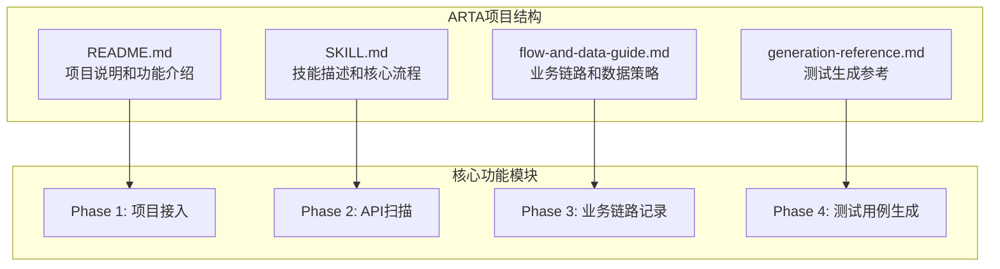

**图表来源**
- [README.md:1-176](file://README.md#L1-L176)
- [SKILL.md:1-443](file://SKILL.md#L1-L443)

**章节来源**
- [README.md:1-176](file://README.md#L1-L176)
- [SKILL.md:1-443](file://SKILL.md#L1-L443)

## 核心组件

### 四阶段测试工作流程

ARTA采用经过验证的四阶段测试工作流程，确保测试创建的系统性和完整性：

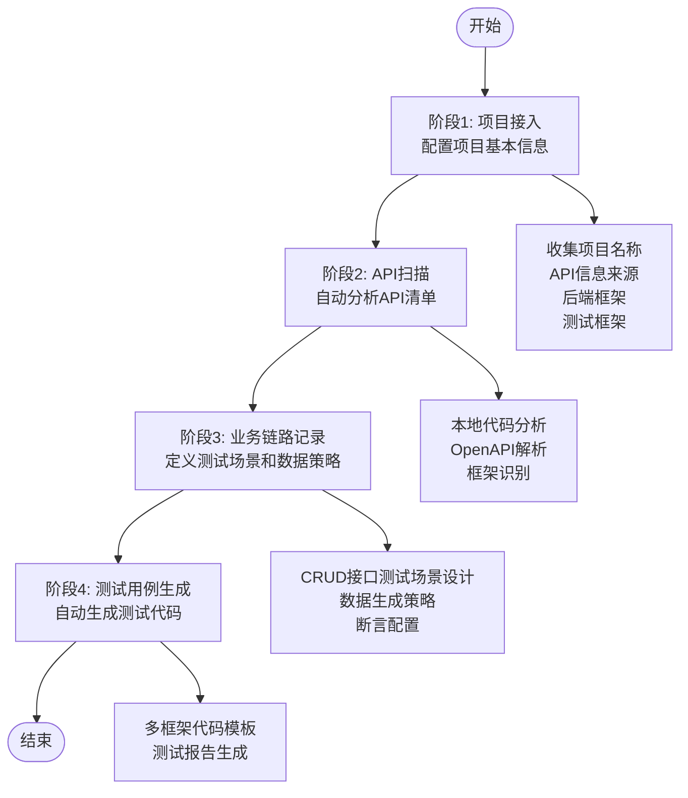

**图表来源**
- [SKILL.md:10-16](file://SKILL.md#L10-L16)
- [SKILL.md:34-78](file://SKILL.md#L34-L78)

### CRUD接口测试场景设计

ARTA为CRUD接口提供了标准化的测试场景设计框架，特别针对创建接口制定了详细的测试策略：

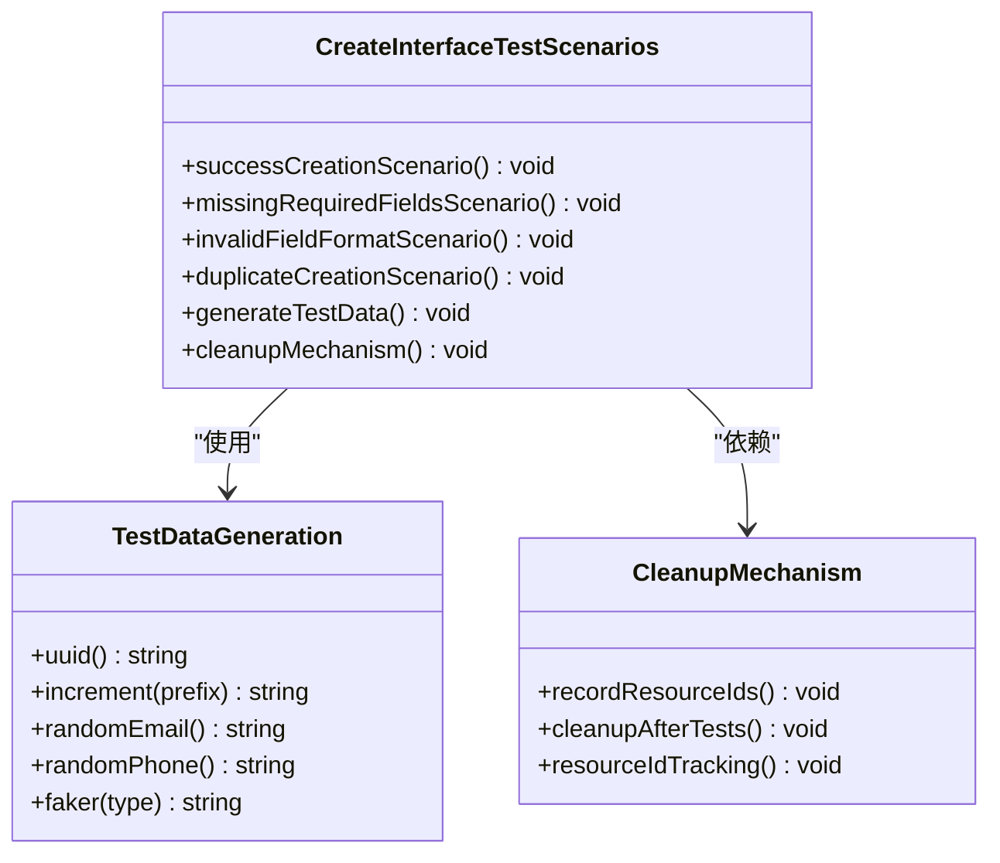

**图表来源**
- [flow-and-data-guide.md:148-159](file://flow-and-data-guide.md#L148-L159)

**章节来源**
- [flow-and-data-guide.md:148-159](file://flow-and-data-guide.md#L148-L159)

## 架构概览

### 测试工作流架构

ARTA的测试工作流采用模块化设计，每个阶段都有明确的输入输出和职责分工：

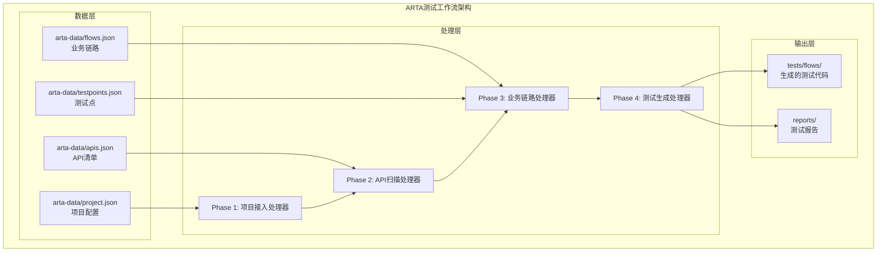

**图表来源**
- [README.md:151-162](file://README.md#L151-L162)
- [SKILL.md:419-431](file://SKILL.md#L419-L431)

### 测试数据生成架构

ARTA的测试数据生成系统提供了灵活的数据策略组合：

```mermaid
flowchart LR
subgraph "测试数据生成策略"
A[固定值<br/>直接写值]
B[生成数据<br/>{{函数()}}]
C[引用上游<br/>${步骤.字段}]
D[环境变量<br/>$ENV{变量}]
end
subgraph "生成函数库"
E[uuid()<br/>UUID v4]
F[increment(prefix)<br/>自增序列]
G[random_email()<br/>随机邮箱]
H[random_phone()<br/>随机手机号]
I[faker(type)<br/>随机数据]
end
B --> E
B --> F
B --> G
B --> H
B --> I
```

**图表来源**
- [SKILL.md:181-191](file://SKILL.md#L181-L191)
- [flow-and-data-guide.md:92-107](file://flow-and-data-guide.md#L92-L107)

**章节来源**
- [SKILL.md:181-191](file://SKILL.md#L181-L191)
- [flow-and-data-guide.md:92-107](file://flow-and-data-guide.md#L92-L107)

## 详细组件分析

### 成功创建场景测试流程

成功创建场景是创建接口测试的基础，需要验证完整的业务流程：

#### 测试流程设计

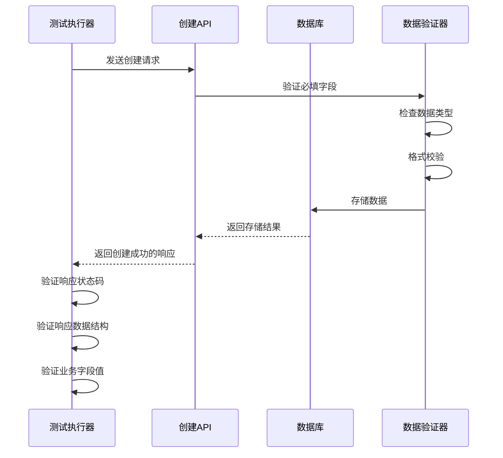

**图表来源**
- [flow-and-data-guide.md:151-152](file://flow-and-data-guide.md#L151-L152)

#### 必填字段验证策略

成功创建场景需要确保所有必填字段都得到正确验证：

1. **字段完整性检查**：验证所有必需字段都存在且非空
2. **数据类型验证**：确保字段类型符合API规范
3. **格式验证**：检查字符串、数字、日期等格式正确性
4. **业务规则验证**：验证字段值符合业务约束

#### 响应数据验证

成功的创建响应需要验证：
- HTTP状态码为2xx系列（通常是201 Created）
- 响应体包含必要的业务标识符
- 响应数据结构符合预期
- 关键业务字段值正确

**章节来源**
- [flow-and-data-guide.md:151-152](file://flow-and-data-guide.md#L151-L152)

### 缺少必填字段场景测试

缺少必填字段的错误处理测试是创建接口的重要验证点：

#### 错误处理测试设计

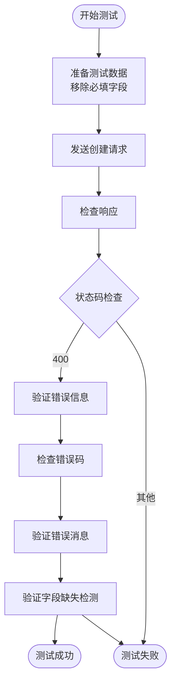

**图表来源**
- [generation-reference.md:230-241](file://generation-reference.md#L230-L241)

#### 错误码定义和验证

针对缺少必填字段的场景，ARTA建议使用标准的HTTP状态码：
- **400 Bad Request**：最常见的错误状态码
- **422 Unprocessable Entity**：语义验证失败
- **409 Conflict**：虽然主要用于重复创建，但也可用于某些字段冲突

#### 错误消息验证策略

错误消息应该包含以下信息：
- 明确指出哪个字段缺失
- 提供具体的错误描述
- 建议正确的数据格式
- 包含错误码便于调试

**章节来源**
- [generation-reference.md:230-241](file://generation-reference.md#L230-L241)

### 字段格式错误场景验证

字段格式错误是创建接口中最常见的验证场景之一：

#### 数据类型验证策略

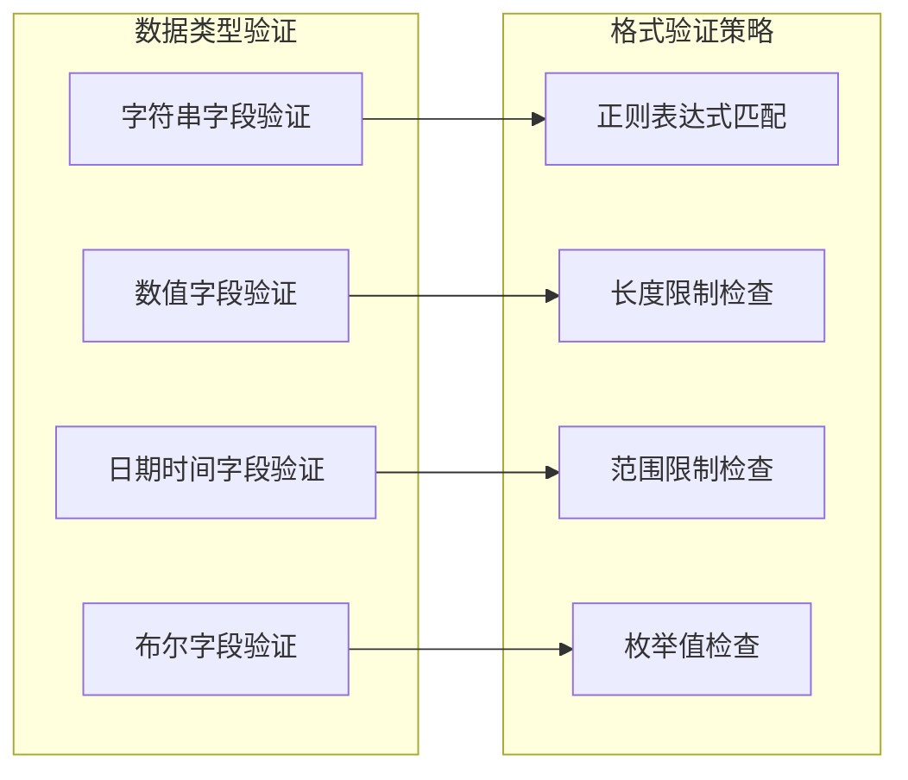

**图表来源**
- [flow-and-data-guide.md:133-145](file://flow-and-data-guide.md#L133-L145)

#### 格式校验和边界值测试

格式校验需要覆盖：
- **最小长度限制**：空字符串、单字符
- **最大长度限制**：正常长度、超长字符串
- **特殊字符处理**：HTML标签、SQL注入字符
- **编码格式**：UTF-8、ASCII等

边界值测试包括：
- **边界值**：刚好满足和刚好不满足条件的值
- **异常值**：完全不符合格式的值
- **极端值**：极大或极小的数值

**章节来源**
- [flow-and-data-guide.md:133-145](file://flow-and-data-guide.md#L133-L145)

### 重复创建场景唯一约束测试

重复创建场景验证数据库的唯一约束和去重逻辑：

#### 唯一约束测试设计

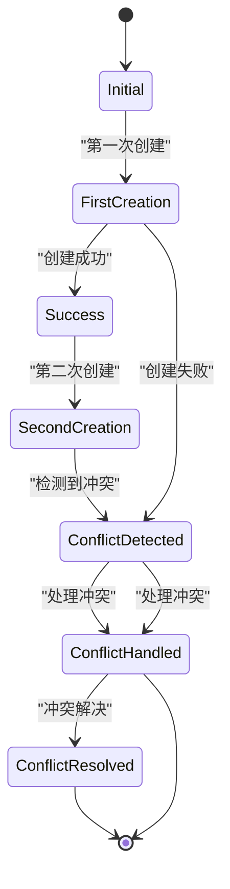

**图表来源**
- [flow-and-data-guide.md:154-155](file://flow-and-data-guide.md#L154-L155)

#### 去重逻辑验证

去重逻辑验证包括：
- **数据库唯一约束**：验证数据库层面的唯一性
- **应用层去重**：验证业务逻辑中的去重处理
- **并发场景处理**：验证高并发下的去重效果
- **幂等性保证**：验证重复请求的幂等性

#### 冲突处理策略

冲突处理应该：
- **返回明确的错误状态码**（通常是409 Conflict）
- **提供清晰的错误信息**，说明冲突的具体原因
- **给出解决方案建议**，指导用户如何避免冲突
- **保持数据一致性**，不破坏现有数据

**章节来源**
- [flow-and-data-guide.md:154-155](file://flow-and-data-guide.md#L154-L155)

### 数据准备策略

ARTA提供了多种数据准备策略来避免测试冲突：

#### 生成数据函数应用

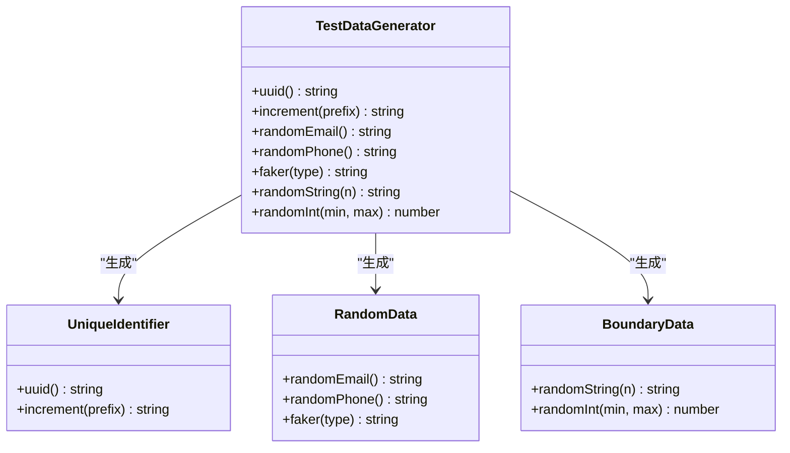

**图表来源**
- [flow-and-data-guide.md:96-107](file://flow-and-data-guide.md#L96-L107)

#### uuid()函数使用策略

uuid()函数是避免冲突的最佳选择：
- **全局唯一性**：确保不同测试之间的数据不冲突
- **无序性**：避免测试数据的可预测性
- **标准化**：遵循UUID v4标准，兼容性强
- **易用性**：简单易用，无需额外配置

#### increment()函数应用场景

increment()函数适用于需要有序编号的场景：
- **用户编号**：如"user_001"、"user_002"
- **订单编号**：需要连续递增的编号
- **产品编号**：内部使用的有序标识符
- **测试标记**：便于识别和追踪的测试数据

**章节来源**
- [flow-and-data-guide.md:96-107](file://flow-and-data-guide.md#L96-L107)

### 清理机制设计原理

ARTA的清理机制确保测试环境的整洁和测试数据的隔离：

#### 资源ID记录策略

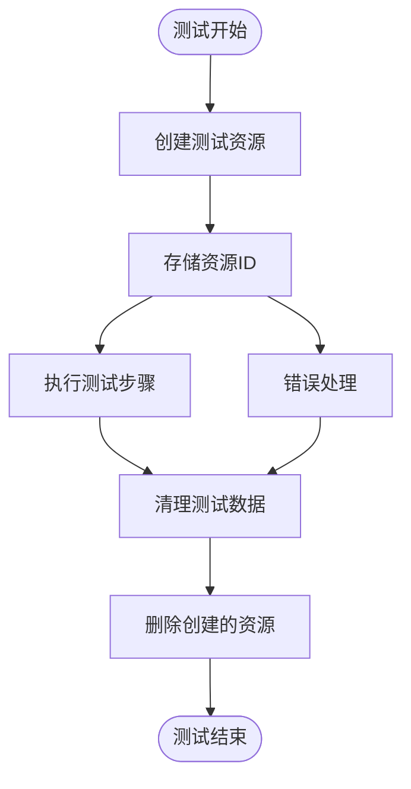

**图表来源**
- [flow-and-data-guide.md:158](file://flow-and-data-guide.md#L158)

#### 测试后清理流程

清理流程包括：
- **资源ID跟踪**：记录所有创建的资源ID
- **批量清理**：统一删除测试期间创建的所有资源
- **错误恢复**：即使测试失败也要尝试清理
- **幂等清理**：多次清理不会产生副作用

**章节来源**
- [flow-and-data-guide.md:158](file://flow-and-data-guide.md#L158)

## 依赖关系分析

### 测试框架支持

ARTA支持多种主流测试框架，每种框架都有相应的代码模板：

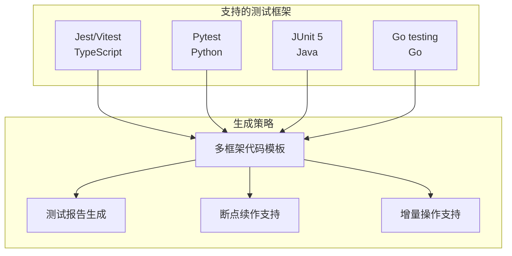

**图表来源**
- [README.md:22-30](file://README.md#L22-L30)
- [SKILL.md:312-321](file://SKILL.md#L312-L321)

### 数据存储依赖

ARTA的测试数据存储具有明确的依赖关系：

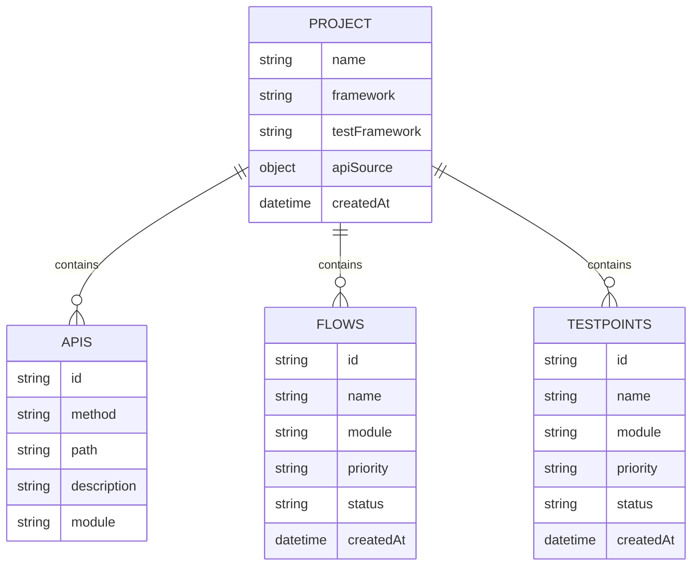

**图表来源**
- [README.md:155-160](file://README.md#L155-L160)
- [SKILL.md:423-429](file://SKILL.md#L423-L429)

**章节来源**
- [README.md:155-160](file://README.md#L155-L160)
- [SKILL.md:423-429](file://SKILL.md#L423-L429)

## 性能考虑

### 测试执行效率优化

ARTA在测试设计中考虑了性能优化因素：

1. **并行测试执行**：支持多个独立测试的并行执行
2. **数据复用策略**：合理复用测试数据减少重复创建
3. **网络请求优化**：合并相关的API调用减少网络开销
4. **内存管理**：及时释放测试过程中创建的对象

### 测试数据生成性能

测试数据生成函数的性能特点：
- **uuid()函数**：生成速度快，适合大量数据生成
- **increment()函数**：性能优异，适合有序数据生成
- **faker()函数**：相对较慢，适合少量高质量随机数据
- **随机函数**：性能稳定，适合各种随机数据场景

## 故障排除指南

### 常见问题和解决方案

#### 测试数据冲突问题

**问题现象**：测试执行时报错，提示数据已存在
**解决方案**：
1. 使用uuid()函数生成唯一标识符
2. 检查测试数据生成策略
3. 确保清理机制正常工作

#### 断言失败问题

**问题现象**：断言检查失败，测试用例执行中断
**解决方案**：
1. 检查API响应格式是否符合预期
2. 验证断言配置是否正确
3. 确认测试数据是否完整

#### 清理失败问题

**问题现象**：测试结束后数据库中仍有残留数据
**解决方案**：
1. 检查清理步骤是否正确配置
2. 验证资源ID记录是否完整
3. 确认清理权限是否足够

**章节来源**
- [SKILL.md:434-443](file://SKILL.md#L434-L443)

### 最佳实践建议

#### 创建接口测试最佳实践

1. **测试场景完整性**：确保覆盖所有核心测试场景
2. **数据准备质量**：使用高质量的测试数据
3. **错误处理验证**：充分验证各种错误场景
4. **清理机制可靠性**：确保测试数据的完全清理
5. **性能考虑**：优化测试执行效率

#### 常见问题预防

1. **提前规划测试数据**：避免测试执行中的数据冲突
2. **完善断言配置**：确保测试结果的准确性
3. **定期清理测试环境**：保持测试环境的整洁
4. **监控测试执行**：及时发现和解决问题

## 结论

ARTA为创建接口测试场景提供了系统化、标准化的解决方案。通过四阶段测试工作流程和完善的测试场景设计，ARTA能够帮助开发团队高效地创建高质量的API测试用例。

核心优势包括：
- **标准化测试场景**：提供完整的四种测试场景覆盖
- **灵活的数据策略**：支持多种测试数据生成方法
- **可靠的清理机制**：确保测试环境的整洁
- **多框架支持**：适应不同的技术栈需求
- **智能提醒功能**：提供断点续作和增量操作支持

通过遵循ARTA的测试设计原则和最佳实践，开发团队可以显著提高API测试的质量和效率，为系统的稳定性和可靠性提供有力保障。