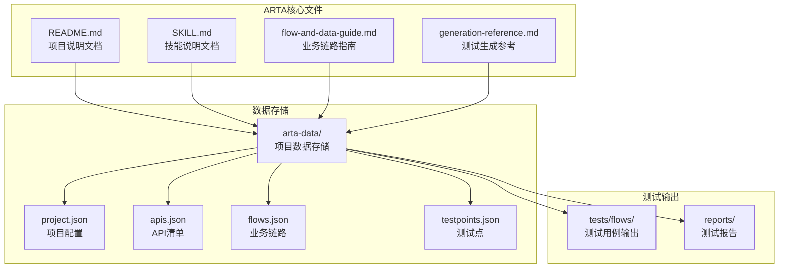
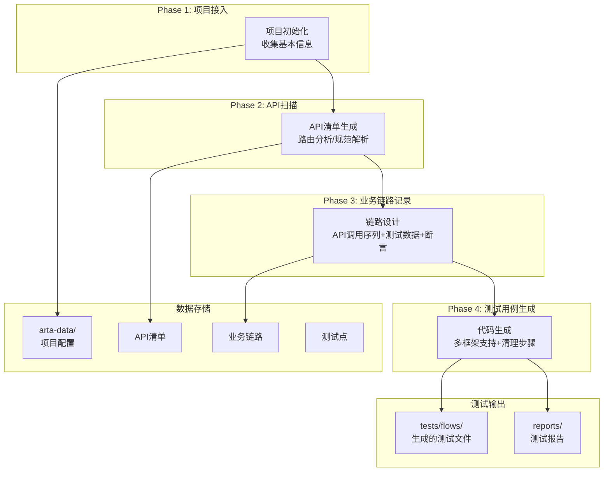
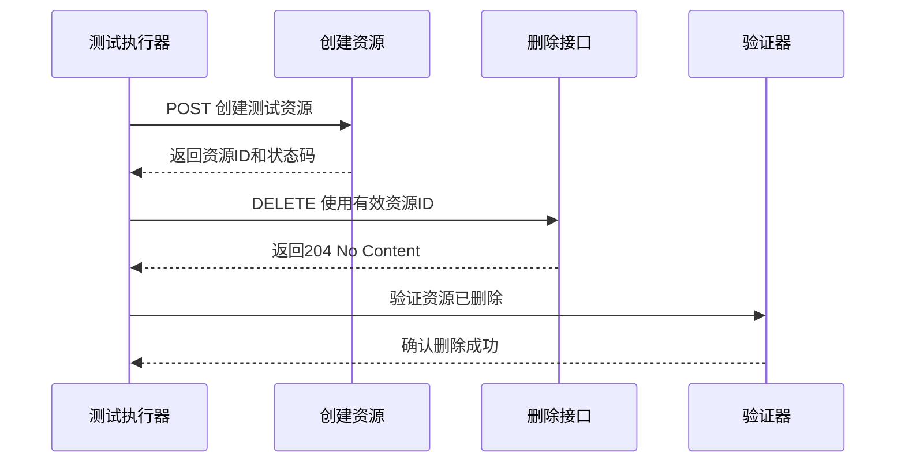
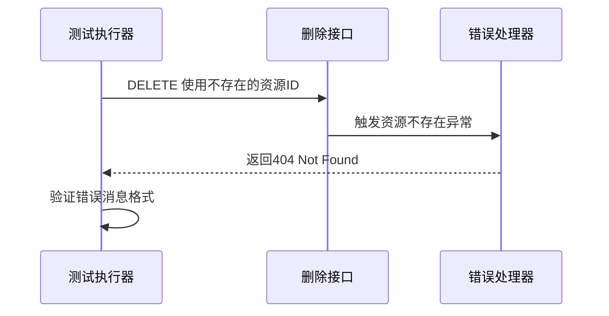
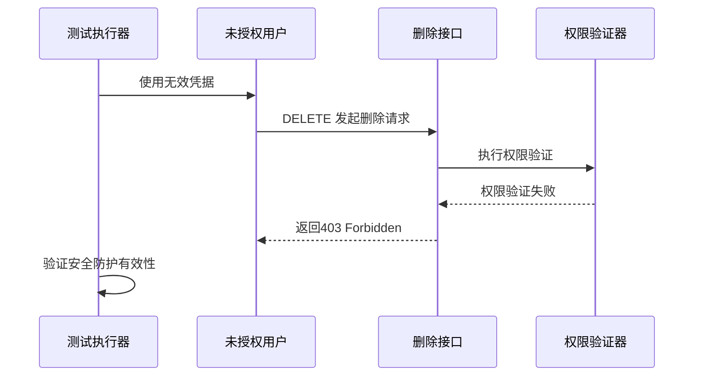
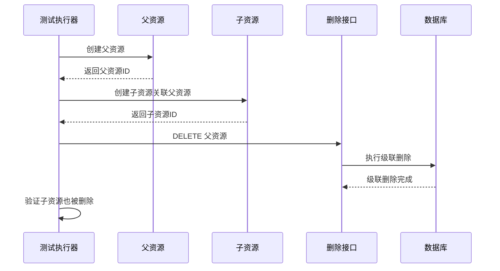
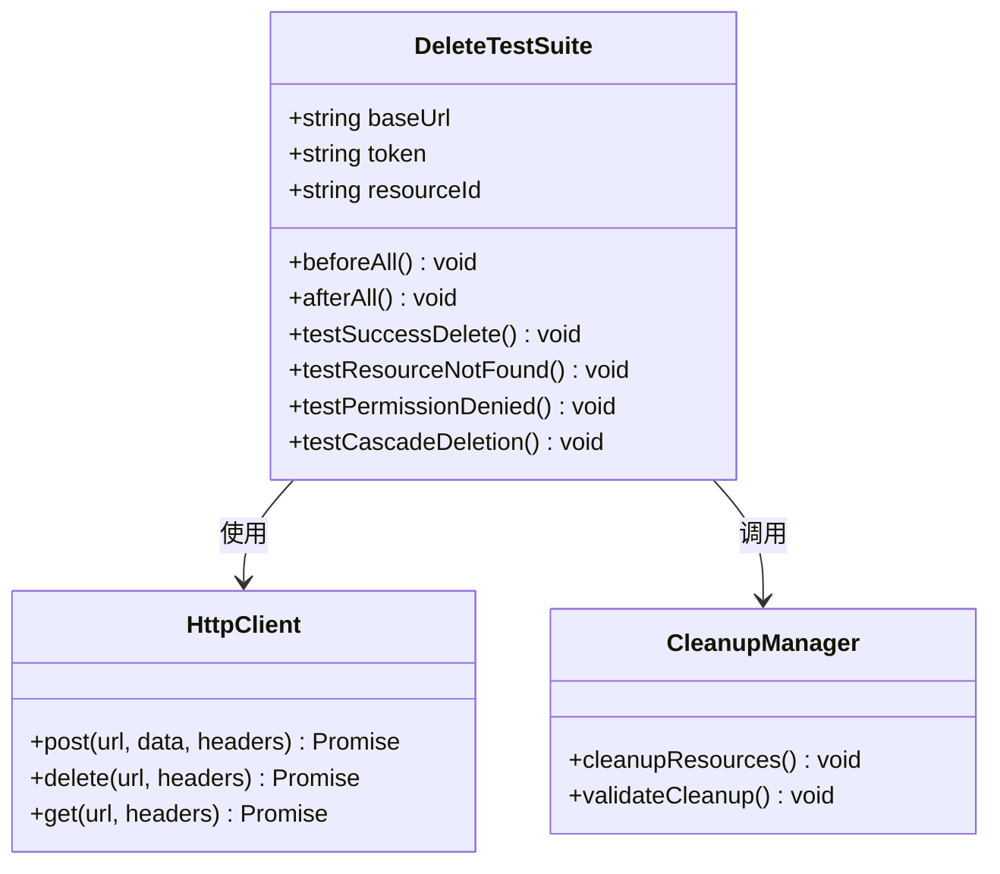
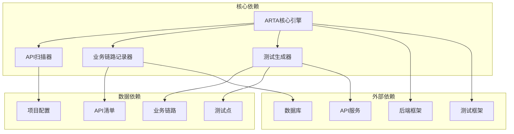

# 删除接口测试场景

<cite>
**本文档引用的文件**
- [README.md](file://README.md)
- [SKILL.md](file://SKILL.md)
- [flow-and-data-guide.md](file://flow-and-data-guide.md)
- [generation-reference.md](file://generation-reference.md)
</cite>

## 目录
1. [简介](#简介)
2. [项目结构](#项目结构)
3. [核心组件](#核心组件)
4. [架构概览](#架构概览)
5. [详细组件分析](#详细组件分析)
6. [依赖分析](#依赖分析)
7. [性能考虑](#性能考虑)
8. [故障排除指南](#故障排除指南)
9. [结论](#结论)

## 简介

ARTA（Automation Regression Test Assistant）是一个端到端的API自动化测试流程引导工具，专门用于帮助开发团队从项目接入到测试用例生成的完整测试流程。本文档专注于ARTA框架下删除（DELETE）接口的测试场景设计，提供四种核心测试场景的详细技术指导，包括成功删除、不存在资源、无权限访问和级联删除验证场景。

ARTA通过四个阶段的测试工作流程，为不同技术栈的项目提供统一的测试解决方案，支持多种后端框架（Express、NestJS、Flask、Django、FastAPI、Spring Boot、Gin、Echo）和测试框架（Jest、Vitest、Pytest、JUnit、Go testing）。

## 项目结构

ARTA项目采用模块化的文件组织结构，主要包含以下核心文件：



**图表来源**
- [README.md: 151-162:151-162](file://README.md#L151-L162)
- [SKILL.md: 419-431:419-431](file://SKILL.md#L419-L431)

**章节来源**
- [README.md: 1-176:1-176](file://README.md#L1-L176)
- [SKILL.md: 419-431:419-431](file://SKILL.md#L419-L431)

## 核心组件

### 删除接口测试场景设计

ARTA框架为删除接口设计了四个核心测试场景，每个场景都有明确的测试目标和验证标准：

#### 场景一：成功删除场景
- **测试目标**：验证存在资源的正常删除流程
- **前置条件**：需要先创建目标资源以获得有效的资源ID
- **验证内容**：
  - HTTP状态码验证（通常为204 No Content）
  - 资源删除成功后的状态检查
  - 数据库中对应记录的删除确认

#### 场景二：不存在的资源场景
- **测试目标**：验证删除不存在资源时的错误处理
- **错误码定义**：HTTP 404 Not Found
- **验证内容**：
  - 错误响应的状态码
  - 错误消息的格式和内容
  - 异常处理机制的有效性

#### 场景三：无权限场景
- **测试目标**：验证权限控制的安全防护
- **错误码定义**：HTTP 403 Forbidden
- **验证内容**：
  - 权限验证失败的错误处理
  - 安全防护机制的有效性
  - 资源访问控制的完整性

#### 场景四：级联删除验证场景
- **测试目标**：验证关联关系的删除影响
- **验证内容**：
  - 依赖资源的删除影响
  - 外键约束的验证
  - 数据一致性的检查

**章节来源**
- [flow-and-data-guide.md: 174-185:174-185](file://flow-and-data-guide.md#L174-L185)

### CRUD接口处理策略

ARTA框架对CRUD接口提供了统一的处理策略，特别强调了删除接口的特殊设计考虑：

```mermaid
flowchart TD
A[CRUD接口测试策略] --> B[创建(C)接口]
A --> C[更新(U)接口]
A --> D[删除(D)接口]
A --> E[查询(R)接口]
B --> B1[成功场景<br/>必填字段完整]
B --> B2[失败场景<br/>缺少必填字段]
B --> B3[失败场景<br/>字段格式错误]
B --> B4[失败场景<br/>重复创建]
C --> C1[成功场景<br/>有效字段]
C --> C2[失败场景<br/>资源不存在]
C --> C3[失败场景<br/>无权限]
C --> C4[成功场景<br/>部分更新]
D --> D1[成功场景<br/>存在的资源]
D --> D2[失败场景<br/>不存在的资源]
D --> D3[失败场景<br/>无权限]
D --> D4[验证场景<br/>级联删除]
E --> E1[成功场景<br/>有数据]
E --> E2[成功场景<br/>无数据]
E --> E3[成功场景<br/>分页查询]
E --> E4[成功场景<br/>条件筛选]
E --> E5[失败场景<br/>无权限]
```

**图表来源**
- [flow-and-data-guide.md: 146-198:146-198](file://flow-and-data-guide.md#L146-L198)

**章节来源**
- [flow-and-data-guide.md: 146-198:146-198](file://flow-and-data-guide.md#L146-L198)

## 架构概览

ARTA的测试架构采用分层设计，从项目接入到测试生成的完整流程：



**图表来源**
- [README.md: 7-12:7-12](file://README.md#L7-L12)
- [SKILL.md: 10-16:10-16](file://SKILL.md#L10-L16)

**章节来源**
- [README.md: 7-12:7-12](file://README.md#L7-L12)
- [SKILL.md: 10-16:10-16](file://SKILL.md#L10-L16)

## 详细组件分析

### 删除接口测试场景设计

#### 成功删除场景测试流程

成功的删除测试需要遵循严格的测试流程：



**测试要点**：
- **前置条件**：必须先创建资源以获得有效的资源ID
- **响应状态**：通常为204 No Content表示删除成功
- **资源状态**：验证数据库中对应记录已被删除

#### 不存在的资源场景测试

针对不存在资源的删除操作，系统需要正确处理并返回适当的错误信息：



**测试要点**：
- **错误码定义**：HTTP 404 Not Found
- **错误消息验证**：检查错误响应的格式和内容
- **异常处理**：验证系统的异常处理机制

#### 无权限场景测试

权限控制是删除接口测试的重要组成部分：



**测试要点**：
- **权限验证**：确保只有授权用户才能删除资源
- **安全防护**：验证系统的安全机制
- **错误处理**：检查无权限访问的错误处理

#### 级联删除验证场景

级联删除测试验证删除操作对关联资源的影响：



**测试要点**：
- **依赖关系**：验证删除操作对关联资源的影响
- **外键约束**：确保数据库外键约束的正确性
- **数据一致性**：检查删除操作后的数据完整性

**章节来源**
- [flow-and-data-guide.md: 174-185:174-185](file://flow-and-data-guide.md#L174-L185)

### 测试数据策略

ARTA框架提供了灵活的测试数据策略，特别适用于删除接口测试：

#### 数据生成策略

```mermaid
flowchart LR
A[测试数据策略] --> B[固定值]
A --> C[生成数据]
A --> D[引用上游]
A --> E[环境变量]
B --> B1[用户名<br/>testuser001]
B --> B2[页面大小<br/>10]
C --> C1[UUID<br/>{{uuid()}}]
C --> C2[随机邮箱<br/>{{random_email()}}]
C --> C3[时间戳<br/>{{timestamp()}}]
D --> D1[引用token<br/>${step1.token}]
D --> D2[引用ID<br/>${step2.response.data[0].id}]
E --> E1[基础URL<br/>$ENV{BASE_URL}]
E --> E2[API密钥<br/>$ENV{API_KEY}]
```

**图表来源**
- [flow-and-data-guide.md: 77-132:77-132](file://flow-and-data-guide.md#L77-L132)

**章节来源**
- [flow-and-data-guide.md: 77-132:77-132](file://flow-and-data-guide.md#L77-L132)

### 测试生成模板

ARTA支持多种测试框架的代码生成，以下是删除接口测试的典型模板结构：

#### TypeScript/Vitest模板



**图表来源**
- [generation-reference.md: 7-62:7-62](file://generation-reference.md#L7-L62)

**章节来源**
- [generation-reference.md: 7-62:7-62](file://generation-reference.md#L7-L62)

## 依赖分析

ARTA框架的依赖关系体现了其模块化设计的特点：



**图表来源**
- [README.md: 22-30:22-30](file://README.md#L22-L30)
- [SKILL.md: 419-431:419-431](file://SKILL.md#L419-L431)

**章节来源**
- [README.md: 22-30:22-30](file://README.md#L22-L30)
- [SKILL.md: 419-431:419-431](file://SKILL.md#L419-L431)

## 性能考虑

在删除接口测试中，性能优化是确保测试效率的重要因素：

### 测试执行策略

1. **并行执行**：删除测试与其他类型的测试可以并行执行
2. **资源复用**：合理利用测试数据，减少重复创建
3. **清理策略**：及时清理测试产生的临时数据

### 数据库性能优化

1. **索引优化**：确保删除操作涉及的字段有适当索引
2. **事务管理**：合理使用事务减少数据库压力
3. **批量操作**：对于大量删除操作考虑批量处理

### 网络性能优化

1. **连接池**：复用HTTP连接减少建立开销
2. **超时设置**：合理设置请求超时时间
3. **重试机制**：为网络不稳定的情况设置合理的重试

## 故障排除指南

### 常见问题及解决方案

#### 删除接口测试失败

**问题现象**：删除测试总是失败
**可能原因**：
- 资源ID获取失败
- 权限配置错误
- 数据库连接问题

**解决步骤**：
1. 验证前置条件是否满足
2. 检查权限配置
3. 确认数据库连接状态

#### 级联删除验证失败

**问题现象**：级联删除测试不通过
**可能原因**：
- 外键约束配置错误
- 删除顺序不当
- 数据库事务问题

**解决步骤**：
1. 检查数据库外键约束
2. 验证删除操作的执行顺序
3. 确认事务的正确性

#### 清理步骤失效

**问题现象**：测试后残留数据
**可能原因**：
- 清理步骤未执行
- 清理逻辑错误
- 异常中断导致清理失败

**解决步骤**：
1. 确保清理步骤在测试结束后执行
2. 验证清理逻辑的正确性
3. 添加异常处理确保清理执行

**章节来源**
- [flow-and-data-guide.md: 174-185:174-185](file://flow-and-data-guide.md#L174-L185)

## 结论

ARTA框架为删除接口测试提供了全面而系统的方法论指导。通过四个核心测试场景的设计，能够有效验证删除接口的功能正确性、安全性、完整性和可靠性。

关键优势包括：
- **系统性测试覆盖**：涵盖成功、失败、权限和级联删除等各种场景
- **灵活的数据策略**：支持多种测试数据生成和引用方式
- **多框架支持**：适配不同的技术栈和测试框架
- **自动化程度高**：从API扫描到测试生成的完整自动化流程

在实际应用中，建议根据具体的业务需求和技术栈特点，灵活运用ARTA框架提供的测试场景设计原则，确保删除接口测试的全面性和有效性。