# 更新接口测试场景

<cite>
**本文档引用的文件**
- [README.md](file://README.md)
- [SKILL.md](file://SKILL.md)
- [flow-and-data-guide.md](file://flow-and-data-guide.md)
- [generation-reference.md](file://generation-reference.md)
</cite>

## 目录
1. [简介](#简介)
2. [项目结构](#项目结构)
3. [核心组件](#核心组件)
4. [架构概览](#架构概览)
5. [详细组件分析](#详细组件分析)
6. [依赖关系分析](#依赖关系分析)
7. [性能考虑](#性能考虑)
8. [故障排除指南](#故障排除指南)
9. [结论](#结论)

## 简介

ARTA（Automation Regression Test Assistant）是一个端到端 API 自动化测试流程引导工具，专门用于帮助开发团队从项目接入到测试用例生成的完整测试流程。本文档专注于ARTA中更新（UPDATE）接口的四种核心测试场景设计，提供详细的技术指导和最佳实践。

ARTA采用四阶段测试工作流程：项目接入 → API扫描 → 业务链路记录 → 测试用例生成。每个阶段都有明确的目标和产出，确保测试流程的系统性和完整性。

## 项目结构

ARTA项目采用模块化的文档结构，包含四个核心文件：

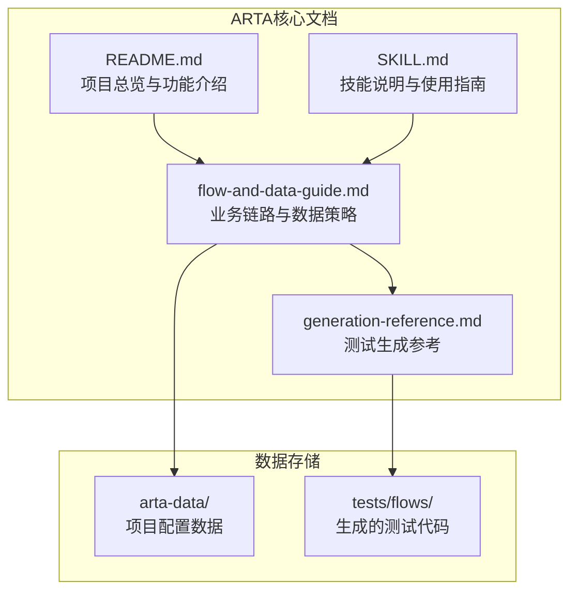

**图表来源**
- [README.md:1-176](file://README.md#L1-L176)
- [SKILL.md:1-443](file://SKILL.md#L1-L443)

**章节来源**
- [README.md:1-176](file://README.md#L1-L176)
- [SKILL.md:1-443](file://SKILL.md#L1-L443)

## 核心组件

ARTA的核心组件围绕测试工作流程展开，每个组件都有明确的职责和交互关系：

### 测试工作流程组件

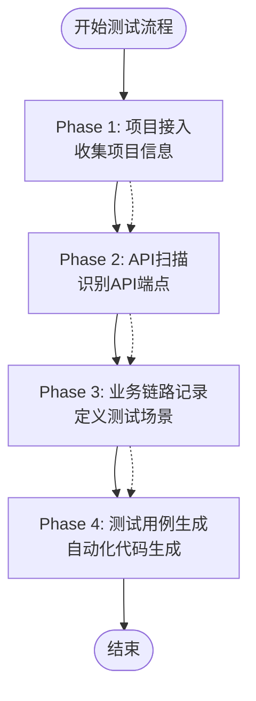

**图表来源**
- [SKILL.md:12-16](file://SKILL.md#L12-L16)

### 更新接口测试场景设计

ARTA针对更新接口设计了四种核心测试场景，每种场景都有特定的前置条件和验证要求：

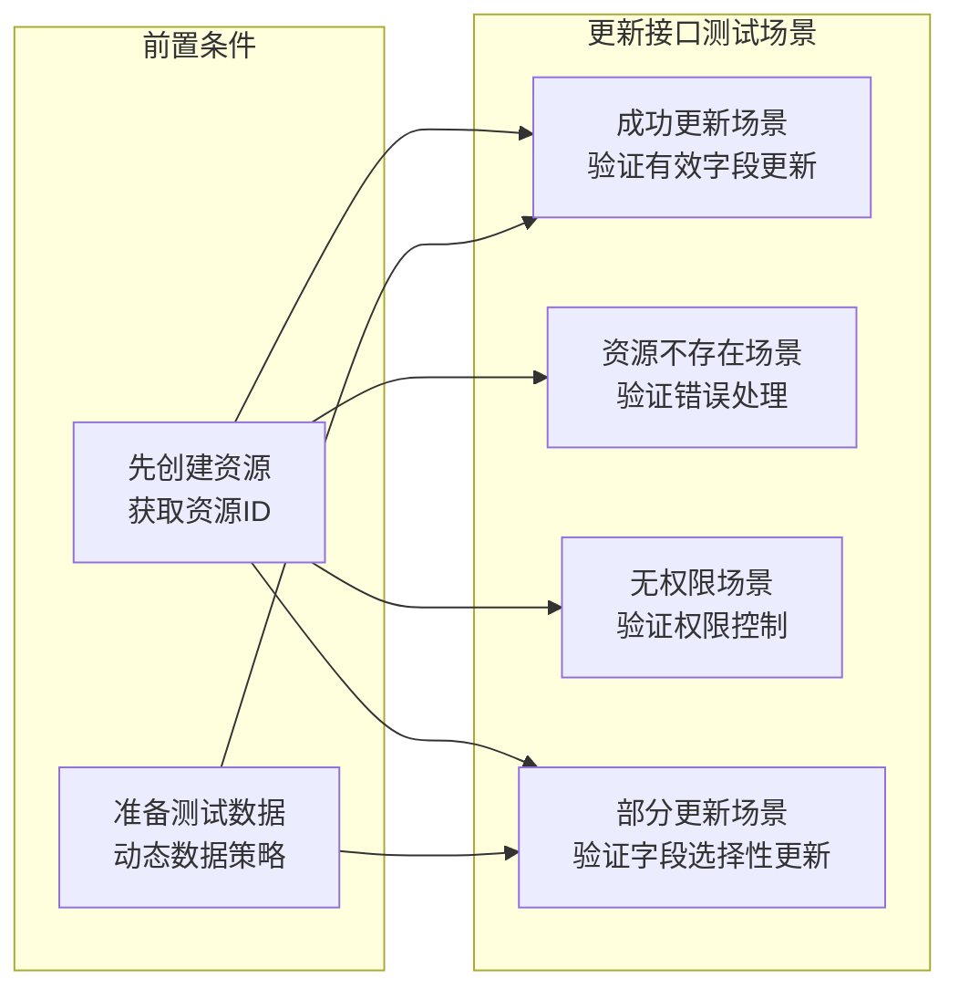

**图表来源**
- [flow-and-data-guide.md:161-172](file://flow-and-data-guide.md#L161-L172)

**章节来源**
- [flow-and-data-guide.md:161-172](file://flow-and-data-guide.md#L161-L172)

## 架构概览

ARTA的架构设计体现了测试流程的层次化和模块化特点：

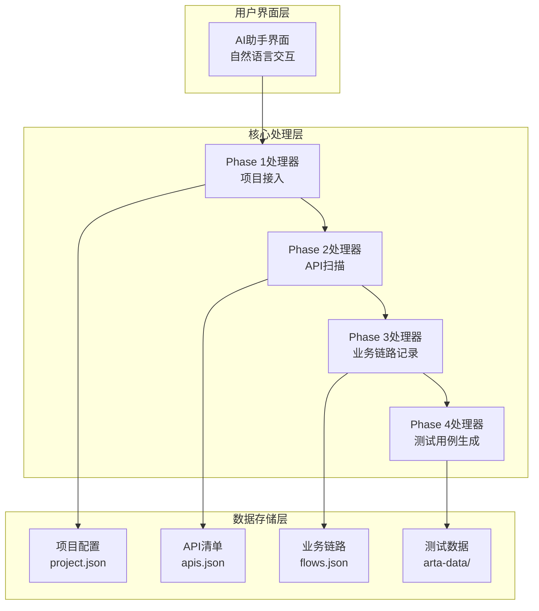

**图表来源**
- [SKILL.md:34-78](file://SKILL.md#L34-L78)
- [README.md:151-162](file://README.md#L151-L162)

## 详细组件分析

### 成功更新场景测试流程

成功更新场景是更新接口测试的基础场景，验证系统在正常条件下的更新能力：

#### 测试流程设计

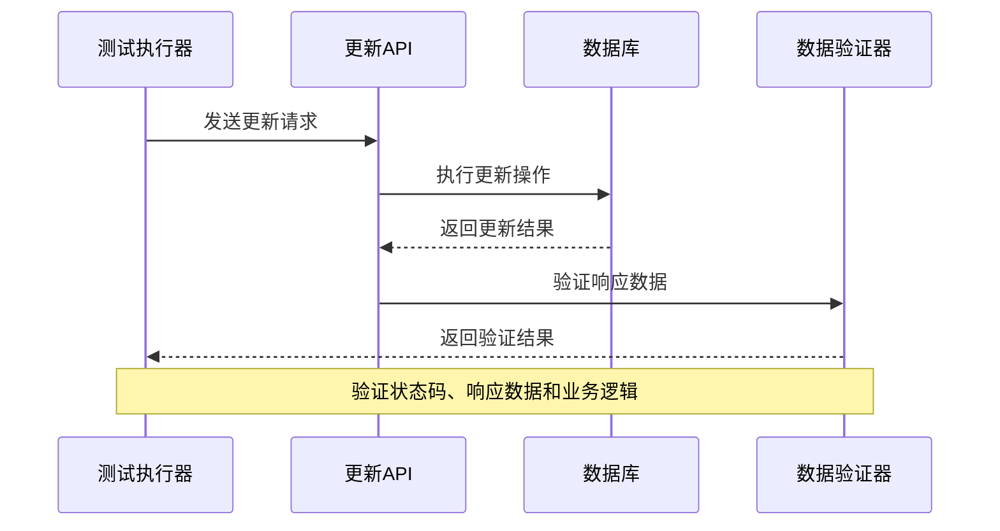

**图表来源**
- [flow-and-data-guide.md:164-168](file://flow-and-data-guide.md#L164-L168)

#### 关键验证要素

1. **有效字段更新验证**
   - 确保更新的字段正确反映到数据库
   - 验证字段类型和格式的正确性
   - 检查字段值的范围和约束

2. **响应数据验证**
   - 验证响应体结构的完整性
   - 确保返回的更新后数据正确
   - 检查时间戳和版本信息的更新

3. **状态码检查**
   - 验证HTTP状态码为200或204
   - 确保响应头信息的正确性
   - 检查Content-Type等元数据

**章节来源**
- [flow-and-data-guide.md:164-168](file://flow-and-data-guide.md#L164-L168)

### 资源不存在场景错误处理测试

资源不存在场景验证系统对无效资源ID的错误处理能力：

#### 错误处理流程

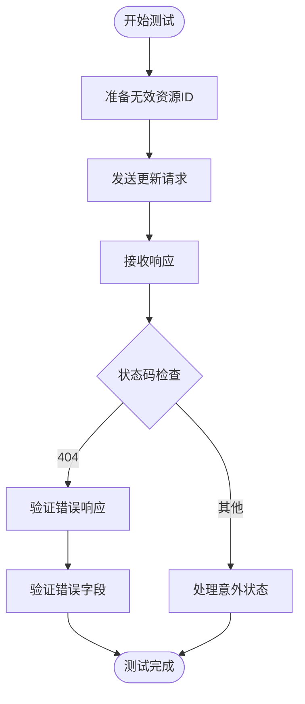

**图表来源**
- [generation-reference.md:234-240](file://generation-reference.md#L234-L240)

#### 错误码定义和验证

1. **错误码定义**
   - HTTP 404 Not Found：资源不存在的标准响应
   - 错误消息格式验证：确保包含资源标识信息
   - 错误上下文信息：提供足够的调试信息

2. **异常捕获机制**
   - 网络层异常处理
   - 应用层业务异常捕获
   - 日志记录和监控集成

**章节来源**
- [generation-reference.md:234-240](file://generation-reference.md#L234-L240)

### 无权限场景权限控制测试

无权限场景验证系统的安全防护机制：

#### 权限验证流程

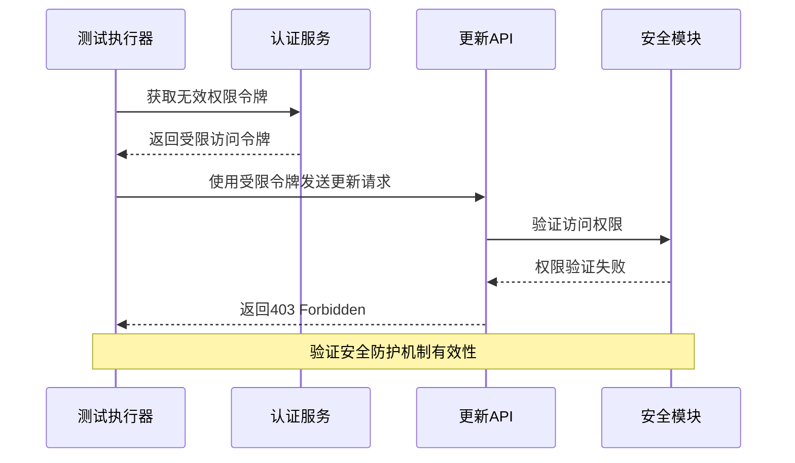

**图表来源**
- [generation-reference.md:236](file://generation-reference.md#L236)

#### 安全防护验证

1. **权限验证失败处理**
   - HTTP 403 Forbidden状态码验证
   - 错误消息的安全性验证
   - 无敏感信息泄露的保护

2. **安全防护机制**
   - 身份认证验证
   - 授权范围检查
   - 审计日志记录

**章节来源**
- [generation-reference.md:236](file://generation-reference.md#L236)

### 部分更新场景字段选择性更新测试

部分更新场景验证系统对选择性字段更新的支持：

#### 部分更新流程

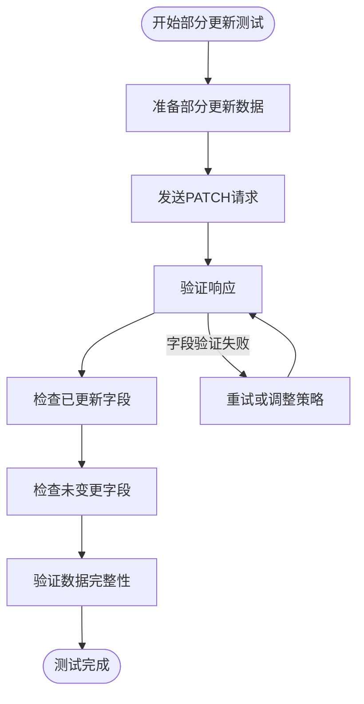

**图表来源**
- [flow-and-data-guide.md:168](file://flow-and-data-guide.md#L168)

#### 字段选择性更新验证

1. **只更新指定字段**
   - 确保只有请求中指定的字段被更新
   - 验证其他字段保持原有值不变
   - 检查字段更新的原子性

2. **保持其他字段不变**
   - 数据库层面的字段隔离
   - 响应数据的一致性验证
   - 业务逻辑的完整性保证

**章节来源**
- [flow-and-data-guide.md:168](file://flow-and-data-guide.md#L168)

### 前置条件要求

更新接口测试的前置条件设计确保测试的可靠性和可重复性：

#### 资源创建和ID获取

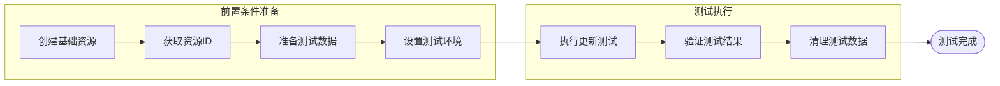

**图表来源**
- [flow-and-data-guide.md:170-172](file://flow-and-data-guide.md#L170-L172)

#### 资源ID获取方法

1. **创建步骤返回ID**
   - 验证创建响应中的ID字段
   - 确保ID的唯一性和格式正确
   - 存储ID用于后续更新操作

2. **动态数据准备**
   - 使用生成函数创建唯一标识符
   - 实现数据隔离和并发安全
   - 支持大规模测试场景

**章节来源**
- [flow-and-data-guide.md:170-172](file://flow-and-data-guide.md#L170-L172)

### 数据策略应用

ARTA的数据策略为更新接口测试提供了灵活而强大的数据管理机制：

#### 数据类型和应用

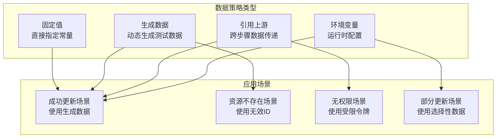

**图表来源**
- [flow-and-data-guide.md:92-131](file://flow-and-data-guide.md#L92-L131)

#### 引用创建步骤返回的ID

1. **ID引用机制**
   - 使用`${步骤.字段}`语法引用上游响应
   - 支持嵌套对象路径的复杂引用
   - 实现跨步骤的数据传递和共享

2. **动态数据准备**
   - 使用生成函数避免数据冲突
   - 支持复杂数据结构的动态生成
   - 实现测试数据的自动生成和管理

**章节来源**
- [flow-and-data-guide.md:108-131](file://flow-and-data-guide.md#L108-L131)

### 设计原则和最佳实践

ARTA更新接口测试遵循以下设计原则和最佳实践：

#### 测试设计原则

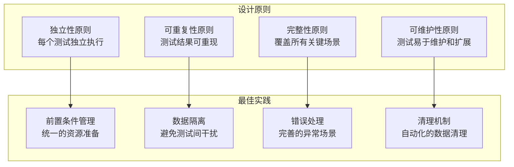

#### 权限验证最佳实践

1. **多层次权限验证**
   - 身份认证验证
   - 授权范围检查
   - 资源所有权验证

2. **安全测试策略**
   - 最小权限原则验证
   - 权限边界测试
   - 审计日志验证

**章节来源**
- [flow-and-data-guide.md:161-172](file://flow-and-data-guide.md#L161-L172)

## 依赖关系分析

ARTA更新接口测试场景之间的依赖关系体现了测试流程的层次化特点：

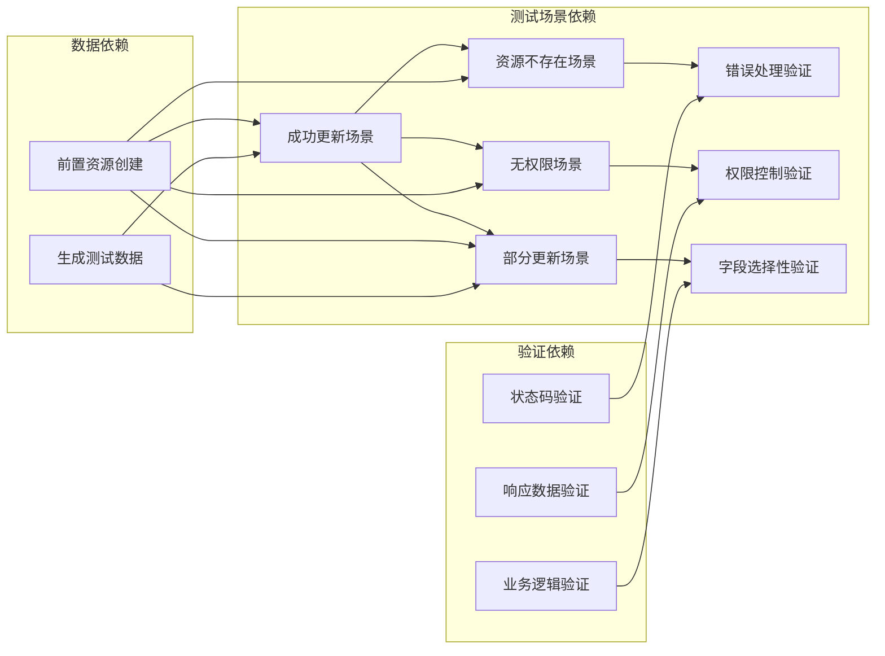

**图表来源**
- [flow-and-data-guide.md:161-172](file://flow-and-data-guide.md#L161-L172)

**章节来源**
- [flow-and-data-guide.md:161-172](file://flow-and-data-guide.md#L161-L172)

## 性能考虑

更新接口测试的性能优化策略：

### 测试执行效率

1. **并发测试支持**
   - 多线程测试执行
   - 数据隔离和锁机制
   - 资源池管理

2. **测试数据管理**
   - 批量数据生成
   - 缓存机制优化
   - 内存使用控制

### 性能监控

1. **响应时间监控**
   - 基准性能设定
   - 性能回归检测
   - 异常性能指标

2. **资源使用监控**
   - 数据库连接池管理
   - 网络请求优化
   - 内存泄漏检测

## 故障排除指南

### 常见问题和解决方案

#### 测试失败排查

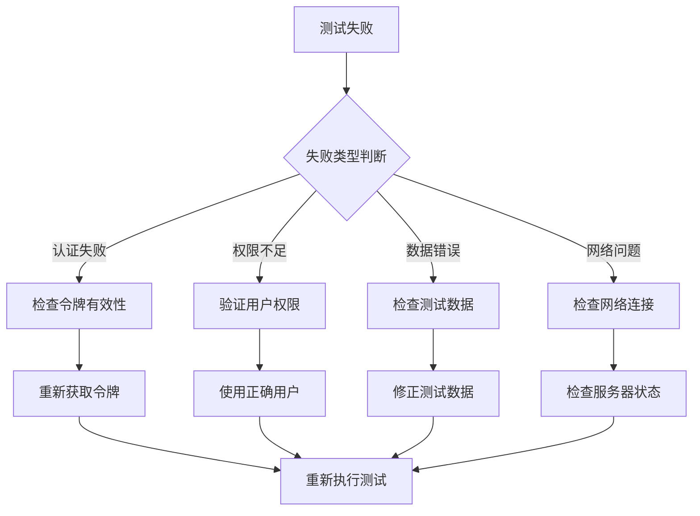

#### 调试技巧

1. **日志分析**
   - API请求日志
   - 数据库操作日志
   - 错误堆栈跟踪

2. **断点调试**
   - 测试框架断点
   - API响应检查
   - 数据流追踪

**章节来源**
- [generation-reference.md:234-240](file://generation-reference.md#L234-L240)

## 结论

ARTA更新接口测试场景设计体现了现代API测试的最佳实践，通过系统化的测试场景设计、灵活的数据策略和严格的质量保证机制，确保了测试的有效性和可靠性。

### 核心价值

1. **全面性**：覆盖所有关键更新场景，确保系统稳定性
2. **自动化**：减少手动测试工作，提高测试效率
3. **可维护性**：清晰的测试结构和数据管理机制
4. **安全性**：完善的权限控制和安全测试验证

### 未来发展方向

1. **智能化测试**：结合AI技术实现更智能的测试场景生成
2. **持续集成**：深度集成CI/CD流程，实现自动化测试流水线
3. **性能测试**：扩展性能测试能力，支持高负载场景
4. **云原生支持**：适应云原生架构，支持微服务测试

通过遵循本文档的设计原则和最佳实践，开发团队可以构建高质量的更新接口测试体系，确保API服务的稳定性和可靠性。