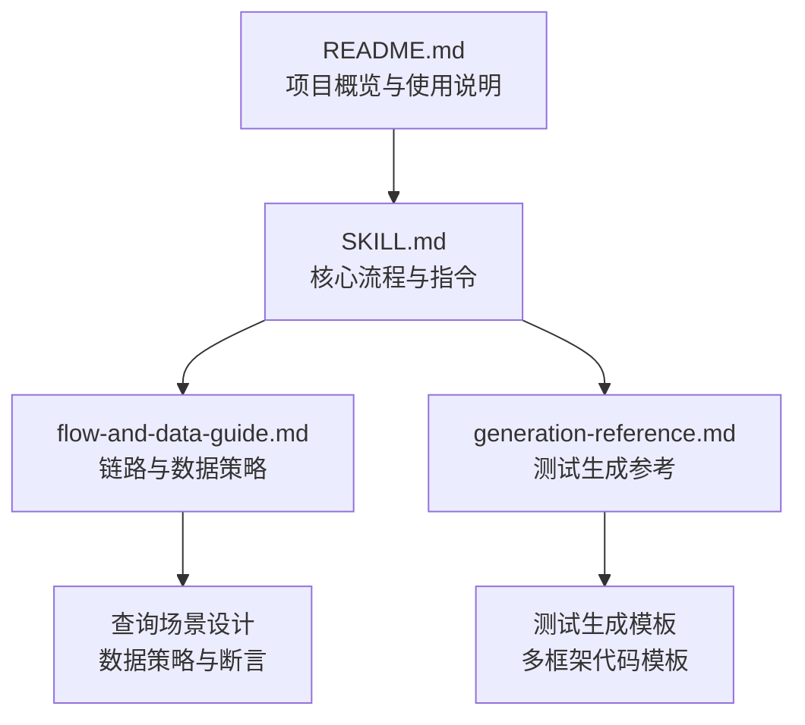
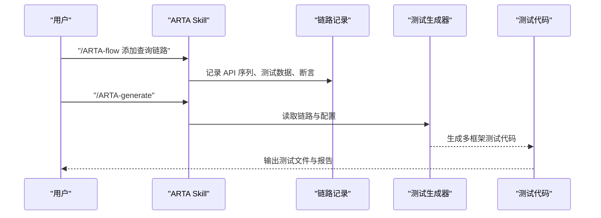
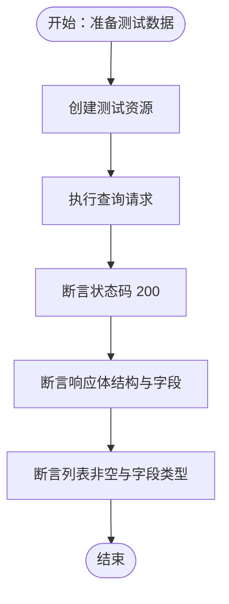
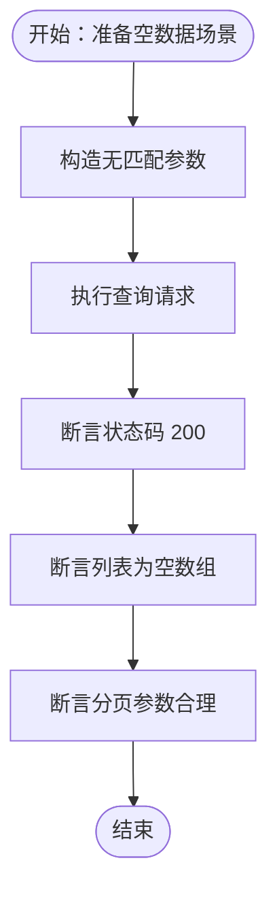
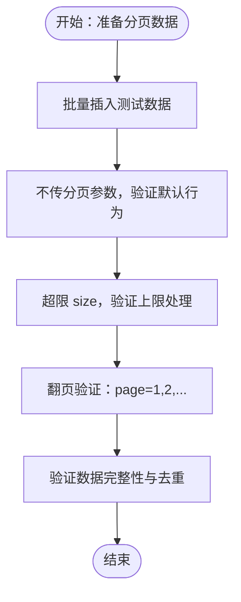
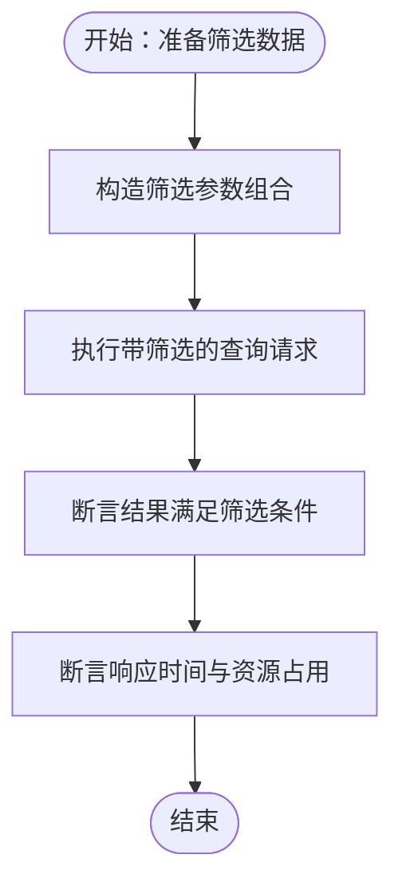
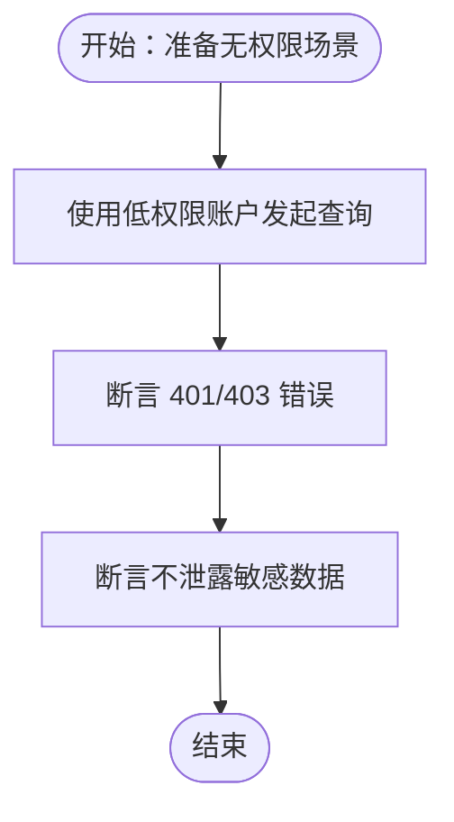

# 查询接口测试场景

<cite>
**本文引用的文件**
- [README.md](file://README.md)
- [SKILL.md](file://SKILL.md)
- [flow-and-data-guide.md](file://flow-and-data-guide.md)
- [generation-reference.md](file://generation-reference.md)
</cite>

## 目录
1. [简介](#简介)
2. [项目结构](#项目结构)
3. [核心组件](#核心组件)
4. [架构总览](#架构总览)
5. [详细组件分析](#详细组件分析)
6. [依赖关系分析](#依赖关系分析)
7. [性能考虑](#性能考虑)
8. [故障排查指南](#故障排查指南)
9. [结论](#结论)
10. [附录](#附录)

## 简介
本文件面向 ARTA 查询（READ）接口测试场景，系统化阐述五类核心测试场景的设计与实施要点：有数据查询、无数据查询、分页查询、条件筛选、无权限访问。文档结合 ARTA 的业务链路记录与测试生成机制，给出数据策略、断言规则、性能优化与一致性保障方法，并提供可落地的测试设计原则与实践建议。

## 项目结构
该仓库包含 ARTA 工具的说明文档与生成参考，涵盖项目接入、API 扫描、业务链路记录、测试生成与导出等能力。查询接口测试场景可直接复用 ARTA 的链路记录与断言体系。

图表来源
- [README.md:1-176](file://README.md#L1-L176)
- [SKILL.md:1-443](file://SKILL.md#L1-L443)
- [flow-and-data-guide.md:1-218](file://flow-and-data-guide.md#L1-L218)
- [generation-reference.md:1-304](file://generation-reference.md#L1-L304)

章节来源
- [README.md:1-176](file://README.md#L1-L176)
- [SKILL.md:1-443](file://SKILL.md#L1-L443)

## 核心组件
- 项目接入与配置：通过 `/ARTA-start` 初始化项目，确定后端与测试框架，生成项目配置。
- API 扫描：支持本地代码分析与 OpenAPI/Swagger 解析，生成 API 清单。
- 业务链路记录：以“API 序列 + 测试数据 + 断言”构建完整链路，支持 CRUD 与查询场景。
- 测试生成：基于链路生成多框架测试代码，包含正向流程、单步正向与关键异常场景。
- 数据策略：固定值、生成数据、引用上游、环境变量，支撑查询场景的数据准备与断言。

章节来源
- [SKILL.md:34-257](file://SKILL.md#L34-L257)
- [flow-and-data-guide.md:77-145](file://flow-and-data-guide.md#L77-L145)
- [generation-reference.md:218-241](file://generation-reference.md#L218-L241)

## 架构总览
ARTA 的查询接口测试遵循“链路驱动”的测试架构：先在链路中定义查询 API 的调用序列与数据策略，再由生成器产出对应测试代码。查询场景的断言覆盖响应状态、数据结构、分页参数与权限控制等维度。

图表来源
- [SKILL.md:143-257](file://SKILL.md#L143-L257)
- [generation-reference.md:297-376](file://generation-reference.md#L297-L376)

## 详细组件分析

### 有数据查询场景
目标：验证查询接口在存在测试数据时的正确性，包括数据检索、响应格式与数据完整性。

- 数据策略
  - 先创建测试数据（如通过 POST 创建资源），再执行查询。
  - 使用生成数据避免冲突，如 UUID 作为唯一标识。
  - 引用上游步骤的响应字段，确保查询参数与真实数据一致。
- 断言规则
  - 状态码：200 成功。
  - 响应体结构：data 字段存在且包含 list 或对象。
  - 数据完整性：list 非空，字段类型与长度符合预期。
- 设计要点
  - 查询前确保数据已落库并可被查询到。
  - 对关键字段进行类型与范围校验，避免误判。
  - 如涉及分页，至少准备两页以上数据以验证分页逻辑。

图表来源
- [flow-and-data-guide.md:187-198](file://flow-and-data-guide.md#L187-L198)
- [flow-and-data-guide.md:133-145](file://flow-and-data-guide.md#L133-L145)

章节来源
- [flow-and-data-guide.md:77-145](file://flow-and-data-guide.md#L77-L145)
- [flow-and-data-guide.md:187-198](file://flow-and-data-guide.md#L187-L198)

### 无数据查询场景
目标：验证查询接口在空结果集下的行为，包括空数组响应、分页参数与边界条件。

- 数据策略
  - 使用隔离的测试环境或临时数据集，确保查询不到匹配数据。
  - 通过精确筛选参数（如不存在的 ID、不存在的状态）触发空结果。
- 断言规则
  - 状态码：200 成功。
  - 响应体：data.list 为空数组。
  - 分页参数：page、size、total 等字段符合预期。
  - 边界条件：最小/最大 page、size 的边界值。
- 设计要点
  - 明确“空结果”的判定标准（空数组 vs null）。
  - 验证分页参数在空结果下的表现，防止越界或异常。

图表来源
- [flow-and-data-guide.md:187-198](file://flow-and-data-guide.md#L187-L198)
- [flow-and-data-guide.md:133-145](file://flow-and-data-guide.md#L133-L145)

章节来源
- [flow-and-data-guide.md:187-198](file://flow-and-data-guide.md#L187-L198)

### 分页查询场景
目标：验证分页逻辑，包括默认分页参数、页面大小限制与翻页功能。

- 数据策略
  - 准备足够多的测试数据（至少两页），以便验证翻页。
  - 使用生成数据批量插入，确保可重复性与可定位性。
- 断言规则
  - 默认分页：不传 page/size 时返回合理默认值。
  - 页面大小限制：超过上限时按上限返回或报错。
  - 翻页验证：page=1/2/last，size=10/50/100 等，校验 next/hasNext 等分页标志。
  - 数据连续性：翻页后无重复、无遗漏。
- 设计要点
  - 明确默认 page=1、默认 size 与最大 size。
  - 验证最后一页的边界行为（如 size 调整、hasNext=false）。

图表来源
- [flow-and-data-guide.md:187-198](file://flow-and-data-guide.md#L187-L198)
- [flow-and-data-guide.md:133-145](file://flow-and-data-guide.md#L133-L145)

章节来源
- [flow-and-data-guide.md:187-198](file://flow-and-data-guide.md#L187-L198)

### 条件筛选场景
目标：验证查询接口的过滤功能，包括参数组合、结果验证与性能考虑。

- 数据策略
  - 构造多组筛选参数组合（如 status、category、dateRange）。
  - 使用生成数据确保不同筛选条件下的数据分布可控。
- 断言规则
  - 参数有效性：支持的筛选参数生效，非法参数被忽略或报错。
  - 结果准确性：返回数据严格满足筛选条件。
  - 性能指标：响应时间在阈值内，避免全表扫描。
- 设计要点
  - 覆盖常见筛选组合（单条件、多条件 AND/OR）。
  - 对高基数字段（如模糊匹配）进行性能与稳定性测试。
  - 结合索引与缓存策略评估查询效率。

图表来源
- [flow-and-data-guide.md:187-198](file://flow-and-data-guide.md#L187-L198)
- [flow-and-data-guide.md:133-145](file://flow-and-data-guide.md#L133-L145)

章节来源
- [flow-and-data-guide.md:187-198](file://flow-and-data-guide.md#L187-L198)

### 无权限场景
目标：验证查询接口在无权限访问时的行为，包括错误处理与数据隐私保护。

- 数据策略
  - 使用未授权或低权限账户发起查询。
  - 确保敏感字段在未授权情况下不可见或被脱敏。
- 断言规则
  - 状态码：401 未认证或 403 无权限。
  - 响应体：错误信息明确，不泄露敏感细节。
  - 数据隐私：返回数据不包含敏感字段或为空。
- 设计要点
  - 明确鉴权失败的统一错误格式。
  - 验证敏感字段的访问控制与脱敏策略。

图表来源
- [flow-and-data-guide.md:187-198](file://flow-and-data-guide.md#L187-L198)
- [flow-and-data-guide.md:133-145](file://flow-and-data-guide.md#L133-L145)

章节来源
- [flow-and-data-guide.md:187-198](file://flow-and-data-guide.md#L187-L198)

## 依赖关系分析
查询接口测试依赖于 ARTA 的链路记录与测试生成机制，形成“链路定义 → 数据策略 → 断言规则 → 代码生成”的闭环。

图表来源
- [SKILL.md:143-257](file://SKILL.md#L143-L257)
- [flow-and-data-guide.md:77-145](file://flow-and-data-guide.md#L77-L145)
- [generation-reference.md:297-376](file://generation-reference.md#L297-L376)

章节来源
- [SKILL.md:143-257](file://SKILL.md#L143-L257)
- [generation-reference.md:297-376](file://generation-reference.md#L297-L376)

## 性能考虑
- 查询效率
  - 使用合适的分页参数与筛选条件，避免一次性返回大量数据。
  - 对高频查询建立索引，减少全表扫描。
- 缓存策略
  - 对静态或低频变更的查询结果进行缓存，降低数据库压力。
  - 设置合理的缓存失效策略，平衡一致性与性能。
- 大数据量处理
  - 分批处理与流式输出，避免内存峰值过高。
  - 对长尾查询进行监控与告警，及时发现性能退化。

## 故障排查指南
- 状态码异常
  - 检查鉴权头与权限配置，确认 401/403 的触发原因。
  - 核对筛选参数与分页参数，避免非法值导致 400。
- 响应结构不符
  - 对比断言规则与实际响应体，确认字段路径与类型。
  - 检查上游步骤的数据注入是否正确。
- 性能问题
  - 使用响应时间断言与日志分析，定位慢查询。
  - 评估索引与缓存策略，必要时进行数据库优化。

章节来源
- [flow-and-data-guide.md:133-145](file://flow-and-data-guide.md#L133-L145)
- [generation-reference.md:230-241](file://generation-reference.md#L230-L241)

## 结论
ARTA 的链路记录与测试生成机制为查询接口测试提供了标准化流程与可复用的数据策略。通过“有数据/无数据/分页/筛选/无权限”五类场景的系统化设计，结合生成数据与断言规则，能够有效保障查询接口的正确性、稳定性与性能。建议在实际项目中优先覆盖核心查询接口，并持续完善异常场景与性能监控。

## 附录
- 测试设计原则
  - 可重复性：使用生成数据与隔离环境，确保每次测试结果一致。
  - 可维护性：断言清晰、参数明确，便于后续维护与扩展。
  - 可观测性：记录关键指标（响应时间、错误率），支持持续改进。
- 数据一致性保证
  - 在链路末尾添加清理步骤，删除测试数据，避免污染后续测试。
  - 对关键字段进行强类型断言，防止数据漂移导致的误判。

章节来源
- [SKILL.md:246-257](file://SKILL.md#L246-L257)
- [flow-and-data-guide.md:146-185](file://flow-and-data-guide.md#L146-L185)