# 业务链路与数据策略

<cite>
**本文档引用的文件**
- [README.md](file://README.md)
- [SKILL.md](file://SKILL.md)
- [flow-and-data-guide.md](file://flow-and-data-guide.md)
- [generation-reference.md](file://generation-reference.md)
</cite>

## 目录
1. [简介](#简介)
2. [项目结构](#项目结构)
3. [核心组件](#核心组件)
4. [架构概览](#架构概览)
5. [详细组件分析](#详细组件分析)
6. [依赖分析](#依赖分析)
7. [性能考虑](#性能考虑)
8. [故障排除指南](#故障排除指南)
9. [结论](#结论)
10. [附录](#附录)

## 简介

ARTA（Automation Regression Test Assistant）是一个端到端 API 自动化测试流程引导工具，专为开发团队设计，帮助从项目接入到测试用例生成的完整测试流程。该工具采用四阶段测试工作流程，通过智能化的业务链路记录和测试数据策略，显著提升 API 测试的效率和质量。

ARTA 的核心价值在于其自然语言优先的设计理念，用户无需记忆复杂的指令，只需用自然语言描述需求即可完成整个测试流程。同时，ARTA 支持断点续作、增量操作、智能提醒等特性，为测试团队提供了灵活而强大的测试管理能力。

## 项目结构

该项目采用文档驱动的架构设计，主要包含四个核心文档文件：

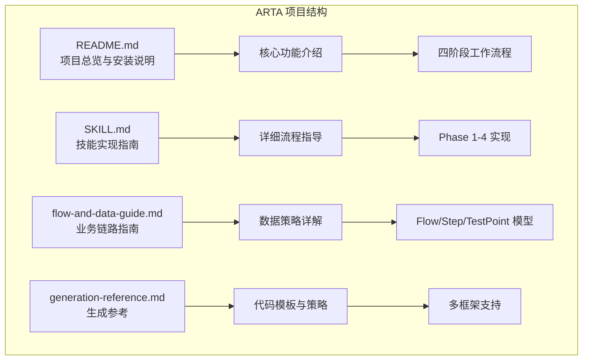

**图表来源**
- [README.md:1-176](file://README.md#L1-L176)
- [SKILL.md:1-443](file://SKILL.md#L1-L443)
- [flow-and-data-guide.md:1-218](file://flow-and-data-guide.md#L1-L218)
- [generation-reference.md:1-304](file://generation-reference.md#L1-L304)

**章节来源**
- [README.md:1-176](file://README.md#L1-L176)
- [SKILL.md:1-443](file://SKILL.md#L1-L443)

## 核心组件

### 四阶段测试工作流程

ARTA 采用经过验证的四阶段测试工作流程，确保测试过程的系统性和完整性：

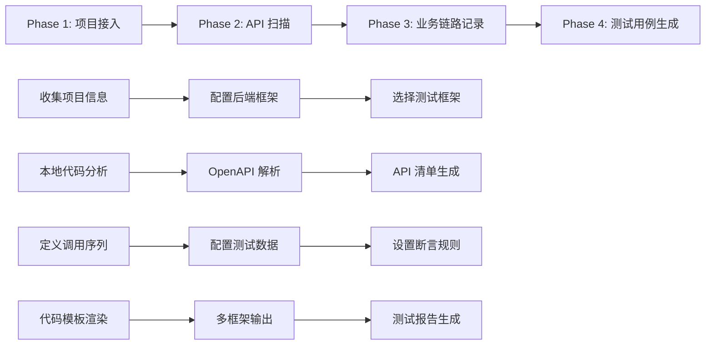

**图表来源**
- [README.md:9-12](file://README.md#L9-L12)
- [SKILL.md:12-16](file://SKILL.md#L12-L16)

### 数据存储架构

所有测试相关的数据都统一存储在 `arta-data/` 目录下，采用 JSON 格式进行持久化：

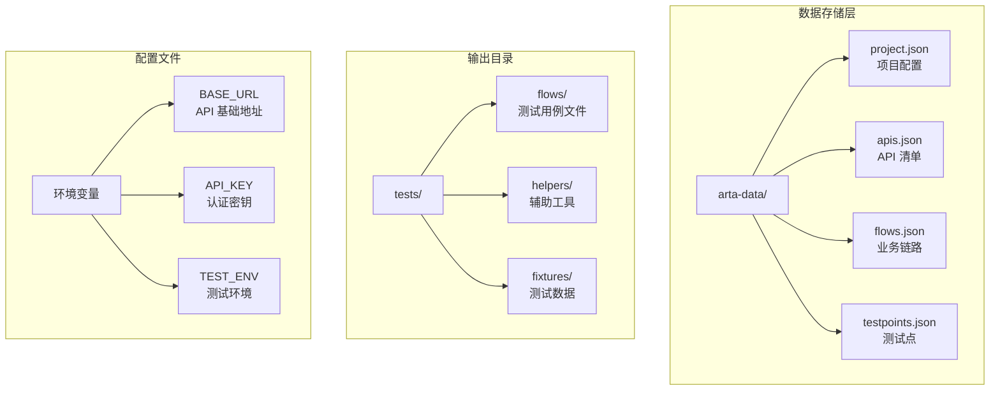

**图表来源**
- [README.md:151-162](file://README.md#L151-L162)
- [SKILL.md:419-431](file://SKILL.md#L419-L431)

**章节来源**
- [README.md:140-162](file://README.md#L140-L162)
- [SKILL.md:419-443](file://SKILL.md#L419-L443)

## 架构概览

### 业务链路数据模型

ARTA 的业务链路采用层次化的数据结构设计，通过 Flow、Step 和 TestPoint 三个核心模型实现完整的业务场景建模：

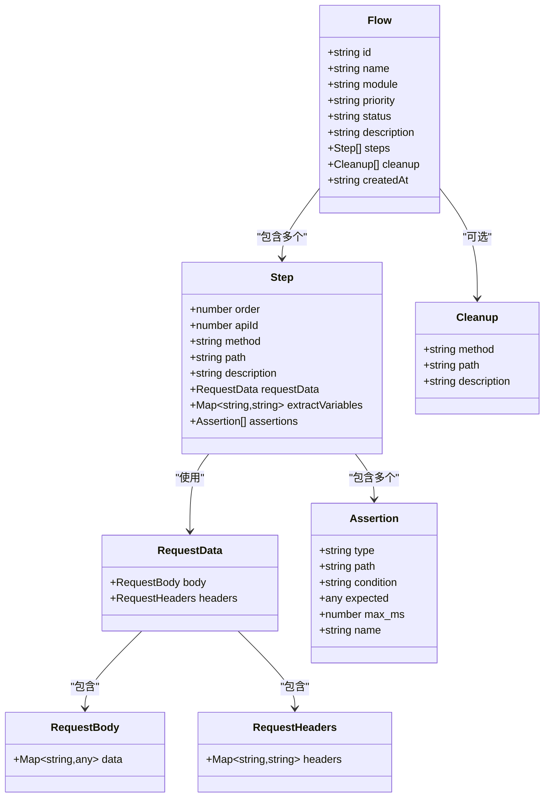

**图表来源**
- [flow-and-data-guide.md:7-75](file://flow-and-data-guide.md#L7-L75)

### 测试数据策略架构

ARTA 支持四种灵活的测试数据类型，每种类型都有其特定的应用场景和实现机制：

```mermaid
graph LR
subgraph "测试数据策略"
A[测试数据源] --> B[固定值]
A --> C[生成数据]
A --> D[引用上游]
A --> E[环境变量]
B --> B1[直接常量]
B --> B2[配置参数]
C --> C1[UUID 生成]
C --> C2[时间戳]
C --> C3[随机数据]
C --> C4[序列生成]
D --> D1[步骤变量]
D --> D2[响应路径]
E --> E1[运行时配置]
E --> E2[环境参数]
end
subgraph "生成函数库"
F[内置函数] --> F1[uuid()]
F --> F2[random_email()]
F --> F3[random_phone()]
F --> F4[faker()]
F --> F5[increment()]
F --> F6[random_string()]
F --> F7[random_int()]
end
C -.-> F
```

**图表来源**
- [flow-and-data-guide.md:77-132](file://flow-and-data-guide.md#L77-L132)
- [SKILL.md:179-191](file://SKILL.md#L179-L191)

**章节来源**
- [flow-and-data-guide.md:5-75](file://flow-and-data-guide.md#L5-L75)
- [SKILL.md:179-191](file://SKILL.md#L179-L191)

## 详细组件分析

### Flow 模型深度解析

Flow 模型是 ARTA 的核心抽象，代表一个完整的业务场景。它不仅包含 API 调用序列，还整合了测试数据策略、断言规则和清理逻辑。

#### Flow 数据结构特征

Flow 模型采用标准化的 JSON 结构，确保跨平台兼容性和可扩展性：

| 字段名 | 类型 | 必填 | 描述 |
|--------|------|------|------|
| id | string | 是 | Flow 唯一标识符 |
| name | string | 是 | Flow 显示名称 |
| module | string | 是 | 所属功能模块 |
| priority | string | 是 | 业务优先级 (P0-P3) |
| status | string | 是 | Flow 状态 (draft/done/deprecated) |
| description | string | 否 | 业务场景描述 |
| steps | Array | 是 | API 调用步骤序列 |
| cleanup | Array | 否 | 清理步骤列表 |
| createdAt | string | 是 | 创建时间戳 |

#### Flow 生命周期管理

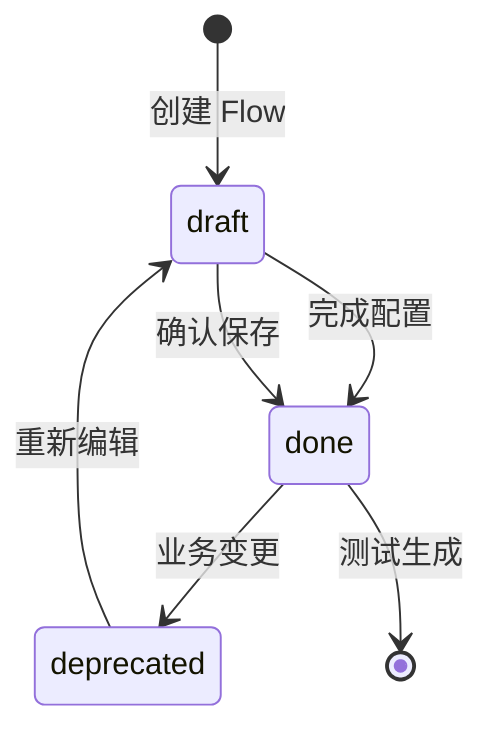

**图表来源**
- [flow-and-data-guide.md:211-218](file://flow-and-data-guide.md#L211-L218)

**章节来源**
- [flow-and-data-guide.md:7-75](file://flow-and-data-guide.md#L7-L75)
- [flow-and-data-guide.md:211-218](file://flow-and-data-guide.md#L211-L218)

### Step 模型详细设计

Step 模型代表业务链路中的单个 API 调用步骤，是实现复杂业务场景的基础单元。

#### Step 核心要素

每个 Step 都包含执行所需的完整信息：

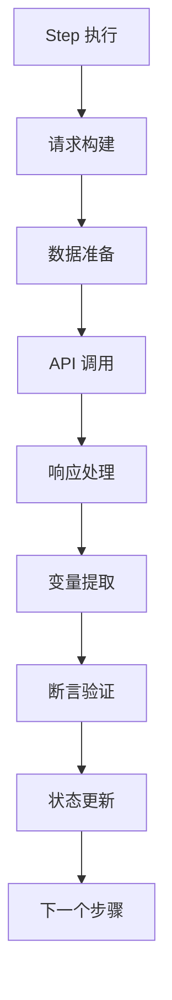

**图表来源**
- [flow-and-data-guide.md:17-63](file://flow-and-data-guide.md#L17-L63)

#### Step 数据流设计

Step 模型实现了数据的单向流动，确保测试的可重现性和可维护性：

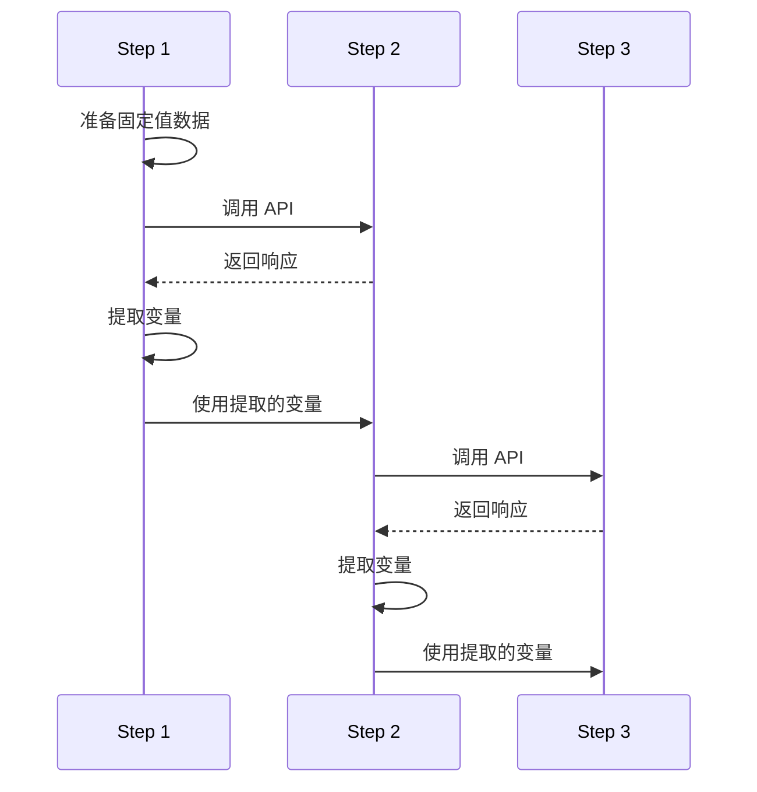

**图表来源**
- [flow-and-data-guide.md:34-61](file://flow-and-data-guide.md#L34-L61)

**章节来源**
- [flow-and-data-guide.md:17-63](file://flow-and-data-guide.md#L17-L63)

### TestPoint 模型与业务场景映射

TestPoint 模型用于将业务需求转化为具体的测试场景，通过关键词匹配实现智能的 API 关联。

#### TestPoint 处理流程

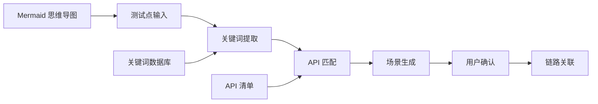

**图表来源**
- [SKILL.md:261-294](file://SKILL.md#L261-L294)

**章节来源**
- [SKILL.md:261-294](file://SKILL.md#L261-L294)

### 四种测试数据类型的实现原理

#### 固定值数据策略

固定值是最简单直接的测试数据类型，适用于已知的测试账号、配置参数或不变的业务数据。

**实现特点：**
- 直接嵌入在 JSON 配置中
- 无需运行时计算
- 适合静态配置和已知数据
- 支持各种数据类型（字符串、数字、布尔值、对象）

#### 生成数据函数库

生成数据是 ARTA 的核心创新，通过丰富的内置函数实现动态测试数据生成。

**内置函数分类：**

| 函数类别 | 函数名称 | 用途 | 示例输出 |
|----------|----------|------|----------|
| 标识符生成 | uuid() | 唯一标识符 | `"a1b2c3d4-..."` |
| 时间戳生成 | timestamp() | 当前时间戳 | `1710180000` |
| 随机数据 | random_email() | 随机邮箱 | `"test_abc123@test.com"` |
| 序列生成 | increment(prefix) | 自增序列 | `"user_001"` |
| 随机字符串 | random_string(N) | N位随机字符串 | `"aB3kF9"` |
| 随机整数 | random_int(min,max) | 范围随机整数 | `42` |
| Faker 数据 | faker(type) | 模拟真实数据 | `"张三"` |

#### 引用上游数据机制

引用上游机制实现了步骤间的数据传递，是构建复杂业务场景的关键。

**引用语法：**
- `${stepN.variable}` - 引用步骤N中 extractVariables 定义的变量
- `${stepN.response.path}` - 直接引用步骤N响应体的 JSON 路径
- `${stepN.response.data[index].field}` - 引用数组元素的字段

**引用规则：**
- 被引用的步骤必须在当前步骤之前执行
- 支持深层 JSON 路径解析
- 自动类型转换和错误处理

#### 环境变量集成

环境变量为测试提供了灵活的配置管理能力，支持不同环境的差异化配置。

**环境变量应用场景：**
- API 基础地址配置
- 认证密钥管理
- 测试环境标识
- 动态参数配置

**引用语法：**
- `$ENV{BASE_URL}` - 获取基础 API 地址
- `$ENV{API_KEY}` - 获取认证密钥
- `$ENV{TEST_ENV}` - 获取测试环境

**章节来源**
- [flow-and-data-guide.md:77-132](file://flow-and-data-guide.md#L77-L132)
- [SKILL.md:179-191](file://SKILL.md#L179-L191)

### 断言规则配置语法

ARTA 支持多种断言类型，每种类型都有明确的配置语法和使用场景。

#### 断言类型与配置

| 断言类型 | 配置语法 | 使用场景 | 示例 |
|----------|----------|----------|------|
| 状态码断言 | `{ "type": "status", "expected": 200 }` | HTTP 响应状态验证 | 验证 200 成功响应 |
| JSONPath 存在断言 | `{ "type": "jsonpath", "path": "$.data.token", "condition": "exists" }` | 关键字段存在性验证 | 验证 token 字段存在 |
| JSONPath 值断言 | `{ "type": "jsonpath", "path": "$.data.status", "condition": "equals", "expected": "active" }` | 字段值精确匹配 | 验证状态为 active |
| JSONPath 包含断言 | `{ "type": "jsonpath", "path": "$.message", "condition": "contains", "expected": "success" }` | 字段值包含验证 | 验证消息包含 success |
| JSONPath 类型断言 | `{ "type": "jsonpath", "path": "$.data.list", "condition": "type", "expected": "array" }` | 数据类型验证 | 验证返回为数组 |
| JSONPath 长度断言 | `{ "type": "jsonpath", "path": "$.data.list", "condition": "length_gte", "expected": 1 }` | 数组长度验证 | 验证至少有1个元素 |
| 响应时间断言 | `{ "type": "response_time", "max_ms": 1000 }` | 性能指标验证 | 验证响应时间 < 1秒 |
| 响应头断言 | `{ "type": "header", "name": "Content-Type", "contains": "application/json" }` | 响应头验证 | 验证 Content-Type |

#### 断言执行流程

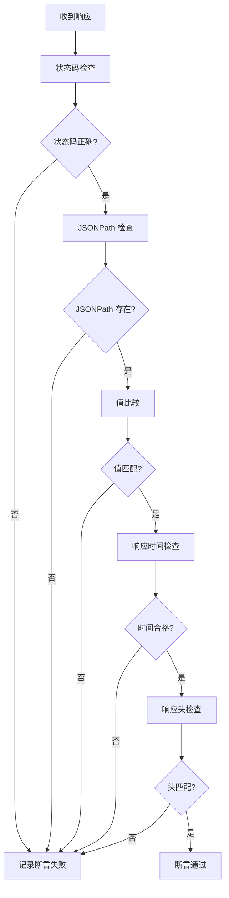

**图表来源**
- [flow-and-data-guide.md:133-145](file://flow-and-data-guide.md#L133-L145)

**章节来源**
- [flow-and-data-guide.md:133-145](file://flow-and-data-guide.md#L133-L145)

### CRUD 接口特殊处理策略

ARTA 对 CRUD（创建、读取、更新、删除）接口提供了专门的处理策略，确保测试覆盖的完整性和有效性。

#### 创建接口测试策略

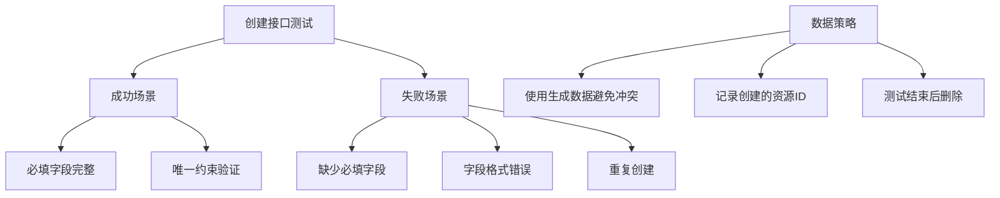

**图表来源**
- [flow-and-data-guide.md:146-159](file://flow-and-data-guide.md#L146-L159)

#### 更新接口测试策略

更新接口测试重点关注数据一致性和权限控制：

**测试场景：**
1. 更新成功 - 有效字段更新
2. 更新失败 - 资源不存在
3. 更新失败 - 无权限访问
4. 部分更新 - 只修改部分字段

**前置条件：** 需要先创建测试资源，然后进行更新操作。

#### 删除接口测试策略

删除接口测试强调数据清理和级联操作验证：

**测试场景：**
1. 删除成功 - 存在的资源
2. 删除失败 - 不存在的资源
3. 删除失败 - 无权限
4. 级联删除验证

**执行时机：** 删除接口通常放在测试最后执行，既验证功能又起到清理作用。

#### 查询接口测试策略

查询接口测试关注数据完整性和边界条件：

**测试场景：**
1. 查询成功 - 有数据的情况
2. 查询成功 - 无数据的空结果
3. 分页查询 - 默认分页行为
4. 条件筛选 - 各种筛选参数组合
5. 查询失败 - 无权限访问

**数据准备：** 先确保有足够的测试数据，再进行查询验证。

**章节来源**
- [flow-and-data-guide.md:146-198](file://flow-and-data-guide.md#L146-L198)

### 数据验证规则与业务约束

ARTA 在数据层面实施多层次的验证规则，确保测试数据的有效性和业务逻辑的正确性。

#### 数据类型验证

系统支持对各种数据类型的验证：
- **字符串验证**：长度限制、格式匹配、字符集约束
- **数值验证**：范围检查、精度控制、符号验证
- **日期时间验证**：格式验证、时区处理、有效期检查
- **布尔值验证**：真值假值检查

#### 业务规则约束

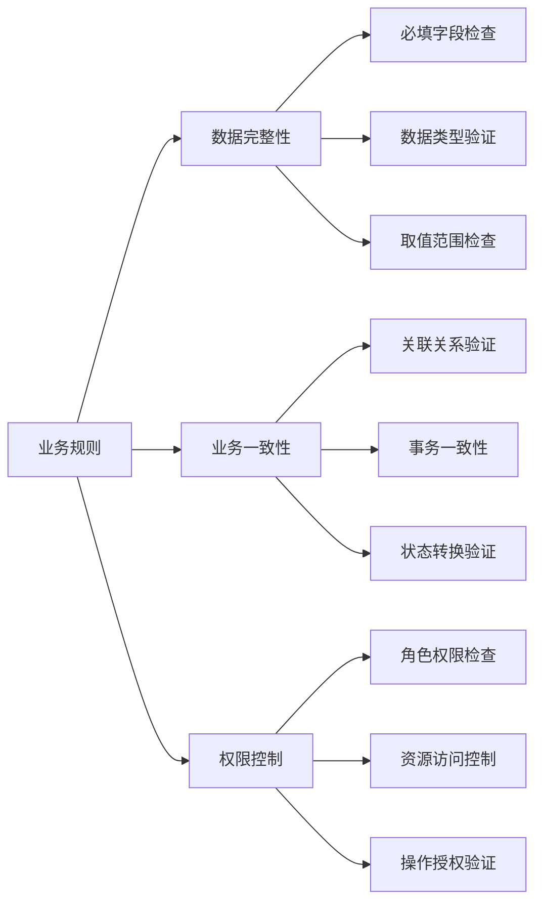

#### 数据生命周期管理

ARTA 实现了完整的数据生命周期管理：

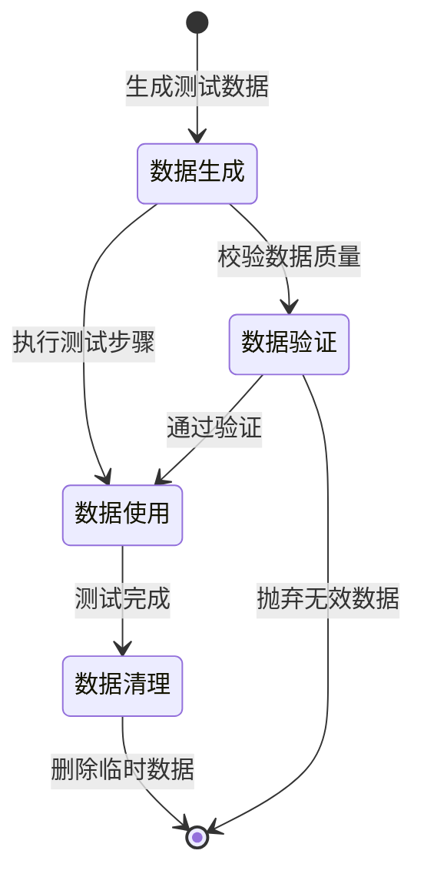

**图表来源**
- [flow-and-data-guide.md:146-198](file://flow-and-data-guide.md#L146-L198)

## 依赖分析

### 技术栈支持矩阵

ARTA 支持多种主流技术栈，通过统一的抽象层实现跨语言的测试生成能力。

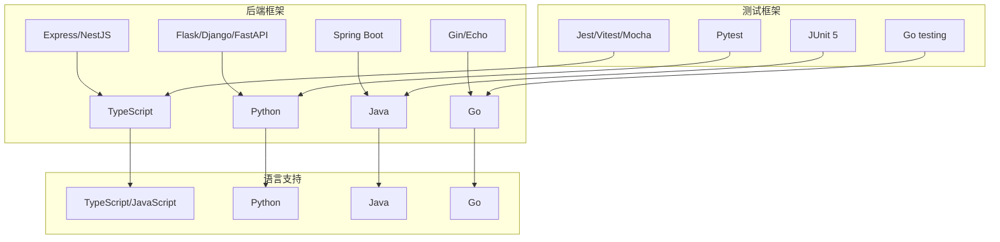

**图表来源**
- [README.md:22-30](file://README.md#L22-L30)
- [SKILL.md:312-321](file://SKILL.md#L312-L321)

### 外部依赖关系

ARTA 的外部依赖主要集中在测试框架和 HTTP 客户端库上：

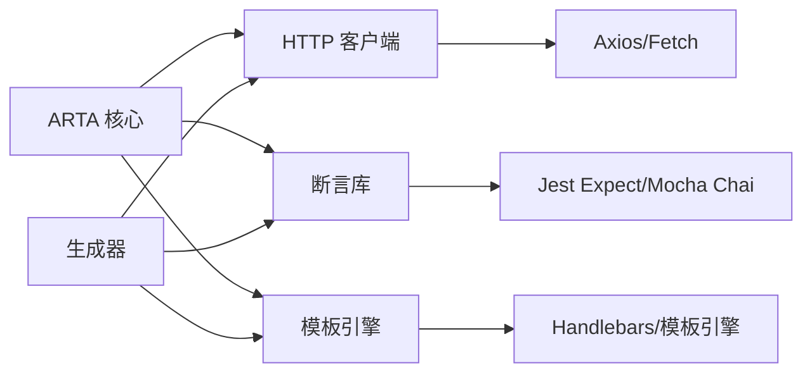

**图表来源**
- [generation-reference.md:7-216](file://generation-reference.md#L7-L216)

**章节来源**
- [README.md:22-30](file://README.md#L22-L30)
- [generation-reference.md:7-216](file://generation-reference.md#L7-L216)

## 性能考虑

### 测试执行优化

ARTA 在设计时充分考虑了测试执行的性能优化：

1. **并发执行策略**：非依赖步骤可并行执行，减少总测试时间
2. **缓存机制**：重复使用的测试数据可缓存，避免重复生成
3. **连接池管理**：HTTP 客户端连接复用，降低连接开销
4. **内存管理**：及时释放测试过程中产生的中间数据

### 生成效率优化

代码生成过程采用模板渲染和批量处理技术：

1. **模板复用**：相同框架的测试代码共享模板结构
2. **增量生成**：只重新生成变更的链路，保持历史稳定性
3. **并行处理**：多链路并行生成，提高整体效率
4. **缓存策略**：生成结果缓存，支持快速导出和重用

## 故障排除指南

### 常见问题诊断

#### API 扫描失败

**症状：** API 清单为空或不完整
**可能原因：**
- 项目路径配置错误
- 框架识别失败
- 代码分析权限不足
- OpenAPI 文件格式错误

**解决方案：**
1. 验证项目路径的可访问性
2. 检查 package.json/requirements.txt 等配置文件
3. 确认源代码目录结构符合框架约定
4. 验证 OpenAPI 文件的语法正确性

#### 业务链路执行失败

**症状：** 测试步骤执行中断或断言失败
**可能原因：**
- 步骤间数据依赖缺失
- 断言条件过于严格
- 环境配置不正确
- API 接口变更

**解决方案：**
1. 检查步骤执行顺序和依赖关系
2. 调整断言条件的宽松程度
3. 验证环境变量配置
4. 更新 API 调用参数

#### 生成代码不符合预期

**症状：** 生成的测试代码存在语法错误或逻辑缺陷
**可能原因：**
- 模板版本不兼容
- 生成参数配置错误
- 框架支持不完整
- 代码风格冲突

**解决方案：**
1. 检查生成器版本兼容性
2. 验证项目配置的准确性
3. 确认目标框架的支持状态
4. 调整代码生成的配置选项

**章节来源**
- [SKILL.md:434-443](file://SKILL.md#L434-L443)

## 结论

ARTA 通过其精心设计的业务链路和数据策略，为 API 自动化测试提供了一个完整而高效的解决方案。其核心优势体现在：

1. **统一抽象**：通过 Flow、Step、TestPoint 三个核心模型，实现了业务场景的标准化建模
2. **灵活数据策略**：四种测试数据类型满足不同场景的需求，支持复杂的数据传递和生成
3. **智能断言系统**：多类型的断言规则确保测试结果的准确性和可靠性
4. **跨平台兼容**：支持多种技术栈和测试框架，适应不同的开发环境
5. **自动化程度高**：从项目接入到测试生成的完整流程，显著提升测试效率

ARTA 不仅是一个工具，更是一种测试方法论的体现。它通过结构化的数据管理和智能的业务场景建模，帮助测试团队建立可持续的测试体系，为软件质量保障提供强有力的支持。

## 附录

### 最佳实践建议

#### 业务链路设计最佳实践

1. **模块化组织**：按照业务功能模块划分链路，便于维护和复用
2. **优先级管理**：合理设置 P0-P3 优先级，确保核心业务得到充分测试
3. **状态管理**：及时更新链路状态，避免使用草稿状态的链路生成测试
4. **清理策略**：为每个写入操作设计对应的清理步骤

#### 测试数据管理最佳实践

1. **数据隔离**：使用生成数据避免测试间的相互影响
2. **环境适配**：通过环境变量管理不同环境的配置差异
3. **数据验证**：在测试前验证测试数据的有效性
4. **清理机制**：确保测试结束后恢复测试环境

#### 断言策略最佳实践

1. **多层次断言**：结合状态码、响应体、响应头等多个维度
2. **边界条件**：覆盖正常、异常、边界等不同场景
3. **性能监控**：包含响应时间等性能指标的断言
4. **可维护性**：断言规则应清晰易懂，便于后续维护

### 配置示例参考

#### 基础项目配置

```json
{
  "name": "项目名称",
  "framework": "Express",
  "testFramework": "jest",
  "apiSource": { "type": "local", "path": "/path/to/project" },
  "createdAt": "ISO时间戳"
}
```

#### 完整业务链路示例

```json
{
  "flows": [
    {
      "id": "flow-001",
      "name": "用户下单流程",
      "module": "订单",
      "priority": "P0",
      "status": "done",
      "description": "用户从浏览商品到完成下单的完整流程",
      "steps": [
        {
          "order": 1,
          "apiId": 1,
          "method": "POST",
          "path": "/api/auth/login",
          "description": "用户登录",
          "requestData": {
            "body": {
              "username": "testuser001",
              "password": "Test@123456"
            }
          },
          "extractVariables": {
            "token": "$.data.token",
            "userId": "$.data.user.id"
          },
          "assertions": [
            { "type": "status", "expected": 200 },
            { "type": "jsonpath", "path": "$.data.token", "condition": "exists" }
          ]
        }
      ],
      "cleanup": [
        {
          "method": "DELETE",
          "path": "/api/orders/${orderId}",
          "description": "清理测试订单"
        }
      ],
      "createdAt": "2026-03-11T12:00:00Z"
    }
  ]
}
```

**章节来源**
- [flow-and-data-guide.md:7-75](file://flow-and-data-guide.md#L7-L75)
- [SKILL.md:67-75](file://SKILL.md#L67-L75)