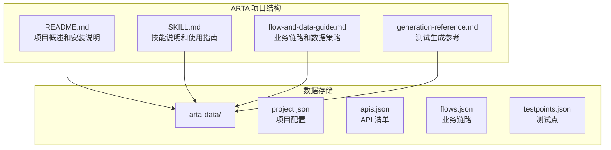
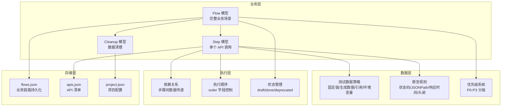
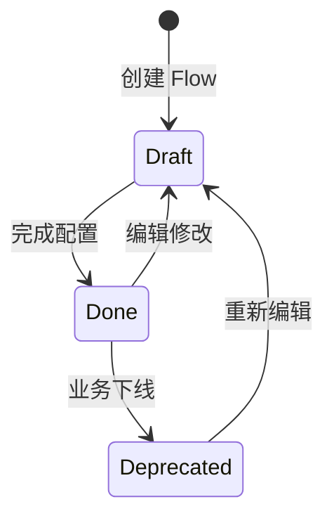
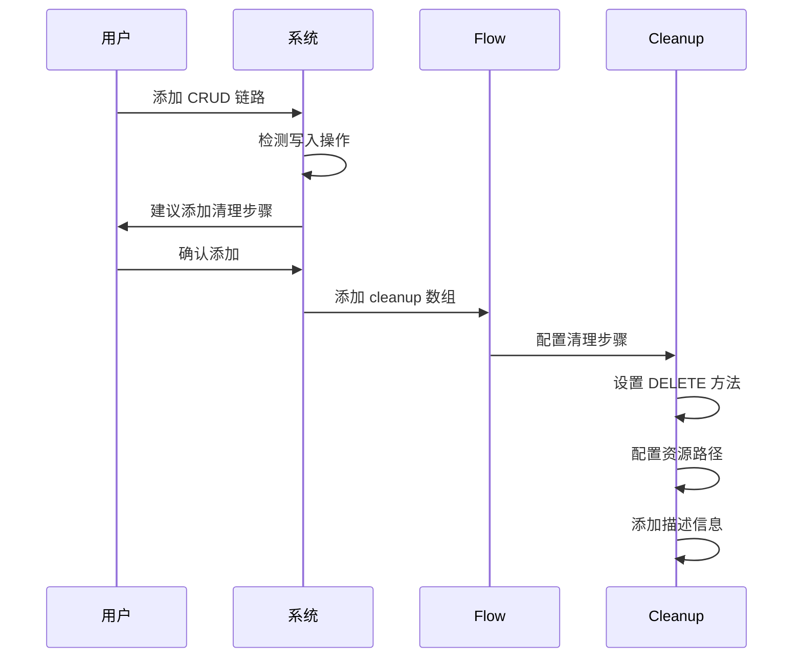
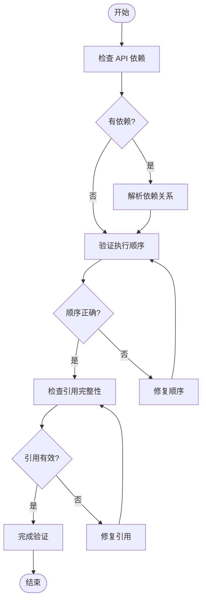

# 业务链路数据结构

<cite>
**本文档引用的文件**
- [README.md](file://README.md)
- [SKILL.md](file://SKILL.md)
- [flow-and-data-guide.md](file://flow-and-data-guide.md)
- [generation-reference.md](file://generation-reference.md)
</cite>

## 目录
1. [简介](#简介)
2. [项目结构](#项目结构)
3. [核心组件](#核心组件)
4. [架构概览](#架构概览)
5. [详细组件分析](#详细组件分析)
6. [依赖关系分析](#依赖关系分析)
7. [性能考虑](#性能考虑)
8. [故障排除指南](#故障排除指南)
9. [结论](#结论)

## 简介

ARTA（Automation Regression Test Assistant）是一个端到端 API 自动化测试流程引导工具，专门设计用于帮助开发团队从项目接入到测试用例生成的完整测试生命周期管理。本文档深入解释了 ARTA 业务链路数据结构的核心设计，特别是 Flow 模型和 Step 模型的完整结构。

ARTA 的核心价值在于其系统化的业务链路记录能力，通过标准化的数据结构定义，能够精确描述复杂的 API 调用序列、测试数据策略和断言规则。这种结构化的方法不仅提高了测试用例的可维护性和可复用性，还为自动化测试生成提供了坚实的基础。

## 项目结构

ARTA 项目采用简洁而功能明确的文件组织结构，主要包含四个核心文档文件：



**图表来源**
- [README.md: 151-162:151-162](file://README.md#L151-L162)
- [SKILL.md: 419-431:419-431](file://SKILL.md#L419-L431)

**章节来源**
- [README.md: 1-176:1-176](file://README.md#L1-L176)
- [SKILL.md: 419-431:419-431](file://SKILL.md#L419-L431)

## 核心组件

ARTA 的业务链路数据结构围绕三个核心组件构建：Flow（业务流）、Step（步骤）和 Cleanup（清理）。这些组件共同构成了完整的测试场景描述体系。

### Flow 模型结构

Flow 模型代表一个完整的业务场景，包含以下关键字段：

| 字段名 | 类型 | 必填 | 描述 | 示例 |
|--------|------|------|------|------|
| id | string | 是 | 流标识符，全局唯一 | "flow-001" |
| name | string | 是 | 流名称，人类可读 | "用户下单流程" |
| module | string | 是 | 所属模块分类 | "订单" |
| priority | string | 是 | 业务优先级 | "P0" |
| status | string | 是 | 流状态 | "done" |
| description | string | 否 | 详细描述 | "用户从浏览商品到完成下单的完整流程" |
| steps | Step[] | 是 | 步骤数组，按顺序执行 | [Step1, Step2, ...] |
| cleanup | Cleanup[] | 否 | 清理步骤数组 | [Cleanup1] |
| createdAt | string | 否 | 创建时间戳 | "2026-03-11T12:00:00Z" |

### Step 模型结构

Step 模型描述单个 API 调用步骤，包含以下属性：

| 属性名 | 类型 | 必填 | 描述 | 示例 |
|--------|------|------|------|------|
| order | number | 是 | 执行顺序，从1开始递增 | 1 |
| apiId | number | 是 | 对应 API 清单中的索引 | 1 |
| method | string | 是 | HTTP 方法 | "POST" |
| path | string | 是 | API 路径 | "/api/auth/login" |
| description | string | 否 | 步骤描述 | "用户登录" |
| requestData | object | 否 | 请求数据配置 | {body: {...}, headers: {...}} |
| extractVariables | object | 否 | 变量提取配置 | {"token": "$.data.token"} |
| assertions | Assertion[] | 否 | 断言规则数组 | [{type: "status", expected: 200}] |

### Cleanup 模型结构

Cleanup 模型专门处理测试数据清理，确保测试环境的整洁：

| 属性名 | 类型 | 必填 | 描述 | 示例 |
|--------|------|------|------|------|
| method | string | 是 | HTTP 方法 | "DELETE" |
| path | string | 是 | 清理资源路径 | "/api/orders/${orderId}" |
| description | string | 否 | 清理描述 | "清理测试订单" |

**章节来源**
- [flow-and-data-guide.md: 7-75:7-75](file://flow-and-data-guide.md#L7-L75)

## 架构概览

ARTA 的业务链路架构采用分层设计，从高层概念到具体实现形成了清晰的层次结构：



**图表来源**
- [flow-and-data-guide.md: 146-218:146-218](file://flow-and-data-guide.md#L146-L218)
- [SKILL.md: 143-257:143-257](file://SKILL.md#L143-L257)

## 详细组件分析

### Flow 模型深度解析

Flow 模型是 ARTA 的核心抽象，它将复杂的业务场景封装为可执行的测试脚本。每个 Flow 实例都包含完整的业务逻辑描述和执行元数据。

#### 字段语义详解

**id 字段**
- 全局唯一标识符，用于区分不同的业务场景
- 采用 "flow-{编号}" 的命名约定
- 在数据存储和引用中起到关键作用

**name 字段**
- 人类可读的业务场景名称
- 应该简洁明了地描述业务目标
- 影响生成的测试文件命名和报告展示

**module 字段**
- 业务模块分类，用于组织和过滤
- 与 API 清单中的模块保持一致
- 支持按模块维度的测试管理和报告

**priority 字段**
- 业务优先级标识，支持 P0-P3 四级分类
- P0：核心业务，宕机影响收入
- P1：重要功能，影响用户体验
- P2：一般功能，可降级
- P3：边缘功能

**status 字段**
- 流状态管理，支持 draft、done、deprecated 三种状态
- draft：正在编辑，API 序列或数据未完整
- done：完成，可用于生成测试用例
- deprecated：已弃用，业务下线或重构

#### Flow 生命周期管理



**图表来源**
- [flow-and-data-guide.md: 211-218:211-218](file://flow-and-data-guide.md#L211-L218)

**章节来源**
- [flow-and-data-guide.md: 10-16:10-16](file://flow-and-data-guide.md#L10-L16)
- [flow-and-data-guide.md: 211-218:211-218](file://flow-and-data-guide.md#L211-L218)

### Step 模型详细设计

Step 模型是 Flow 的基本执行单元，负责描述单个 API 调用的所有细节。

#### Step 结构完整性

每个 Step 都必须包含以下核心信息：
- **order**：确定执行顺序的关键字段
- **apiId**：关联到 API 清单的标识
- **method** 和 **path**：完整的 API 调用信息
- **requestData**：请求数据配置
- **assertions**：断言规则定义

#### requestData 配置策略

requestData 支持多种数据配置方式：

```mermaid
graph LR
A[requestData] --> B[body<br/>请求体数据]
A --> C[headers<br/>请求头配置]
A --> D[params<br/>查询参数]
B --> E[固定值<br/>直接指定]
B --> F[生成数据<br/>{{函数()}}]
B --> G[引用上游<br/>${步骤.字段}]
B --> H[环境变量<br/>$ENV{变量}]
C --> I[认证令牌<br/>Authorization]
C --> J[内容类型<br/>Content-Type]
C --> K[自定义头<br/>X-Custom-Header]
```

**图表来源**
- [flow-and-data-guide.md: 77-132:77-132](file://flow-and-data-guide.md#L77-L132)

#### extractVariables 数据提取机制

extractVariables 允许从响应中提取关键数据供后续步骤使用：

| 提取类型 | 语法 | 用途 | 示例 |
|----------|------|------|------|
| JSONPath | "$.data.token" | 提取响应字段 | "$.data.user.id" |
| 变量名 | "token" | 自定义变量名 | "orderId" |
| 上游引用 | "${step1.token}" | 引用其他步骤变量 | "${login.response.token}" |

**章节来源**
- [flow-and-data-guide.md: 30-37:30-37](file://flow-and-data-guide.md#L30-L37)
- [flow-and-data-guide.md: 108-122:108-122](file://flow-and-data-guide.md#L108-L122)

### Cleanup 清理步骤设计理念

Cleanup 机制体现了 ARTA 对测试环境管理的深度思考，确保测试不会产生副作用。

#### 清理策略原则

**自动建议机制**
- 当检测到 CRUD 写入操作时，系统会自动建议添加清理步骤
- 特别关注 CREATE 操作产生的测试数据
- 支持用户确认或跳过清理步骤

**资源清理优先级**
- DELETE 操作通常作为清理步骤
- 优先清理最近创建的资源
- 支持批量清理多个相关资源

#### Cleanup 实现方式



**图表来源**
- [SKILL.md: 248-255:248-255](file://SKILL.md#L248-L255)

**章节来源**
- [SKILL.md: 248-255:248-255](file://SKILL.md#L248-L255)

### 数据验证规则和约束条件

ARTA 实现了严格的字段验证机制，确保数据结构的完整性和一致性。

#### 字段类型检查

| 字段 | 必填 | 类型 | 验证规则 |
|------|------|------|----------|
| id | 是 | string | 非空，唯一性检查 |
| name | 是 | string | 非空，长度限制 |
| module | 是 | string | 非空，必须存在于 API 清单 |
| priority | 是 | string | P0/P1/P2/P3 之一 |
| status | 是 | string | draft/done/deprecated 之一 |
| steps | 是 | array | 非空，至少包含一个 Step |
| order | 是 | number | 正整数，严格递增 |
| apiId | 是 | number | 正整数，对应 API 清单索引 |
| method | 是 | string | HTTP 方法枚举值 |
| path | 是 | string | 有效的 URL 路径格式 |

#### 必填字段验证

系统在保存 Flow 时执行以下验证：
1. **完整性检查**：所有必需字段必须存在且非空
2. **类型检查**：字段类型必须符合预期
3. **范围检查**：枚举值必须在允许范围内
4. **依赖检查**：引用的上游步骤必须存在且顺序正确

#### 数据一致性保证

**步骤顺序验证**
- order 字段必须严格递增
- 不能存在重复的 order 值
- 必须连续（1, 2, 3, ...）

**引用完整性验证**
- ${stepN.variable} 中的 N 必须小于当前步骤号
- 被引用的变量必须在 extractVariables 中定义
- JSONPath 路径必须有效

**章节来源**
- [flow-and-data-guide.md: 118-122:118-122](file://flow-and-data-guide.md#L118-L122)

## 依赖关系分析

ARTA 的业务链路系统建立了复杂的依赖关系网络，这些关系决定了测试执行的正确性和效率。

### 步骤间依赖关系

```mermaid
graph TD
A[Step 1: 用户登录] --> B[Step 2: 获取商品列表]
B --> C[Step 3: 创建订单]
C --> D[Step 4: 支付订单]
subgraph "数据传递"
E[Token<br/>${step1.token}]
F[Product ID<br/>${step2.response.data[0].id}]
G[Order ID<br/>${step3.response.data.orderId}]
end
A --> E
B --> F
C --> G
D --> G
```

**图表来源**
- [flow-and-data-guide.md: 17-63:17-63](file://flow-and-data-guide.md#L17-L63)

### 执行顺序控制机制

ARTA 通过多种机制确保步骤的正确执行顺序：

**order 字段控制**
- 每个 Step 都有一个 order 数字
- 系统按照 order 从小到大执行
- 支持非连续的步骤编号（1, 3, 5）

**依赖关系检查**
- 系统自动检测步骤间的依赖关系
- 确保被引用的上游步骤先执行
- 防止循环依赖的发生

**条件执行支持**
- 支持基于条件的步骤执行
- 可以根据上游步骤的结果决定是否执行某些步骤
- 提供灵活的分支控制能力

### 业务链路依赖管理



**图表来源**
- [flow-and-data-guide.md: 118-122:118-122](file://flow-and-data-guide.md#L118-L122)

**章节来源**
- [flow-and-data-guide.md: 17-63:17-63](file://flow-and-data-guide.md#L17-L63)

## 性能考虑

ARTA 在设计时充分考虑了性能优化，特别是在大规模业务链路场景下的执行效率。

### 数据结构优化

**内存使用优化**
- Flow 结构采用扁平化设计，减少嵌套层级
- Step 数组按顺序存储，支持快速遍历
- Cleanup 数组可选，避免不必要的内存占用

**序列化性能**
- JSON 格式便于快速序列化和反序列化
- 字段名短小精悍，减少存储空间
- 支持增量更新，避免全量重写

### 执行效率优化

**并行执行支持**
- 非依赖步骤可以并行执行
- 系统自动识别可并行的步骤组合
- 提高整体执行效率

**缓存机制**
- API 清单缓存，避免重复解析
- 断言规则缓存，提高验证速度
- 测试数据生成缓存，减少重复计算

## 故障排除指南

### 常见问题诊断

**步骤执行失败**
- 检查 API 端点是否可达
- 验证请求数据格式是否正确
- 确认认证信息是否有效

**数据引用错误**
- 确认上游步骤的 order 值正确
- 检查 extractVariables 是否正确定义
- 验证 JSONPath 表达式是否有效

**清理步骤失败**
- 检查资源是否已被删除
- 确认权限是否足够
- 验证清理路径是否正确

### 调试技巧

**逐步验证**
- 逐个执行步骤，定位失败点
- 使用最小化数据集进行测试
- 检查网络连接和代理设置

**日志分析**
- 查看详细的执行日志
- 分析请求和响应内容
- 监控系统资源使用情况

**章节来源**
- [SKILL.md: 434-443:434-443](file://SKILL.md#L434-L443)

## 结论

ARTA 的业务链路数据结构设计体现了现代测试自动化工具的最佳实践。通过标准化的 Flow、Step 和 Cleanup 模型，ARTA 为复杂的 API 测试场景提供了清晰、可维护和可扩展的解决方案。

该数据结构的核心优势在于：

1. **完整性**：涵盖了从 API 调用到数据清理的完整测试生命周期
2. **灵活性**：支持复杂的业务场景和多样的数据策略
3. **可维护性**：清晰的结构和严格的验证机制
4. **可扩展性**：模块化设计支持未来功能扩展

随着 ARTA 在实际项目中的应用，这套数据结构将继续演进，为 API 自动化测试领域提供更加完善的解决方案。