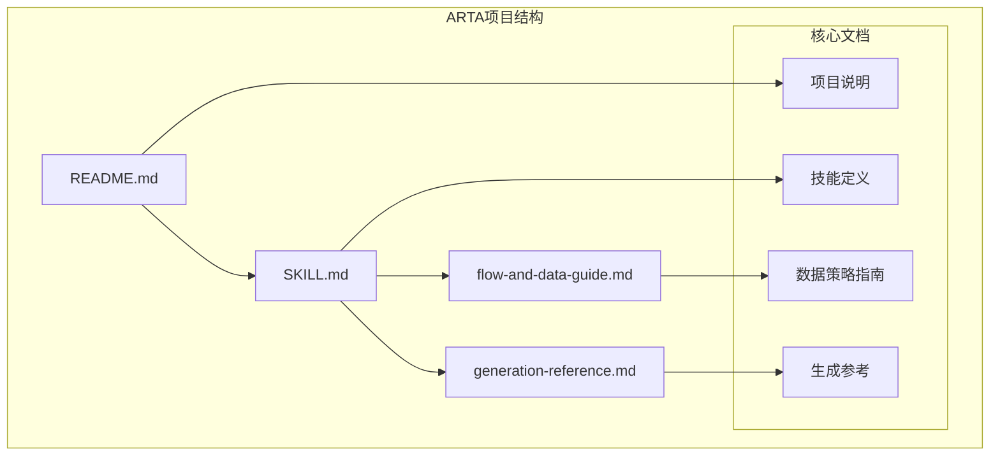
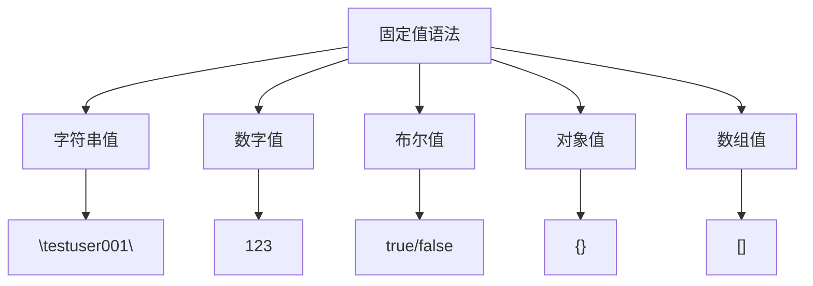
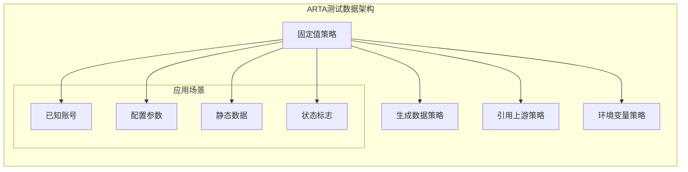
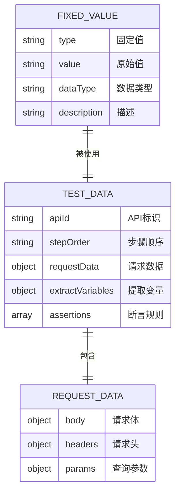
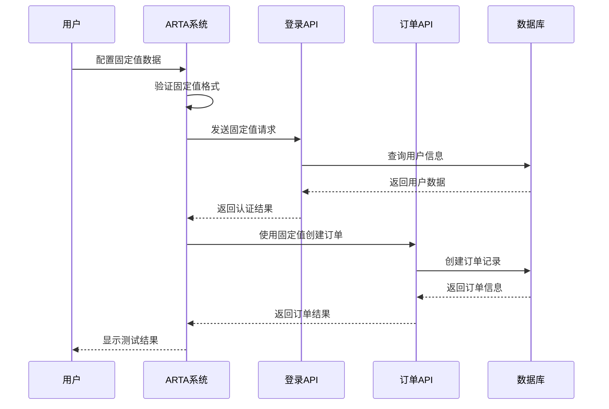
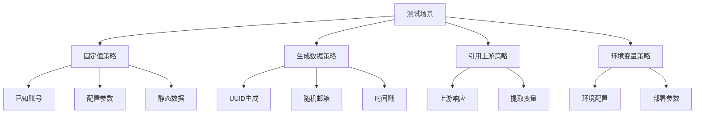
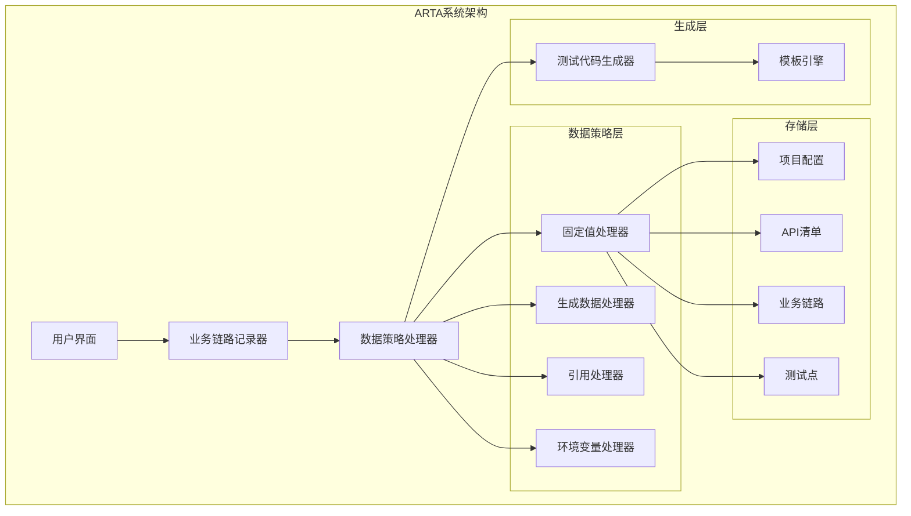
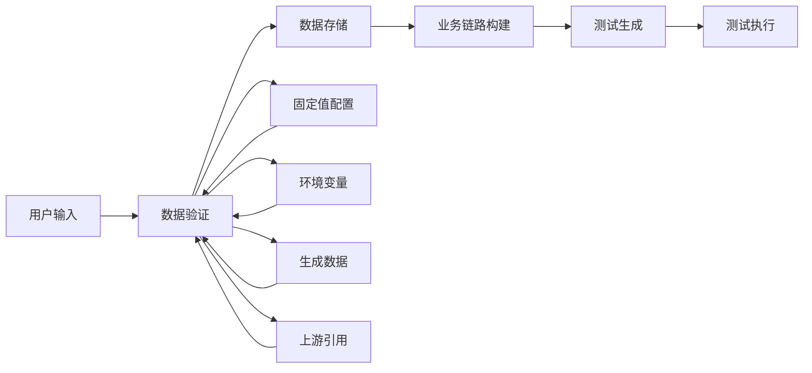

# 固定值策略

<cite>
**本文档引用的文件**
- [README.md](file://README.md)
- [SKILL.md](file://SKILL.md)
- [flow-and-data-guide.md](file://flow-and-data-guide.md)
- [generation-reference.md](file://generation-reference.md)
</cite>

## 目录
1. [简介](#简介)
2. [项目结构](#项目结构)
3. [核心组件](#核心组件)
4. [架构概览](#架构概览)
5. [详细组件分析](#详细组件分析)
6. [依赖关系分析](#依赖关系分析)
7. [性能考虑](#性能考虑)
8. [故障排除指南](#故障排除指南)
9. [结论](#结论)
10. [附录](#附录)

## 简介

ARTA（Automation Regression Test Assistant）是一个端到端 API 自动化测试流程引导工具，专门设计用于帮助开发团队从项目接入到测试用例生成的完整测试生命周期管理。本文档专注于ARTA中的固定值测试数据策略，这是一个关键的数据管理机制，允许测试工程师使用预定义的常量值来驱动测试执行。

固定值策略是ARTA四种数据类型之一，它直接指定常量值，适用于已知的测试账号、配置参数和静态数据场景。这种策略为测试提供了稳定性和可预测性，特别适合需要确定性结果的测试场景。

## 项目结构

ARTA项目采用模块化的文档结构，围绕测试工作流程的不同阶段组织内容：



**图表来源**
- [README.md:1-176](file://README.md#L1-L176)
- [SKILL.md:1-443](file://SKILL.md#L1-L443)

**章节来源**
- [README.md:1-176](file://README.md#L1-L176)
- [SKILL.md:1-443](file://SKILL.md#L1-L443)

## 核心组件

### 固定值策略概述

固定值策略是ARTA测试数据管理的核心组成部分，它允许直接指定常量值作为测试数据。这种策略具有以下特点：

- **稳定性**：提供可预测的结果，便于调试和问题重现
- **简单性**：语法直观，易于理解和维护
- **确定性**：每次执行都产生相同的结果
- **适用性**：特别适合测试已知的系统状态和配置

### 固定值的应用场景

固定值策略适用于以下典型场景：

1. **已知测试账号**：使用固定的用户名和密码进行认证测试
2. **配置参数**：静态的系统配置值，如分页参数、状态标志等
3. **静态数据**：不随时间变化的测试数据，如枚举值、常量标识符等
4. **环境标识**：固定的环境变量值，如测试环境标识

### 固定值语法规范

固定值的语法极其简单，直接使用JSON值的形式：



**图表来源**
- [flow-and-data-guide.md:83-90](file://flow-and-data-guide.md#L83-L90)

**章节来源**
- [flow-and-data-guide.md:79-90](file://flow-and-data-guide.md#L79-L90)

## 架构概览

ARTA的固定值策略在整个测试数据管理架构中扮演着基础角色，与其它三种数据策略协同工作：



**图表来源**
- [SKILL.md:183-188](file://SKILL.md#L183-L188)
- [flow-and-data-guide.md:79-90](file://flow-and-data-guide.md#L79-L90)

### 数据策略对比

ARTA支持四种数据策略，每种都有其特定的用途和优势：

| 策略类型 | 语法 | 示例 | 适用场景 | 优点 | 局限性 |
|---------|------|------|----------|--------|--------|
| 固定值 | 直接写值 | `"testuser001"` | 已知账号、配置参数 | 简单、稳定、可预测 | 缺乏灵活性、可能冲突 |
| 生成数据 | `{{函数()}}` | `{{uuid()}}` | 唯一标识、随机数据 | 灵活、避免冲突 | 复杂度较高 |
| 引用上游 | `${步骤.字段}` | `${login.response.token}` | 跨步骤数据传递 | 实现复杂流程 | 依赖性强 |
| 环境变量 | `$ENV{变量}` | `$ENV{BASE_URL}` | 环境配置 | 灵活部署 | 配置管理 |

**章节来源**
- [SKILL.md:183-191](file://SKILL.md#L183-L191)
- [README.md:142-149](file://README.md#L142-L149)

## 详细组件分析

### 固定值数据结构

固定值在ARTA的内部数据结构中以JSON对象的形式存储和使用：



**图表来源**
- [flow-and-data-guide.md:7-75](file://flow-and-data-guide.md#L7-L75)

### 固定值配置示例

以下是固定值在不同场景下的配置示例：

#### 用户名配置
```json
{
  "username": "testuser001",
  "password": "Test@123456"
}
```

#### 页面参数配置
```json
{
  "page": 1,
  "size": 10,
  "sort": "created_at",
  "order": "desc"
}
```

#### 状态标志配置
```json
{
  "status": "active",
  "isVerified": true,
  "isActive": false,
  "role": "customer"
}
```

#### 复合数据配置
```json
{
  "filter": {
    "category": "electronics",
    "minPrice": 100,
    "maxPrice": 1000
  },
  "options": ["includePromotions", "includeWarranty"]
}
```

**章节来源**
- [flow-and-data-guide.md:83-90](file://flow-and-data-guide.md#L83-L90)

### 固定值在业务链路中的应用

固定值策略在完整的业务链路中发挥着重要作用：



**图表来源**
- [SKILL.md:193-205](file://SKILL.md#L193-L205)

**章节来源**
- [SKILL.md:193-205](file://SKILL.md#L193-L205)

### 固定值与生成数据的组合使用

在复杂的测试场景中，固定值通常与其他数据策略结合使用：



**图表来源**
- [flow-and-data-guide.md:92-131](file://flow-and-data-guide.md#L92-L131)

**章节来源**
- [flow-and-data-guide.md:92-131](file://flow-and-data-guide.md#L92-L131)

## 依赖关系分析

固定值策略在整个ARTA系统中的依赖关系如下：



**图表来源**
- [SKILL.md:419-431](file://SKILL.md#L419-L431)

### 数据流依赖

固定值策略的数据流依赖关系：



**图表来源**
- [flow-and-data-guide.md:77-145](file://flow-and-data-guide.md#L77-L145)

**章节来源**
- [flow-and-data-guide.md:77-145](file://flow-and-data-guide.md#L77-L145)

## 性能考虑

固定值策略在性能方面具有以下特点：

### 优势
- **执行速度快**：无需计算或查询，直接使用预定义值
- **内存占用低**：存储简单的JSON值，内存开销最小
- **可预测性好**：便于性能测试和基准测试
- **缓存友好**：相同的值可以被多次复用

### 局限性
- **扩展性差**：大量固定值可能导致配置文件臃肿
- **维护成本高**：需要手动更新多个地方的值
- **并发冲突**：多个测试同时使用相同值可能产生冲突
- **环境适应性差**：难以适应不同的测试环境

## 故障排除指南

### 常见配置错误

#### 1. 数据类型不匹配
**问题**：固定值类型与API期望不符
**解决方案**：检查API文档，确保数据类型正确

#### 2. 值范围错误
**问题**：固定值超出API限制
**解决方案**：调整值的范围或使用生成数据

#### 3. 缺少必需字段
**问题**：固定值配置不完整
**解决方案**：检查API请求结构，补充必需字段

#### 4. 格式错误
**问题**：JSON格式不正确
**解决方案**：使用JSON验证工具检查格式

### 最佳实践建议

#### 1. 值的设计原则
- **语义明确**：使用有意义的值，便于理解和维护
- **边界安全**：避免使用可能触发边界条件的值
- **兼容性考虑**：确保值在不同环境中都能正常工作

#### 2. 组织管理
- **分类存储**：将相关的固定值组织在一起
- **版本控制**：使用版本控制系统跟踪变更
- **文档记录**：为重要的固定值添加注释说明

#### 3. 测试策略
- **场景覆盖**：确保固定值能够覆盖主要的测试场景
- **异常处理**：考虑固定值在异常情况下的表现
- **性能测试**：验证固定值对测试性能的影响

**章节来源**
- [flow-and-data-guide.md:146-218](file://flow-and-data-guide.md#L146-L218)

## 结论

ARTA的固定值策略为API自动化测试提供了稳定可靠的基础数据管理机制。通过直接指定常量值，测试工程师能够获得可预测的结果和简化的测试配置。然而，固定值策略也有其局限性，特别是在需要灵活性和多样性的测试场景中。

在实际使用中，建议将固定值策略与其他数据策略（生成数据、引用上游、环境变量）结合使用，以达到最佳的测试效果。通过合理的数据策略组合，可以既保证测试的稳定性，又保持足够的灵活性来覆盖各种测试场景。

固定值策略最适合用于：
- 已知的测试账号和凭证
- 静态的系统配置参数
- 不会随时间变化的枚举值
- 环境标识和状态标志

对于需要唯一性、随机性或动态数据的场景，则应该考虑使用生成数据策略或其他替代方案。

## 附录

### JSON配置示例

以下是一些完整的JSON配置示例，展示了固定值策略在不同场景下的应用：

#### 用户认证配置
```json
{
  "username": "testuser001",
  "password": "Test@123456",
  "email": "testuser001@test.com"
}
```

#### 分页查询配置
```json
{
  "page": 1,
  "size": 10,
  "sortBy": "created_at",
  "sortOrder": "desc"
}
```

#### 状态过滤配置
```json
{
  "status": "active",
  "includeArchived": false,
  "includeInactive": false
}
```

#### 复杂查询配置
```json
{
  "filters": {
    "category": "electronics",
    "priceRange": {
      "min": 100,
      "max": 1000
    },
    "brand": ["Apple", "Samsung"]
  },
  "options": {
    "includePromotions": true,
    "includeWarranty": false
  }
}
```

### 相关文档

- [业务链路和数据策略详细指南](file://flow-and-data-guide.md) - 深入了解ARTA的数据策略体系
- [测试生成详细参考](file://generation-reference.md) - 了解测试代码生成机制
- [项目接入和使用指南](file://SKILL.md) - 获取ARTA的完整使用说明