# 引用上游策略

<cite>
**本文档引用的文件**
- [README.md](file://README.md)
- [SKILL.md](file://SKILL.md)
- [flow-and-data-guide.md](file://flow-and-data-guide.md)
- [generation-reference.md](file://generation-reference.md)
</cite>

## 目录
1. [简介](#简介)
2. [项目结构](#项目结构)
3. [核心组件](#核心组件)
4. [架构概览](#架构概览)
5. [详细组件分析](#详细组件分析)
6. [依赖关系分析](#依赖关系分析)
7. [性能考量](#性能考量)
8. [故障排查指南](#故障排查指南)
9. [结论](#结论)
10. [附录](#附录)

## 简介

ARTA（Automation Regression Test Assistant）是一个端到端的API自动化测试流程引导工具，专门设计用于帮助开发团队从项目接入到测试用例生成的完整测试生命周期管理。本文档深入解释ARTA中跨步骤数据传递机制的实现原理和使用方法，重点涵盖`${stepN.变量名}`语法引用extractVariables中定义的变量和`${stepN.response.路径}`语法直接引用响应体JSON路径的详细规则。

ARTA的核心价值在于其智能化的业务链路记录和测试数据策略，通过精确的上游数据引用机制，实现了复杂的端到端测试场景构建。该机制允许测试步骤之间无缝传递数据，支持嵌套对象访问、数组元素引用、条件判断等复杂场景，为自动化回归测试提供了强大的数据支撑能力。

## 项目结构

ARTA项目采用简洁而功能明确的文档驱动结构，主要包含四个核心文档文件：

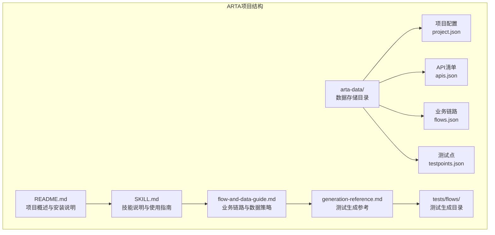

**图表来源**
- [README.md:151-162](file://README.md#L151-L162)
- [SKILL.md:419-431](file://SKILL.md#L419-L431)

项目采用分层文档结构：
- **README.md**: 提供项目总体介绍、安装方法和基本使用说明
- **SKILL.md**: 详细的功能说明、使用流程和数据存储规范
- **flow-and-data-guide.md**: 深入的业务链路和数据策略指南
- **generation-reference.md**: 测试生成的具体实现参考

**章节来源**
- [README.md:1-176](file://README.md#L1-L176)
- [SKILL.md:419-431](file://SKILL.md#L419-L431)

## 核心组件

### 数据引用语法体系

ARTA实现了完整的测试数据引用语法体系，支持四种主要的数据类型：

```mermaid
classDiagram
class TestDataSyntax {
+固定值(FixedValue)
+生成数据(GeneratedData)
+引用上游(UpstreamReference)
+环境变量(EnvironmentVariable)
}
class UpstreamReference {
+stepN.变量名
+stepN.response.路径
+解析规则
+执行顺序
}
class GeneratedData {
+uuid()
+timestamp()
+random_email()
+random_phone()
+increment(prefix)
+faker(type)
}
class EnvironmentVariable {
+$ENV{变量}
+运行时解析
+默认值支持
}
TestDataSyntax --> UpstreamReference
TestDataSyntax --> GeneratedData
TestDataSyntax --> EnvironmentVariable
```

**图表来源**
- [flow-and-data-guide.md:108-131](file://flow-and-data-guide.md#L108-L131)
- [SKILL.md:181-191](file://SKILL.md#L181-L191)

### 抽象语法表示

ARTA的测试数据语法采用统一的抽象表示：

| 语法类型 | 语法格式 | 示例 | 用途 |
|---------|---------|------|------|
| 固定值 | 直接写值 | `"testuser001"` | 已知常量数据 |
| 生成数据 | `{{函数()}}` | `{{uuid()}}`, `{{random_email()}}` | 动态生成唯一数据 |
| 引用上游 | `${步骤.字段}` | `${login.response.token}` | 跨步骤数据传递 |
| 环境变量 | `$ENV{变量}` | `$ENV{BASE_URL}` | 运行时配置 |

**章节来源**
- [README.md:140-149](file://README.md#L140-L149)
- [SKILL.md:181-188](file://SKILL.md#L181-L188)

## 架构概览

ARTA的引用上游策略遵循严格的执行顺序和数据流向控制：

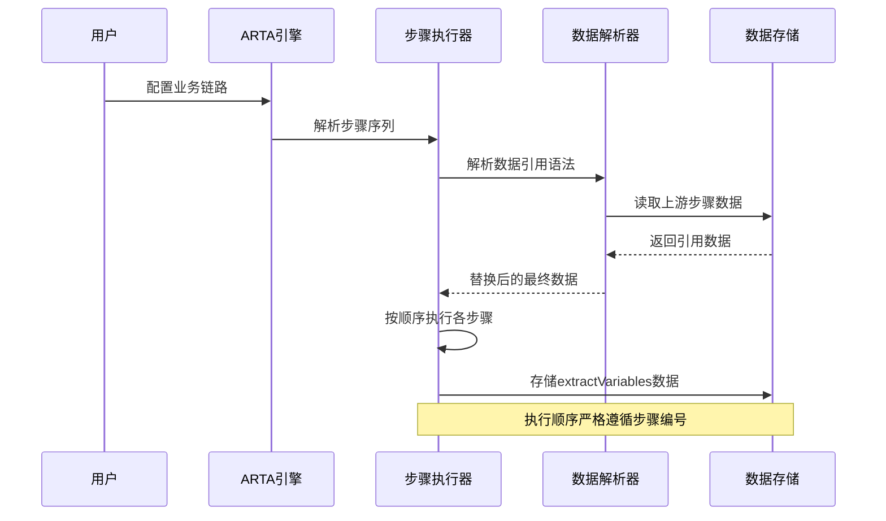

**图表来源**
- [flow-and-data-guide.md:118-122](file://flow-and-data-guide.md#L118-L122)
- [SKILL.md:143-224](file://SKILL.md#L143-L224)

### 数据流架构

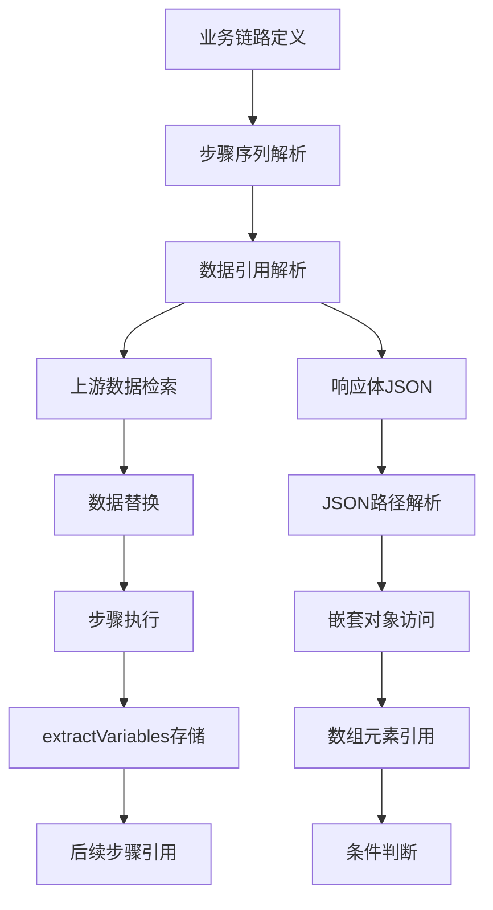

**图表来源**
- [flow-and-data-guide.md:77-75](file://flow-and-data-guide.md#L77-L75)
- [SKILL.md:179-205](file://SKILL.md#L179-L205)

## 详细组件分析

### 引用上游语法详解

#### 语法格式规范

ARTA支持两种主要的引用上游语法格式：

1. **变量引用语法**: `${stepN.变量名}`
   - 引用步骤N中`extractVariables`定义的变量
   - 适用于已显式提取的变量数据
   - 支持跨步骤传递经过处理的数据

2. **响应体引用语法**: `${stepN.response.路径}`
   - 直接引用步骤N响应体的JSON路径
   - 支持复杂的JSON路径表达式
   - 实现原始响应数据的直接访问

#### 解析规则

```mermaid
flowchart TD
A[收到引用语法] --> B{语法类型判断}
B --> |${stepN.变量名}| C[查找extractVariables]
B --> |${stepN.response.路径}| D[解析JSON路径]
C --> E{变量是否存在}
E --> |是| F[返回变量值]
E --> |否| G[抛出引用错误]
D --> H[解析JSON路径]
H --> I{路径有效性}
I --> |是| J[返回JSON值]
I --> |否| K[抛出路径错误]
F --> L[数据替换完成]
G --> M[错误处理]
J --> L
K --> M
```

**图表来源**
- [flow-and-data-guide.md:118-122](file://flow-and-data-guide.md#L118-L122)
- [SKILL.md:179-205](file://SKILL.md#L179-L205)

#### 执行顺序要求

引用上游机制严格遵循以下执行顺序原则：

1. **步骤编号顺序**: 被引用的步骤N必须满足N < 当前步骤编号
2. **数据可用性**: 上游步骤必须在当前步骤之前完成执行
3. **变量提取时机**: extractVariables中的变量在步骤执行后立即可用
4. **响应体访问**: `${stepN.response.路径}`语法在步骤完成后立即可用

**章节来源**
- [flow-and-data-guide.md:118-122](file://flow-and-data-guide.md#L118-L122)
- [SKILL.md:179-205](file://SKILL.md#L179-L205)

### 复杂场景支持

#### 嵌套对象访问

ARTA支持深度嵌套的对象结构访问：

```mermaid
graph LR
A[响应体JSON] --> B[顶层对象]
B --> C[data对象]
C --> D[user子对象]
D --> E[id字段]
D --> F[name字段]
F --> G[${step1.response.data.user.name}]
E --> H[${step1.response.data.user.id}]
```

**图表来源**
- [flow-and-data-guide.md:49-52](file://flow-and-data-guide.md#L49-L52)

#### 数组元素引用

数组访问支持索引定位和条件筛选：

```mermaid
flowchart TD
A[响应体数组] --> B[数组元素1]
A --> C[数组元素2]
A --> D[数组元素n]
B --> E[${step2.response.data[0].id}]
C --> F[${step2.response.data[1].name}]
D --> G[${step2.response.data[n-1].status}]
```

**图表来源**
- [flow-and-data-guide.md:50](file://flow-and-data-guide.md#L50)

#### 条件判断集成

引用数据可直接参与条件判断逻辑：

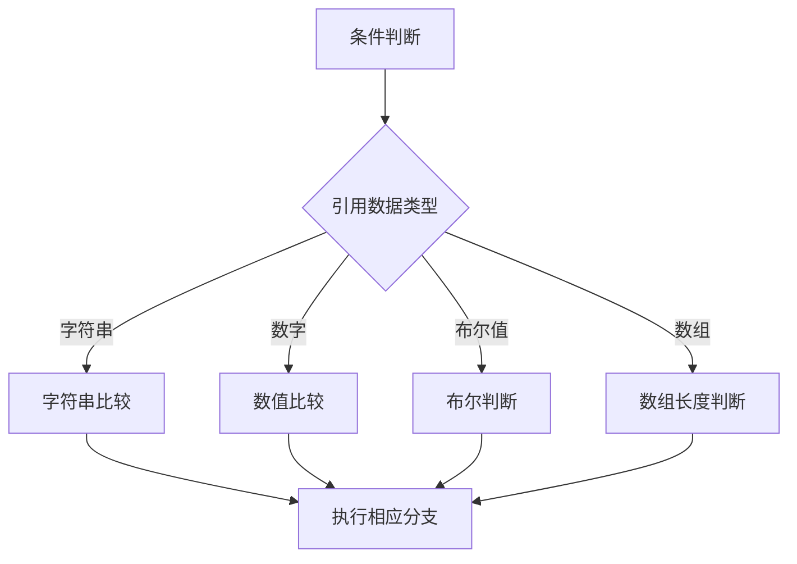

**章节来源**
- [flow-and-data-guide.md:133-144](file://flow-and-data-guide.md#L133-L144)

### 数据存储与管理

#### extractVariables机制

每个步骤的`extractVariables`配置定义了可被其他步骤引用的变量：

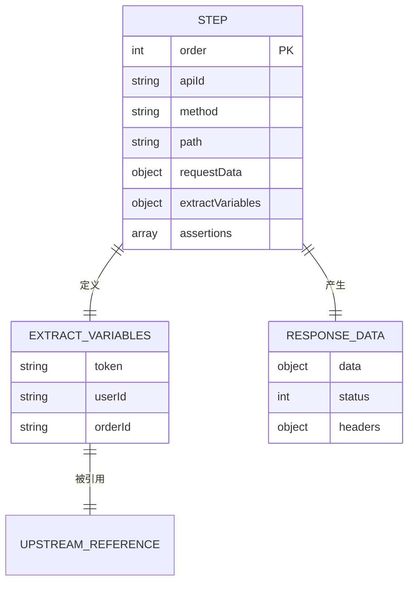

**图表来源**
- [flow-and-data-guide.md:30-33](file://flow-and-data-guide.md#L30-L33)
- [flow-and-data-guide.md:54-56](file://flow-and-data-guide.md#L54-L56)

#### 数据持久化策略

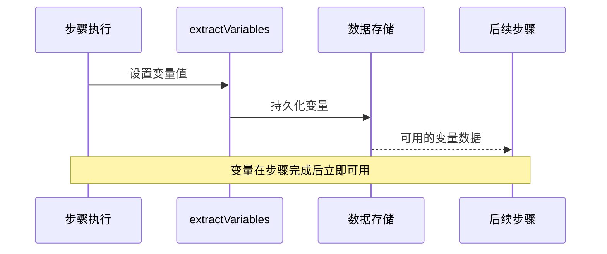

**图表来源**
- [flow-and-data-guide.md:30-33](file://flow-and-data-guide.md#L30-L33)

## 依赖关系分析

### 组件耦合度

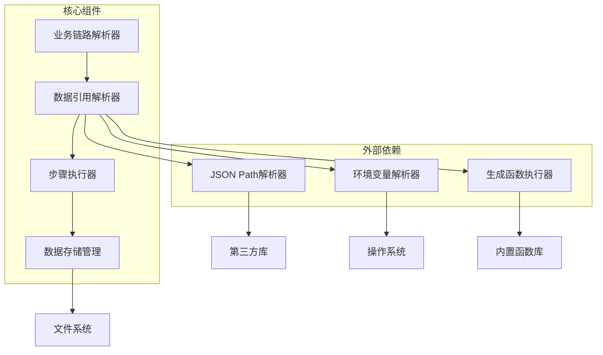

**图表来源**
- [flow-and-data-guide.md:77-75](file://flow-and-data-guide.md#L77-L75)
- [SKILL.md:179-205](file://SKILL.md#L179-L205)

### 数据依赖链

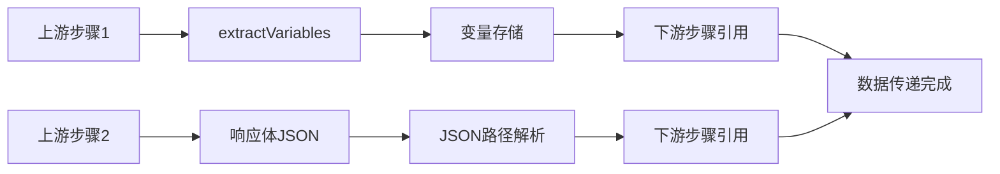

**图表来源**
- [flow-and-data-guide.md:118-122](file://flow-and-data-guide.md#L118-L122)

**章节来源**
- [flow-and-data-guide.md:77-75](file://flow-and-data-guide.md#L77-L75)
- [SKILL.md:179-205](file://SKILL.md#L179-L205)

## 性能考量

### 解析性能优化

ARTA在引用上游数据时采用了多项性能优化策略：

1. **延迟解析**: 引用语法在实际执行时才进行解析，避免不必要的预计算
2. **缓存机制**: 已解析的变量值在当前链路执行期间缓存，避免重复解析
3. **增量更新**: 只对发生变化的步骤重新解析相关引用

### 内存使用优化

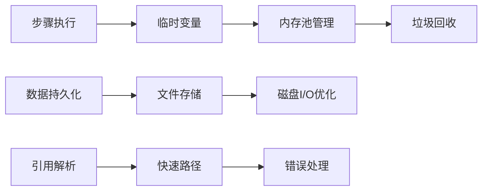

**图表来源**
- [flow-and-data-guide.md:118-122](file://flow-and-data-guide.md#L118-L122)

### 并发执行考虑

在多步骤并发执行场景下，ARTA确保引用数据的一致性和完整性：

- **原子性保证**: 引用解析和数据替换在单个事务中完成
- **版本控制**: 每个步骤的输出都有明确的时间戳标记
- **冲突检测**: 检测并防止循环引用和非法引用

## 故障排查指南

### 常见引用错误类型

#### 语法错误

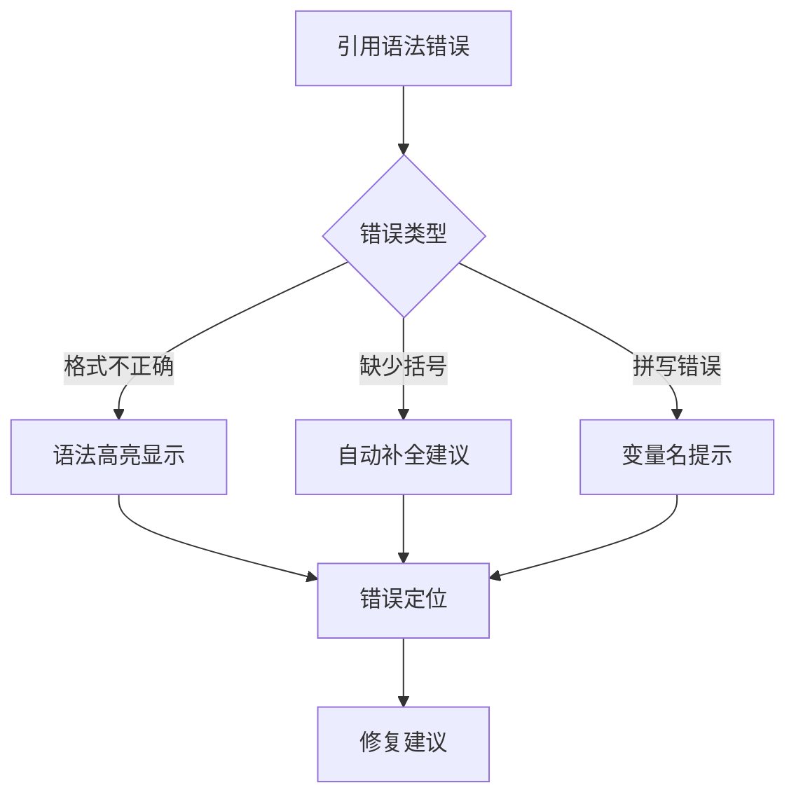

**图表来源**
- [flow-and-data-guide.md:118-122](file://flow-and-data-guide.md#L118-L122)

#### 执行时错误

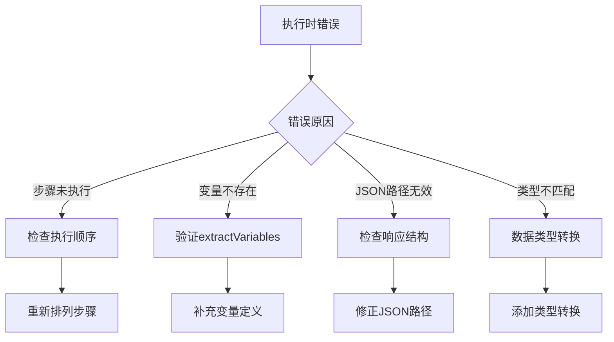

**图表来源**
- [flow-and-data-guide.md:118-122](file://flow-and-data-guide.md#L118-L122)

### 调试方法

#### 日志追踪

ARTA提供了多层次的日志追踪机制：

1. **语法解析日志**: 记录引用语法的解析过程
2. **数据流日志**: 追踪数据在步骤间的传递路径
3. **错误定位日志**: 精确定位引用失败的位置

#### 调试工具

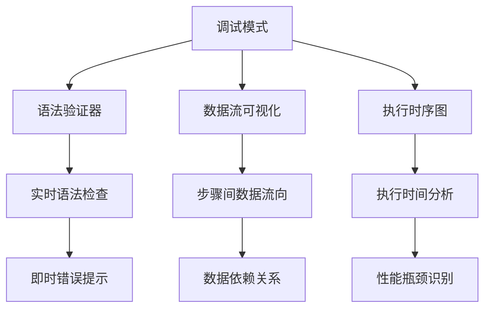

**图表来源**
- [flow-and-data-guide.md:118-122](file://flow-and-data-guide.md#L118-L122)

### 最佳实践建议

#### 错误预防

1. **提前验证**: 在保存链路前验证所有引用语法
2. **逐步测试**: 逐个步骤验证数据引用的正确性
3. **文档记录**: 详细记录每个extractVariables的用途

#### 性能优化

1. **合理设计**: 避免深层嵌套和复杂的JSON路径
2. **数据复用**: 在多个步骤中复用相同的变量
3. **及时清理**: 及时清理不再使用的中间变量

**章节来源**
- [flow-and-data-guide.md:118-122](file://flow-and-data-guide.md#L118-L122)
- [SKILL.md:434-442](file://SKILL.md#L434-L442)

## 结论

ARTA的引用上游策略通过精心设计的语法体系和严格的执行机制，为端到端测试提供了强大而灵活的数据支撑。该策略的核心优势包括：

1. **语法简洁性**: 通过直观的`${stepN.变量名}`和`${stepN.response.路径}`语法，降低了学习成本
2. **功能完整性**: 支持嵌套对象访问、数组元素引用、条件判断等复杂场景
3. **执行可靠性**: 严格的执行顺序控制和错误处理机制确保数据传递的准确性
4. **性能优化**: 采用延迟解析、缓存机制等优化策略提升执行效率

通过本文档的详细分析，开发者可以深入理解ARTA引用上游策略的设计原理和实现细节，从而在实际项目中更好地利用这一强大功能来构建高质量的自动化测试流程。

## 附录

### 语法速查表

| 语法类型 | 语法格式 | 示例 | 说明 |
|---------|---------|------|------|
| 变量引用 | `${stepN.变量名}` | `${login.token}` | 引用extractVariables中的变量 |
| 响应体引用 | `${stepN.response.路径}` | `${login.response.data.user.id}` | 直接引用响应体JSON路径 |
| 固定值 | 直接写值 | `"testuser001"` | 已知的常量数据 |
| 生成数据 | `{{函数()}}` | `{{uuid()}}` | 动态生成唯一数据 |
| 环境变量 | `$ENV{变量}` | `$ENV{BASE_URL}` | 运行时环境变量 |

### 执行顺序检查清单

- [ ] 确保被引用的步骤编号小于当前步骤编号
- [ ] 验证extractVariables中变量的定义和命名
- [ ] 检查JSON路径的有效性和可达性
- [ ] 确认响应体结构与JSON路径匹配
- [ ] 验证数据类型兼容性

### 常用JSON路径示例

- `$.data.id`: 获取data对象中的id字段
- `$.data.users[0].name`: 获取第一个用户的name
- `$.data.items.length`: 获取数组长度
- `$.data.error.code`: 获取错误码