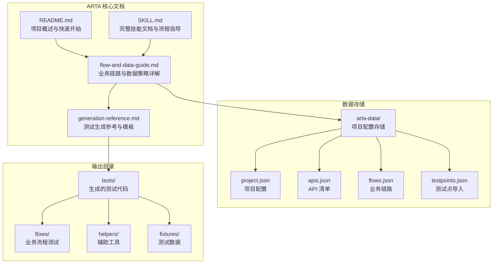
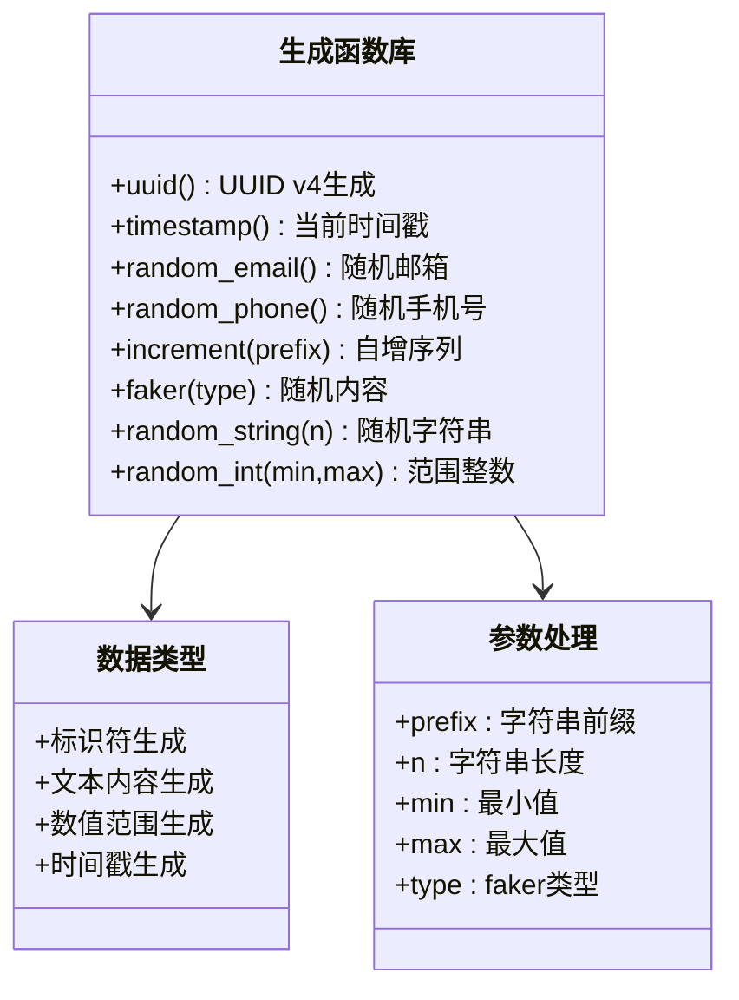
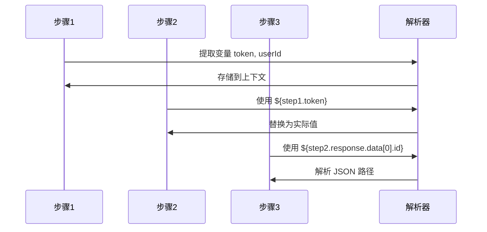
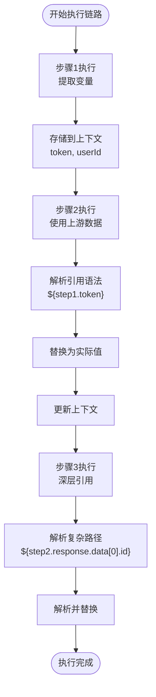

# 测试数据策略详解

<cite>
**本文档引用的文件**
- [README.md](file://README.md)
- [SKILL.md](file://SKILL.md)
- [flow-and-data-guide.md](file://flow-and-data-guide.md)
- [generation-reference.md](file://generation-reference.md)
</cite>

## 目录
1. [简介](#简介)
2. [项目结构](#项目结构)
3. [核心组件](#核心组件)
4. [架构概览](#架构概览)
5. [详细组件分析](#详细组件分析)
6. [依赖关系分析](#依赖关系分析)
7. [性能考量](#性能考量)
8. [故障排查指南](#故障排查指南)
9. [结论](#结论)
10. [附录](#附录)

## 简介

ARTA（Automation Regression Test Assistant）是一个端到端 API 自动化测试流程引导工具，专注于测试数据策略的设计与实现。本文档深入解析 ARTA 的四种测试数据类型：固定值策略、生成数据策略、引用上游策略和环境变量策略，为测试工程师提供完整的数据驱动测试解决方案。

ARTA 的测试数据策略采用声明式语法设计，支持复杂的跨步骤数据传递和动态数据生成，能够满足从简单单元测试到复杂端到端场景的各种测试需求。

## 项目结构

ARTA 项目采用文档驱动的架构设计，主要包含四个核心文档文件：



**图表来源**
- [README.md: 151-162:151-162](file://README.md#L151-L162)
- [SKILL.md: 419-431:419-431](file://SKILL.md#L419-L431)

**章节来源**
- [README.md: 1-176:1-176](file://README.md#L1-L176)
- [SKILL.md: 419-431:419-431](file://SKILL.md#L419-L431)

## 核心组件

ARTA 的测试数据策略系统由四大核心组件构成，每种组件都有其特定的应用场景和实现机制：

### 固定值策略组件
固定值策略是最基础的数据提供方式，直接使用预定义的常量值。适用于已知的测试账号、固定配置或不需要变化的静态数据。

### 生成数据策略组件  
生成数据策略通过内置函数动态生成测试数据，支持多种数据类型的随机生成，包括 UUID、邮箱、手机号、时间戳等。

### 引用上游策略组件
引用上游策略实现了跨步骤的数据传递机制，允许在后续步骤中使用前面步骤的响应数据或提取变量。

### 环境变量策略组件
环境变量策略提供了一种安全的数据注入方式，通过系统环境变量传递敏感信息和配置参数。

**章节来源**
- [flow-and-data-guide.md: 77-132:77-132](file://flow-and-data-guide.md#L77-L132)

## 架构概览

ARTA 的测试数据策略架构采用分层设计，从底层的数据生成到上层的业务场景应用形成了完整的数据流体系：

```mermaid
graph TD
subgraph "数据源层"
A[固定值数据<br/>直接常量]
B[生成函数库<br/>uuid(), random_email()]
C[上游响应数据<br/>${stepN.response}]
D[环境变量<br/>$ENV{VAR_NAME}]
end
subgraph "解析引擎层"
E[语法解析器<br/>{{}}, ${}, $ENV{}]
F[表达式求值器<br/>数据绑定]
G[上下文管理器<br/>步骤间传递]
end
subgraph "应用层"
H[请求体构建<br/>JSON Body]
I[请求头设置<br/>Headers]
J[查询参数配置<br/>Query Params]
K[路径参数替换<br/>Path Params]
end
subgraph "存储层"
L[arda-data/flows.json<br/>业务链路存储]
M[arda-data/apis.json<br/>API 清单]
N[arda-data/project.json<br/>项目配置]
end
A --> E
B --> E
C --> E
D --> E
E --> F
F --> G
G --> H
G --> I
G --> J
G --> K
H --> L
I --> L
J --> L
K --> L
L --> N
L --> M
```

**图表来源**
- [flow-and-data-guide.md: 77-132:77-132](file://flow-and-data-guide.md#L77-L132)
- [README.md: 140-149:140-149](file://README.md#L140-L149)

## 详细组件分析

### 固定值策略详解

固定值策略是最直接的数据提供方式，适用于已知的测试账号、固定配置或不需要变化的静态数据。

#### 实现原理
固定值策略直接使用用户提供的原始数据，不进行任何处理或变换。这种策略的特点是简单可靠，但缺乏灵活性。

#### 适用场景
- 已知的测试账号信息
- 固定的配置参数
- 不会变化的静态数据
- 明确要求使用特定值的测试场景

#### 配置方法
固定值策略的配置非常简单，直接在 JSON 对象中指定对应的键值对即可。

**章节来源**
- [flow-and-data-guide.md: 79-90:79-90](file://flow-and-data-guide.md#L79-L90)

### 生成数据策略详解

生成数据策略通过内置函数动态生成测试数据，支持多种数据类型的随机生成，是 ARTA 最强大的数据生成能力。

#### 函数库参考

ARTA 提供了丰富的内置函数库，涵盖各种常见的测试数据生成需求：



**图表来源**
- [flow-and-data-guide.md: 92-107:92-107](file://flow-and-data-guide.md#L92-L107)

#### 函数详细说明

**uuid() 函数**
- 功能：生成 UUID v4 标识符
- 应用场景：唯一标识符生成、数据库主键模拟
- 输出特点：全局唯一、格式标准化

**timestamp() 函数**
- 功能：生成当前时间戳
- 应用场景：时间相关测试、缓存键生成
- 输出特点：递增时间序列、精确到秒

**random_email() 函数**
- 功能：生成随机邮箱地址
- 应用场景：用户注册测试、邮件发送验证
- 输出特点：符合邮箱格式、域名随机

**random_phone() 函数**
- 功能：生成随机手机号码
- 应用场景：用户信息测试、短信验证
- 输出特点：符合手机号格式、国内号码

**increment(prefix) 函数**
- 功能：生成自增序列
- 参数：prefix - 字符串前缀
- 应用场景：批量数据测试、序列化标识
- 输出特点：可预测的递增序列

**faker() 函数**
- 功能：基于 Faker 库生成随机内容
- 参数：type - 内容类型（name, address 等）
- 应用场景：丰富测试数据、模拟真实用户
- 输出特点：多样化内容、可扩展类型

**random_string(n) 函数**
- 功能：生成指定长度的随机字符串
- 参数：n - 字符串长度
- 应用场景：密码生成、令牌模拟
- 输出特点：可配置长度、字符集多样

**random_int(min,max) 函数**
- 功能：生成指定范围内的随机整数
- 参数：min - 最小值, max - 最大值
- 应用场景：分页测试、数量模拟
- 输出特点：范围限定、均匀分布

#### 配置方法
生成数据策略使用双大括号语法 `{{函数()}}`，支持在请求体、请求头、查询参数等各种位置使用。

**章节来源**
- [flow-and-data-guide.md: 92-107:92-107](file://flow-and-data-guide.md#L92-L107)

### 引用上游策略详解

引用上游策略实现了跨步骤的数据传递机制，是 ARTA 数据驱动测试的核心能力之一。

#### 语法规范



**图表来源**
- [flow-and-data-guide.md: 108-122:108-122](file://flow-and-data-guide.md#L108-L122)

#### 语法解析规则

**变量引用语法**
- `${stepN.变量名}` - 引用步骤N中 extractVariables 定义的变量
- `${stepN.response.路径}` - 直接引用步骤N响应体的 JSON 路径
- 被引用的步骤必须在当前步骤之前执行

**JSON 路径解析**
- 支持数组索引访问：`data[0].id`
- 支持嵌套对象访问：`user.profile.name`
- 支持属性链式访问：`data.list[0].id`

#### 数据传递机制

引用上游策略通过上下文管理系统实现步骤间的无缝数据传递：



**图表来源**
- [flow-and-data-guide.md: 108-122:108-122](file://flow-and-data-guide.md#L108-L122)

**章节来源**
- [flow-and-data-guide.md: 108-122:108-122](file://flow-and-data-guide.md#L108-L122)

### 环境变量策略详解

环境变量策略提供了一种安全的数据注入方式，通过系统环境变量传递敏感信息和配置参数。

#### 配置方法

环境变量策略使用 `$ENV{变量名}` 语法，支持在请求头、请求体、查询参数等各种位置使用。

#### 安全考虑

**敏感信息保护**
- API 密钥、数据库连接字符串等敏感信息通过环境变量传递
- 避免在代码仓库中硬编码敏感信息
- 支持不同环境的配置分离

**环境隔离**
- 开发、测试、生产环境使用不同的环境变量
- 支持本地开发和 CI/CD 环境的配置管理

#### 配置示例

```mermaid
graph LR
subgraph "环境配置"
A[开发环境<br/>DEV_MODE=true]
B[测试环境<br/>TEST_ENV=staging]
C[生产环境<br/>PROD=true]
end
subgraph "应用配置"
D[BASE_URL<br/>$ENV{BASE_URL}]
E[API_KEY<br/>$ENV{API_KEY}]
F[DEBUG_MODE<br/>$ENV{DEBUG_MODE}]
end
A --> D
B --> E
C --> F
```

**图表来源**
- [flow-and-data-guide.md: 123-132:123-132](file://flow-and-data-guide.md#L123-L132)

**章节来源**
- [flow-and-data-guide.md: 123-132:123-132](file://flow-and-data-guide.md#L123-L132)

### 数据生成的随机性控制与可重现性

ARTA 在数据生成方面提供了灵活的随机性控制机制，同时保证测试的可重现性。

#### 随机性控制机制

**种子管理**
- 支持设置随机种子以控制生成序列
- 同一种子产生相同的数据序列
- 便于调试和问题复现

**类型化随机**
- 不同数据类型使用独立的随机源
- UUID 和邮箱使用不同的随机算法
- 避免不同类型数据之间的相互影响

#### 可重现性保证

**确定性生成**
- 固定值策略完全可重现
- 生成函数支持可选的种子参数
- 上游数据引用保持稳定

**版本兼容性**
- 数据生成规则向后兼容
- 新版本不会破坏现有测试数据
- 支持渐进式升级

**章节来源**
- [flow-and-data-guide.md: 146-198:146-198](file://flow-and-data-guide.md#L146-L198)

## 依赖关系分析

ARTA 的测试数据策略系统具有清晰的依赖层次结构，从底层的语法解析到上层的业务应用形成了完整的依赖链条。

```mermaid
graph TB
subgraph "语法层"
A[{{}} 生成语法]
B[${} 引用语法]
C[$ENV{}] 环境变量语法]
end
subgraph "解析层"
D[表达式解析器]
E[JSON 路径解析器]
F[环境变量解析器]
end
subgraph "执行层"
G[上下文管理器]
H[数据绑定器]
I[类型转换器]
end
subgraph "应用层"
J[请求体构建]
K[请求头设置]
L[参数配置]
end
A --> D
B --> E
C --> F
D --> G
E --> G
F --> G
G --> H
H --> I
I --> J
I --> K
I --> L
```

**图表来源**
- [flow-and-data-guide.md: 77-132:77-132](file://flow-and-data-guide.md#L77-L132)

### 组件耦合度分析

**低耦合设计**
- 各数据策略组件相对独立，可单独使用
- 解析器与执行器分离，便于维护和扩展
- 上下文管理器提供统一的数据访问接口

**依赖方向**
- 语法层依赖解析层
- 解析层依赖执行层
- 执行层依赖应用层

**潜在循环依赖**
- 系统设计避免了循环依赖
- 上游引用遵循单向数据流原则
- 环境变量引用不形成循环

**章节来源**
- [flow-and-data-guide.md: 77-132:77-132](file://flow-and-data-guide.md#L77-L132)

## 性能考量

ARTA 的测试数据策略在设计时充分考虑了性能因素，确保在大量测试场景下的高效运行。

### 生成性能优化

**延迟计算**
- 生成函数采用延迟计算策略
- 仅在需要时才生成数据
- 避免不必要的计算开销

**缓存机制**
- 常用生成结果进行缓存
- 支持生成函数的结果复用
- 减少重复计算的开销

### 内存管理

**上下文清理**
- 自动清理已完成步骤的上下文
- 防止内存泄漏
- 支持大规模测试场景

**垃圾回收**
- 及时释放临时数据
- 优化内存使用效率
- 长时间运行稳定性

### 执行效率

**并行处理**
- 支持多个测试步骤并行执行
- 数据生成与网络请求并行
- 提高整体执行效率

**批处理优化**
- 多个相同生成函数调用合并
- 减少函数调用开销
- 优化生成性能

## 故障排查指南

### 常见问题诊断

**语法错误**
- 检查生成函数语法是否正确
- 验证引用语法的格式
- 确认环境变量名称的有效性

**数据类型不匹配**
- 验证生成数据的类型
- 检查 JSON 路径的正确性
- 确认参数格式的合法性

**上下文访问失败**
- 检查步骤执行顺序
- 验证变量名的一致性
- 确认数据提取的正确性

### 调试技巧

**日志记录**
- 启用详细日志输出
- 记录数据生成过程
- 跟踪上下文变化

**断点调试**
- 在关键节点设置断点
- 检查中间结果
- 验证数据流完整性

**单元测试**
- 为复杂数据策略编写单元测试
- 验证生成函数的正确性
- 确保边界条件处理

**章节来源**
- [flow-and-data-guide.md: 146-198:146-198](file://flow-and-data-guide.md#L146-L198)

## 结论

ARTA 的测试数据策略系统通过精心设计的四种数据类型，为 API 自动化测试提供了强大而灵活的数据驱动能力。系统采用声明式语法设计，支持复杂的跨步骤数据传递和动态数据生成，能够满足从简单单元测试到复杂端到端场景的各种测试需求。

### 核心优势

**易用性**：简洁的语法设计，降低学习成本
**灵活性**：多种数据策略组合，适应不同场景需求
**安全性**：环境变量策略保护敏感信息
**可维护性**：清晰的依赖关系和模块化设计

### 最佳实践建议

**数据策略选择**
- 固定值：适用于已知的测试账号和配置
- 生成数据：适用于需要变化的测试数据
- 引用上游：适用于跨步骤的数据传递
- 环境变量：适用于敏感信息和配置参数

**配置管理**
- 建立统一的数据策略规范
- 定期审查和优化数据配置
- 建立数据生成的监控机制

**团队协作**
- 标准化数据策略的使用方式
- 建立数据策略的文档和培训
- 定期分享最佳实践案例

ARTA 的测试数据策略系统为现代软件测试提供了完整的解决方案，通过合理使用这四种数据策略，测试工程师可以构建更加健壮和高效的测试体系。

## 附录

### 配置示例总览

**固定值配置示例**
```json
{
  "username": "testuser001",
  "password": "Test@123456",
  "page": 1,
  "size": 10
}
```

**生成数据配置示例**
```json
{
  "email": "{{random_email()}}",
  "phone": "{{random_phone()}}",
  "orderId": "{{uuid()}}",
  "timestamp": "{{timestamp()}}"
}
```

**引用上游配置示例**
```json
{
  "headers": {
    "Authorization": "Bearer ${login.response.token}"
  },
  "body": {
    "productId": "${products.response.data[0].id}",
    "userId": "${step1.userId}"
  }
}
```

**环境变量配置示例**
```json
{
  "headers": {
    "X-API-Key": "$ENV{API_KEY}"
  },
  "baseUrl": "$ENV{BASE_URL}"
}
```

### 实际应用场景

**用户注册流程**
- 使用 `{{random_email()}}` 生成唯一邮箱
- 使用 `{{random_string(8)}}` 生成随机密码
- 使用 `{{uuid()}}` 生成用户标识

**订单创建流程**
- 引用登录步骤的 token
- 引用商品列表的 productId
- 使用环境变量配置 API 基础地址

**批量测试场景**
- 使用 `{{increment(prefix)}}` 生成递增序列
- 使用 `{{random_int(min,max)}}` 生成测试数量
- 结合固定值和生成数据实现混合策略

**章节来源**
- [flow-and-data-guide.md: 77-132:77-132](file://flow-and-data-guide.md#L77-L132)