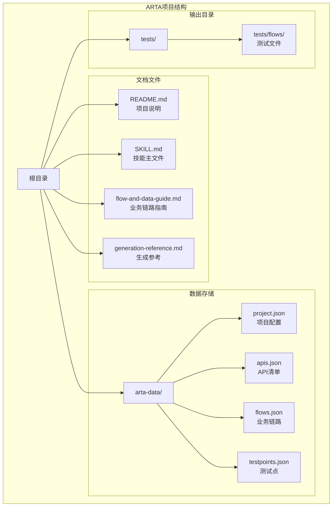
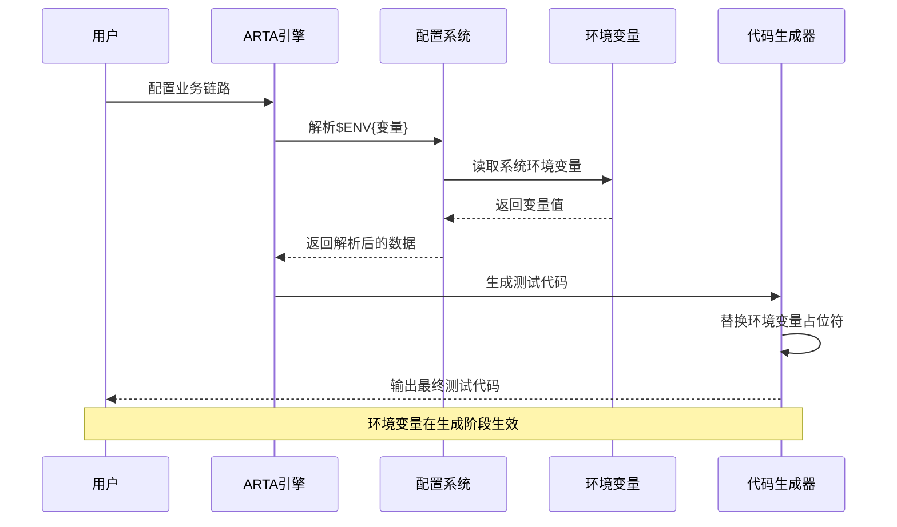
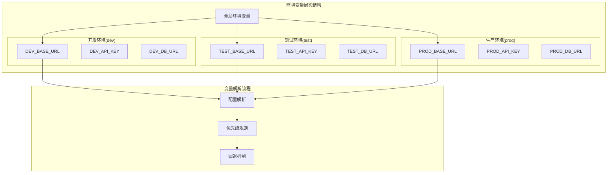
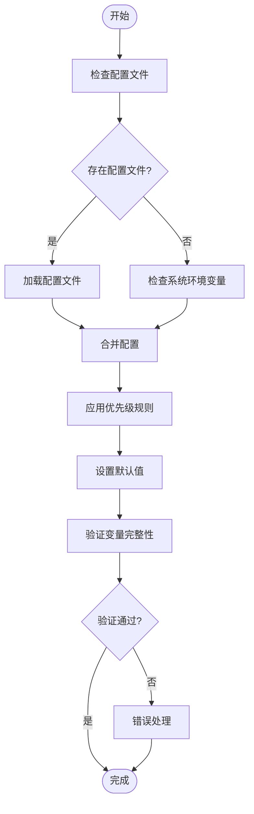
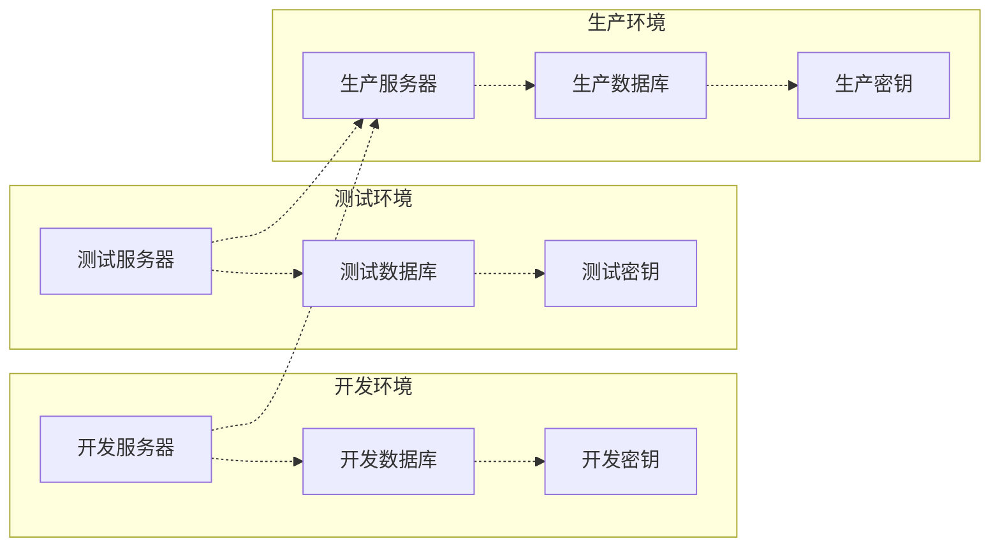
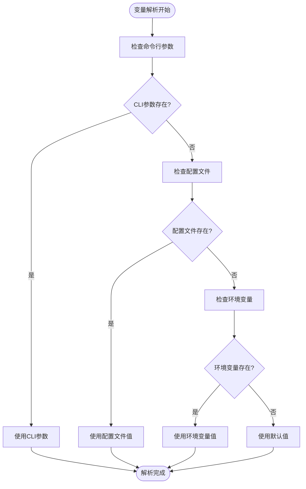
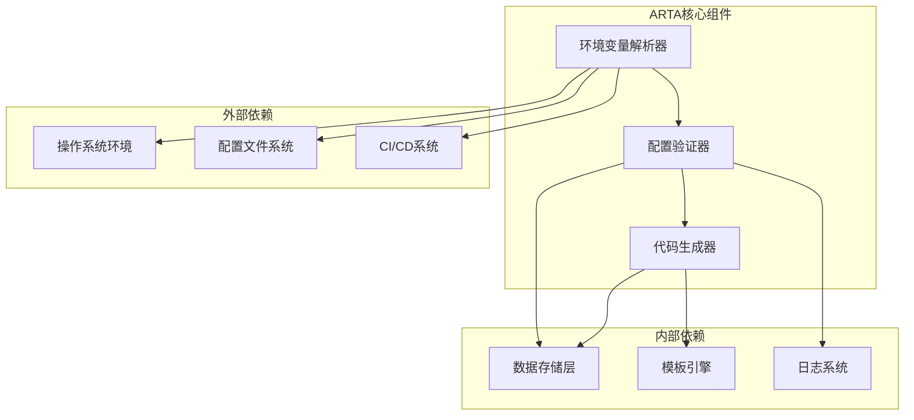
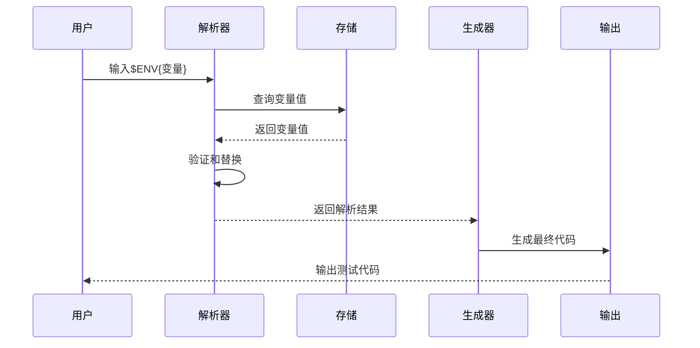

# 环境变量策略

<cite>
**本文档引用的文件**
- [README.md](file://README.md)
- [SKILL.md](file://SKILL.md)
- [flow-and-data-guide.md](file://flow-and-data-guide.md)
- [generation-reference.md](file://generation-reference.md)
</cite>

## 目录
1. [简介](#简介)
2. [项目结构](#项目结构)
3. [核心组件](#核心组件)
4. [架构概览](#架构概览)
5. [详细组件分析](#详细组件分析)
6. [依赖关系分析](#依赖关系分析)
7. [性能考虑](#性能考虑)
8. [故障排除指南](#故障排除指南)
9. [结论](#结论)
10. [附录](#附录)

## 简介

ARTA（自动化回归测试助手）是一个端到端的API自动化测试流程引导工具，专门设计用于帮助开发团队从项目接入到测试用例生成的完整测试工作流程。本文档专注于ARTA中环境变量测试数据策略的设计与实现，详细解释$ENV{变量}语法的配置方法、使用场景以及最佳实践。

ARTA支持四种主要的数据类型：固定值、生成数据、引用上游和环境变量。其中环境变量策略是实现多环境部署、安全配置管理和测试数据隔离的核心机制。

## 项目结构

ARTA项目采用技能（Skill）形式组织，包含四个主要文档文件：



**图表来源**
- [README.md:153-162](file://README.md#L153-L162)
- [SKILL.md:421-430](file://SKILL.md#L421-L430)

**章节来源**
- [README.md:1-176](file://README.md#L1-L176)
- [SKILL.md:1-443](file://SKILL.md#L1-L443)

## 核心组件

### 环境变量语法系统

ARTA实现了完整的环境变量语法系统，支持在测试数据配置中引用运行时环境变量。该系统包含以下核心组件：

#### 语法定义
- **基本语法**: `$ENV{变量名}`
- **支持的变量类型**: API基础地址、API密钥、测试环境标识等
- **引用范围**: 跨步骤、跨API的全局变量引用

#### 变量分类
1. **基础配置变量**
   - `BASE_URL`: API服务基础URL
   - `API_KEY`: API访问密钥
   - `TEST_ENV`: 测试环境标识

2. **安全敏感变量**
   - `DATABASE_URL`: 数据库连接字符串
   - `AUTH_TOKEN`: 认证令牌
   - `SECRET_KEY`: 加密密钥

3. **环境标识变量**
   - `ENVIRONMENT`: 环境类型（dev/test/prod）
   - `REGION`: 服务器区域
   - `VERSION`: 应用版本

**章节来源**
- [flow-and-data-guide.md:123-131](file://flow-and-data-guide.md#L123-L131)
- [README.md:140-149](file://README.md#L140-L149)

## 架构概览

### 环境变量处理架构



**图表来源**
- [flow-and-data-guide.md:123-131](file://flow-and-data-guide.md#L123-L131)
- [generation-reference.md:13-14](file://generation-reference.md#L13-L14)

### 多环境配置架构



**图表来源**
- [generation-reference.md:13-14](file://generation-reference.md#L13-L14)
- [generation-reference.md:71](file://generation-reference.md#L71)

## 详细组件分析

### 环境变量配置系统

#### 配置方式

ARTA提供了多种环境变量配置方式：

1. **直接配置**
   - 在业务链路配置中直接使用`$ENV{变量名}`语法
   - 支持在请求头、请求体、URL参数中使用

2. **文件配置**
   - 通过`arta-data/project.json`配置项目级别的环境变量
   - 支持环境特定的配置文件

3. **命令行配置**
   - 通过环境变量传递给ARTA进程
   - 支持CI/CD流水线集成

#### 加载机制



**图表来源**
- [flow-and-data-guide.md:123-131](file://flow-and-data-guide.md#L123-L131)

#### 作用域说明

环境变量在ARTA中有明确的作用域划分：

1. **全局作用域**
   - 在整个项目范围内可用
   - 适用于所有业务链路和API调用

2. **链路作用域**
   - 仅在特定业务链路内有效
   - 支持链路级别的变量覆盖

3. **步骤作用域**
   - 仅在特定API调用步骤内有效
   - 支持步骤级别的临时变量

**章节来源**
- [flow-and-data-guide.md:123-131](file://flow-and-data-guide.md#L123-L131)
- [SKILL.md:179-205](file://SKILL.md#L179-L205)

### 安全考虑

#### 敏感信息保护

ARTA在环境变量安全方面采用了多层次的保护机制：

1. **变量分离**
   - 将敏感变量与普通配置分离
   - 支持加密存储和传输

2. **访问控制**
   - 限制环境变量的读取权限
   - 支持基于角色的访问控制

3. **日志过滤**
   - 自动过滤敏感变量的日志输出
   - 支持变量脱敏显示

#### 环境隔离策略



**图表来源**
- [generation-reference.md:13-14](file://generation-reference.md#L13-L14)

#### 密钥管理最佳实践

1. **轮换策略**
   - 定期更换API密钥和认证令牌
   - 支持密钥版本管理和回滚

2. **最小权限原则**
   - 为不同环境分配最小必要权限
   - 支持细粒度的权限控制

3. **审计跟踪**
   - 记录所有环境变量的访问历史
   - 支持合规性审计

**章节来源**
- [generation-reference.md:13-14](file://generation-reference.md#L13-L14)
- [generation-reference.md:71](file://generation-reference.md#L71)

### 多环境部署配置

#### 开发环境配置

开发环境重点在于快速迭代和调试：

- **BASE_URL**: `http://localhost:3000`
- **API_KEY**: 开发专用密钥
- **DATABASE_URL**: 本地开发数据库
- **DEBUG**: true

#### 测试环境配置

测试环境强调稳定性和可重复性：

- **BASE_URL**: `https://test-api.example.com`
- **API_KEY**: 测试专用密钥
- **DATABASE_URL**: 测试数据库
- **LOG_LEVEL**: debug

#### 生产环境配置

生产环境注重安全性和性能：

- **BASE_URL**: `https://api.example.com`
- **API_KEY**: 生产密钥
- **DATABASE_URL**: 生产数据库
- **ENABLE_SSL**: true

**章节来源**
- [generation-reference.md:13-14](file://generation-reference.md#L13-L14)
- [generation-reference.md:71](file://generation-reference.md#L71)

### 优先级规则和默认值

#### 优先级规则

环境变量解析遵循严格的优先级规则：

1. **命令行参数** (最高优先级)
2. **配置文件** 
3. **环境变量**
4. **默认值** (最低优先级)

#### 默认值设置



**图表来源**
- [generation-reference.md:13-14](file://generation-reference.md#L13-L14)

#### 错误处理机制

环境变量解析过程包含完善的错误处理：

1. **变量缺失处理**
   - 记录缺失的环境变量
   - 提供友好的错误提示
   - 支持优雅降级

2. **类型验证**
   - 验证变量类型匹配
   - 提供类型转换支持
   - 记录类型不匹配错误

3. **范围检查**
   - 检查数值范围
   - 验证URL格式
   - 确保配置有效性

**章节来源**
- [flow-and-data-guide.md:123-131](file://flow-and-data-guide.md#L123-L131)

## 依赖关系分析

### 环境变量依赖图



**图表来源**
- [flow-and-data-guide.md:123-131](file://flow-and-data-guide.md#L123-L131)
- [SKILL.md:421-430](file://SKILL.md#L421-L430)

### 数据流分析

环境变量在ARTA中的数据流如下：



**图表来源**
- [flow-and-data-guide.md:123-131](file://flow-and-data-guide.md#L123-L131)

**章节来源**
- [SKILL.md:421-430](file://SKILL.md#L421-L430)
- [README.md:151-162](file://README.md#L151-L162)

## 性能考虑

### 环境变量解析性能

1. **缓存机制**
   - 缓存已解析的环境变量值
   - 减少重复解析开销
   - 支持缓存失效策略

2. **异步处理**
   - 支持异步环境变量加载
   - 避免阻塞主线程
   - 提供超时控制

3. **批量处理**
   - 支持批量变量解析
   - 减少I/O操作次数
   - 优化网络请求

### 内存管理

1. **变量生命周期**
   - 管理变量的创建和销毁
   - 防止内存泄漏
   - 支持垃圾回收

2. **资源优化**
   - 优化配置文件大小
   - 减少不必要的变量存储
   - 支持变量压缩

## 故障排除指南

### 常见问题及解决方案

#### 环境变量未找到

**问题症状**:
- 生成的测试代码包含原始`$ENV{变量}`占位符
- 运行时出现变量解析错误

**解决步骤**:
1. 检查环境变量是否正确设置
2. 验证变量名称拼写
3. 确认变量作用域正确
4. 查看日志中的具体错误信息

#### 变量类型不匹配

**问题症状**:
- 变量解析失败
- 类型转换错误
- 生成代码编译失败

**解决步骤**:
1. 检查变量值的数据类型
2. 验证配置文件格式
3. 确认变量值符合预期格式
4. 使用适当的类型转换

#### 变量优先级冲突

**问题症状**:
- 变量值被意外覆盖
- 配置不一致
- 环境切换失败

**解决步骤**:
1. 检查变量的优先级设置
2. 验证配置文件的加载顺序
3. 确认命令行参数的正确性
4. 查看变量解析日志

### 调试技巧

1. **启用详细日志**
   - 设置`DEBUG=true`
   - 查看变量解析过程
   - 监控配置加载

2. **变量验证**
   - 使用`/ARTA-status`检查配置状态
   - 验证环境变量完整性
   - 确认变量作用域

3. **测试运行**
   - 在不同环境中测试
   - 验证变量替换效果
   - 检查生成代码的正确性

**章节来源**
- [SKILL.md:380-398](file://SKILL.md#L380-L398)

## 结论

ARTA的环境变量测试数据策略提供了一个强大而灵活的配置管理系统，支持多环境部署、安全配置管理和测试数据隔离。通过合理的变量设计、严格的优先级规则和完善的错误处理机制，ARTA能够满足各种复杂的测试场景需求。

该策略的关键优势包括：
- **灵活性**: 支持多种配置方式和作用域
- **安全性**: 提供多层次的安全保护机制
- **可维护性**: 清晰的配置结构和错误处理
- **可扩展性**: 支持自定义变量和扩展功能

通过遵循本文档的最佳实践，团队可以有效地管理测试环境配置，提高测试效率和质量。

## 附录

### 配置示例

#### 基础配置示例
```json
{
  "BASE_URL": "https://api.example.com",
  "API_KEY": "$ENV{API_KEY}",
  "TEST_ENV": "$ENV{ENVIRONMENT}"
}
```

#### 多环境配置示例
```json
{
  "dev": {
    "BASE_URL": "http://localhost:3000",
    "API_KEY": "dev-key-123"
  },
  "test": {
    "BASE_URL": "https://test-api.example.com",
    "API_KEY": "test-key-456"
  },
  "prod": {
    "BASE_URL": "https://api.example.com",
    "API_KEY": "$ENV{PROD_API_KEY}"
  }
}
```

### 最佳实践清单

1. **变量命名规范**
   - 使用描述性的变量名称
   - 遵循统一的命名约定
   - 避免使用敏感信息作为变量名

2. **配置管理**
   - 分离环境配置和应用配置
   - 使用配置文件管理静态变量
   - 在代码中只引用必要的变量

3. **安全实践**
   - 不要在代码中硬编码敏感信息
   - 使用环境变量存储密钥
   - 定期轮换和更新密钥

4. **监控和日志**
   - 记录变量解析过程
   - 监控配置变更历史
   - 设置配置验证规则