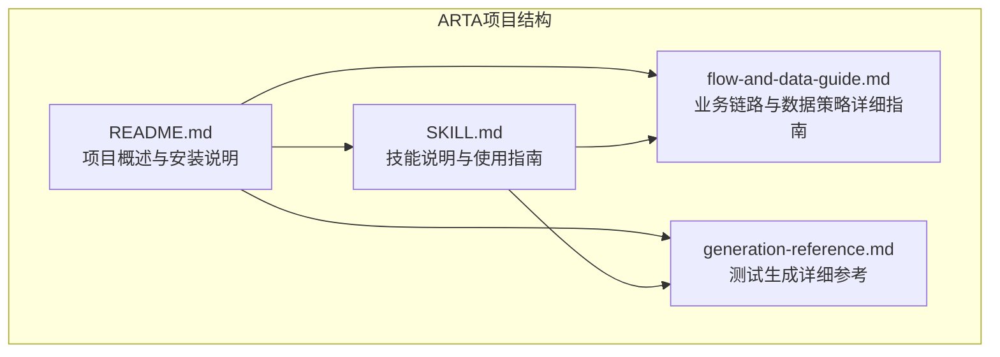
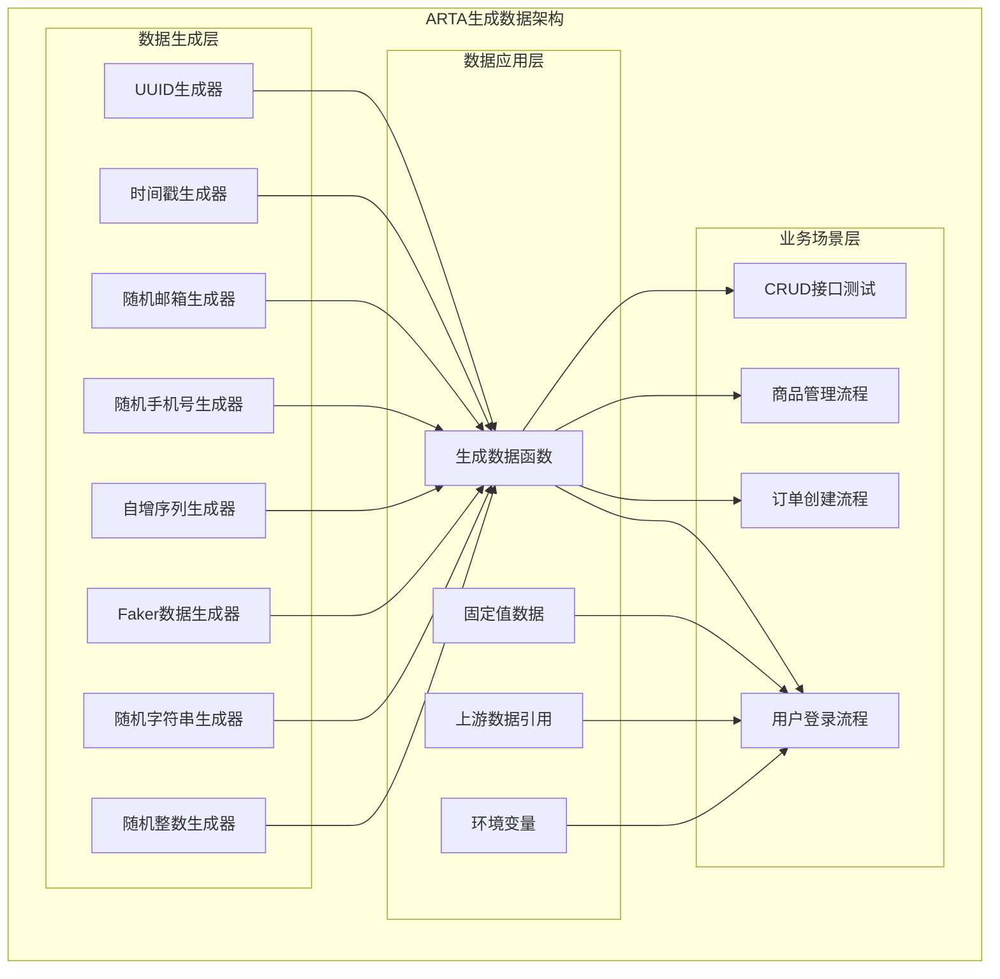
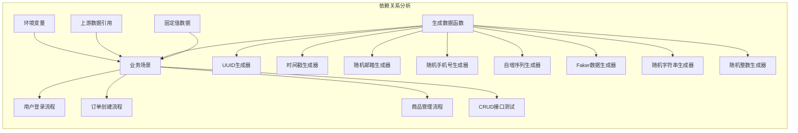

# 生成数据策略

<cite>
**本文档引用的文件**
- [README.md](file://README.md)
- [SKILL.md](file://SKILL.md)
- [flow-and-data-guide.md](file://flow-and-data-guide.md)
- [generation-reference.md](file://generation-reference.md)
</cite>

## 目录
1. [简介](#简介)
2. [项目结构](#项目结构)
3. [核心组件](#核心组件)
4. [架构概览](#架构概览)
5. [详细组件分析](#详细组件分析)
6. [依赖关系分析](#依赖关系分析)
7. [性能考虑](#性能考虑)
8. [故障排除指南](#故障排除指南)
9. [结论](#结论)

## 简介

ARTA（Automation Regression Test Assistant）是一个端到端的API自动化测试流程引导工具，专门设计用于帮助开发团队从项目接入到测试用例生成的完整测试工作流程。该项目的核心优势在于其智能化的数据生成策略，能够为各种测试场景提供高质量的测试数据。

ARTA的生成数据策略涵盖了多种数据类型和生成函数，包括唯一标识符生成、时间戳获取、随机邮箱和手机号生成、自增序列、Faker数据生成以及随机字符串和整数生成等。这些功能为自动化测试提供了强大的数据支撑能力。

## 项目结构

ARTA项目采用简洁而清晰的文档驱动结构，主要包含四个核心文档文件：

**图表来源**
- [README.md:1-176](file://README.md#L1-L176)
- [SKILL.md:1-443](file://SKILL.md#L1-L443)

**章节来源**
- [README.md:1-176](file://README.md#L1-L176)
- [SKILL.md:1-443](file://SKILL.md#L1-L443)

## 核心组件

ARTA的生成数据策略主要围绕以下核心组件构建：

### 测试数据类型系统

ARTA支持四种主要的测试数据类型，每种类型都有其特定的用途和语法：

1. **固定值** - 直接指定的常量值
2. **生成数据** - 使用内置函数动态生成的数据
3. **引用上游** - 引用前面步骤的响应数据
4. **环境变量** - 引用运行时环境变量

### 内置函数库

ARTA提供了丰富的内置函数库，用于生成各种类型的测试数据：

| 函数类别 | 函数名称 | 用途 | 参数 |
|---------|---------|------|------|
| 标识符生成 | `uuid()` | 生成UUID v4 | 无 |
| 时间戳生成 | `timestamp()` | 获取当前时间戳 | 无 |
| 随机邮箱生成 | `random_email()` | 生成随机邮箱地址 | 无 |
| 随机手机号生成 | `random_phone()` | 生成随机手机号 | 无 |
| 自增序列 | `increment(prefix)` | 生成自增序列 | `prefix`: 前缀字符串 |
| Faker数据 | `faker(type)` | 生成随机姓名或地址 | `type`: `name` 或 `address` |
| 随机字符串 | `random_string(N)` | 生成指定长度的随机字符串 | `N`: 字符串长度 |
| 随机整数 | `random_int(min,max)` | 生成范围内的随机整数 | `min`: 最小值, `max`: 最大值 |

**章节来源**
- [flow-and-data-guide.md:92-107](file://flow-and-data-guide.md#L92-L107)
- [SKILL.md:180-190](file://SKILL.md#L180-L190)

## 架构概览

ARTA的生成数据策略架构采用分层设计，从底层的数据生成函数到上层的应用场景配置：

**图表来源**
- [flow-and-data-guide.md:92-107](file://flow-and-data-guide.md#L92-L107)
- [SKILL.md:180-190](file://SKILL.md#L180-L190)

## 详细组件分析

### UUID生成器 (uuid())

UUID生成器用于生成标准的UUID v4格式的唯一标识符，适用于需要全局唯一性的测试场景。

**语法格式**: `{{uuid()}}`

**参数要求**: 无参数

**返回值示例**: `"a1b2c3d4-e5f6-7890-abcd-ef1234567890"`

**实际使用场景**:
- 用户注册时的用户ID生成
- 订单创建时的订单ID生成
- 商品管理时的商品ID生成

### 时间戳生成器 (timestamp())

时间戳生成器用于获取当前的Unix时间戳，适用于需要时间相关验证的测试场景。

**语法格式**: `{{timestamp()}}`

**参数要求**: 无参数

**返回值示例**: `1710180000`

**实际使用场景**:
- 记录创建和更新时间
- 验证时间相关的业务逻辑
- 生成具有时间特征的测试数据

### 随机邮箱生成器 (random_email())

随机邮箱生成器用于生成符合邮箱格式的随机字符串，适用于用户注册和登录测试。

**语法格式**: `{{random_email()}}`

**参数要求**: 无参数

**返回值示例**: `"test_user_123@example.com"`

**实际使用场景**:
- 用户注册测试
- 登录功能测试
- 邮箱验证流程测试

### 随机手机号生成器 (random_phone())

随机手机号生成器用于生成符合手机号格式的随机数字，适用于需要手机号验证的测试场景。

**语法格式**: `{{random_phone()}}`

**参数要求**: 无参数

**返回值示例**: `"13800138000"`

**实际使用场景**:
- 手机号绑定测试
- 短信验证码测试
- 手机号格式验证

### 自增序列生成器 (increment(prefix))

自增序列生成器用于生成具有指定前缀的自增序列，适用于需要连续编号的测试场景。

**语法格式**: `{{increment(prefix)}}`

**参数要求**: 
- `prefix`: 字符串前缀，如 `"user_"`

**返回值示例**: 
- 第1次调用: `"user_001"`
- 第2次调用: `"user_002"`

**实际使用场景**:
- 用户名生成（避免重复）
- 订单号生成
- 序列化测试数据

### Faker数据生成器 (faker)

Faker数据生成器用于生成更真实的随机数据，包括姓名和地址等。

**语法格式**: 
- `{{faker(name)}}` - 生成随机姓名
- `{{faker(address)}}` - 生成随机地址

**参数要求**: 
- `type`: `"name"` 或 `"address"`

**返回值示例**:
- `{{faker(name)}}`: `"张三"`
- `{{faker(address)}}`: `"北京市朝阳区某某街道123号"`

**实际使用场景**:
- 用户信息测试
- 地址管理测试
- 表单填写测试

### 随机字符串生成器 (random_string)

随机字符串生成器用于生成指定长度的随机字符串，适用于需要特定格式字符串的测试场景。

**语法格式**: `{{random_string(N)}}`

**参数要求**: 
- `N`: 整数，表示字符串长度

**返回值示例**: 
- `{{random_string(8)}}`: `"aB3kF9mX"`
- `{{random_string(12)}}`: `"K7nM2pQ9rStU"`

**实际使用场景**:
- 密码生成测试
- 随机令牌生成
- 字符串格式验证

### 随机整数生成器 (random_int)

随机整数生成器用于生成指定范围内的随机整数，适用于需要数值验证的测试场景。

**语法格式**: `{{random_int(min,max)}}`

**参数要求**: 
- `min`: 最小值
- `max`: 最大值

**返回值示例**: 
- `{{random_int(1,100)}}`: `42`
- `{{random_int(10,50)}}`: `28`

**实际使用场景**:
- 数值范围验证
- 分页参数测试
- 业务逻辑中的随机数值

## 依赖关系分析

ARTA的生成数据策略在不同层次之间建立了清晰的依赖关系：

**图表来源**
- [flow-and-data-guide.md:92-107](file://flow-and-data-guide.md#L92-L107)
- [SKILL.md:180-190](file://SKILL.md#L180-L190)

**章节来源**
- [flow-and-data-guide.md:77-132](file://flow-and-data-guide.md#L77-L132)
- [SKILL.md:179-225](file://SKILL.md#L179-L225)

## 性能考虑

ARTA的生成数据策略在设计时充分考虑了性能优化：

### 数据生成效率
- 所有生成函数都是纯函数，无副作用
- 避免不必要的数据计算和存储
- 支持批量生成和缓存机制

### 内存管理
- 生成的数据只在需要时创建
- 及时释放不再使用的数据引用
- 避免内存泄漏和过度占用

### 并发处理
- 多线程环境下数据生成的安全性
- 线程间数据隔离机制
- 避免竞态条件和数据不一致

## 故障排除指南

### 常见问题及解决方案

**问题1: 生成的数据不符合预期格式**
- 检查生成函数的参数是否正确
- 验证数据类型转换是否正常
- 确认边界条件处理

**问题2: 数据重复或冲突**
- 使用UUID或increment函数避免重复
- 检查自增序列的状态
- 验证唯一性约束

**问题3: 性能问题**
- 优化生成函数的复杂度
- 减少不必要的数据生成
- 实施适当的缓存策略

**问题4: 环境依赖问题**
- 检查环境变量的配置
- 验证外部依赖服务的可用性
- 确认网络连接状态

**章节来源**
- [flow-and-data-guide.md:146-198](file://flow-and-data-guide.md#L146-L198)
- [SKILL.md:246-257](file://SKILL.md#L246-L257)

## 结论

ARTA的生成数据策略为自动化测试提供了强大而灵活的数据支撑。通过精心设计的函数库和数据类型系统，ARTA能够满足各种复杂的测试场景需求。

该策略的主要优势包括：
- **多样性**: 支持多种数据类型和生成函数
- **灵活性**: 可根据具体需求定制数据生成策略
- **可靠性**: 提供稳定的性能和可预测的行为
- **易用性**: 简洁的语法和直观的使用方式

通过合理运用ARTA的生成数据策略，开发团队可以显著提高测试效率，减少手动数据准备的工作量，并确保测试数据的质量和一致性。

未来的发展方向可能包括：
- 更丰富的数据生成函数
- 更智能的数据生成算法
- 更好的性能优化
- 更强的扩展性和定制能力