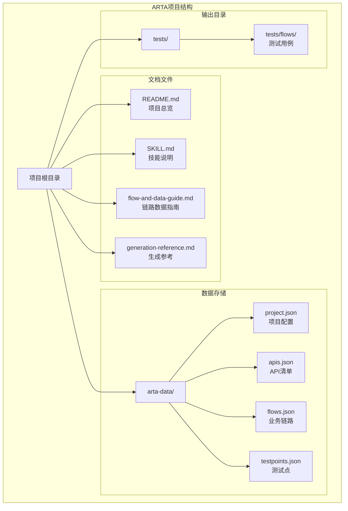
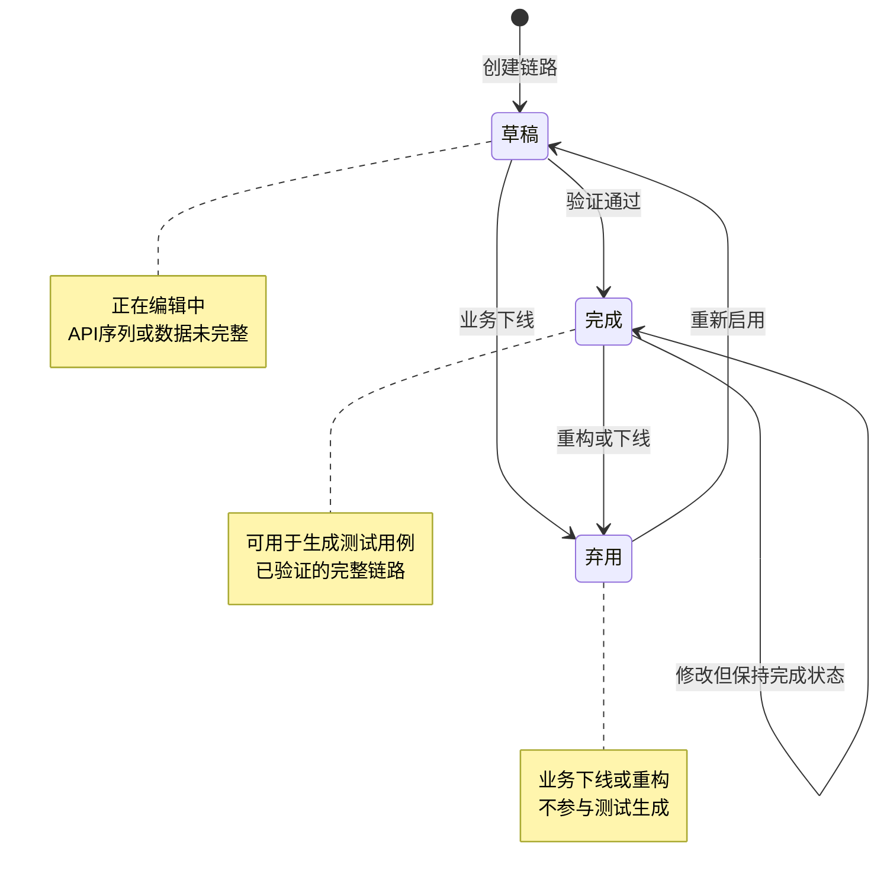
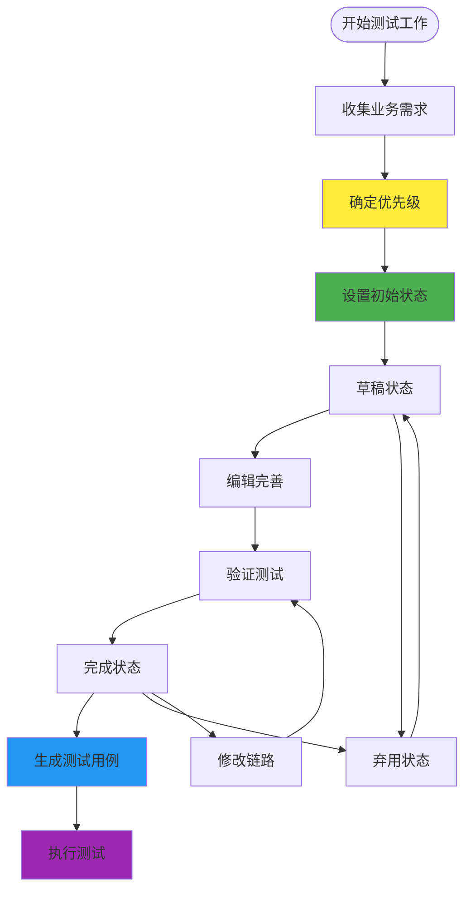
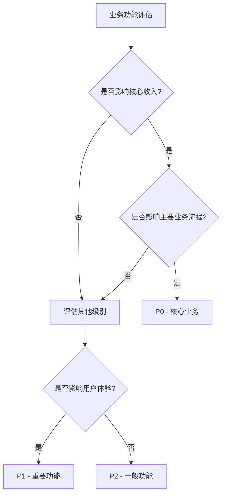
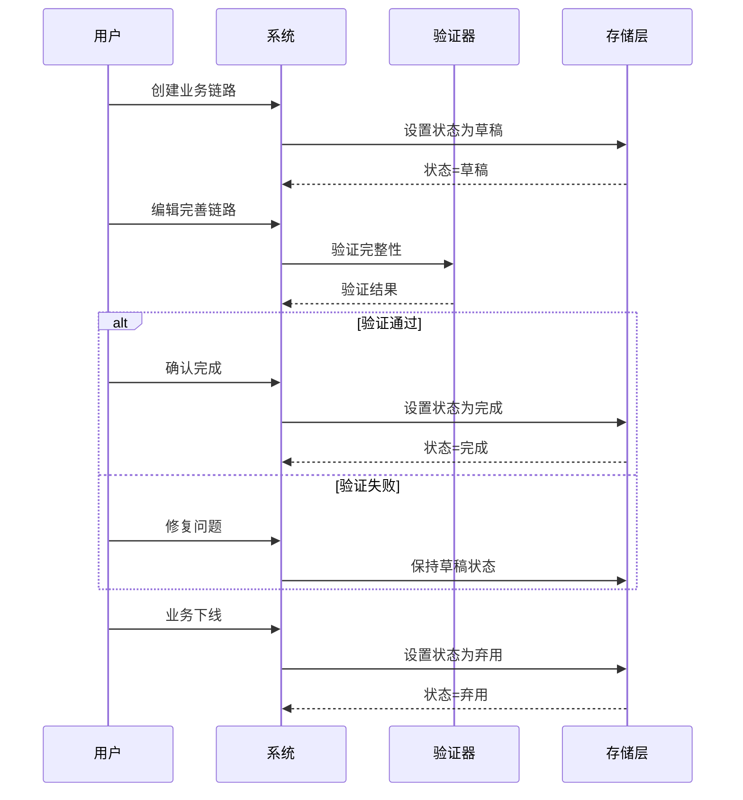
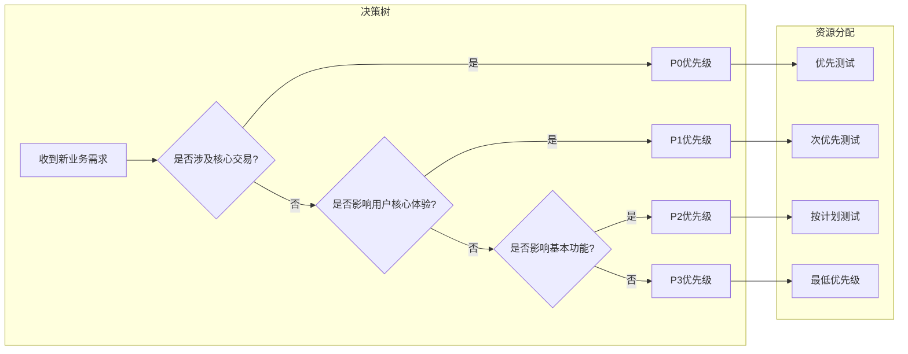
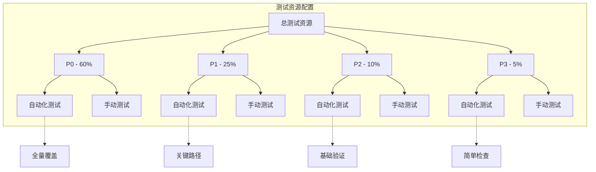
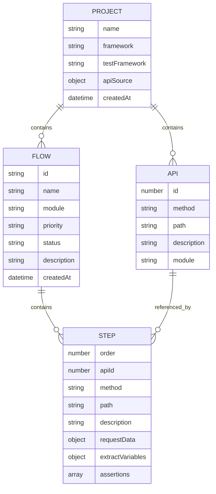

# 链路优先级与状态管理

<cite>
**本文档引用的文件**
- [README.md](file://README.md)
- [SKILL.md](file://SKILL.md)
- [flow-and-data-guide.md](file://flow-and-data-guide.md)
- [generation-reference.md](file://generation-reference.md)
</cite>

## 目录
1. [简介](#简介)
2. [项目结构](#项目结构)
3. [核心组件](#核心组件)
4. [架构概览](#架构概览)
5. [详细组件分析](#详细组件分析)
6. [依赖关系分析](#依赖关系分析)
7. [性能考虑](#性能考虑)
8. [故障排除指南](#故障排除指南)
9. [结论](#结论)
10. [附录](#附录)

## 简介

ARTA（Automation Regression Test Assistant）是一个端到端的API自动化测试流程引导工具，专门设计用于帮助开发团队从项目接入到测试用例生成的完整测试工作流程。本文档重点关注ARTA系统中业务链路的优先级管理和状态控制机制，这是确保测试资源合理分配和测试执行效率的关键要素。

ARTA采用四阶段测试工作流程：项目接入、API扫描、业务链路记录、测试用例生成。在第三阶段的业务链路记录中，系统引入了完整的优先级分类体系和状态管理机制，为测试资源的智能化分配提供了理论基础和实践指导。

## 项目结构

ARTA项目采用简洁而功能明确的文件组织结构，主要包含四个核心文档文件：

**图表来源**
- [README.md:151-162](file://README.md#L151-L162)
- [SKILL.md:419-431](file://SKILL.md#L419-L431)

**章节来源**
- [README.md:1-176](file://README.md#L1-L176)
- [SKILL.md:419-431](file://SKILL.md#L419-L431)

## 核心组件

### 优先级管理系统

ARTA系统实现了标准化的四等级优先级分类体系，为业务链路的测试资源分配提供明确的决策依据：

| 优先级等级 | 定义 | 适用场景 | 业务影响评估 |
|------------|------|----------|-------------|
| **P0** | 核心业务，宕机影响收入 | 登录、下单、支付等关键交易流程 | 高风险，直接影响业务收入和用户体验 |
| **P1** | 重要功能，影响用户体验 | 搜索、评论、收藏等核心功能 | 中等风险，影响用户使用体验 |
| **P2** | 一般功能，可降级 | 个人设置、通知偏好等辅助功能 | 低风险，可接受短暂不可用 |
| **P3** | 边缘功能 | 帮助页、反馈表单等非核心功能 | 极低风险，不影响主要业务流程 |

### 状态管理机制

系统采用三状态模型来管理业务链路的生命周期：

**图表来源**
- [flow-and-data-guide.md:211-218](file://flow-and-data-guide.md#L211-L218)

**章节来源**
- [flow-and-data-guide.md:200-218](file://flow-and-data-guide.md#L200-L218)

## 架构概览

ARTA的优先级与状态管理体系嵌入在整个测试工作流程中，形成了完整的决策支持系统：

**图表来源**
- [SKILL.md:143-257](file://SKILL.md#L143-L257)
- [flow-and-data-guide.md:200-218](file://flow-and-data-guide.md#L200-L218)

## 详细组件分析

### 优先级决策标准

#### P0优先级决策流程

**图表来源**
- [flow-and-data-guide.md:200-210](file://flow-and-data-guide.md#L200-L210)

#### 业务影响评估方法

系统采用多维度评估框架：

1. **财务影响评估**
   - 直接收入影响程度
   - 间接收入影响程度
   - 成本损失评估

2. **用户体验评估**
   - 用户活跃度影响
   - 用户留存影响
   - 用户满意度影响

3. **业务连续性评估**
   - 服务可用性要求
   - 数据完整性要求
   - 安全性要求

### 状态转换机制

#### 状态转换触发条件

**图表来源**
- [flow-and-data-guide.md:211-218](file://flow-and-data-guide.md#L211-L218)

#### 状态变更审批流程

系统支持分级审批机制：

1. **P0级变更**：自动审批，快速生效
2. **P1级变更**：团队负责人审批
3. **P2级变更**：技术主管审批
4. **P3级变更**：普通审批

### 优先级排序实际应用

#### 决策流程示例

**图表来源**
- [flow-and-data-guide.md:200-210](file://flow-and-data-guide.md#L200-L210)

#### 实际应用场景

1. **紧急修复场景**
   - P0级问题：立即修复，优先测试
   - P1级问题：24小时内修复，优先测试
   - P2级问题：72小时内修复，正常测试
   - P3级问题：按计划修复，常规测试

2. **功能上线场景**
   - P0级功能：全量测试，发布前验证
   - P1级功能：抽样测试，关键路径验证
   - P2级功能：基础测试，核心功能验证
   - P3级功能：简单验证，基本可用性检查

### 测试资源分配策略

#### 基于优先级的资源分配

**图表来源**
- [generation-reference.md:220-241](file://generation-reference.md#L220-L241)

**章节来源**
- [generation-reference.md:220-241](file://generation-reference.md#L220-L241)

## 依赖关系分析

### 数据依赖关系

**图表来源**
- [flow-and-data-guide.md:5-75](file://flow-and-data-guide.md#L5-L75)

### 状态管理依赖

系统状态管理依赖于以下关键组件：

1. **数据存储层**：负责持久化链路状态
2. **验证引擎**：确保状态转换的合法性
3. **审批系统**：处理状态变更的授权
4. **监控告警**：跟踪状态变化和异常

**章节来源**
- [flow-and-data-guide.md:5-75](file://flow-and-data-guide.md#L5-L75)

## 性能考虑

### 优先级排序性能

系统的优先级排序算法具有以下性能特征：

- **时间复杂度**：O(n log n)，其中n为链路数量
- **空间复杂度**：O(n)，用于存储排序结果
- **实时性**：支持动态排序和实时更新

### 状态管理性能

状态管理机制优化了以下方面：

1. **状态缓存**：减少频繁的状态查询开销
2. **批量操作**：支持批量状态更新
3. **异步处理**：避免阻塞主流程

## 故障排除指南

### 常见问题及解决方案

#### 优先级设置错误

**问题症状**：
- 测试资源分配不合理
- 测试执行顺序混乱

**解决步骤**：
1. 检查业务影响评估记录
2. 重新评估功能重要性
3. 调整优先级设置
4. 验证资源分配合理性

#### 状态转换异常

**问题症状**：
- 状态无法正常转换
- 系统显示状态不一致

**解决步骤**：
1. 检查状态转换条件
2. 验证数据完整性
3. 执行状态同步
4. 记录异常日志

#### 资源分配冲突

**问题症状**：
- 测试执行时间过长
- 资源竞争导致延迟

**解决步骤**：
1. 分析当前资源使用情况
2. 调整优先级权重
3. 优化测试执行顺序
4. 监控资源使用趋势

**章节来源**
- [SKILL.md:434-443](file://SKILL.md#L434-L443)

## 结论

ARTA的业务链路优先级与状态管理体系为自动化测试提供了科学的决策框架。通过标准化的四等级优先级分类和三状态管理模式，系统实现了测试资源的智能化分配和测试执行的高效管理。

该体系的核心价值在于：

1. **明确的决策标准**：为测试资源分配提供客观依据
2. **灵活的状态管理**：适应业务变化和测试需求
3. **高效的执行机制**：优化测试流程和资源利用
4. **完善的监控体系**：确保状态的一致性和可追溯性

通过持续优化和完善，ARTA的优先级与状态管理机制将成为提升测试效率和质量的重要保障。

## 附录

### 最佳实践建议

#### 优先级管理最佳实践

1. **定期评审**：每季度重新评估优先级设置
2. **数据驱动**：基于实际业务数据调整优先级
3. **团队协作**：多方参与优先级决策过程
4. **持续改进**：根据测试效果优化优先级策略

#### 状态管理最佳实践

1. **及时更新**：状态变更后立即同步更新
2. **完整记录**：保留所有状态变更历史
3. **清晰标识**：使用明确的状态标识和说明
4. **定期清理**：定期清理无效和过期的状态

#### 生命周期管理策略

1. **预防性维护**：定期检查和维护现有链路
2. **渐进式升级**：逐步替换过时的测试链路
3. **版本控制**：对重要的状态变更进行版本管理
4. **知识传承**：建立状态变更的知识库和培训机制