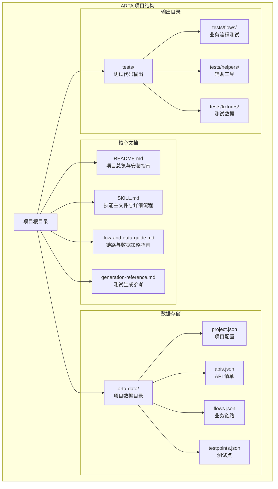
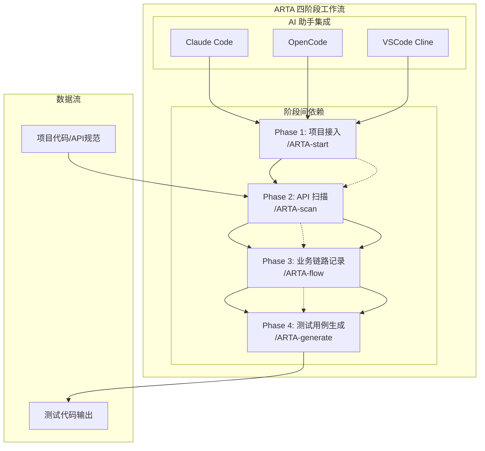
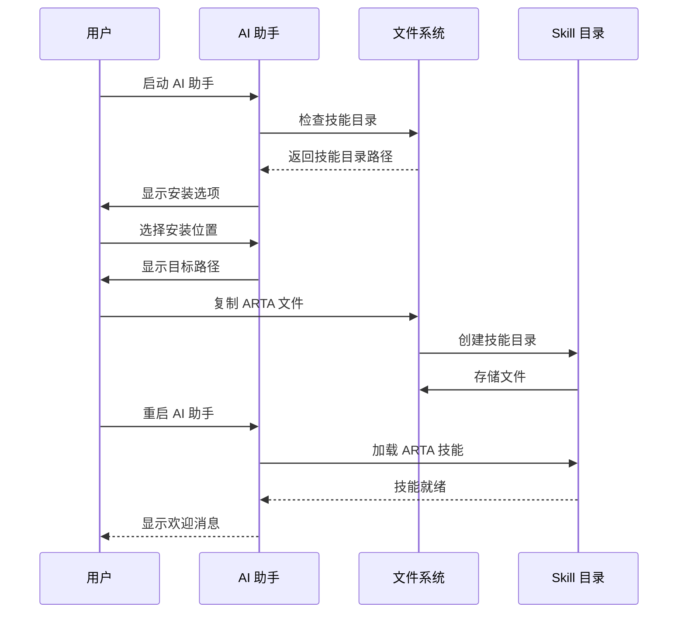
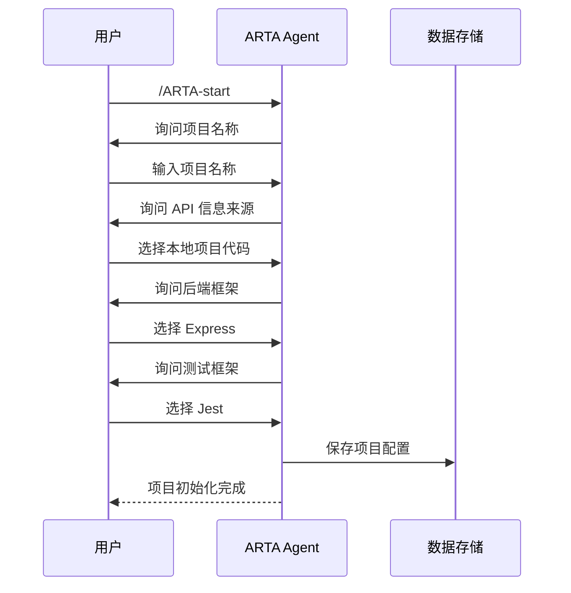
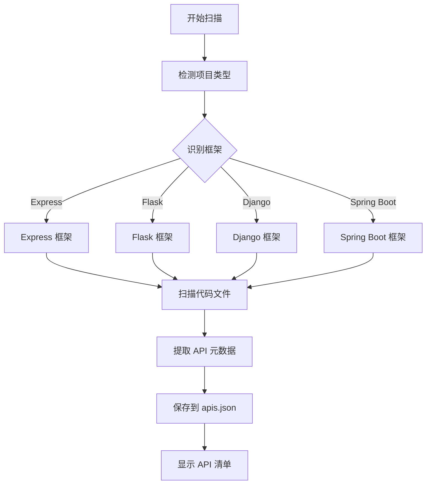
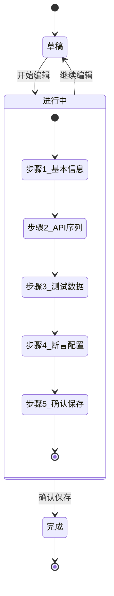
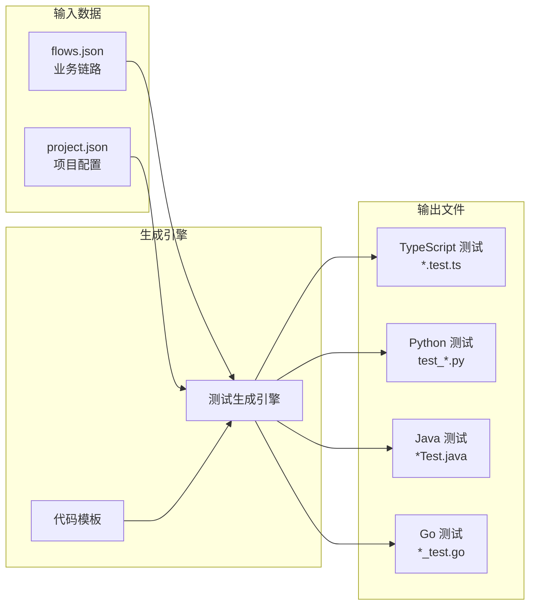
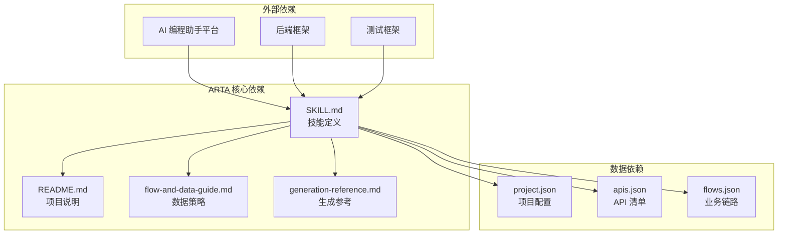
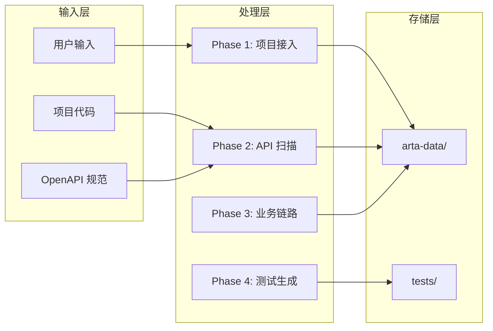

# 快速开始

<cite>
**本文引用的文件**
- [README.md](file://README.md)
- [SKILL.md](file://SKILL.md)
- [flow-and-data-guide.md](file://flow-and-data-guide.md)
- [generation-reference.md](file://generation-reference.md)
</cite>

## 目录
1. [简介](#简介)
2. [项目结构](#项目结构)
3. [核心组件](#核心组件)
4. [架构概览](#架构概览)
5. [详细组件分析](#详细组件分析)
6. [依赖关系分析](#依赖关系分析)
7. [性能考虑](#性能考虑)
8. [故障排除指南](#故障排除指南)
9. [结论](#结论)
10. [附录](#附录)

## 简介

ARTA（Automation Regression Test Assistant）是一个端到端 API 自动化测试流程引导工具，专为开发团队设计，帮助从项目接入到测试用例生成的完整测试工作流程。该工具支持多种 AI 编程助手平台，包括 Claude Code、OpenCode 和 VSCode Cline，提供自然语言优先的交互体验。

ARTA 的核心价值在于其四阶段测试工作流程：项目接入、API 扫描、业务链路记录和测试用例生成。通过智能化的引导机制，即使是没有丰富测试经验的开发者也能快速上手并生成高质量的自动化测试代码。

## 项目结构

ARTA 项目采用简洁明了的文档驱动结构，主要包含四个核心文件：



**图表来源**
- [README.md: 15-30:15-30](file://README.md#L15-L30)
- [SKILL.md: 420-431:420-431](file://SKILL.md#L420-L431)

**章节来源**
- [README.md: 1-176:1-176](file://README.md#L1-L176)
- [SKILL.md: 1-443:1-443](file://SKILL.md#L1-L443)

## 核心组件

### 技术栈支持矩阵

ARTA 支持多种主流技术栈组合，为不同语言和框架的项目提供统一的测试生成能力：

| 后端框架 | 测试框架 | 语言 |
|---------|---------|------|
| Express, NestJS | Jest, Vitest, Mocha | TypeScript |
| Flask, Django, FastAPI | Pytest | Python |
| Spring Boot | JUnit 5 | Java |
| Gin, Echo | Go testing | Go |

### 数据存储架构

所有项目数据采用 JSON 格式存储，确保数据的可移植性和易维护性：

| 文件 | 内容 | 存储位置 |
|------|------|----------|
| `arta-data/project.json` | 项目配置信息 | `arta-data/` |
| `arta-data/apis.json` | API 清单和元数据 | `arta-data/` |
| `arta-data/flows.json` | 业务链路和测试场景 | `arta-data/` |
| `arta-data/testpoints.json` | 导入的测试点 | `arta-data/` |

**章节来源**
- [README.md: 22-30:22-30](file://README.md#L22-L30)
- [README.md: 151-162:151-162](file://README.md#L151-L162)
- [SKILL.md: 420-431:420-431](file://SKILL.md#L420-L431)

## 架构概览

ARTA 采用分阶段的流水线架构，每个阶段都有明确的目标和输出：



**图表来源**
- [README.md: 9-12:9-12](file://README.md#L9-L12)
- [SKILL.md: 12-16:12-16](file://SKILL.md#L12-L16)

## 详细组件分析

### 安装配置组件

#### 环境要求

ARTA 对运行环境有明确的要求，确保在各种 AI 编程助手平台上都能稳定运行：

- **AI 助手平台**：支持 Claude Code、OpenCode、VSCode Cline 等具备 Skill 功能的 AI 编程助手
- **项目访问**：项目代码必须位于可访问的工作目录中
- **网络连接**：用于访问 OpenAPI 规范文件（如果选择在线 API 源）

#### 安装步骤详解



**图表来源**
- [README.md: 38-54:38-54](file://README.md#L38-L54)

#### 支持的 AI 助手平台

| 平台 | 安装目录 | 特殊说明 |
|------|----------|----------|
| **Claude Code** | `.claude/skills/` | 需要在 Claude Code 应用中启用技能功能 |
| **OpenCode** | `.opencode/skills/` | 支持本地和远程技能部署 |
| **VSCode Cline** | `.vscode/cline/skills/` | 需要在 VSCode 中安装 Cline 扩展 |

**章节来源**
- [README.md: 33-54:33-54](file://README.md#L33-L54)

### 使用方法组件

#### 启动方式

ARTA 支持两种启动方式，满足不同用户的使用习惯：

**自然语言启动**
```
ARTA
```

**指令启动**
```
/ARTA-start
```

两种方式都会触发相同的初始化流程，引导用户完成项目配置。

#### 指令速查表

| 指令 | 功能 | 使用场景 |
|------|------|----------|
| `/ARTA-start` | 启动新项目，配置基本信息 | 项目初始化 |
| `/ARTA-scan` | 扫描项目代码或解析 OpenAPI | API 发现和分析 |
| `/ARTA-flow` | 添加/查看/编辑业务链路 | 业务场景建模 |
| `/ARTA-testpoint` | 导入 mermaid 思维导图测试点 | 快速测试点导入 |
| `/ARTA-generate` | 基于链路生成测试用例代码 | 测试代码生成 |
| `/ARTA-status` | 查看项目当前状态和进度 | 进度跟踪 |
| `/ARTA-export` | 导出所有配置和测试文件 | 项目交付 |

**章节来源**
- [README.md: 56-83:56-83](file://README.md#L56-L83)
- [SKILL.md: 18-29:18-29](file://SKILL.md#L18-L29)

### 第一个项目示例

让我们通过一个完整的对话流程来演示 ARTA 的使用过程：

#### Phase 1: 项目接入



**图表来源**
- [README.md: 86-100:86-100](file://README.md#L86-L100)

#### Phase 2: API 扫描



**图表来源**
- [SKILL.md: 81-140:81-140](file://SKILL.md#L81-L140)

#### Phase 3: 业务链路记录



**图表来源**
- [SKILL.md: 143-257:143-257](file://SKILL.md#L143-L257)

#### Phase 4: 测试用例生成



**图表来源**
- [SKILL.md: 297-377:297-377](file://SKILL.md#L297-L377)

**章节来源**
- [README.md: 84-139:84-139](file://README.md#L84-L139)

### 测试数据策略组件

ARTA 提供了灵活的测试数据生成和管理策略，支持四种主要的数据类型：

#### 数据类型详解

| 类型 | 语法 | 示例 | 使用场景 |
|------|------|------|----------|
| **固定值** | 直接写值 | `"testuser001"` | 已知的测试账号或配置 |
| **生成数据** | `{{函数()}}` | `{{uuid()}}`, `{{random_email()}}` | 避免数据冲突的动态生成 |
| **引用上游** | `${步骤.字段}` | `${login.response.token}` | 跨步骤数据传递 |
| **环境变量** | `$ENV{变量}` | `$ENV{BASE_URL}` | 运行时配置 |

#### 生成函数库

| 函数 | 说明 | 示例输出 |
|------|------|---------|
| `{{uuid()}}` | UUID v4 | `"a1b2c3d4-..."` |
| `{{timestamp()}}` | 当前时间戳 | `1710180000` |
| `{{random_email()}}` | 随机邮箱 | `"test_abc123@test.com"` |
| `{{random_phone()}}` | 随机手机号 | `"13800138001"` |
| `{{increment(prefix)}}` | 自增序列 | `"user_001"`, `"user_002"` |
| `{{faker(name)}}` | 随机姓名 | `"张三"` |

**章节来源**
- [README.md: 140-150:140-150](file://README.md#L140-L150)
- [flow-and-data-guide.md: 77-132:77-132](file://flow-and-data-guide.md#L77-L132)

## 依赖关系分析

### 技术依赖关系



**图表来源**
- [SKILL.md: 1-443:1-443](file://SKILL.md#L1-L443)
- [README.md: 1-176:1-176](file://README.md#L1-L176)

### 数据流依赖



**图表来源**
- [SKILL.md: 34-377:34-377](file://SKILL.md#L34-L377)

**章节来源**
- [SKILL.md: 34-377:34-377](file://SKILL.md#L34-L377)
- [README.md: 151-162:151-162](file://README.md#L151-L162)

## 性能考虑

### 扫描性能优化

ARTA 在 API 扫描阶段采用了多项性能优化策略：

- **智能框架识别**：通过分析项目文件（如 package.json、requirements.txt、pom.xml、go.mod）快速识别后端框架类型
- **文件过滤**：自动排除 node_modules、vendor、.git、dist、build 等无关目录
- **正则表达式优化**：针对不同框架使用专门的路由匹配模式，提高扫描效率
- **模块化分组**：按路径前缀自动分组 API，便于后续管理和测试

### 内存使用优化

- **增量存储**：只在必要时读取和写入数据文件，减少内存占用
- **流式处理**：对于大型 API 清单，采用流式处理方式避免内存溢出
- **缓存机制**：对频繁访问的数据建立缓存，减少重复计算

### 并发处理

- **异步操作**：API 扫描和测试生成支持异步处理，提升用户体验
- **任务队列**：复杂的测试生成任务采用队列管理，确保稳定性

## 故障排除指南

### 常见安装问题

**问题：技能无法加载**
- 检查技能目录权限，确保 AI 助手有读取权限
- 验证文件完整性，重新下载并复制技能文件
- 确认 AI 助手版本支持技能功能

**问题：API 扫描失败**
- 检查项目代码路径是否正确
- 确认项目根目录包含正确的构建文件
- 验证网络连接（如果是在线 API 源）

**问题：测试生成错误**
- 检查业务链路是否完整（状态为 done）
- 确认测试框架配置正确
- 验证生成模板文件是否存在

### 数据恢复

如果遇到意外情况导致数据丢失，ARTA 提供了完善的备份和恢复机制：

1. **自动备份**：每次重要操作都会创建备份文件
2. **手动导出**：使用 `/ARTA-export` 指令导出完整项目
3. **版本控制**：建议配合 Git 等版本控制系统使用

**章节来源**
- [SKILL.md: 380-400:380-400](file://SKILL.md#L380-L400)

## 结论

ARTA 项目通过其精心设计的四阶段工作流程和强大的 AI 编程助手集成，为 API 自动化测试提供了一个完整而高效的解决方案。其核心优势包括：

- **自然语言优先**：无需记忆复杂指令，通过自然语言即可完成复杂的测试流程
- **断点续作**：支持随时暂停和继续，适应不同的工作流程
- **多框架支持**：一次配置，多框架代码生成，提升开发效率
- **智能提醒**：自动建议 CRUD 清理步骤，确保测试数据的一致性

对于初学者而言，ARTA 提供了友好的入门路径，从简单的 `/ARTA-start` 指令开始，逐步深入到复杂的业务链路记录和测试生成。通过遵循本文档提供的步骤和最佳实践，用户可以快速掌握 ARTA 的使用方法，并将其应用到实际的项目开发中。

## 附录

### 最佳实践建议

1. **项目组织**：建议将 ARTA 项目与业务代码分离，便于维护和版本控制
2. **数据管理**：定期导出项目数据，防止意外丢失
3. **测试策略**：优先记录核心业务流程，逐步扩展到边缘场景
4. **团队协作**：建立统一的测试数据生成规范，确保团队成员的一致性

### 常用场景

- **新项目启动**：使用 `/ARTA-start` 快速初始化项目配置
- **API 变更测试**：结合 `/ARTA-scan` 和 `/ARTA-flow` 记录新的业务场景
- **回归测试**：定期运行生成的测试用例，确保代码变更不影响现有功能
- **测试点导入**：使用 `/ARTA-testpoint` 快速导入思维导图中的测试场景