# 指令参考手册

<cite>
**本文档引用的文件**
- [README.md](file://README.md)
- [SKILL.md](file://SKILL.md)
- [flow-and-data-guide.md](file://flow-and-data-guide.md)
- [generation-reference.md](file://generation-reference.md)
</cite>

## 目录
1. [简介](#简介)
2. [项目结构](#项目结构)
3. [核心组件](#核心组件)
4. [架构概览](#架构概览)
5. [详细组件分析](#详细组件分析)
6. [依赖分析](#依赖分析)
7. [性能考虑](#性能考虑)
8. [故障排除指南](#故障排除指南)
9. [结论](#结论)
10. [附录](#附录)

## 简介

ARTA（Automation Regression Test Assistant）是一个端到端 API 自动化测试流程引导工具，专为开发团队设计，帮助从项目接入到测试用例生成的完整测试流程。该系统采用四阶段测试工作流程：项目接入 → API 扫描 → 业务链路记录 → 测试用例生成。

ARTA 的核心特色包括：
- **自然语言优先** - 无需记忆复杂指令，通过自然语言描述即可操作
- **断点续作** - 支持随时暂停和恢复，通过状态检查继续工作
- **增量操作** - 支持随时添加新 API、新链路，无需从头开始
- **智能提醒** - 包含写入操作的链路自动建议添加清理步骤
- **多框架支持** - 一次配置，生成多种测试框架代码

## 项目结构

ARTA 项目采用简洁的文档驱动结构，主要包含四个核心文件：

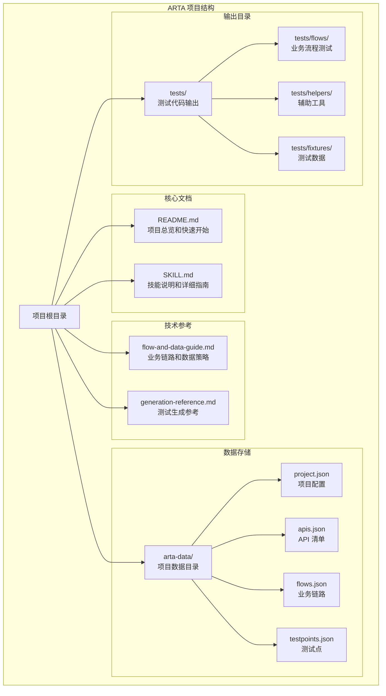

**图表来源**
- [README.md: 151-162:151-162](file://README.md#L151-L162)
- [SKILL.md: 419-431:419-431](file://SKILL.md#L419-L431)

**章节来源**
- [README.md: 1-176:1-176](file://README.md#L1-L176)
- [SKILL.md: 1-443:1-443](file://SKILL.md#L1-L443)

## 核心组件

ARTA 系统的核心组件围绕七个主要指令构建，每个指令都对应测试流程的一个特定阶段：

### 指令总览

| 指令 | 阶段 | 主要功能 | 语法格式 |
|------|------|----------|----------|
| `/ARTA-start` | Phase 1 | 启动新项目，配置基本信息 | `/ARTA-start` |
| `/ARTA-scan` | Phase 2 | 扫描项目代码或解析 OpenAPI | `/ARTA-scan` |
| `/ARTA-flow` | Phase 3 | 添加/查看/编辑业务链路 | `/ARTA-flow [操作] [参数]` |
| `/ARTA-testpoint` | Phase 3 | 导入 mermaid 思维导图测试点 | `/ARTA-testpoint` |
| `/ARTA-generate` | Phase 4 | 基于链路生成测试用例代码 | `/ARTA-generate` |
| `/ARTA-status` | 全流程 | 查看项目当前状态和进度 | `/ARTA-status` |
| `/ARTA-export` | 全流程 | 导出所有配置和测试文件 | `/ARTA-export [目标目录]` |

### 技术栈支持

ARTA 支持多种主流技术栈组合：

**后端框架支持：**
- Express, NestJS (TypeScript)
- Flask, Django, FastAPI (Python)
- Spring Boot (Java)
- Gin, Echo (Go)

**测试框架支持：**
- Jest, Vitest (TypeScript)
- Pytest (Python)
- JUnit 5 (Java)
- Go testing (Go)

**章节来源**
- [README.md: 22-30:22-30](file://README.md#L22-L30)
- [SKILL.md: 22-28:22-28](file://SKILL.md#L22-L28)

## 架构概览

ARTA 采用分层架构设计，通过清晰的指令边界和数据流实现端到端的测试流程自动化：

```mermaid
graph TB
subgraph "用户交互层"
CLI[命令行界面]
NL[自然语言处理]
end
subgraph "指令处理器层"
START[/ARTA-start 处理器]
SCAN[/ARTA-scan 处理器]
FLOW[/ARTA-flow 处理器]
TESTPOINT[/ARTA-testpoint 处理器]
GENERATE[/ARTA-generate 处理器]
STATUS[/ARTA-status 处理器]
EXPORT[/ARTA-export 处理器]
end
subgraph "数据管理层"
PROJECT[项目配置管理]
API[API 清单管理]
FLOW_DATA[业务链路管理]
TESTPOINT_DATA[测试点管理]
REPORT[报告生成]
end
subgraph "存储层"
FS[文件系统存储]
JSON[JSON 数据文件]
CACHE[内存缓存]
end
subgraph "输出层"
TEST_CODE[测试代码生成]
REPORT_OUTPUT[测试报告]
EXPORT_DIR[导出目录]
end
CLI --> START
CLI --> SCAN
CLI --> FLOW
CLI --> TESTPOINT
CLI --> GENERATE
CLI --> STATUS
CLI --> EXPORT
NL --> START
NL --> SCAN
NL --> FLOW
NL --> TESTPOINT
NL --> GENERATE
NL --> STATUS
NL --> EXPORT
START --> PROJECT
SCAN --> API
FLOW --> FLOW_DATA
TESTPOINT --> TESTPOINT_DATA
GENERATE --> TEST_CODE
STATUS --> PROJECT
STATUS --> API
STATUS --> FLOW_DATA
EXPORT --> EXPORT_DIR
PROJECT --> FS
API --> FS
FLOW_DATA --> FS
TESTPOINT_DATA --> FS
REPORT --> REPORT_OUTPUT
FS --> JSON
FS --> CACHE
```

**图表来源**
- [SKILL.md: 34-443:34-443](file://SKILL.md#L34-L443)
- [README.md: 14-21:14-21](file://README.md#L14-L21)

### 数据流架构

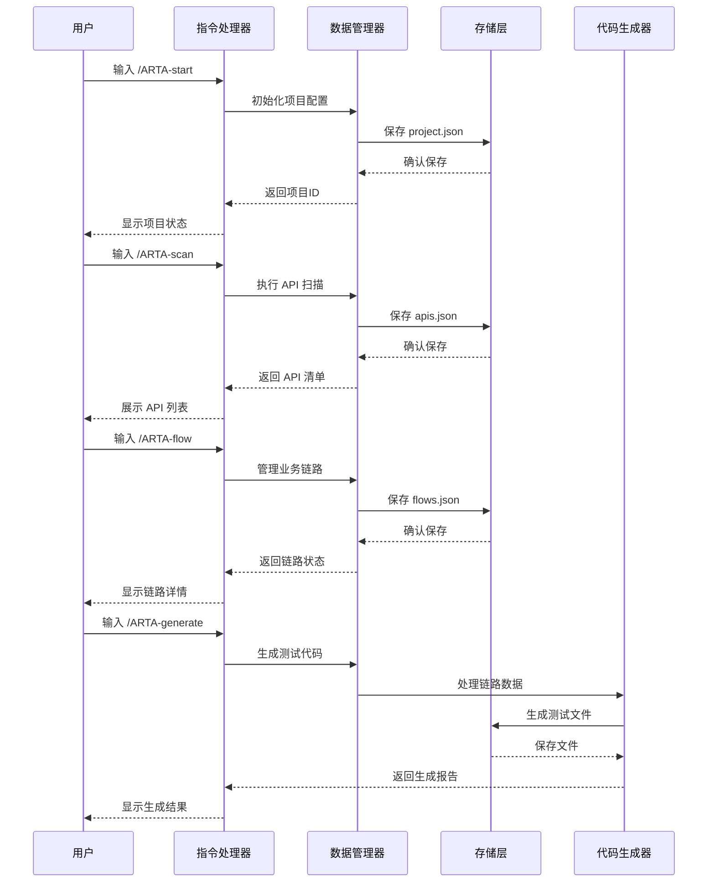

**图表来源**
- [SKILL.md: 306-310:306-310](file://SKILL.md#L306-L310)
- [README.md: 151-162:151-162](file://README.md#L151-L162)

## 详细组件分析

### /ARTA-start 指令 - 项目接入

#### 功能概述
`/ARTA-start` 指令负责启动新项目并配置基本信息，是整个 ARTA 流程的起点。

#### 交互流程
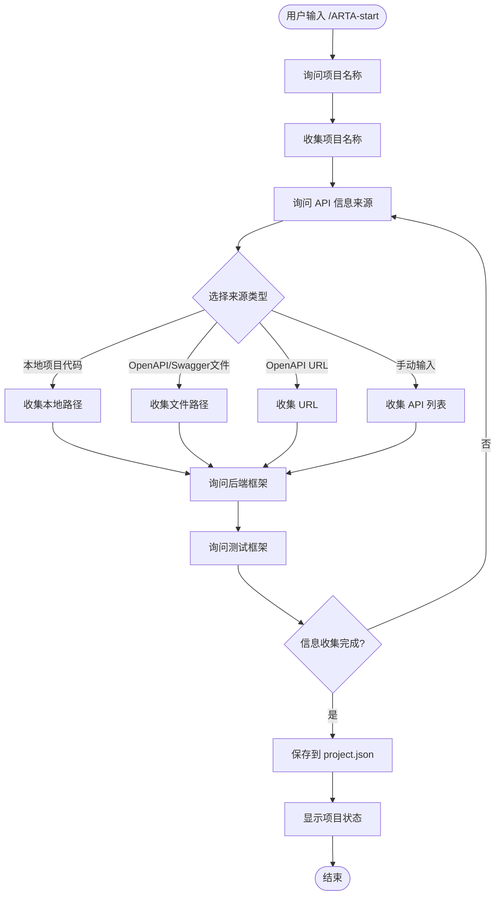

**图表来源**
- [SKILL.md: 50-77:50-77](file://SKILL.md#L50-L77)

#### 参数说明
- **必需参数**：项目名称
- **可选参数**：API 信息来源类型
- **配置项**：后端框架、测试框架、项目路径

#### 配置文件结构
项目配置存储在 `arta-data/project.json` 中，包含以下关键字段：
- `name`: 项目名称
- `framework`: 后端框架类型
- `testFramework`: 测试框架类型
- `apiSource`: API 来源配置
- `createdAt`: 创建时间戳

**章节来源**
- [SKILL.md: 34-77:34-77](file://SKILL.md#L34-L77)
- [README.md: 66-100:66-100](file://README.md#L66-L100)

### /ARTA-scan 指令 - API 扫描

#### 功能概述
`/ARTA-scan` 指令负责扫描项目代码或解析 OpenAPI 规范，生成 API 清单。

#### 扫描策略
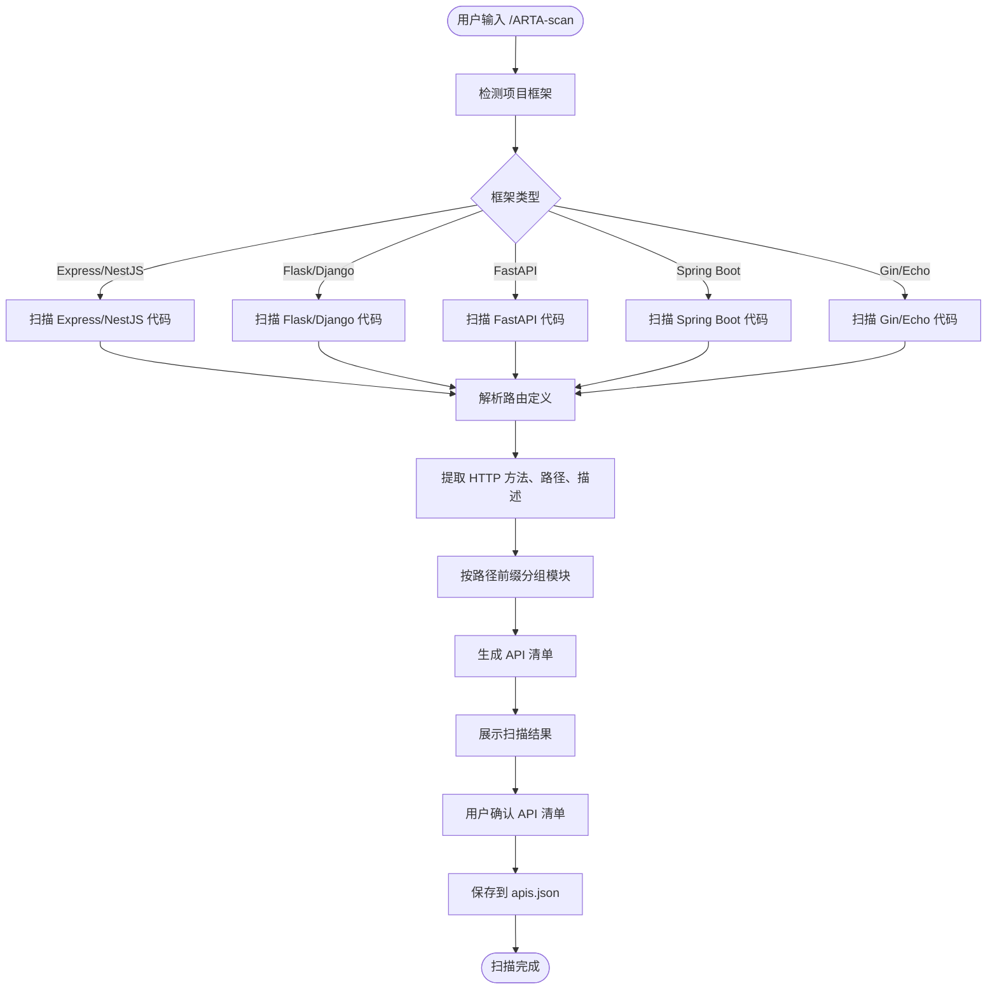

**图表来源**
- [SKILL.md: 81-140:81-140](file://SKILL.md#L81-L140)

#### 支持的框架识别规则

| 框架 | 关键标识 | 识别特征 |
|------|----------|----------|
| Express | `app.get/post/put/delete()` | 路由定义模式 |
| NestJS | `@Get()`, `@Post()`, `@Controller()` | 装饰器模式 |
| Flask | `@app.route()`, `@blueprint.route()` | 装饰器模式 |
| Django | `urlpatterns`, `path()`, `re_path()` | URL 配置模式 |
| FastAPI | `@app.get()`, `@router.post()` | 装饰器模式 |
| Spring Boot | `@GetMapping`, `@PostMapping`, `@RequestMapping` | 注解模式 |
| Gin | `r.GET()`, `r.POST()`, `group.GET()` | 路由注册模式 |
| Echo | `e.GET()`, `e.POST()`, `g.GET()` | 路由注册模式 |

#### OpenAPI 解析能力
- 支持 OpenAPI 3.0/3.1 和 Swagger 2.0
- 解析规范中的 paths、HTTP 方法、operationId
- 提取 tags 作为模块分组
- 解析请求/响应 schema

**章节来源**
- [SKILL.md: 81-140:81-140](file://SKILL.md#L81-L140)

### /ARTA-flow 指令 - 业务链路记录

#### 功能概述
`/ARTA-flow` 指令负责添加、查看和编辑业务链路，这是测试流程的核心组成部分。

#### 五步添加流程
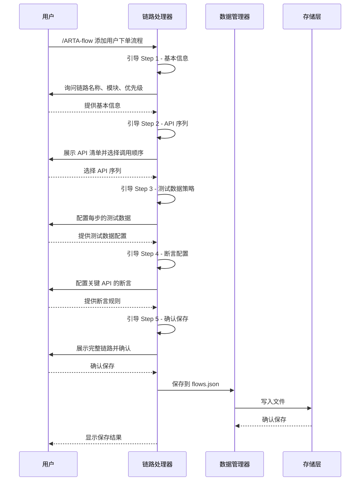

**图表来源**
- [SKILL.md: 147-225:147-225](file://SKILL.md#L147-L225)

#### 测试数据策略

| 数据类型 | 语法格式 | 示例用途 | 生成函数 |
|----------|----------|----------|----------|
| 固定值 | 直接写值 | `"testuser001"` | - |
| 生成数据 | `{{函数()}}` | `{{uuid()}}`, `{{random_email()}}` | `uuid()`, `timestamp()`, `random_email()`, `random_phone()`, `increment(prefix)`, `faker(type)` |
| 引用上游 | `${步骤.字段}` | `${login.response.token}` | `${stepN.变量名}`, `${stepN.response.路径}` |
| 环境变量 | `$ENV{变量}` | `$ENV{BASE_URL}` | `$ENV{变量名}` |

#### 断言类型支持

| 断言类型 | 语法格式 | 使用场景 | 示例 |
|----------|----------|----------|------|
| `status` | `{ "type": "status", "expected": 200 }` | HTTP 状态码验证 | 验证 200 成功响应 |
| `jsonpath` + `exists` | `{ "path": "$.data.token", "condition": "exists" }` | 字段存在性验证 | 验证 token 字段存在 |
| `jsonpath` + `equals` | `{ "path": "$.data.status", "condition": "equals", "expected": "active" }` | 值相等验证 | 验证状态为 active |
| `jsonpath` + `contains` | `{ "path": "$.message", "condition": "contains", "expected": "success" }` | 字符串包含验证 | 验证消息包含 success |
| `jsonpath` + `type` | `{ "path": "$.data.list", "condition": "type", "expected": "array" }` | 类型检查 | 验证返回值为数组 |
| `jsonpath` + `length_gte` | `{ "path": "$.data.list", "condition": "length_gte", "expected": 1 }` | 数组长度验证 | 验证至少有 1 个项目 |
| `response_time` | `{ "type": "response_time", "max_ms": 1000 }` | 性能验证 | 验证响应时间不超过 1 秒 |
| `header` | `{ "type": "header", "name": "Content-Type", "contains": "application/json" }` | 响应头验证 | 验证 Content-Type |

#### CRUD 接口处理策略

| 接口类型 | 建议测试场景 | 数据策略 | 清理策略 |
|----------|--------------|----------|----------|
| 创建(Create) | 成功创建、缺少必填字段、字段格式错误、重复创建 | 使用生成数据避免冲突 | 记录创建的资源 ID，测试结束后删除 |
| 更新(Update) | 更新成功、资源不存在、无权限、部分更新 | 引用创建步骤返回的 ID | 依赖前置资源存在 |
| 删除(Delete) | 删除成功、不存在的资源、无权限、级联删除 | 先创建后删除 | 通常放在测试最后执行 |
| 查询(Read) | 有数据、无数据、分页查询、条件筛选、无权限 | 先确保有测试数据 | 依赖前置数据存在 |

**章节来源**
- [SKILL.md: 143-258:143-258](file://SKILL.md#L143-L258)
- [flow-and-data-guide.md: 77-218:77-218](file://flow-and-data-guide.md#L77-L218)

### /ARTA-testpoint 指令 - 测试点导入

#### 功能概述
`/ARTA-testpoint` 指令负责导入 mermaid 思维导图格式的测试点，并将其转换为可执行的测试用例。

#### 导入流程
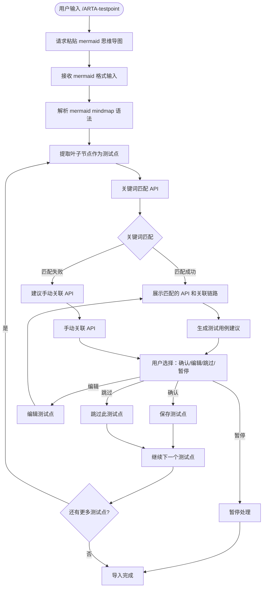

**图表来源**
- [SKILL.md: 261-295:261-295](file://SKILL.md#L261-L295)

#### 关键词匹配 API

| 关键词 | 匹配方法 | 匹配路径模式 |
|--------|----------|-------------|
| 登录/signin | POST | `/login`, `/auth/login`, `/signin` |
| 注册/signup | POST | `/register`, `/signup` |
| 查询/搜索/列表 | GET | `/list`, `/search`, `/query` |
| 创建/添加/新增 | POST | `/create`, `/add` |
| 更新/修改/编辑 | PUT/PATCH | `/update`, `/modify` |
| 删除/移除 | DELETE | `/delete`, `/remove` |

#### 处理流程
1. **解析阶段**：解析 mermaid mindmap 语法，提取叶子节点作为测试点
2. **匹配阶段**：通过关键词匹配算法关联到相应的 API
3. **建议阶段**：为每个测试点生成测试用例建议（名称、前置条件、步骤、预期结果、数据）
4. **确认阶段**：用户选择确认、编辑、跳过或暂停
5. **保存阶段**：将确认的测试点保存到 `arta-data/testpoints.json`

**章节来源**
- [SKILL.md: 261-295:261-295](file://SKILL.md#L261-L295)

### /ARTA-generate 指令 - 测试用例生成

#### 功能概述
`/ARTA-generate` 指令基于已完成的业务链路生成测试代码，支持多种测试框架和语言。

#### 生成策略
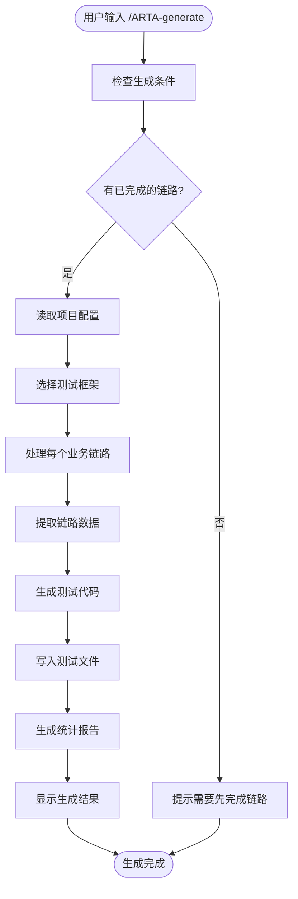

**图表来源**
- [SKILL.md: 297-377:297-377](file://SKILL.md#L297-L377)

#### 支持的测试框架和输出格式

| 框架 | 语言 | 文件命名 | 输出目录 |
|------|------|----------|----------|
| Jest / Vitest | TypeScript | `{flow_name}.test.ts` | `tests/flows/` |
| Mocha | TypeScript | `{flow_name}.spec.ts` | `tests/flows/` |
| Pytest | Python | `test_{flow_name}.py` | `tests/flows/` |
| JUnit | Java | `{FlowName}Test.java` | `tests/flows/` |
| Go testing | Go | `{flow_name}_test.go` | `tests/flows/` |

#### 生成内容结构
每个生成的测试文件包含以下标准结构：
- **测试数据准备**：`beforeAll`/`setup` 钩子函数
- **业务步骤**：按 API 调用序列编排的测试步骤
- **断言验证**：每步包含请求构造、断言验证、上下文传递
- **数据清理**：`afterAll`/`tearDown` 钩子函数
- **场景覆盖**：正向场景 + 关键异常场景

#### 异常场景规则
根据 API 特征自动建议异常场景：

| API 特征 | 建议异常场景 |
|----------|-------------|
| 需要认证 | 401 未认证 / token过期 |
| POST 创建 | 400 缺少必填字段 / 409 重复创建 |
| GET 带路径参数 | 404 资源不存在 |
| PUT/PATCH 更新 | 403 无权限 / 404 不存在 |
| DELETE 删除 | 403 无权限 / 404 不存在 |

**章节来源**
- [SKILL.md: 297-377:297-377](file://SKILL.md#L297-L377)
- [generation-reference.md: 218-287:218-287](file://generation-reference.md#L218-L287)

### /ARTA-status 指令 - 项目状态

#### 功能概述
`/ARTA-status` 指令用于查看项目的整体状态和进度，支持断点续作。

#### 状态显示结构
```mermaid
graph LR
subgraph "项目状态"
ProjectName[项目名称: my-api-project]
subgraph "阶段状态"
Phase1[Phase 1 - 项目接入: done]
Phase2[Phase 2 - API 扫描: done (15 个 API)]
Phase3[Phase 3 - 业务链路: 进行中 (2/3 完成)]
Phase4[Phase 4 - 测试生成: 未开始]
end
subgraph "链路进度"
Done1[[done]] 用户下单流程 (P0, 6 APIs)
Done2[[done]] 用户注册流程 (P0, 1 API)
Draft1[[draft]] 商品管理流程 (P1, 3 APIs)
end
subgraph "建议"
NextStep[下一步建议: 完成商品管理流程链路后执行 /ARTA-generate]
end
end
```

**图表来源**
- [SKILL.md: 380-399:380-399](file://SKILL.md#L380-L399)

#### 状态检查机制
- **阶段完整性检查**：验证每个阶段的数据完整性
- **链路状态跟踪**：监控草稿、完成、弃用状态
- **进度统计**：计算已完成的链路数量和百分比
- **依赖关系验证**：确保前置阶段已完成

**章节来源**
- [SKILL.md: 380-399:380-399](file://SKILL.md#L380-L399)

### /ARTA-export 指令 - 文档导出

#### 功能概述
`/ARTA-export` 指令将所有配置和生成的文件导出到指定目录，便于项目归档和分享。

#### 导出结构
```mermaid
graph TB
subgraph "导出目录结构"
ExportDir[export-{项目名}-{日期}/]
subgraph "config/"
ConfigDir[config/]
ProjectJSON[project.json<br/>项目配置]
ApisJSON[apis.json<br/>API 清单]
FlowsJSON[flows.json<br/>业务链路]
end
subgraph "tests/"
TestsDir[tests/]
FlowsOut[flows/<br/>测试用例文件]
end
subgraph "reports/"
ReportsDir[reports/]
SummaryMD[summary.md<br/>生成报告]
end
subgraph "其他文件"
ReadmeMD[README.md<br/>导出说明]
end
end
ExportDir --> ConfigDir
ExportDir --> TestsDir
ExportDir --> ReportsDir
ExportDir --> ReadmeMD
ConfigDir --> ProjectJSON
ConfigDir --> ApisJSON
ConfigDir --> FlowsJSON
TestsDir --> FlowsOut
ReportsDir --> SummaryMD
```

**图表来源**
- [SKILL.md: 402-416:402-416](file://SKILL.md#L402-L416)
- [generation-reference.md: 288-304:288-304](file://generation-reference.md#L288-L304)

#### 导出内容
- **配置文件**：项目配置、API 清单、业务链路
- **测试代码**：生成的所有测试用例文件
- **报告文件**：测试生成统计报告
- **说明文档**：导出操作的详细说明

**章节来源**
- [SKILL.md: 402-416:402-416](file://SKILL.md#L402-L416)
- [generation-reference.md: 288-304:288-304](file://generation-reference.md#L288-L304)

## 依赖分析

ARTA 系统的依赖关系相对简单，主要体现在数据依赖和流程依赖两个方面：

```mermaid
graph TB
subgraph "外部依赖"
NodeModules[node_modules<br/>Node.js 依赖]
PythonLibs[Python 库<br/>pytest 等]
JavaLibs[Java 库<br/>JUnit 等]
GoLibs[Go 库<br/>testing 等]
end
subgraph "内部依赖"
ProjectData[arta-data/<br/>项目数据]
TestOutput[tests/<br/>测试输出]
ReportOutput[reports/<br/>报告输出]
end
subgraph "核心模块"
StartModule[/ARTA-start<br/>项目初始化]
ScanModule[/ARTA-scan<br/>API 扫描]
FlowModule[/ARTA-flow<br/>链路管理]
TestpointModule[/ARTA-testpoint<br/>测试点导入]
GenerateModule[/ARTA-generate<br/>代码生成]
StatusModule[/ARTA-status<br/>状态检查]
ExportModule[/ARTA-export<br/>文件导出]
end
StartModule --> ProjectData
ScanModule --> ProjectData
FlowModule --> ProjectData
TestpointModule --> ProjectData
GenerateModule --> TestOutput
StatusModule --> ProjectData
ExportModule --> ProjectData
GenerateModule --> ReportOutput
ProjectData --> NodeModules
ProjectData --> PythonLibs
ProjectData --> JavaLibs
ProjectData --> GoLibs
```

**图表来源**
- [SKILL.md: 419-431:419-431](file://SKILL.md#L419-L431)

### 数据依赖关系

| 模块 | 读取数据 | 写入数据 | 依赖关系 |
|------|----------|----------|----------|
| /ARTA-start | 无 | project.json | 项目初始化 |
| /ARTA-scan | project.json | apis.json | 项目配置依赖 |
| /ARTA-flow | apis.json, project.json | flows.json | API 清单依赖 |
| /ARTA-testpoint | apis.json | testpoints.json | API 清单依赖 |
| /ARTA-generate | flows.json, project.json | 测试文件 | 链路数据依赖 |
| /ARTA-status | 所有数据文件 | 无 | 全局状态检查 |
| /ARTA-export | 所有数据文件 | 导出目录 | 数据完整性依赖 |

### 流程依赖关系

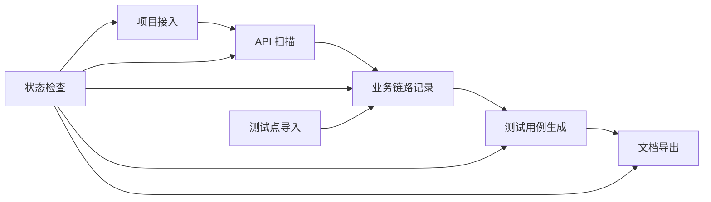

**图表来源**
- [README.md: 9-12:9-12](file://README.md#L9-L12)

**章节来源**
- [SKILL.md: 419-443:419-443](file://SKILL.md#L419-L443)
- [README.md: 9-12:9-12](file://README.md#L9-L12)

## 性能考虑

ARTA 系统在设计时充分考虑了性能优化，主要体现在以下几个方面：

### 内存使用优化
- **增量处理**：每个指令只处理当前阶段的数据，避免一次性加载所有数据
- **流式处理**：大文件处理采用流式读取，减少内存占用
- **缓存机制**：频繁访问的数据存储在内存缓存中

### I/O 性能优化
- **批量写入**：多个文件同时写入时采用批量操作
- **异步处理**：耗时操作采用异步执行，避免阻塞主线程
- **文件系统优化**：合理组织文件结构，减少文件系统调用次数

### 扫描性能优化
- **并行扫描**：多线程扫描不同类型的 API
- **智能过滤**：排除无关文件和目录，减少扫描范围
- **增量更新**：只重新扫描发生变化的文件

### 生成性能优化
- **模板复用**：测试代码模板预编译和缓存
- **并发生成**：多链路并行生成测试代码
- **增量编译**：只重新生成变更的测试文件

## 故障排除指南

### 常见问题及解决方案

#### 1. 指令执行失败

**问题现象**：指令执行时报错或无响应

**可能原因**：
- 项目配置文件损坏
- 权限不足无法写入文件
- 网络连接问题（OpenAPI URL）

**解决步骤**：
1. 检查 `arta-data/` 目录的读写权限
2. 验证项目配置文件的 JSON 格式
3. 检查网络连接（如果是 OpenAPI URL）
4. 重启 AI 助手后重试

#### 2. API 扫描结果不完整

**问题现象**：扫描结果显示的 API 数量与预期不符

**可能原因**：
- 项目框架识别失败
- 代码注释格式不符合规范
- 路由定义过于复杂

**解决步骤**：
1. 手动指定后端框架类型
2. 检查代码中的路由定义格式
3. 确认项目根目录正确
4. 使用自然语言描述补充 API 信息

#### 3. 业务链路保存失败

**问题现象**：链路编辑后无法保存

**可能原因**：
- 链路状态不正确
- 测试数据语法错误
- 断言规则无效

**解决步骤**：
1. 检查链路状态是否为 `draft`
2. 验证测试数据语法格式
3. 确认断言规则的有效性
4. 使用 `/ARTA-status` 检查链路状态

#### 4. 测试生成失败

**问题现象**：生成测试代码时报错

**可能原因**：
- 依赖框架未安装
- 生成模板文件缺失
- 环境变量配置错误

**解决步骤**：
1. 安装对应的测试框架
2. 检查生成模板文件是否存在
3. 验证环境变量配置
4. 检查测试输出目录权限

#### 5. 导出失败

**问题现象**：导出操作无法完成

**可能原因**：
- 目标目录权限不足
- 磁盘空间不足
- 文件被其他程序占用

**解决步骤**：
1. 检查目标目录的写入权限
2. 确认磁盘空间充足
3. 关闭占用文件的程序
4. 重新执行导出操作

### 错误处理机制

ARTA 系统采用多层次的错误处理机制：

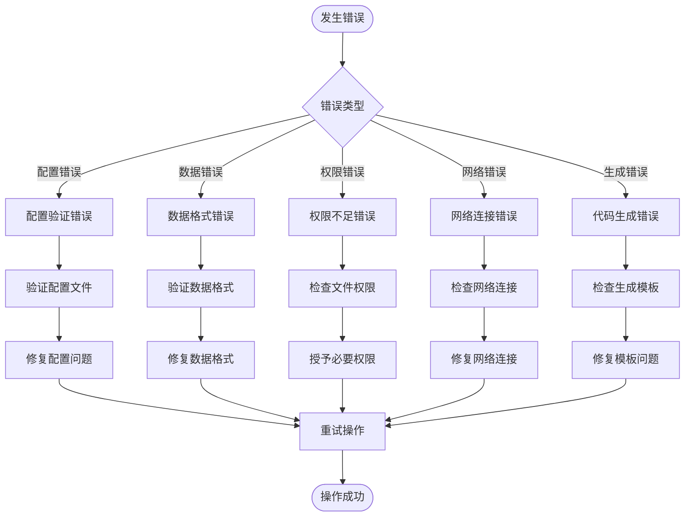

**图表来源**
- [SKILL.md: 434-443:434-443](file://SKILL.md#L434-L443)

### 最佳实践建议

#### 1. 项目初始化最佳实践
- 选择合适的后端框架类型
- 确保项目路径正确且可访问
- 提供准确的 API 来源信息

#### 2. API 扫描最佳实践
- 预先整理好项目代码结构
- 确保路由定义符合框架规范
- 提供必要的项目配置文件

#### 3. 业务链路记录最佳实践
- 从核心业务开始记录链路
- 合理设置链路优先级
- 为每个步骤配置适当的断言

#### 4. 测试生成最佳实践
- 确保所有链路都已完成
- 选择合适的测试框架
- 验证生成的测试代码

#### 5. 数据管理最佳实践
- 定期备份 `arta-data/` 目录
- 使用版本控制管理测试数据
- 建立数据清理机制

**章节来源**
- [SKILL.md: 434-443:434-443](file://SKILL.md#L434-L443)

## 结论

ARTA 指令系统为 API 自动化测试提供了一个完整、高效且易于使用的解决方案。通过七个核心指令，用户可以轻松完成从项目接入到测试用例生成的全流程自动化。

### 主要优势

1. **流程完整性**：覆盖测试生命周期的各个阶段
2. **易用性**：支持自然语言交互，降低学习成本
3. **灵活性**：支持多种技术栈和测试框架
4. **可扩展性**：模块化设计便于功能扩展
5. **可靠性**：完善的错误处理和状态检查机制

### 技术特点

- **分层架构**：清晰的职责分离和依赖管理
- **数据驱动**：以 JSON 文件为核心的数据存储
- **模板化生成**：标准化的代码生成流程
- **状态管理**：完整的项目状态跟踪机制

### 发展前景

ARTA 系统为团队提供了高效的 API 测试自动化解决方案，通过持续的功能完善和技术演进，有望成为 API 测试领域的标准工具。建议团队根据实际需求，在现有基础上进一步扩展功能，如增加测试报告分析、持续集成支持等功能。

## 附录

### 快速参考表

#### 指令语法速查
- `/ARTA-start` - 启动新项目
- `/ARTA-scan` - 扫描 API
- `/ARTA-flow` - 管理业务链路
- `/ARTA-testpoint` - 导入测试点
- `/ARTA-generate` - 生成测试代码
- `/ARTA-status` - 查看项目状态
- `/ARTA-export` - 导出项目文件

#### 数据文件说明
- `arta-data/project.json` - 项目配置信息
- `arta-data/apis.json` - API 清单
- `arta-data/flows.json` - 业务链路
- `arta-data/testpoints.json` - 测试点

#### 输出目录结构
- `tests/flows/` - 生成的测试代码
- `tests/helpers/` - 辅助工具文件
- `tests/fixtures/` - 测试数据文件
- `reports/` - 测试报告

### 常用组合示例

#### 完整测试流程
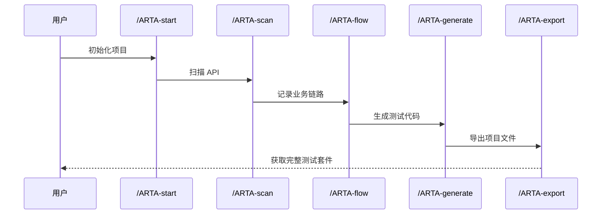

**图表来源**
- [README.md: 84-139:84-139](file://README.md#L84-L139)

#### 断点续作流程
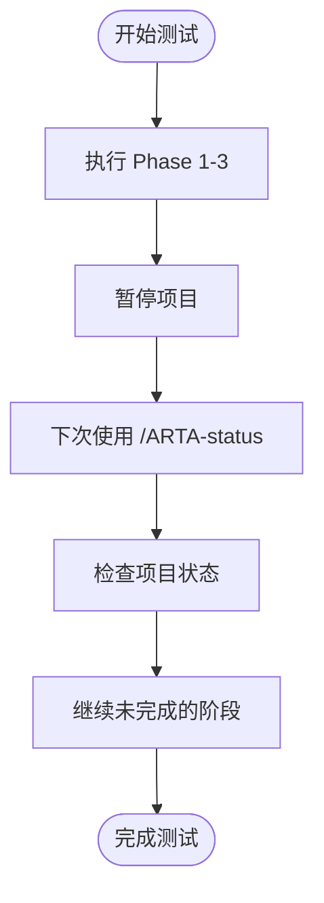

**图表来源**
- [README.md: 171-173:171-173](file://README.md#L171-L173)