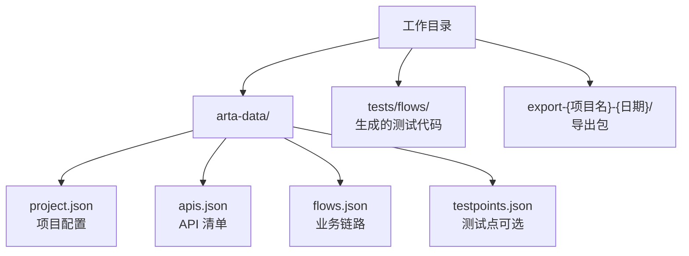
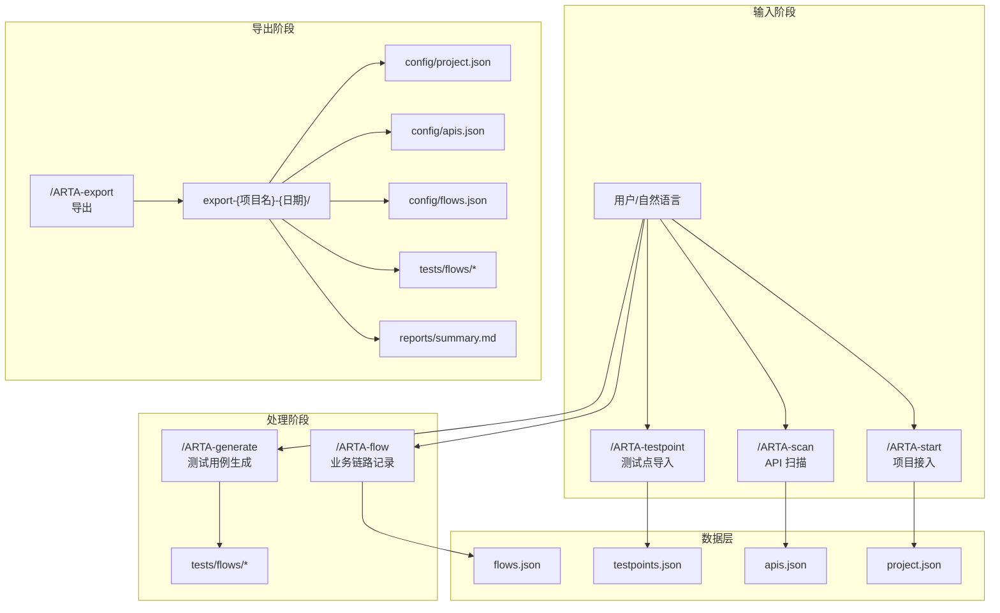
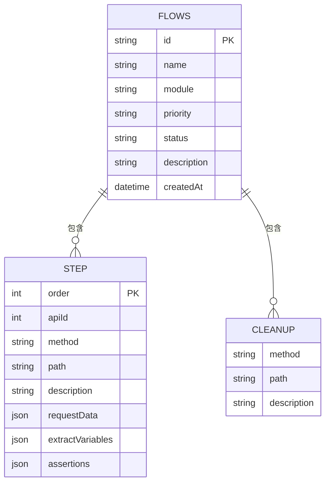
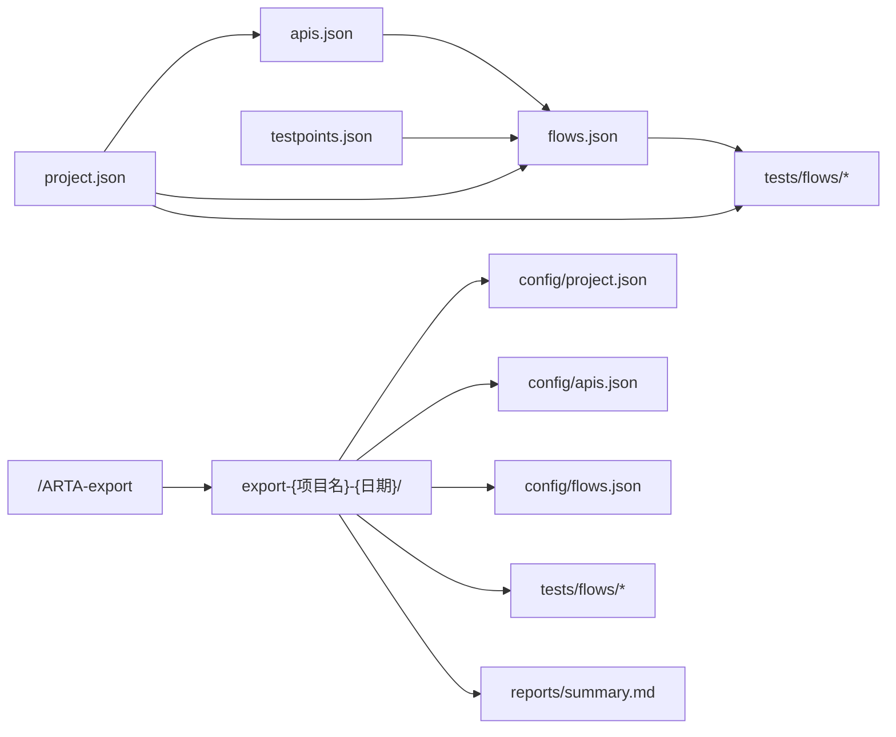

# 数据存储与管理

<cite>
**本文引用的文件**
- [README.md](file://README.md)
- [SKILL.md](file://SKILL.md)
- [flow-and-data-guide.md](file://flow-and-data-guide.md)
- [generation-reference.md](file://generation-reference.md)
</cite>

## 目录
1. [简介](#简介)
2. [项目结构](#项目结构)
3. [核心组件](#核心组件)
4. [架构总览](#架构总览)
5. [详细组件分析](#详细组件分析)
6. [依赖关系分析](#依赖关系分析)
7. [性能考量](#性能考量)
8. [故障排查指南](#故障排查指南)
9. [结论](#结论)
10. [附录](#附录)

## 简介
本文件系统性阐述 ARTA（自动化回归测试助手）的数据存储与管理方案，聚焦于核心数据文件的结构、存储策略、版本管理、迁移与备份恢复、数据验证与一致性保障、访问模式与缓存策略、性能优化、生命周期管理与清理策略、导入导出规范以及数据安全与隐私保护。文档基于仓库内提供的技能说明与指南文件进行归纳总结，并提供可视化图表帮助理解。

## 项目结构
ARTA 的数据持久化采用“工作目录 + 本地文件”的轻量级方案：
- 工作目录：当前工作目录
- 数据根目录：arta-data/
- 输出目录：tests/flows/（测试代码生成位置）
- 导出目录：/export-{项目名}-{日期}/（导出时的顶层目录）

数据文件分布与用途概览：
- arta-data/project.json：项目基础配置（名称、框架、API 来源、创建时间等）
- arta-data/apis.json：API 清单（方法、路径、描述、模块、schema 等）
- arta-data/flows.json：业务链路集合（步骤、测试数据、断言、清理等）
- arta-data/testpoints.json：测试点（可选，来自 Mermaid 思维导图导入）

**图表来源**
- [README.md:151-162](file://README.md#L151-L162)
- [SKILL.md:419-431](file://SKILL.md#L419-L431)

**章节来源**
- [README.md:151-162](file://README.md#L151-L162)
- [SKILL.md:419-431](file://SKILL.md#L419-L431)

## 核心组件
本节从数据模型角度拆解 ARTA 的核心数据文件，明确其结构、字段语义与约束。

- project.json（项目配置）
  - 关键字段：name、framework、testFramework、apiSource、createdAt
  - 作用：标识项目元信息、技术栈选择、API 来源类型与路径、创建时间
  - 生成时机：Phase 1（/ARTA-start）完成初始化后写入

- apis.json（API 清单）
  - 结构要点：包含 API 列表，每项至少包含 method、path、description、module 等
  - 生成时机：Phase 2（/ARTA-scan）完成扫描或解析后写入
  - 可能来源：本地代码分析、OpenAPI/Swagger 文件、OpenAPI URL、手动输入

- flows.json（业务链路）
  - 结构要点：flows 数组，每条链路包含 id、name、module、priority、status、description、steps、cleanup、createdAt 等
  - steps：有序 API 调用序列，每步包含 order、apiId、method、path、description、requestData、extractVariables、assertions
  - requestData：支持 body、headers、params 等；支持生成数据、上游引用、环境变量
  - assertions：支持 status、jsonpath、response_time、header 等类型
  - cleanup：写入类链路的清理步骤（如删除创建的资源）
  - 状态：draft/done/deprecated

- testpoints.json（测试点，可选）
  - 来源：Mermaid 思维导图导入
  - 作用：将测试点映射到 API，辅助生成测试用例
  - 生成时机：/ARTA-testpoint 处理后写入

**章节来源**
- [SKILL.md:65-75](file://SKILL.md#L65-L75)
- [SKILL.md:120-139](file://SKILL.md#L120-L139)
- [flow-and-data-guide.md:5-75](file://flow-and-data-guide.md#L5-L75)
- [flow-and-data-guide.md:133-145](file://flow-and-data-guide.md#L133-L145)
- [SKILL.md:261-294](file://SKILL.md#L261-L294)

## 架构总览
从数据流视角，ARTA 的数据架构围绕“配置-清单-链路-生成”展开：

**图表来源**
- [README.md:56-83](file://README.md#L56-L83)
- [SKILL.md:34-78](file://SKILL.md#L34-L78)
- [SKILL.md:81-139](file://SKILL.md#L81-L139)
- [SKILL.md:261-294](file://SKILL.md#L261-L294)
- [SKILL.md:297-377](file://SKILL.md#L297-L377)
- [SKILL.md:402-416](file://SKILL.md#L402-L416)

## 详细组件分析

### 项目配置文件（project.json）
- 结构要点
  - name：项目名称
  - framework：后端框架（Express/NestJS/Flask/Django/FastAPI/Spring Boot/Gin/Echo）
  - testFramework：测试框架（Jest/Vitest/Pytest/JUnit/Go testing）
  - apiSource：对象，包含 type（local/openapi/url/manual）与对应路径或 URL
  - createdAt：ISO 时间戳
- 写入策略
  - Phase 1 完成后写入 arta-data/project.json
  - 作为后续扫描与生成的基础配置
- 一致性与校验
  - 字段完整性：必需字段齐全
  - 架构一致性：framework 与 testFramework 应匹配支持矩阵
  - 时间戳一致性：createdAt 与实际写入时间一致

**章节来源**
- [SKILL.md:65-75](file://SKILL.md#L65-L75)
- [SKILL.md:34-63](file://SKILL.md#L34-L63)

### API 清单文件（apis.json）
- 结构要点
  - API 列表：每项包含 method、path、description、module 等
  - 可能包含 schema（来自 OpenAPI 解析）
- 生成策略
  - 本地代码分析：依据框架特征识别路由，排除常见目录，按路径前缀分组
  - OpenAPI 解析：支持 OpenAPI 3.0/3.1 与 Swagger 2.0（JSON/YAML），提取 paths、operationId/summary、tags、请求/响应 schema
- 一致性与校验
  - 方法合法性：HTTP 方法枚举
  - 路径唯一性：同一方法+路径组合唯一
  - 模块分组：按 tags 或路径前缀自动分组
  - schema 完整性：必要字段存在

**章节来源**
- [SKILL.md:81-139](file://SKILL.md#L81-L139)

### 业务链路文件（flows.json）
- 结构要点
  - flows 数组：每条链路包含基本信息、步骤序列、清理步骤、断言、状态与创建时间
  - 步骤（steps）：包含 order、apiId、method、path、description、requestData、extractVariables、assertions
  - requestData：支持 body、headers、params；支持生成数据、上游引用、环境变量
  - assertions：支持 status、jsonpath、response_time、header 等
  - cleanup：写入类链路的清理步骤
  - 状态：draft/done/deprecated
- 写入策略
  - Phase 3 完成后写入 arta-data/flows.json
  - 自动生成的测试代码基于此文件
- 一致性与校验
  - 步骤顺序：order 递增且连续
  - 上游引用：引用的步骤必须在当前步骤之前执行
  - 断言类型：符合支持的断言类型与参数
  - 清理步骤：写入类链路必须包含清理步骤建议或实际配置

**图表来源**
- [flow-and-data-guide.md:5-75](file://flow-and-data-guide.md#L5-L75)

**章节来源**
- [flow-and-data-guide.md:5-75](file://flow-and-data-guide.md#L5-L75)
- [flow-and-data-guide.md:77-145](file://flow-and-data-guide.md#L77-L145)
- [flow-and-data-guide.md:146-185](file://flow-and-data-guide.md#L146-L185)
- [SKILL.md:143-257](file://SKILL.md#L143-L257)

### 测试点文件（testpoints.json）
- 来源与处理
  - Mermaid 思维导图导入，解析叶子节点为测试点
  - 关键词匹配 API：如登录/注册/查询/创建/更新/删除等
  - 逐点处理：展示匹配 API 与关联链路，生成测试用例建议
- 写入策略
  - /ARTA-testpoint 处理完成后写入 arta-data/testpoints.json
- 一致性与校验
  - 测试点唯一性：去重处理
  - 匹配准确性：关键词与 API 路径模式匹配
  - 关联完整性：与现有 flows 的关联

**章节来源**
- [SKILL.md:261-294](file://SKILL.md#L261-L294)

### 数据访问模式与缓存策略
- 访问模式
  - 顺序读取：先读取 project.json，再读取 apis.json，最后读取 flows.json
  - 增量写入：各阶段完成后分别写入对应文件，不强制原子性
  - 生成阶段：读取 flows.json 生成测试代码，写入 tests/flows/
- 缓存策略
  - 本地文件系统即缓存：ARTA 以文件为缓存介质，无需额外缓存层
  - 导出阶段：/ARTA-export 将数据与生成物打包，便于离线复用

**章节来源**
- [SKILL.md:402-416](file://SKILL.md#L402-L416)
- [generation-reference.md:242-254](file://generation-reference.md#L242-L254)

### 数据验证规则与一致性保障
- 字段完整性
  - project.json：name、framework、testFramework、apiSource、createdAt
  - apis.json：method、path、description、module
  - flows.json：id、name、module、priority、status、steps、createdAt
- 逻辑一致性
  - 步骤顺序：order 严格递增
  - 上游引用：引用步骤必须在当前步骤之前
  - 断言类型：符合支持的断言类型与参数
  - CRUD 清理：写入类链路建议包含清理步骤
- 生成一致性
  - 生成前展示计划，用户确认后再写入文件
  - 生成后输出统计摘要，便于核对覆盖率

**章节来源**
- [flow-and-data-guide.md:133-145](file://flow-and-data-guide.md#L133-L145)
- [SKILL.md:434-443](file://SKILL.md#L434-L443)

### 数据生命周期管理与清理策略
- 生命周期阶段
  - draft：草稿，正在编辑
  - done：完成，可用于生成测试用例
  - deprecated：已弃用
- 清理策略
  - 写入类链路：建议在末尾添加清理步骤（如删除订单）
  - 生成阶段：测试代码中包含清理逻辑（如 afterAll/teardown）
- 导出与归档
  - /ARTA-export 将配置、清单、链路与测试代码打包，便于长期归档

**章节来源**
- [flow-and-data-guide.md:211-218](file://flow-and-data-guide.md#L211-L218)
- [SKILL.md:246-257](file://SKILL.md#L246-L257)
- [generation-reference.md:242-254](file://generation-reference.md#L242-L254)
- [SKILL.md:402-416](file://SKILL.md#L402-L416)

### 导入导出功能与格式规范
- 导入
  - Mermaid 思维导图：/ARTA-testpoint 导入，解析叶子节点为测试点
  - API 清单：/ARTA-scan 支持本地代码分析与 OpenAPI 解析
- 导出
  - /ARTA-export 输出目录结构：config/（project.json、apis.json、flows.json）、tests/flows/*、reports/summary.md
  - 导出包命名：export-{项目名}-{日期}

**章节来源**
- [SKILL.md:261-294](file://SKILL.md#L261-L294)
- [SKILL.md:81-139](file://SKILL.md#L81-L139)
- [SKILL.md:402-416](file://SKILL.md#L402-L416)
- [generation-reference.md:288-303](file://generation-reference.md#L288-L303)

### 数据结构演进与向后兼容
- 演进维度
  - 新增字段：如 createdAt、status、cleanup 等
  - 新增文件：testpoints.json（可选）
  - 新增断言类型：jsonpath、response_time、header 等
- 兼容策略
  - 读取时忽略未知字段
  - 生成阶段对旧版数据进行兼容处理（如默认状态、默认断言类型）
  - 导出时保留历史结构，便于回溯

**章节来源**
- [flow-and-data-guide.md:5-75](file://flow-and-data-guide.md#L5-L75)
- [flow-and-data-guide.md:133-145](file://flow-and-data-guide.md#L133-L145)
- [SKILL.md:419-431](file://SKILL.md#L419-L431)

### 数据安全、隐私保护与访问控制
- 本地存储
  - 数据位于本地工作目录，无网络传输
- 敏感信息
  - 生成数据函数（如 uuid、random_email）用于避免真实数据泄露
  - 环境变量引用（$ENV{...}）用于隔离敏感配置
- 访问控制
  - 本地文件系统权限控制
  - 导出包可按需分享，建议在受控环境中使用

**章节来源**
- [flow-and-data-guide.md:92-131](file://flow-and-data-guide.md#L92-L131)
- [flow-and-data-guide.md:123-131](file://flow-and-data-guide.md#L123-L131)

## 依赖关系分析

**图表来源**
- [SKILL.md:402-416](file://SKILL.md#L402-L416)
- [generation-reference.md:288-303](file://generation-reference.md#L288-L303)

**章节来源**
- [SKILL.md:402-416](file://SKILL.md#L402-L416)
- [generation-reference.md:288-303](file://generation-reference.md#L288-L303)

## 性能考量
- I/O 模式
  - 顺序读写：配置与清单一次性读取，链路与生成按需读取
  - 文件大小：以 JSON 文本为主，体积较小，I/O 开销低
- 生成性能
  - 生成阶段按链路逐一处理，避免大文件并发写入
  - 测试代码生成模板化，减少计算复杂度
- 缓存与复用
  - 本地文件系统即缓存，无需额外缓存层
  - 导出包便于离线复用，减少重复生成成本

[本节为通用性能讨论，无需特定文件引用]

## 故障排查指南
- 常见问题
  - 文件缺失：确认 arta-data/ 下各文件是否存在
  - 数据不一致：检查 flows.json 中步骤顺序与上游引用
  - 生成失败：核对 project.json 的 testFramework 与生成模板匹配
- 排查步骤
  - 使用 /ARTA-status 查看项目状态与进度
  - 检查 apis.json 的 API 清单是否完整
  - 检查 flows.json 的断言与清理步骤配置
- 恢复建议
  - 重新执行相应阶段（/ARTA-start、/ARTA-scan、/ARTA-flow）
  - 使用 /ARTA-export 导出当前状态，便于回滚或迁移

**章节来源**
- [SKILL.md:380-398](file://SKILL.md#L380-L398)
- [SKILL.md:402-416](file://SKILL.md#L402-L416)

## 结论
ARTA 的数据存储与管理采用“轻量本地文件”方案，通过 project.json、apis.json、flows.json、testpoints.json 四类文件实现从项目接入到测试生成的全链路数据闭环。该方案具备以下优势：
- 结构清晰：每类文件职责明确，便于维护与扩展
- 易于导出：统一的导出机制便于归档与迁移
- 可靠性强：基于文件系统的持久化与导出包，便于备份与恢复
- 可扩展性：支持新增字段与断言类型，兼顾向后兼容

[本节为总结性内容，无需特定文件引用]

## 附录

### 数据文件格式规范（摘要）
- project.json：项目基础配置
- apis.json：API 清单（方法、路径、描述、模块、schema）
- flows.json：业务链路（步骤、测试数据、断言、清理、状态）
- testpoints.json：测试点（可选）

**章节来源**
- [README.md:151-162](file://README.md#L151-L162)
- [SKILL.md:419-431](file://SKILL.md#L419-L431)