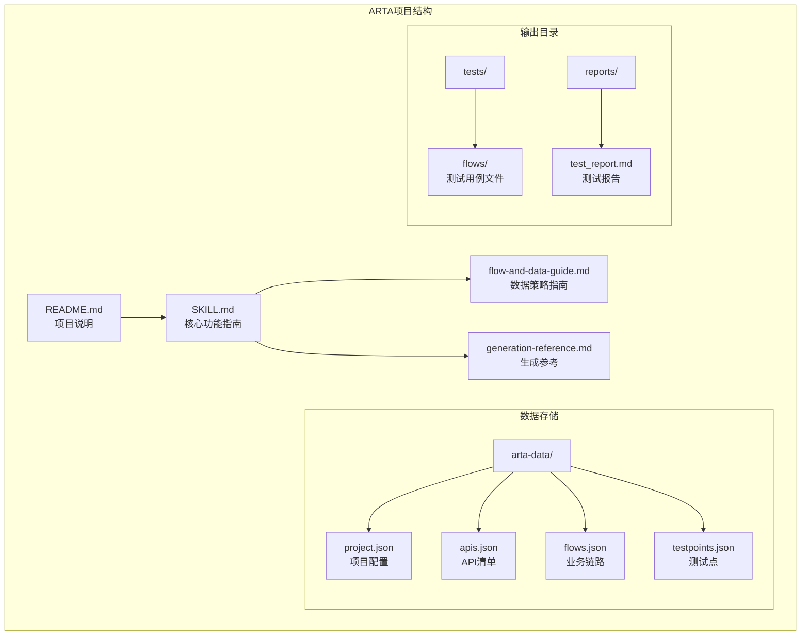
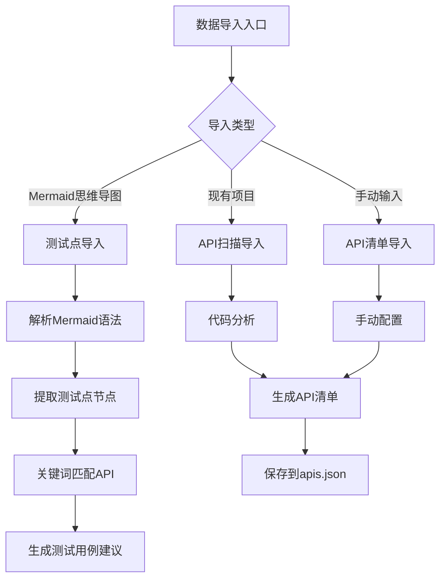
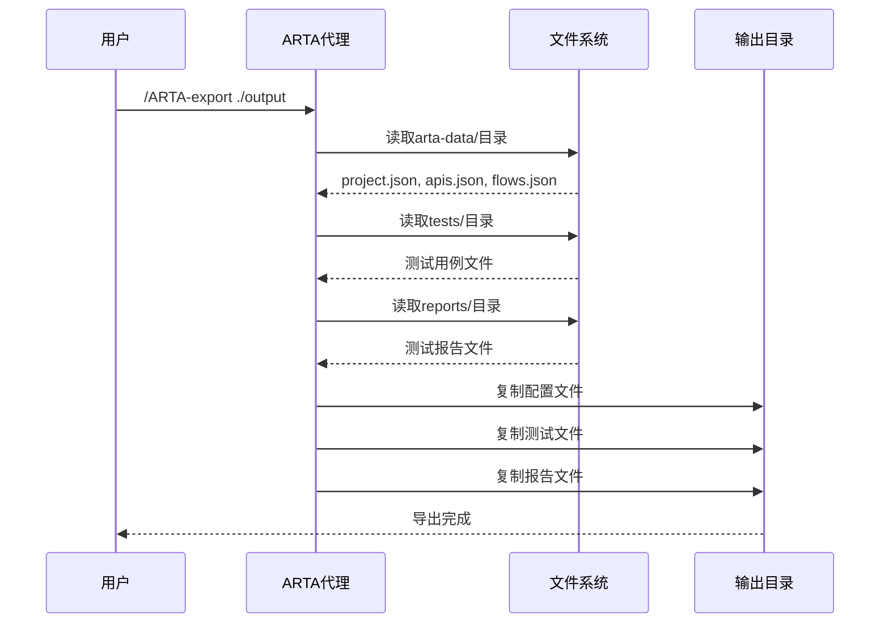
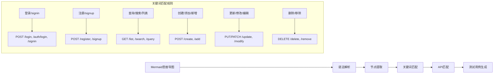
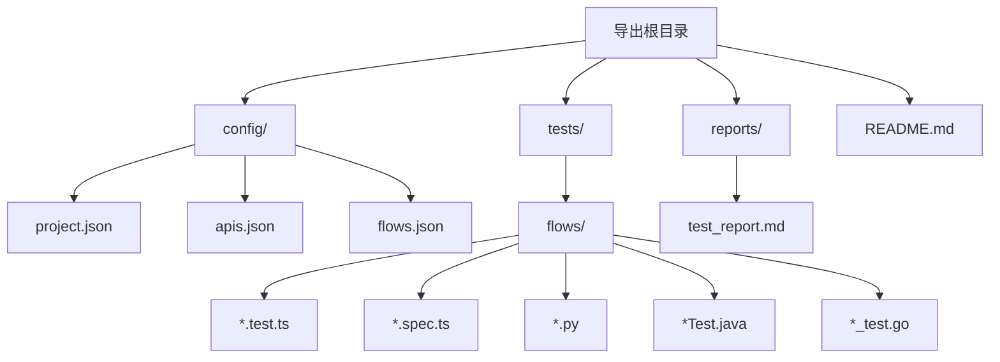
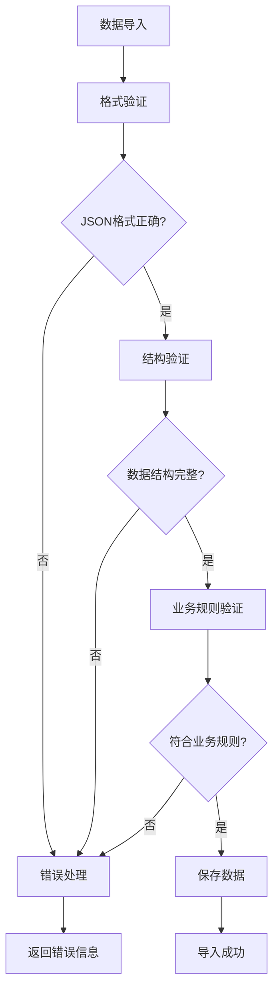
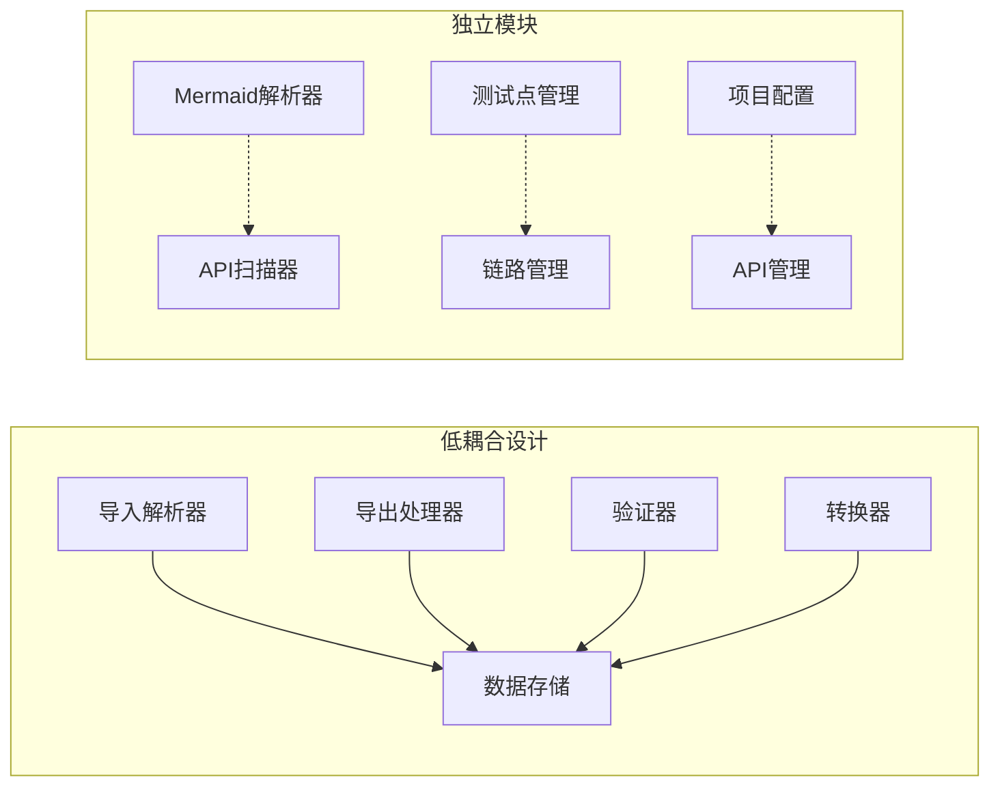
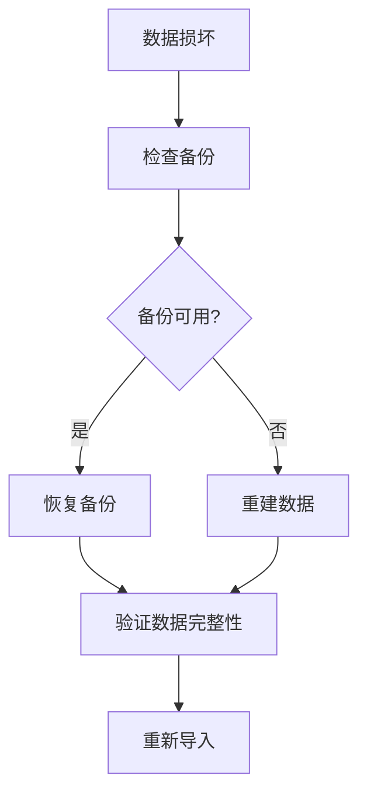

# 数据导入导出

<cite>
**本文档引用的文件**
- [README.md](file://README.md)
- [SKILL.md](file://SKILL.md)
- [flow-and-data-guide.md](file://flow-and-data-guide.md)
- [generation-reference.md](file://generation-reference.md)
</cite>

## 目录
1. [简介](#简介)
2. [项目结构](#项目结构)
3. [核心组件](#核心组件)
4. [架构概览](#架构概览)
5. [详细组件分析](#详细组件分析)
6. [依赖关系分析](#依赖关系分析)
7. [性能考虑](#性能考虑)
8. [故障排除指南](#故障排除指南)
9. [结论](#结论)

## 简介

ARTA（Automation Regression Test Assistant）是一个端到端API自动化测试流程引导工具。本文档专注于ARTA的数据导入导出功能，详细解释了数据存储结构、导入机制、导出流程以及相关的数据交换协议。

ARTA通过四个主要JSON文件来管理测试数据：
- `arta-data/project.json` - 项目配置信息
- `arta-data/apis.json` - API清单
- `arta-data/flows.json` - 业务链路
- `arta-data/testpoints.json` - 测试点（可选）

## 项目结构

ARTA项目采用文档驱动的架构设计，所有核心功能都通过自然语言指令和JSON数据文件实现。



**图表来源**
- [README.md: 151-162:151-162](file://README.md#L151-L162)
- [SKILL.md: 419-431:419-431](file://SKILL.md#L419-L431)

**章节来源**
- [README.md: 151-162:151-162](file://README.md#L151-L162)
- [SKILL.md: 419-431:419-431](file://SKILL.md#L419-L431)

## 核心组件

### 数据存储系统

ARTA采用轻量级的文件系统存储方案，所有数据都以JSON格式持久化存储：

| 文件 | 内容 | 结构复杂度 | 用途 |
|------|------|------------|------|
| `arta-data/project.json` | 项目基本信息、框架配置 | O(1) | 项目元数据管理 |
| `arta-data/apis.json` | API端点清单、路由信息 | O(n) | API发现与管理 |
| `arta-data/flows.json` | 业务链路、测试数据策略 | O(n*m) | 测试流程编排 |
| `arta-data/testpoints.json` | Mermaid思维导图测试点 | O(k) | 测试点导入 |

### 导入机制

ARTA支持多种数据导入方式：



**图表来源**
- [SKILL.md: 261-295:261-295](file://SKILL.md#L261-L295)
- [SKILL.md: 81-140:81-140](file://SKILL.md#L81-L140)

### 导出功能

ARTA的导出功能通过统一的`/ARTA-export`指令实现，支持完整的项目打包导出：



**图表来源**
- [SKILL.md: 402-417:402-417](file://SKILL.md#L402-L417)
- [README.md: 82](file://README.md#L82)

**章节来源**
- [SKILL.md: 261-295:261-295](file://SKILL.md#L261-L295)
- [SKILL.md: 402-417:402-417](file://SKILL.md#L402-L417)
- [README.md: 82](file://README.md#L82)

## 架构概览

ARTA的数据架构采用分层设计，确保数据的一致性和可维护性：

```mermaid
graph TB
subgraph "数据层"
A[JSON文件存储]
B[arta-data/目录]
C[tests/目录]
D[reports/目录]
end
subgraph "业务逻辑层"
E[项目管理]
F[API管理]
G[链路管理]
H[测试点管理]
end
subgraph "导入导出层"
I[Mermaid解析器]
J[API扫描器]
K[导出处理器]
end
subgraph "用户界面层"
L[自然语言指令]
M[/ARTA-*命令]
end
L --> M
M --> E
M --> F
M --> G
M --> H
E --> A
F --> A
G --> A
H --> A
I --> H
J --> F
K --> A
```

**图表来源**
- [SKILL.md: 419-431:419-431](file://SKILL.md#L419-L431)
- [README.md: 151-162:151-162](file://README.md#L151-L162)

## 详细组件分析

### 数据导入组件

#### Mermaid思维导图导入

ARTA支持从Mermaid格式的思维导图导入测试点，这一功能通过关键词匹配算法实现：



**图表来源**
- [SKILL.md: 261-295:261-295](file://SKILL.md#L261-L295)

#### API扫描导入

ARTA支持多种API发现方式，每种方式都有特定的解析策略：

| 导入方式 | 解析策略 | 支持格式 | 复杂度 |
|----------|----------|----------|--------|
| 本地代码分析 | 框架识别 + 正则匹配 | TypeScript/JavaScript/Python/Java/Go | O(n*m) |
| OpenAPI解析 | YAML/JSON解析 | OpenAPI 3.0/3.1, Swagger 2.0 | O(p) |
| 手动输入 | 结构化输入 | JSON数组 | O(m) |

**章节来源**
- [SKILL.md: 81-140:81-140](file://SKILL.md#L81-L140)

### 数据导出组件

#### 导出结构设计

ARTA的导出功能遵循标准化的目录结构，确保导出数据的完整性和可移植性：



**图表来源**
- [generation-reference.md: 288-303:288-303](file://generation-reference.md#L288-L303)

#### 导出数据映射

导出过程涉及多个数据文件的映射和转换：

| 输入文件 | 输出位置 | 映射规则 | 转换类型 |
|----------|----------|----------|----------|
| `arta-data/project.json` | `config/project.json` | 直接复制 | 无 |
| `arta-data/apis.json` | `config/apis.json` | 直接复制 | 无 |
| `arta-data/flows.json` | `config/flows.json` | 直接复制 | 无 |
| `tests/flows/*.test.ts` | `tests/flows/` | 文件复制 | 无 |
| `reports/test_report.md` | `reports/` | 文件复制 | 无 |

**章节来源**
- [SKILL.md: 402-417:402-417](file://SKILL.md#L402-L417)
- [generation-reference.md: 288-303:288-303](file://generation-reference.md#L288-L303)

### 数据验证与兼容性

#### 数据格式验证

ARTA在导入过程中实施多层次的数据验证：



#### 兼容性检查

ARTA确保不同版本间的兼容性：

| 兼容性维度 | 检查点 | 影响范围 |
|------------|--------|----------|
| API格式 | OpenAPI版本兼容 | API导入 |
| 数据结构 | JSON Schema验证 | 所有导入 |
| 测试框架 | 框架支持矩阵 | 测试生成 |
| 文件编码 | UTF-8编码 | 导入导出 |

**章节来源**
- [flow-and-data-guide.md: 77-145:77-145](file://flow-and-data-guide.md#L77-L145)

## 依赖关系分析

### 组件耦合度

ARTA的数据导入导出功能具有较低的组件耦合度，主要体现在：



### 外部依赖

ARTA主要依赖以下外部组件：

| 依赖类型 | 组件 | 版本要求 | 用途 |
|----------|------|----------|------|
| 解析库 | Mermaid解析器 | 最新版 | 思维导图解析 |
| 文件系统 | Node.js fs模块 | 最新版 | 文件操作 |
| JSON处理 | 内置JSON解析 | 最新版 | 数据序列化 |
| 命令行 | shell命令 | 最新版 | 导出执行 |

**章节来源**
- [SKILL.md: 31-443:31-443](file://SKILL.md#L31-L443)

## 性能考虑

### 导入性能优化

ARTA在数据导入方面采用了多项性能优化策略：

#### 批量处理策略

- **API扫描优化**：使用并行扫描技术，支持多线程分析
- **数据解析缓存**：缓存已解析的API信息，避免重复计算
- **增量导入**：支持增量API更新，只处理变更部分

#### 内存管理

- **流式处理**：大文件采用流式读取，避免内存溢出
- **分页加载**：大量数据采用分页加载策略
- **垃圾回收**：及时释放不再使用的对象引用

### 导出性能优化

#### 并行导出

- **多文件并发**：支持多个文件同时导出
- **压缩优化**：导出时自动压缩文件
- **增量导出**：只导出变更的文件

#### 存储优化

- **符号链接**：对相同文件使用符号链接
- **去重处理**：自动去除重复的测试文件
- **清理机制**：定期清理临时文件

## 故障排除指南

### 常见导入错误

#### Mermaid解析错误

**症状**：导入Mermaid思维导图时出现解析失败

**解决方案**：
1. 检查Mermaid语法格式
2. 验证节点层级结构
3. 确认关键词匹配规则

#### API扫描失败

**症状**：API扫描无法识别项目框架

**解决方案**：
1. 检查项目根目录的配置文件
2. 验证框架依赖是否正确安装
3. 确认源代码文件的编码格式

### 常见导出错误

#### 文件权限错误

**症状**：导出过程中提示权限不足

**解决方案**：
1. 检查目标目录的写入权限
2. 确认磁盘空间充足
3. 关闭占用目标文件的程序

#### 数据完整性错误

**症状**：导出文件损坏或不完整

**解决方案**：
1. 重新执行导出操作
2. 检查网络连接稳定性
3. 验证源数据的完整性

### 恢复策略

#### 数据恢复



#### 系统恢复

1. **配置恢复**：从`arta-data/project.json`恢复项目配置
2. **API恢复**：从`arta-data/apis.json`恢复API清单
3. **链路恢复**：从`arta-data/flows.json`恢复业务链路
4. **测试点恢复**：从`arta-data/testpoints.json`恢复测试点

**章节来源**
- [SKILL.md: 402-417:402-417](file://SKILL.md#L402-L417)

## 结论

ARTA的数据导入导出功能通过简洁而强大的JSON文件存储系统实现了完整的测试数据生命周期管理。该系统具有以下特点：

### 技术优势

1. **简单易用**：基于JSON格式，易于理解和维护
2. **扩展性强**：支持多种导入方式和导出格式
3. **性能优秀**：采用批处理和缓存策略优化性能
4. **可靠性高**：完善的错误处理和恢复机制

### 应用价值

- **开发效率**：简化测试数据管理流程
- **团队协作**：标准化的数据格式便于团队共享
- **持续集成**：支持自动化测试流程集成
- **知识传承**：完整的数据记录便于经验积累

### 发展方向

未来ARTA可以在以下方面进一步改进：
- 支持更多数据格式（CSV、XML等）
- 增强数据同步和备份功能
- 优化大数据量处理性能
- 提供更丰富的数据验证规则

通过本文档的详细分析，开发者可以更好地理解和使用ARTA的数据导入导出功能，构建高效可靠的API测试流程。