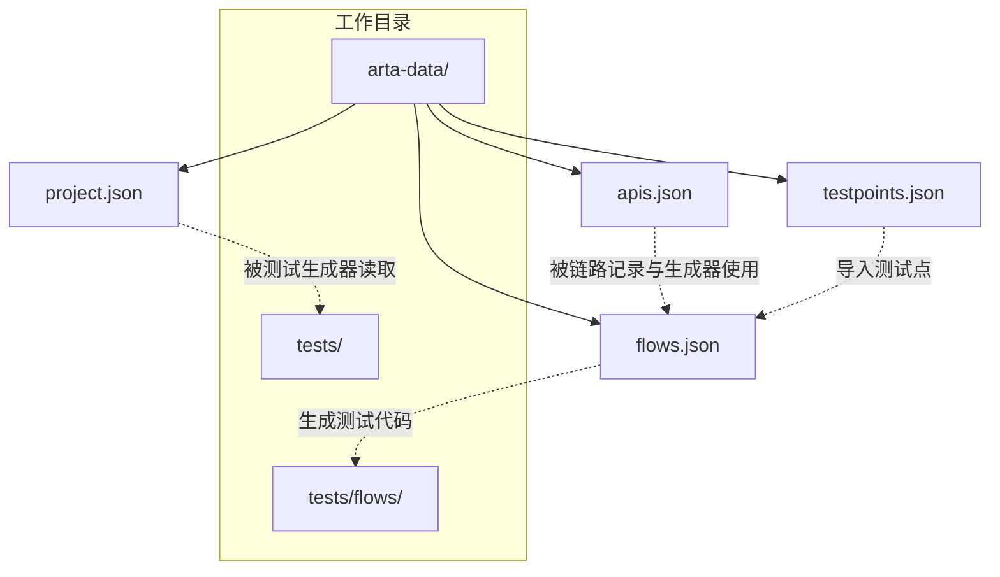
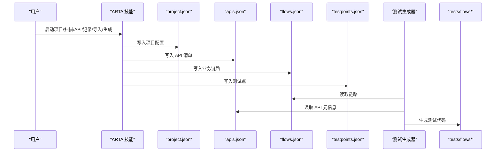
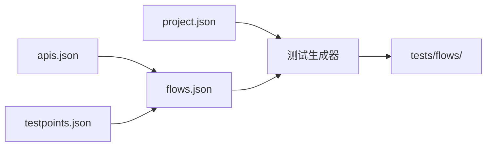

# 数据文件结构

<cite>
**本文引用的文件**
- [README.md](file://README.md)
- [SKILL.md](file://SKILL.md)
- [flow-and-data-guide.md](file://flow-and-data-guide.md)
- [generation-reference.md](file://generation-reference.md)
</cite>

## 目录
1. [简介](#简介)
2. [项目结构](#项目结构)
3. [核心组件](#核心组件)
4. [架构总览](#架构总览)
5. [详细组件分析](#详细组件分析)
6. [依赖关系分析](#依赖关系分析)
7. [性能考量](#性能考量)
8. [故障排查指南](#故障排查指南)
9. [结论](#结论)
10. [附录](#附录)

## 简介
本文件系统性梳理 ARTA（自动化回归测试助手）在工作目录中使用的数据文件结构与约定，重点覆盖 arta-data 目录下的核心 JSON 文件：project.json（项目配置）、apis.json（API 清单）、flows.json（业务链路）、testpoints.json（测试点）。文档从字段定义、数据类型、约束条件、验证规则、文件间依赖关系、版本兼容性与演进历史、最佳实践与常见错误模式等维度展开，并提供 JSON Schema 定义与示例数据路径，帮助读者快速理解与正确使用 ARTA 的数据层。

## 项目结构
ARTA 的数据文件均位于当前工作目录的 arta-data 子目录中，配合 tests/flows/ 输出目录共同构成完整的测试生命周期数据与产物。

图表来源
- [README.md:153-162](file://README.md#L153-L162)
- [SKILL.md:421-431](file://SKILL.md#L421-L431)

章节来源
- [README.md:151-162](file://README.md#L151-L162)
- [SKILL.md:419-431](file://SKILL.md#L419-L431)

## 核心组件
本节概述四个核心数据文件的职责与典型字段，便于快速定位与理解。

- project.json：项目基础配置，包含项目名称、后端框架、测试框架、API 来源类型与路径、创建时间等。
- apis.json：API 清单，包含 API 的方法、路径、描述、模块等元信息，供链路记录与测试生成使用。
- flows.json：业务链路集合，包含链路基本信息、步骤序列、测试数据策略、断言、清理步骤与创建时间等。
- testpoints.json：测试点集合（如通过 Mermaid 思维导图导入），用于生成或补充测试用例。

章节来源
- [README.md:157-160](file://README.md#L157-L160)
- [SKILL.md:67-75](file://SKILL.md#L67-L75)
- [SKILL.md:120-139](file://SKILL.md#L120-L139)
- [flow-and-data-guide.md:5-75](file://flow-and-data-guide.md#L5-L75)

## 架构总览
下图展示了数据文件在 ARTA 流程中的流转关系：项目接入生成 project.json；API 扫描生成 apis.json；业务链路记录生成 flows.json；测试点导入生成 testpoints.json；最终基于 flows.json 生成测试代码到 tests/flows/。

图表来源
- [README.md:153-162](file://README.md#L153-L162)
- [SKILL.md:67-75](file://SKILL.md#L67-L75)
- [SKILL.md:120-139](file://SKILL.md#L120-L139)
- [SKILL.md:224](file://SKILL.md#L224)
- [generation-reference.md:288-304](file://generation-reference.md#L288-L304)

## 详细组件分析

### project.json（项目配置）
- 作用：记录项目基本信息、后端框架、测试框架、API 来源类型与路径、创建时间等，供后续流程读取与生成器使用。
- 关键字段与约束
  - name：字符串，项目名称，必填
  - framework：字符串，后端框架（如 Express、NestJS、Flask、Django、FastAPI、Spring Boot、Gin、Echo），必填
  - testFramework：字符串，测试框架（如 jest、vitest、pytest、junit、go testing），必填
  - apiSource：对象，包含 type 与 path
    - type：字符串，来源类型（如 local、openapi-file、openapi-url、manual），必填
    - path：字符串，对应路径或 URL（当 type 为 local/openapi-file/openapi-url 时）
  - createdAt：字符串，ISO 时间戳，必填
- 数据类型与取值范围
  - name：非空字符串
  - framework：枚举值之一（见 README.md 支持的技术栈）
  - testFramework：枚举值之一（见 README.md 支持的技术栈）
  - apiSource.type：枚举值之一（local/openapi-file/openapi-url/manual）
  - apiSource.path：字符串（当 type 为 local/openapi-file/openapi-url 时）
  - createdAt：符合 ISO 8601 格式的时间戳
- 验证规则
  - 所有必填字段必须存在且不为空
  - apiSource.type 与 path 的组合需满足来源类型的一致性
- JSON Schema（示意）
  - 采用标准 JSON Schema 结构，包含 required、type、enum、format 等关键字
- 示例数据
  - 示例路径：[项目配置示例:67-75](file://SKILL.md#L67-L75)

章节来源
- [SKILL.md:67-75](file://SKILL.md#L67-L75)
- [README.md:24-29](file://README.md#L24-L29)

### apis.json（API 清单）
- 作用：记录扫描得到的 API 列表，包含方法、路径、描述、模块等元信息，供链路记录与测试生成使用。
- 关键字段与约束
  - API 列表：数组，元素包含
    - method：字符串，HTTP 方法（GET/POST/PUT/PATCH/DELETE 等），必填
    - path：字符串，API 路径，必填
    - description：字符串，API 描述，建议必填
    - module：字符串，模块分组，建议必填
- 数据类型与取值范围
  - method：HTTP 方法枚举
  - path：符合 URL 路径格式
  - description/module：字符串
- 验证规则
  - method 与 path 必须存在
  - 建议提供 description 与 module 以提升可维护性
- JSON Schema（示意）
  - 采用标准 JSON Schema 结构，包含 items、properties、required 等关键字
- 示例数据
  - 示例路径：[API 清单示例:122-139](file://SKILL.md#L122-L139)

章节来源
- [SKILL.md:120-139](file://SKILL.md#L120-L139)

### flows.json（业务链路）
- 作用：记录完整的业务链路，包含链路基本信息、步骤序列、测试数据策略、断言、清理步骤与创建时间等。
- 关键字段与约束
  - flows：数组，元素为链路对象
    - id：字符串，链路唯一标识，必填
    - name：字符串，链路名称，必填
    - module：字符串，所属模块，建议必填
    - priority：字符串，优先级（P0/P1/P2/P3），必填
    - status：字符串，状态（draft/done/deprecated），必填
    - description：字符串，简要描述，建议必填
    - steps：数组，步骤序列，元素包含
      - order：数字，步骤顺序，必填
      - apiId：数字，对应 apis.json 中 API 的索引或标识，必填
      - method/path/description：字符串，HTTP 方法、路径、描述，必填
      - requestData：对象，包含 headers/body 等
        - headers：对象，请求头
        - body：对象，请求体
      - extractVariables：对象，从响应中提取变量，键为变量名，值为 JSONPath 表达式
      - assertions：数组，断言规则，元素包含 type、expected、path、condition 等
    - cleanup：数组，清理步骤（通常为 DELETE），元素包含 method/path/description
    - createdAt：字符串，ISO 时间戳，必填
- 数据类型与取值范围
  - id/name/module/description：字符串
  - priority/status：枚举值（P0/P1/P2/P3，draft/done/deprecated）
  - steps.order/apiId/method/path/description：数字/字符串
  - requestData.headers/body：对象
  - extractVariables：键值对，值为 JSONPath 表达式
  - assertions：数组，元素包含 type、expected、path、condition 等字段
  - cleanup：数组，元素包含 method/path/description
  - createdAt：ISO 时间戳
- 验证规则
  - 所有必填字段必须存在
  - steps 中的 order 必须连续且递增
  - extractVariables 的 JSONPath 表达式需合法
  - assertions 的 condition/type 需符合断言类型定义
  - cleanup 的 method 通常为 DELETE
- JSON Schema（示意）
  - 采用标准 JSON Schema 结构，包含 items、properties、required、patternProperties 等关键字
- 示例数据
  - 示例路径：[链路数据结构示例:5-75](file://flow-and-data-guide.md#L5-L75)

章节来源
- [flow-and-data-guide.md:5-75](file://flow-and-data-guide.md#L5-L75)
- [flow-and-data-guide.md:133-144](file://flow-and-data-guide.md#L133-L144)

### testpoints.json（测试点）
- 作用：记录从 Mermaid 思维导图导入的测试点，用于生成或补充测试用例。
- 关键字段与约束
  - 测试点集合：数组，元素包含
    - id：字符串，测试点唯一标识，建议必填
    - name：字符串，测试点名称，建议必填
    - description：字符串，简要描述，建议必填
    - matchedApis：数组，匹配到的 API 列表（method/path）
    - linkedFlows：数组，关联的链路 id 列表
- 数据类型与取值范围
  - id/name/description：字符串
  - matchedApis：数组，元素为对象，包含 method/path
  - linkedFlows：数组，元素为字符串（链路 id）
- 验证规则
  - id 唯一性
  - matchedApis 与 linkedFlows 的合法性
- JSON Schema（示意）
  - 采用标准 JSON Schema 结构，包含 items、properties、required 等关键字
- 示例数据
  - 示例路径：[测试点导入流程说明:261-294](file://SKILL.md#L261-L294)

章节来源
- [SKILL.md:261-294](file://SKILL.md#L261-L294)

## 依赖关系分析
- project.json 依赖于用户在 Phase 1 中提供的配置信息，生成后被测试生成器读取以确定目标语言与测试框架。
- apis.json 依赖于 Phase 2 的扫描结果，供 Phase 3 的链路记录与 Phase 4 的测试生成使用。
- flows.json 依赖于 apis.json 的 API 元信息与用户在 Phase 3 中的链路配置，生成后驱动测试代码生成。
- testpoints.json 依赖于用户在 Phase 3 中导入的 Mermaid 思维导图，可与 flows.json 协同生成测试用例。
- 生成器在 Phase 4 会读取 flows.json 与 apis.json，输出到 tests/flows/ 目录。

图表来源
- [README.md:153-162](file://README.md#L153-L162)
- [SKILL.md:67-75](file://SKILL.md#L67-L75)
- [SKILL.md:120-139](file://SKILL.md#L120-L139)
- [SKILL.md:224](file://SKILL.md#L224)
- [generation-reference.md:288-304](file://generation-reference.md#L288-L304)

章节来源
- [README.md:153-162](file://README.md#L153-L162)
- [SKILL.md:67-75](file://SKILL.md#L67-L75)
- [SKILL.md:120-139](file://SKILL.md#L120-L139)
- [SKILL.md:224](file://SKILL.md#L224)
- [generation-reference.md:288-304](file://generation-reference.md#L288-L304)

## 性能考量
- 数据文件规模控制：flows.json 与 testpoints.json 的条目数量直接影响生成器的处理开销，建议按模块拆分链路与测试点，避免单文件过大。
- JSONPath 表达式复杂度：extractVariables 与 assertions 中的 JSONPath 表达式应保持简洁，避免深层嵌套导致断言解析耗时增加。
- 生成器批处理：批量生成测试代码时，建议分批处理并缓存中间结果，减少重复 IO 与计算。

## 故障排查指南
- 字段缺失或类型不符
  - 现象：生成器报错或跳过某些步骤
  - 处理：检查必填字段是否存在且类型正确（如 priority/status、method/path、headers/body 等）
- JSONPath 表达式错误
  - 现象：断言失败或变量提取为空
  - 处理：核对 extractVariables 与 assertions 中的 JSONPath 表达式，确保路径与响应结构一致
- API 与链路不匹配
  - 现象：生成器提示找不到对应 API
  - 处理：确认 apis.json 与 flows.json 的 apiId 对应关系，必要时重新扫描或修正
- 清理步骤遗漏
  - 现象：测试污染或资源泄漏
  - 处理：在 flows.json 的 cleanup 中添加 DELETE 步骤，确保测试后清理
- 导出路径不一致
  - 现象：导出目录结构与预期不符
  - 处理：核对 /ARTA-export 的输出映射，确保 arta-data 与 tests/flows/ 的相对路径正确

章节来源
- [flow-and-data-guide.md:133-144](file://flow-and-data-guide.md#L133-L144)
- [SKILL.md:246-255](file://SKILL.md#L246-L255)
- [generation-reference.md:288-304](file://generation-reference.md#L288-L304)

## 结论
ARTA 的数据文件结构围绕 project.json、apis.json、flows.json、testpoints.json 四大核心文件展开，形成“配置—清单—链路—测试”的闭环。通过明确字段定义、数据类型、约束条件与验证规则，结合 JSON Schema 设计与示例数据路径，能够显著提升数据质量与生成器稳定性。建议在实际使用中遵循最佳实践，定期校验数据一致性，并在演进过程中保持向后兼容性。

## 附录

### JSON Schema 定义（示意）
以下为各文件的 JSON Schema 结构示意，具体字段与约束以实际文档为准：

- project.json（示意）
  - 类型：object
  - 必填字段：name、framework、testFramework、apiSource、createdAt
  - apiSource：对象，包含 type（枚举）、path（字符串）

- apis.json（示意）
  - 类型：object
  - 必填字段：API 列表（数组）
  - API 元素：对象，包含 method、path、description、module

- flows.json（示意）
  - 类型：object
  - 必填字段：flows（数组）
  - flows 元素：对象，包含 id、name、module、priority、status、description、steps、cleanup、createdAt
  - steps：数组，元素包含 order、apiId、method、path、description、requestData、extractVariables、assertions
  - assertions：数组，元素包含 type、expected、path、condition 等

- testpoints.json（示意）
  - 类型：object
  - 必填字段：测试点集合（数组）
  - 测试点元素：对象，包含 id、name、description、matchedApis、linkedFlows

章节来源
- [SKILL.md:67-75](file://SKILL.md#L67-L75)
- [SKILL.md:120-139](file://SKILL.md#L120-L139)
- [flow-and-data-guide.md:5-75](file://flow-and-data-guide.md#L5-L75)
- [SKILL.md:261-294](file://SKILL.md#L261-L294)

### 示例数据路径
- 项目配置示例：[项目配置示例:67-75](file://SKILL.md#L67-L75)
- API 清单示例：[API 清单示例:122-139](file://SKILL.md#L122-L139)
- 链路数据结构示例：[链路数据结构示例:5-75](file://flow-and-data-guide.md#L5-L75)
- 测试点导入流程说明：[测试点导入流程说明:261-294](file://SKILL.md#L261-L294)

章节来源
- [SKILL.md:67-75](file://SKILL.md#L67-L75)
- [SKILL.md:120-139](file://SKILL.md#L120-L139)
- [flow-and-data-guide.md:5-75](file://flow-and-data-guide.md#L5-L75)
- [SKILL.md:261-294](file://SKILL.md#L261-L294)