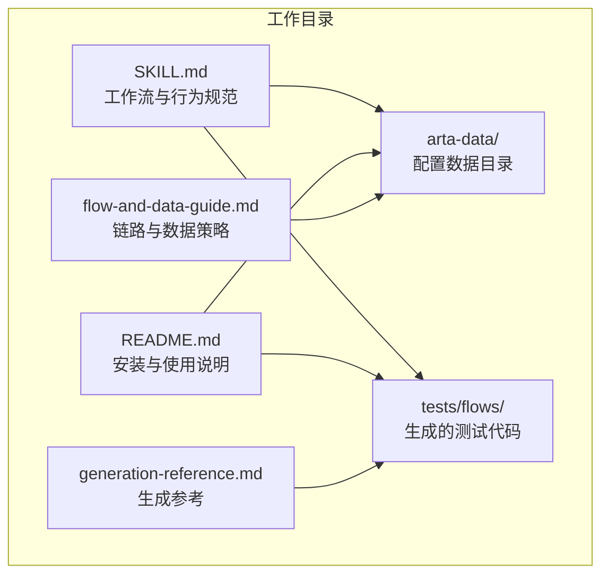
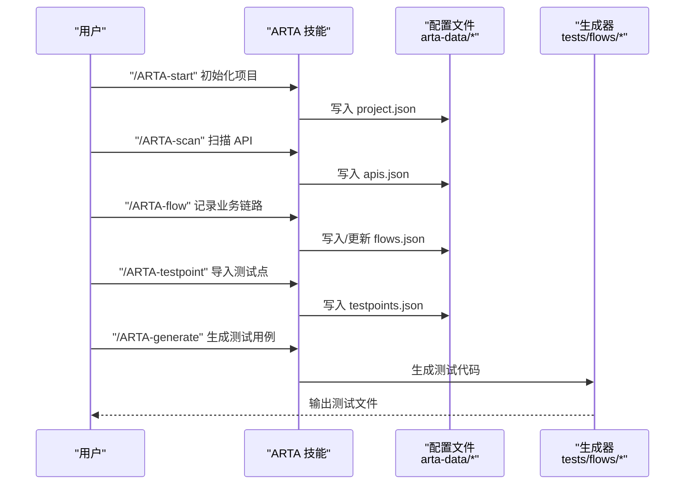
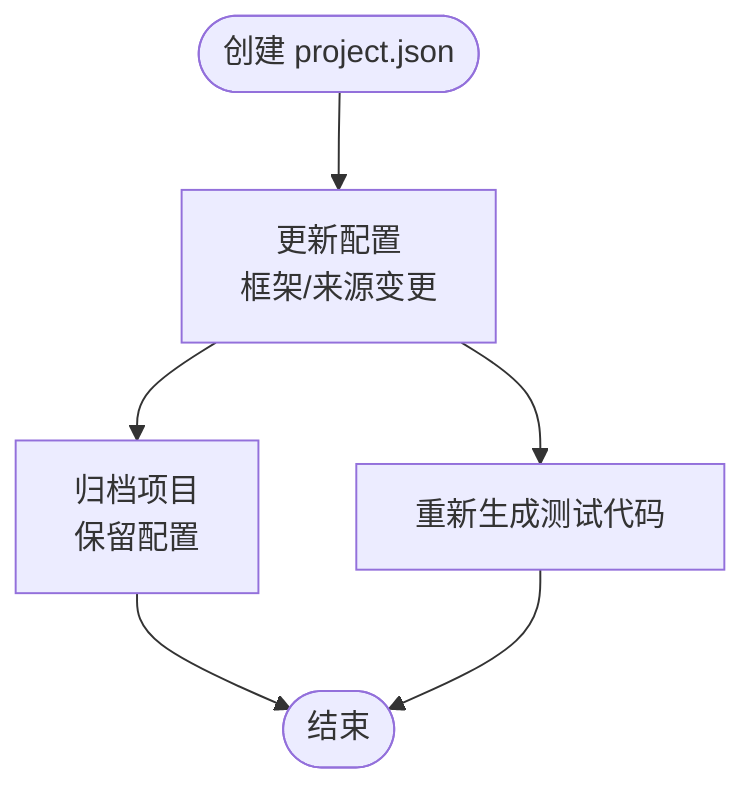
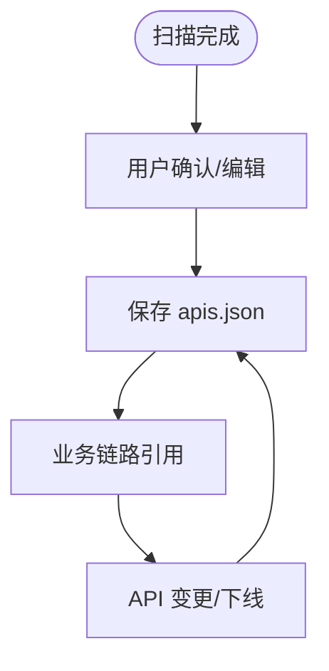
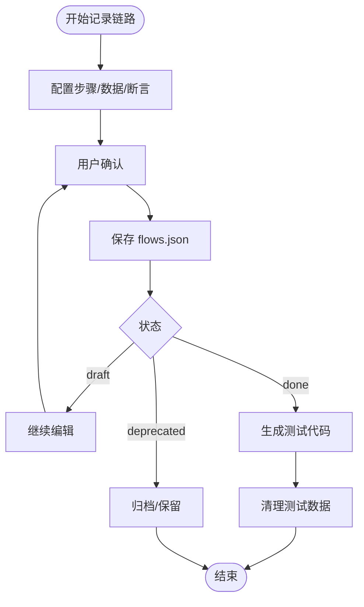
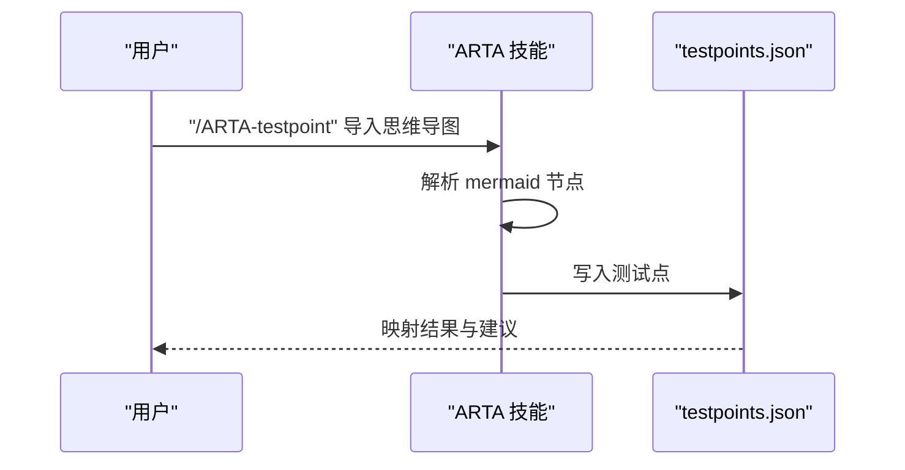
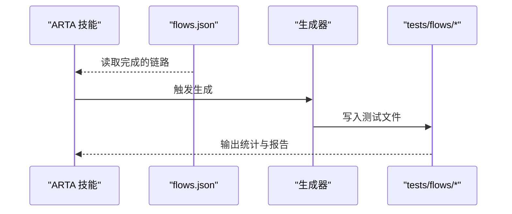
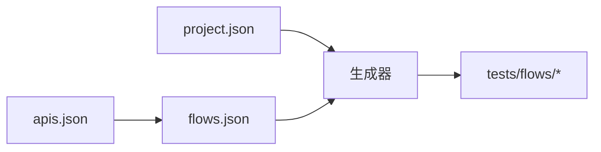

# 数据生命周期管理

<cite>
**本文引用的文件**
- [README.md](file://README.md)
- [SKILL.md](file://SKILL.md)
- [flow-and-data-guide.md](file://flow-and-data-guide.md)
- [generation-reference.md](file://generation-reference.md)
</cite>

## 目录
1. [简介](#简介)
2. [项目结构](#项目结构)
3. [核心组件](#核心组件)
4. [架构总览](#架构总览)
5. [详细组件分析](#详细组件分析)
6. [依赖关系分析](#依赖关系分析)
7. [性能考虑](#性能考虑)
8. [故障排查指南](#故障排查指南)
9. [结论](#结论)
10. [附录](#附录)

## 简介
本文件面向 ARTA（自动化回归测试助手）的数据生命周期管理，系统性阐述从数据创建、更新、归档、清理到最终删除的全链路策略与流程，并结合项目实际的配置文件与生成机制，给出版本管理、变更跟踪、回滚与历史记录的可行方案，以及存储优化、迁移升级、备份恢复、监控审计等最佳实践建议。由于 ARTA 本身为技能型工具，不直接持久化业务数据，而是通过配置文件与生成产物管理测试数据与流程，因此本文重点围绕“配置数据”与“生成数据”的生命周期进行设计与落地。

## 项目结构
ARTA 采用“技能文件 + 配置文件 + 生成产物”的结构组织：
- 技能文件：描述工作流与行为规范，指导用户完成项目接入、API 扫描、业务链路记录与测试用例生成。
- 配置文件：以 JSON 形式存储项目配置、API 清单、业务链路与测试点等，位于工作目录的 arta-data/ 下。
- 生成产物：按选定测试框架生成测试代码，默认输出到 tests/flows/ 目录。

图表来源
- [README.md:151-162](file://README.md#L151-L162)
- [SKILL.md:419-431](file://SKILL.md#L419-L431)

章节来源
- [README.md:151-162](file://README.md#L151-L162)
- [SKILL.md:419-431](file://SKILL.md#L419-L431)

## 核心组件
- 项目配置（project.json）
  - 作用：记录项目基础信息、后端与测试框架选择、API 来源、创建时间等。
  - 生命周期：创建于 Phase 1；随项目演进可能更新（如框架切换、来源变更），但不频繁。
- API 清单（apis.json）
  - 作用：记录扫描得到的 API 列表，含方法、路径、模块、描述等。
  - 生命周期：创建于 Phase 2；可被用户增删改；与业务链路强关联。
- 业务链路（flows.json）
  - 作用：记录完整的业务调用序列、测试数据策略、断言与清理步骤。
  - 生命周期：创建于 Phase 3；支持草稿、完成、弃用状态；与生成代码强绑定。
- 测试点（testpoints.json）
  - 作用：导入的思维导图测试点映射。
  - 生命周期：导入即创建；可与业务链路协同使用。
- 生成产物（tests/flows/*）
  - 作用：基于链路生成的测试代码，包含测试数据准备、步骤编排、断言与清理。
  - 生命周期：生成于 Phase 4；随链路更新而重新生成；可独立维护与版本化。

章节来源
- [README.md:151-162](file://README.md#L151-L162)
- [SKILL.md:65-75](file://SKILL.md#L65-L75)
- [SKILL.md:120-137](file://SKILL.md#L120-L137)
- [SKILL.md:224-224](file://SKILL.md#L224-L224)
- [SKILL.md:267-293](file://SKILL.md#L267-L293)
- [generation-reference.md:244-254](file://generation-reference.md#L244-L254)

## 架构总览
ARTA 的数据生命周期围绕“配置驱动 + 生成驱动”的双轨机制展开：
- 配置驱动：用户通过指令与自然语言输入，逐步完善 project.json、apis.json、flows.json、testpoints.json。
- 生成驱动：在链路完成后，依据配置生成测试代码，形成可执行的测试集。

图表来源
- [SKILL.md:34-78](file://SKILL.md#L34-L78)
- [SKILL.md:81-140](file://SKILL.md#L81-L140)
- [SKILL.md:143-257](file://SKILL.md#L143-L257)
- [SKILL.md:261-294](file://SKILL.md#L261-L294)
- [SKILL.md:297-377](file://SKILL.md#L297-L377)

## 详细组件分析

### 项目配置（project.json）生命周期
- 创建：Phase 1 初始化时生成，包含项目名称、后端框架、测试框架、API 来源与创建时间。
- 更新：当用户更改后端或测试框架、API 来源时，可更新该文件。
- 归档：项目归档或迁移时，保留该文件以便后续复现。
- 清理：项目废弃时删除该文件及关联的生成产物。

图表来源
- [SKILL.md:65-75](file://SKILL.md#L65-L75)
- [SKILL.md:380-398](file://SKILL.md#L380-L398)

章节来源
- [SKILL.md:65-75](file://SKILL.md#L65-L75)
- [SKILL.md:380-398](file://SKILL.md#L380-L398)

### API 清单（apis.json）生命周期
- 创建：Phase 2 扫描完成后生成，包含 API 列表、模块、描述等。
- 更新：用户可通过自然语言增删改 API 清单，确认后保存。
- 归档：与项目一起归档，便于后续复用。
- 清理：API 下线或重构时，更新状态或删除对应条目。

图表来源
- [SKILL.md:120-137](file://SKILL.md#L120-L137)
- [SKILL.md:139-139](file://SKILL.md#L139-L139)

章节来源
- [SKILL.md:120-137](file://SKILL.md#L120-L137)
- [SKILL.md:139-139](file://SKILL.md#L139-L139)

### 业务链路（flows.json）生命周期
- 创建：Phase 3 通过五步法记录，包含步骤、测试数据、断言与清理。
- 更新：支持草稿、完成、弃用状态；编辑时同步更新引用关系。
- 归档：完成的链路可归档，保留历史版本。
- 清理：链路末尾自动建议清理步骤，生成代码中包含 afterAll/tearDown 清理逻辑。

图表来源
- [SKILL.md:147-224](file://SKILL.md#L147-L224)
- [flow-and-data-guide.md:7-75](file://flow-and-data-guide.md#L7-L75)
- [flow-and-data-guide.md:146-185](file://flow-and-data-guide.md#L146-L185)

章节来源
- [SKILL.md:147-224](file://SKILL.md#L147-L224)
- [flow-and-data-guide.md:7-75](file://flow-and-data-guide.md#L7-L75)
- [flow-and-data-guide.md:146-185](file://flow-and-data-guide.md#L146-L185)

### 测试点（testpoints.json）生命周期
- 创建：导入 mermaid 思维导图后生成。
- 更新：与业务链路协同，可映射到具体链路。
- 清理：随项目清理或归档。

图表来源
- [SKILL.md:261-294](file://SKILL.md#L261-L294)

章节来源
- [SKILL.md:261-294](file://SKILL.md#L261-L294)

### 生成产物（tests/flows/*）生命周期
- 生成：Phase 4 基于完成的链路生成测试代码，包含准备、步骤、断言与清理。
- 更新：链路更新后重新生成，保持一致性。
- 清理：测试执行完毕后，生成代码中的清理逻辑负责回收测试数据。

图表来源
- [SKILL.md:297-377](file://SKILL.md#L297-L377)
- [generation-reference.md:244-254](file://generation-reference.md#L244-L254)

章节来源
- [SKILL.md:297-377](file://SKILL.md#L297-L377)
- [generation-reference.md:244-254](file://generation-reference.md#L244-L254)

## 依赖关系分析
- 配置文件之间的依赖
  - flows.json 依赖 apis.json 的 API 定义与模块信息。
  - project.json 为生成器提供测试框架与语言信息，间接影响生成模板。
- 生成器与配置的耦合
  - 生成器读取 flows.json 的步骤、断言与清理，生成对应测试代码。
- 外部依赖
  - 生成器依赖所选测试框架（Jest/Vitest/Mocha/Pytest/JUnit/Go testing）的模板与约定。

图表来源
- [SKILL.md:120-137](file://SKILL.md#L120-L137)
- [SKILL.md:297-377](file://SKILL.md#L297-L377)
- [generation-reference.md:244-254](file://generation-reference.md#L244-L254)

章节来源
- [SKILL.md:120-137](file://SKILL.md#L120-L137)
- [SKILL.md:297-377](file://SKILL.md#L297-L377)
- [generation-reference.md:244-254](file://generation-reference.md#L244-L254)

## 性能考虑
- 存储层面
  - 配置文件体积小，读写开销低；建议启用压缩（如 Gzip）以减少磁盘占用。
  - 生成产物按需生成，避免冗余文件堆积。
- 生成效率
  - 生成器按链路逐一生成，避免一次性处理大量文件导致内存峰值。
  - 断点续作机制允许用户在任意阶段暂停，减少重复计算。
- 运行效率
  - 生成代码中的清理逻辑在 afterAll/tearDown 执行，避免测试间相互污染。
  - 通过环境变量注入（如 BASE_URL）减少硬编码，提升可移植性。

[本节为通用性能建议，不直接分析具体文件]

## 故障排查指南
- 配置文件损坏
  - 现象：无法读取 project.json、apis.json 或 flows.json。
  - 处理：检查 JSON 格式；必要时回退到最近一次提交或备份。
- 生成失败
  - 现象：生成器报错或生成文件缺失。
  - 处理：确认 flows.json 的步骤顺序与断言配置；检查 project.json 的测试框架选择。
- 清理不生效
  - 现象：测试数据未清理。
  - 处理：检查生成代码中的清理逻辑是否正确；确认环境变量与权限。
- 导出异常
  - 现象：/ARTA-export 输出目录结构不符。
  - 处理：确认导出目标目录权限；检查配置文件是否存在。

章节来源
- [SKILL.md:402-416](file://SKILL.md#L402-L416)
- [generation-reference.md:256-286](file://generation-reference.md#L256-L286)

## 结论
ARTA 的数据生命周期以配置文件为核心，通过“配置驱动 + 生成驱动”的双轨机制实现从项目接入到测试生成的闭环。针对配置数据与生成产物，建议建立版本化管理、变更跟踪与回滚机制，配合定期备份与归档策略，确保数据可追溯、可恢复、可迁移。同时，通过断点续作与清理机制保障测试环境的整洁与稳定。

[本节为总结性内容，不直接分析具体文件]

## 附录

### 数据版本管理与变更跟踪
- 版本控制
  - 使用 Git 对 arta-data/ 与 tests/flows/ 进行版本化管理，分支策略区分开发/测试/发布。
- 变更跟踪
  - 为每次重要变更（如 API 清单调整、链路更新）添加提交信息与注释，明确影响范围。
- 回滚机制
  - 通过 Git 标签标记里程碑版本；回滚时恢复至最近一次稳定提交。
- 历史记录
  - 生成报告（summary.md）记录生成统计与建议，作为历史审计依据。

章节来源
- [generation-reference.md:256-286](file://generation-reference.md#L256-L286)

### 数据存储优化策略
- 压缩
  - 对配置文件启用 Gzip 压缩，降低磁盘占用。
- 索引
  - 在 CI/CD 中对生成产物建立索引文件，便于快速定位与审计。
- 缓存
  - 生成器缓存已解析的 API 清单，减少重复扫描开销。
- 性能调优
  - 生成器按链路顺序生成，避免并发写入冲突；清理逻辑集中执行，减少 IO 峰值。

[本节为通用优化建议，不直接分析具体文件]

### 数据迁移与升级机制
- 向后兼容
  - 新版本生成器兼容旧版配置格式；对新增字段提供默认值。
- 数据转换
  - 通过迁移脚本将旧版 flows.json 的字段映射到新版结构；失败时保留原文件并提示修复。
- 兼容性测试
  - 在 CI 中加入对旧配置的回归测试，确保升级不影响既有链路。

[本节为通用迁移建议，不直接分析具体文件]

### 数据备份与恢复策略
- 备份
  - 定期备份 arta-data/ 与 tests/flows/ 至远程仓库或对象存储。
- 恢复
  - 通过 Git 恢复配置文件；通过导出/导入功能恢复完整项目。
- 灾难恢复
  - 建立异地备份与快照策略；制定恢复流程与责任人。

[本节为通用备份建议，不直接分析具体文件]

### 数据清理与归档最佳实践
- 存储空间优化
  - 定期清理不再使用的生成文件；对历史链路进行归档压缩。
- 长期数据管理
  - 将完成的链路与报告归档至独立目录；保留必要的元数据（创建时间、状态）。
- 清理策略
  - 生成代码中的 afterAll/tearDown 负责清理测试数据；链路末尾建议添加显式清理步骤。

章节来源
- [flow-and-data-guide.md:64-70](file://flow-and-data-guide.md#L64-L70)
- [generation-reference.md:19-26](file://generation-reference.md#L19-L26)
- [generation-reference.md:84-90](file://generation-reference.md#L84-L90)

### 数据生命周期监控与审计
- 监控
  - 通过 CI 日志与生成报告监控生成成功率与覆盖率。
- 审计
  - 生成 summary.md 与导出报告，记录生成时间、文件清单与建议。
- 审核
  - 对关键链路的变更进行审核与审批，确保质量与合规。

章节来源
- [generation-reference.md:256-286](file://generation-reference.md#L256-L286)
- [SKILL.md:402-416](file://SKILL.md#L402-L416)