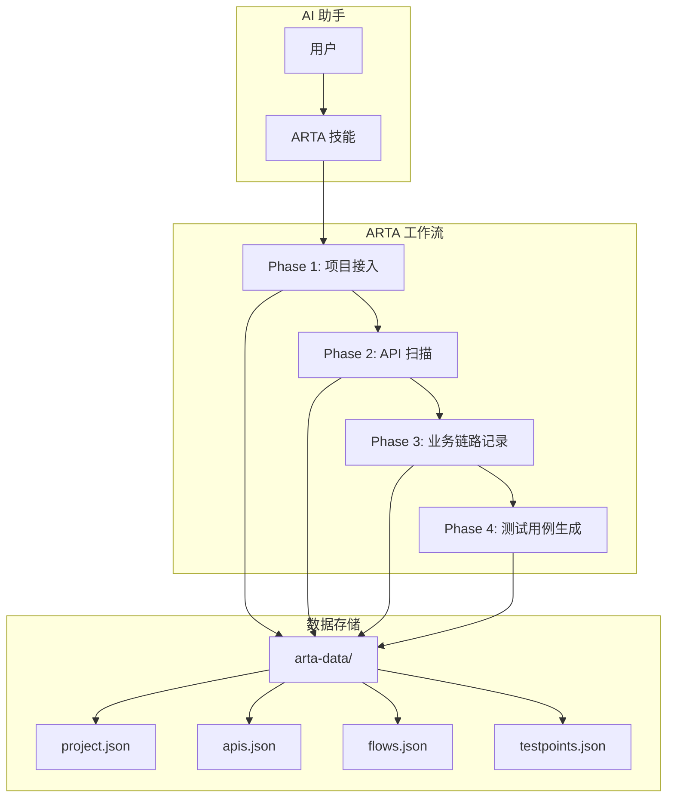
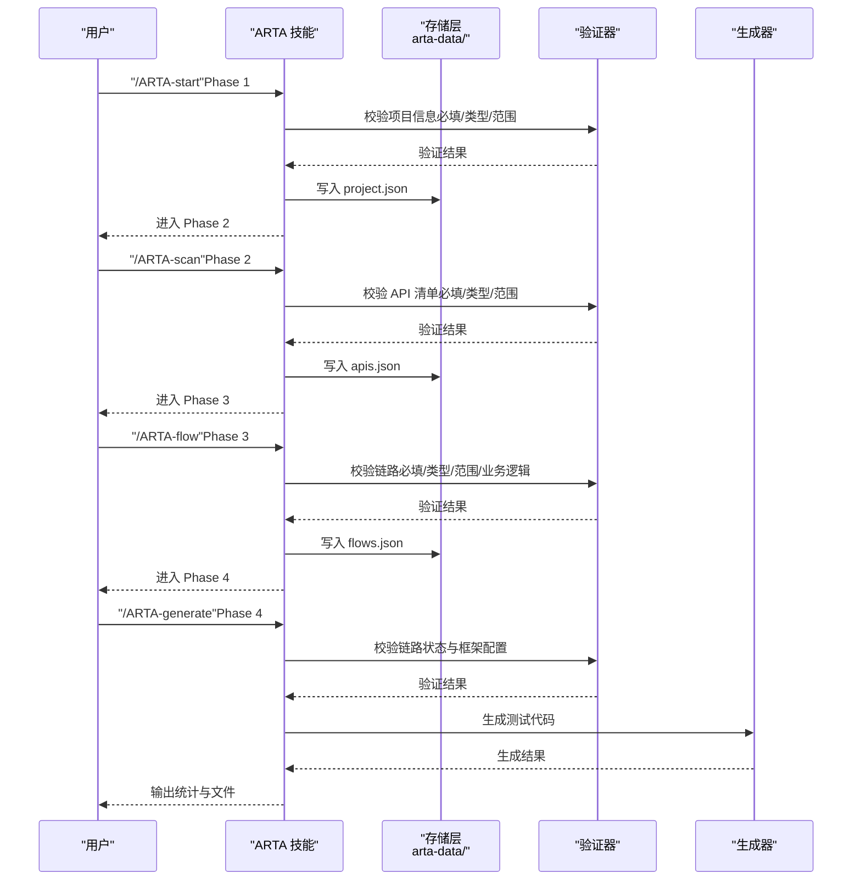
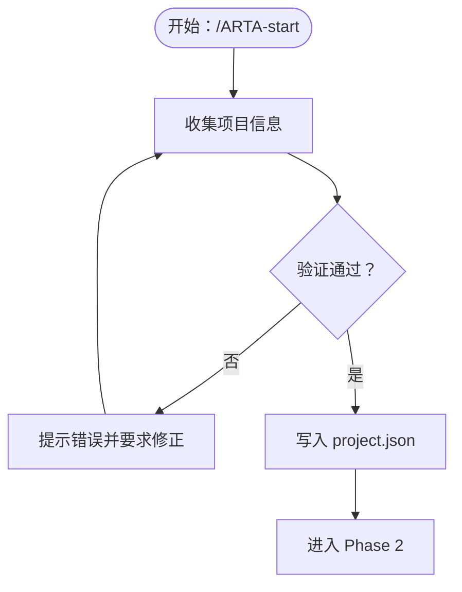
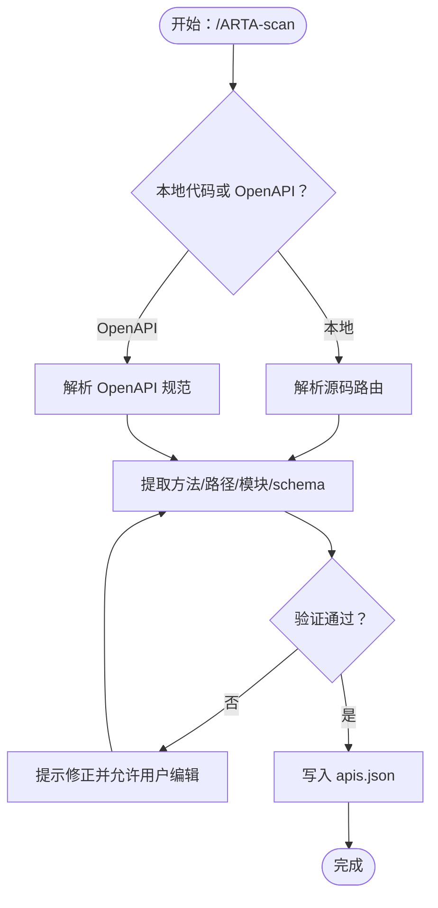
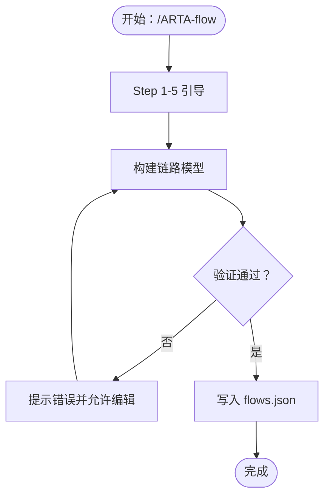
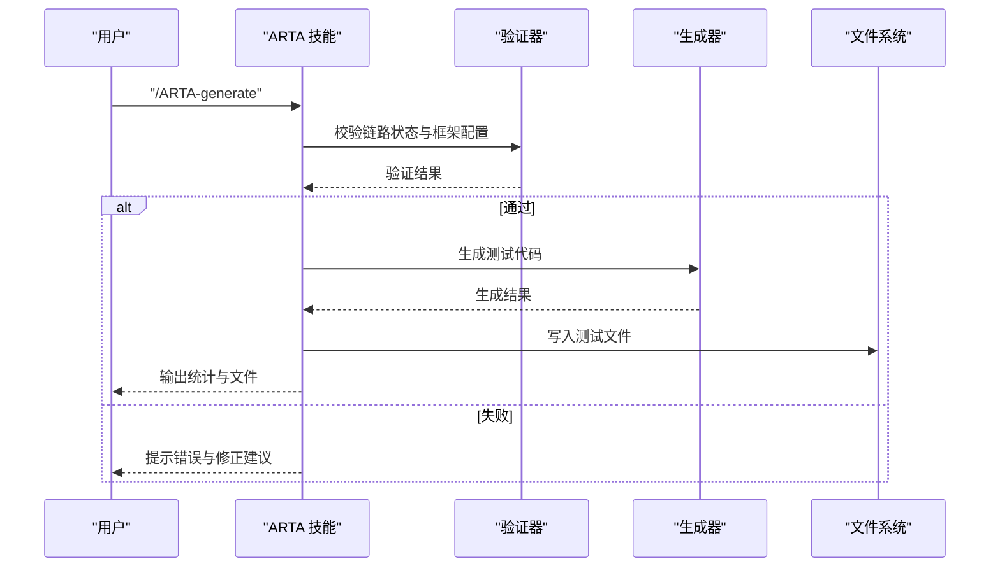
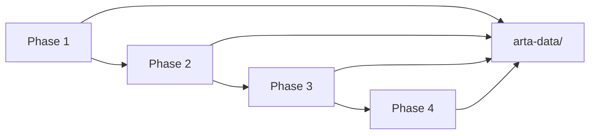

# 数据验证与完整性

<cite>
**本文档引用的文件**
- [README.md](file://README.md)
- [SKILL.md](file://SKILL.md)
- [flow-and-data-guide.md](file://flow-and-data-guide.md)
- [generation-reference.md](file://generation-reference.md)
</cite>

## 目录
1. [简介](#简介)
2. [项目结构](#项目结构)
3. [核心组件](#核心组件)
4. [架构总览](#架构总览)
5. [详细组件分析](#详细组件分析)
6. [依赖关系分析](#依赖关系分析)
7. [性能考虑](#性能考虑)
8. [故障排查指南](#故障排查指南)
9. [结论](#结论)
10. [附录](#附录)

## 简介
本文件聚焦 ARTA（自动化回归测试助手）的数据验证与完整性检查机制，系统阐述数据验证规则的设计原理与实现方式，涵盖必填字段检查、数据类型验证、取值范围限制、业务逻辑验证；同时说明数据完整性保证机制，包括引用完整性、事务一致性、并发控制与冲突解决策略，并解释数据校验的执行时机与错误处理机制，以及数据修复与自动纠正功能、数据质量监控与异常检测机制、验证失败的诊断方法与解决方案，以及数据完整性测试与验证工具的使用方法。

## 项目结构
ARTA 是一个端到端 API 自动化测试流程引导工具，采用“技能”（Skill）形式集成到 AI 助手中，通过自然语言或指令驱动四阶段测试工作流：
- Phase 1：项目接入（收集项目基础信息）
- Phase 2：API 扫描（自动分析或解析 OpenAPI）
- Phase 3：业务链路记录（定义 API 调用序列、测试数据与断言）
- Phase 4：测试用例生成（基于链路生成多框架测试代码）

数据持久化采用 JSON 文件存储于工作目录的 `arta-data/` 下，包括项目配置、API 清单、业务链路与测试点等。

图表来源
- [README.md: 14-176:14-176](file://README.md#L14-L176)
- [SKILL.md: 34-443:34-443](file://SKILL.md#L34-L443)

章节来源
- [README.md: 14-176:14-176](file://README.md#L14-L176)
- [SKILL.md: 34-443:34-443](file://SKILL.md#L34-L443)

## 核心组件
本节从数据验证与完整性角度，梳理 ARTA 的关键组件及其职责边界：

- 项目接入（Phase 1）
  - 收集项目名称、API 信息来源、后端框架、测试框架等必要信息
  - 保存至 `arta-data/project.json`，作为后续扫描与生成的元数据来源
  - 必填字段检查：项目名称、API 信息来源、后端/测试框架类型
  - 数据类型验证：枚举值校验（本地代码/文件/URL/手动输入），框架类型白名单
  - 取值范围限制：框架类型集合限定
  - 业务逻辑验证：若用户提供 API 来源，自动推进到 Phase 2

- API 扫描（Phase 2）
  - 本地代码分析：基于包管理器文件识别框架，扫描源码目录，排除构建产物与版本控制目录，使用正则匹配路由定义，提取 HTTP 方法、路径、处理函数名，并按路径前缀自动分组为模块
  - OpenAPI 解析：支持 OpenAPI 3.0/3.1 与 Swagger 2.0（JSON/YAML），提取 paths 下端点、operationId/summary、tags、请求/响应 schema
  - 结果保存至 `arta-data/apis.json`，供 Phase 3 使用
  - 必填字段检查：HTTP 方法、路径、模块（tags）
  - 数据类型验证：方法枚举、路径字符串、模块字符串
  - 取值范围限制：方法集合（GET/POST/PUT/DELETE/OPTIONS/HEAD/PATCH 等）
  - 业务逻辑验证：路径前缀分组、模块映射、schema 结构一致性

- 业务链路记录（Phase 3）
  - 链路 = API 调用序列 + 测试数据 + 断言
  - 测试数据策略：固定值、生成数据（{{函数()}}）、引用上游（${步骤.字段}）、环境变量（$ENV{变量}）
  - 断言类型：状态码、JSONPath 字段存在/相等/包含/类型/长度、响应时间、响应头
  - CRUD 处理策略：创建（唯一性、清理）、更新（前置创建）、删除（清理）、查询（前置数据）
  - 必填字段检查：链路名称、模块、优先级、API 序列、至少一个断言
  - 数据类型验证：优先级枚举（P0/P1/P2/P3）、断言类型枚举、JSONPath 路径格式
  - 取值范围限制：优先级集合、断言条件集合
  - 业务逻辑验证：步骤顺序合法性、上游引用存在性、断言与 API 响应结构匹配度、CRUD 链路前后置关系

- 测试用例生成（Phase 4）
  - 基于已完成链路生成多框架测试代码（TypeScript/Python/Java/Go）
  - 自动生成测试数据准备、按 API 调用序列编排的测试步骤、每步断言验证、上下文传递、测试数据清理
  - 异常场景建议：认证失败、资源不存在、参数错误等
  - 必填字段检查：链路状态为 done、测试框架配置存在
  - 数据类型验证：框架类型与输出模板匹配
  - 取值范围限制：框架类型集合
  - 业务逻辑验证：场景覆盖（正向+单步+关键异常）、清理步骤插入策略

章节来源
- [SKILL.md: 34-443:34-443](file://SKILL.md#L34-L443)
- [flow-and-data-guide.md: 5-218:5-218](file://flow-and-data-guide.md#L5-L218)
- [generation-reference.md: 1-304:1-304](file://generation-reference.md#L1-L304)

## 架构总览
从数据验证与完整性视角，ARTA 的数据流与校验点如下：

图表来源
- [SKILL.md: 34-443:34-443](file://SKILL.md#L34-L443)
- [flow-and-data-guide.md: 5-218:5-218](file://flow-and-data-guide.md#L5-L218)
- [generation-reference.md: 1-304:1-304](file://generation-reference.md#L1-L304)

## 详细组件分析

### 项目接入阶段的数据验证与完整性
- 必填字段检查
  - 项目名称：非空字符串
  - API 信息来源：本地代码/文件/URL/手动输入之一
  - 后端框架：从支持列表中选择
  - 测试框架：从支持列表中选择
- 数据类型验证
  - 枚举值校验：来源类型、后端/测试框架类型
  - 字符串格式：路径、URL、名称
- 取值范围限制
  - 框架类型集合限定
- 业务逻辑验证
  - 若来源为本地/文件/URL，则自动推进到 API 扫描
- 错误处理机制
  - 对不合法输入给出明确提示与修正建议
  - 保存前进行最终一致性检查
- 执行时机
  - 用户提交后立即校验，失败则阻塞继续

图表来源
- [SKILL.md: 34-78:34-78](file://SKILL.md#L34-L78)

章节来源
- [SKILL.md: 34-78:34-78](file://SKILL.md#L34-L78)

### API 扫描阶段的数据验证与完整性
- 必填字段检查
  - HTTP 方法：GET/POST/PUT/DELETE/OPTIONS/HEAD/PATCH 等
  - 路径：非空且符合 URL 规范
  - 模块（tags）：非空字符串
- 数据类型验证
  - 方法枚举校验
  - 路径字符串格式
  - 模块字符串
- 取值范围限制
  - 方法集合限定
- 业务逻辑验证
  - 路径前缀分组与模块映射一致性
  - schema 结构完整性（请求/响应）
- 错误处理机制
  - 对无效路径或方法给出提示
  - 对缺失 schema 的端点标记风险并建议补充
- 执行时机
  - 扫描完成后展示清单，允许用户增删改确认后保存

图表来源
- [SKILL.md: 81-140:81-140](file://SKILL.md#L81-L140)

章节来源
- [SKILL.md: 81-140:81-140](file://SKILL.md#L81-L140)

### 业务链路记录阶段的数据验证与完整性
- 必填字段检查
  - 链路名称：非空
  - 模块：非空
  - 优先级：P0/P1/P2/P3
  - API 序列：至少一个
  - 断言：关键 API 至少一条
- 数据类型验证
  - 优先级枚举
  - 断言类型枚举（status/jsonpath/response_time/header）
  - JSONPath 路径格式
- 取值范围限制
  - 优先级集合
  - 断言条件集合
- 业务逻辑验证
  - 步骤顺序合法性：上游步骤必须在当前步骤之前
  - 上游引用存在性：${stepN.变量} 或 ${stepN.response.path} 必须在前面步骤定义
  - CRUD 链路前后置关系：创建后更新/删除，查询前确保有数据
  - 断言与 API 响应结构匹配度：jsonpath 路径与 schema 对应
- 错误处理机制
  - 对缺失断言或非法 JSONPath 给出提示
  - 对上游引用不存在给出定位与修正建议
  - 对 CRUD 链路缺少前置或清理步骤给出建议
- 执行时机
  - 用户确认保存前进行最终校验

图表来源
- [SKILL.md: 143-258:143-258](file://SKILL.md#L143-L258)
- [flow-and-data-guide.md: 5-218:5-218](file://flow-and-data-guide.md#L5-L218)

章节来源
- [SKILL.md: 143-258:143-258](file://SKILL.md#L143-L258)
- [flow-and-data-guide.md: 5-218:5-218](file://flow-and-data-guide.md#L5-L218)

### 测试用例生成阶段的数据验证与完整性
- 必填字段检查
  - 链路状态：done
  - 测试框架：已配置
- 数据类型验证
  - 框架类型与模板匹配
- 取值范围限制
  - 框架类型集合
- 业务逻辑验证
  - 场景覆盖：正向流程、单步正向、关键异常
  - 清理步骤插入策略：针对 CRUD 写入操作自动建议
- 错误处理机制
  - 对未完成链路或配置缺失给出提示
  - 对异常场景建议进行确认
- 执行时机
  - 生成前进行最终校验，用户确认后写入文件

图表来源
- [SKILL.md: 297-377:297-377](file://SKILL.md#L297-L377)
- [generation-reference.md: 218-304:218-304](file://generation-reference.md#L218-L304)

章节来源
- [SKILL.md: 297-377:297-377](file://SKILL.md#L297-L377)
- [generation-reference.md: 218-304:218-304](file://generation-reference.md#L218-L304)

### 数据完整性保证机制
- 引用完整性
  - 上游引用校验：${stepN.变量} 与 ${stepN.response.path} 必须在前面步骤定义
  - JSONPath 路径校验：与 API 响应 schema 对应
- 事务一致性
  - 通过链路状态（draft/done/deprecated）控制数据流转
  - 生成前强制要求链路状态为 done
- 并发控制与冲突解决
  - 采用单用户会话与顺序执行的交互式流程，避免并发冲突
  - 对用户编辑操作提供增量更新与回滚建议
- 数据修复与自动纠正
  - 对上游引用不存在给出定位与修正建议
  - 对 CRUD 链路缺少清理步骤给出建议
  - 对断言与 API 响应不匹配给出提示

章节来源
- [flow-and-data-guide.md: 146-185:146-185](file://flow-and-data-guide.md#L146-L185)
- [SKILL.md: 440-443:440-443](file://SKILL.md#L440-L443)

### 数据质量监控与异常检测
- 断言类型覆盖
  - 状态码、JSONPath、响应时间、响应头等多维度断言
- 异常场景建议
  - 基于 API 特征自动建议异常场景（认证失败、资源不存在、参数错误等）
- 质量报告
  - 生成报告包含 API 覆盖率、测试用例数量、文件清单与建议

章节来源
- [generation-reference.md: 220-287:220-287](file://generation-reference.md#L220-L287)

### 数据验证失败的诊断方法与解决方案
- 诊断方法
  - 检查链路状态与配置文件（project.json、apis.json、flows.json）
  - 校验断言与 JSONPath 路径
  - 验证上游引用是否存在
  - 确认 CRUD 链路前后置关系
- 解决方案
  - 修正断言类型与条件
  - 补充上游引用或调整步骤顺序
  - 添加清理步骤或前置数据
  - 重新生成测试代码

章节来源
- [flow-and-data-guide.md: 133-145:133-145](file://flow-and-data-guide.md#L133-L145)
- [SKILL.md: 246-257:246-257](file://SKILL.md#L246-L257)

### 数据完整性测试与验证工具使用
- 导出结构
  - 支持将配置与生成文件导出到指定目录，便于外部工具集成与审计
- 测试报告
  - 自动生成统计摘要，包含覆盖率、用例数量、文件清单与建议

章节来源
- [README.md: 402-416:402-416](file://README.md#L402-L416)
- [generation-reference.md: 256-287:256-287](file://generation-reference.md#L256-L287)

## 依赖关系分析
- 组件耦合与内聚
  - Phase 1-4 顺序依赖，数据在各阶段逐步完善
  - 存储层（JSON 文件）为各阶段提供统一数据源
- 直接与间接依赖
  - Phase 1 依赖用户输入与配置
  - Phase 2 依赖框架识别与 OpenAPI 解析
  - Phase 3 依赖 Phase 2 的 API 清单
  - Phase 4 依赖 Phase 3 的链路与配置
- 外部依赖与集成点
  - 支持多框架测试代码生成（TypeScript/Python/Java/Go）
  - 与 AI 助手技能系统集成

图表来源
- [README.md: 14-176:14-176](file://README.md#L14-L176)
- [SKILL.md: 34-443:34-443](file://SKILL.md#L34-L443)

章节来源
- [README.md: 14-176:14-176](file://README.md#L14-L176)
- [SKILL.md: 34-443:34-443](file://SKILL.md#L34-L443)

## 性能考虑
- 扫描性能
  - 排除构建产物与版本控制目录，减少扫描范围
  - 正则匹配路由定义，避免深度 AST 解析
- 生成性能
  - 模板化生成，避免复杂计算
  - 按需生成辅助工具与测试数据
- 存储性能
  - JSON 文件小而精简，读写开销低
  - 分离配置、API 清单、链路与测试点，便于增量更新

## 故障排查指南
- 常见问题
  - 链路状态为 draft：无法生成测试代码，需完善断言与步骤
  - 上游引用不存在：检查步骤顺序与变量名
  - 断言与响应不匹配：核对 JSONPath 路径与 API schema
  - CRUD 链路缺少清理：添加清理步骤或前置数据
- 排查步骤
  - 使用 `/ARTA-status` 查看项目状态与进度
  - 检查 `arta-data/` 下各文件内容
  - 重新生成测试代码并观察输出统计

章节来源
- [SKILL.md: 380-399:380-399](file://SKILL.md#L380-L399)
- [flow-and-data-guide.md: 211-218:211-218](file://flow-and-data-guide.md#L211-L218)

## 结论
ARTA 通过严格的阶段化流程与多层级数据验证，确保从项目接入到测试生成的全链路数据质量与完整性。其验证规则覆盖必填字段、数据类型、取值范围与业务逻辑，结合引用完整性、事务一致性与异常场景建议，形成闭环的质量保障体系。配合导出与报告机制，为持续改进与审计提供支撑。

## 附录
- 支持的技术栈与框架类型详见 README 与 SKILL 文档
- 业务链路与数据策略的详细结构与示例见 flow-and-data-guide
- 测试生成模板与场景覆盖策略见 generation-reference