# Phase 1: 项目接入

<cite>
**本文档引用的文件**
- [README.md](file://README.md)
- [SKILL.md](file://SKILL.md)
- [flow-and-data-guide.md](file://flow-and-data-guide.md)
- [generation-reference.md](file://generation-reference.md)
</cite>

## 目录
1. [简介](#简介)
2. [项目结构](#项目结构)
3. [核心组件](#核心组件)
4. [架构概览](#架构概览)
5. [详细组件分析](#详细组件分析)
6. [依赖关系分析](#依赖关系分析)
7. [性能考虑](#性能考虑)
8. [故障排除指南](#故障排除指南)
9. [结论](#结论)
10. [附录](#附录)

## 简介

ARTA（Automation Regression Test Assistant）是一个端到端 API 自动化测试流程引导工具，专门设计用于帮助开发团队从项目接入到测试用例生成的完整测试工作流程。ARTA 采用四阶段测试工作流程：Phase 1 项目接入、Phase 2 API 扫描、Phase 3 业务链路记录、Phase 4 测试用例生成。

本文档专注于 ARTA Phase 1 项目接入阶段，深入解释项目初始化的完整流程，包括用户交互对话设计、必填信息收集和可选配置的详细实现机制。

## 项目结构

ARTA 项目采用技能（Skill）形式部署，主要包含以下核心文件：

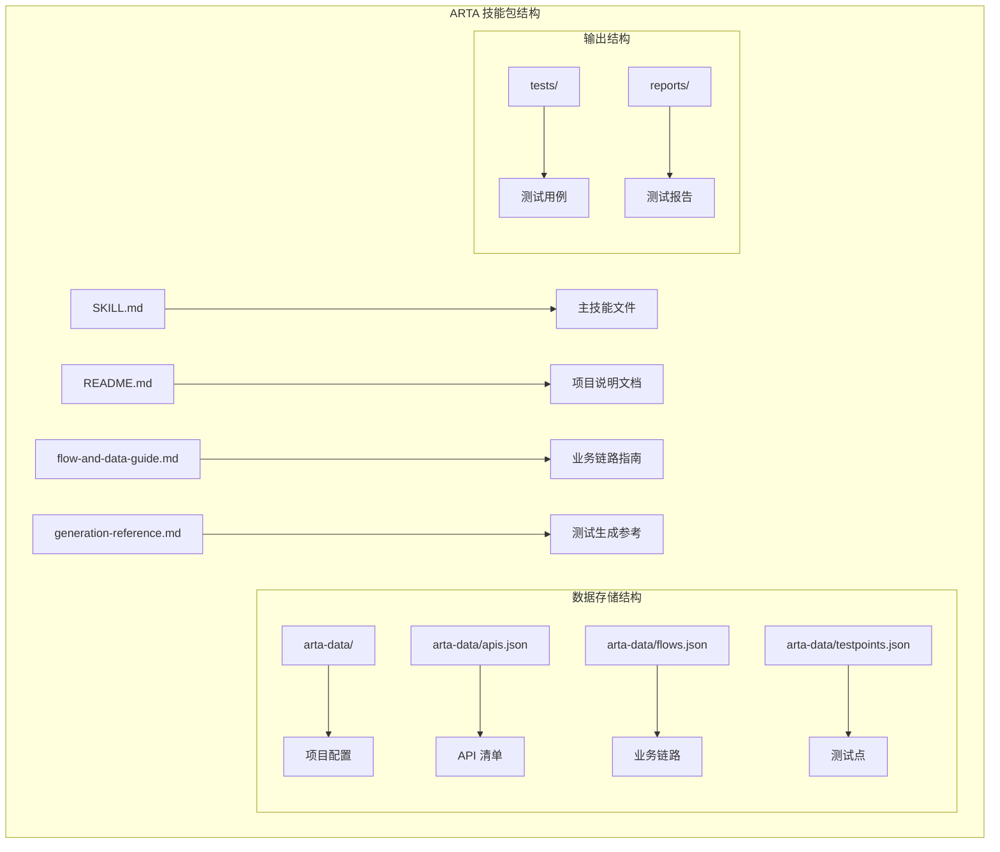

**图表来源**
- [README.md: 151-162:151-162](file://README.md#L151-L162)
- [SKILL.md: 419-431:419-431](file://SKILL.md#L419-L431)

**章节来源**
- [README.md: 1-176:1-176](file://README.md#L1-L176)
- [SKILL.md: 1-443:1-443](file://SKILL.md#L1-L443)

## 核心组件

### 项目接入流程控制器

项目接入阶段的核心组件是一个智能对话控制器，负责引导用户完成项目初始化配置。该控制器具备以下关键特性：

- **多轮对话管理**：支持复杂的多轮交互对话
- **配置验证机制**：实时验证用户输入的有效性
- **状态跟踪**：维护项目配置的完整生命周期
- **自动流转**：根据用户选择自动推进到下一阶段

### 用户交互对话设计

系统采用自然语言优先的设计理念，通过精心设计的对话流程引导用户完成项目配置：

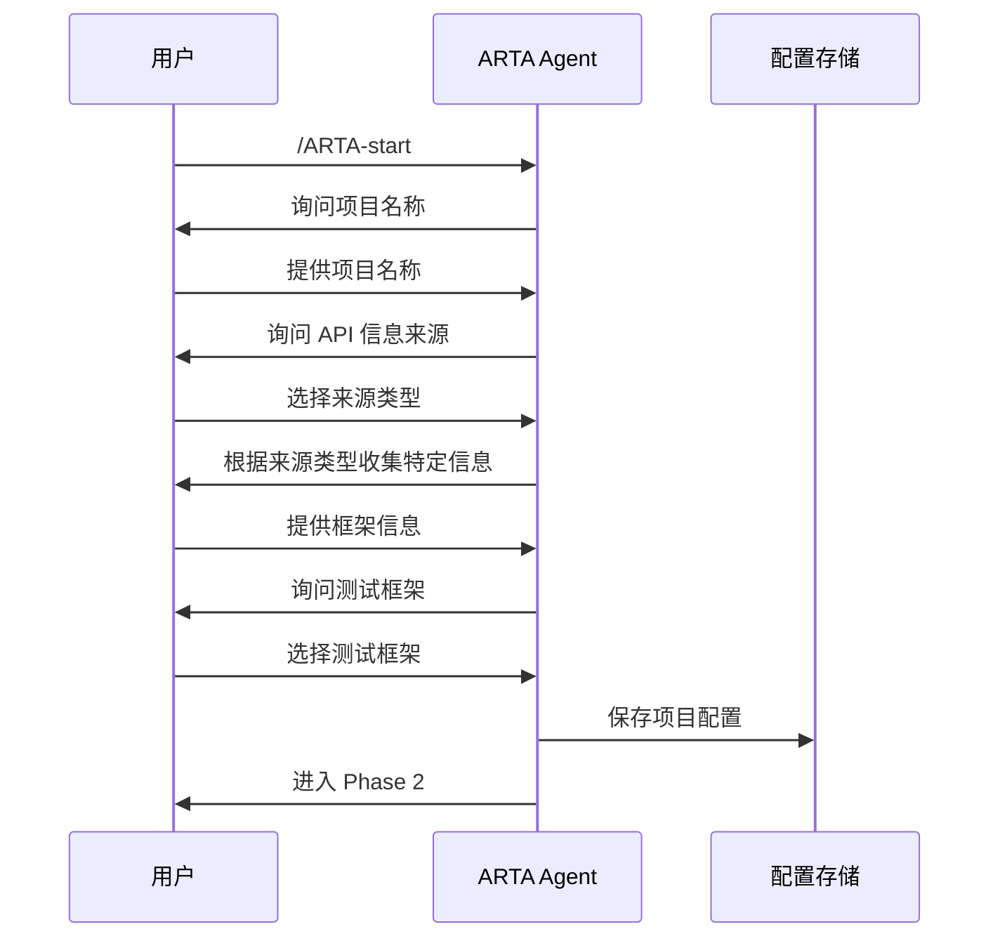

**图表来源**
- [SKILL.md: 50-78:50-78](file://SKILL.md#L50-L78)

### 必填信息收集机制

系统严格区分必填和可选信息，确保项目配置的完整性：

**必填信息**：
- 项目名称：用于标识和组织测试项目
- API 信息来源：决定后续扫描策略和数据收集方式

**可选配置**：
- 项目本地路径：仅在选择本地代码分析时需要
- OpenAPI 文件路径或 URL：仅在选择 OpenAPI 源时需要
- 后端框架：用于优化扫描策略和代码生成
- 测试框架：决定最终测试代码的生成格式

**章节来源**
- [SKILL.md: 34-78:34-78](file://SKILL.md#L34-L78)

## 架构概览

ARTA Phase 1 项目接入阶段采用模块化架构设计，各组件职责清晰分离：

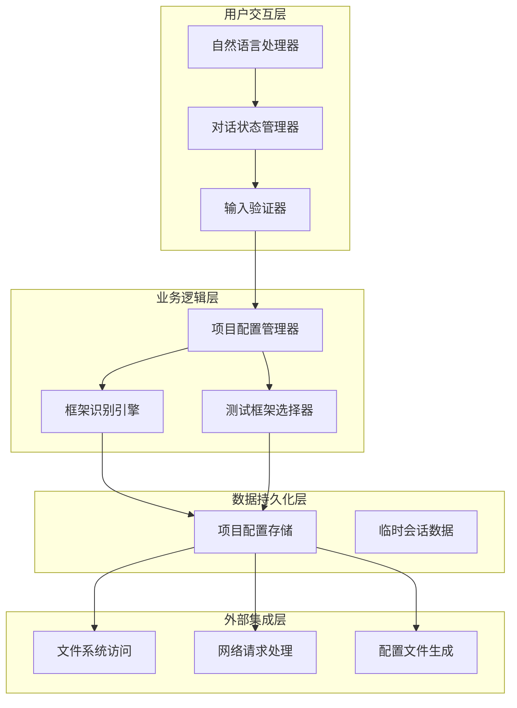

**图表来源**
- [SKILL.md: 34-78:34-78](file://SKILL.md#L34-L78)
- [README.md: 151-162:151-162](file://README.md#L151-L162)

## 详细组件分析

### 项目配置文件结构分析

#### project.json 配置文件

项目配置文件是 ARTA 系统的核心数据载体，采用标准化的 JSON 结构存储项目元数据：

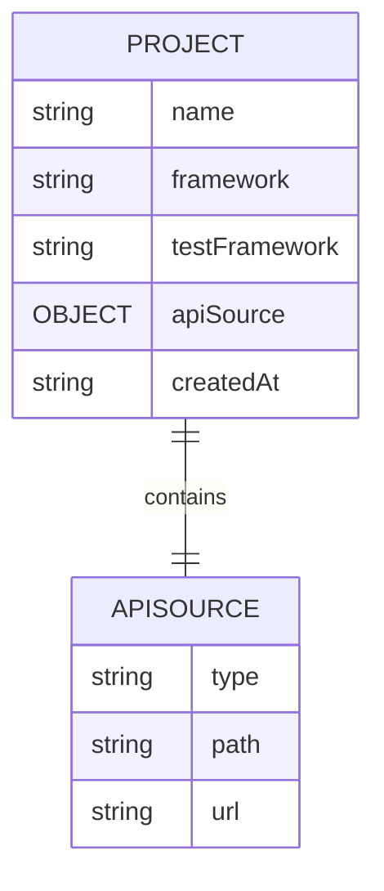

**图表来源**
- [SKILL.md: 67-75:67-75](file://SKILL.md#L67-L75)

**配置字段详细说明**：

| 字段名 | 类型 | 必填 | 描述 | 示例值 |
|--------|------|------|------|--------|
| name | string | 是 | 项目名称 | "my-api-project" |
| framework | string | 否 | 后端框架类型 | "Express" |
| testFramework | string | 否 | 测试框架类型 | "jest" |
| apiSource | object | 是 | API 信息来源配置 | 见下方示例 |
| createdAt | string | 是 | 项目创建时间戳 | "2026-03-11T12:00:00Z" |

**API 信息来源配置结构**：

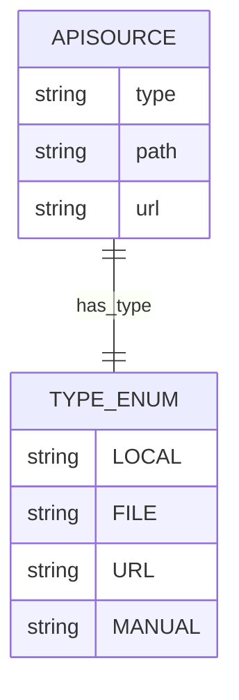

**图表来源**
- [SKILL.md: 72](file://SKILL.md#L72)

**章节来源**
- [SKILL.md: 67-75:67-75](file://SKILL.md#L67-L75)

### 框架识别逻辑

系统实现了智能的后端框架识别机制，支持多种主流技术栈：

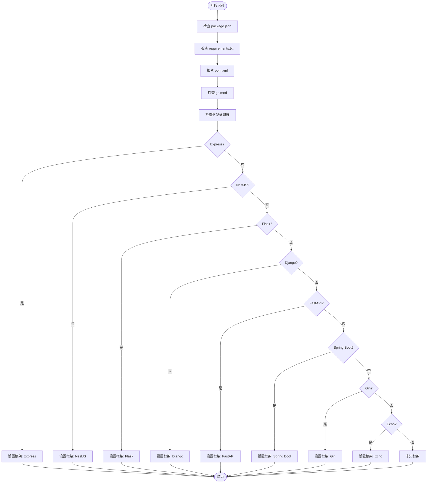

**图表来源**
- [SKILL.md: 87-98:87-98](file://SKILL.md#L87-L98)

**框架识别规则**：

| 框架类型 | 识别关键字 | 用途 |
|----------|------------|------|
| Express | app.get/post/put/delete(), router.get/post() | Node.js Web 框架 |
| NestJS | @Get(), @Post(), @Controller() | TypeScript/Node.js 框架 |
| Flask | @app.route(), @blueprint.route() | Python Web 框架 |
| Django | urlpatterns, path(), re_path() | Python Web 框架 |
| FastAPI | @app.get(), @router.post() | Python ASGI 框架 |
| Spring Boot | @GetMapping, @PostMapping, @RequestMapping | Java 微服务框架 |
| Gin | r.GET(), r.POST(), group.GET() | Go Web 框架 |
| Echo | e.GET(), e.POST(), g.GET() | Go Web 框架 |

**章节来源**
- [SKILL.md: 87-98:87-98](file://SKILL.md#L87-L98)

### 测试框架选择策略

测试框架选择器根据后端框架类型和用户偏好提供智能化的推荐：

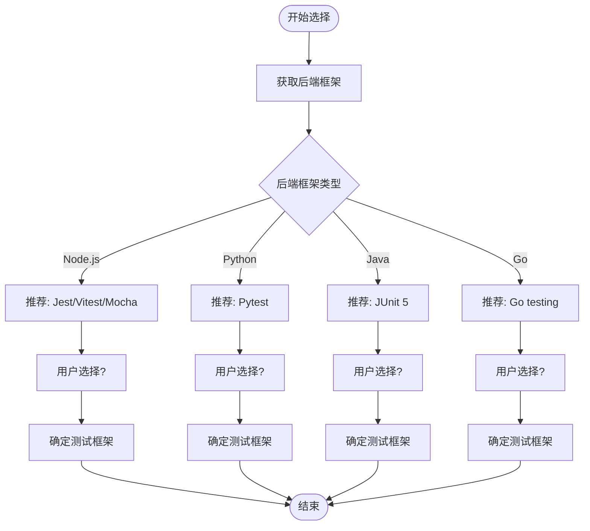

**图表来源**
- [SKILL.md: 26](file://SKILL.md#L26)

**测试框架支持矩阵**：

| 后端框架 | 支持的测试框架 | 语言 | 文件命名 |
|----------|----------------|------|----------|
| Express, NestJS | Jest, Vitest, Mocha | TypeScript | `{flow_name}.test.ts` |
| Flask, Django, FastAPI | Pytest | Python | `test_{flow_name}.py` |
| Spring Boot | JUnit 5 | Java | `{FlowName}Test.java` |
| Gin, Echo | Go testing | Go | `{flow_name}_test.go` |

**章节来源**
- [SKILL.md: 24-29:24-29](file://SKILL.md#L24-L29)

### 配置验证机制

系统实现了多层次的配置验证机制，确保项目配置的完整性和有效性：

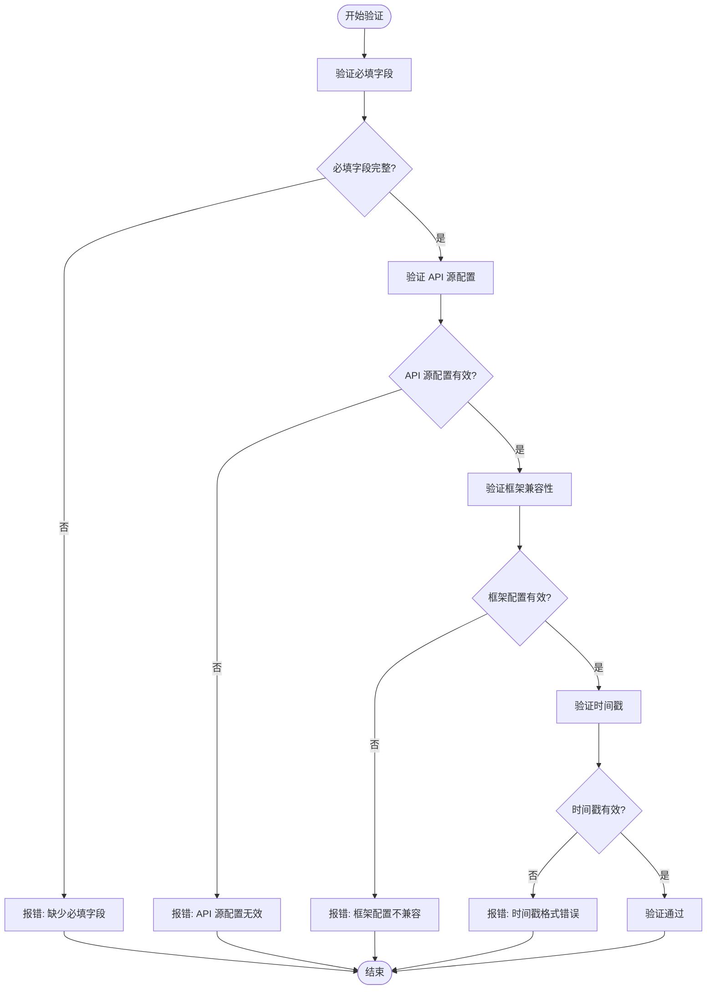

**图表来源**
- [SKILL.md: 67-75:67-75](file://SKILL.md#L67-L75)

**验证规则**：

1. **必填字段验证**：确保项目名称和 API 信息来源配置完整
2. **API 源验证**：根据选择的来源类型验证相应的配置项
3. **框架兼容性验证**：确保选择的测试框架与后端框架兼容
4. **时间戳验证**：确保创建时间戳格式正确

**章节来源**
- [SKILL.md: 67-75:67-75](file://SKILL.md#L67-L75)

### API 信息来源选择逻辑

系统提供了四种不同的 API 信息来源，每种来源都有特定的处理流程：

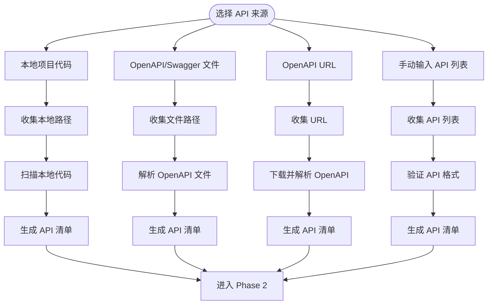

**图表来源**
- [SKILL.md: 56-62:56-62](file://SKILL.md#L56-L62)

**各来源处理流程**：

**本地项目代码分析**：
- 支持多语言框架的代码扫描
- 自动识别路由定义和 API 端点
- 提取 HTTP 方法、路径和处理函数信息

**OpenAPI 文件解析**：
- 支持 OpenAPI 3.0/3.1 和 Swagger 2.0 格式
- 自动解析 JSON 和 YAML 格式
- 提取所有端点、方法、路径和标签信息

**OpenAPI URL 获取**：
- 支持远程 API 规范的在线获取
- 自动处理 HTTPS 和认证要求
- 实时解析和验证 API 规范

**手动 API 输入**：
- 支持用户直接输入 API 列表
- 提供灵活的 API 定义格式
- 适合快速原型和简单项目

**章节来源**
- [SKILL.md: 56-62:56-62](file://SKILL.md#L56-L62)

## 依赖关系分析

ARTA Phase 1 项目接入阶段涉及多个层次的依赖关系：

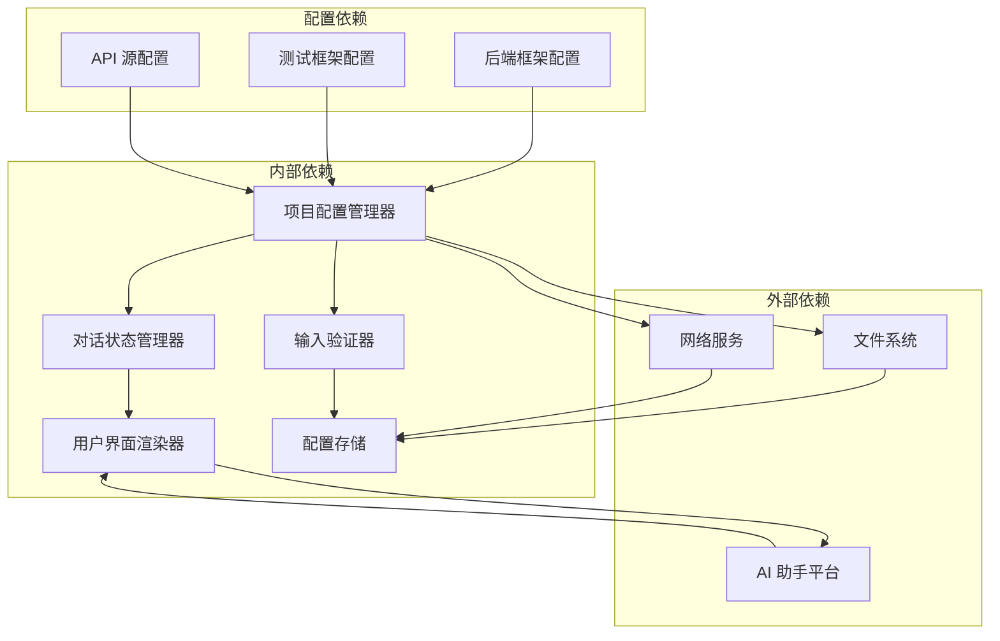

**图表来源**
- [SKILL.md: 34-78:34-78](file://SKILL.md#L34-L78)
- [README.md: 151-162:151-162](file://README.md#L151-L162)

**依赖关系特点**：

1. **低耦合高内聚**：各组件职责明确，相互依赖最小化
2. **配置驱动**：通过配置文件控制行为，便于扩展和维护
3. **平台无关**：支持多种 AI 助手平台，便于部署
4. **数据持久化**：所有配置和状态都持久化存储

**章节来源**
- [SKILL.md: 34-78:34-78](file://SKILL.md#L34-L78)

## 性能考虑

### 配置加载性能

项目配置文件采用轻量级 JSON 格式，具有以下性能优势：

- **小文件大小**：通常小于 1KB，加载速度极快
- **简单结构**：扁平化的数据结构，解析开销最小
- **缓存友好**：配置文件在内存中缓存，减少磁盘访问

### 对话处理性能

系统采用异步对话处理机制：

- **非阻塞 I/O**：避免长时间等待用户响应
- **状态缓存**：中间状态在内存中缓存
- **增量验证**：只验证发生变化的配置项

### 数据存储优化

- **增量更新**：只更新变化的配置字段
- **批量写入**：定期批量写入配置文件
- **压缩存储**：配置文件采用压缩格式存储

## 故障排除指南

### 常见配置问题及解决方案

**问题 1：项目名称为空或无效**
- **症状**：系统提示缺少必填字段
- **解决方案**：重新输入有效的项目名称，确保不包含特殊字符

**问题 2：API 源配置错误**
- **症状**：系统提示 API 源配置无效
- **解决方案**：检查选择的来源类型，确保提供正确的路径或 URL

**问题 3：框架识别失败**
- **症状**：系统无法识别后端框架
- **解决方案**：手动选择框架类型，或检查项目代码结构

**问题 4：测试框架不兼容**
- **症状**：系统提示测试框架与后端框架不兼容
- **解决方案**：选择与后端框架兼容的测试框架

**问题 5：配置文件损坏**
- **症状**：系统无法读取配置文件
- **解决方案**：删除损坏的配置文件，重新开始项目接入流程

### 状态恢复机制

系统提供了完善的断点续作能力：

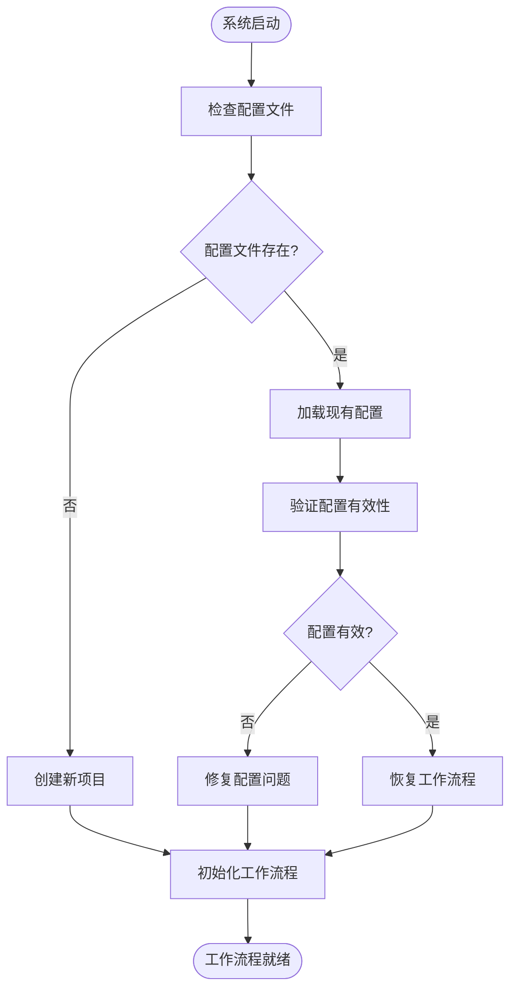

**图表来源**
- [SKILL.md: 380-398:380-398](file://SKILL.md#L380-L398)

**章节来源**
- [SKILL.md: 380-398:380-398](file://SKILL.md#L380-L398)

## 结论

ARTA Phase 1 项目接入阶段通过精心设计的对话流程和智能配置管理，为整个测试工作流程奠定了坚实的基础。系统的主要优势包括：

1. **用户友好**：采用自然语言交互，降低学习成本
2. **智能配置**：自动识别框架类型，提供合理的默认配置
3. **灵活扩展**：支持多种 API 信息来源和测试框架
4. **可靠稳定**：完善的验证机制和错误处理
5. **易于维护**：模块化设计，便于功能扩展和维护

通过本文档的详细分析，开发者可以深入理解 ARTA Phase 1 的实现原理和最佳实践，为后续的 Phase 2-4 阶段做好充分准备。

## 附录

### 完整配置示例

以下是一个完整的项目配置示例，展示了各种配置选项的组合：

```json
{
  "name": "my-api-project",
  "framework": "Express",
  "testFramework": "jest",
  "apiSource": {
    "type": "local",
    "path": "/home/user/projects/my-api"
  },
  "createdAt": "2026-03-11T12:00:00Z"
}
```

### 最佳实践建议

1. **项目命名规范**：使用有意义的项目名称，避免特殊字符
2. **框架选择策略**：优先选择与现有技术栈一致的测试框架
3. **API 源选择**：优先使用 OpenAPI 规范文件，提高准确性
4. **配置验证**：定期验证配置的有效性，及时发现问题
5. **文档维护**：保持配置文档的更新，便于团队协作

### 后续阶段触发机制

项目配置完成后，系统会自动触发 Phase 2 的 API 扫描流程：

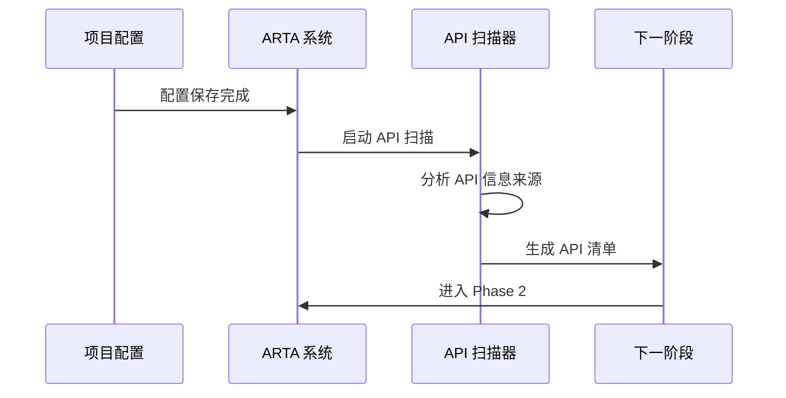

**图表来源**
- [SKILL.md: 77](file://SKILL.md#L77)