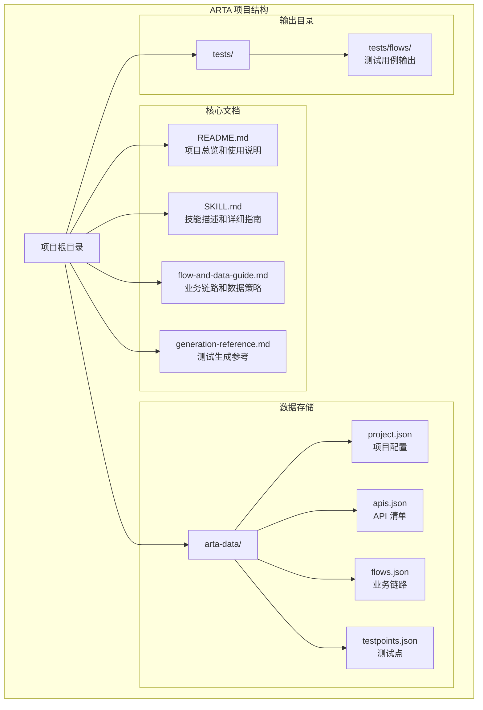
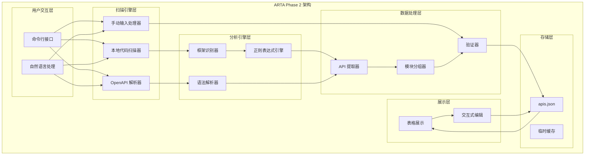
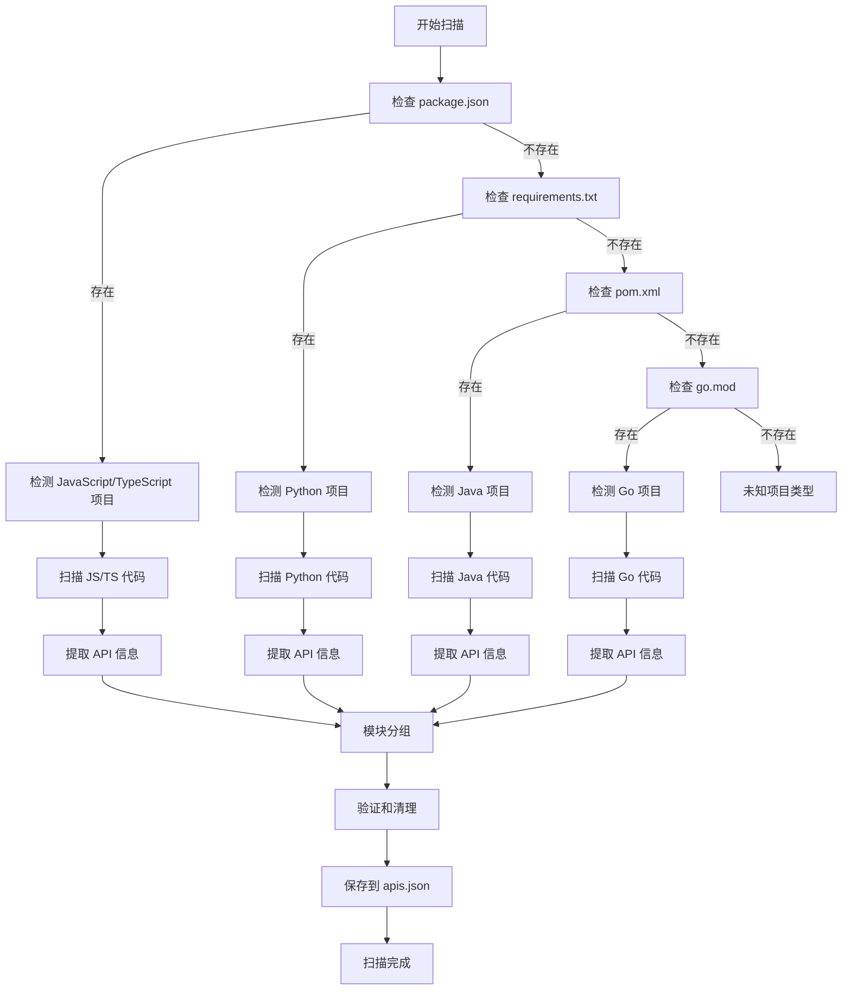
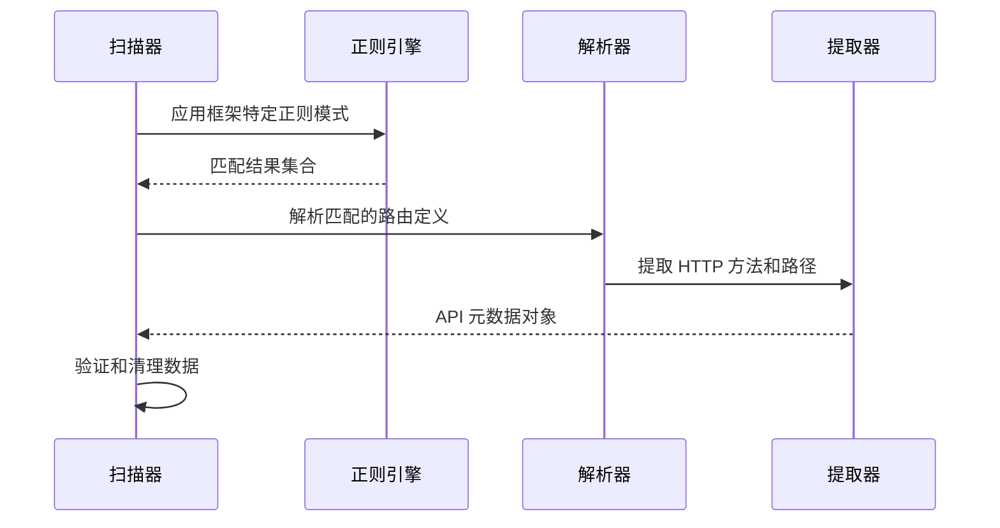
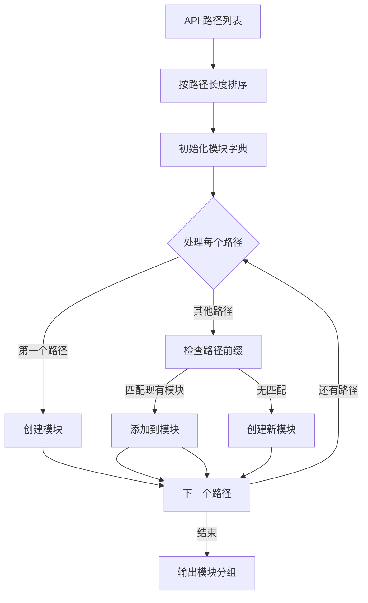
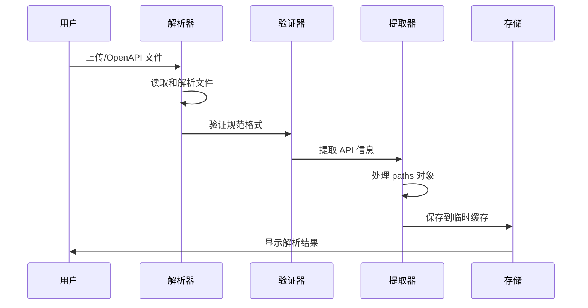
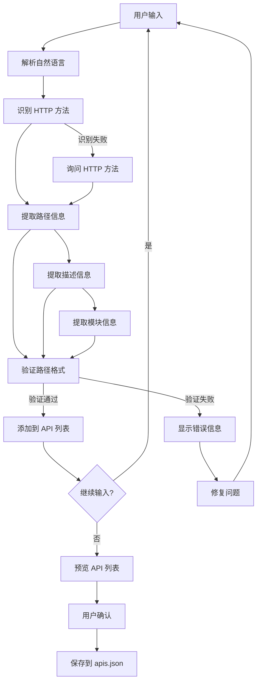
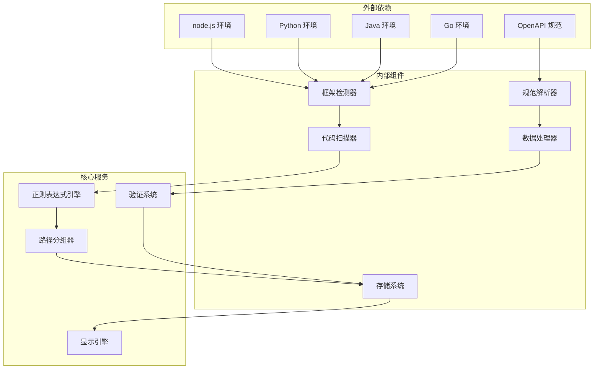
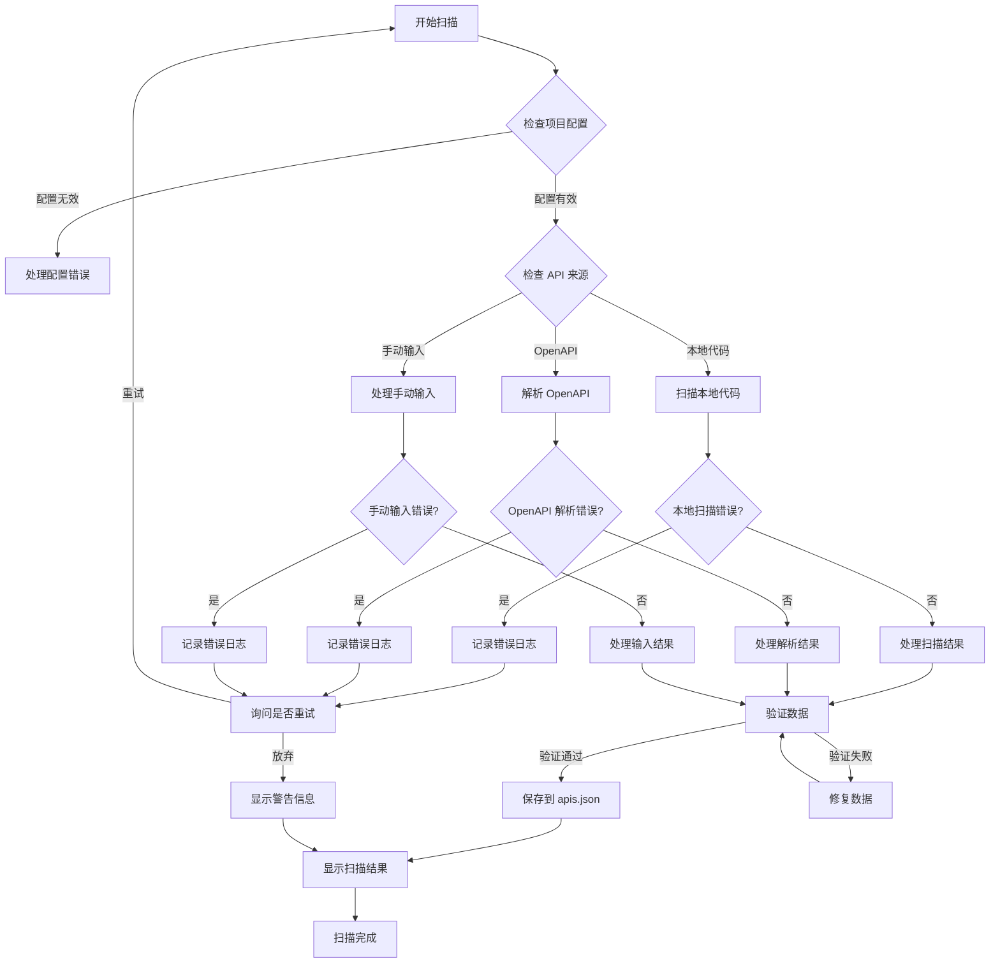

# ARTA Phase 2: API 扫描技术文档

<cite>
**本文档中引用的文件**
- [README.md](file://README.md)
- [SKILL.md](file://SKILL.md)
- [flow-and-data-guide.md](file://flow-and-data-guide.md)
- [generation-reference.md](file://generation-reference.md)
</cite>

## 目录
1. [简介](#简介)
2. [项目结构](#项目结构)
3. [核心组件](#核心组件)
4. [架构概览](#架构概览)
5. [详细组件分析](#详细组件分析)
6. [依赖关系分析](#依赖关系分析)
7. [性能考虑](#性能考虑)
8. [故障排除指南](#故障排除指南)
9. [结论](#结论)

## 简介

ARTA（Automation Regression Test Assistant）是一个端到端 API 自动化测试流程引导工具，专门用于帮助开发团队从项目接入到测试用例生成的完整测试流程。本文档专注于 ARTA 的 Phase 2 API 扫描阶段，深入解释三种扫描方式的实现原理和技术细节。

ARTA 的核心目标是简化 API 测试的整个生命周期，通过智能化的扫描、业务链路记录和测试用例生成，提高测试效率和质量。Phase 2 API 扫描是整个流程的关键环节，负责自动发现和分析项目中的 API 接口。

## 项目结构

ARTA 项目采用简洁明了的文件组织结构，主要包含四个核心文档文件：

**图表来源**
- [README.md: 151-162:151-162](file://README.md#L151-L162)
- [SKILL.md: 419-431:419-431](file://SKILL.md#L419-L431)

**章节来源**
- [README.md: 1-176:1-176](file://README.md#L1-L176)
- [SKILL.md: 1-443:1-443](file://SKILL.md#L1-L443)

## 核心组件

### API 扫描引擎

ARTA 的 API 扫描引擎是 Phase 2 的核心组件，负责实现三种不同的扫描策略：

#### 1. 本地代码分析扫描器

本地代码分析扫描器通过静态代码分析来识别 API 路由定义。该扫描器支持多种主流后端框架：

| 框架 | 关键标识 | 识别规则 |
|------|----------|----------|
| Express | `app.get/post/put/delete()` `router.get/post()` | 路由方法调用模式 |
| NestJS | `@Get()` `@Post()` `@Controller()` | 装饰器模式识别 |
| Flask | `@app.route()` `@blueprint.route()` | 装饰器路由定义 |
| Django | `urlpatterns` `path()` `re_path()` | URL 模式定义 |
| FastAPI | `@app.get()` `@router.post()` | 装饰器和路由装饰器 |
| Spring Boot | `@GetMapping` `@PostMapping` `@RequestMapping` | 注解驱动的控制器 |
| Gin | `r.GET()` `r.POST()` `group.GET()` | 路由组和方法绑定 |
| Echo | `e.GET()` `e.POST()` `g.GET()` | 路由方法和组定义 |

#### 2. OpenAPI 规范解析器

OpenAPI 规范解析器支持 OpenAPI 3.0/3.1 和 Swagger 2.0 规范的解析：

- **文件格式支持**：JSON 和 YAML 格式
- **版本兼容性**：OpenAPI 3.0/3.1 和 Swagger 2.0
- **解析内容**：paths 下的所有端点、HTTP 方法、operationId、summary、tags、schema

#### 3. 手动输入 API 列表处理器

手动输入 API 列表处理器允许用户直接输入 API 信息：
- **输入格式**：自然语言描述
- **处理能力**：自动识别 HTTP 方法、路径、描述和模块
- **验证机制**：格式验证和冲突检测

**章节来源**
- [SKILL.md: 81-140:81-140](file://SKILL.md#L81-L140)

## 架构概览

ARTA 的 API 扫描架构采用模块化设计，支持多种扫描方式的统一处理：

**图表来源**
- [SKILL.md: 81-140:81-140](file://SKILL.md#L81-L140)
- [README.md: 102-113:102-113](file://README.md#L102-L113)

## 详细组件分析

### 本地代码分析扫描器

本地代码分析扫描器是 ARTA 最复杂的组件，需要支持多种编程语言和框架的静态分析。

#### 框架识别策略

框架识别通过分析项目根目录的构建配置文件来确定项目类型：

**图表来源**
- [SKILL.md: 100-105:100-105](file://SKILL.md#L100-L105)

#### 正则表达式匹配策略

每种框架都有特定的正则表达式模式来识别路由定义：

**JavaScript/TypeScript 框架模式：**
- Express: `app\.(get|post|put|delete)\s*\(\s*["'`]([^"']+?)["'`]\s*,`
- NestJS: `@Get|@Post|@Put|@Delete\s*\(\s*["'`]([^"']+?)["'`]\s*\)`
- FastAPI: `@app\.(get|post|put|delete)\s*\(\s*["'`]([^"']+?)["'`]\s*\)`

**Python 框架模式：**
- Flask: `@app\.route\s*\(\s*["'`]([^"']+?)["'`]\s*\)`
- Django: `(urlpatterns\s*=|path\s*\(\s*["'`]([^"']+?)["'`]\s*\)|re_path\s*\(\s*["'`]([^"']+?)["'`]\s*\))`

**Java 框架模式：**
- Spring Boot: `@(GetMapping|PostMapping|PutMapping|DeleteMapping)\s*\(\s*["'`]([^"']+?)["'`]\s*\)`

**Go 框架模式：**
- Gin: `r\.(GET|POST|PUT|DELETE)\s*\(\s*["'`]([^"']+?)["'`]\s*,`
- Echo: `e\.(GET|POST|PUT|DELETE)\s*\(\s*["'`]([^"']+?)["'`]\s*,`

#### HTTP 方法提取逻辑

HTTP 方法提取通过分析路由定义中的方法调用来实现：

**图表来源**
- [SKILL.md: 103-104:103-104](file://SKILL.md#L103-L104)

#### 模块分组算法

模块分组基于路径前缀自动进行，支持多级路径分组：

**图表来源**
- [SKILL.md: 105](file://SKILL.md#L105)

**章节来源**
- [SKILL.md: 83-106:83-106](file://SKILL.md#L83-L106)

### OpenAPI 规范解析器

OpenAPI 规范解析器支持多种规范格式和版本：

#### 规范格式支持

| 格式 | 扩展名 | 特点 |
|------|--------|------|
| OpenAPI 3.0 | `.yaml`, `.yml` | 最新标准，支持丰富特性 |
| OpenAPI 3.1 | `.yaml`, `.yml` | 增强版本，改进安全性 |
| Swagger 2.0 | `.json` | 传统格式，广泛兼容 |

#### 解析流程

**图表来源**
- [SKILL.md: 107-117:107-117](file://SKILL.md#L107-L117)

#### OpenAPI 元数据提取

解析器从 OpenAPI 规范中提取以下关键信息：

- **路径信息**：所有在 `paths` 对象下的端点
- **HTTP 方法**：每个路径支持的 HTTP 方法
- **描述信息**：使用 `operationId` 或 `summary` 作为 API 描述
- **模块分组**：使用 `tags` 字段进行模块分类
- **参数信息**：请求参数、响应格式、状态码定义

**章节来源**
- [SKILL.md: 107-117:107-117](file://SKILL.md#L107-L117)

### 手动输入 API 列表处理器

手动输入处理器提供灵活的 API 发现方式，支持自然语言描述：

#### 输入处理流程

**图表来源**
- [SKILL.md: 118-139:118-139](file://SKILL.md#L118-L139)

#### 交互式编辑功能

用户可以通过自然语言对 API 清单进行增删改操作：

- **添加 API**：`"添加 POST /api/xxx 描述"`
- **删除 API**：`"删除第3个"`
- **修改描述**：`"修改第2个的描述为xxx"`

**章节来源**
- [SKILL.md: 118-139:118-139](file://SKILL.md#L118-L139)

## 依赖关系分析

ARTA 的 API 扫描系统具有清晰的依赖关系结构：

**图表来源**
- [README.md: 22-29:22-29](file://README.md#L22-L29)
- [SKILL.md: 42-46:42-46](file://SKILL.md#L42-L46)

### 组件耦合度分析

ARTA 的组件设计遵循高内聚、低耦合的原则：

- **框架检测器**：独立于具体扫描实现，只负责识别项目类型
- **扫描器**：根据框架类型选择相应的扫描策略
- **数据处理器**：统一处理不同来源的 API 数据
- **存储系统**：提供统一的数据持久化接口

这种设计使得系统易于扩展新的框架支持和扫描方式。

**章节来源**
- [README.md: 22-29:22-29](file://README.md#L22-L29)
- [SKILL.md: 42-46:42-46](file://SKILL.md#L42-L46)

## 性能考虑

### 扫描性能优化策略

ARTA 在 API 扫描过程中采用了多项性能优化措施：

#### 1. 文件过滤优化

扫描器会自动忽略大型目录和临时文件：
- `node_modules/` - JavaScript 依赖包
- `vendor/` - PHP 依赖包  
- `.git/` - 版本控制信息
- `dist/`, `build/` - 构建输出目录

#### 2. 并行处理机制

对于多文件扫描，系统支持并行处理以提高效率：
- 多线程文件扫描
- 异步正则表达式匹配
- 并发 API 提取

#### 3. 缓存机制

- **框架识别缓存**：避免重复的构建文件分析
- **扫描结果缓存**：支持增量扫描和快速重扫
- **解析结果缓存**：OpenAPI 规范解析结果缓存

#### 4. 内存管理

- **流式文件处理**：大文件采用流式读取
- **内存池管理**：复用正则表达式对象
- **垃圾回收优化**：及时释放临时对象

### 错误处理机制

ARTA 实现了多层次的错误处理机制：

**图表来源**
- [SKILL.md: 118-139:118-139](file://SKILL.md#L118-L139)

## 故障排除指南

### 常见问题及解决方案

#### 1. 框架识别失败

**问题症状**：
- 系统无法识别项目类型
- 扫描结果为空

**解决步骤**：
1. 检查项目根目录的构建配置文件是否存在
2. 确认项目结构符合预期
3. 手动指定框架类型

#### 2. OpenAPI 解析错误

**问题症状**：
- 解析 OpenAPI 规范时出现错误
- API 清单不完整

**解决步骤**：
1. 验证 OpenAPI 文件格式正确性
2. 检查文件编码格式
3. 确认规范版本兼容性

#### 3. 手动输入格式错误

**问题症状**：
- 手动输入的 API 无法被正确识别
- HTTP 方法或路径格式不正确

**解决步骤**：
1. 检查输入格式是否符合要求
2. 确认 HTTP 方法的有效性
3. 验证路径格式的正确性

#### 4. 模块分组异常

**问题症状**：
- API 模块分组不符合预期
- 路径前缀匹配错误

**解决步骤**：
1. 检查路径前缀的合理性
2. 确认模块命名规范
3. 手动调整模块分组

### 调试和诊断

#### 日志记录策略

ARTA 实现了完整的日志记录机制：
- **调试日志**：详细的操作过程记录
- **错误日志**：异常情况的详细描述
- **性能日志**：扫描时间和资源使用情况
- **用户操作日志**：用户交互和决策记录

#### 性能监控

系统提供实时性能监控：
- 扫描进度百分比
- 已处理文件数量
- 当前处理的文件名
- 预估剩余时间

**章节来源**
- [SKILL.md: 118-139:118-139](file://SKILL.md#L118-L139)

## 结论

ARTA 的 Phase 2 API 扫描阶段展现了现代测试工具的先进设计理念。通过支持三种不同的扫描方式、智能的框架识别、强大的正则表达式匹配和优雅的模块分组算法，ARTA 为开发者提供了一个全面而高效的 API 发现和分析解决方案。

### 技术优势

1. **多语言支持**：统一支持 JavaScript/TypeScript、Python、Java、Go 四种主流开发语言
2. **多框架兼容**：涵盖 Express、NestJS、Flask、Django、FastAPI、Spring Boot、Gin、Echo 等主流框架
3. **多格式解析**：支持 OpenAPI 3.0/3.1、Swagger 2.0 和手动输入三种扫描方式
4. **智能处理**：自动框架识别、路径分组和数据验证
5. **用户友好**：提供自然语言交互和可视化展示

### 应用价值

ARTA 的 API 扫描功能为测试流程带来了显著的价值：
- **提高效率**：自动化 API 发现减少手工录入工作量
- **保证质量**：统一的扫描标准确保 API 清单的完整性
- **降低风险**：早期发现 API 变更和不一致问题
- **增强协作**：标准化的 API 清单便于团队协作

### 未来发展

ARTA 的 API 扫描技术为后续的业务链路记录和测试用例生成奠定了坚实基础。随着技术的不断发展，ARTA 将继续扩展支持更多的框架和规范，优化扫描性能，并增强智能化程度，为开发者提供更加完善的测试解决方案。