# Phase 3: 业务链路记录

<cite>
**本文档引用的文件**
- [README.md](file://README.md)
- [SKILL.md](file://SKILL.md)
- [flow-and-data-guide.md](file://flow-and-data-guide.md)
- [generation-reference.md](file://generation-reference.md)
</cite>

## 目录
1. [引言](#引言)
2. [项目结构](#项目结构)
3. [核心组件](#核心组件)
4. [架构概览](#架构概览)
5. [详细组件分析](#详细组件分析)
6. [依赖分析](#依赖分析)
7. [性能考虑](#性能考虑)
8. [故障排除指南](#故障排除指南)
9. [结论](#结论)

## 引言

ARTA（Automation Regression Test Assistant）是一个端到端 API 自动化测试流程引导工具，专门帮助开发团队从项目接入到测试用例生成的完整流程。本文档专注于 Phase 3 业务链路记录阶段，这是一个关键的中间环节，它将 API 扫描的结果转化为可执行的测试业务流程。

业务链路记录的核心目标是：
- 将零散的 API 端点组织成完整的业务场景
- 定义 API 调用的正确顺序和依赖关系
- 配置测试数据策略和断言规则
- 建立可维护的测试用例生成基础

## 项目结构

ARTA 项目采用简洁的文档驱动架构，主要包含四个核心文件：

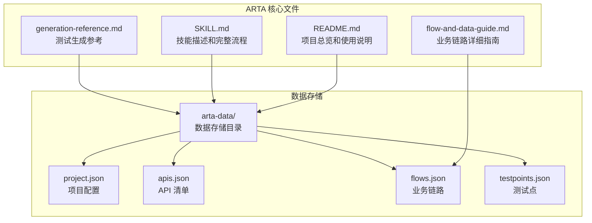

**图表来源**
- [README.md: 151-162:151-162](file://README.md#L151-L162)
- [SKILL.md: 419-431:419-431](file://SKILL.md#L419-L431)

**章节来源**
- [README.md: 1-176:1-176](file://README.md#L1-L176)
- [SKILL.md: 1-443:1-443](file://SKILL.md#L1-L443)

## 核心组件

### 业务链路数据模型

业务链路是 ARTA 的核心抽象，它将多个 API 调用序列化为可执行的测试流程。每个链路由以下关键元素组成：

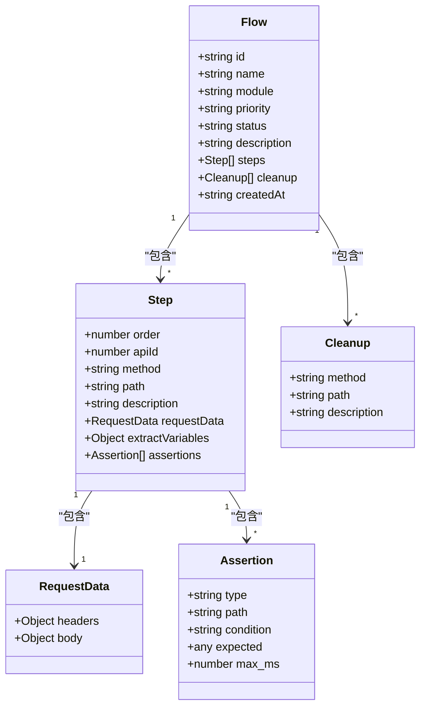

**图表来源**
- [flow-and-data-guide.md: 7-75:7-75](file://flow-and-data-guide.md#L7-L75)

### 四步记录流程

业务链路记录采用标准化的四步流程，确保每个链路都具备完整的测试覆盖：

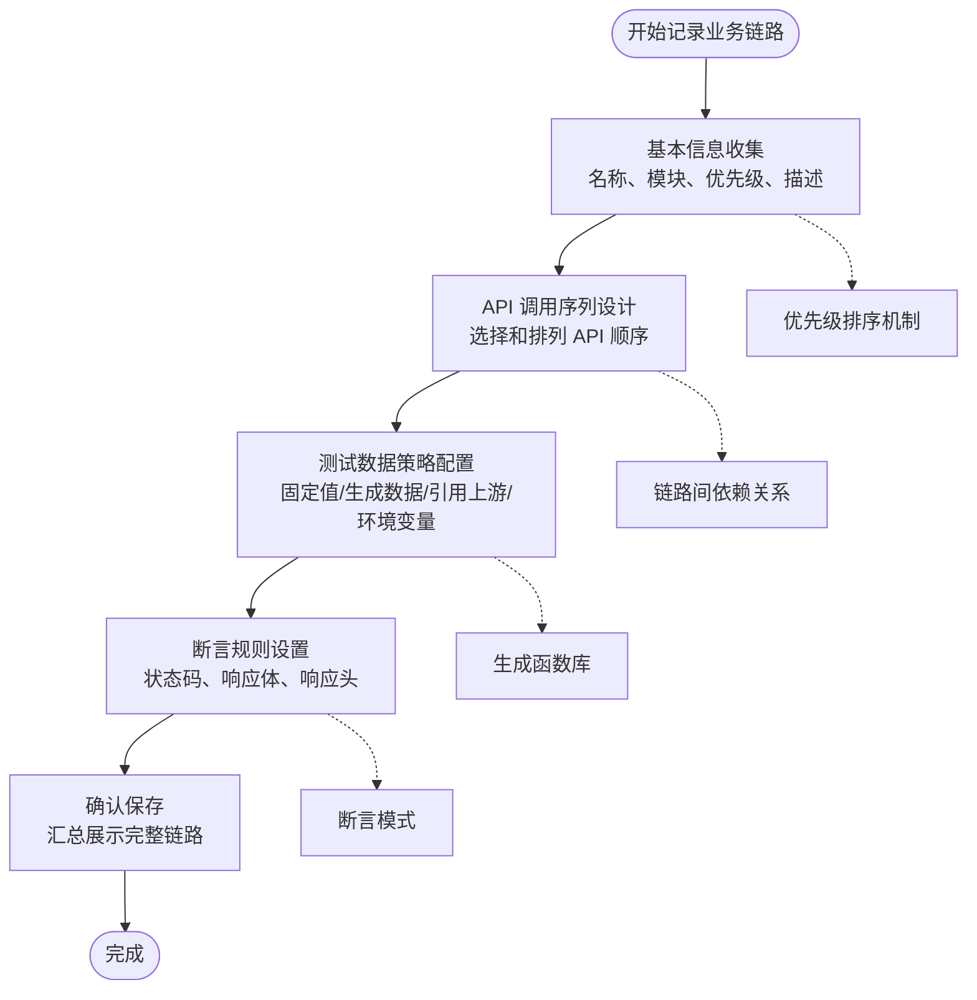

**图表来源**
- [SKILL.md: 147-225:147-225](file://SKILL.md#L147-L225)

**章节来源**
- [SKILL.md: 143-258:143-258](file://SKILL.md#L143-L258)
- [flow-and-data-guide.md: 5-75:5-75](file://flow-and-data-guide.md#L5-L75)

## 架构概览

### 数据流架构

业务链路记录阶段的数据流体现了清晰的层次结构：

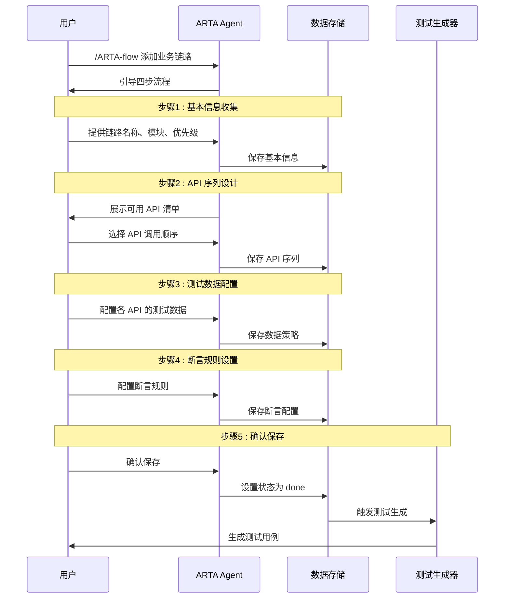

**图表来源**
- [SKILL.md: 147-225:147-225](file://SKILL.md#L147-L225)
- [README.md: 115-126:115-126](file://README.md#L115-L126)

### 状态管理模式

业务链路采用简单而有效的状态管理机制：

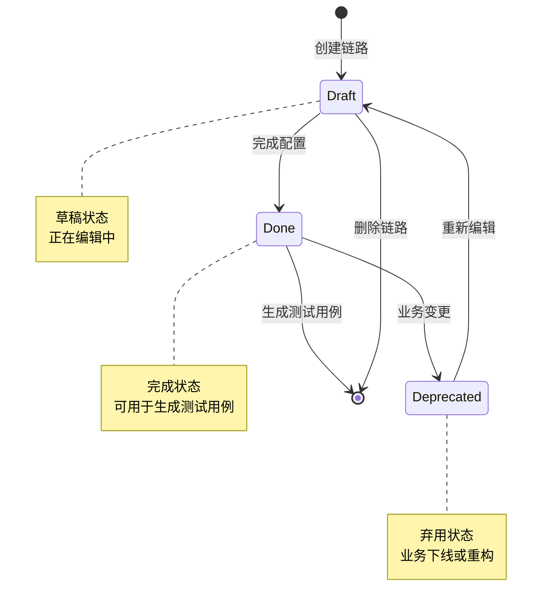

**图表来源**
- [flow-and-data-guide.md: 211-218:211-218](file://flow-and-data-guide.md#L211-L218)

**章节来源**
- [flow-and-data-guide.md: 211-218:211-218](file://flow-and-data-guide.md#L211-L218)

## 详细组件分析

### 测试数据策略详解

ARTA 支持四种灵活的测试数据策略，每种都有其特定的使用场景：

#### 固定值策略
固定值是最简单的数据策略，适用于已知的测试账号或配置信息。这种策略确保测试的可重复性和稳定性。

#### 生成数据策略
生成数据策略通过内置函数动态生成测试数据，避免了数据冲突和重复问题：

```mermaid
flowchart LR
subgraph "生成函数库"
A[uuid()] --> A1[UUID v4]
B[timestamp()] --> B1[当前时间戳]
C[random_email()] --> C1[随机邮箱]
D[random_phone()] --> D1[随机手机号]
E[increment(prefix)] --> E1[自增序列]
F[faker(name)] --> F1[随机姓名]
end
subgraph "应用场景"
G[创建接口] --> A1
H[唯一标识] --> B1
I[用户数据] --> C1
J[联系方式] --> D1
K[批量测试] --> E1
L[真实数据] --> F1
end
```

**图表来源**
- [flow-and-data-guide.md: 92-107:92-107](file://flow-and-data-guide.md#L92-L107)

#### 引用上游策略
引用上游策略允许在后续步骤中使用前面步骤的响应数据，实现跨步骤的数据传递：

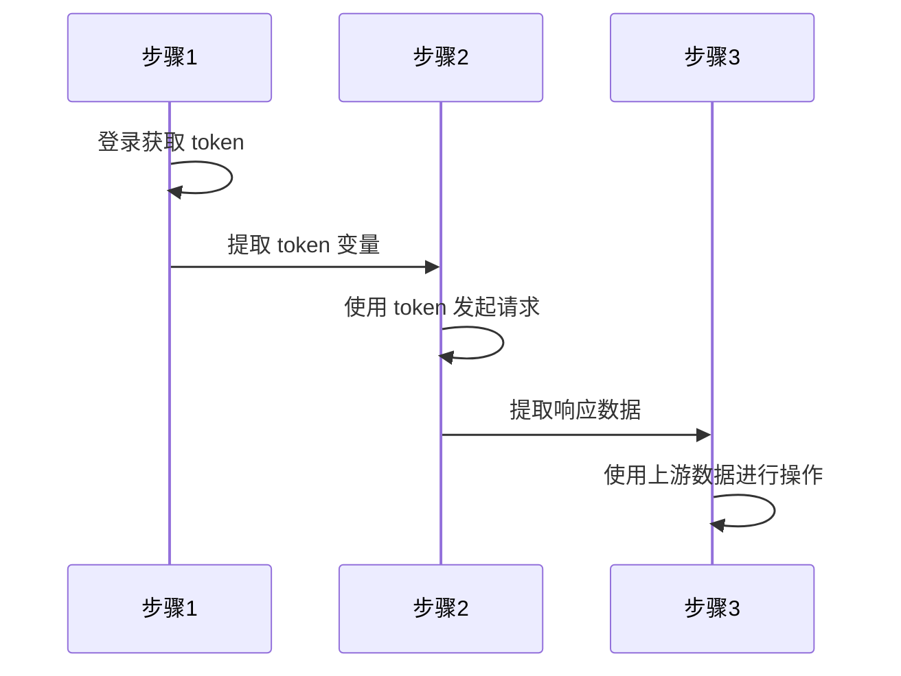

**图表来源**
- [flow-and-data-guide.md: 108-122:108-122](file://flow-and-data-guide.md#L108-L122)

#### 环境变量策略
环境变量策略允许从运行时环境中获取配置信息，支持不同环境的灵活切换。

**章节来源**
- [flow-and-data-guide.md: 77-132:77-132](file://flow-and-data-guide.md#L77-L132)
- [README.md: 140-150:140-150](file://README.md#L140-L150)

### 断言规则配置

断言是验证 API 响应正确性的关键机制，ARTA 支持多种断言类型：

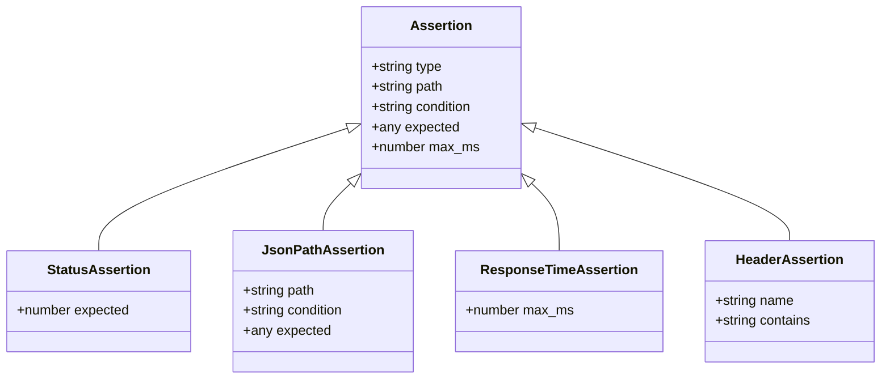

**图表来源**
- [flow-and-data-guide.md: 133-145:133-145](file://flow-and-data-guide.md#L133-L145)

#### 常用断言模式

| 断言类型 | 使用场景 | 配置示例 |
|---------|---------|---------|
| `status` | 验证 HTTP 状态码 | `{ "type": "status", "expected": 200 }` |
| `jsonpath+exists` | 验证字段存在 | `{ "path": "$.data.token", "condition": "exists" }` |
| `jsonpath+equals` | 验证字段值 | `{ "path": "$.data.status", "condition": "equals", "expected": "active" }` |
| `jsonpath+contains` | 验证包含关系 | `{ "path": "$.message", "condition": "contains", "expected": "success" }` |
| `response_time` | 验证响应性能 | `{ "type": "response_time", "max_ms": 1000 }` |
| `header` | 验证响应头 | `{ "type": "header", "name": "Content-Type", "contains": "application/json" }` |

**章节来源**
- [flow-and-data-guide.md: 133-145:133-145](file://flow-and-data-guide.md#L133-L145)

### CRUD 接口特殊处理

针对不同的 CRUD 操作，ARTA 提供了专门的处理策略和最佳实践：

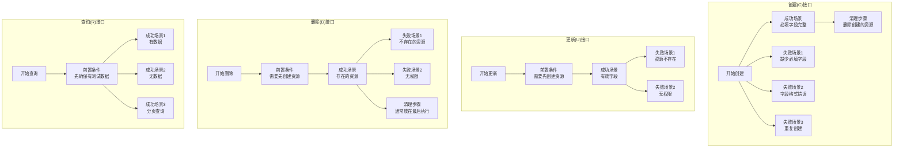

**图表来源**
- [flow-and-data-guide.md: 146-198:146-198](file://flow-and-data-guide.md#L146-L198)

**章节来源**
- [flow-and-data-guide.md: 146-198:146-198](file://flow-and-data-guide.md#L146-L198)

### 链路编辑、删除和批量操作

ARTA 提供了完善的链路管理机制：

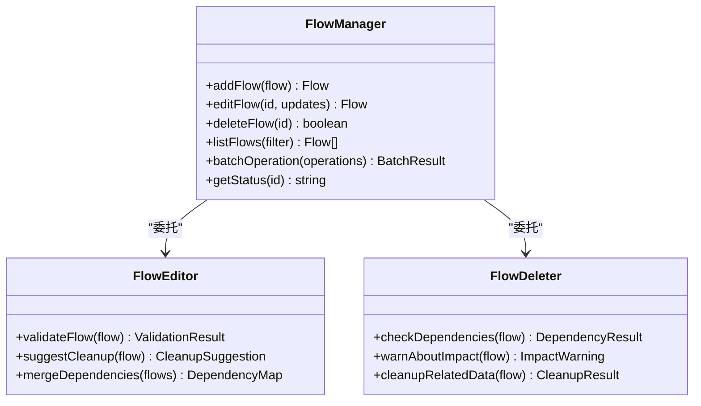

**图表来源**
- [SKILL.md: 226-244:226-244](file://SKILL.md#L226-L244)

**章节来源**
- [SKILL.md: 226-258:226-258](file://SKILL.md#L226-L258)

## 依赖分析

### 数据依赖关系

业务链路记录阶段涉及多个层面的依赖关系：

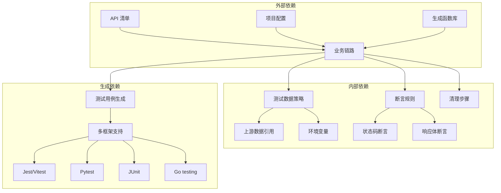

**图表来源**
- [README.md: 151-162:151-162](file://README.md#L151-L162)
- [SKILL.md: 297-377:297-377](file://SKILL.md#L297-L377)

### 优先级排序机制

ARTA 采用四等级优先级系统来管理业务链路的重要程度：

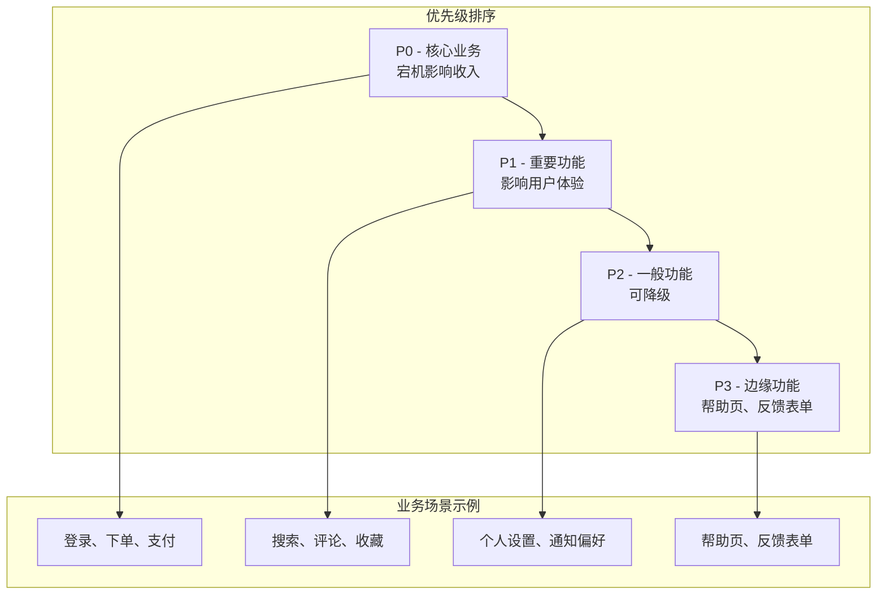

**图表来源**
- [flow-and-data-guide.md: 200-210:200-210](file://flow-and-data-guide.md#L200-L210)

**章节来源**
- [flow-and-data-guide.md: 200-218:200-218](file://flow-and-data-guide.md#L200-L218)

## 性能考虑

### 数据生成性能

生成函数库的设计充分考虑了性能优化：
- 使用高效的随机数生成算法
- 缓存常用的生成结果
- 支持批量生成减少重复计算

### 断言执行效率

断言系统的性能优化策略：
- 早期失败原则，快速检测错误
- 批量断言合并执行
- 智能断言缓存机制

### 内存管理

业务链路数据的内存管理：
- 流式处理大型数据集
- 及时释放临时变量
- 垃圾回收优化

## 故障排除指南

### 常见问题诊断

| 问题类型 | 症状 | 解决方案 |
|---------|------|---------|
| API 依赖缺失 | 断言失败 | 检查 API 序列顺序 |
| 数据引用错误 | 上游数据为空 | 验证引用路径正确性 |
| 断言配置错误 | 测试用例不通过 | 检查断言语法和条件 |
| 环境变量未设置 | 运行时错误 | 配置必要的环境变量 |

### 调试技巧

1. **逐步验证**：逐个 API 调用验证数据流
2. **日志分析**：启用详细日志追踪数据变化
3. **断点调试**：使用断言标记关键数据点
4. **回滚测试**：验证清理步骤的有效性

**章节来源**
- [SKILL.md: 434-443:434-443](file://SKILL.md#L434-L443)

## 结论

ARTA 的 Phase 3 业务链路记录阶段通过标准化的四步流程、灵活的数据策略和强大的断言机制，为 API 自动化测试奠定了坚实的基础。该阶段的核心价值在于：

1. **结构化业务流程**：将分散的 API 端点组织成完整的业务场景
2. **数据驱动测试**：通过灵活的数据策略确保测试的覆盖率和有效性
3. **可维护性保证**：清晰的状态管理和版本控制机制
4. **扩展性支持**：多框架支持和丰富的配置选项

通过深入理解和应用本文档介绍的概念和实践，开发团队可以高效地构建高质量的 API 自动化测试体系，显著提升软件质量和开发效率。