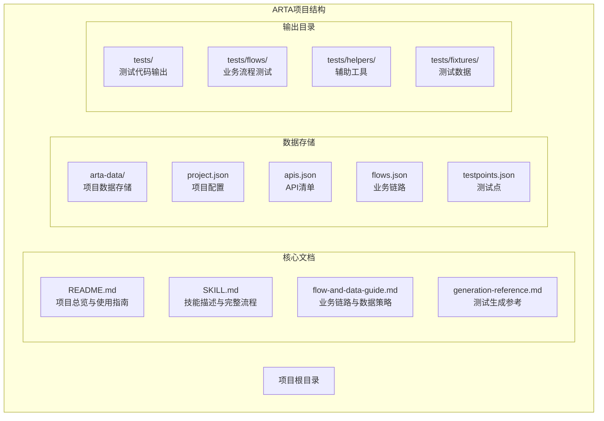
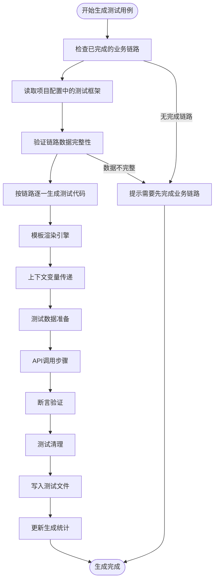
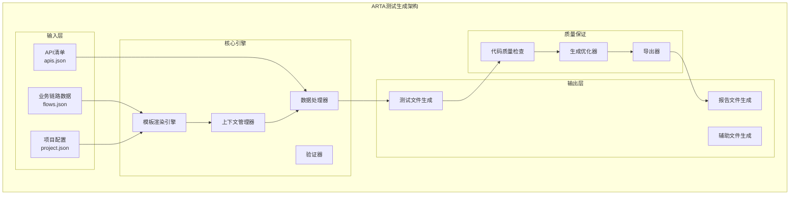
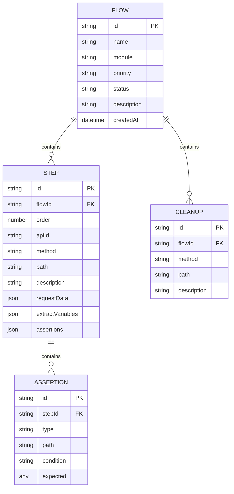
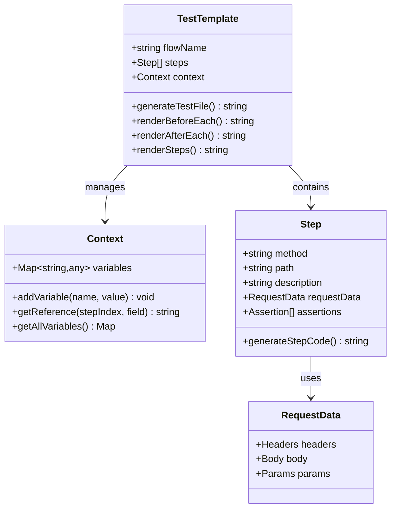
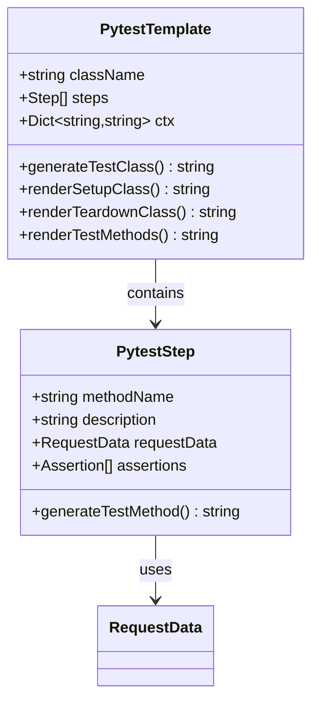
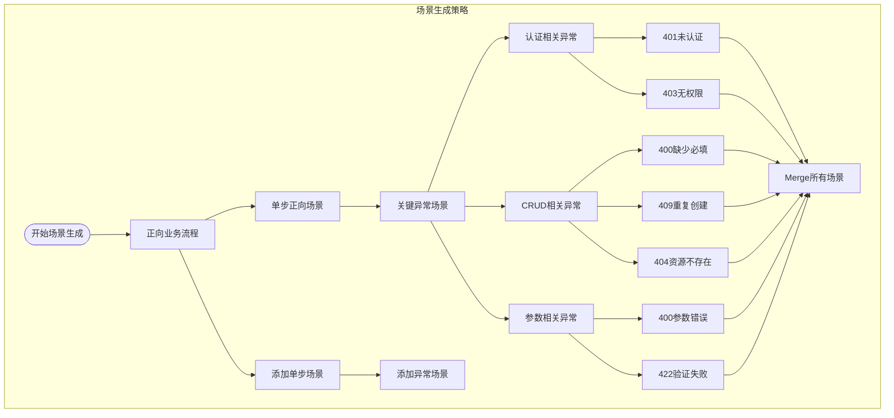
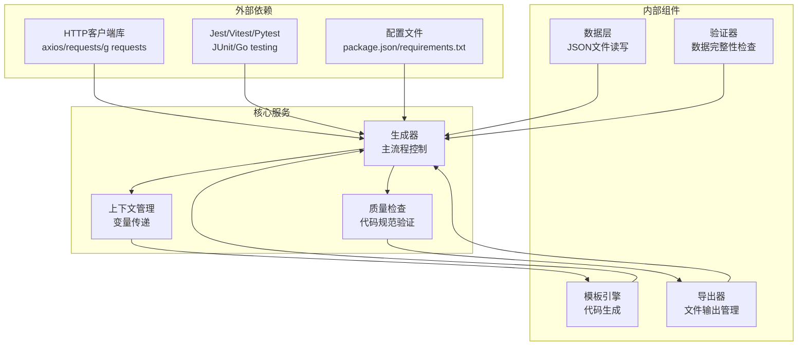
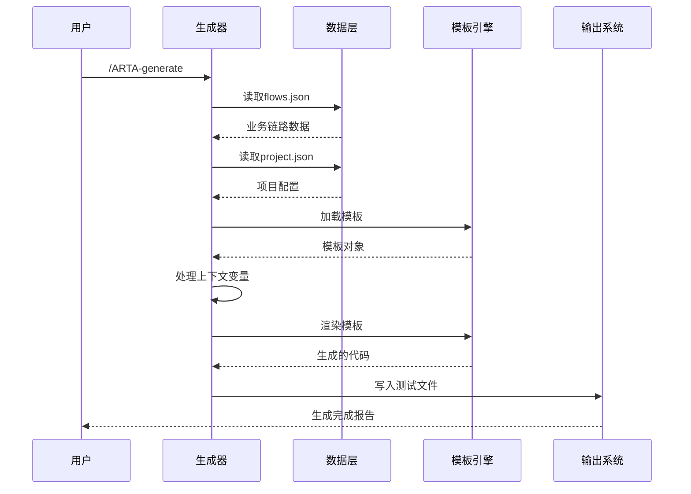
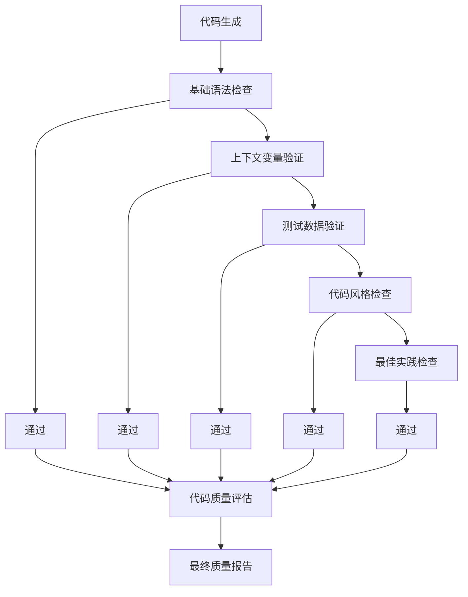

# ARTA Phase 4: 测试用例生成技术文档

<cite>
**本文档中引用的文件**
- [README.md](file://README.md)
- [SKILL.md](file://SKILL.md)
- [flow-and-data-guide.md](file://flow-and-data-guide.md)
- [generation-reference.md](file://generation-reference.md)
</cite>

## 目录
1. [简介](#简介)
2. [项目结构](#项目结构)
3. [核心组件](#核心组件)
4. [架构概览](#架构概览)
5. [详细组件分析](#详细组件分析)
6. [依赖关系分析](#依赖关系分析)
7. [性能考虑](#性能考虑)
8. [故障排除指南](#故障排除指南)
9. [结论](#结论)

## 简介

ARTA（Automation Regression Test Assistant）是一个端到端的API自动化测试流程引导工具，专门设计用于帮助开发团队从项目接入到测试用例生成的完整测试工作流程。ARTA的第四阶段专注于基于业务链路自动生成多框架测试代码，支持Jest、Vitest、Pytest、JUnit和Go testing等主流测试框架，涵盖TypeScript、Python、Java、Go等多种编程语言。

ARTA的核心价值在于其智能化的测试用例生成能力，能够根据业务链路自动推导测试场景，生成高质量的测试代码，显著提升回归测试的效率和覆盖率。

## 项目结构

ARTA项目采用简洁而功能明确的文件组织结构，主要包含四个核心文档文件：

**图表来源**
- [README.md: 151-162:151-162](file://README.md#L151-L162)
- [SKILL.md: 419-431:419-431](file://SKILL.md#L419-L431)

**章节来源**
- [README.md: 1-176:1-176](file://README.md#L1-L176)
- [SKILL.md: 419-431:419-431](file://SKILL.md#L419-L431)

## 核心组件

### 支持的技术栈矩阵

ARTA实现了全面的多框架支持，为不同技术栈的项目提供相应的测试生成能力：

| 后端框架 | 测试框架 | 语言 | 文件命名规范 |
|---------|---------|------|-------------|
| Express, NestJS | Jest, Vitest, Mocha | TypeScript | `{flow_name}.test.ts` |
| Flask, Django, FastAPI | Pytest | Python | `test_{flow_name}.py` |
| Spring Boot | JUnit 5 | Java | `{FlowName}Test.java` |
| Gin, Echo | Go testing | Go | `{flow_name}_test.go` |

### 测试生成流程

ARTA的测试生成流程遵循严格的步骤化设计，确保生成的测试代码质量和一致性：

**图表来源**
- [SKILL.md: 297-377:297-377](file://SKILL.md#L297-L377)

**章节来源**
- [SKILL.md: 297-377:297-377](file://SKILL.md#L297-L377)
- [README.md: 22-29:22-29](file://README.md#L22-L29)

## 架构概览

ARTA的测试生成架构采用模块化设计，各个组件职责清晰，耦合度低，便于维护和扩展：

**图表来源**
- [SKILL.md: 297-377:297-377](file://SKILL.md#L297-L377)
- [generation-reference.md: 218-286:218-286](file://generation-reference.md#L218-L286)

## 详细组件分析

### 业务链路数据模型

ARTA的业务链路数据模型是测试生成的核心基础，定义了完整的测试场景结构：

**图表来源**
- [flow-and-data-guide.md: 7-75:7-75](file://flow-and-data-guide.md#L7-L75)

#### 测试数据策略

ARTA支持四种类型的测试数据，每种都有特定的语法和用途：

| 数据类型 | 语法 | 示例 | 用途 |
|---------|------|------|------|
| 固定值 | 直接写值 | `"testuser001"` | 已知的测试账号或配置 |
| 生成数据 | `{{函数()}}` | `{{uuid()}}`, `{{random_email()}}` | 动态生成唯一测试数据 |
| 引用上游 | `${步骤.字段}` | `${login.response.token}` | 跨步骤数据传递 |
| 环境变量 | `$ENV{变量}` | `$ENV{BASE_URL}` | 运行时环境配置 |

**章节来源**
- [flow-and-data-guide.md: 77-132:77-132](file://flow-and-data-guide.md#L77-L132)

### 测试框架模板系统

ARTA实现了统一的模板系统，支持多种测试框架的代码生成：

#### TypeScript/Jest/Vitest模板结构

**图表来源**
- [generation-reference.md: 7-62:7-62](file://generation-reference.md#L7-L62)

#### Python/Pytest模板结构

**图表来源**
- [generation-reference.md: 64-129:64-129](file://generation-reference.md#L64-L129)

**章节来源**
- [generation-reference.md: 5-216:5-216](file://generation-reference.md#L5-L216)

### 生成策略与场景覆盖

ARTA采用智能的场景生成策略，确保测试用例的完整性和有效性：

**图表来源**
- [generation-reference.md: 218-241:218-241](file://generation-reference.md#L218-L241)

**章节来源**
- [generation-reference.md: 218-241:218-241](file://generation-reference.md#L218-L241)

## 依赖关系分析

ARTA的测试生成系统具有清晰的依赖层次结构，各组件之间的耦合度控制良好：

**图表来源**
- [SKILL.md: 297-377:297-377](file://SKILL.md#L297-L377)
- [generation-reference.md: 242-254:242-254](file://generation-reference.md#L242-L254)

### 数据流分析

测试生成过程中的数据流向体现了清晰的单向依赖关系：

**图表来源**
- [SKILL.md: 297-377:297-377](file://SKILL.md#L297-L377)

**章节来源**
- [SKILL.md: 297-377:297-377](file://SKILL.md#L297-L377)

## 性能考虑

ARTA在设计时充分考虑了性能优化和资源利用效率：

### 生成性能优化策略

1. **增量生成**：只对状态为`done`的业务链路进行生成，避免重复计算
2. **缓存机制**：模板和配置信息在内存中缓存，减少I/O操作
3. **并发处理**：多个业务链路可以并行生成，充分利用多核CPU
4. **内存管理**：及时释放不再使用的中间变量，防止内存泄漏

### 代码质量检查

ARTA实现了多层次的代码质量检查机制：

**图表来源**
- [generation-reference.md: 256-286:256-286](file://generation-reference.md#L256-L286)

## 故障排除指南

### 常见问题及解决方案

#### 1. 生成失败问题

**问题症状**：
- 生成过程中出现异常中断
- 测试文件无法正常写入

**可能原因**：
- 业务链路数据格式不正确
- 模板文件缺失或损坏
- 文件权限不足

**解决步骤**：
1. 检查`arta-data/flows.json`文件格式
2. 验证模板文件完整性
3. 确认输出目录写入权限

#### 2. 测试数据引用错误

**问题症状**：
- 生成的测试代码中出现变量未定义错误
- 上下文变量传递失败

**可能原因**：
- 引用的上游步骤不存在
- 变量名拼写错误
- 数据路径不正确

**解决步骤**：
1. 检查步骤间的依赖关系
2. 验证变量名的一致性
3. 确认JSON路径的有效性

#### 3. 框架兼容性问题

**问题症状**：
- 生成的代码在特定框架中编译失败
- 断言语法不匹配

**解决步骤**：
1. 确认项目配置中的测试框架选择
2. 检查框架版本兼容性
3. 验证断言库的正确导入

**章节来源**
- [SKILL.md: 434-443:434-443](file://SKILL.md#L434-L443)

## 结论

ARTA Phase 4测试用例生成系统展现了现代自动化测试工具的优秀设计。通过精心设计的数据模型、灵活的模板系统和智能的生成策略，ARTA能够为不同技术栈的项目提供高质量的测试代码生成能力。

系统的主要优势包括：

1. **多框架支持**：统一的模板系统支持多种测试框架和编程语言
2. **智能化生成**：基于业务链路自动推导测试场景，确保覆盖率
3. **质量保证**：多层次的质量检查确保生成代码的可靠性
4. **易用性**：简洁的命令行接口和清晰的流程指导

未来的发展方向可以包括：
- 增加更多测试框架的支持
- 优化生成算法，提高代码质量
- 扩展测试场景的智能化程度
- 增强与其他测试工具的集成能力

ARTA为团队提供了从概念到实现的完整测试自动化解决方案，是现代软件开发中不可或缺的工具。