# 核心工作流程

<cite>
**本文引用的文件**
- [README.md](file://README.md)
- [SKILL.md](file://SKILL.md)
- [flow-and-data-guide.md](file://flow-and-data-guide.md)
- [generation-reference.md](file://generation-reference.md)
</cite>

## 目录
1. [简介](#简介)
2. [项目结构](#项目结构)
3. [核心组件](#核心组件)
4. [架构总览](#架构总览)
5. [详细组件分析](#详细组件分析)
6. [依赖分析](#依赖分析)
7. [性能考虑](#性能考虑)
8. [故障排查指南](#故障排查指南)
9. [结论](#结论)
10. [附录](#附录)

## 简介
ARTA（自动化回归测试助手）是一个端到端 API 自动化测试流程引导工具，提供从项目接入到测试用例生成的完整工作流。该工具采用四阶段工作流程：Phase 1 项目接入、Phase 2 API 扫描、Phase 3 业务链路记录、Phase 4 测试用例生成，并支持多语言多框架的测试代码生成与导出。

## 项目结构
该项目采用文档驱动的技能包结构，主要包含四个核心文档文件：

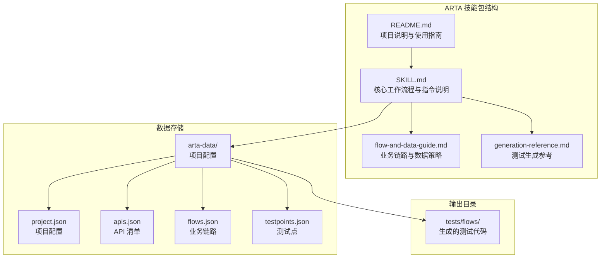

**图表来源**
- [README.md: 151-162:151-162](file://README.md#L151-L162)
- [SKILL.md: 419-431:419-431](file://SKILL.md#L419-L431)

**章节来源**
- [README.md: 1-176:1-176](file://README.md#L1-L176)
- [SKILL.md: 1-443:1-443](file://SKILL.md#L1-L443)

## 核心组件
ARTA 的核心组件围绕四阶段工作流程构建，每个阶段都有明确的任务目标和实现机制：

### 阶段间依赖关系
四阶段工作流程具有严格的依赖关系，前一阶段的输出是后一阶段的输入：

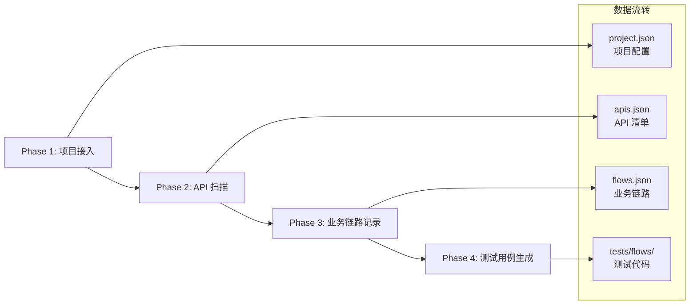

**图表来源**
- [README.md: 9-12:9-12](file://README.md#L9-L12)
- [SKILL.md: 12-16:12-16](file://SKILL.md#L12-L16)

### 数据存储架构
系统采用文件系统作为数据存储层，所有中间结果和最终产物都持久化到本地文件：

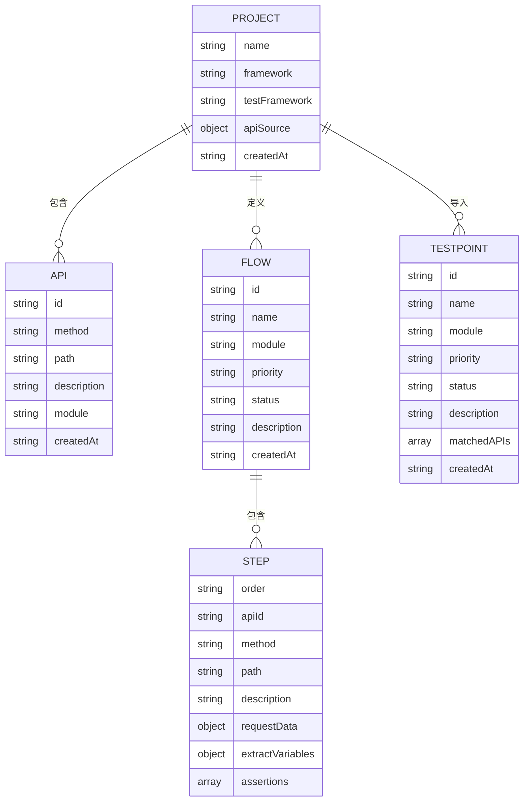

**图表来源**
- [flow-and-data-guide.md: 7-75:7-75](file://flow-and-data-guide.md#L7-L75)
- [SKILL.md: 419-431:419-431](file://SKILL.md#L419-L431)

**章节来源**
- [SKILL.md: 419-431:419-431](file://SKILL.md#L419-L431)
- [flow-and-data-guide.md: 1-218:1-218](file://flow-and-data-guide.md#L1-L218)

## 架构总览
ARTA 采用分层架构设计，每层职责清晰，数据流向明确：

```mermaid
graph TB
subgraph "用户交互层"
A[AI 助手]
B[自然语言指令]
C[/ARTA-* 指令]
end
subgraph "工作流管理层"
D[Phase 1: 项目接入]
E[Phase 2: API 扫描]
F[Phase 3: 业务链路记录]
G[Phase 4: 测试用例生成]
end
subgraph "数据持久层"
H[arta-data/]
I[project.json]
J[apis.json]
K[flows.json]
L[testpoints.json]
end
subgraph "输出层"
M[tests/flows/]
N[reports/]
end
A --> B
A --> C
B --> D
C --> D
D --> E
E --> F
F --> G
G --> M
G --> N
D --> H
E --> H
F --> H
G --> H
```

**图表来源**
- [README.md: 56-83:56-83](file://README.md#L56-L83)
- [SKILL.md: 34-297:34-297](file://SKILL.md#L34-L297)

## 详细组件分析

### Phase 1: 项目接入（/ARTA-start）
项目接入阶段负责初始化项目配置，建立工作基础。

#### 配置选项与收集流程
项目接入阶段收集的关键配置信息包括：

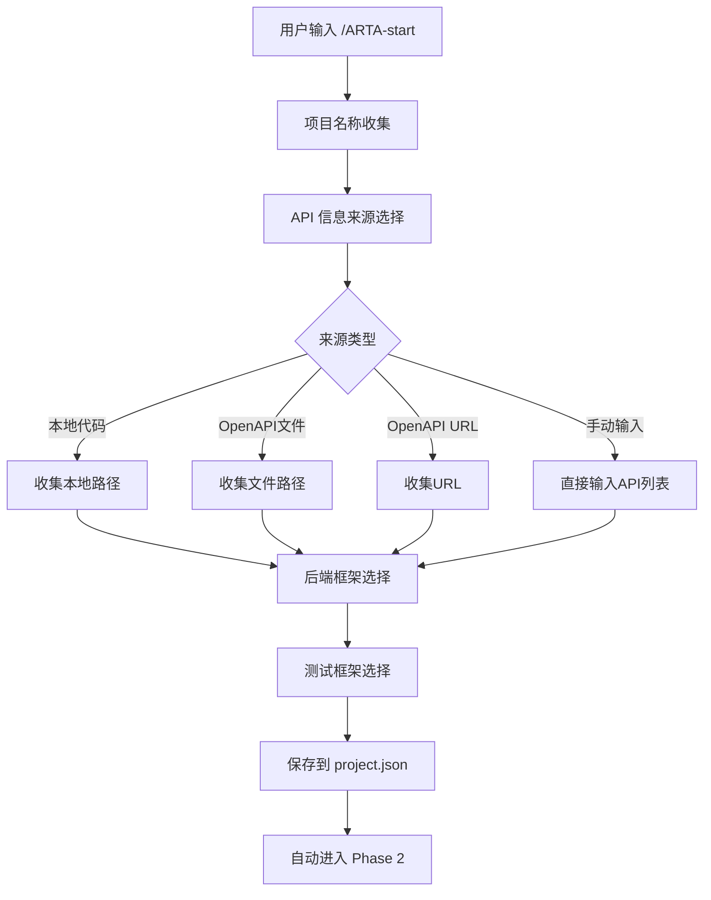

**图表来源**
- [SKILL.md: 34-78:34-78](file://SKILL.md#L34-L78)

#### 框架识别与项目初始化
系统支持多种后端框架的自动识别和初始化：

| 框架类型 | 关键标识 | 识别方式 |
|---------|----------|----------|
| Express | app.get/post/put/delete(), router.get/post() | 代码分析 |
| NestJS | @Get(), @Post(), @Controller() | 装饰器识别 |
| Flask | @app.route(), @blueprint.route() | 装饰器识别 |
| Django | urlpatterns, path(), re_path() | 路由定义 |
| FastAPI | @app.get(), @router.post() | 装饰器识别 |
| Spring Boot | @GetMapping, @PostMapping, @RequestMapping | 注解识别 |
| Gin | r.GET(), r.POST(), group.GET() | 路由方法 |
| Echo | e.GET(), e.POST(), g.GET() | 路由方法 |

**章节来源**
- [SKILL.md: 34-78:34-78](file://SKILL.md#L34-L78)
- [SKILL.md: 87-99:87-99](file://SKILL.md#L87-L99)

### Phase 2: API 扫描（/ARTA-scan）
API 扫描阶段负责从不同来源收集 API 信息，建立完整的 API 清单。

#### 多种扫描方式与策略
API 扫描支持四种不同的信息来源：

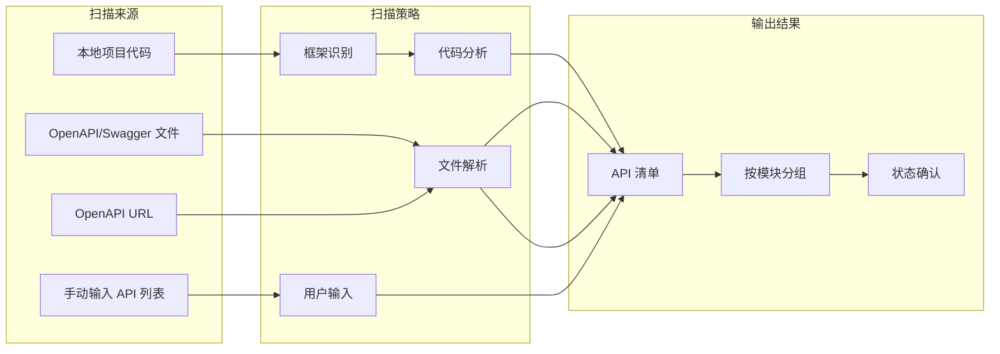

**图表来源**
- [SKILL.md: 81-140:81-140](file://SKILL.md#L81-L140)

#### 本地代码分析实现原理
本地代码分析采用多阶段扫描策略：

1. **框架识别**：通过检查项目根目录的依赖文件（package.json、requirements.txt、pom.xml、go.mod）确定后端框架类型
2. **源码扫描**：遍历源码目录，排除 node_modules、vendor、.git、dist、build 等目录
3. **路由匹配**：使用正则表达式匹配不同框架的路由定义
4. **数据提取**：提取 HTTP 方法、路径、处理函数名等关键信息
5. **模块分组**：按路径前缀自动分组为模块

**章节来源**
- [SKILL.md: 83-106:83-106](file://SKILL.md#L83-L106)

#### OpenAPI 解析机制
OpenAPI 解析支持 OpenAPI 3.0/3.1 和 Swagger 2.0 格式：

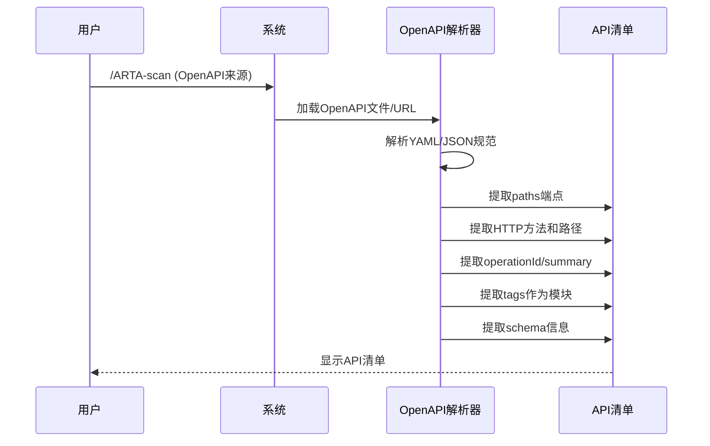

**图表来源**
- [SKILL.md: 107-117:107-117](file://SKILL.md#L107-L117)

**章节来源**
- [SKILL.md: 107-139:107-139](file://SKILL.md#L107-L139)

### Phase 3: 业务链路记录（/ARTA-flow）
业务链路记录阶段将 API 清单转化为可执行的测试场景。

#### 数据结构设计
业务链路采用层次化的数据结构设计：

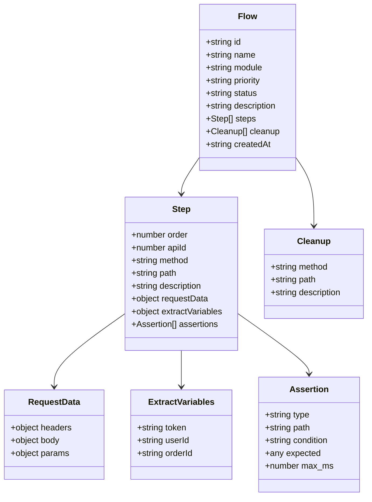

**图表来源**
- [flow-and-data-guide.md: 7-75:7-75](file://flow-and-data-guide.md#L7-L75)

#### 测试数据策略
系统支持四种测试数据类型，满足不同场景需求：

```mermaid
flowchart TD
A[测试数据策略] --> B[固定值]
A --> C[生成数据 {{函数()}}]
A --> D[引用上游 ${步骤.字段}]
A --> E[环境变量 $ENV{变量}]
B --> B1[直接写值]
C --> C1[uuid()]
C --> C2[random_email()]
C --> C3[increment(prefix)]
C --> C4[faker(type)]
D --> D1[步骤变量引用]
D --> D2[响应体路径引用]
E --> E1[运行时环境变量]
```

**图表来源**
- [flow-and-data-guide.md: 77-132:77-132](file://flow-and-data-guide.md#L77-L132)

#### 断言规则与验证机制
断言系统支持多种验证类型，确保测试的全面性：

| 断言类型 | 用途 | 示例场景 |
|---------|------|----------|
| status | HTTP状态码验证 | 200成功、404不存在、401未认证 |
| jsonpath + exists | 字段存在性验证 | token存在、orderId存在 |
| jsonpath + equals | 值相等验证 | status等于pending |
| jsonpath + contains | 字符串包含 | message包含success |
| jsonpath + type | 类型检查 | data为数组 |
| response_time | 响应时间验证 | < 1000ms |
| header | 响应头验证 | Content-Type包含application/json |

**章节来源**
- [flow-and-data-guide.md: 133-145:133-145](file://flow-and-data-guide.md#L133-L145)

#### 优先级排序机制
业务链路按照业务重要性进行优先级排序：

| 优先级 | 说明 | 示例场景 |
|--------|------|----------|
| P0 | 核心业务，影响收入 | 登录、下单、支付 |
| P1 | 重要功能，影响用户体验 | 搜索、评论、收藏 |
| P2 | 一般功能，可降级 | 个人设置、通知偏好 |
| P3 | 边缘功能 | 帮助页、反馈表单 |

**章节来源**
- [flow-and-data-guide.md: 200-210:200-210](file://flow-and-data-guide.md#L200-L210)

### Phase 4: 测试用例生成（/ARTA-generate）
测试用例生成阶段将业务链路转化为多框架的测试代码。

#### 多框架代码生成策略
系统支持五种主流测试框架的代码生成：

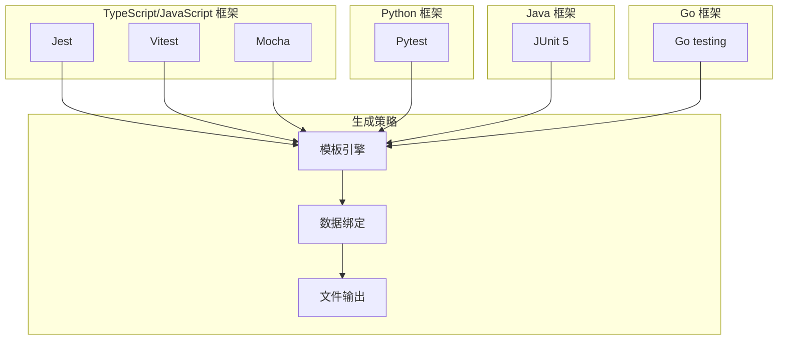

**图表来源**
- [SKILL.md: 297-377:297-377](file://SKILL.md#L297-L377)

#### 代码模板与实现模式
每种测试框架都有对应的代码模板，包含标准的测试生命周期管理：

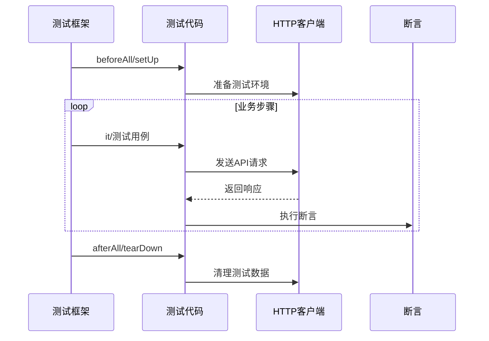

**图表来源**
- [generation-reference.md: 5-216:5-216](file://generation-reference.md#L5-L216)

#### 异常场景覆盖策略
系统自动为每个链路生成多种测试场景：

| 场景类型 | 说明 | 数量计算 |
|----------|------|----------|
| 正向流程 | 完整业务链路端到端 | 1 |
| 单步正向 | 每个 API 单独的成功场景 | N (API数量) |
| 关键异常 | 认证失败、资源不存在、参数错误 | 2-4 |

**章节来源**
- [generation-reference.md: 218-241:218-241](file://generation-reference.md#L218-L241)

## 依赖分析
ARTA 的依赖关系呈现明显的层次化特征，各阶段之间存在严格的依赖约束。

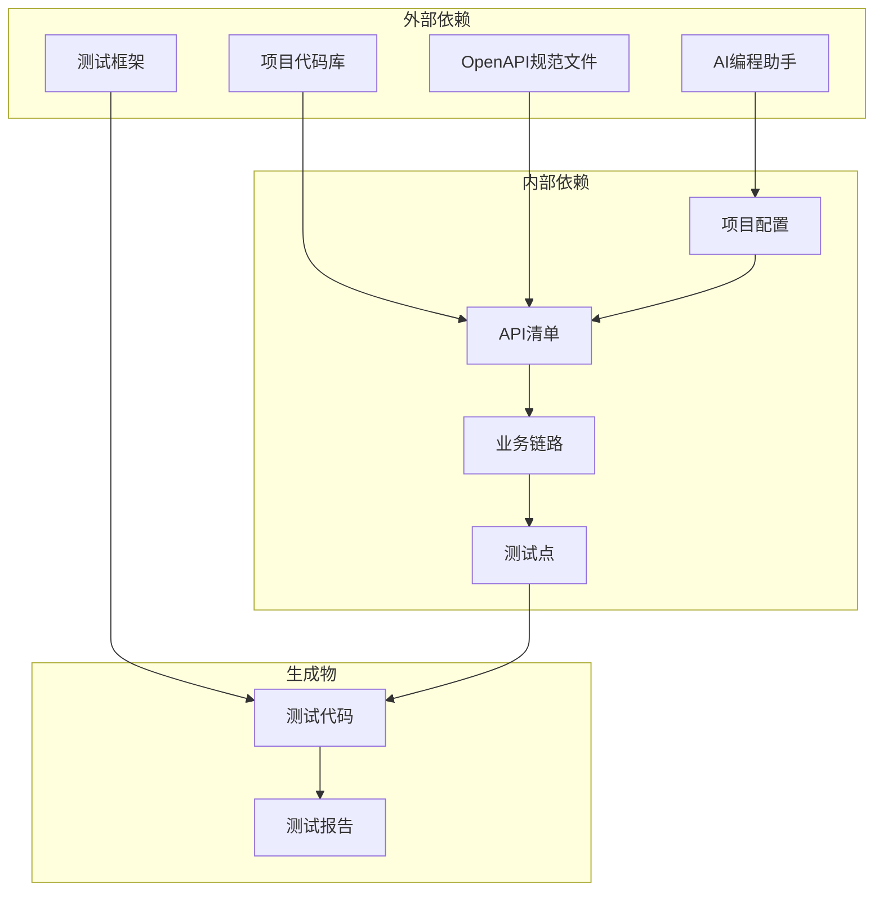

**图表来源**
- [README.md: 22-30:22-30](file://README.md#L22-L30)
- [SKILL.md: 419-431:419-431](file://SKILL.md#L419-L431)

### 数据依赖关系
各阶段之间的数据依赖关系如下：

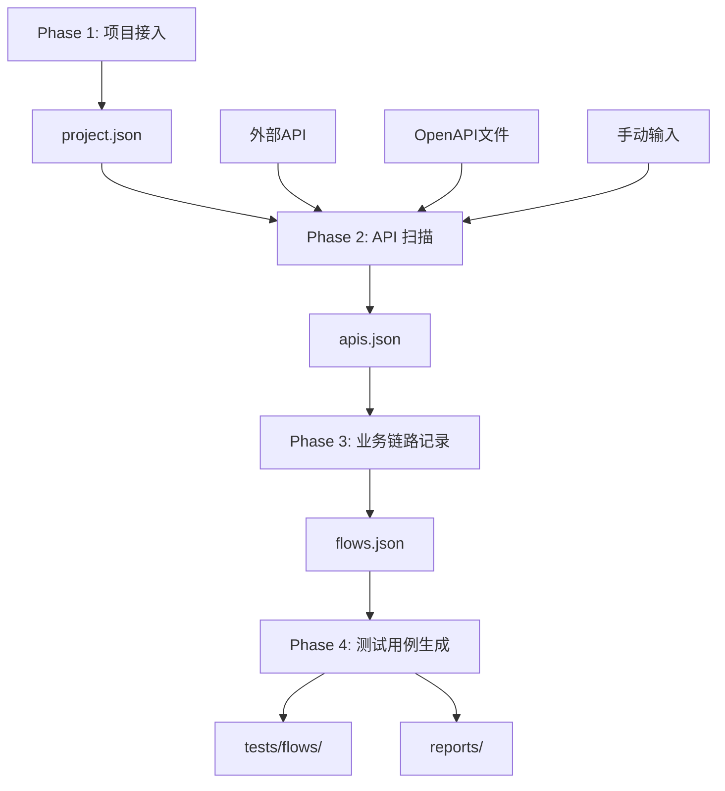

**图表来源**
- [README.md: 151-162:151-162](file://README.md#L151-L162)
- [SKILL.md: 419-431:419-431](file://SKILL.md#L419-L431)

**章节来源**
- [README.md: 151-162:151-162](file://README.md#L151-L162)
- [SKILL.md: 419-431:419-431](file://SKILL.md#L419-L431)

## 性能考虑
ARTA 在设计时充分考虑了性能优化和用户体验：

### 扫描性能优化
- **增量扫描**：支持增量 API 扫描，避免全量重新分析
- **缓存机制**：利用项目配置和 API 清单的缓存减少重复计算
- **并发处理**：多框架识别采用并行处理提高效率

### 生成性能优化
- **模板复用**：统一的模板引擎减少代码生成开销
- **批量生成**：支持批量生成多个链路的测试代码
- **增量更新**：只重新生成变更过的链路

### 存储性能优化
- **文件系统缓存**：利用本地文件系统缓存提升读写性能
- **数据压缩**：JSON 数据采用紧凑格式存储
- **索引优化**：API 清单按模块和方法建立索引

## 故障排查指南

### 常见问题与解决方案

#### Phase 1 项目接入问题
- **问题**：无法识别项目框架
  - **原因**：缺少依赖文件或项目结构不符合标准
  - **解决**：手动选择框架类型或检查项目结构

- **问题**：本地代码扫描失败
  - **原因**：项目路径不正确或权限不足
  - **解决**：确认路径存在且有读取权限

#### Phase 2 API 扫描问题
- **问题**：OpenAPI 解析错误
  - **原因**：文件格式不正确或网络连接问题
  - **解决**：检查文件格式和网络连通性

- **问题**：API 清单不完整
  - **原因**：扫描范围限制或代码注释缺失
  - **解决**：调整扫描参数或补充代码注释

#### Phase 3 业务链路问题
- **问题**：测试数据引用错误
  - **原因**：步骤顺序错误或变量名拼写错误
  - **解决**：检查步骤顺序和变量引用语法

- **问题**：断言规则配置不当
  - **原因**：断言类型选择错误或条件设置不当
  - **解决**：参考断言类型表重新配置

#### Phase 4 生成问题
- **问题**：测试代码生成失败
  - **原因**：模板文件损坏或权限不足
  - **解决**：检查模板文件完整性并确保有写入权限

**章节来源**
- [SKILL.md: 434-443:434-443](file://SKILL.md#L434-L443)

## 结论
ARTA 的四阶段工作流程设计合理，实现了从项目接入到测试用例生成的完整自动化流程。系统通过清晰的阶段划分、灵活的配置选项、完善的错误处理机制，为开发团队提供了高效的 API 自动化测试解决方案。

该工具的主要优势包括：
- **全流程自动化**：从项目接入到测试生成的一站式服务
- **多框架支持**：支持主流的后端和前端测试框架
- **智能化处理**：自动识别框架、推荐异常场景、提供清理建议
- **可扩展性**：模块化设计便于功能扩展和定制

## 附录

### 实际配置示例
以下是一些常见的配置场景示例：

#### 项目初始化配置
```json
{
  "name": "my-api-project",
  "framework": "Express",
  "testFramework": "jest",
  "apiSource": {
    "type": "local",
    "path": "/path/to/my-project"
  },
  "createdAt": "2026-03-11T12:00:00Z"
}
```

#### API 清单示例
```json
{
  "apis": [
    {
      "id": 1,
      "method": "POST",
      "path": "/api/auth/login",
      "description": "用户登录",
      "module": "认证"
    }
  ]
}
```

#### 业务链路配置示例
```json
{
  "flows": [
    {
      "id": "flow-001",
      "name": "用户下单流程",
      "module": "订单",
      "priority": "P0",
      "status": "done",
      "steps": [
        {
          "order": 1,
          "apiId": 1,
          "method": "POST",
          "path": "/api/auth/login",
          "description": "用户登录",
          "requestData": {
            "body": {
              "username": "testuser001",
              "password": "Test@123456"
            }
          }
        }
      ]
    }
  ]
}
```

### 最佳实践建议
1. **阶段顺序**：严格按照 Phase 1 → Phase 2 → Phase 3 → Phase 4 的顺序执行
2. **数据质量**：确保 API 清单的准确性，定期更新业务链路
3. **测试覆盖**：优先保证 P0 和 P1 级别的业务链路完整
4. **异常场景**：为关键 API 配置完整的异常场景测试
5. **清理策略**：为包含写入操作的链路添加自动清理步骤