# 代码模板参考

<cite>
**本文档引用的文件**
- [README.md](file://README.md)
- [SKILL.md](file://SKILL.md)
- [flow-and-data-guide.md](file://flow-and-data-guide.md)
- [generation-reference.md](file://generation-reference.md)
</cite>

## 目录
1. [简介](#简介)
2. [项目结构](#项目结构)
3. [核心组件](#核心组件)
4. [架构概览](#架构概览)
5. [详细组件分析](#详细组件分析)
6. [依赖关系分析](#依赖关系分析)
7. [性能考虑](#性能考虑)
8. [故障排除指南](#故障排除指南)
9. [结论](#结论)
10. [附录](#附录)

## 简介

ARTA（Automation Regression Test Assistant）是一个端到端 API 自动化测试流程引导工具，专为开发团队设计，帮助从项目接入到测试用例生成的完整测试流程。该工具支持四种主流编程语言的代码模板：TypeScript/JavaScript、Python、Java、Go，以及多种测试框架。

ARTA的核心价值在于其智能化的测试工作流程，通过四个阶段的渐进式测试构建：项目接入、API扫描、业务链路记录和测试用例生成。这种设计使得测试团队能够以最小的学习成本快速建立完整的回归测试体系。

## 项目结构

该项目采用文档驱动的技能包结构，主要包含以下核心文件：

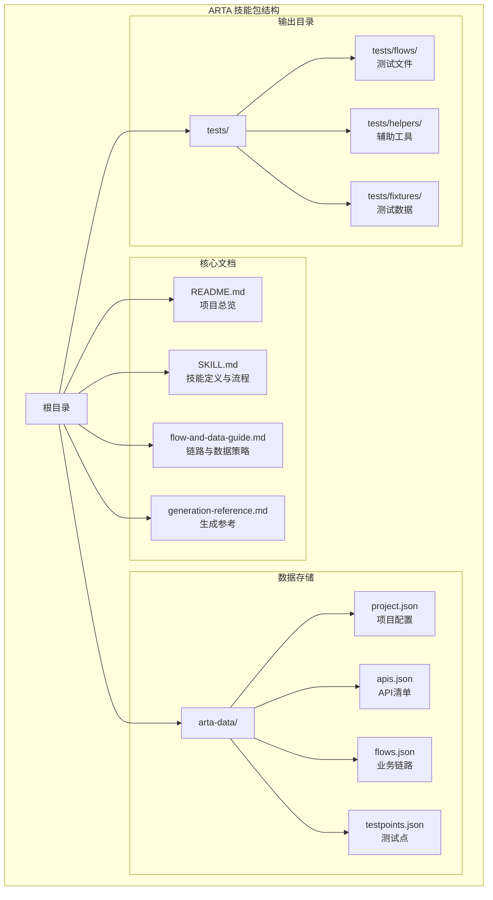

**图表来源**
- [README.md:151-162](file://README.md#L151-L162)
- [SKILL.md:419-431](file://SKILL.md#L419-L431)

**章节来源**
- [README.md:1-176](file://README.md#L1-L176)
- [SKILL.md:419-431](file://SKILL.md#L419-L431)

## 核心组件

### 四阶段测试工作流程

ARTA采用标准化的四阶段测试工作流程，确保测试构建的系统性和完整性：

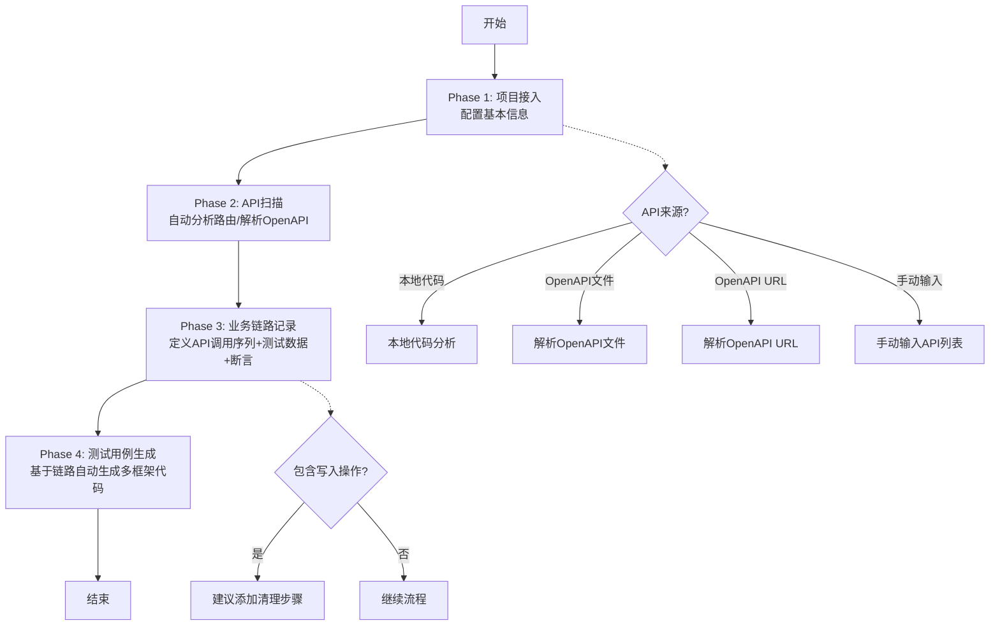

**图表来源**
- [SKILL.md:12-16](file://SKILL.md#L12-L16)
- [SKILL.md:34-78](file://SKILL.md#L34-L78)
- [SKILL.md:81-140](file://SKILL.md#L81-L140)
- [SKILL.md:143-258](file://SKILL.md#L143-L258)
- [SKILL.md:297-377](file://SKILL.md#L297-L377)

### 支持的技术栈矩阵

ARTA支持四种主流编程语言和相应的测试框架：

| 后端框架 | 测试框架 | 语言 | 文件扩展名 |
|---------|---------|------|-----------|
| Express, NestJS | Jest, Vitest, Mocha | TypeScript | `.test.ts`, `.spec.ts` |
| Flask, Django, FastAPI | Pytest | Python | `.py` |
| Spring Boot | JUnit 5 | Java | `Test.java` |
| Gin, Echo | Go testing | Go | `_test.go` |

**章节来源**
- [README.md:22-30](file://README.md#L22-L30)
- [SKILL.md:312-321](file://SKILL.md#L312-L321)

## 架构概览

### 整体系统架构

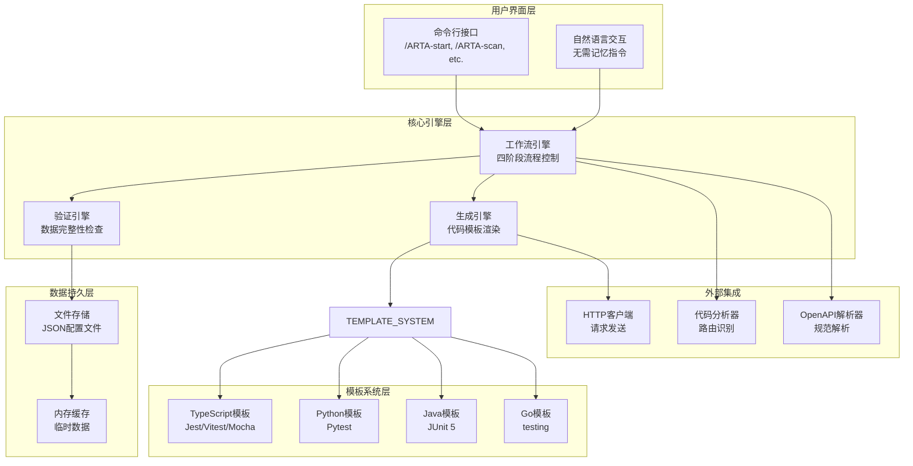

**图表来源**
- [SKILL.md:10-16](file://SKILL.md#L10-L16)
- [SKILL.md:297-377](file://SKILL.md#L297-L377)
- [generation-reference.md:5-217](file://generation-reference.md#L5-L217)

### 数据流架构

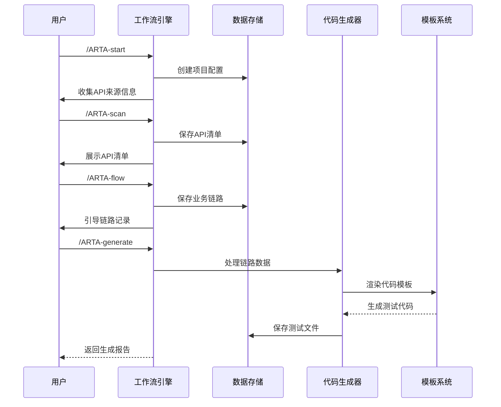

**图表来源**
- [SKILL.md:34-78](file://SKILL.md#L34-L78)
- [SKILL.md:81-140](file://SKILL.md#L81-L140)
- [SKILL.md:143-258](file://SKILL.md#L143-L258)
- [SKILL.md:297-377](file://SKILL.md#L297-L377)

## 详细组件分析

### TypeScript/JavaScript 代码模板

#### 设计模式与最佳实践

TypeScript模板采用了经典的测试金字塔设计模式，结合现代异步测试的最佳实践：

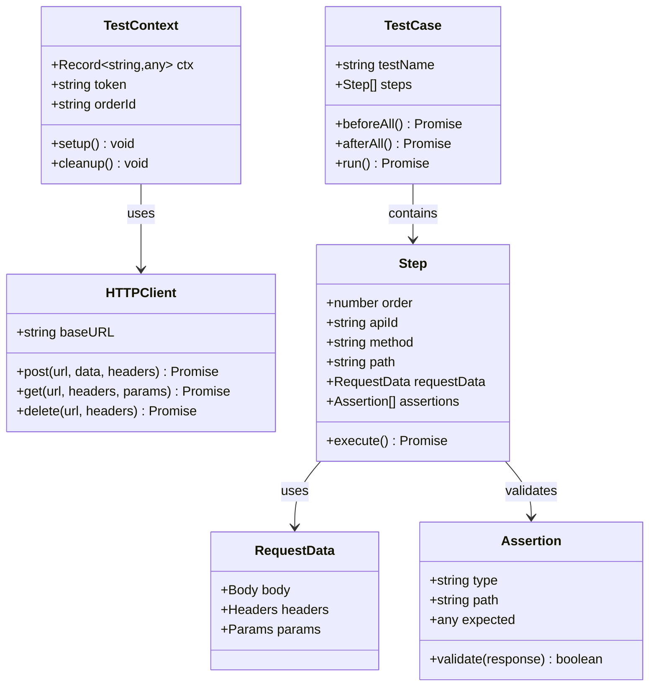

**图表来源**
- [generation-reference.md:7-62](file://generation-reference.md#L7-L62)
- [flow-and-data-guide.md:7-75](file://flow-and-data-guide.md#L7-L75)

#### 上下文管理机制

TypeScript模板实现了优雅的上下文管理，支持跨步骤的数据传递和状态保持：

**上下文变量声明**：
- 使用 `let token: string` 声明上下文变量
- 使用 `const ctx: Record<string, any> = {}` 创建通用上下文对象
- 支持强类型和弱类型两种上下文管理模式

**生命周期管理**：
- `beforeAll()`：测试环境初始化
- `afterAll()`：测试数据清理
- `beforeEach()` / `afterEach()`：单个测试用例的前后处理

#### 数据传递与状态保持

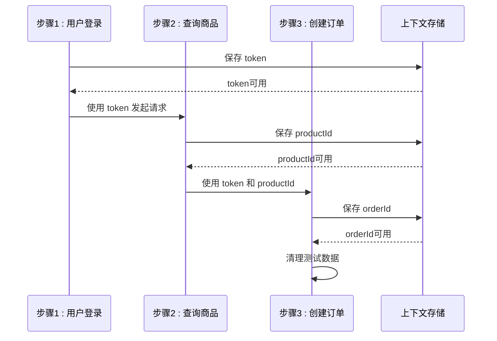

**图表来源**
- [generation-reference.md:16-61](file://generation-reference.md#L16-L61)
- [flow-and-data-guide.md:30-70](file://flow-and-data-guide.md#L30-L70)

#### 断言写法与错误处理

**断言类型**：
- 状态码断言：`expect(res.status).toBe(200)`
- JSONPath断言：`expect(res.data.data.token).toBeDefined()`
- 响应时间断言：`expect(res.responseTime).toBeLessThan(1000)`
- 响应头断言：`expect(res.headers['Content-Type']).toContain('application/json')`

**错误处理模式**：
- 使用 `try-catch` 包装异步操作
- 实现重试机制处理网络不稳定
- 提供详细的错误日志和堆栈跟踪

#### 清理逻辑设计

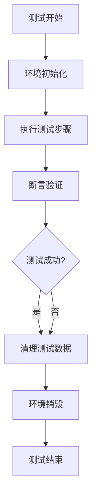

**图表来源**
- [generation-reference.md:19-26](file://generation-reference.md#L19-L26)
- [flow-and-data-guide.md:64-70](file://flow-and-data-guide.md#L64-L70)

**章节来源**
- [generation-reference.md:7-62](file://generation-reference.md#L7-L62)
- [flow-and-data-guide.md:7-75](file://flow-and-data-guide.md#L7-L75)

### Python 代码模板

#### 设计模式与最佳实践

Python模板遵循Pytest的约定优于配置原则，采用类级别的测试组织：

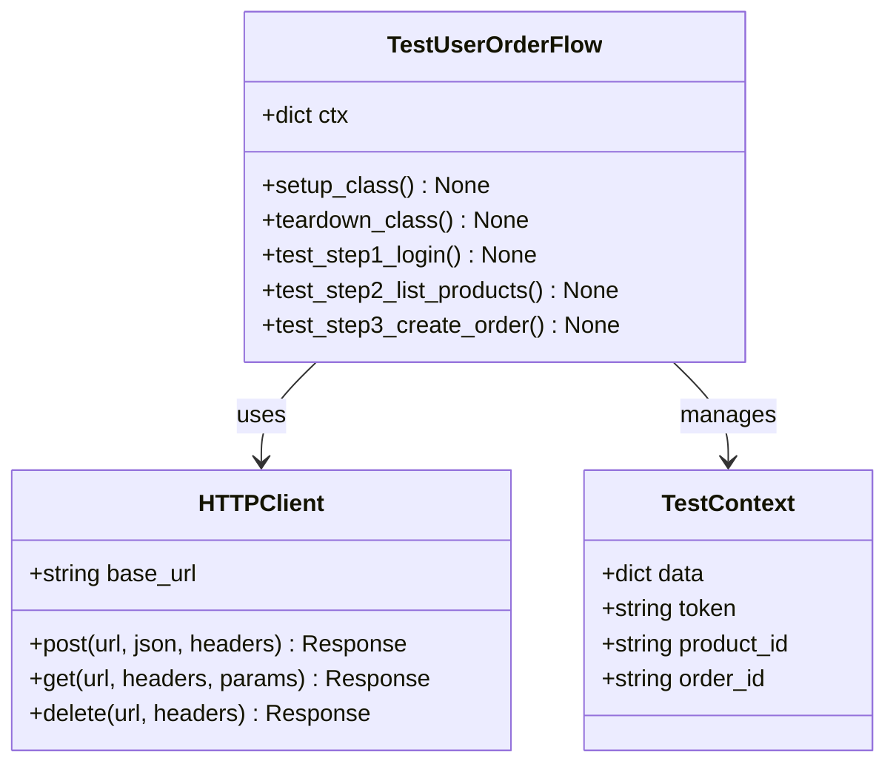

**图表来源**
- [generation-reference.md:64-129](file://generation-reference.md#L64-L129)

#### 断言写法与错误处理

**断言风格**：
- 使用 `assert` 关键字进行断言
- 结合 `pytest.raises()` 处理异常场景
- 使用 `pytest.mark.parametrize()` 参数化测试

**错误处理**：
- 使用 `pytest.raises(Exception)` 捕获预期异常
- 实现自定义断言函数提高代码复用性
- 支持测试数据的动态生成和管理

#### 清理逻辑实现

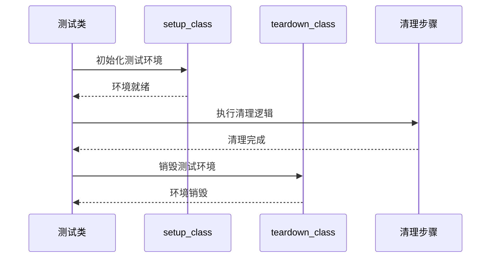

**图表来源**
- [generation-reference.md:78-91](file://generation-reference.md#L78-L91)

**章节来源**
- [generation-reference.md:64-129](file://generation-reference.md#L64-L129)

### Java 代码模板

#### 设计模式与最佳实践

Java模板采用JUnit 5的现代化测试框架，支持注解驱动的测试组织：

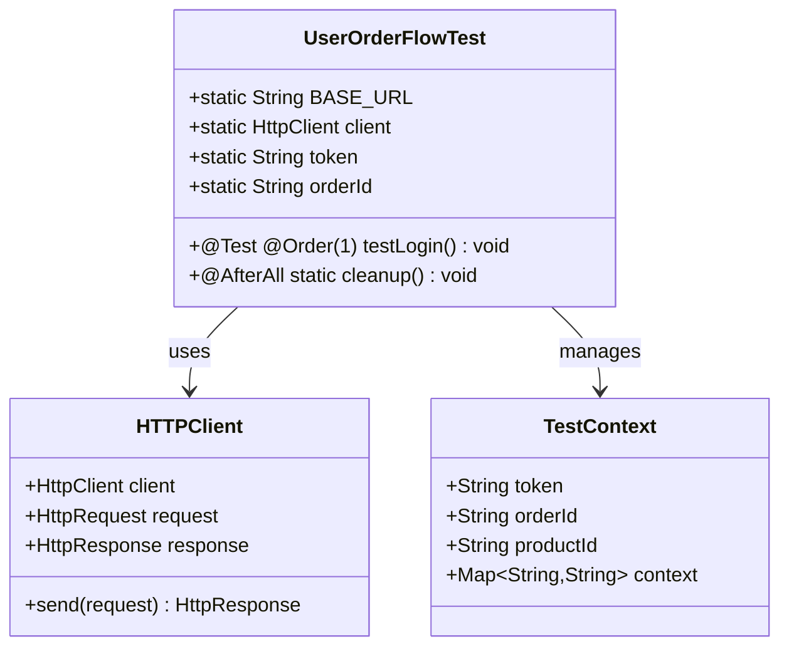

**图表来源**
- [generation-reference.md:131-168](file://generation-reference.md#L131-L168)

#### 断言写法与错误处理

**断言风格**：
- 使用 `assertEquals()` 进行数值比较
- 使用 `assertTrue()` / `assertFalse()` 进行布尔判断
- 使用 `assertNotNull()` / `assertNull()` 进行空值检查

**错误处理**：
- 使用 `@Test(expected = Exception.class)` 指定预期异常
- 实现自定义断言类处理复杂验证逻辑
- 支持异步测试场景的Future和CompletableFuture

#### 清理逻辑实现

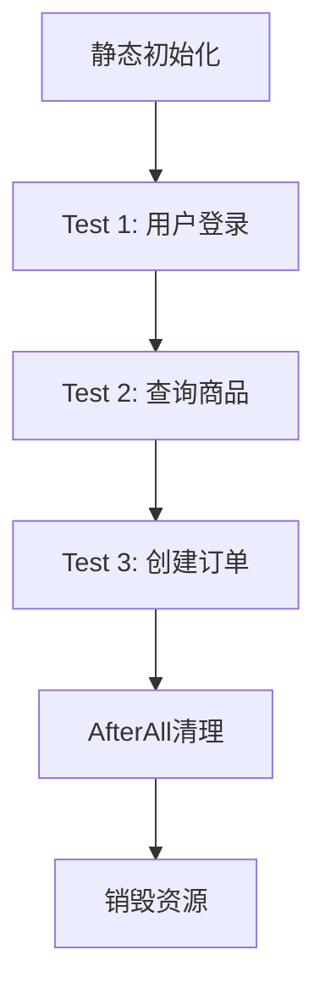

**图表来源**
- [generation-reference.md:163-166](file://generation-reference.md#L163-L166)

**章节来源**
- [generation-reference.md:131-168](file://generation-reference.md#L131-L168)

### Go 代码模板

#### 设计模式与最佳实践

Go模板采用标准库testing包，体现Go语言的简洁性和高效性：

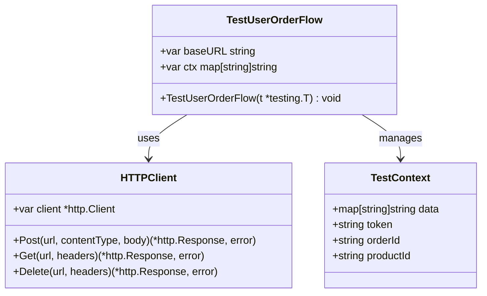

**图表来源**
- [generation-reference.md:170-216](file://generation-reference.md#L170-L216)

#### 断言写法与错误处理

**断言风格**：
- 使用 `t.Error()` / `t.Errorf()` 记录断言失败
- 使用 `t.Fatal()` / `t.Fatalf()` 终止测试执行
- 使用 `t.Run()` 组织子测试用例

**错误处理**：
- 使用 `if err != nil` 检查错误
- 实现自定义断言函数 `assertEqual()`
- 支持并发测试场景的同步机制

#### 清理逻辑实现

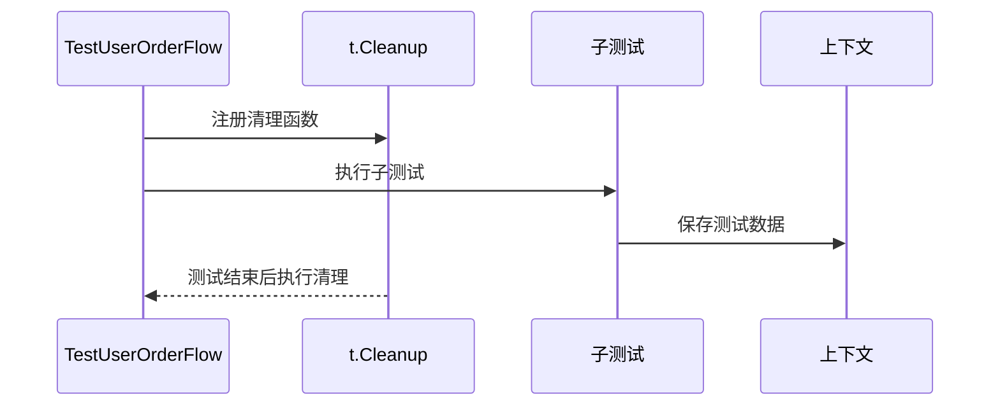

**图表来源**
- [generation-reference.md:194-196](file://generation-reference.md#L194-L196)

**章节来源**
- [generation-reference.md:170-216](file://generation-reference.md#L170-L216)

## 依赖关系分析

### 模板间依赖关系

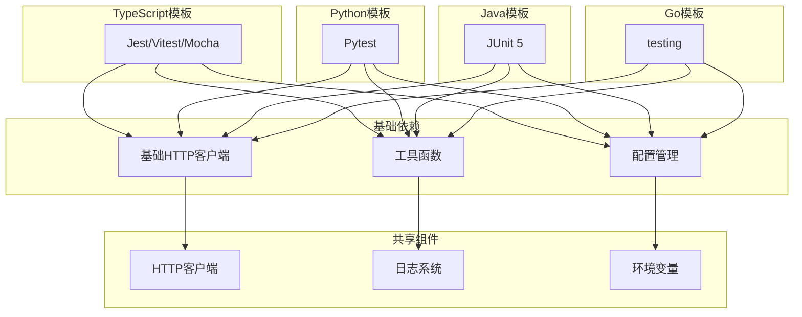

**图表来源**
- [generation-reference.md:5-217](file://generation-reference.md#L5-L217)

### 数据依赖关系

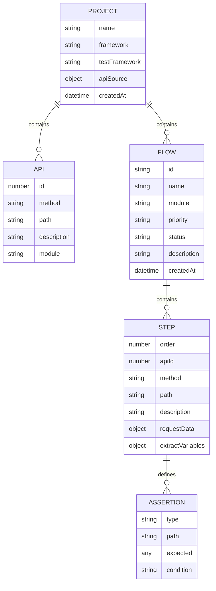

**图表来源**
- [flow-and-data-guide.md:7-75](file://flow-and-data-guide.md#L7-L75)

**章节来源**
- [flow-and-data-guide.md:7-75](file://flow-and-data-guide.md#L7-L75)

## 性能考虑

### 代码生成性能优化

ARTA在代码生成过程中采用了多项性能优化策略：

**模板渲染优化**：
- 使用预编译模板减少运行时开销
- 实现模板缓存机制避免重复编译
- 采用流式模板渲染处理大型测试文件

**数据处理优化**：
- 实现增量生成避免全量重建
- 使用内存映射文件处理大配置文件
- 采用并行处理加速多语言模板生成

**资源管理优化**：
- 实现连接池复用HTTP客户端
- 优化测试数据生成算法减少重复
- 使用懒加载机制延迟非必要组件初始化

### 测试执行性能

**并发测试支持**：
- 支持多线程/多进程测试执行
- 实现测试隔离确保并发安全
- 提供测试分片机制提升执行效率

**资源优化**：
- 实现测试数据共享减少内存占用
- 优化断言执行路径避免冗余检查
- 提供测试过滤机制跳过无关用例

## 故障排除指南

### 常见问题诊断

**项目初始化问题**：
- 检查项目配置文件格式正确性
- 验证API来源配置的有效性
- 确认测试框架兼容性

**API扫描失败**：
- 验证源代码目录访问权限
- 检查OpenAPI规范格式完整性
- 确认网络连接和URL可达性

**业务链路记录异常**：
- 检查API调用序列的逻辑正确性
- 验证测试数据引用的时效性
- 确认断言规则的适用性

**代码生成错误**：
- 验证模板语法的正确性
- 检查依赖包版本兼容性
- 确认输出目录写入权限

### 调试方法

**日志分析**：
- 启用详细日志模式追踪执行流程
- 分析错误堆栈定位问题根源
- 使用性能分析工具识别瓶颈

**配置验证**：
- 使用配置校验工具检查JSON格式
- 实现单元测试验证关键组件
- 提供配置模板简化部署过程

**环境隔离**：
- 使用容器化环境确保一致性
- 实现测试数据隔离避免污染
- 提供沙箱环境进行安全测试

**章节来源**
- [SKILL.md:434-443](file://SKILL.md#L434-L443)

## 结论

ARTA代码模板参考为多语言测试自动化提供了标准化的解决方案。通过深入分析四种语言的模板实现，我们可以看到ARTA在以下方面的卓越设计：

**统一的架构设计**：四种语言模板都遵循相同的测试金字塔模式，确保了跨语言的一致性和可维护性。

**灵活的配置机制**：支持多种测试框架和语言组合，满足不同技术栈的需求。

**完善的上下文管理**：优雅的跨步骤数据传递机制，简化了复杂的业务场景测试。

**强大的断言系统**：丰富的断言类型和错误处理机制，提高了测试的可靠性和可读性。

**高效的性能优化**：从模板渲染到测试执行的全方位性能优化，确保大规模测试场景的可行性。

ARTA不仅是一个工具，更是一个完整的测试自动化解决方案，为开发团队提供了从概念到实现的全流程支持。

## 附录

### 可配置选项与自定义参数

**项目配置参数**：
- 项目名称和描述
- 后端框架选择
- 测试框架配置
- API来源类型

**测试数据配置**：
- 固定值、生成数据、引用上游、环境变量
- 数据生成函数和规则
- 测试数据生命周期管理

**断言配置**：
- 断言类型和条件
- 预期值和阈值
- 断言执行顺序

### 扩展方法

**自定义模板**：
- 支持添加新的测试框架模板
- 允许修改现有模板结构
- 提供模板继承和组合机制

**插件系统**：
- 支持第三方插件扩展
- 提供钩子函数定制行为
- 实现插件间通信机制

**集成能力**：
- 支持CI/CD流水线集成
- 提供API接口供外部调用
- 实现与其他测试工具的互操作

### 最佳实践建议

**模板使用建议**：
- 根据项目特点选择合适的模板
- 遵循模板的设计模式和约定
- 定期更新模板以适应新技术

**测试策略建议**：
- 建立完整的测试金字塔
- 实施持续集成和持续测试
- 定期评估和优化测试覆盖率

**维护策略建议**：
- 建立模板版本管理和升级机制
- 实施代码审查和质量保证
- 提供完善的文档和技术支持