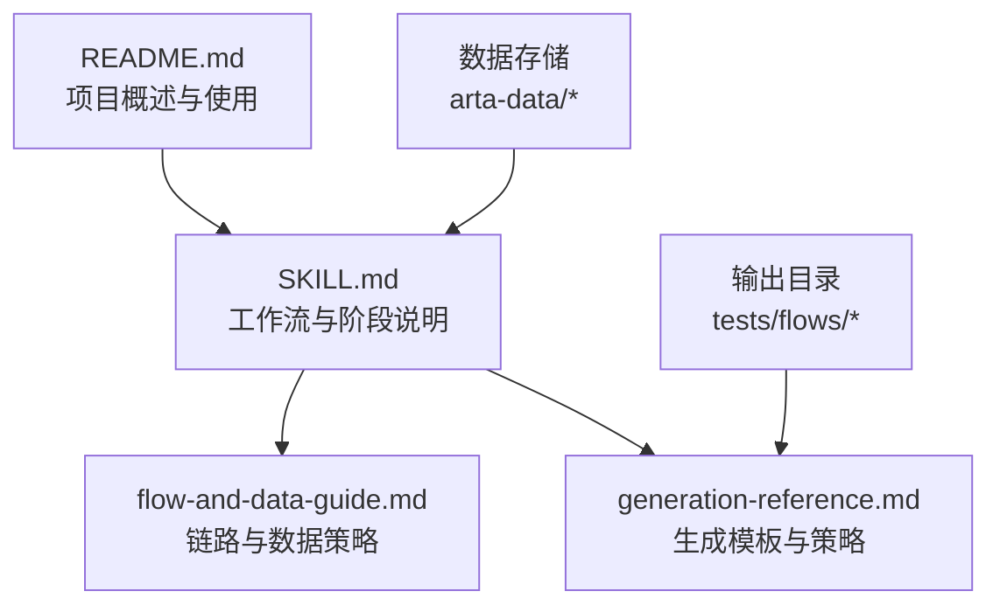
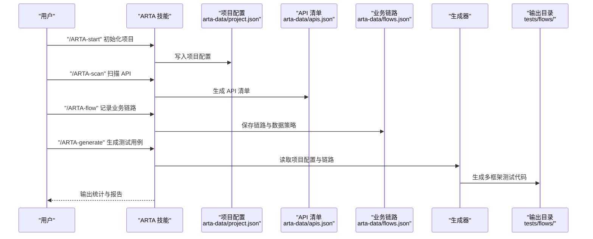
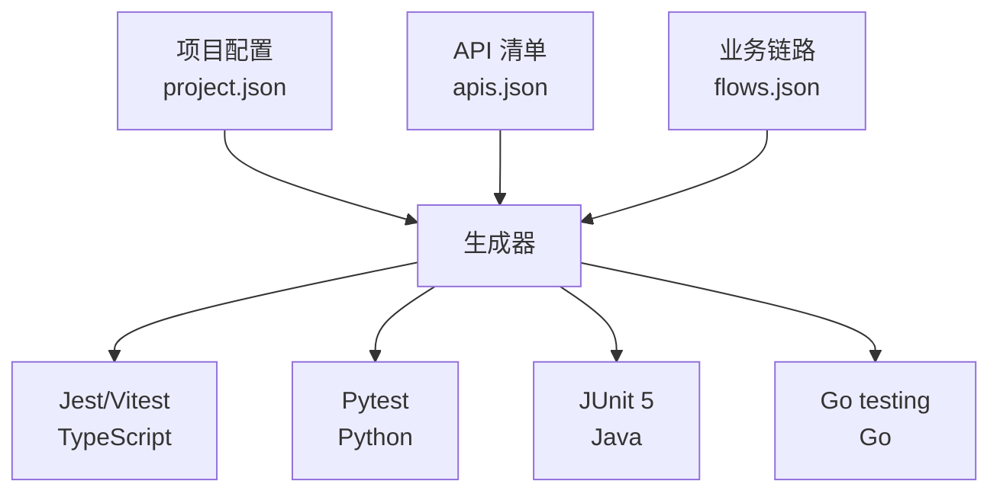

# 多框架支持

<cite>
**本文档引用的文件**
- [README.md](file://README.md)
- [SKILL.md](file://SKILL.md)
- [flow-and-data-guide.md](file://flow-and-data-guide.md)
- [generation-reference.md](file://generation-reference.md)
</cite>

## 目录
1. [简介](#简介)
2. [项目结构](#项目结构)
3. [核心组件](#核心组件)
4. [架构总览](#架构总览)
5. [详细组件分析](#详细组件分析)
6. [依赖关系分析](#依赖关系分析)
7. [性能考虑](#性能考虑)
8. [故障排查指南](#故障排查指南)
9. [结论](#结论)
10. [附录](#附录)

## 简介
本文件面向 ARTA 多框架支持模块的技术文档，系统阐述如何支持 Jest/Vitest、Pytest、JUnit 5、Go testing 等多种测试框架的代码生成与模板设计。文档从系统架构、组件关系、数据流、处理逻辑、集成点、错误处理与性能特征等方面进行深入分析，并结合仓库现有资料总结各框架的模板设计原理、依赖管理与配置差异，给出框架选择策略、版本兼容性与最佳实践建议，以及特性对比、性能考量与适用场景分析。同时提供框架特定的断言语法、测试生命周期管理与清理机制说明，展示框架间的技术差异与迁移注意事项，并给出框架扩展与自定义模板开发方法。

## 项目结构
该仓库采用“技能包”形式组织，包含四个核心文档：
- README.md：项目概述、功能描述、支持的技术栈、安装与使用方法、指令速查与数据存储位置
- SKILL.md：完整的端到端测试工作流（Phase 1-4），包括项目接入、API 扫描、业务链路记录、测试用例生成、状态查看与导出
- flow-and-data-guide.md：业务链路数据结构、测试数据策略（固定值、生成数据、引用上游、环境变量）、断言类型与 CRUD 接口处理策略
- generation-reference.md：各框架代码模板（Jest/Vitest、Pytest、JUnit 5、Go testing）、生成策略（场景覆盖、异常场景规则）、测试文件结构与测试报告格式

图表来源
- [README.md:1-176](file://README.md#L1-L176)
- [SKILL.md:1-443](file://SKILL.md#L1-L443)
- [flow-and-data-guide.md:1-218](file://flow-and-data-guide.md#L1-L218)
- [generation-reference.md:1-304](file://generation-reference.md#L1-L304)

章节来源
- [README.md:1-176](file://README.md#L1-L176)
- [SKILL.md:1-443](file://SKILL.md#L1-L443)

## 核心组件
- 项目接入（Phase 1）：收集项目名称、API 信息来源、后端框架、测试框架等基础配置，保存至 arta-data/project.json
- API 扫描（Phase 2）：支持本地代码分析与 OpenAPI/Swagger 解析，识别后端框架并提取 API 清单，保存至 arta-data/apis.json
- 业务链路记录（Phase 3）：定义 API 调用序列、测试数据策略、断言规则与清理步骤，保存至 arta-data/flows.json
- 测试用例生成（Phase 4）：基于链路生成多框架测试代码，输出至 tests/flows/，并生成统计报告
- 数据存储与导出：统一存储在 arta-data/，支持导出到指定目录

章节来源
- [SKILL.md:34-78](file://SKILL.md#L34-L78)
- [SKILL.md:81-140](file://SKILL.md#L81-L140)
- [SKILL.md:143-258](file://SKILL.md#L143-L258)
- [SKILL.md:297-377](file://SKILL.md#L297-L377)
- [README.md:151-162](file://README.md#L151-L162)

## 架构总览
ARTA 的多框架支持围绕“业务链路”驱动的代码生成展开。其核心流程如下：

图表来源
- [SKILL.md:34-78](file://SKILL.md#L34-L78)
- [SKILL.md:81-140](file://SKILL.md#L81-L140)
- [SKILL.md:143-258](file://SKILL.md#L143-L258)
- [SKILL.md:297-377](file://SKILL.md#L297-L377)
- [README.md:151-162](file://README.md#L151-L162)

## 详细组件分析

### 框架支持与模板设计原理
- 支持的测试框架与语言映射
  - Jest/Vitest（TypeScript）：文件命名规则为 `{flow_name}.test.ts`，使用 describe/it/beforeAll/afterAll 等组织测试；模板强调上下文变量传递与清理
  - Pytest（Python）：文件命名规则为 `test_{flow_name}.py`，使用类与方法组织测试，setup_class/teardown_class 生命周期管理
  - JUnit 5（Java）：文件命名规则为 `{FlowName}Test.java`，使用注解驱动的测试类与方法，@Test/@Order/@DisplayName 控制执行顺序与显示
  - Go testing（Go）：文件命名规则为 `{flow_name}_test.go`，使用 t.Run 组织子测试，t.Cleanup 进行清理

- 模板设计原则
  - 统一的业务链路驱动：模板围绕链路中的 API 序列生成测试步骤，每个步骤包含请求构造、断言验证与上下文变量提取
  - 生命周期管理：模板在 beforeAll/afterAll 或 setup_class/teardown_class 或 @AfterAll/t.Cleanup 中实现环境准备与清理
  - 断言策略：模板遵循链路断言配置，支持状态码、JSONPath、响应时间、响应头等断言类型
  - 数据传递：通过上下文变量在步骤间传递 token、ID 等数据，确保端到端链路连贯性

- 依赖管理与配置差异
  - TypeScript/Jest/Vitest：模板示例使用 axios 作为 HTTP 客户端，通过环境变量 BASE_URL 配置目标服务地址
  - Python/Pytest：模板示例使用 requests 作为 HTTP 客户端，同样通过环境变量 BASE_URL 配置
  - Java/JUnit 5：模板示例使用 java.net.http.HttpClient 发送请求，使用 Gson 解析 JSON
  - Go/Go testing：模板示例使用 net/http 发送请求，使用标准库进行 JSON 解析与环境变量读取

章节来源
- [README.md:22-30](file://README.md#L22-L30)
- [SKILL.md:312-321](file://SKILL.md#L312-L321)
- [generation-reference.md:7-62](file://generation-reference.md#L7-L62)
- [generation-reference.md:64-129](file://generation-reference.md#L64-L129)
- [generation-reference.md:131-168](file://generation-reference.md#L131-L168)
- [generation-reference.md:170-216](file://generation-reference.md#L170-L216)

### 测试数据策略与断言
- 测试数据类型
  - 固定值：直接指定常量，适用于已知的测试账号或配置
  - 生成数据：使用内置函数动态生成，如 uuid、timestamp、random_email、random_phone、increment、faker 等
  - 引用上游：通过 `${stepN.变量名}` 或 `${stepN.response.路径}` 引用前面步骤的变量或响应体字段
  - 环境变量：通过 `$ENV{变量}` 引用运行时环境变量，便于在不同环境切换

- 断言类型
  - 状态码：断言 HTTP 状态码
  - JSONPath：支持 exists、equals、contains、type、length_gte 等条件
  - 响应时间：断言响应时间上限
  - 响应头：断言响应头内容

- CRUD 接口处理策略
  - 创建：建议覆盖成功、缺少必填、格式错误、重复创建等场景；使用生成数据避免冲突，测试结束后清理
  - 更新：建议覆盖成功、资源不存在、无权限、部分更新等场景；前置条件为先创建资源
  - 删除：建议覆盖成功、不存在、无权限、级联删除等场景；通常放在最后执行，兼具清理作用
  - 查询：建议覆盖有数据、无数据、分页、筛选、无权限等场景；确保有测试数据后再验证

章节来源
- [flow-and-data-guide.md:77-145](file://flow-and-data-guide.md#L77-L145)
- [flow-and-data-guide.md:146-198](file://flow-and-data-guide.md#L146-L198)

### 生成策略与场景覆盖
- 场景覆盖
  - 正向流程：完整业务链路端到端测试
  - 单步正向：每个 API 单独的成功场景
  - 关键异常：根据 API 特征自动建议异常场景（如认证失败、资源不存在、参数错误等）

- 异常场景规则
  - 需要认证：401 未认证 / token 过期
  - POST 创建：400 缺少必填字段 / 409 重复创建
  - GET 带路径参数：404 资源不存在
  - PUT/PATCH 更新：403 无权限 / 404 不存在
  - DELETE 删除：403 无权限 / 404 不存在

- 测试文件结构
  - tests/flows/：业务流程测试（链路生成）
  - tests/helpers/：辅助工具（按需生成）
  - tests/fixtures/：测试数据（按需生成）

章节来源
- [generation-reference.md:218-254](file://generation-reference.md#L218-L254)
- [generation-reference.md:230-241](file://generation-reference.md#L230-L241)

### 测试报告与导出
- 生成报告内容
  - 项目、框架、生成时间
  - API 覆盖率统计（总计、已覆盖、未覆盖）
  - 测试用例统计（正向用例、异常用例、合计）
  - 文件清单与建议

- 导出结构
  - config/：项目配置、API 清单、业务链路
  - tests/flows/：测试用例文件
  - reports/summary.md：生成报告
  - README.md：导出说明

章节来源
- [generation-reference.md:256-286](file://generation-reference.md#L256-L286)
- [generation-reference.md:288-303](file://generation-reference.md#L288-L303)

### 框架特定实现要点

#### Jest/Vitest（TypeScript）
- 模板要点
  - 使用 describe/it/beforeAll/afterAll 组织测试
  - 通过环境变量 BASE_URL 配置基础地址
  - 使用 axios 发送请求，expect 断言
  - 在 afterAll 中清理创建的测试数据

- 生命周期与清理
  - beforeAll：环境准备（如初始化客户端）
  - afterAll：清理测试数据（如删除订单）

- 断言语法
  - expect(res.status).toBe(200)
  - expect(res.data.data.token).toBeDefined()

章节来源
- [generation-reference.md:7-62](file://generation-reference.md#L7-L62)

#### Pytest（Python）
- 模板要点
  - 使用类组织测试，setup_class/teardown_class 生命周期
  - 通过环境变量 BASE_URL 配置基础地址
  - 使用 requests 发送请求，assert 断言
  - 在 teardown_class 中清理测试数据

- 生命周期与清理
  - setup_class：环境准备
  - teardown_class：清理测试数据

- 断言语法
  - assert res.status_code == 200
  - assert "token" in data["data"]

章节来源
- [generation-reference.md:64-129](file://generation-reference.md#L64-L129)

#### JUnit 5（Java）
- 模板要点
  - 使用 @Test/@Order/@DisplayName 控制执行顺序与显示
  - 使用 java.net.http.HttpClient 发送请求
  - 使用 Gson 解析 JSON
  - 在 @AfterAll 中清理测试数据

- 生命周期与清理
  - @AfterAll：清理测试数据

- 断言语法
  - assertEquals(200, res.statusCode())
  - assert 消息断言

章节来源
- [generation-reference.md:131-168](file://generation-reference.md#L131-L168)

#### Go testing（Go）
- 模板要点
  - 使用 t.Run 组织子测试
  - 使用 t.Cleanup 进行清理
  - 使用 net/http 发送请求
  - 使用标准库进行 JSON 解析与环境变量读取

- 生命周期与清理
  - t.Cleanup：清理测试数据

- 断言语法
  - t.Fatalf("expected 200, got %d", resp.StatusCode)
  - t.Fatal(err)

章节来源
- [generation-reference.md:170-216](file://generation-reference.md#L170-L216)

### 框架选择策略、版本兼容性与最佳实践
- 框架选择策略
  - 后端技术栈匹配：Express/NestJS 对应 Jest/Vitest；Flask/Django/FastAPI 对应 Pytest；Spring Boot 对应 JUnit 5；Gin/Echo 对应 Go testing
  - 团队熟悉度：优先选择团队熟悉的框架，降低学习成本
  - 生态与工具链：考虑 IDE 支持、CI/CD 集成、覆盖率工具等生态因素

- 版本兼容性
  - TypeScript/Jest/Vitest：建议使用较新的 LTS 版本，确保断言与生命周期 API 稳定
  - Python/Pytest：建议使用稳定版本，注意 requests 与 pytest 的兼容性
  - Java/JUnit 5：建议使用较新版本，注意 java.net.http 的可用性与 Gson 版本
  - Go/Go testing：建议使用 Go 1.x 的稳定版本，注意 net/http 与标准库行为

- 最佳实践
  - 统一的环境变量管理：通过 BASE_URL 等环境变量隔离不同环境
  - 明确的生命周期管理：在 beforeAll/afterAll 或对应生命周期中进行环境准备与清理
  - 结构化的断言：使用 JSONPath、状态码、响应时间等多维度断言
  - 数据隔离：使用生成数据避免冲突，测试结束后清理

章节来源
- [README.md:22-30](file://README.md#L22-L30)
- [generation-reference.md:218-254](file://generation-reference.md#L218-L254)

### 性能考量与适用场景
- 性能考量
  - 并发与超时：合理设置请求超时与并发限制，避免阻塞
  - 资源清理：及时清理测试数据，避免资源泄漏
  - 断言粒度：适度的断言粒度，避免过度断言导致测试缓慢

- 适用场景
  - 端到端 API 测试：适合需要验证完整业务链路的场景
  - 单元与集成测试：适合验证具体模块或接口的行为
  - 回归测试：适合持续集成中的回归验证

章节来源
- [generation-reference.md:220-241](file://generation-reference.md#L220-L241)

### 框架间差异与迁移注意事项
- 差异对比
  - 语言与生态：TypeScript/JavaScript、Python、Java、Go 各具生态优势
  - 断言语法：expect vs assert vs assertEquals vs t.Fatal
  - 生命周期：beforeAll/afterAll vs setup_class/teardown_class vs @AfterAll vs t.Cleanup
  - 文件命名：.test.ts vs .py vs Test.java vs _test.go

- 迁移注意事项
  - 保持业务链路一致：迁移时保留相同的 API 序列与断言规则
  - 适配断言语法：根据目标框架调整断言风格
  - 生命周期适配：将 beforeAll/afterAll 等映射到目标框架的生命周期
  - 清理机制：确保在目标框架中实现等价的清理逻辑

章节来源
- [generation-reference.md:7-62](file://generation-reference.md#L7-L62)
- [generation-reference.md:64-129](file://generation-reference.md#L64-L129)
- [generation-reference.md:131-168](file://generation-reference.md#L131-L168)
- [generation-reference.md:170-216](file://generation-reference.md#L170-L216)

### 框架扩展指南与自定义模板开发
- 扩展步骤
  - 定义新框架的文件命名规则与输出目录
  - 设计生命周期与清理机制（beforeAll/afterAll、setup_class/teardown_class、@AfterAll、t.Cleanup）
  - 实现断言与请求发送逻辑（HTTP 客户端、断言语法）
  - 生成场景覆盖策略与异常场景建议

- 自定义模板开发
  - 以现有模板为蓝本，调整语言、断言与生命周期
  - 保持与业务链路的数据传递一致（上下文变量）
  - 确保清理逻辑与 CRUD 接口处理策略一致

章节来源
- [generation-reference.md:218-254](file://generation-reference.md#L218-L254)

## 依赖关系分析
- 组件耦合与内聚
  - 业务链路（flows.json）是生成器的核心输入，决定测试用例的结构与断言
  - 项目配置（project.json）决定目标测试框架与语言
  - API 清单（apis.json）为链路提供 API 信息

- 外部依赖与集成点
  - HTTP 客户端：axios（TypeScript）、requests（Python）、java.net.http（Java）、net/http（Go）
  - JSON 解析：Gson（Java）、标准库（Go/Python/TypeScript）
  - 断言库：expect（TypeScript）、assert（Python）、assertEquals（Java）、t.Fatal（Go）

图表来源
- [README.md:151-162](file://README.md#L151-L162)
- [SKILL.md:297-377](file://SKILL.md#L297-L377)
- [generation-reference.md:7-62](file://generation-reference.md#L7-L62)
- [generation-reference.md:64-129](file://generation-reference.md#L64-L129)
- [generation-reference.md:131-168](file://generation-reference.md#L131-L168)
- [generation-reference.md:170-216](file://generation-reference.md#L170-L216)

章节来源
- [README.md:151-162](file://README.md#L151-L162)
- [SKILL.md:297-377](file://SKILL.md#L297-L377)

## 性能考虑
- 并发与超时：合理设置请求超时与并发限制，避免阻塞
- 资源清理：及时清理测试数据，避免资源泄漏
- 断言粒度：适度的断言粒度，避免过度断言导致测试缓慢
- 环境变量：通过 BASE_URL 等环境变量隔离不同环境，减少网络延迟影响

## 故障排查指南
- 常见问题
  - API 未覆盖：检查链路是否完整，断言是否正确
  - 断言失败：核对断言类型与期望值，检查响应体结构
  - 清理失败：确认清理步骤是否在 afterAll/setup_class/@AfterAll/t.Cleanup 中执行
  - 环境变量缺失：检查 BASE_URL 等环境变量是否正确设置

- 调试建议
  - 打印关键变量与响应体，定位问题
  - 分步调试，逐步缩小问题范围
  - 对照模板，确保生命周期与断言一致

章节来源
- [flow-and-data-guide.md:133-145](file://flow-and-data-guide.md#L133-L145)
- [generation-reference.md:256-286](file://generation-reference.md#L256-L286)

## 结论
ARTA 的多框架支持模块通过统一的业务链路驱动，实现了对 Jest/Vitest、Pytest、JUnit 5、Go testing 的代码生成与模板设计。其核心在于清晰的生命周期管理、灵活的测试数据策略与断言体系，以及可扩展的生成策略。通过对各框架的模板原理、依赖管理与配置差异进行系统梳理，团队可以根据技术栈与团队能力选择合适的测试框架，并在保证质量的前提下提升测试效率与可维护性。

## 附录
- 指令速查
  - /ARTA-start：启动新项目，配置基本信息
  - /ARTA-scan：扫描项目代码或解析 OpenAPI，生成 API 清单
  - /ARTA-flow：添加/查看/编辑业务链路
  - /ARTA-testpoint：导入 mermaid 思维导图测试点
  - /ARTA-generate：基于链路生成测试用例代码
  - /ARTA-status：查看项目当前状态和进度
  - /ARTA-export：导出所有配置和测试文件

章节来源
- [README.md:72-83](file://README.md#L72-L83)
- [SKILL.md:18-29](file://SKILL.md#L18-L29)