# 文件结构管理

<cite>
**本文档引用的文件**
- [README.md](file://README.md)
- [SKILL.md](file://SKILL.md)
- [flow-and-data-guide.md](file://flow-and-data-guide.md)
- [generation-reference.md](file://generation-reference.md)
</cite>

## 目录
1. [简介](#简介)
2. [项目结构](#项目结构)
3. [核心组件](#核心组件)
4. [架构概览](#架构概览)
5. [详细组件分析](#详细组件分析)
6. [依赖关系分析](#依赖关系分析)
7. [性能考虑](#性能考虑)
8. [故障排除指南](#故障排除指南)
9. [结论](#结论)
10. [附录](#附录)

## 简介

ARTA（自动化回归测试助手）是一个端到端的API自动化测试流程引导工具，专门设计用于帮助开发团队从项目接入到测试用例生成的完整测试工作流程。该系统的核心优势在于其标准化的文件结构管理和自动化测试生成能力。

ARTA采用四阶段测试工作流程：项目接入 → API扫描 → 业务链路记录 → 测试用例生成。这种分阶段的方法确保了测试流程的可控性和可维护性，特别适合大型项目的持续集成和回归测试场景。

## 项目结构

ARTA项目采用模块化的文件结构设计，主要包含四个核心目录：

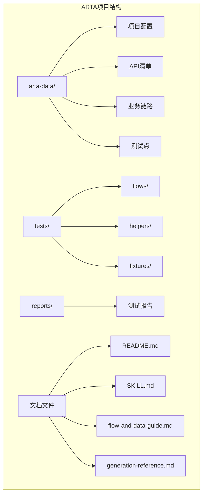

**图表来源**
- [README.md:153-162](file://README.md#L153-L162)
- [generation-reference.md:242-254](file://generation-reference.md#L242-L254)

### 数据存储结构

所有项目数据都存储在`arta-data/`目录下，采用JSON格式进行持久化存储：

| 文件 | 内容 | 用途 |
|------|------|------|
| `arta-data/project.json` | 项目基本信息、框架配置 | 项目元数据管理 |
| `arta-data/apis.json` | API清单、路由信息 | API发现和管理 |
| `arta-data/flows.json` | 业务链路定义、测试场景 | 测试流程编排 |
| `arta-data/testpoints.json` | 测试点导入数据 | 思维导图测试点处理 |

### 测试输出结构

生成的测试代码默认输出到`tests/flows/`目录，同时包含辅助工具和测试数据：

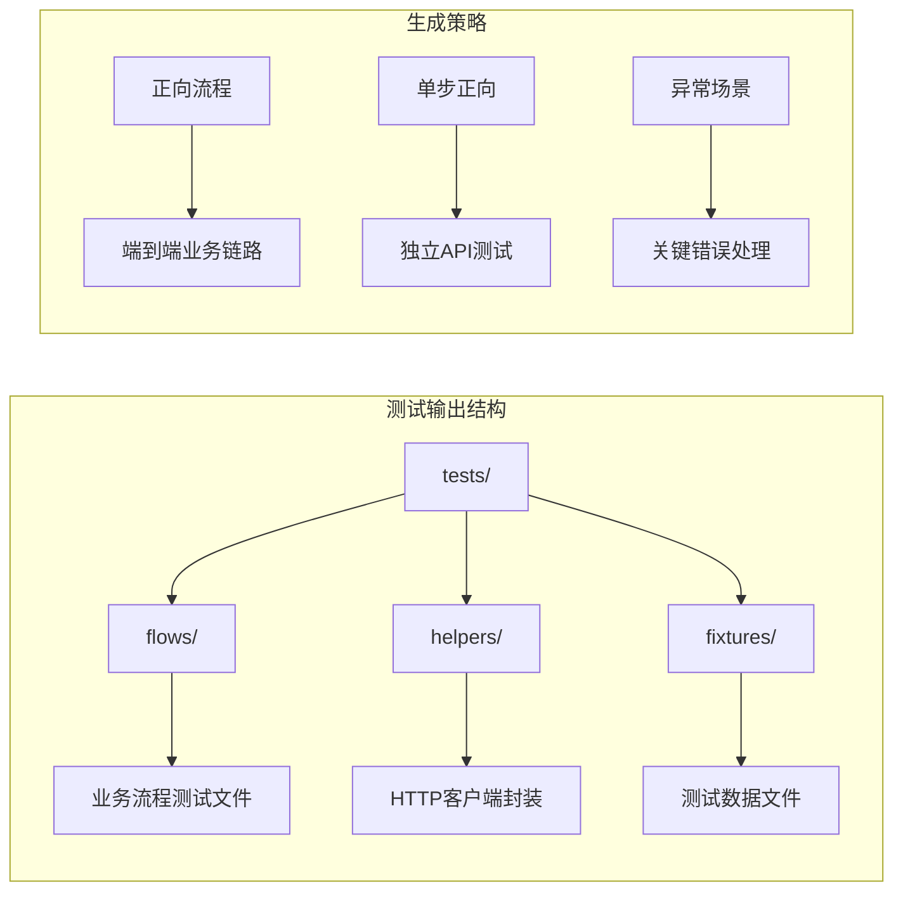

**图表来源**
- [generation-reference.md:242-254](file://generation-reference.md#L242-L254)
- [generation-reference.md:220-241](file://generation-reference.md#L220-L241)

**章节来源**
- [README.md:153-162](file://README.md#L153-L162)
- [generation-reference.md:242-254](file://generation-reference.md#L242-L254)

## 核心组件

### 1. 数据管理层

数据管理层负责项目数据的持久化和管理，采用标准化的JSON格式存储：

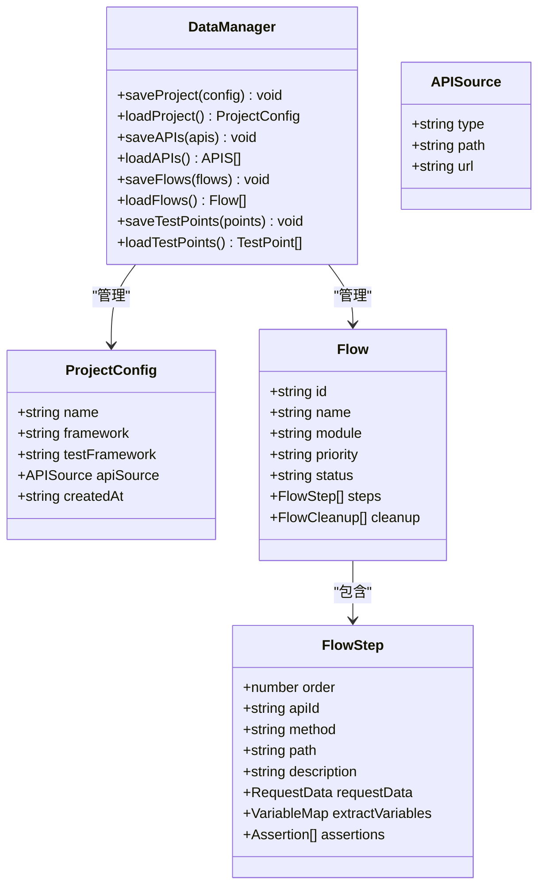

**图表来源**
- [flow-and-data-guide.md:7-75](file://flow-and-data-guide.md#L7-L75)
- [SKILL.md:67-75](file://SKILL.md#L67-L75)

### 2. 测试生成器

测试生成器根据业务链路自动生成多框架测试代码，支持Jest、Vitest、Pytest、JUnit、Go testing等框架：

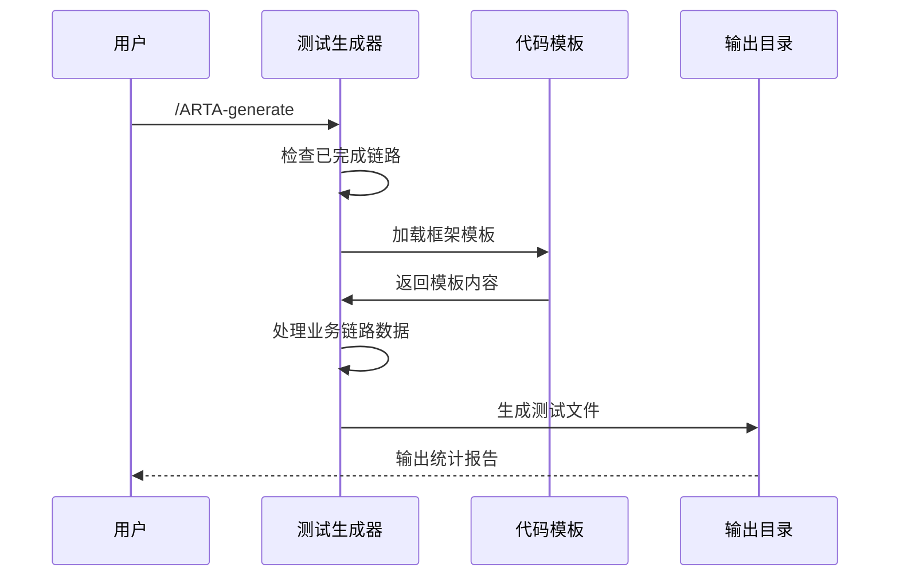

**图表来源**
- [SKILL.md:297-377](file://SKILL.md#L297-L377)
- [generation-reference.md:256-286](file://generation-reference.md#L256-L286)

### 3. 文件命名约定

系统采用统一的文件命名约定，确保不同语言和框架的一致性：

| 框架类型 | 文件命名规则 | 示例 |
|----------|--------------|------|
| Jest/Vitest | `{flow_name}.test.ts` | `user_order.test.ts` |
| Mocha | `{flow_name}.spec.ts` | `user_register.spec.ts` |
| Pytest | `test_{flow_name}.py` | `test_product_crud.py` |
| JUnit | `{FlowName}Test.java` | `UserOrderFlowTest.java` |
| Go testing | `{flow_name}_test.go` | `product_crud_test.go` |

**章节来源**
- [SKILL.md:312-321](file://SKILL.md#L312-L321)
- [generation-reference.md:242-254](file://generation-reference.md#L242-L254)

## 架构概览

ARTA采用分层架构设计，确保各组件之间的松耦合和高内聚：

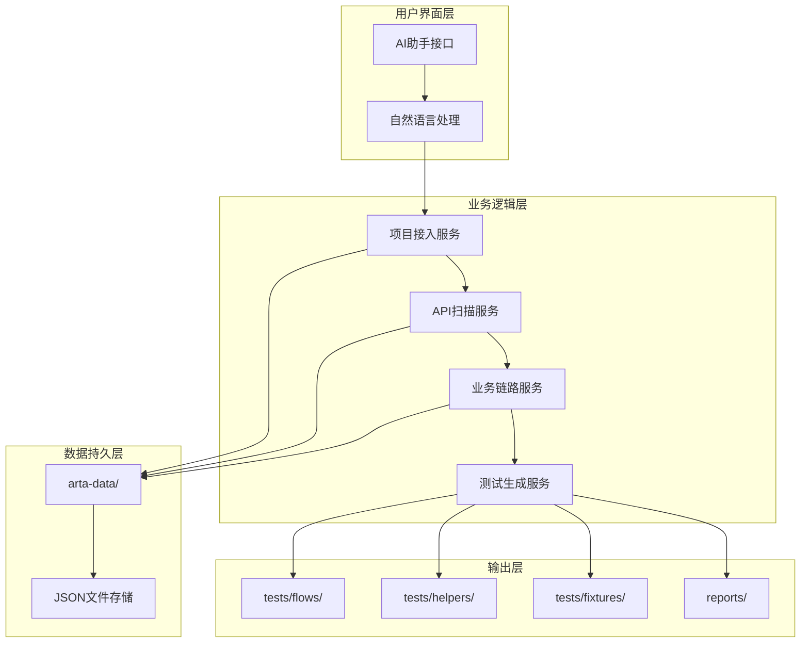

**图表来源**
- [README.md:10-12](file://README.md#L10-L12)
- [SKILL.md:34-78](file://SKILL.md#L34-L78)

### 控制流分析

系统遵循严格的四阶段控制流，确保测试流程的有序执行：

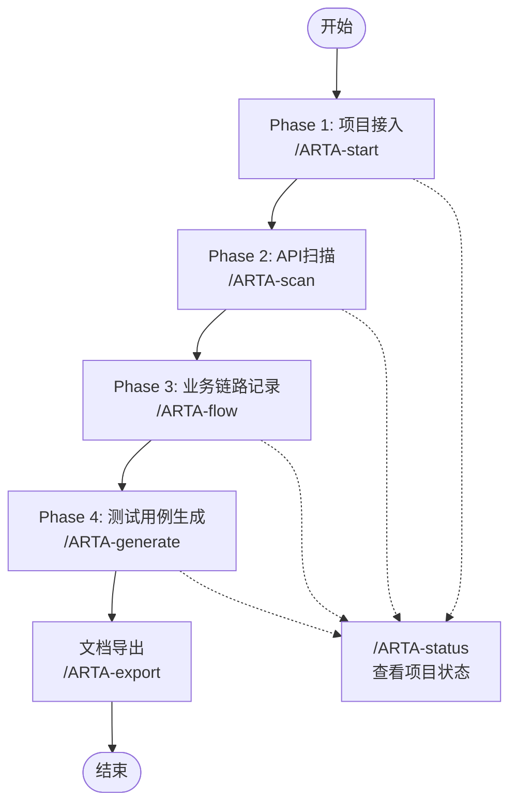

**图表来源**
- [README.md:72-83](file://README.md#L72-L83)
- [SKILL.md:18-29](file://SKILL.md#L18-L29)

## 详细组件分析

### 业务链路管理系统

业务链路管理系统是ARTA的核心组件，负责管理复杂的测试流程编排：

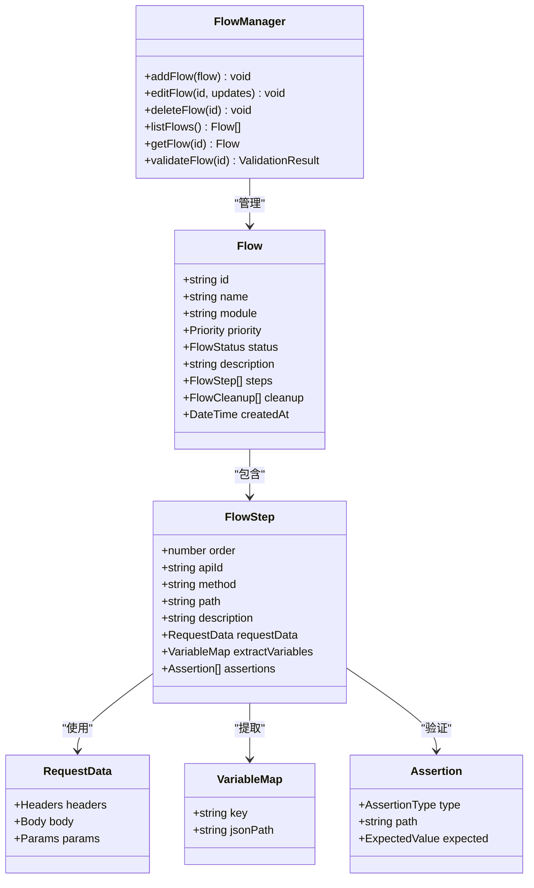

**图表来源**
- [flow-and-data-guide.md:7-75](file://flow-and-data-guide.md#L7-L75)

### 测试数据管理系统

测试数据管理系统支持四种数据类型，满足不同测试场景的需求：

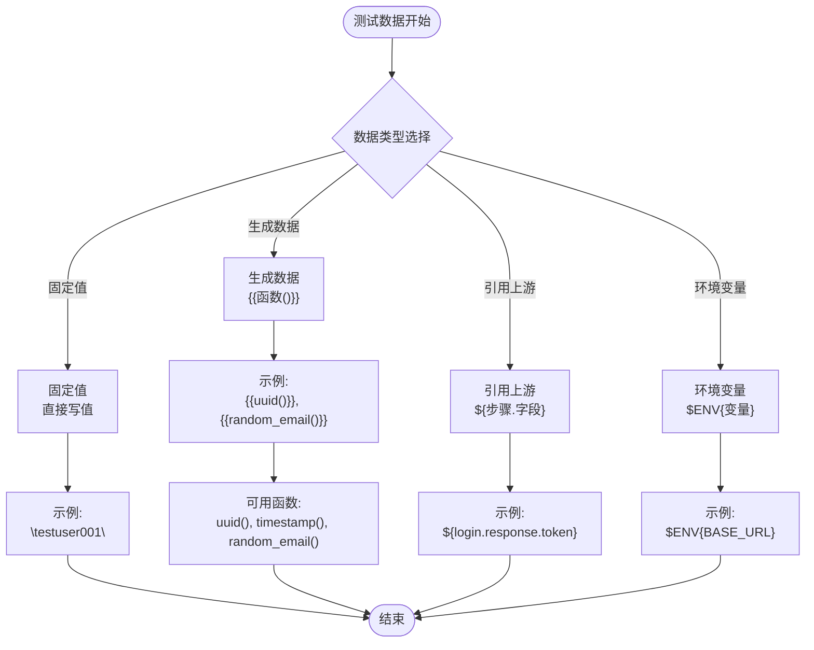

**图表来源**
- [flow-and-data-guide.md:79-131](file://flow-and-data-guide.md#L79-L131)

### 断言验证系统

断言验证系统支持多种断言类型，确保测试的全面性和准确性：

| 断言类型 | 用途 | 示例 |
|----------|------|------|
| `status` | HTTP状态码验证 | `{ "type": "status", "expected": 200 }` |
| `jsonpath` + `exists` | 字段存在性验证 | `{ "path": "$.data.token", "condition": "exists" }` |
| `jsonpath` + `equals` | 值相等验证 | `{ "path": "$.data.status", "condition": "equals", "expected": "active" }` |
| `jsonpath` + `contains` | 字符串包含验证 | `{ "path": "$.message", "condition": "contains", "expected": "success" }` |
| `jsonpath` + `type` | 数据类型验证 | `{ "path": "$.data.list", "condition": "type", "expected": "array" }` |
| `response_time` | 响应时间验证 | `{ "type": "response_time", "max_ms": 1000 }` |
| `header` | 响应头验证 | `{ "type": "header", "name": "Content-Type", "contains": "application/json" }` |

**章节来源**
- [flow-and-data-guide.md:133-145](file://flow-and-data-guide.md#L133-L145)

### 测试报告生成系统

测试报告生成系统提供详细的统计信息和建议：

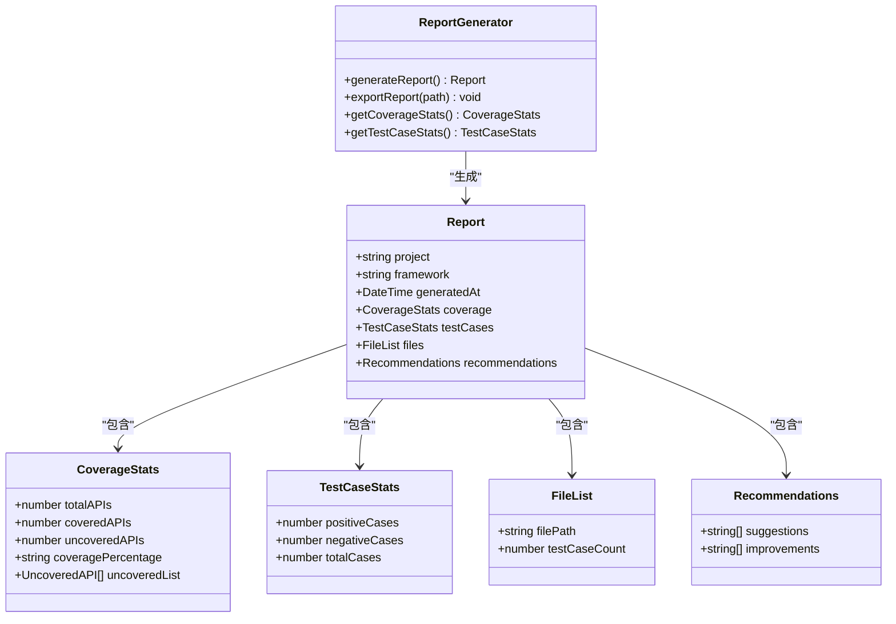

**图表来源**
- [generation-reference.md:256-286](file://generation-reference.md#L256-L286)

**章节来源**
- [generation-reference.md:256-286](file://generation-reference.md#L256-L286)

## 依赖关系分析

### 外部依赖管理

ARTA系统依赖于多个外部框架和工具：

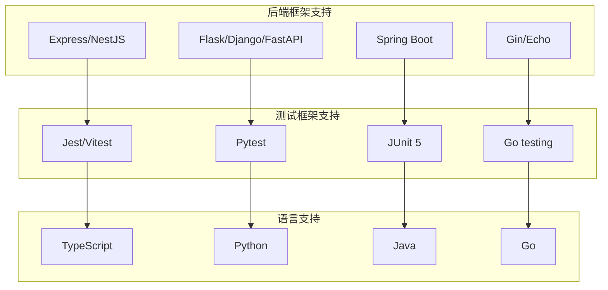

**图表来源**
- [README.md:24-29](file://README.md#L24-L29)

### 内部模块依赖

系统内部模块之间存在清晰的依赖关系：

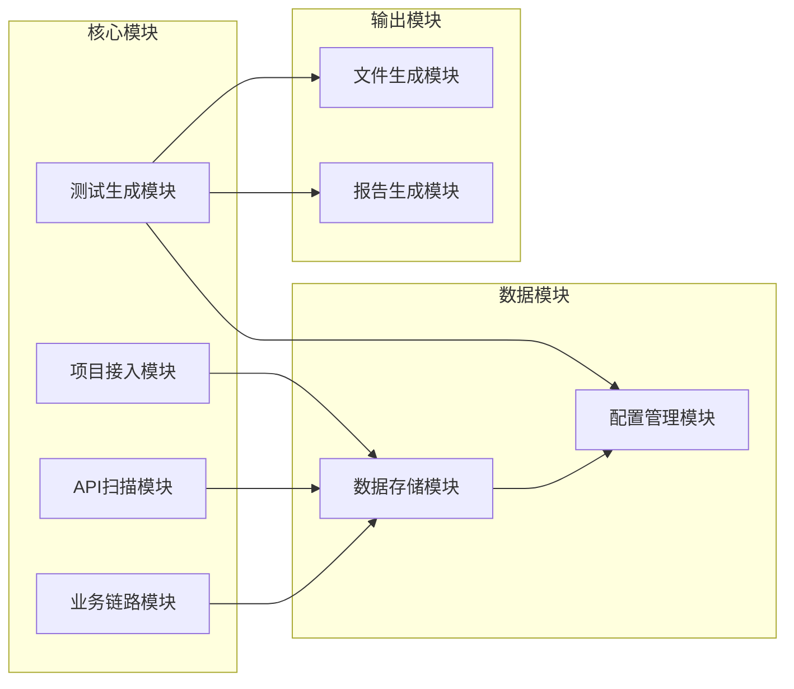

**图表来源**
- [SKILL.md:34-78](file://SKILL.md#L34-L78)
- [generation-reference.md:288-303](file://generation-reference.md#L288-L303)

**章节来源**
- [README.md:24-29](file://README.md#L24-L29)
- [SKILL.md:34-78](file://SKILL.md#L34-L78)

## 性能考虑

### 文件I/O优化

ARTA系统在文件操作方面采用了多项优化策略：

1. **批量文件写入**：测试生成完成后一次性写入所有文件，减少磁盘I/O操作
2. **增量更新机制**：支持部分文件更新，避免全量重写
3. **缓存策略**：对频繁访问的数据进行内存缓存
4. **异步处理**：大文件操作采用异步方式进行，提升用户体验

### 内存管理

系统采用高效的内存管理模式：

- **流式处理**：大文件采用流式读取和写入
- **对象池**：复用常用对象，减少垃圾回收压力
- **延迟加载**：非必要数据延迟加载，降低初始内存占用

### 并发处理

ARTA支持多线程并发处理：

- **并行API扫描**：多个API端点同时扫描
- **并发测试生成**：不同业务链路并行生成测试代码
- **异步文件操作**：文件I/O操作异步执行

## 故障排除指南

### 常见问题及解决方案

#### 1. 文件权限问题

**问题描述**：无法写入测试文件或配置文件

**解决方案**：
- 检查目标目录的写入权限
- 确保工作目录具有适当的权限设置
- 避免在只读环境中运行ARTA

#### 2. 路径解析错误

**问题描述**：相对路径和绝对路径混用导致的问题

**解决方案**：
- 使用统一的路径解析策略
- 在配置中明确指定工作目录
- 避免硬编码绝对路径

#### 3. 文件命名冲突

**问题描述**：多个业务链路生成相同名称的测试文件

**解决方案**：
- 实施自动重命名机制
- 使用唯一标识符避免冲突
- 提供自定义命名规则

### 错误恢复机制

系统具备完善的错误恢复能力：

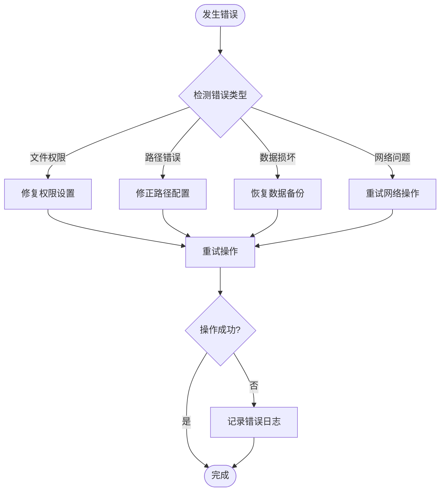

**章节来源**
- [SKILL.md:434-443](file://SKILL.md#L434-L443)

## 结论

ARTA文件结构管理模块展现了现代测试工具的最佳实践，通过标准化的文件组织、清晰的命名约定和完善的依赖管理，为大型项目的自动化测试提供了可靠的基础设施。

该系统的主要优势包括：

1. **标准化的文件结构**：统一的目录组织和命名约定确保了项目的可维护性
2. **多框架支持**：灵活的代码生成机制支持主流测试框架
3. **完整的生命周期管理**：从项目接入到测试生成的全流程自动化
4. **强大的扩展性**：模块化的架构设计便于功能扩展和定制
5. **完善的错误处理**：健壮的错误恢复机制确保系统的稳定性

通过合理利用ARTA的文件结构管理功能，开发团队可以显著提升测试效率，降低测试维护成本，并确保测试质量的一致性。

## 附录

### 配置选项参考

#### 项目配置选项

| 配置项 | 类型 | 必需 | 默认值 | 描述 |
|--------|------|------|--------|------|
| `name` | string | 是 | - | 项目名称 |
| `framework` | string | 是 | - | 后端框架类型 |
| `testFramework` | string | 是 | - | 测试框架类型 |
| `apiSource.type` | string | 是 | - | API来源类型 |
| `apiSource.path` | string | 否 | - | 本地路径 |
| `apiSource.url` | string | 否 | - | API URL |

#### 测试生成配置

| 配置项 | 类型 | 默认值 | 描述 |
|--------|------|--------|------|
| `outputDir` | string | `tests/flows/` | 测试文件输出目录 |
| `reportDir` | string | `reports/` | 测试报告输出目录 |
| `helpersDir` | string | `tests/helpers/` | 辅助工具目录 |
| `fixturesDir` | string | `tests/fixtures/` | 测试数据目录 |

### 最佳实践建议

#### 大型项目组织策略

1. **模块化目录结构**：按照业务模块组织测试文件
2. **版本控制策略**：将配置文件纳入版本控制，测试文件排除在外
3. **CI/CD集成**：在持续集成流程中自动执行测试生成和验证
4. **文档维护**：定期更新测试文档，保持与代码同步

#### 命名冲突解决

1. **使用前缀命名**：为不同类型的测试文件添加前缀标识
2. **版本化管理**：在文件名中包含版本信息
3. **自动重命名**：实施冲突检测和自动重命名机制
4. **命名约定审查**：建立命名约定审查流程

#### CI/CD集成方案

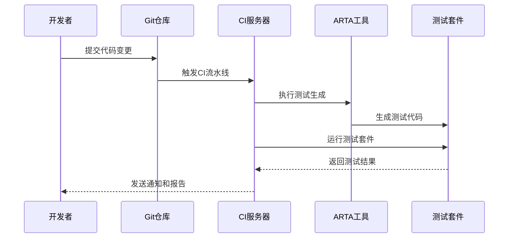

**图表来源**
- [README.md:56-83](file://README.md#L56-L83)
- [SKILL.md:402-416](file://SKILL.md#L402-L416)