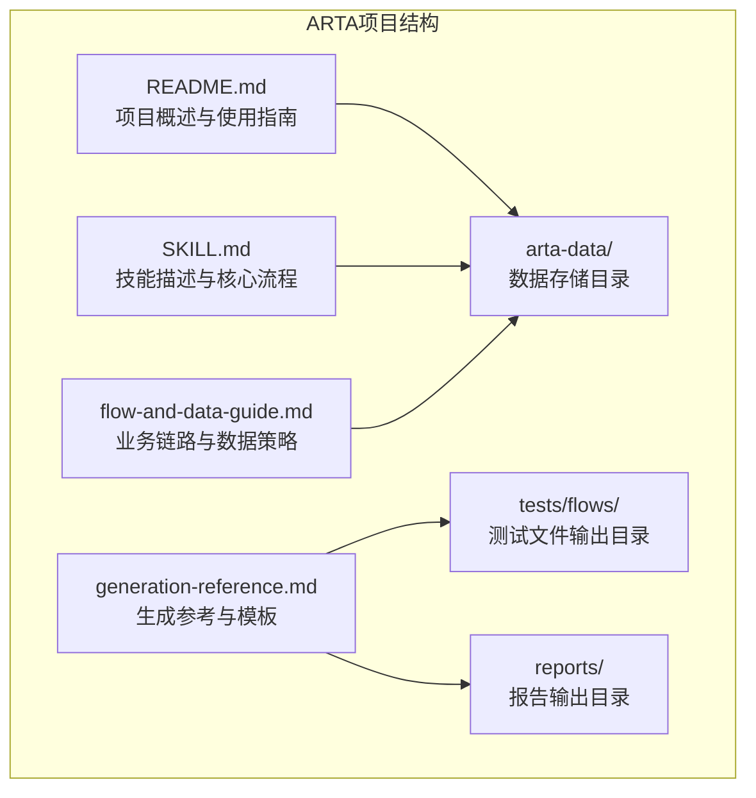
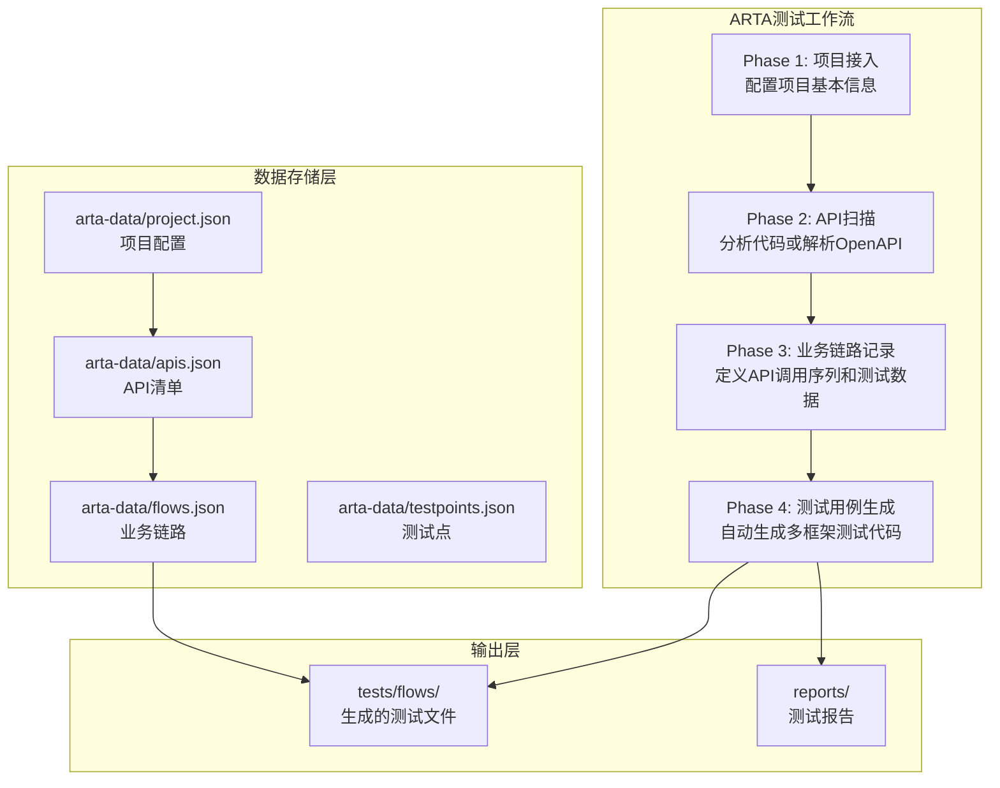
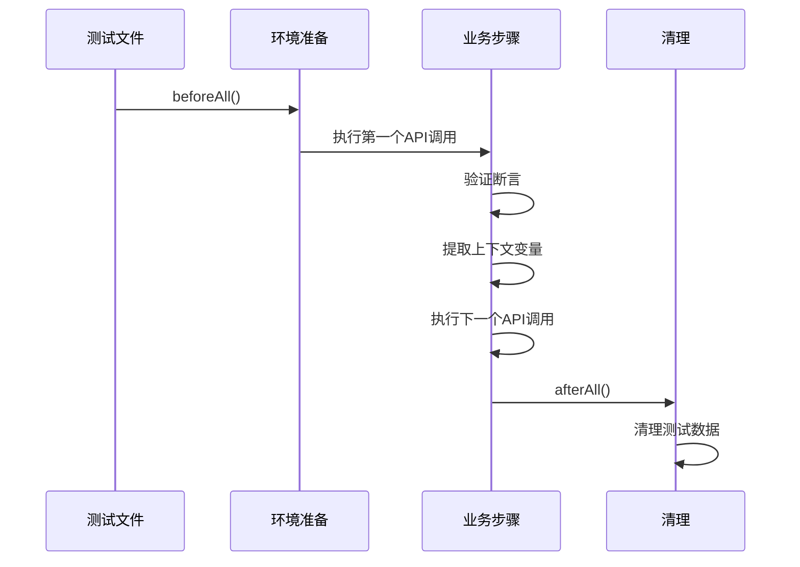
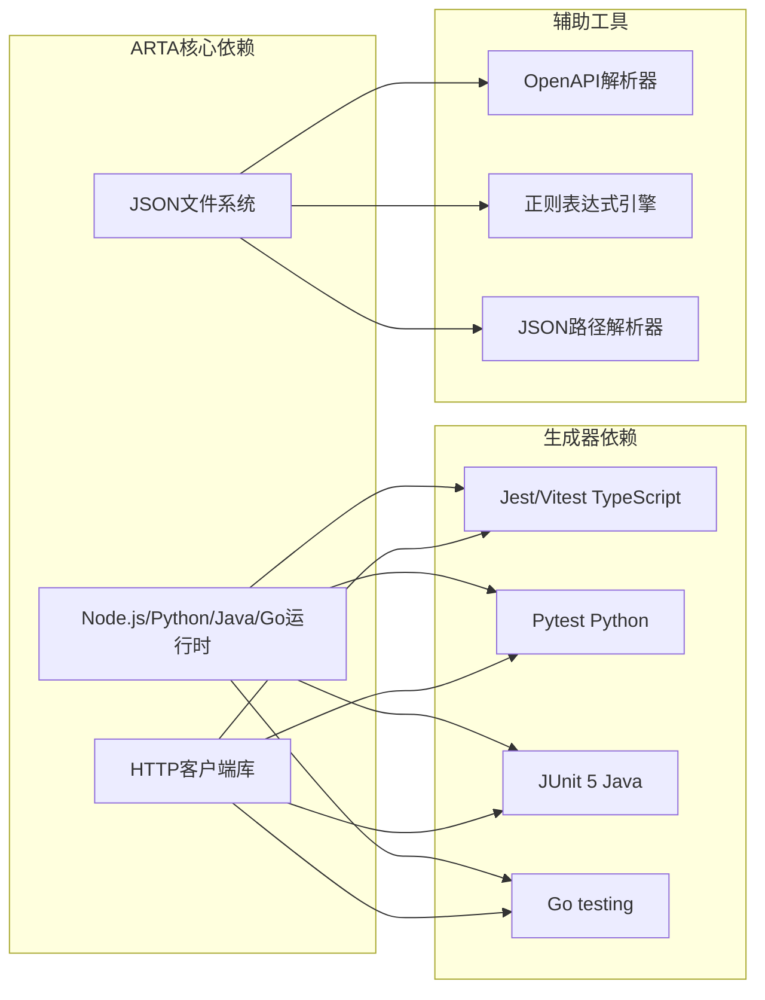

# 测试用例生成模块技术文档

<cite>
**本文档引用的文件**
- [README.md](file://README.md)
- [SKILL.md](file://SKILL.md)
- [flow-and-data-guide.md](file://flow-and-data-guide.md)
- [generation-reference.md](file://generation-reference.md)
</cite>

## 目录
1. [简介](#简介)
2. [项目结构](#项目结构)
3. [核心组件](#核心组件)
4. [架构概览](#架构概览)
5. [详细组件分析](#详细组件分析)
6. [依赖关系分析](#依赖关系分析)
7. [性能考虑](#性能考虑)
8. [故障排除指南](#故障排除指南)
9. [结论](#结论)
10. [附录](#附录)

## 简介

ARTA（Automation Regression Test Assistant）是一个端到端的API自动化测试流程引导工具，专门设计用于帮助开发团队从项目接入到测试用例生成的完整测试工作流程。该系统的核心优势在于其智能化的多框架测试用例生成能力，支持Jest、Pytest、JUnit 5、Go testing等多种主流测试框架。

ARTA采用四阶段测试工作流程：项目接入 → API扫描 → 业务链路记录 → 测试用例生成。这种渐进式的方法确保了测试用例的质量和覆盖率，同时提供了灵活的配置选项和强大的扩展机制。

## 项目结构

该项目采用简洁而功能明确的文件组织结构，主要包含四个核心文档文件：



**图表来源**
- [README.md:1-176](file://README.md#L1-L176)
- [SKILL.md:1-443](file://SKILL.md#L1-L443)

**章节来源**
- [README.md:1-176](file://README.md#L1-L176)
- [SKILL.md:1-443](file://SKILL.md#L1-L443)

## 核心组件

### 1. 项目接入组件

项目接入组件负责初始化测试项目的基本配置，包括项目名称、API信息来源、后端框架选择和测试框架配置。

**核心功能特性：**
- 多种API信息来源支持（本地代码分析、OpenAPI文件、OpenAPI URL、手动输入）
- 智能后端框架识别（Express、NestJS、Flask、Django、FastAPI、Spring Boot、Gin、Echo）
- 测试框架配置（Jest、Vitest、Pytest、JUnit 5、Go testing）

**数据存储结构：**
```json
{
  "name": "项目名称",
  "framework": "Express",
  "testFramework": "jest",
  "apiSource": { "type": "local", "path": "/path/to/project" },
  "createdAt": "ISO时间戳"
}
```

**章节来源**
- [SKILL.md:34-78](file://SKILL.md#L34-L78)
- [README.md:6-30](file://README.md#L6-L30)

### 2. API扫描组件

API扫描组件负责自动分析项目代码或解析OpenAPI规范，生成完整的API清单。

**扫描策略：**
- **本地代码分析**：基于框架特征识别规则，使用正则表达式匹配路由定义
- **OpenAPI解析**：支持OpenAPI 3.0/3.1和Swagger 2.0（JSON/YAML）
- **智能模块分组**：按路径前缀自动分组为业务模块

**框架识别规则：**
| 框架 | 关键标识 |
|------|----------|
| Express | `app.get/post/put/delete()`, `router.get/post()` |
| NestJS | `@Get()`, `@Post()`, `@Controller()` |
| Flask | `@app.route()`, `@blueprint.route()` |
| Django | `urlpatterns`, `path()`, `re_path()` |
| FastAPI | `@app.get()`, `@router.post()` |
| Spring Boot | `@GetMapping`, `@PostMapping`, `@RequestMapping` |
| Gin | `r.GET()`, `r.POST()`, `group.GET()` |
| Echo | `e.GET()`, `e.POST()`, `g.GET()` |

**章节来源**
- [SKILL.md:81-140](file://SKILL.md#L81-L140)

### 3. 业务链路记录组件

业务链路记录组件是ARTA的核心创新，它将复杂的业务场景抽象为可执行的测试链路。

**链路数据结构：**
```json
{
  "flows": [
    {
      "id": "flow-001",
      "name": "用户下单流程",
      "module": "订单",
      "priority": "P0",
      "status": "done",
      "description": "用户从浏览商品到完成下单的完整流程",
      "steps": [
        {
          "order": 1,
          "apiId": 1,
          "method": "POST",
          "path": "/api/auth/login",
          "description": "用户登录",
          "requestData": {
            "body": {
              "username": "testuser001",
              "password": "Test@123456"
            }
          },
          "extractVariables": {
            "token": "$.data.token",
            "userId": "$.data.user.id"
          },
          "assertions": [
            { "type": "status", "expected": 200 },
            { "type": "jsonpath", "path": "$.data.token", "condition": "exists" }
          ]
        }
      ],
      "cleanup": [
        {
          "method": "DELETE",
          "path": "/api/orders/${orderId}",
          "description": "清理测试订单"
        }
      ],
      "createdAt": "2026-03-11T12:00:00Z"
    }
  ]
}
```

**章节来源**
- [flow-and-data-guide.md:5-75](file://flow-and-data-guide.md#L5-L75)

### 4. 测试用例生成组件

测试用例生成组件基于业务链路自动生成多框架测试代码，这是ARTA最具价值的功能。

**支持的测试框架和输出格式：**
| 框架 | 语言 | 文件命名 |
|------|------|----------|
| Jest / Vitest | TypeScript | `{flow_name}.test.ts` |
| Mocha | TypeScript | `{flow_name}.spec.ts` |
| Pytest | Python | `test_{flow_name}.py` |
| JUnit 5 | Java | `{FlowName}Test.java` |
| Go testing | Go | `{flow_name}_test.go` |

**生成策略：**
- **场景覆盖**：正向流程 + 单步正向 + 关键异常场景
- **数据管理**：测试数据准备、上下文传递、测试清理
- **断言验证**：HTTP状态码、JSON路径、响应时间、响应头

**章节来源**
- [SKILL.md:297-377](file://SKILL.md#L297-L377)
- [generation-reference.md:218-254](file://generation-reference.md#L218-L254)

## 架构概览

ARTA采用模块化的架构设计，四个核心阶段相互独立又紧密协作：



**图表来源**
- [README.md:9-12](file://README.md#L9-L12)
- [SKILL.md:10-16](file://SKILL.md#L10-L16)

## 详细组件分析

### 测试数据策略组件

ARTA实现了先进的测试数据管理策略，支持四种不同类型的测试数据：

#### 1. 固定值数据
直接指定的常量值，适用于已知的测试账号或配置信息。

#### 2. 生成数据
使用内置函数动态生成测试数据，包括：
- `{{uuid()}}` - UUID v4
- `{{timestamp()}}` - 当前时间戳
- `{{random_email()}}` - 随机邮箱
- `{{random_phone()}}` - 随机手机号
- `{{increment(prefix)}}` - 自增序列
- `{{faker(type)}}` - 随机姓名/地址等

#### 3. 上游引用数据
引用前面步骤的响应数据，实现跨步骤数据传递：
- `${stepN.变量名}` - 引用步骤N中extractVariables定义的变量
- `${stepN.response.路径}` - 直接引用步骤N响应体的JSON路径

#### 4. 环境变量数据
引用运行时环境变量：
- `$ENV{BASE_URL}` - API基础地址
- `$ENV{API_KEY}` - API密钥
- `$ENV{TEST_ENV}` - 测试环境标识

**章节来源**
- [flow-and-data-guide.md:77-132](file://flow-and-data-guide.md#L77-L132)

### 断言类型组件

ARTA支持多种断言类型，确保测试的全面性和准确性：

| 类型 | 说明 | 示例 |
|------|------|------|
| `status` | HTTP状态码 | `{ "type": "status", "expected": 200 }` |
| `jsonpath` + `exists` | 字段存在 | `{ "path": "$.data.token", "condition": "exists" }` |
| `jsonpath` + `equals` | 值相等 | `{ "path": "$.data.status", "condition": "equals", "expected": "active" }` |
| `jsonpath` + `contains` | 包含字符串 | `{ "path": "$.message", "condition": "contains", "expected": "success" }` |
| `jsonpath` + `type` | 类型检查 | `{ "path": "$.data.list", "condition": "type", "expected": "array" }` |
| `jsonpath` + `length_gte` | 数组长度 | `{ "path": "$.data.list", "condition": "length_gte", "expected": 1 }` |
| `response_time` | 响应时间 | `{ "type": "response_time", "max_ms": 1000 }` |
| `header` | 响应头 | `{ "type": "header", "name": "Content-Type", "contains": "application/json" }` |

**章节来源**
- [flow-and-data-guide.md:133-145](file://flow-and-data-guide.md#L133-L145)

### CRUD接口处理策略

针对不同的CRUD操作，ARTA提供了标准化的测试场景建议：

#### 创建(Create)接口
- **测试场景**：成功创建、缺少必填字段、字段格式错误、重复创建
- **数据策略**：使用生成数据避免冲突，如`{{uuid()}}`作为唯一标识
- **清理策略**：记录创建的资源ID，测试结束后删除

#### 更新(Update)接口
- **测试场景**：更新成功、资源不存在、无权限、部分更新
- **前置条件**：需要先创建资源
- **数据策略**：引用创建步骤返回的ID

#### 删除(Delete)接口
- **测试场景**：删除成功、不存在的资源、无权限、级联删除验证
- **前置条件**：需要先创建资源
- **执行时机**：通常放在测试最后执行，兼做清理

#### 查询(Read)接口
- **测试场景**：有数据、无数据、分页查询、条件筛选、无权限
- **数据策略**：先确保有测试数据，再进行查询验证

**章节来源**
- [flow-and-data-guide.md:146-198](file://flow-and-data-guide.md#L146-L198)

### 多框架代码模板

ARTA为每种支持的测试框架提供了完整的代码模板，确保生成的测试代码质量一致。

#### Jest/Vitest (TypeScript)模板



**图表来源**
- [generation-reference.md:9-62](file://generation-reference.md#L9-L62)

#### Pytest (Python)模板

Pytest模板采用类结构组织测试，支持setup_class和teardown_class方法进行环境准备和清理。

#### JUnit 5 (Java)模板

JUnit 5模板使用现代化的注解语法，支持@Test、@Order、@DisplayName等注解。

#### Go testing模板

Go模板展示了Go语言的测试风格，使用t.Run()组织子测试，支持t.Cleanup()进行清理。

**章节来源**
- [generation-reference.md:7-216](file://generation-reference.md#L7-L216)

## 依赖关系分析

ARTA的依赖关系相对简单但功能完整，主要依赖于标准库和少量外部库：



**图表来源**
- [SKILL.md:26-29](file://SKILL.md#L26-L29)
- [generation-reference.md:242-254](file://generation-reference.md#L242-L254)

**章节来源**
- [SKILL.md:26-29](file://SKILL.md#L26-L29)
- [generation-reference.md:242-254](file://generation-reference.md#L242-L254)

## 性能考虑

### 1. 扫描性能优化

**API扫描阶段的性能优化策略：**
- **智能排除**：排除node_modules、vendor、.git、dist、build等目录
- **并行处理**：对多个文件的扫描可以并行执行
- **缓存机制**：对已扫描的文件结果进行缓存，避免重复扫描
- **增量扫描**：只扫描发生变化的文件

### 2. 生成性能优化

**测试生成阶段的性能优化策略：**
- **模板预编译**：将常用模板预编译为可执行代码
- **批量生成**：支持批量生成多个链路的测试代码
- **异步处理**：使用异步I/O减少等待时间
- **内存管理**：合理管理大文件的内存使用

### 3. 大规模项目处理策略

**针对大型项目的处理方案：**
- **分批生成**：将大量链路分批生成，避免内存溢出
- **并发控制**：限制同时执行的生成任务数量
- **进度监控**：提供详细的进度报告和错误追踪
- **资源隔离**：为每个生成任务分配独立的临时目录

## 故障排除指南

### 1. 常见问题及解决方案

**问题1：API扫描不完整**
- **症状**：扫描结果显示API数量不足
- **原因**：可能遗漏了某些路由定义或配置了错误的排除规则
- **解决**：检查框架识别规则，确认项目根目录配置正确

**问题2：测试生成失败**
- **症状**：生成过程中出现错误或生成的代码无法编译
- **原因**：可能是链路配置错误或模板渲染问题
- **解决**：检查flows.json的格式，确认所有必需字段都已配置

**问题3：数据引用错误**
- **症状**：测试运行时报错，提示找不到引用的数据
- **原因**：上游步骤的变量名或JSON路径不正确
- **解决**：检查extractVariables配置和JSON路径表达式

### 2. 调试技巧

**调试步骤：**
1. 使用`/ARTA-status`查看项目当前状态
2. 检查`arta-data/`目录下的JSON文件格式
3. 逐步验证每个业务链路的配置
4. 使用简单的测试用例验证环境配置

**章节来源**
- [SKILL.md:434-443](file://SKILL.md#L434-L443)

## 结论

ARTA测试用例生成模块代表了现代API测试工具的发展方向，它将智能化的业务链路分析与多框架测试代码生成相结合，为开发团队提供了完整的端到端测试解决方案。

**主要优势：**
- **智能化程度高**：能够自动识别业务场景并生成相应的测试用例
- **多框架支持**：一次配置，生成多种测试框架代码
- **数据管理完善**：提供丰富的测试数据策略和断言类型
- **可扩展性强**：支持自定义模板和扩展机制

**适用场景：**
- 新项目快速建立测试体系
- 现有项目的回归测试自动化
- API文档驱动的测试用例生成
- 跨团队协作的测试标准化

随着ARTA的不断发展和完善，它有望成为API测试领域的标准工具，为提高软件质量和开发效率做出重要贡献。

## 附录

### 1. 配置选项参考

**项目配置选项：**
- 项目名称：任意字符串
- API信息来源：local、openapi-file、openapi-url、manual
- 后端框架：Express、NestJS、Flask、Django、FastAPI、Spring Boot、Gin、Echo
- 测试框架：jest、vitest、pytest、junit、go-testing

**章节来源**
- [SKILL.md:36-46](file://SKILL.md#L36-L46)

### 2. 最佳实践建议

**业务链路设计：**
- 优先设计P0级别的核心业务流程
- 确保每个链路都有明确的业务目标
- 合理使用断言，既要验证功能正确性，也要关注性能指标

**测试数据管理：**
- 使用生成数据避免测试间的相互影响
- 建立完善的清理机制
- 对敏感数据进行脱敏处理

**代码生成策略：**
- 保持测试代码的可读性和可维护性
- 合理组织测试文件结构
- 建立统一的命名约定和代码风格