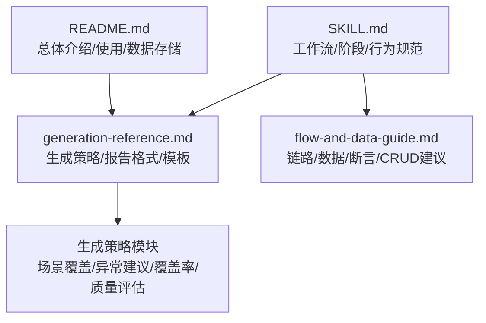
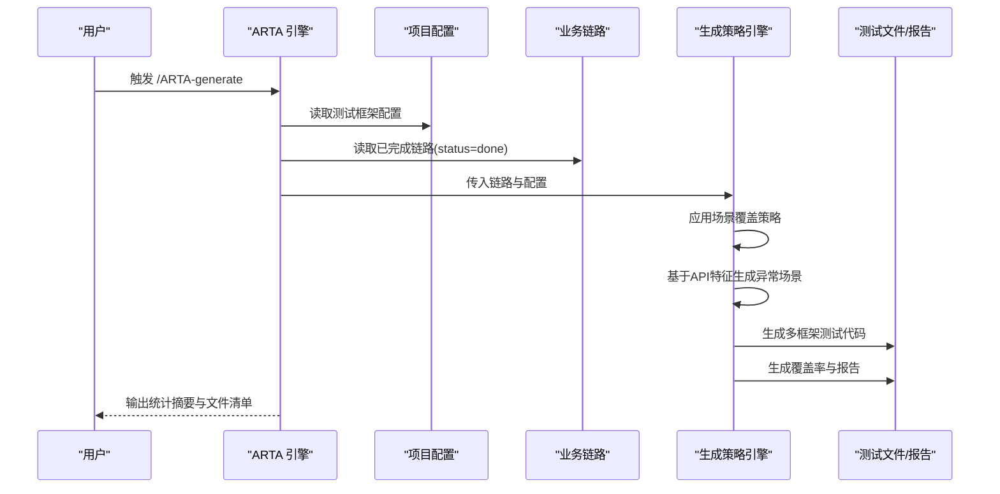
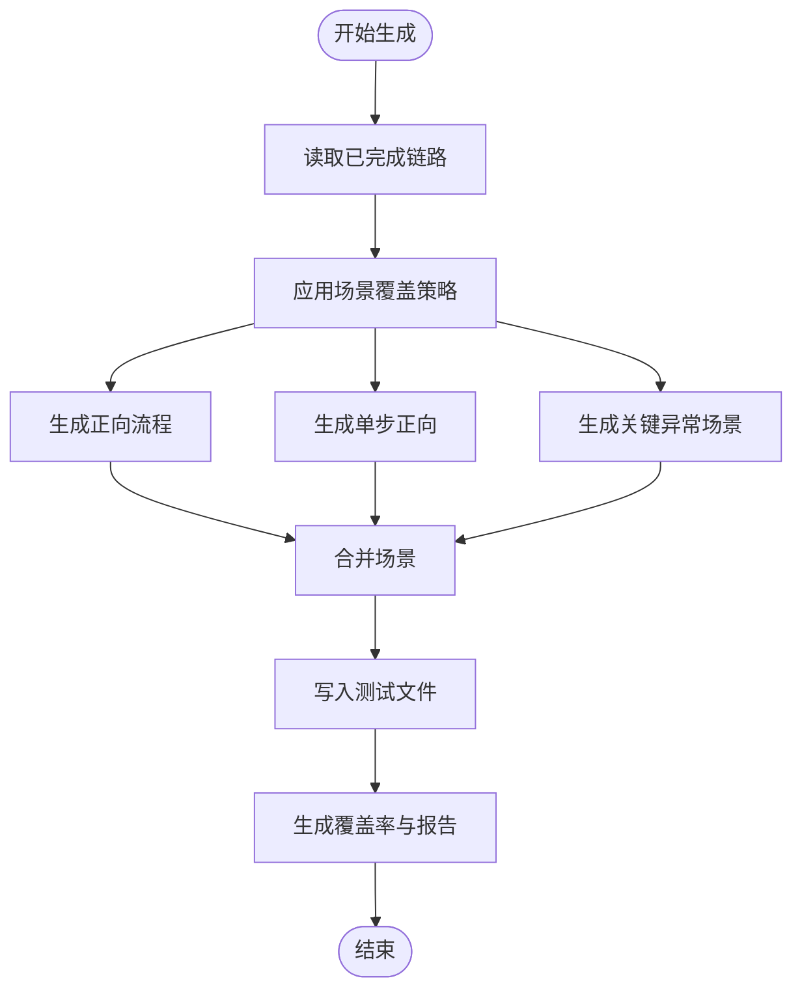
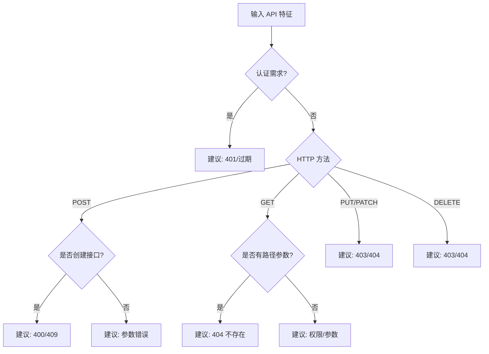
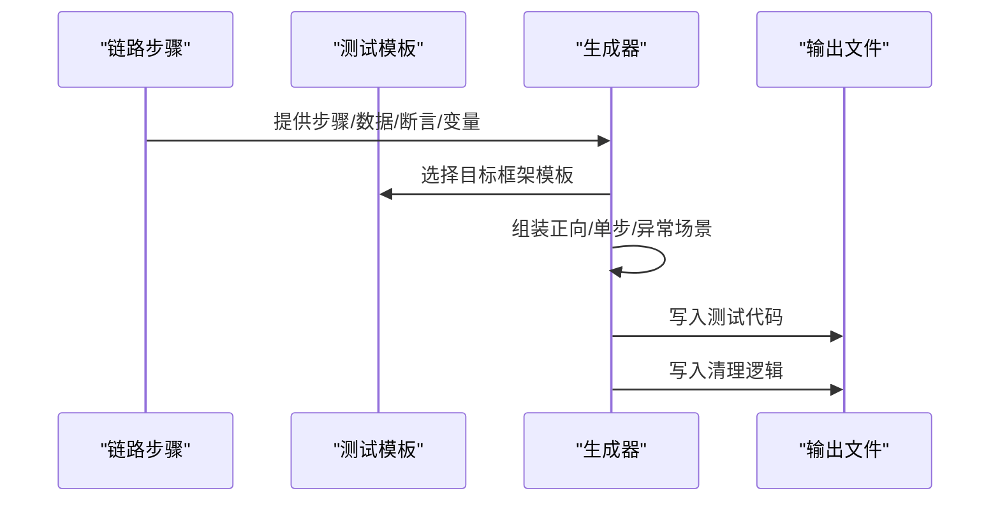
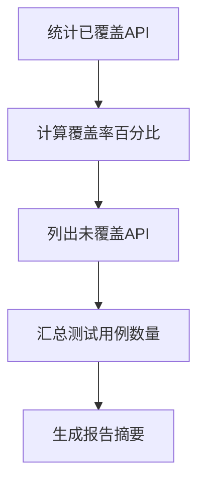
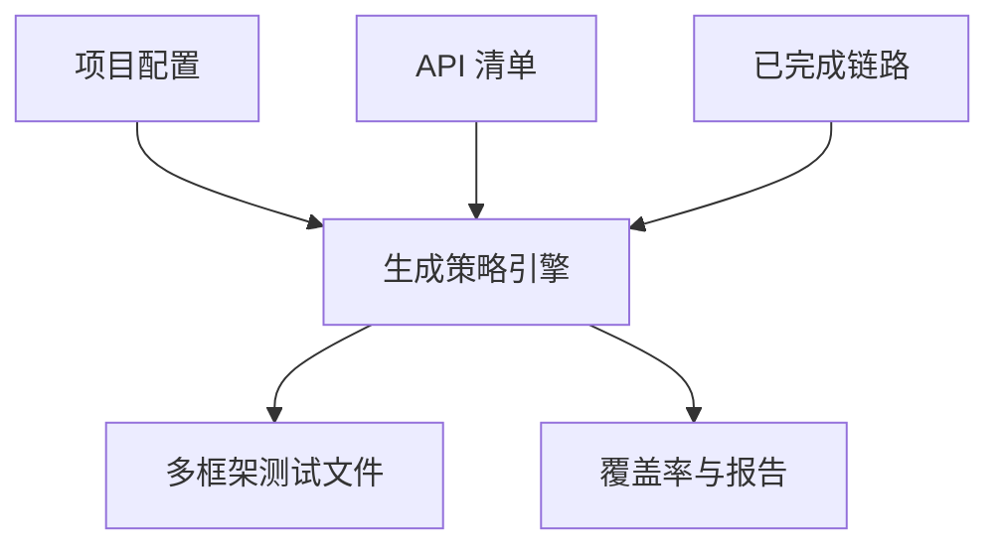

# 生成策略

<cite>
**本文引用的文件**
- [README.md](file://README.md)
- [SKILL.md](file://SKILL.md)
- [flow-and-data-guide.md](file://flow-and-data-guide.md)
- [generation-reference.md](file://generation-reference.md)
</cite>

## 目录
1. [简介](#简介)
2. [项目结构](#项目结构)
3. [核心组件](#核心组件)
4. [架构总览](#架构总览)
5. [详细组件分析](#详细组件分析)
6. [依赖关系分析](#依赖关系分析)
7. [性能考量](#性能考量)
8. [故障排查指南](#故障排查指南)
9. [结论](#结论)
10. [附录](#附录)

## 简介
本文件聚焦 ARTA 的“生成策略”模块，系统阐述其在第四阶段“测试用例生成”中的设计与实现要点，包括：
- 场景覆盖策略：正向流程、单步正向、关键异常场景的生成规则
- 异常场景的自动建议机制：基于 API 特征推荐对应异常测试用例
- 测试用例生成算法、覆盖率计算与质量评估标准
- 生成策略的配置选项、自定义规则与扩展机制
- 大规模项目的生成优化策略、并行处理与资源管理
- 实际应用效果与性能指标

## 项目结构
ARTA 采用“技能（Skill）+ 文档”的轻量组织方式，核心生成策略相关内容集中在以下文档中：
- README.md：总体介绍、使用方法、数据存储位置
- SKILL.md：端到端工作流、阶段划分、关键行为规范
- flow-and-data-guide.md：链路数据结构、测试数据策略、断言类型、CRUD 场景建议
- generation-reference.md：各框架代码模板、生成策略、测试报告格式

图表来源
- [README.md:1-176](file://README.md#L1-L176)
- [SKILL.md:1-443](file://SKILL.md#L1-L443)
- [flow-and-data-guide.md:1-218](file://flow-and-data-guide.md#L1-L218)
- [generation-reference.md:1-304](file://generation-reference.md#L1-L304)

章节来源
- [README.md:1-176](file://README.md#L1-L176)
- [SKILL.md:1-443](file://SKILL.md#L1-L443)
- [flow-and-data-guide.md:1-218](file://flow-and-data-guide.md#L1-L218)
- [generation-reference.md:1-304](file://generation-reference.md#L1-L304)

## 核心组件
- 生成策略引擎：负责将已完成的业务链路转换为多框架测试代码，遵循场景覆盖与异常建议规则
- 场景覆盖策略：定义正向流程、单步正向、关键异常三类场景的生成数量与组合方式
- 异常场景自动建议：依据 API 特征（认证、HTTP 方法、路径参数等）推荐异常用例
- 覆盖率计算：统计已覆盖 API 数量与未覆盖 API 列表，输出报告摘要
- 质量评估标准：断言类型、响应时间、状态码等指标的量化评估
- 配置与扩展：支持多框架模板、可配置的生成选项与自定义规则入口

章节来源
- [generation-reference.md:218-286](file://generation-reference.md#L218-L286)
- [flow-and-data-guide.md:133-198](file://flow-and-data-guide.md#L133-L198)
- [SKILL.md:297-377](file://SKILL.md#L297-L377)

## 架构总览
生成策略模块位于 ARTA 的第四阶段“测试用例生成”，其输入为已完成的业务链路与项目配置，输出为多框架测试代码与统计报告。

图表来源
- [SKILL.md:297-377](file://SKILL.md#L297-L377)
- [generation-reference.md:218-286](file://generation-reference.md#L218-L286)

## 详细组件分析

### 场景覆盖策略
- 正向流程：完整业务链路端到端执行一次，确保主路径正确性
- 单步正向：对链路中每个 API 单独生成成功场景，便于定位问题与提升稳定性
- 关键异常：基于 API 特征推荐典型异常场景，覆盖认证失败、资源不存在、参数错误等

图表来源
- [generation-reference.md:220-229](file://generation-reference.md#L220-L229)

章节来源
- [generation-reference.md:220-229](file://generation-reference.md#L220-L229)

### 异常场景自动建议机制
异常场景建议基于 API 特征进行规则匹配，典型规则如下：
- 需要认证：建议 401 未认证、token 过期
- POST 创建：建议 400 缺少必填字段、409 重复创建
- GET 带路径参数：建议 404 资源不存在
- PUT/PATCH 更新：建议 403 无权限、404 不存在
- DELETE 删除：建议 403 无权限、404 不存在

图表来源
- [generation-reference.md:230-241](file://generation-reference.md#L230-L241)

章节来源
- [generation-reference.md:230-241](file://generation-reference.md#L230-L241)

### 测试用例生成算法
- 输入：已完成链路（含步骤、请求数据、断言、变量提取）
- 处理：
  - 为每个链路生成正向流程与单步正向场景
  - 基于 API 特征生成关键异常场景
  - 生成测试数据准备（beforeAll/setUp）、步骤执行、断言验证、上下文传递、测试数据清理（afterAll/tearDown）
- 输出：多框架测试文件（Vitest/Jest、Pytest、JUnit、Go testing）

图表来源
- [SKILL.md:329-362](file://SKILL.md#L329-L362)
- [generation-reference.md:7-216](file://generation-reference.md#L7-L216)

章节来源
- [SKILL.md:329-362](file://SKILL.md#L329-L362)
- [generation-reference.md:7-216](file://generation-reference.md#L7-L216)

### 覆盖率计算与质量评估
- 覆盖率计算：
  - API 覆盖 = 已覆盖 API 数量 / 总 API 数量 × 100%
  - 未覆盖 API 列表用于指导后续链路补充
- 质量评估标准：
  - 断言类型：状态码、JSONPath、响应时间、响应头等
  - 场景数量：正向用例、异常用例合计
  - 报告维度：文件清单、建议项

图表来源
- [generation-reference.md:256-286](file://generation-reference.md#L256-L286)

章节来源
- [generation-reference.md:256-286](file://generation-reference.md#L256-L286)

### 配置选项、自定义规则与扩展机制
- 框架与输出格式：支持多框架模板与命名约定
- 生成选项：可按链路逐一生成，支持增量生成
- 自定义规则：
  - CRUD 接口处理策略：创建/更新/删除/查询的建议场景与数据策略
  - 断言类型：状态码、JSONPath、响应时间、响应头等
  - 优先级排序：P0-P3 的优先级建议
- 扩展机制：通过模板与规则入口，可扩展新的异常场景建议与断言类型

章节来源
- [generation-reference.md:312-321](file://generation-reference.md#L312-L321)
- [flow-and-data-guide.md:146-198](file://flow-and-data-guide.md#L146-L198)
- [flow-and-data-guide.md:200-218](file://flow-and-data-guide.md#L200-L218)

### 大规模项目的生成优化策略
- 并行处理：对多个链路的生成任务进行并发调度，缩短总生成时间
- 资源管理：限制并发度、控制内存占用、分批写入磁盘
- 增量生成：仅对状态为“完成”的链路生成，避免重复工作
- 缓存与复用：复用公共辅助工具与模板，减少模板解析开销
- 报告聚合：统一输出统计摘要与文件清单，便于审计与回溯

章节来源
- [SKILL.md:380-398](file://SKILL.md#L380-L398)
- [generation-reference.md:256-286](file://generation-reference.md#L256-L286)

## 依赖关系分析
生成策略模块依赖于以下输入与外部能力：
- 项目配置：测试框架、输出目录等
- 业务链路：已完成链路集合，包含步骤、数据、断言、变量提取
- API 清单：用于覆盖率统计与未覆盖 API 列表
- 框架模板：不同语言/框架的测试代码模板

图表来源
- [README.md:151-162](file://README.md#L151-L162)
- [SKILL.md:297-377](file://SKILL.md#L297-L377)
- [generation-reference.md:256-286](file://generation-reference.md#L256-L286)

章节来源
- [README.md:151-162](file://README.md#L151-L162)
- [SKILL.md:297-377](file://SKILL.md#L297-L377)
- [generation-reference.md:256-286](file://generation-reference.md#L256-L286)

## 性能考量
- 生成吞吐：通过并发与分批策略提升生成速度
- 内存占用：避免一次性加载全部链路，采用流式处理
- I/O 优化：批量写入测试文件，减少磁盘抖动
- 报告生成：延迟聚合统计，降低重复计算

## 故障排查指南
- 生成前检查：
  - 确认链路状态为“完成”，否则无法生成
  - 确认项目配置中的测试框架与输出目录正确
- 常见问题：
  - 未覆盖 API：根据报告清单补充链路或完善断言
  - 异常用例缺失：检查 API 特征是否被正确识别
  - 断言不生效：核对断言类型与 JSONPath 表达式
- 复用与导出：
  - 使用导出功能备份配置与生成结果，便于回滚与审计

章节来源
- [SKILL.md:380-398](file://SKILL.md#L380-L398)
- [generation-reference.md:256-286](file://generation-reference.md#L256-L286)

## 结论
ARTA 的生成策略模块通过明确的场景覆盖策略、基于 API 特征的异常场景建议、完善的覆盖率与质量评估，以及可扩展的配置与模板体系，实现了从链路到测试用例的高效转换。结合并行与资源管理优化，可在大规模项目中保持稳定与高性能的生成体验。

## 附录
- 术语
  - 正向流程：完整业务链路端到端执行
  - 单步正向：对每个 API 单独生成成功场景
  - 关键异常：基于 API 特征推荐的典型异常场景
- 参考
  - 生成策略与报告格式：[generation-reference.md:218-286](file://generation-reference.md#L218-L286)
  - 链路数据结构与断言类型：[flow-and-data-guide.md:133-198](file://flow-and-data-guide.md#L133-L198)
  - 工作流与使用方法：[SKILL.md:1-443](file://SKILL.md#L1-L443)