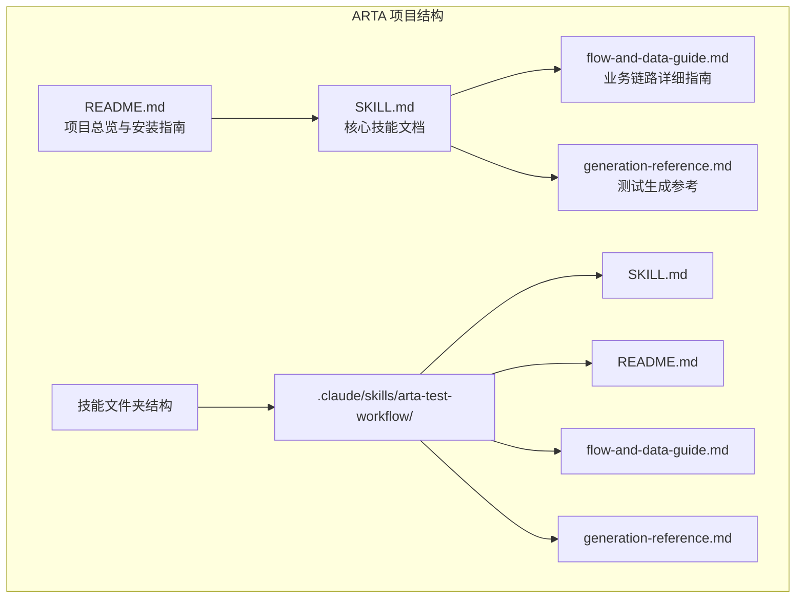
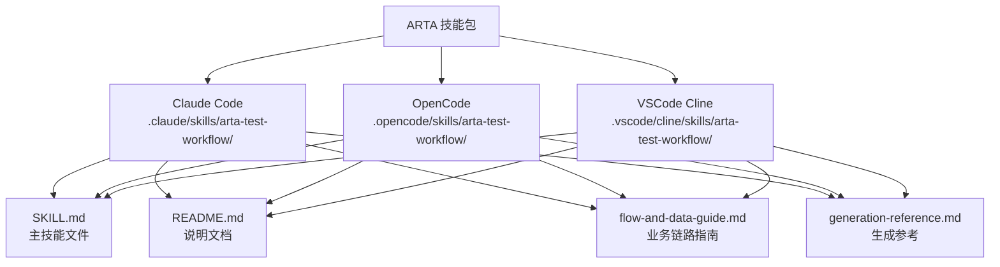
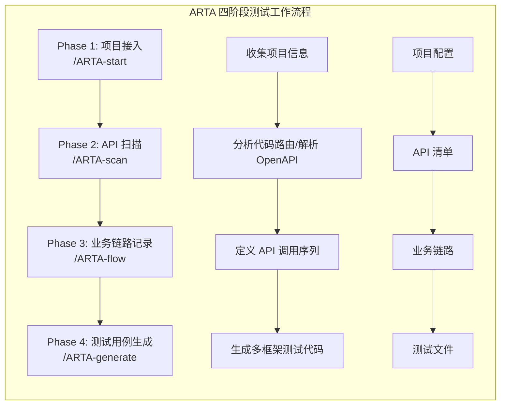
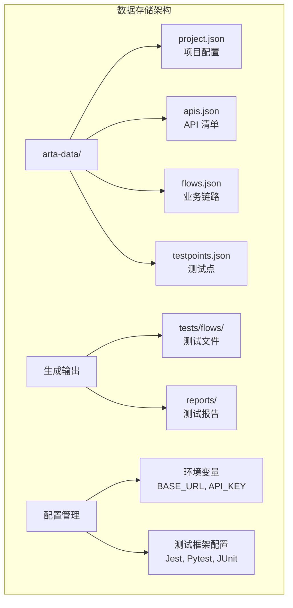
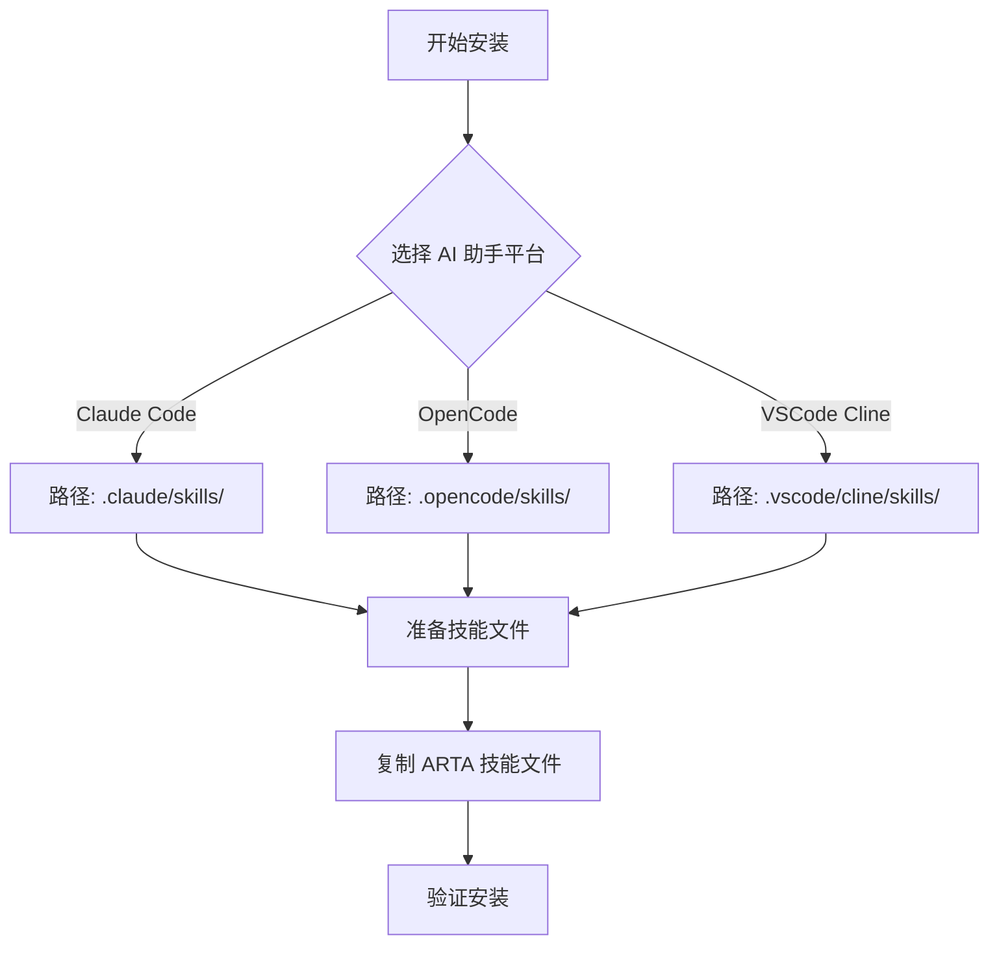
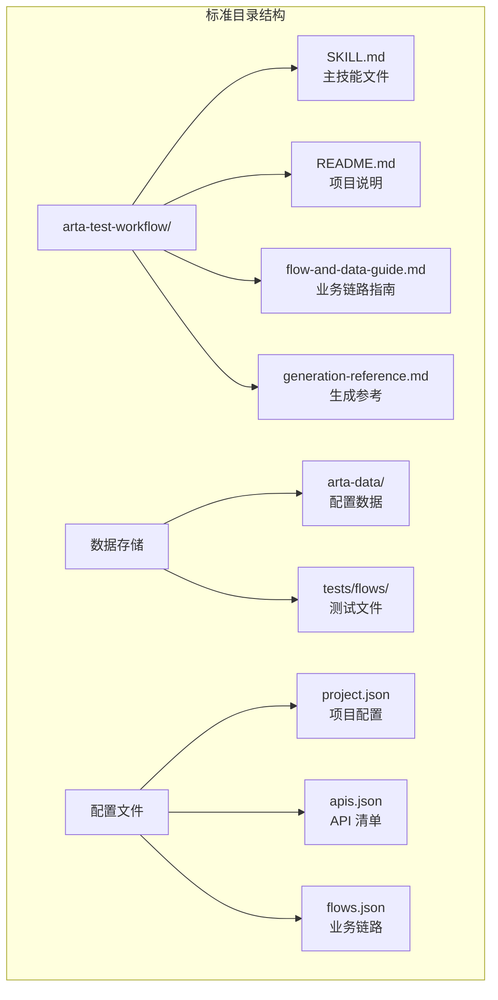
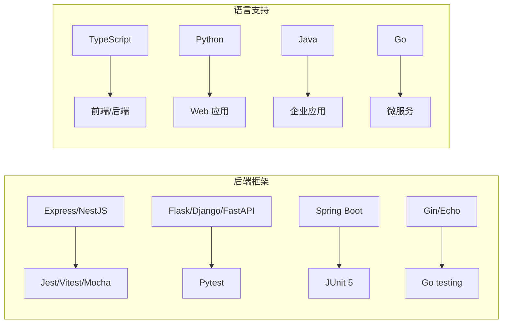
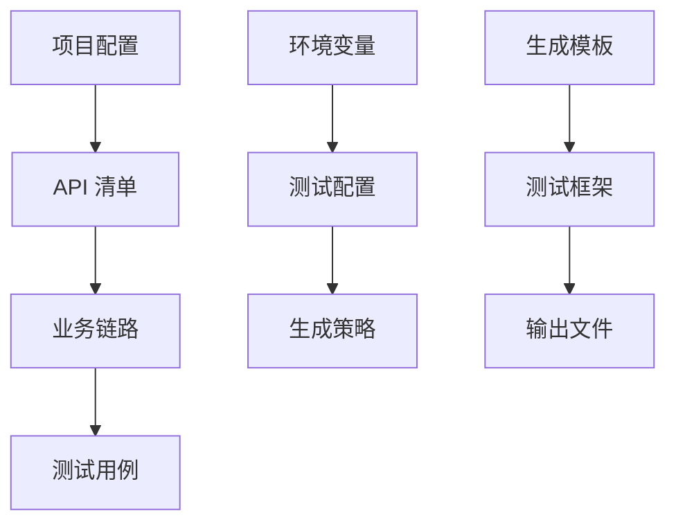

# 安装配置指南

<cite>
**本文档中引用的文件**
- [README.md](file://README.md)
- [SKILL.md](file://SKILL.md)
- [flow-and-data-guide.md](file://flow-and-data-guide.md)
- [generation-reference.md](file://generation-reference.md)
</cite>

## 目录
1. [简介](#简介)
2. [项目结构](#项目结构)
3. [核心组件](#核心组件)
4. [架构概览](#架构概览)
5. [详细组件分析](#详细组件分析)
6. [依赖关系分析](#依赖关系分析)
7. [性能考虑](#性能考虑)
8. [故障排除指南](#故障排除指南)
9. [结论](#结论)
10. [附录](#附录)

## 简介

ARTA（Automation Regression Test Assistant）是一个端到端 API 自动化测试流程引导工具，专为开发团队设计，帮助从项目接入到测试用例生成的完整测试流程。该工具支持多种 AI 编程助手平台，包括 Claude Code、OpenCode 和 VSCode Cline，通过 Skill 文件的形式提供完整的测试工作流程指导。

ARTA 的核心价值在于其自然语言优先的设计理念，用户无需记忆复杂的指令，只需用自然语言描述需求即可完成整个测试流程。该工具支持断点续作、增量操作、智能提醒等功能，大大提高了测试效率和质量。

## 项目结构

ARTA 项目采用简洁明了的文档结构，主要包含四个核心文件：

**图表来源**
- [README.md:45-52](file://README.md#L45-L52)
- [SKILL.md:1-16](file://SKILL.md#L1-L16)

**章节来源**
- [README.md:1-176](file://README.md#L1-L176)
- [SKILL.md:1-443](file://SKILL.md#L1-L443)

## 核心组件

### 支持的 AI 编程助手平台

ARTA 支持以下三种主流的 AI 编程助手平台：

#### Claude Code
- **安装路径**: `.claude/skills/`
- **特点**: 支持自然语言交互，提供完整的测试工作流程指导
- **适用场景**: 需要深度测试流程指导的开发者

#### OpenCode
- **安装路径**: `.opencode/skills/`
- **特点**: 开源的 AI 编程助手，支持技能扩展
- **适用场景**: 开源项目和开源团队

#### VSCode Cline
- **安装路径**: `.vscode/cline/skills/`
- **特点**: VSCode 生态系统的 AI 编程助手
- **适用场景**: VSCode 用户和 VSCode 生态开发者

### 技能文件结构

每个 AI 助手平台都有特定的技能文件夹结构：

**图表来源**
- [README.md:40-52](file://README.md#L40-L52)

**章节来源**
- [README.md:33-54](file://README.md#L33-L54)

## 架构概览

ARTA 的整体架构基于四阶段测试工作流程，每个阶段都有明确的目标和输出：

**图表来源**
- [README.md:9-12](file://README.md#L9-L12)
- [SKILL.md:12-16](file://SKILL.md#L12-L16)

### 数据流架构

ARTA 的数据存储采用统一的 `arta-data/` 目录结构：

**图表来源**
- [README.md:153-162](file://README.md#L153-L162)
- [SKILL.md:419-431](file://SKILL.md#L419-L431)

**章节来源**
- [README.md:151-162](file://README.md#L151-L162)
- [SKILL.md:419-431](file://SKILL.md#L419-L431)

## 详细组件分析

### 安装配置流程

#### 环境要求

ARTA 对运行环境有明确的要求：

**AI 助手平台要求**:
- 支持 Skill 功能的 AI 编程助手
- Claude Code、OpenCode、VSCode Cline 任意一种
- 网络连接以访问相关平台服务

**系统要求**:
- 项目代码需放置在可访问的工作目录中
- 支持的编程语言和框架（详见技术栈支持）

**章节来源**
- [README.md:33-37](file://README.md#L33-L37)

#### 安装步骤详解

##### 第一步：确定目标 AI 助手平台

根据选择的 AI 助手平台，确定对应的安装路径：

**图表来源**
- [README.md:40-44](file://README.md#L40-L44)

##### 第二步：准备技能文件

将 ARTA 项目中的四个核心文件复制到对应平台的技能目录中：

**必需文件**:
- `SKILL.md` - 主技能文件，包含完整的 ARTA 功能说明
- `README.md` - 项目说明文档
- `flow-and-data-guide.md` - 业务链路详细指南
- `generation-reference.md` - 测试生成参考

##### 第三步：验证安装

重启所选的 AI 助手平台，确认 ARTA 技能已正确加载。

**章节来源**
- [README.md:38-54](file://README.md#L38-L54)

### 平台特定配置

#### Claude Code 配置

Claude Code 是 ARTA 最推荐的平台，具有以下特点：
- 支持最完整的自然语言交互
- 提供最佳的测试流程指导体验
- 具备强大的上下文理解能力

#### OpenCode 配置

OpenCode 作为开源替代方案：
- 完全免费使用
- 支持自托管部署
- 社区驱动的持续改进

#### VSCode Cline 配置

VSCode Cline 集成了 VSCode 开发环境：
- 无缝集成 VSCode 工作流
- 支持快捷键操作
- 适合 VSCode 用户群体

### 目录结构配置

ARTA 的目录结构设计遵循标准化原则，确保在不同平台上的一致性：

**图表来源**
- [README.md:45-52](file://README.md#L45-L52)
- [SKILL.md:419-431](file://SKILL.md#L419-L431)

**章节来源**
- [README.md:45-52](file://README.md#L45-L52)
- [SKILL.md:419-431](file://SKILL.md#L419-L431)

## 依赖关系分析

### 技术栈支持

ARTA 支持多种主流技术栈，每种技术栈都有相应的测试框架支持：

**图表来源**
- [README.md:24-30](file://README.md#L24-L30)

### 数据依赖关系

ARTA 的数据存储采用层次化的依赖关系：

**图表来源**
- [README.md:153-162](file://README.md#L153-L162)
- [SKILL.md:419-431](file://SKILL.md#L419-L431)

**章节来源**
- [README.md:22-30](file://README.md#L22-L30)
- [README.md:153-162](file://README.md#L153-L162)

## 性能考虑

### 内存使用优化

ARTA 在处理大型项目时采用了多项内存优化策略：
- 分阶段处理：按阶段逐步加载和处理数据
- 懒加载机制：只在需要时加载相关数据
- 数据缓存：合理利用内存缓存减少重复计算

### 处理速度优化

为了提高处理速度，ARTA 实现了以下优化：
- 并行处理：支持多 API 并行扫描
- 智能缓存：缓存已解析的 API 信息
- 增量更新：只处理变更的数据

## 故障排除指南

### 常见安装问题

#### 技能文件未被识别

**问题症状**:
- AI 助手无法找到 ARTA 技能
- 技能列表中缺少 ARTA 选项

**解决方案**:
1. 检查技能文件是否完整复制
2. 验证文件名是否正确（必须为 `SKILL.md`）
3. 确认目录结构符合要求
4. 重启 AI 助手以重新加载技能

#### 目录路径错误

**问题症状**:
- 技能安装到错误的目录
- 路径包含大小写错误

**解决方案**:
- 严格按照文档提供的路径安装
- 注意不同平台的路径差异
- 避免使用相对路径，使用绝对路径

#### 文件权限问题

**问题症状**:
- AI 助手无法读取技能文件
- 技能加载失败

**解决方案**:
- 确保技能文件具有适当的读取权限
- 检查文件是否被其他程序占用
- 避免使用受保护的系统目录

### 配置问题诊断

#### 数据存储问题

**问题症状**:
- 无法创建 `arta-data/` 目录
- 数据文件写入失败

**解决方案**:
1. 检查工作目录的写入权限
2. 确认磁盘空间充足
3. 验证目录路径的有效性
4. 检查是否有文件锁定问题

#### 环境变量配置

**问题症状**:
- 测试环境配置不正确
- API 地址无法访问

**解决方案**:
1. 设置必要的环境变量（如 `BASE_URL`）
2. 验证 API 地址的可达性
3. 检查网络连接状态
4. 确认防火墙设置允许访问

### 验证安装成功的方法

#### 基本功能验证

1. **技能加载验证**:
   - 在 AI 助手中输入 `/ARTA-start`
   - 检查是否能正常启动项目初始化流程

2. **命令响应验证**:
   - 输入各种 `/ARTA-*` 指令
   - 确认都能得到相应的响应

3. **数据存储验证**:
   - 检查 `arta-data/` 目录是否创建
   - 验证基本配置文件是否存在

#### 高级功能验证

1. **API 扫描验证**:
   - 执行 `/ARTA-scan` 命令
   - 检查是否能正确识别 API

2. **业务链路记录验证**:
   - 创建简单的业务链路
   - 验证数据存储和状态管理

3. **测试生成验证**:
   - 生成基础测试用例
   - 检查输出文件的完整性

**章节来源**
- [README.md:56-83](file://README.md#L56-L83)
- [SKILL.md:380-400](file://SKILL.md#L380-L400)

## 结论

ARTA 项目提供了一个完整、灵活且易于使用的自动化测试工作流程解决方案。通过支持多种 AI 编程助手平台，ARTA 能够适应不同的开发环境和团队需求。

### 主要优势

1. **多平台支持**: 支持 Claude Code、OpenCode、VSCode Cline 三大主流平台
2. **自然语言交互**: 无需记忆复杂指令，用自然语言即可完成测试流程
3. **断点续作**: 支持随时暂停和继续，提高工作效率
4. **增量操作**: 支持随时添加新功能，不需要从头开始
5. **智能提醒**: 自动建议清理步骤和异常场景

### 适用场景

- 新项目初期的测试框架搭建
- 现有项目的回归测试自动化
- API 接口的全面测试覆盖
- 团队测试流程的标准化

### 发展前景

随着 AI 编程助手技术的不断发展，ARTA 项目将继续演进，支持更多平台和功能。建议关注后续版本更新，以获得更好的使用体验和更丰富的功能特性。

## 附录

### 快速参考

#### 常用命令速查

| 命令 | 功能 | 说明 |
|------|------|------|
| `/ARTA-start` | 启动新项目 | 配置项目基本信息 |
| `/ARTA-scan` | 扫描 API | 分析代码或解析 OpenAPI |
| `/ARTA-flow` | 记录业务链路 | 添加/查看/编辑链路 |
| `/ARTA-testpoint` | 导入测试点 | 从思维导图导入测试点 |
| `/ARTA-generate` | 生成测试用例 | 基于链路生成代码 |
| `/ARTA-status` | 查看状态 | 查看项目进度 |
| `/ARTA-export` | 导出配置 | 导出所有配置和文件 |

#### 支持的技术栈

**后端框架**:
- Express, NestJS
- Flask, Django, FastAPI  
- Spring Boot
- Gin, Echo

**测试框架**:
- Jest, Vitest, Mocha (TypeScript)
- Pytest (Python)
- JUnit 5 (Java)
- Go testing (Go)

#### 数据存储参考

**配置文件**:
- `arta-data/project.json`: 项目配置信息
- `arta-data/apis.json`: API 清单
- `arta-data/flows.json`: 业务链路
- `arta-data/testpoints.json`: 测试点

**输出文件**:
- `tests/flows/`: 生成的测试文件
- `reports/`: 测试报告

**章节来源**
- [README.md:72-83](file://README.md#L72-L83)
- [README.md:22-30](file://README.md#L22-L30)
- [README.md:153-162](file://README.md#L153-L162)