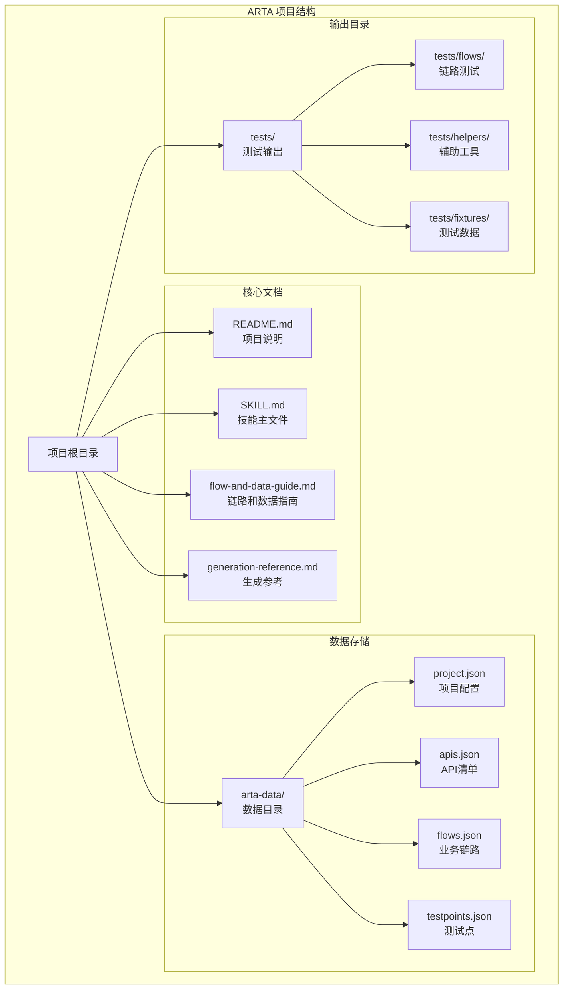
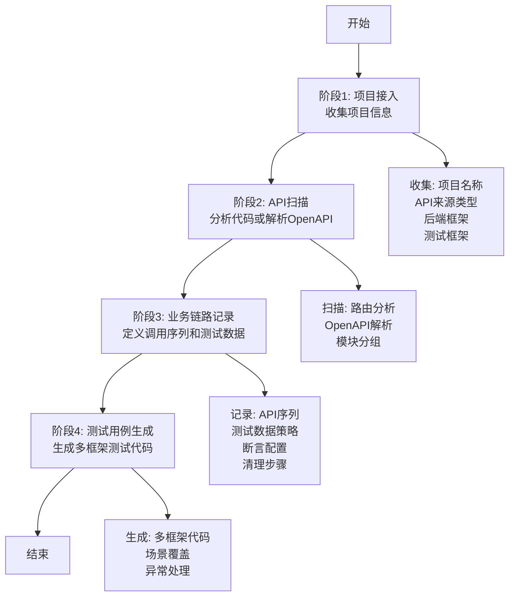
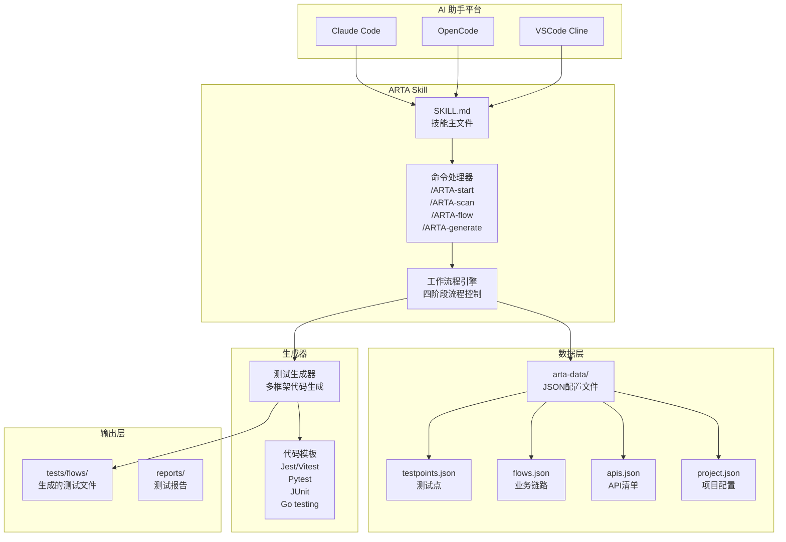
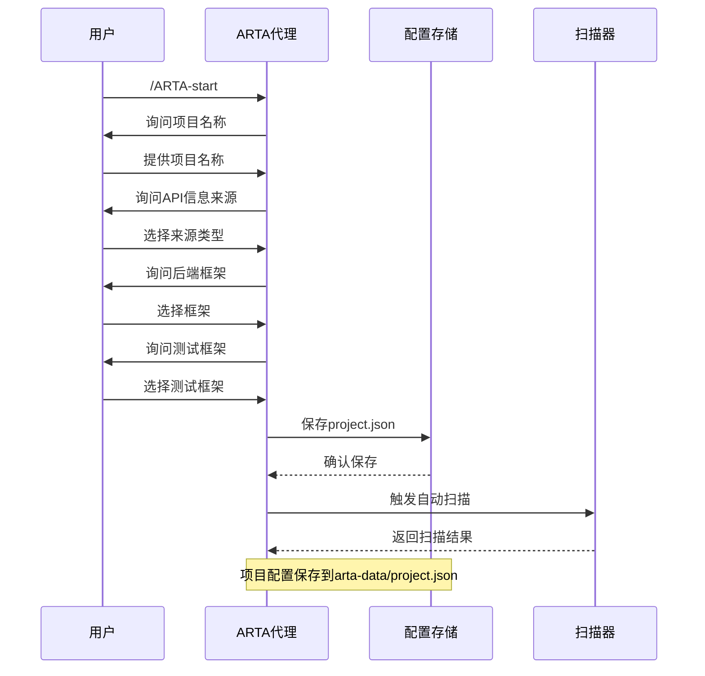
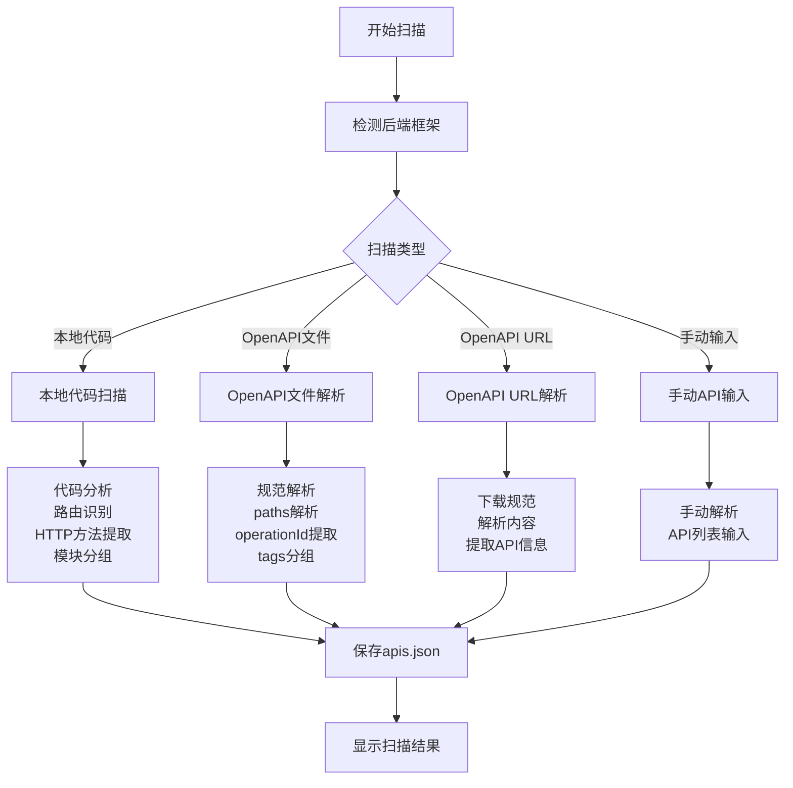
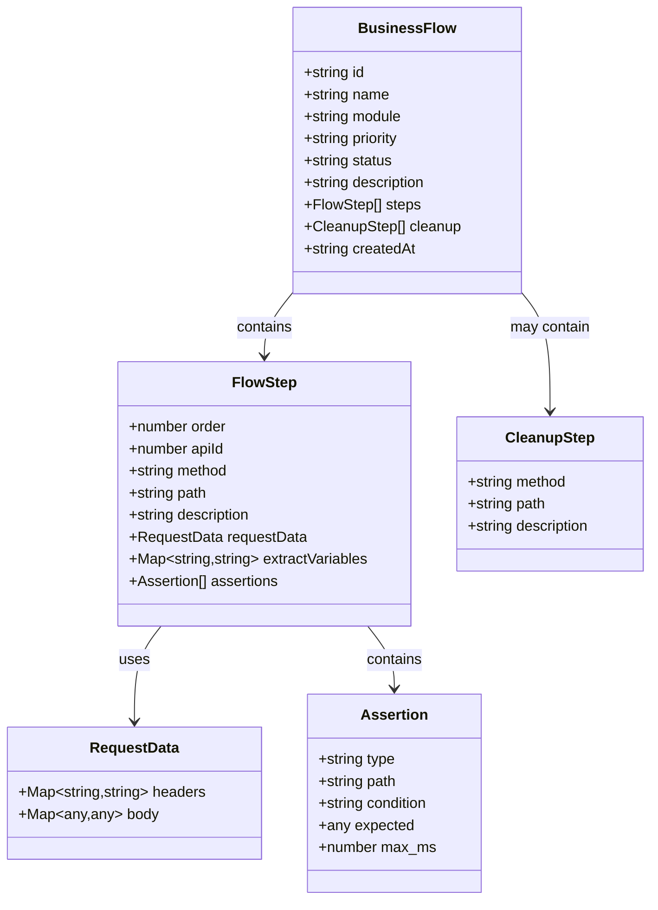
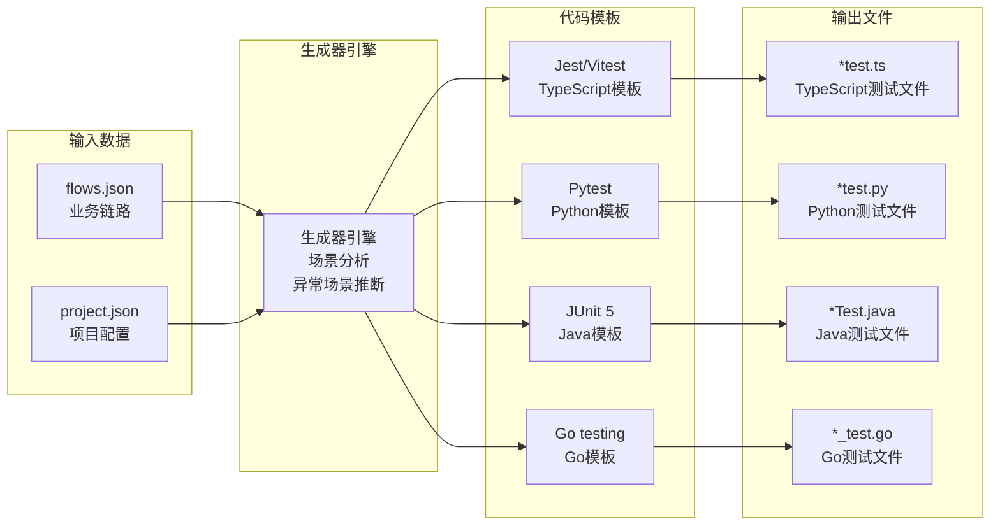
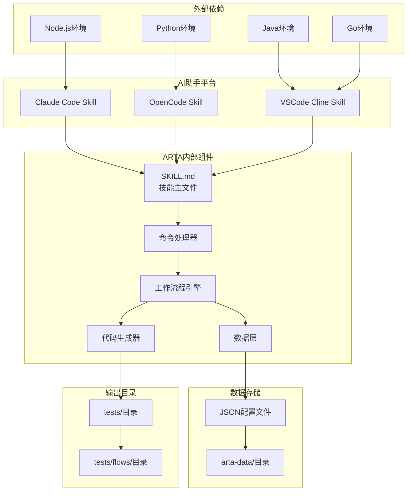

# 技术架构概览

<cite>
**本文档引用的文件**
- [README.md](file://README.md)
- [SKILL.md](file://SKILL.md)
- [flow-and-data-guide.md](file://flow-and-data-guide.md)
- [generation-reference.md](file://generation-reference.md)
</cite>

## 目录
1. [简介](#简介)
2. [项目结构](#项目结构)
3. [核心组件](#核心组件)
4. [架构总览](#架构总览)
5. [详细组件分析](#详细组件分析)
6. [依赖关系分析](#依赖关系分析)
7. [性能考虑](#性能考虑)
8. [故障排除指南](#故障排除指南)
9. [结论](#结论)

## 简介

ARTA（Automation Regression Test Assistant）是一个端到端的 API 自动化测试流程引导工具，专为 AI 助手技能（Skill）设计。该项目旨在帮助开发团队从项目接入到测试用例生成的完整测试流程，通过四阶段工作流程实现智能化的测试自动化。

ARTA 支持多种主流后端框架和测试框架，包括 Express/NestJS、Flask/Django/FastAPI、Spring Boot、Gin/Echo 等，并能够生成 TypeScript/Jest、Python/Pytest、Java/JUnit、Go/testing 等多种测试框架的代码。

## 项目结构

ARTA 项目采用简洁明了的文档驱动架构，主要包含四个核心文档文件：

**图表来源**
- [README.md: 151-162:151-162](file://README.md#L151-L162)
- [SKILL.md: 419-431:419-431](file://SKILL.md#L419-L431)

**章节来源**
- [README.md: 1-176:1-176](file://README.md#L1-L176)
- [SKILL.md: 1-443:1-443](file://SKILL.md#L1-L443)

## 核心组件

### 四阶段工作流程

ARTA 实现了完整的四阶段测试工作流程，每个阶段都有明确的目标和输出：

**图表来源**
- [README.md: 7-12:7-12](file://README.md#L7-L12)
- [SKILL.md: 10-16:10-16](file://SKILL.md#L10-L16)

### 技术栈支持矩阵

ARTA 支持多种技术组合，为不同语言和框架的项目提供测试自动化能力：

| 后端框架 | 测试框架 | 语言 |
|---------|---------|------|
| Express, NestJS | Jest, Vitest, Mocha | TypeScript |
| Flask, Django, FastAPI | Pytest | Python |
| Spring Boot | JUnit 5 | Java |
| Gin, Echo | Go testing | Go |

**章节来源**
- [README.md: 22-30:22-30](file://README.md#L22-L30)
- [SKILL.md: 24-28:24-28](file://SKILL.md#L24-L28)

## 架构总览

ARTA 采用基于 AI 助手技能的架构设计，通过自然语言交互实现测试流程自动化：

**图表来源**
- [README.md: 33-54:33-54](file://README.md#L33-L54)
- [SKILL.md: 34-78:34-78](file://SKILL.md#L34-L78)

## 详细组件分析

### 项目接入组件（Phase 1）

项目接入组件负责初始化测试项目，收集必要的配置信息：

**图表来源**
- [SKILL.md: 34-78:34-78](file://SKILL.md#L34-L78)
- [README.md: 66-100:66-100](file://README.md#L66-L100)

项目配置文件结构：
- 项目名称（name）
- 后端框架（framework）
- 测试框架（testFramework）
- API来源类型（apiSource.type）
- API来源路径（apiSource.path）
- 创建时间（createdAt）

**章节来源**
- [SKILL.md: 65-75:65-75](file://SKILL.md#L65-L75)

### API扫描组件（Phase 2）

API扫描组件支持多种扫描方式，包括本地代码分析和OpenAPI规范解析：

**图表来源**
- [SKILL.md: 81-140:81-140](file://SKILL.md#L81-L140)

框架识别规则：
- Express/NestJS: 路由装饰器和方法调用
- Flask/Django: URL模式和路由装饰器
- Spring Boot: 注解式路由映射
- Gin/Echo: 路由注册方法

**章节来源**
- [SKILL.md: 87-106:87-106](file://SKILL.md#L87-L106)
- [SKILL.md: 107-117:107-117](file://SKILL.md#L107-L117)

### 业务链路记录组件（Phase 3）

业务链路记录组件实现了完整的业务场景建模能力：

**图表来源**
- [flow-and-data-guide.md: 5-75:5-75](file://flow-and-data-guide.md#L5-L75)

测试数据策略支持四种类型：
1. **固定值**: 直接指定的常量值
2. **生成数据**: 使用内置函数动态生成（uuid、timestamp、random_email等）
3. **引用上游**: 从前面步骤的响应中提取数据
4. **环境变量**: 从运行时环境获取配置

断言类型包括：
- HTTP状态码断言
- JSON路径断言（存在、等于、包含、类型检查）
- 响应时间断言
- 响应头断言

**章节来源**
- [flow-and-data-guide.md: 77-145:77-145](file://flow-and-data-guide.md#L77-L145)

### 测试用例生成组件（Phase 4）

测试用例生成组件支持多框架代码生成，每个框架都有专门的代码模板：

**图表来源**
- [SKILL.md: 297-377:297-377](file://SKILL.md#L297-L377)
- [generation-reference.md: 5-304:5-304](file://generation-reference.md#L5-L304)

生成策略包括：
- 正向流程场景（完整业务链路）
- 单步正向场景（每个API单独测试）
- 关键异常场景（认证失败、资源不存在、参数错误等）

**章节来源**
- [generation-reference.md: 218-241:218-241](file://generation-reference.md#L218-L241)

## 依赖关系分析

ARTA 项目各组件之间的依赖关系清晰明确：

**图表来源**
- [README.md: 33-54:33-54](file://README.md#L33-L54)
- [SKILL.md: 419-431:419-431](file://SKILL.md#L419-L431)

**章节来源**
- [README.md: 33-54:33-54](file://README.md#L33-L54)
- [SKILL.md: 419-431:419-431](file://SKILL.md#L419-L431)

## 性能考虑

ARTA 在设计时充分考虑了性能优化和用户体验：

### 数据存储优化
- 使用轻量级 JSON 文件存储，便于版本控制和迁移
- 数据文件按功能模块分离，避免单文件过大
- 支持增量更新，减少不必要的文件写入

### 扫描性能优化
- 智能框架检测，避免全盘扫描
- 支持缓存机制，重复扫描时跳过已识别的API
- 并行处理多个API端点的解析

### 生成性能优化
- 模板预编译，减少运行时模板解析开销
- 支持增量生成，只重新生成变更的链路
- 代码生成过程中的内存管理

## 故障排除指南

### 常见问题及解决方案

**问题1: API扫描不完整**
- 检查项目框架识别是否正确
- 确认源代码目录结构符合框架约定
- 验证OpenAPI文件格式是否正确

**问题2: 业务链路生成失败**
- 检查flows.json格式是否正确
- 确认API序列引用的步骤是否存在
- 验证测试数据引用是否正确

**问题3: 测试框架生成错误**
- 检查项目配置中的测试框架设置
- 确认对应语言环境已正确安装
- 验证生成的代码模板是否适用

**问题4: 数据存储访问问题**
- 检查arta-data目录权限
- 确认磁盘空间充足
- 验证JSON文件格式有效性

**章节来源**
- [SKILL.md: 434-443:434-443](file://SKILL.md#L434-L443)

## 结论

ARTA 项目展现了优秀的软件工程实践，通过清晰的架构设计和完善的文档体系，为 AI 助手技能平台提供了强大的测试自动化能力。项目的核心优势包括：

1. **模块化设计**: 四个独立的功能模块各司其职，便于维护和扩展
2. **多平台兼容**: 支持多种 AI 助手平台和测试框架
3. **数据驱动**: 基于 JSON 配置文件的纯文本存储方案
4. **智能化生成**: 通过业务链路自动推断测试场景和异常处理
5. **开放性架构**: 易于添加新的框架支持和测试生成模板

该架构为后续的功能扩展和技术演进奠定了坚实基础，特别是在 AI 助手技能领域具有重要的参考价值。