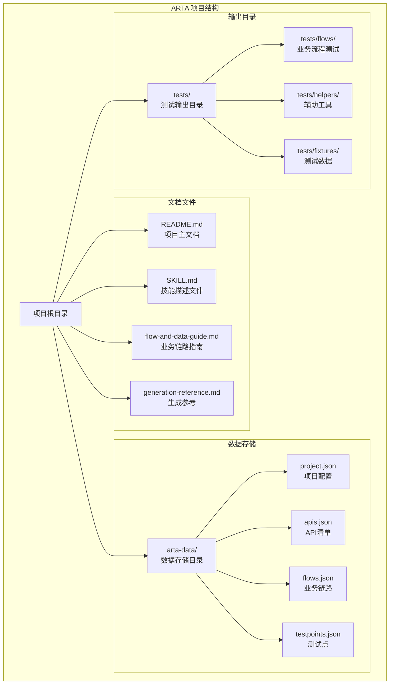
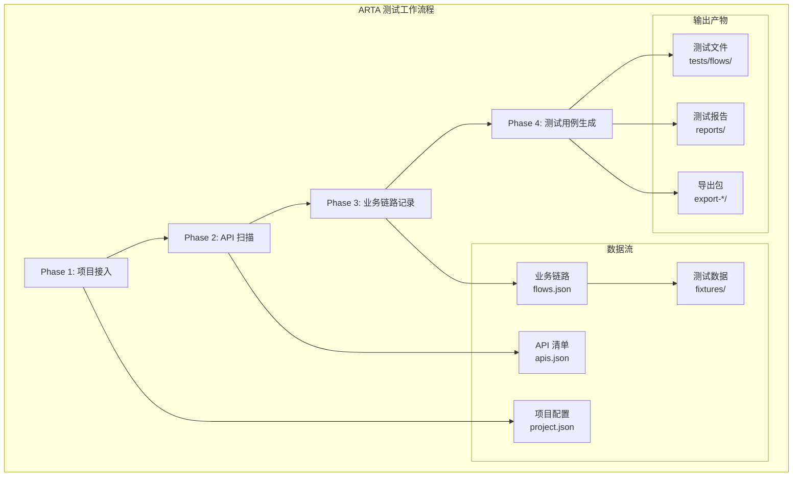
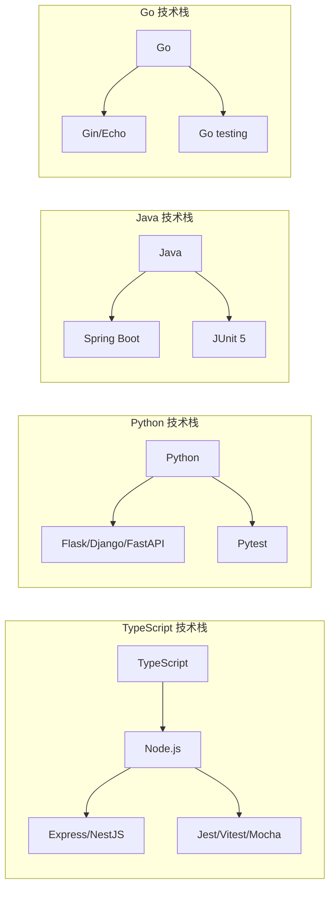
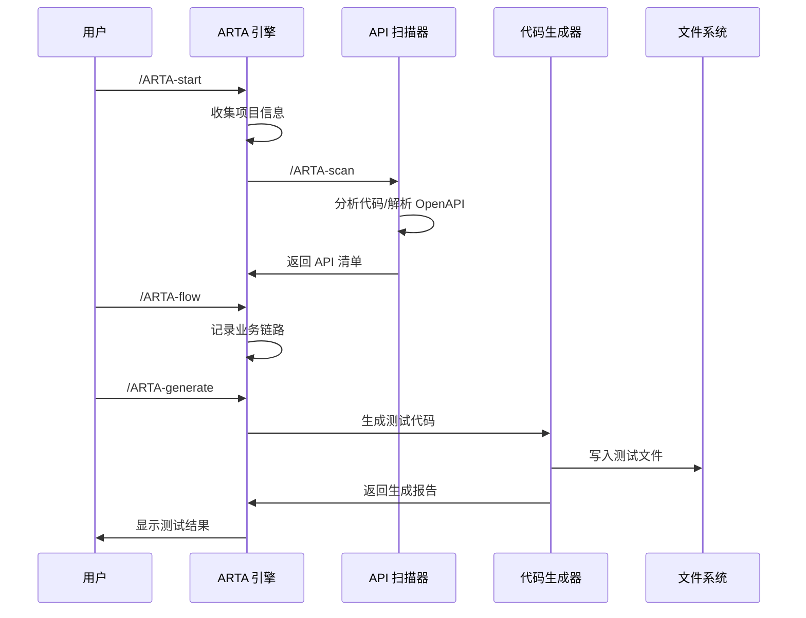

# 支持的技术栈

<cite>
**本文档引用的文件**
- [README.md](file://README.md)
- [SKILL.md](file://SKILL.md)
- [flow-and-data-guide.md](file://flow-and-data-guide.md)
- [generation-reference.md](file://generation-reference.md)
</cite>

## 目录
1. [简介](#简介)
2. [项目结构](#项目结构)
3. [核心组件](#核心组件)
4. [架构概览](#架构概览)
5. [详细组件分析](#详细组件分析)
6. [依赖关系分析](#依赖关系分析)
7. [性能考虑](#性能考虑)
8. [故障排除指南](#故障排除指南)
9. [结论](#结论)
10. [附录](#附录)

## 简介

ARTA（Automation Regression Test Assistant）是一个端到端 API 自动化测试流程引导工具，专为帮助开发团队从项目接入到测试用例生成的完整流程而设计。该项目的核心价值在于其强大的技术栈支持能力，能够为不同技术背景的团队提供统一的测试工作流程。

ARTA 支持四种主要编程语言：TypeScript、Python、Java 和 Go，以及与之配套的主流后端框架和测试框架组合。这种多语言支持使得 ARTA 能够适应现代软件开发团队的多样化技术栈需求。

## 项目结构

ARTA 项目采用简洁而功能明确的文件组织结构：

**图表来源**
- [README.md: 151-162:151-162](file://README.md#L151-L162)
- [SKILL.md: 419-431:419-431](file://SKILL.md#L419-L431)

**章节来源**
- [README.md: 1-176:1-176](file://README.md#L1-L176)
- [SKILL.md: 1-443:1-443](file://SKILL.md#L1-L443)

## 核心组件

### 技术栈矩阵

ARTA 支持以下技术栈组合：

| 后端框架 | 测试框架 | 语言 |
|---------|---------|------|
| Express, NestJS | Jest, Vitest, Mocha | TypeScript |
| Flask, Django, FastAPI | Pytest | Python |
| Spring Boot | JUnit 5 | Java |
| Gin, Echo | Go testing | Go |

### 支持的后端框架特性

**Node.js 生态系统**
- **Express**: 最流行的 Node.js Web 框架，支持中间件和路由系统
- **NestJS**: 企业级 Node.js 框架，基于 TypeScript，提供模块化架构

**Python 生态系统**
- **Flask**: 轻量级 WSGI 应用框架，易于上手
- **Django**: 全功能 Web 框架，内置 ORM 和管理界面
- **FastAPI**: 现代化、高性能的 API 框架，自动文档生成

**Java 生态系统**
- **Spring Boot**: 最流行的 Java 微服务框架，简化配置

**Go 生态系统**
- **Gin**: 高性能 HTTP Web 框架
- **Echo**: 轻量级高性能 Web 框架

**章节来源**
- [README.md: 22-29:22-29](file://README.md#L22-L29)
- [SKILL.md: 45-46:45-46](file://SKILL.md#L45-L46)

## 架构概览

ARTA 采用分阶段的测试工作流程架构，每个阶段都有明确的目标和输出：

**图表来源**
- [README.md: 7-12:7-12](file://README.md#L7-L12)
- [SKILL.md: 34-78:34-78](file://SKILL.md#L34-L78)

## 详细组件分析

### TypeScript 技术栈分析

#### 框架支持矩阵

| 框架 | 关键特征 | 测试框架支持 |
|------|----------|-------------|
| Express | 路由定义: app.get/post/put/delete() 中间件支持 | Jest, Vitest, Mocha |
| NestJS | 装饰器: @Get(), @Post(), @Controller() 模块系统 | Jest, Vitest, Mocha |

#### 配置要点

**项目初始化配置**
- 项目名称和基础信息
- API 信息来源选择（本地代码/OpenAPI）
- 后端框架选择
- 测试框架选择

**API 扫描策略**
- 基于文件扩展名识别框架
- 正则表达式匹配路由定义
- 自动模块分组
- 支持 OpenAPI/Swagger 规范解析

**测试生成配置**
- 文件命名约定: `{flow_name}.test.ts` 或 `{flow_name}.spec.ts`
- 支持 4 种测试数据类型
- 自动生成断言规则
- 环境变量支持

**章节来源**
- [SKILL.md: 87-106:87-106](file://SKILL.md#L87-L106)
- [SKILL.md: 312-321:312-321](file://SKILL.md#L312-L321)

### Python 技术栈分析

#### 框架支持矩阵

| 框架 | 关键特征 | 测试框架支持 |
|------|----------|-------------|
| Flask | 装饰器: @app.route(), @blueprint.route() | Pytest |
| Django | urlpatterns, path(), re_path() | Pytest |
| FastAPI | 装饰器: @app.get(), @router.post() | Pytest |

#### 配置要点

**测试数据策略**
- 固定值: 直接指定常量
- 生成数据: `{{函数()}}` 语法
- 引用上游: `${步骤.字段}` 语法
- 环境变量: `$ENV{变量}` 语法

**断言类型**
- HTTP 状态码断言
- JSONPath 断言
- 响应时间断言
- 响应头断言

**章节来源**
- [SKILL.md: 179-221:179-221](file://SKILL.md#L179-L221)
- [flow-and-data-guide.md: 133-145:133-145](file://flow-and-data-guide.md#L133-L145)

### Java 技术栈分析

#### 框架支持矩阵

| 框架 | 关键特征 | 测试框架支持 |
|------|----------|-------------|
| Spring Boot | 装饰器: @GetMapping, @PostMapping, @RequestMapping | JUnit 5 |

#### 配置要点

**测试文件结构**
- 文件命名: `{FlowName}Test.java`
- 类级别测试组织
- 静态变量共享
- 生命周期管理

**HTTP 客户端集成**
- Java HTTP 客户端
- JSON 处理
- 异常处理

**章节来源**
- [SKILL.md: 318](file://SKILL.md#L318)
- [generation-reference.md: 131-168:131-168](file://generation-reference.md#L131-L168)

### Go 技术栈分析

#### 框架支持矩阵

| 框架 | 关键特征 | 测试框架支持 |
|------|----------|-------------|
| Gin | r.GET(), r.POST(), group.GET() | Go testing |
| Echo | e.GET(), e.POST(), g.GET() | Go testing |

#### 配置要点

**测试文件结构**
- 文件命名: `{flow_name}_test.go`
- 测试函数命名: `Test{FlowName}(t *testing.T)`
- 上下文变量管理
- 清理函数使用

**HTTP 客户端集成**
- net/http 包
- JSON 编码解码
- 错误处理机制

**章节来源**
- [SKILL.md: 319](file://SKILL.md#L319)
- [generation-reference.md: 170-216:170-216](file://generation-reference.md#L170-L216)

## 依赖关系分析

### 技术栈依赖关系

**图表来源**
- [README.md: 22-29:22-29](file://README.md#L22-L29)
- [SKILL.md: 45-46:45-46](file://SKILL.md#L45-L46)

### 数据流依赖关系

**图表来源**
- [SKILL.md: 301-311:301-311](file://SKILL.md#L301-L311)
- [README.md: 56-83:56-83](file://README.md#L56-L83)

**章节来源**
- [SKILL.md: 301-377:301-377](file://SKILL.md#L301-L377)

## 性能考虑

### 测试生成性能优化

**并发处理策略**
- 多链路并行生成
- 异步 API 调用
- 内存使用优化

**文件系统操作**
- 批量文件写入
- 缓存机制
- 增量更新

**网络请求优化**
- 连接池复用
- 超时配置
- 重试机制

### 版本兼容性

**TypeScript 生态系统**
- Node.js 16+
- TypeScript 4.0+
- Jest 27+, Vitest 0.28+, Mocha 9+

**Python 生态系统**
- Python 3.7+
- Flask 2.0+, Django 3.2+, FastAPI 0.68+
- Pytest 6.0+

**Java 生态系统**
- Java 8+
- Spring Boot 2.5+
- JUnit 5.7+

**Go 生态系统**
- Go 1.16+
- Gin 1.7+, Echo 4.0+
- Go testing 内置

## 故障排除指南

### 常见问题及解决方案

**API 扫描失败**
- 检查项目路径权限
- 验证框架标识符正确性
- 确认源代码可读性

**测试生成错误**
- 检查链路完整性
- 验证测试数据语法
- 确认环境变量设置

**文件写入失败**
- 检查磁盘空间
- 验证输出目录权限
- 确认文件锁定状态

**数据引用错误**
- 检查步骤顺序
- 验证变量命名
- 确认 JSONPath 表达式

**章节来源**
- [SKILL.md: 434-443:434-443](file://SKILL.md#L434-L443)

### 最佳实践建议

**项目初始化**
- 明确技术栈选择
- 设计合理的业务链路
- 建立测试数据策略

**API 扫描**
- 保持代码规范
- 完善 API 文档
- 定期更新扫描范围

**业务链路设计**
- 优先级排序
- 异常场景覆盖
- 数据清理策略

**测试生成**
- 代码模板定制
- 断言规则优化
- 性能监控集成

## 结论

ARTA 项目通过其全面的技术栈支持能力，为现代软件开发团队提供了一个强大而灵活的自动化测试解决方案。其四大技术栈组合（TypeScript/Python/Java/Go）覆盖了当前主流的开发语言，配合相应的后端框架和测试框架，能够满足不同规模和复杂度的项目需求。

项目的核心优势在于：
- **多语言支持**: 覆盖现代软件开发的主要语言
- **标准化流程**: 四阶段测试工作流程确保质量
- **智能化生成**: 基于业务链路自动生成测试代码
- **灵活配置**: 支持多种测试数据和断言策略

通过合理选择技术栈组合，团队可以显著提升测试效率和质量，同时降低维护成本。

## 附录

### 配置示例参考

**项目配置示例**
- 项目名称: `my-api-project`
- 框架: `Express`
- 测试框架: `jest`
- API 来源: `local`

**API 清单示例**
- 方法: `POST`
- 路径: `/api/auth/login`
- 描述: `用户登录`
- 模块: `认证`

**业务链路示例**
- 链路名称: `用户下单流程`
- 优先级: `P0`
- 步骤数量: `6`
- 状态: `done`

### 版本兼容性矩阵

| 技术栈 | 最低版本 | 推荐版本 | 兼容性 |
|--------|----------|----------|--------|
| TypeScript | 4.0 | 5.0+ | ✅ 完全兼容 |
| Node.js | 16 | 18+ | ✅ 推荐升级 |
| Python | 3.7 | 3.9+ | ✅ 推荐升级 |
| Java | 8 | 11+ | ✅ 推荐升级 |
| Go | 1.16 | 1.19+ | ✅ 推荐升级 |

**章节来源**
- [README.md: 31-55:31-55](file://README.md#L31-L55)
- [SKILL.md: 65-75:65-75](file://SKILL.md#L65-L75)