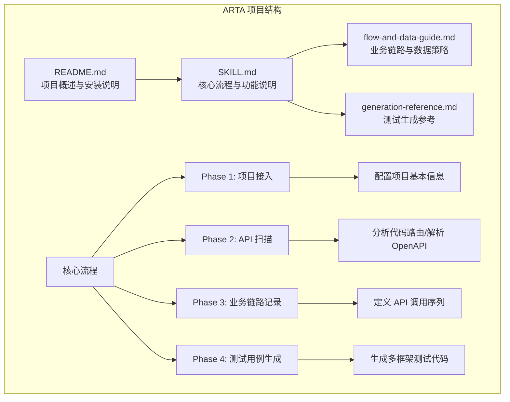
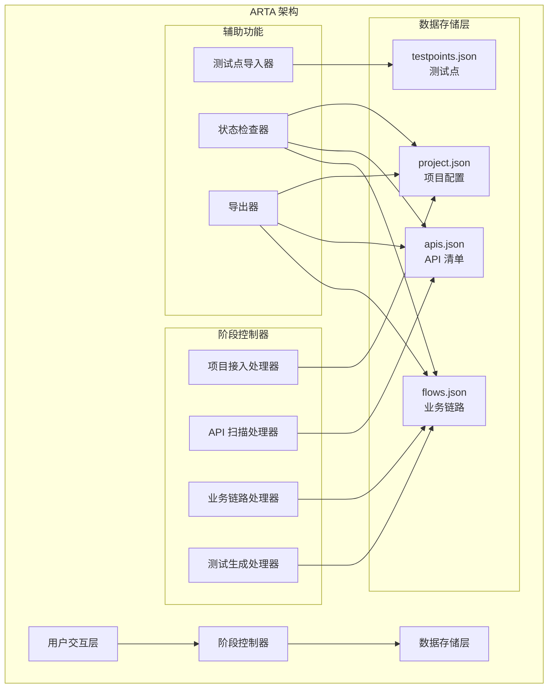
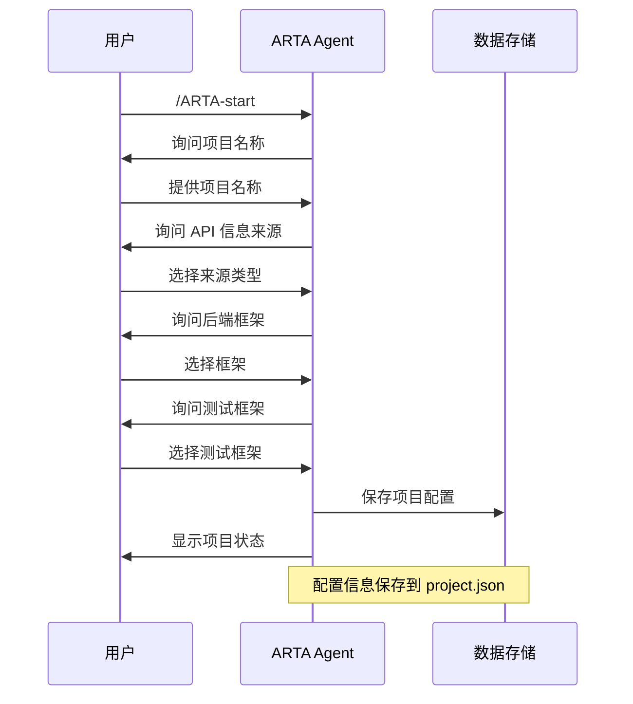
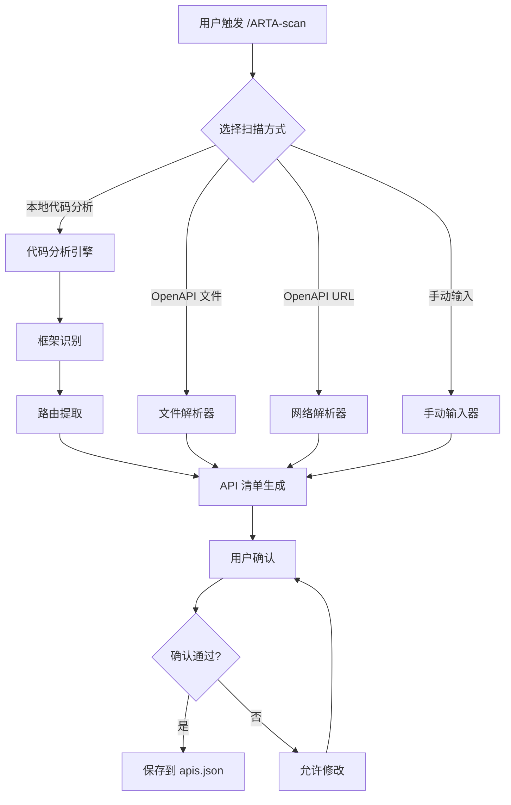
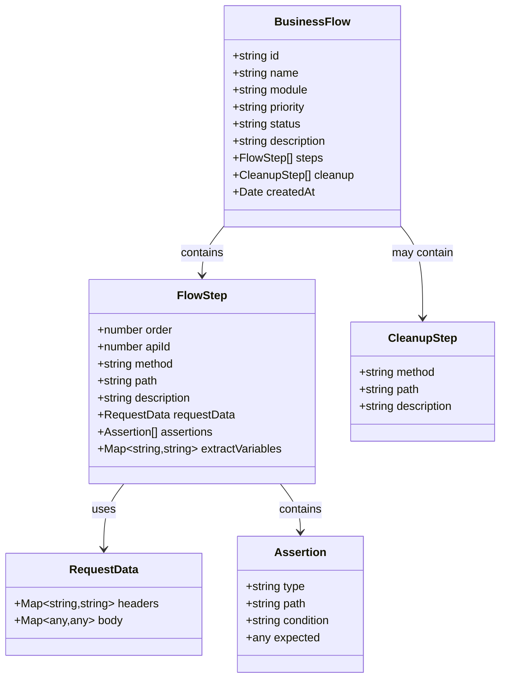
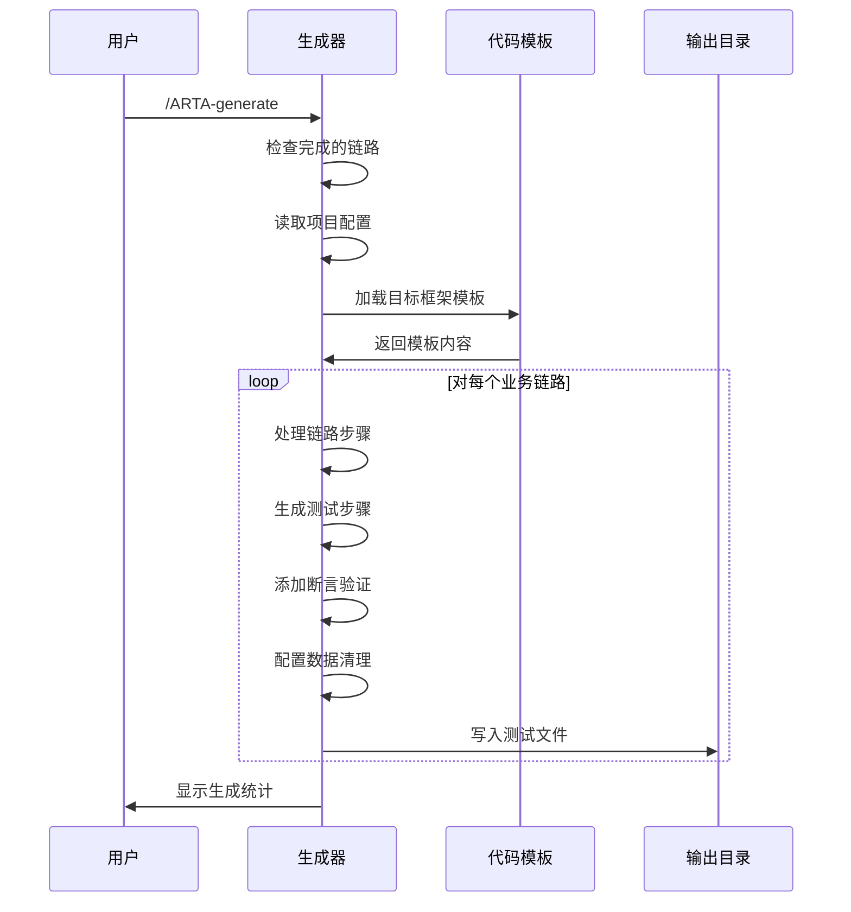
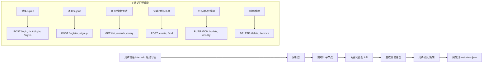
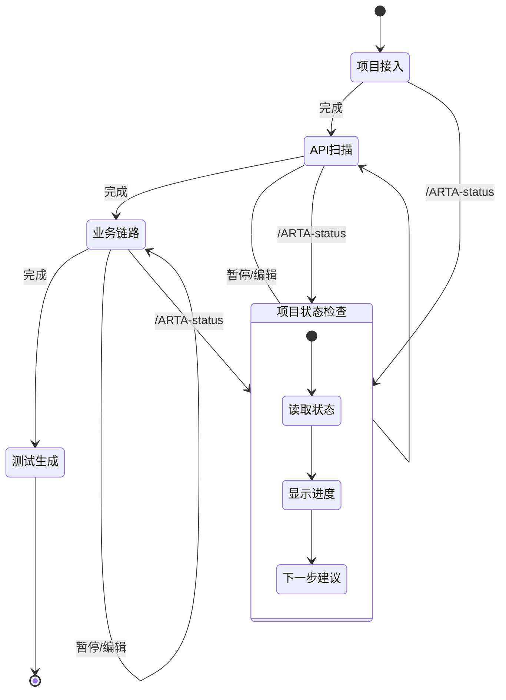

# 核心功能特性

<cite>
**本文档引用的文件**
- [README.md](file://README.md)
- [SKILL.md](file://SKILL.md)
- [flow-and-data-guide.md](file://flow-and-data-guide.md)
- [generation-reference.md](file://generation-reference.md)
</cite>

## 目录
1. [简介](#简介)
2. [项目结构](#项目结构)
3. [核心组件](#核心组件)
4. [架构概览](#架构概览)
5. [详细组件分析](#详细组件分析)
6. [依赖关系分析](#依赖关系分析)
7. [性能考虑](#性能考虑)
8. [故障排除指南](#故障排除指南)
9. [结论](#结论)

## 简介

ARTA（Automation Regression Test Assistant）是一个端到端的 API 自动化测试流程引导工具，专为开发团队设计，旨在简化从项目接入到测试用例生成的完整测试工作流程。该工具通过四个阶段的测试工作流程，为用户提供了一个系统化的自动化回归测试解决方案。

ARTA 的设计理念是通过自然语言交互简化复杂的测试流程，让测试工程师能够专注于业务逻辑而非技术细节。工具支持多种主流技术栈，包括 Express/NestJS、Flask/Django/FastAPI、Spring Boot、Gin/Echo 等后端框架，以及 Jest/Vitest、Pytest、JUnit 5、Go testing 等测试框架。

## 项目结构

ARTA 项目采用简洁而功能完整的文档结构，主要包含四个核心文件：



**图表来源**
- [README.md:1-176](file://README.md#L1-L176)
- [SKILL.md:1-443](file://SKILL.md#L1-L443)

**章节来源**
- [README.md:1-176](file://README.md#L1-L176)
- [SKILL.md:1-443](file://SKILL.md#L1-L443)

## 核心组件

ARTA 的核心功能围绕四个主要阶段构建，每个阶段都有其特定的功能和价值：

### 1. 项目接入阶段（Phase 1）

项目接入阶段负责初始化测试项目，收集必要的配置信息。这一阶段的关键功能包括：

- **项目信息收集**：项目名称、API 信息来源、后端框架选择、测试框架配置
- **配置持久化**：将项目配置保存到 `arta-data/project.json` 文件
- **智能引导**：根据用户选择自动进入相应的后续阶段

### 2. API 扫描阶段（Phase 2）

API 扫描阶段负责自动发现和分析项目中的 API 端点。该阶段支持多种扫描方式：

- **本地代码分析**：自动识别不同框架的路由定义
- **OpenAPI 解析**：支持 OpenAPI 3.0/3.1 和 Swagger 2.0 规范
- **智能分类**：按路径前缀自动分组为模块

### 3. 业务链路记录阶段（Phase 3）

业务链路记录阶段是 ARTA 的核心创新，它将复杂的 API 调用序列转化为可执行的测试场景：

- **链路定义**：定义完整的业务场景 API 调用序列
- **测试数据策略**：支持四种数据类型（固定值、生成数据、引用上游、环境变量）
- **断言配置**：灵活的断言规则配置
- **CRUD 处理**：针对不同类型的 API 提供专门的处理策略

### 4. 测试用例生成阶段（Phase 4）

测试用例生成阶段将业务链路转换为实际可执行的测试代码：

- **多框架支持**：一次配置，生成多种测试框架代码
- **场景覆盖**：默认生成正向流程、单步正向、关键异常场景
- **代码模板**：提供各框架的标准代码模板

**章节来源**
- [SKILL.md:34-295](file://SKILL.md#L34-L295)
- [README.md:7-20](file://README.md#L7-L20)

## 架构概览

ARTA 采用模块化的架构设计，通过清晰的数据流和控制流实现端到端的测试工作流程：



**图表来源**
- [SKILL.md:197-443](file://SKILL.md#L197-L443)
- [README.md:151-162](file://README.md#L151-L162)

该架构的核心特点包括：

1. **阶段化设计**：每个阶段都有明确的职责和输出
2. **数据驱动**：所有状态都持久化存储，支持断点续作
3. **扩展性**：新的技术栈和测试框架可以轻松集成
4. **用户友好**：支持自然语言交互，降低学习成本

## 详细组件分析

### 项目接入组件分析

项目接入组件负责初始化测试项目，是整个工作流程的起点。



**图表来源**
- [SKILL.md:34-78](file://SKILL.md#L34-L78)
- [README.md:86-100](file://README.md#L86-L100)

项目接入的关键特性：
- **智能引导**：根据用户选择自动跳转到相应阶段
- **配置验证**：确保所有必需信息都已收集
- **状态跟踪**：实时显示项目进度

### API 扫描组件分析

API 扫描组件支持多种扫描方式，适应不同的项目结构和需求。



**图表来源**
- [SKILL.md:81-140](file://SKILL.md#L81-L140)
- [README.md:102-113](file://README.md#L102-L113)

API 扫描的核心能力：
- **多框架支持**：支持 8 种主流后端框架
- **智能识别**：通过文件特征自动识别框架类型
- **灵活配置**：支持多种 API 规范格式

### 业务链路记录组件分析

业务链路记录是 ARTA 的核心创新，它将抽象的业务需求转化为可执行的测试场景。



**图表来源**
- [flow-and-data-guide.md:5-75](file://flow-and-data-guide.md#L5-L75)

业务链路记录的高级特性：

#### 测试数据策略

ARTA 提供了四种灵活的测试数据类型：

| 类型 | 语法 | 示例 | 使用场景 |
|------|------|------|----------|
| 固定值 | 直接写值 | `"testuser001"` | 已知的测试账号或配置 |
| 生成数据 | `{{函数()}}` | `{{uuid()}}`, `{{random_email()}}` | 避免数据冲突，动态生成 |
| 引用上游 | `${步骤.字段}` | `${login.response.token}` | 跨步骤数据传递 |
| 环境变量 | `$ENV{变量}` | `$ENV{BASE_URL}` | 环境配置 |

#### 断言配置系统

ARTA 支持多种断言类型，满足不同场景的需求：

| 类型 | 说明 | 示例 |
|------|------|------|
| `status` | HTTP 状态码 | `{ "type": "status", "expected": 200 }` |
| `jsonpath` + `exists` | 字段存在 | `{ "path": "$.data.token", "condition": "exists" }` |
| `jsonpath` + `equals` | 值相等 | `{ "path": "$.data.status", "condition": "equals", "expected": "active" }` |
| `jsonpath` + `contains` | 包含字符串 | `{ "path": "$.message", "condition": "contains", "expected": "success" }` |
| `response_time` | 响应时间 | `{ "type": "response_time", "max_ms": 1000 }` |
| `header` | 响应头 | `{ "type": "header", "name": "Content-Type", "contains": "application/json" }` |

#### CRUD 接口处理策略

针对不同类型的 API，ARTA 提供了专门的测试策略：

**创建接口测试场景：**
1. 创建成功 - 必填字段完整
2. 创建失败 - 缺少必填字段  
3. 创建失败 - 字段格式错误
4. 创建失败 - 重复创建（唯一约束）

**更新接口测试场景：**
1. 更新成功 - 有效字段
2. 更新失败 - 资源不存在
3. 更新失败 - 无权限
4. 部分更新 - 只修改部分字段

**删除接口测试场景：**
1. 删除成功 - 存在的资源
2. 删除失败 - 不存在的资源
3. 删除失败 - 无权限
4. 级联删除验证

**查询接口测试场景：**
1. 查询成功 - 有数据
2. 查询成功 - 无数据（空结果）
3. 分页查询 - 默认分页
4. 条件筛选 - 各筛选参数
5. 查询失败 - 无权限

### 测试用例生成组件分析

测试用例生成组件将业务链路转换为实际可执行的测试代码，支持多种测试框架。



**图表来源**
- [SKILL.md:297-377](file://SKILL.md#L297-L377)
- [generation-reference.md:218-286](file://generation-reference.md#L218-L286)

测试用例生成的关键特性：

#### 多框架支持

ARTA 支持以下测试框架和语言组合：

| 框架 | 语言 | 文件命名 |
|------|------|----------|
| Jest / Vitest | TypeScript | `{flow_name}.test.ts` |
| Mocha | TypeScript | `{flow_name}.spec.ts` |
| Pytest | Python | `test_{flow_name}.py` |
| JUnit 5 | Java | `{FlowName}Test.java` |
| Go testing | Go | `{flow_name}_test.go` |

#### 场景覆盖策略

每个业务链路默认生成以下测试场景：

| 场景类型 | 说明 | 数量 |
|----------|------|------|
| 正向流程 | 完整业务链路端到端 | 1 |
| 单步正向 | 每个 API 单独的成功场景 | N (API数量) |
| 关键异常 | 认证失败、资源不存在、参数错误 | 2-4 |

#### 异常场景自动建议

根据 API 特征，ARTA 自动建议可能的异常场景：

| API 特征 | 建议异常场景 |
|----------|-------------|
| 需要认证 | 401 未认证 / token过期 |
| POST 创建 | 400 缺少必填字段 / 409 重复创建 |
| GET 带路径参数 | 404 资源不存在 |
| PUT/PATCH 更新 | 403 无权限 / 404 不存在 |
| DELETE 删除 | 403 无权限 / 404 不存在 |

### 测试点导入组件分析

测试点导入功能允许用户从 Mermaid 思维导图导入测试点，实现快速测试用例生成。



**图表来源**
- [SKILL.md:261-295](file://SKILL.md#L261-L295)

测试点导入的核心流程：
1. **思维导图解析**：识别 Mermaid mindmap 语法
2. **测试点提取**：从叶子节点提取测试点
3. **API 匹配**：通过关键词匹配相关 API
4. **建议生成**：为每个测试点生成测试用例建议
5. **用户交互**：允许用户确认、编辑或跳过

### 高级特性分析

#### 断点续作机制

ARTA 实现了完整的断点续作机制，支持用户在任意阶段暂停和继续：



**图表来源**
- [SKILL.md:380-443](file://SKILL.md#L380-L443)

#### 增量操作支持

ARTA 支持增量操作，允许用户随时添加新内容而不影响现有工作：

- **新增 API**：在现有 API 清单基础上添加新端点
- **新增链路**：添加新的业务场景测试
- **修改配置**：更新项目配置而不需要重新开始
- **部分生成**：只生成已完成的链路测试

#### 智能提醒系统

ARTA 具备智能提醒功能，帮助用户避免常见测试陷阱：

- **CRUD 清理提醒**：检测到写入操作时建议添加清理步骤
- **数据一致性提醒**：删除 API 时提醒关联链路
- **状态变更提醒**：编辑链路时同步更新相关状态

**章节来源**
- [SKILL.md:143-295](file://SKILL.md#L143-L295)
- [flow-and-data-guide.md:146-218](file://flow-and-data-guide.md#L146-L218)
- [generation-reference.md:218-304](file://generation-reference.md#L218-L304)

## 依赖关系分析

ARTA 的依赖关系相对简单但功能完整，主要依赖于以下组件：

```mermaid
graph TB
subgraph "外部依赖"
A[AI 编程助手<br/>Claude Code/OpenCode/VSCode Cline]
B[项目代码仓库]
C[测试框架<br/>Jest/Vitest/Pytest/JUnit/Go testing]
end
subgraph "ARTA 内部组件"
D[阶段控制器]
E[数据存储]
F[代码生成器]
G[模板引擎]
end
subgraph "数据文件"
H[project.json]
I[apis.json]
J[flows.json]
K[testpoints.json]
end
A --> D
B --> D
C --> F
D --> E
F --> G
E --> H
E --> I
E --> J
E --> K
subgraph "用户交互"
L[自然语言]
M[/ARTA-* 指令]
end
L --> D
M --> D
```

**图表来源**
- [README.md:31-54](file://README.md#L31-L54)
- [SKILL.md:18-31](file://SKILL.md#L18-L31)

依赖关系的特点：
- **低耦合**：各组件职责明确，相互独立
- **高内聚**：每个组件专注于特定功能领域
- **可扩展**：新的技术栈可以通过插件方式集成
- **用户友好**：支持自然语言交互，降低技术门槛

**章节来源**
- [README.md:31-54](file://README.md#L31-L54)
- [SKILL.md:18-31](file://SKILL.md#L18-L31)

## 性能考虑

ARTA 在设计时充分考虑了性能优化，特别是在处理大型项目和复杂业务场景时：

### 数据存储优化

- **增量更新**：只更新发生变化的部分，减少磁盘 I/O
- **内存缓存**：频繁访问的数据缓存在内存中
- **懒加载**：非关键数据按需加载，提高启动速度

### 生成性能优化

- **并行处理**：多个业务链路可以并行生成测试代码
- **模板复用**：代码模板预编译，避免重复解析
- **增量生成**：只重新生成修改过的链路

### 用户体验优化

- **实时反馈**：生成过程提供进度指示
- **断点续作**：长时间任务可以随时暂停和恢复
- **智能缓存**：重复操作使用缓存结果

## 故障排除指南

### 常见问题及解决方案

#### 1. 项目接入失败

**症状**：`/ARTA-start` 指令无法正常工作

**可能原因**：
- AI 助手未正确加载 ARTA Skill
- 项目目录权限不足
- 网络连接问题（OpenAPI URL 方式）

**解决步骤**：
1. 检查 ARTA Skill 是否正确安装到 AI 助手的 skills 目录
2. 验证项目目录的可访问性
3. 确认网络连接正常（如果是 OpenAPI URL 方式）

#### 2. API 扫描不完整

**症状**：扫描结果显示的 API 数量少于预期

**可能原因**：
- 项目根目录识别错误
- 框架识别失败
- 路由定义不在标准位置

**解决步骤**：
1. 指定正确的项目本地路径
2. 手动选择后端框架类型
3. 检查路由定义是否符合框架约定

#### 3. 业务链路生成错误

**症状**：生成的测试代码包含语法错误

**可能原因**：
- 业务链路配置不完整
- 测试数据引用错误
- 断言规则不正确

**解决步骤**：
1. 使用 `/ARTA-flow` 查看链路详情
2. 检查测试数据的语法和引用
3. 验证断言规则的有效性

#### 4. 测试框架不兼容

**症状**：生成的测试代码无法在目标框架中运行

**可能原因**：
- 项目配置的测试框架与实际不符
- 依赖包版本不兼容
- 环境变量配置错误

**解决步骤**：
1. 检查 `arta-data/project.json` 中的测试框架配置
2. 确认项目依赖包版本
3. 验证环境变量设置

### 调试技巧

#### 使用 `/ARTA-status` 检查状态

定期使用状态检查命令了解项目进度，及时发现问题：

```bash
/ARTA-status
```

#### 导出配置进行分析

使用导出功能将配置和测试文件导出到独立目录进行分析：

```bash
/ARTA-export ./analysis-output
```

#### 日志和错误追踪

- 检查 `arta-data/` 目录下的 JSON 文件完整性
- 查看生成的测试文件中的注释和错误提示
- 使用 AI 助手的调试功能获取详细错误信息

**章节来源**
- [SKILL.md:380-443](file://SKILL.md#L380-L443)
- [README.md:164-176](file://README.md#L164-L176)

## 结论

ARTA 项目通过其精心设计的四阶段测试工作流程，为现代软件开发团队提供了一个强大而易用的自动化回归测试解决方案。该项目的核心优势在于：

### 设计理念优势

1. **自然语言优先**：通过自然语言交互简化复杂的测试流程，降低了技术门槛
2. **模块化架构**：清晰的阶段划分和职责分离，便于维护和扩展
3. **数据驱动**：所有状态都持久化存储，支持断点续作和增量操作
4. **智能提醒**：内置的智能提醒系统帮助用户避免常见测试陷阱

### 技术实现优势

1. **多框架支持**：支持 8 种主流后端框架和 5 种测试框架
2. **灵活的数据策略**：四种测试数据类型满足不同场景需求
3. **完善的断言系统**：支持多种断言类型和异常场景
4. **高效的代码生成**：标准化的代码模板和场景覆盖策略

### 实际应用价值

ARTA 不仅提高了测试效率，更重要的是改变了测试工作的思维方式：

- **降低学习成本**：无需深入掌握各种测试框架语法
- **提高测试质量**：标准化的测试流程和智能提醒系统
- **增强团队协作**：统一的测试工作流程便于团队协作
- **加速开发周期**：自动化测试生成显著缩短测试准备时间

通过持续的迭代和优化，ARTA 有望成为企业级 API 测试的标准工具，为软件质量保障提供强有力的支持。