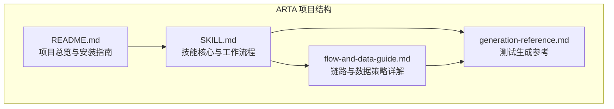
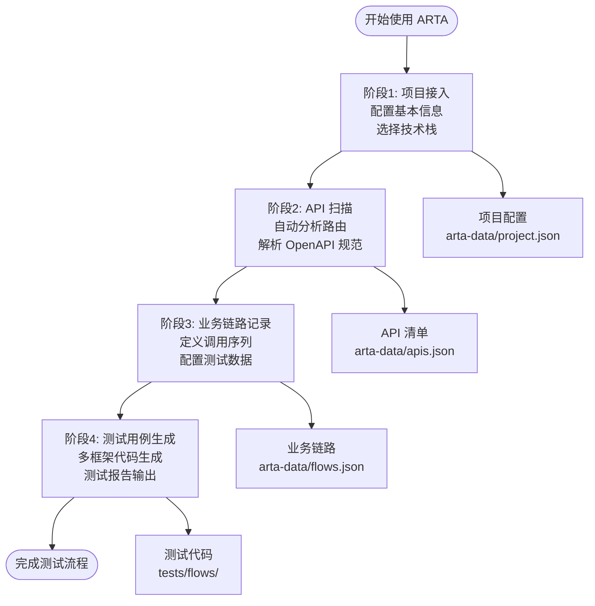
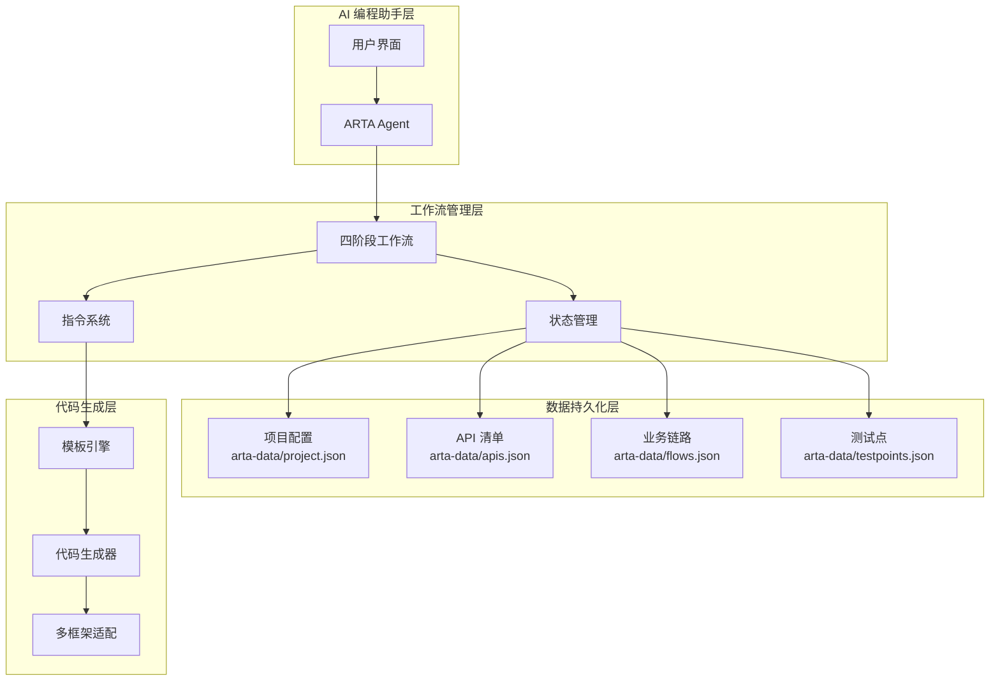
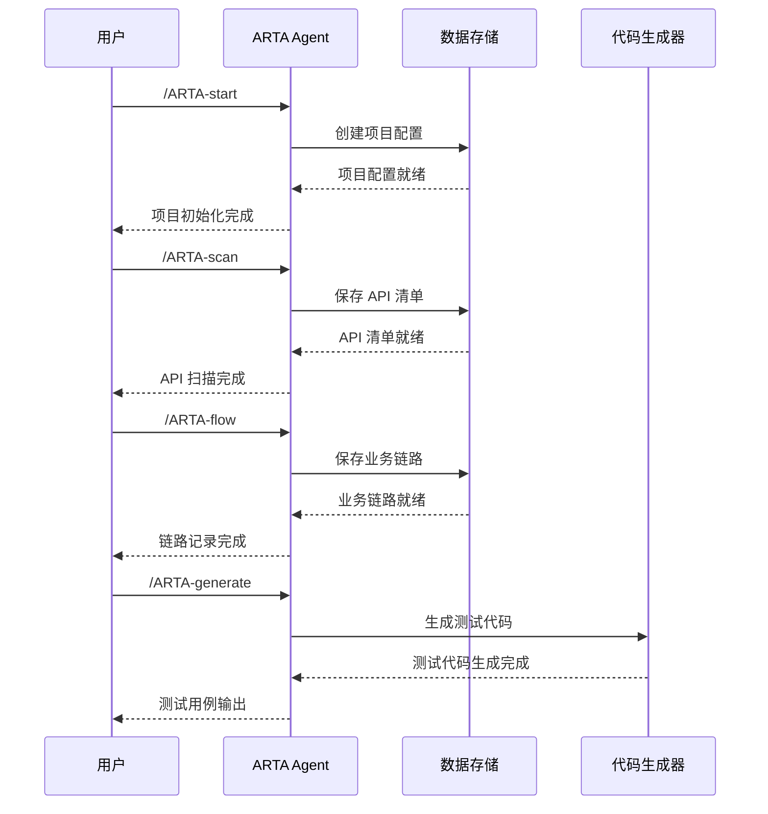
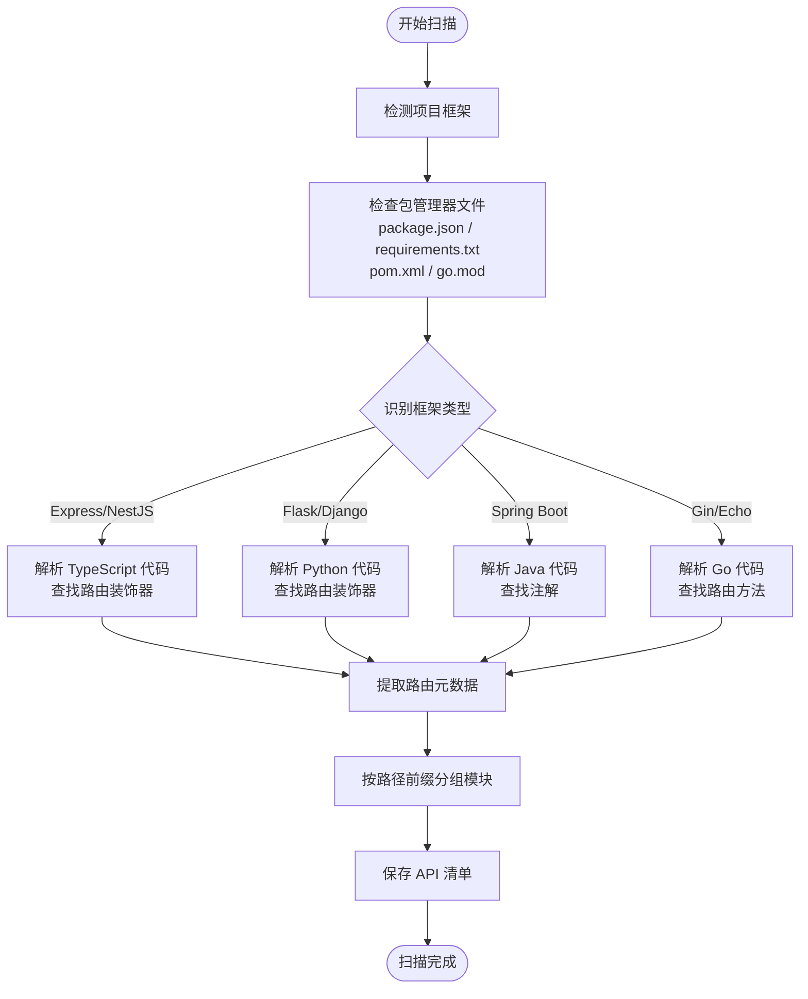
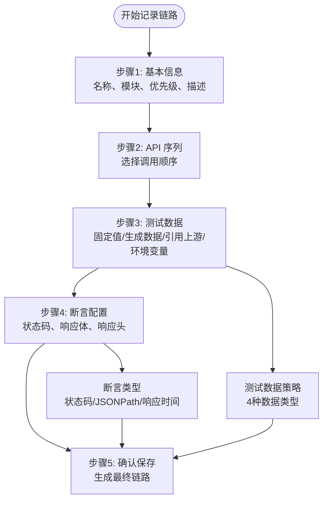
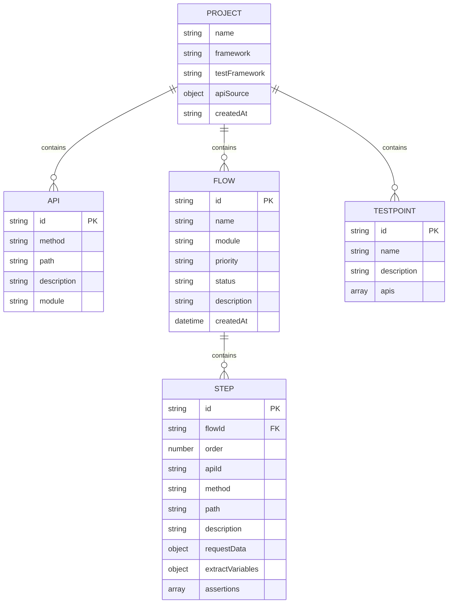
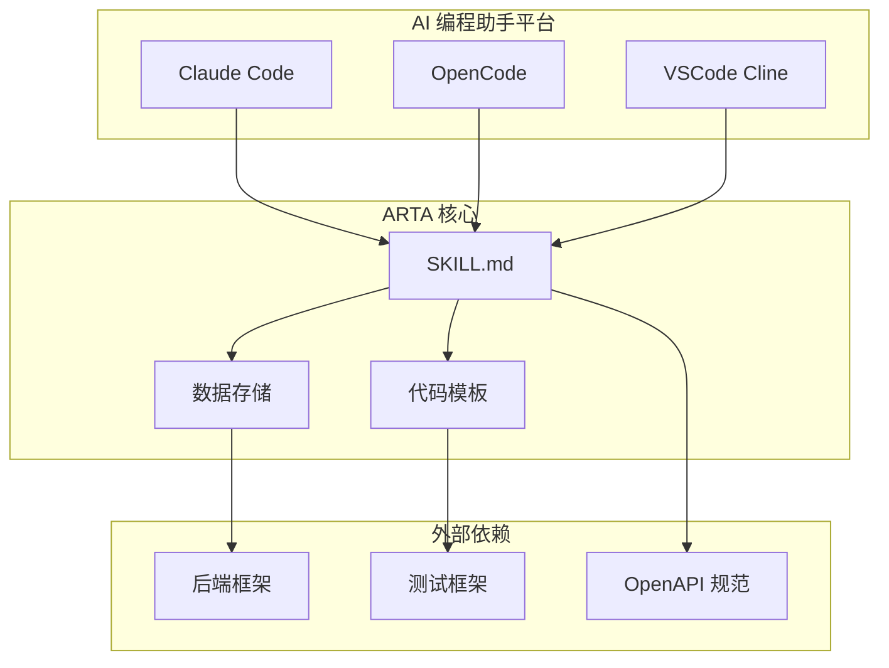

# 项目概述

<cite>
**本文档引用的文件**
- [README.md](file://README.md)
- [SKILL.md](file://SKILL.md)
- [flow-and-data-guide.md](file://flow-and-data-guide.md)
- [generation-reference.md](file://generation-reference.md)
</cite>

## 目录
1. [引言](#引言)
2. [项目结构](#项目结构)
3. [核心组件](#核心组件)
4. [架构总览](#架构总览)
5. [详细组件分析](#详细组件分析)
6. [依赖关系分析](#依赖关系分析)
7. [性能考虑](#性能考虑)
8. [故障排除指南](#故障排除指南)
9. [结论](#结论)
10. [附录](#附录)

## 引言

ARTA（Automation Regression Test Assistant）是一个革命性的端到端 API 自动化测试流程引导工具，专为现代软件开发团队设计。该项目的核心价值在于将复杂的测试流程标准化、自动化和智能化，通过四阶段工作流程彻底改变了传统的回归测试实践。

ARTA 的设计理念是"自然语言优先"，它消除了传统测试工具中繁琐的配置和命令行操作，让开发者能够通过简单的自然语言描述来完成复杂的测试任务。这种设计不仅降低了学习成本，更重要的是提高了测试流程的效率和可维护性。

作为 AI 编程助手平台的重要组成部分，ARTA 实现了真正的"智能测试助手"体验。用户无需记忆复杂的指令，只需描述需求即可触发相应的测试流程。这种无缝的人机交互方式使得测试工作变得更加直观和高效。

## 项目结构

ARTA 项目采用简洁而功能完整的文档结构，四个核心文件构成了完整的知识体系：



**图表来源**
- [README.md:1-176](file://README.md#L1-L176)
- [SKILL.md:1-443](file://SKILL.md#L1-L443)

### 核心文件职责

**README.md** - 项目总览文件，提供高层次的功能描述、技术栈支持、安装方法和使用示例。它是用户了解 ARTA 的第一入口，涵盖了项目的核心价值主张和技术能力概览。

**SKILL.md** - 技能核心文件，详细定义了 ARTA 的四阶段工作流程、指令系统、数据存储结构和关键行为规范。这是整个项目的"操作手册"，包含了具体的实现细节和最佳实践。

**flow-and-data-guide.md** - 业务链路和数据策略的深入指南，专门针对需要深入了解的技术人员。该文件详细解释了链路数据结构、测试数据策略、断言类型和 CRUD 接口处理策略。

**generation-reference.md** - 测试生成的详细参考文档，涵盖各测试框架的代码模板、生成策略和测试报告格式。为开发者提供了完整的实现参考。

**章节来源**
- [README.md:1-176](file://README.md#L1-L176)
- [SKILL.md:1-443](file://SKILL.md#L1-L443)

## 核心组件

### 四阶段工作流程架构

ARTA 的核心价值体现在其精心设计的四阶段工作流程中，每个阶段都有明确的目标、产出和质量标准：



**图表来源**
- [SKILL.md:10-16](file://SKILL.md#L10-L16)
- [SKILL.md:34-78](file://SKILL.md#L34-L78)
- [SKILL.md:81-140](file://SKILL.md#L81-L140)
- [SKILL.md:143-258](file://SKILL.md#L143-L258)
- [SKILL.md:297-377](file://SKILL.md#L297-L377)

### 技术栈支持矩阵

ARTA 支持主流的后端框架和测试框架组合，为不同技术背景的团队提供灵活的选择：

| 后端框架 | 测试框架 | 语言 |
|---------|---------|------|
| Express, NestJS | Jest, Vitest, Mocha | TypeScript |
| Flask, Django, FastAPI | Pytest | Python |
| Spring Boot | JUnit 5 | Java |
| Gin, Echo | Go testing | Go |

这种广泛的技术栈支持确保了 ARTA 能够适应各种开发环境和团队技术栈，实现了真正的通用性。

**章节来源**
- [README.md:22-30](file://README.md#L22-L30)
- [SKILL.md:24-29](file://SKILL.md#L24-L29)

## 架构总览

### 整体架构设计

ARTA 采用"技能驱动 + 数据持久化 + 多框架适配"的整体架构设计，通过清晰的层次结构实现了功能的模块化和扩展性：



**图表来源**
- [SKILL.md:380-443](file://SKILL.md#L380-L443)
- [README.md:151-162](file://README.md#L151-L162)

### 数据流架构

ARTA 的数据流设计体现了"渐进式构建"的理念，每个阶段的输出都是下一个阶段的输入：



**图表来源**
- [SKILL.md:34-78](file://SKILL.md#L34-L78)
- [SKILL.md:81-140](file://SKILL.md#L81-L140)
- [SKILL.md:143-258](file://SKILL.md#L143-L258)
- [SKILL.md:297-377](file://SKILL.md#L297-L377)

## 详细组件分析

### 阶段1：项目接入组件

项目接入是 ARTA 流程的第一步，也是最关键的一步。它负责收集项目的基本信息和配置参数，为后续流程奠定基础。

#### 核心功能特性

**多源信息收集**：
- 项目名称配置
- API 信息来源选择（本地代码分析、OpenAPI 文件、OpenAPI URL、手动输入）
- 后端框架识别和选择
- 测试框架配置

**智能框架识别**：
ARTA 能够根据项目的技术特征自动识别后端框架，减少人工配置的工作量。这种智能识别基于文件结构、依赖管理和代码特征的综合分析。

**配置持久化**：
项目配置信息被保存到 `arta-data/project.json` 文件中，确保配置的持久性和可恢复性。

**章节来源**
- [SKILL.md:34-78](file://SKILL.md#L34-L78)
- [SKILL.md:67-75](file://SKILL.md#L67-L75)

### 阶段2：API 扫描组件

API 扫描组件是 ARTA 的核心技术之一，它实现了对不同后端框架的自动识别和 API 元数据提取。

#### 框架识别机制



**图表来源**
- [SKILL.md:81-140](file://SKILL.md#L81-L140)
- [SKILL.md:87-99](file://SKILL.md#L87-L99)

#### OpenAPI 解析能力

除了代码分析外，ARTA 还支持直接解析 OpenAPI/Swagger 规范文件：

**支持的规范版本**：
- OpenAPI 3.0/3.1
- Swagger 2.0

**解析内容**：
- 路径和 HTTP 方法
- 操作标识符和描述
- 标签作为模块分组
- 请求和响应模式

**章节来源**
- [SKILL.md:107-139](file://SKILL.md#L107-L139)

### 阶段3：业务链路记录组件

业务链路记录是 ARTA 的核心创新点，它将复杂的测试设计过程简化为五个清晰的步骤。

#### 五步记录流程



**图表来源**
- [SKILL.md:143-258](file://SKILL.md#L143-L258)
- [SKILL.md:156-225](file://SKILL.md#L156-L225)

#### 测试数据策略详解

ARTA 提供了四种灵活的测试数据配置方式：

**固定值**：适用于已知的测试账号或配置信息，确保测试的可重复性。

**生成数据**：使用内置函数动态生成测试数据，避免数据冲突和重复使用。

**引用上游**：支持跨步骤的数据传递，实现复杂业务场景的测试。

**环境变量**：允许从运行时环境获取配置信息，提高测试的灵活性。

**章节来源**
- [SKILL.md:179-225](file://SKILL.md#L179-L225)
- [flow-and-data-guide.md:77-132](file://flow-and-data-guide.md#L77-L132)

### 阶段4：测试用例生成组件

测试用例生成是 ARTA 的最终输出阶段，它将业务链路转换为可执行的测试代码。

#### 多框架代码生成

ARTA 支持多种测试框架的代码生成，每种框架都有专门的模板和最佳实践：

**TypeScript 生态**：
- Jest 和 Vitest：支持现代前端和 Node.js 测试
- Mocha：经典的 BDD/TDD 测试框架

**Python 生态**：
- Pytest：功能强大的 Python 测试框架

**Java 生态**：
- JUnit 5：现代化的 Java 测试框架

**Go 生态**：
- Go testing：原生 Go 测试框架

#### 生成策略

ARTA 采用"场景覆盖优先"的生成策略，确保测试的完整性和有效性：

**默认场景覆盖**：
- 正向流程：完整的业务链路端到端测试
- 单步正向：每个 API 的独立成功场景
- 关键异常：认证失败、资源不存在、参数错误等常见异常

**异常场景智能建议**：
根据 API 特征自动建议异常场景，如认证需求、创建接口的重复创建、路径参数的资源不存在等。

**章节来源**
- [SKILL.md:297-377](file://SKILL.md#L297-L377)
- [generation-reference.md:218-286](file://generation-reference.md#L218-L286)

### 数据存储与管理

ARTA 采用简单而有效的数据存储策略，所有数据都保存在工作目录的 `arta-data/` 目录中：



**图表来源**
- [SKILL.md:419-431](file://SKILL.md#L419-L431)
- [flow-and-data-guide.md:7-75](file://flow-and-data-guide.md#L7-L75)

**章节来源**
- [SKILL.md:419-431](file://SKILL.md#L419-L431)
- [README.md:151-162](file://README.md#L151-L162)

## 依赖关系分析

### 技术依赖关系

ARTA 的技术依赖关系体现了"轻量级但功能完整"的设计理念：



**图表来源**
- [README.md:33-54](file://README.md#L33-L54)
- [SKILL.md:30-31](file://SKILL.md#L30-L31)

### 指令依赖关系

ARTA 的指令系统具有清晰的依赖关系，形成了完整的操作闭环：

```mermaid
flowchart LR
Start[/ARTA-start] --> Scan[/ARTA-scan]
Scan --> Flow[/ARTA-flow]
Flow --> Generate[/ARTA-generate]
Generate --> Status[/ARTA-status]
Status --> Export[/ARTA-export]
Export --> Start
Flow -.-> TestPoint[/ARTA-testpoint]
TestPoint --> Flow
Scan -.-> Status
Flow -.-> Status
Generate -.-> Status
```

**图表来源**
- [SKILL.md:18-29](file://SKILL.md#L18-L29)

**章节来源**
- [README.md:72-83](file://README.md#L72-L83)
- [SKILL.md:18-29](file://SKILL.md#L18-L29)

## 性能考虑

### 扫描性能优化

ARTA 在 API 扫描阶段采用了多项性能优化策略：

**智能排除机制**：
- 自动排除 node_modules、vendor、.git、dist、build 等无关目录
- 基于文件扩展名的快速过滤
- 并行处理多个源码文件

**缓存策略**：
- API 清单的增量更新
- 框架识别结果的缓存
- 用户确认的增量保存

**内存管理**：
- 流式处理大型源码文件
- 及时释放中间结果
- 控制并发扫描的资源占用

### 生成性能优化

测试代码生成阶段的性能优化主要体现在：

**模板预编译**：
- 代码模板的预编译和缓存
- 常用数据结构的复用
- 生成过程的流水线化

**增量生成**：
- 只重新生成变更的链路
- 保持现有测试代码的完整性
- 最小化文件系统操作

## 故障排除指南

### 常见问题诊断

**项目接入失败**：
- 检查项目路径是否正确
- 确认后端框架识别是否准确
- 验证 API 信息来源的可用性

**API 扫描异常**：
- 确认项目根目录的可访问性
- 检查源码文件的编码格式
- 验证 OpenAPI 文件的格式正确性

**业务链路记录错误**：
- 检查 API 清单的完整性
- 验证测试数据的语法正确性
- 确认断言规则的有效性

**测试生成失败**：
- 检查测试框架的兼容性
- 验证生成模板的完整性
- 确认输出目录的写权限

### 调试技巧

**状态检查**：
使用 `/ARTA-status` 指令查看项目当前状态，了解各阶段的完成情况和进度。

**增量操作**：
利用 ARTA 的增量特性，可以随时添加新的 API 或业务链路，无需从头开始整个流程。

**断点续作**：
支持随时暂停和继续，通过状态检查了解进度并继续未完成的工作。

**章节来源**
- [SKILL.md:380-443](file://SKILL.md#L380-L443)

## 结论

ARTA 自动化回归测试助手项目代表了测试工具发展的新方向。通过四阶段工作流程的设计和自然语言交互的实现，它成功地将复杂的测试流程简化为直观易用的操作。

项目的核心优势体现在：

**架构优势**：
- 渐进式构建的设计理念
- 多框架支持的通用性
- 数据持久化的可靠性
- 智能生成的高效性

**技术创新**：
- 自然语言优先的交互方式
- 智能提醒和建议功能
- 增量操作和断点续作
- 多维度场景覆盖

**实用价值**：
- 降低测试门槛，提高团队效率
- 标准化测试流程，提升质量一致性
- 支持多种技术栈，适应不同团队需求
- 自动生成测试代码，减少手工编写工作

ARTA 不仅仅是一个测试工具，更是测试流程的革命者。它通过智能化和自动化的手段，让测试工作变得更加高效、可靠和可持续。

## 附录

### 快速开始指南

1. **安装配置**：将 ARTA Skill 文件复制到 AI 助手的 skills 目录
2. **项目初始化**：使用 `/ARTA-start` 指令启动新项目
3. **API 扫描**：使用 `/ARTA-scan` 获取 API 清单
4. **链路记录**：使用 `/ARTA-flow` 定义业务场景
5. **生成测试**：使用 `/ARTA-generate` 创建测试代码

### 支持的指令一览

| 指令 | 功能 | 用途 |
|------|------|------|
| `/ARTA-start` | 项目接入 | 初始化项目配置 |
| `/ARTA-scan` | API 扫描 | 分析路由或解析 OpenAPI |
| `/ARTA-flow` | 业务链路 | 添加/查看/编辑链路 |
| `/ARTA-testpoint` | 测试点导入 | 导入 Mermaid 思维导图 |
| `/ARTA-generate` | 测试生成 | 生成测试用例代码 |
| `/ARTA-status` | 状态查看 | 查看项目进度 |
| `/ARTA-export` | 导出配置 | 导出所有配置和测试文件 |