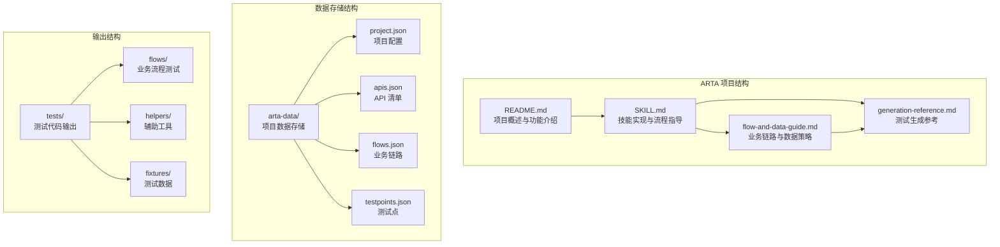
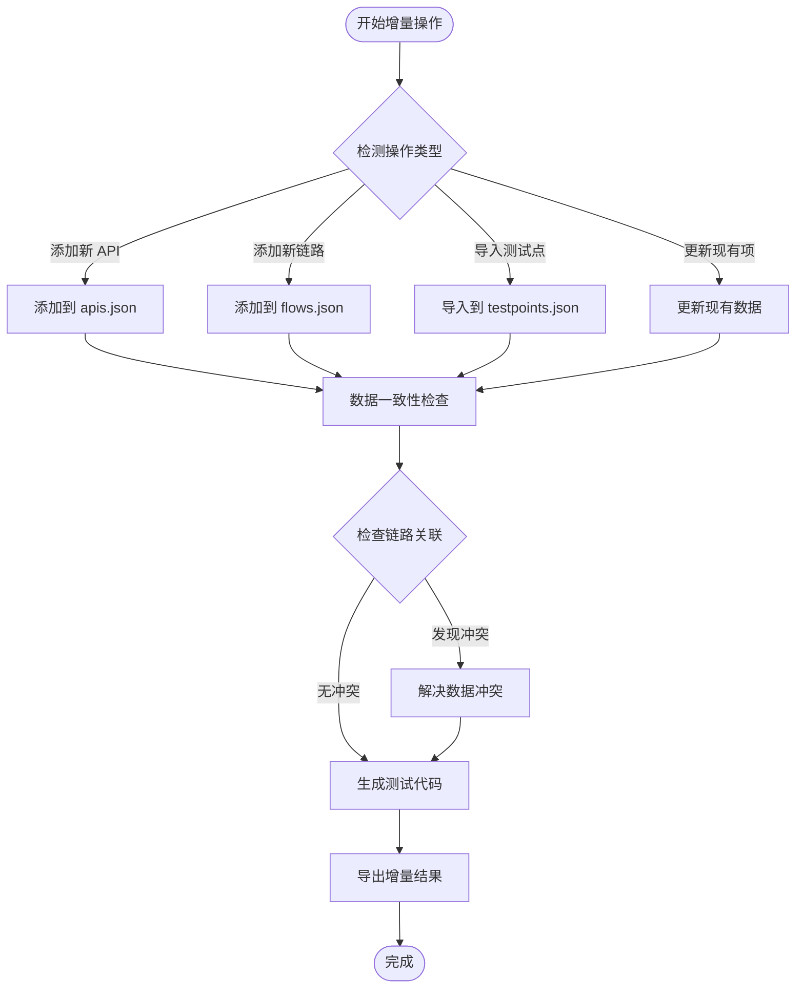
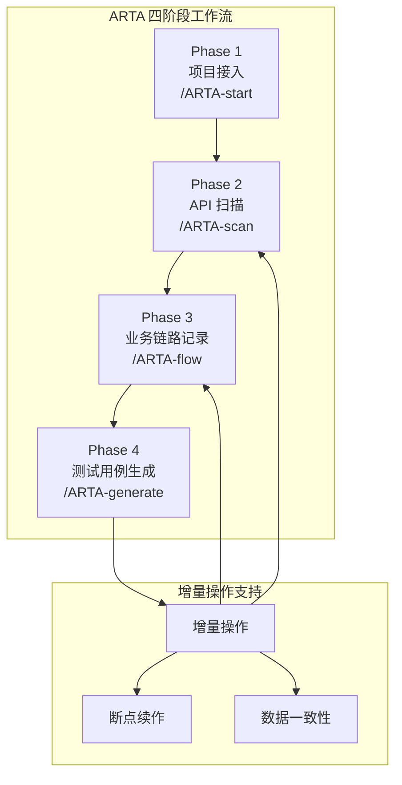
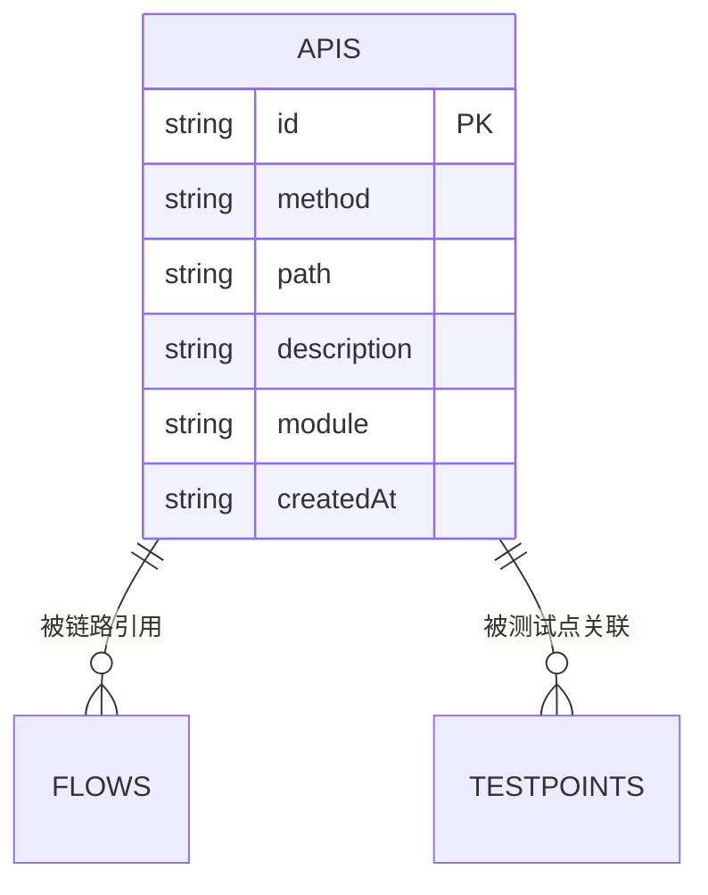
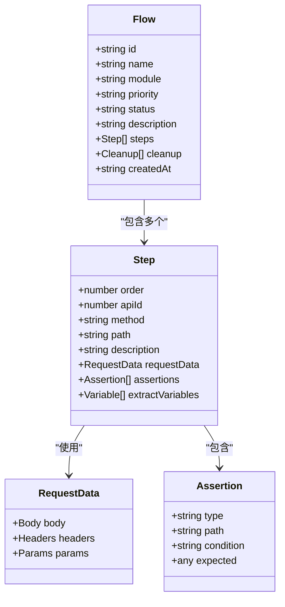
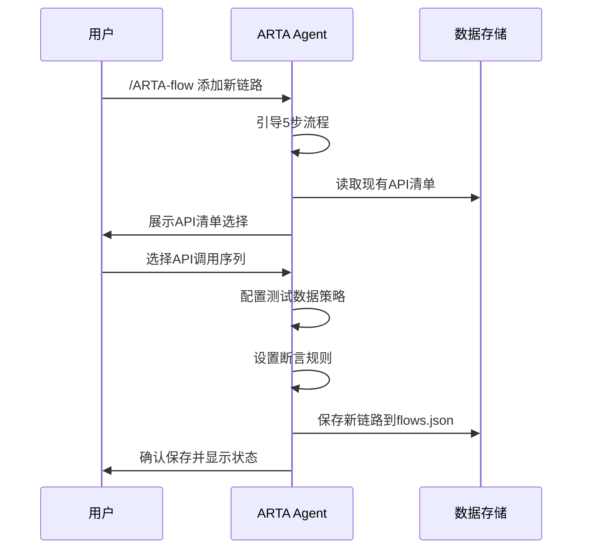
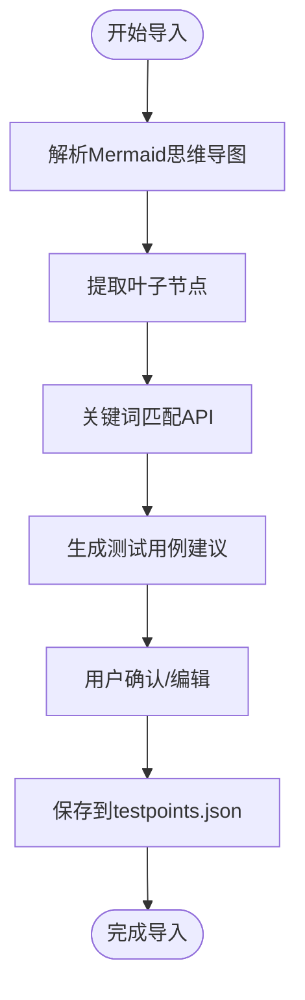
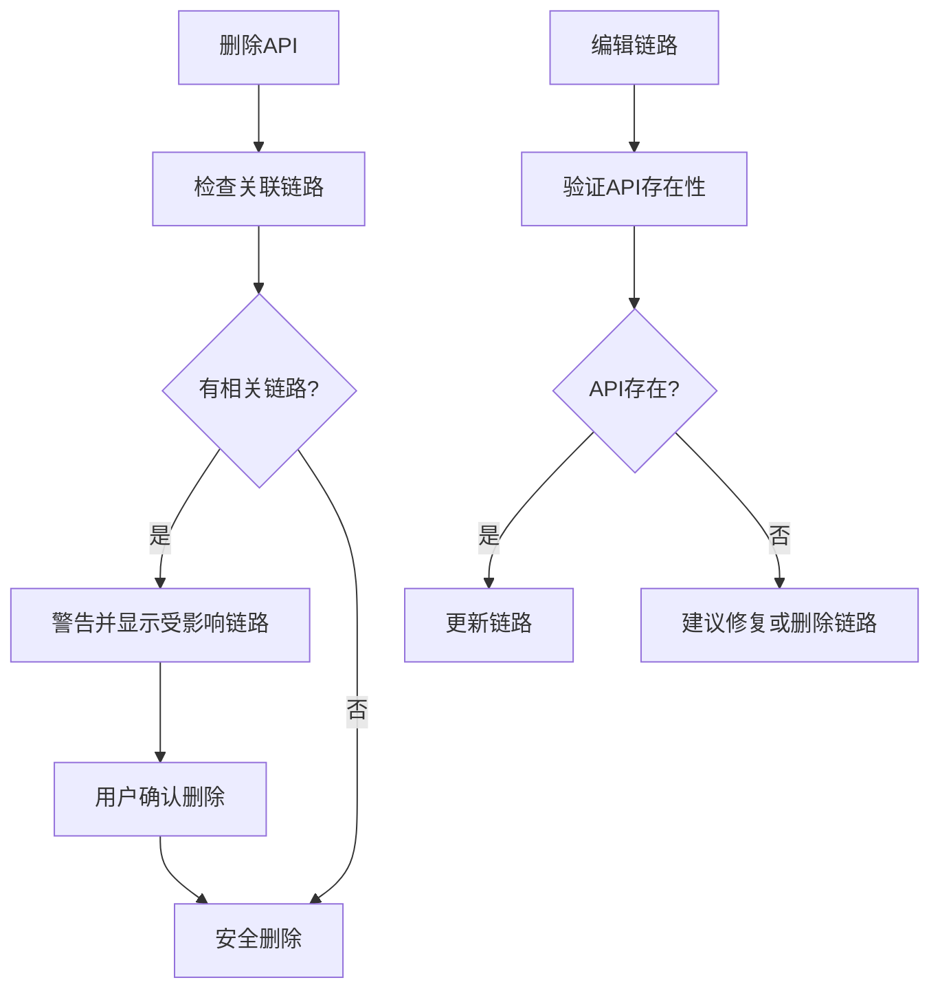
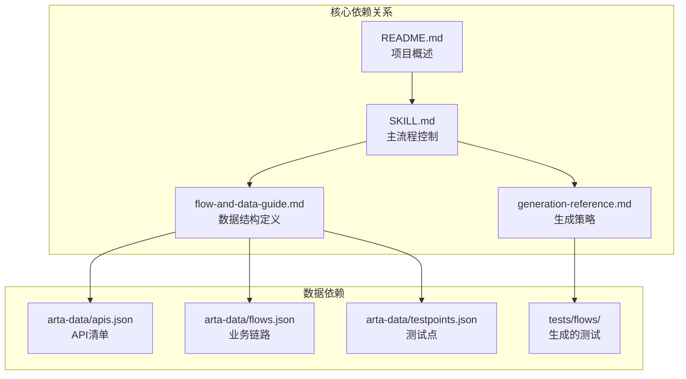

# 增量操作支持

<cite>
**本文档引用的文件**
- [README.md](file://README.md)
- [SKILL.md](file://SKILL.md)
- [flow-and-data-guide.md](file://flow-and-data-guide.md)
- [generation-reference.md](file://generation-reference.md)
</cite>

## 目录
1. [简介](#简介)
2. [项目结构](#项目结构)
3. [核心组件](#核心组件)
4. [架构概览](#架构概览)
5. [详细组件分析](#详细组件分析)
6. [依赖关系分析](#依赖关系分析)
7. [性能考虑](#性能考虑)
8. [故障排除指南](#故障排除指南)
9. [结论](#结论)
10. [附录](#附录)

## 简介

ARTA（自动化回归测试助手）是一个端到端 API 自动化测试流程引导工具，专门设计支持增量操作能力。该工具允许开发团队在不重新开始整个测试流程的情况下，随时添加新的 API、新的业务链路和新的测试点。

ARTA 的增量操作特性是其核心优势之一，它提供了灵活的测试流程管理，支持：
- 随时添加新 API 到现有项目
- 动态扩展业务链路覆盖范围
- 增量式测试点导入和生成
- 数据一致性保证机制
- 断点续作能力

## 项目结构

ARTA 项目采用简洁而功能完整的文档结构，主要包含四个核心文件：

**图表来源**
- [README.md: 151-162:151-162](file://README.md#L151-L162)
- [SKILL.md: 419-431:419-431](file://SKILL.md#L419-L431)

**章节来源**
- [README.md: 1-176:1-176](file://README.md#L1-L176)
- [SKILL.md: 419-431:419-431](file://SKILL.md#L419-L431)

## 核心组件

### 数据存储系统

ARTA 采用 JSON 文件作为主要数据存储格式，确保了增量操作的持久性和可追溯性：

| 文件 | 内容 | 用途 | 增量操作支持 |
|------|------|------|-------------|
| `arta-data/project.json` | 项目配置信息 | 项目元数据管理 | ✅ 支持增量配置更新 |
| `arta-data/apis.json` | API 清单 | API 发现和管理 | ✅ 支持增量 API 添加 |
| `arta-data/flows.json` | 业务链路 | 流程定义和状态 | ✅ 支持增量链路扩展 |
| `arta-data/testpoints.json` | 测试点 | 导入的测试点 | ✅ 支持增量测试点 |

### 增量操作核心机制

**图表来源**
- [SKILL.md: 434-443:434-443](file://SKILL.md#L434-L443)
- [flow-and-data-guide.md: 211-218:211-218](file://flow-and-data-guide.md#L211-L218)

**章节来源**
- [SKILL.md: 434-443:434-443](file://SKILL.md#L434-L443)
- [flow-and-data-guide.md: 211-218:211-218](file://flow-and-data-guide.md#L211-L218)

## 架构概览

ARTA 的增量操作架构基于四阶段测试工作流，每个阶段都支持增量扩展：

**图表来源**
- [README.md: 9-12:9-12](file://README.md#L9-L12)
- [SKILL.md: 12-16:12-16](file://SKILL.md#L12-L16)

## 详细组件分析

### API 清单增量管理

API 清单的增量操作支持以下功能：

#### API 清单数据结构

**图表来源**
- [flow-and-data-guide.md: 7-75:7-75](file://flow-and-data-guide.md#L7-L75)

#### API 清单更新策略
- **添加新 API**：支持通过自然语言描述添加新的 API 条目
- **编辑现有 API**：支持修改方法、路径、描述或模块
- **删除 API**：删除时自动检查并提示相关的业务链路
- **批量操作**：支持从 OpenAPI 规范批量导入

**章节来源**
- [README.md: 102-139:102-139](file://README.md#L102-L139)
- [SKILL.md: 107-139:107-139](file://SKILL.md#L107-L139)

### 业务链路增量扩展

业务链路的增量操作提供了完整的流程扩展能力：

#### 链路数据结构

**图表来源**
- [flow-and-data-guide.md: 7-75:7-75](file://flow-and-data-guide.md#L7-L75)

#### 增量链路创建流程

**图表来源**
- [SKILL.md: 147-225:147-225](file://SKILL.md#L147-L225)

**章节来源**
- [SKILL.md: 147-225:147-225](file://SKILL.md#L147-L225)
- [flow-and-data-guide.md: 7-75:7-75](file://flow-and-data-guide.md#L7-L75)

### 测试点增量导入

测试点的增量导入支持从 Mermaid 思维导图中提取测试场景：

#### 测试点导入流程

**图表来源**
- [SKILL.md: 261-294:261-294](file://SKILL.md#L261-L294)

**章节来源**
- [SKILL.md: 261-294:261-294](file://SKILL.md#L261-L294)

### 数据一致性保证机制

ARTA 实现了多层次的数据一致性保证机制：

#### API 清单一致性检查

**图表来源**
- [SKILL.md: 434-443:434-443](file://SKILL.md#L434-L443)

#### 链路关联检查策略
- **API 存在性验证**：编辑链路时检查引用的 API 是否仍然存在
- **步骤顺序验证**：确保引用的上游步骤在当前步骤之前执行
- **数据依赖检查**：验证变量引用的有效性
- **清理步骤建议**：对包含写入操作的链路自动建议清理步骤

**章节来源**
- [SKILL.md: 434-443:434-443](file://SKILL.md#L434-L443)

## 依赖关系分析

ARTA 的增量操作依赖关系体现了清晰的层次结构：

**图表来源**
- [SKILL.md: 12-16:12-16](file://SKILL.md#L12-L16)
- [README.md: 164-167:164-167](file://README.md#L164-L167)

**章节来源**
- [SKILL.md: 12-16:12-16](file://SKILL.md#L12-L16)
- [README.md: 164-167:164-167](file://README.md#L164-L167)

## 性能考虑

### 增量操作性能特征

ARTA 的增量操作在性能方面具有以下特点：

- **内存效率**：所有数据以 JSON 文件形式存储，便于增量读取和更新
- **I/O 优化**：只在必要时读取和写入相关文件，避免全量重载
- **并发安全**：文件系统级别的原子性写入，减少数据损坏风险
- **缓存友好**：频繁访问的数据（如 API 清单）保持在内存中

### 性能优化建议

- **批量操作**：将多个相关的增量操作合并执行，减少文件 I/O 次数
- **增量备份**：定期备份关键数据文件，确保快速恢复
- **监控指标**：关注文件大小增长趋势，及时清理历史数据

## 故障排除指南

### 常见增量操作问题

#### API 清单问题
- **问题**：添加的 API 无法在链路中找到
- **解决方案**：检查 API 清单是否正确保存，确认方法和路径匹配

#### 链路关联问题
- **问题**：编辑链路时报错，提示引用的步骤不存在
- **解决方案**：检查步骤顺序，确保引用的上游步骤在当前步骤之前

#### 数据冲突问题
- **问题**：删除 API 时提示有链路关联
- **解决方案**：先删除或修改相关链路，再执行删除操作

### 调试技巧

1. **检查数据文件**：验证 `arta-data/` 目录下的 JSON 文件格式
2. **使用状态命令**：通过 `/ARTA-status` 查看当前项目状态
3. **逐步验证**：每次增量操作后立即验证数据一致性
4. **版本控制**：对关键数据文件进行版本控制，便于回滚

**章节来源**
- [SKILL.md: 380-398:380-398](file://SKILL.md#L380-L398)

## 结论

ARTA 的增量操作支持为 API 自动化测试提供了强大的灵活性和可持续性。通过精心设计的数据存储结构、完善的增量操作机制和严格的一致性保证，ARTA 能够满足现代软件开发团队在快速迭代环境中对测试流程管理的需求。

### 主要优势

- **灵活性**：支持随时添加新功能，无需重新开始整个流程
- **可靠性**：多重一致性检查确保数据完整性
- **可维护性**：清晰的文件结构和版本控制支持长期维护
- **可扩展性**：模块化的架构支持未来功能扩展

### 最佳实践建议

1. **渐进式扩展**：将大的测试需求分解为小的增量操作
2. **及时验证**：每次增量操作后立即验证数据一致性
3. **文档记录**：记录重要的增量操作决策和变更
4. **定期清理**：定期清理不再使用的测试数据和链路

## 附录

### 增量操作使用场景

#### 新 API 添加场景
- 新增功能模块的 API
- 第三方集成 API
- 内部服务接口变更

#### 业务链路扩展场景
- 新增业务流程
- 现有流程的分支扩展
- 异常场景补充

#### 测试点增量场景
- 新增测试覆盖率
- 特殊业务场景
- 边界条件测试

### 限制条件和注意事项

- **数据格式要求**：所有 JSON 文件必须符合标准格式
- **文件权限**：确保有足够的文件系统权限进行读写操作
- **磁盘空间**：定期清理历史数据，避免磁盘空间不足
- **版本兼容性**：升级 ARTA 时注意数据格式兼容性