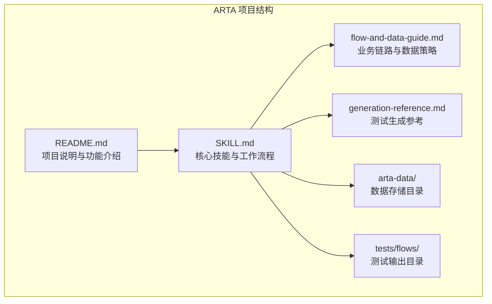
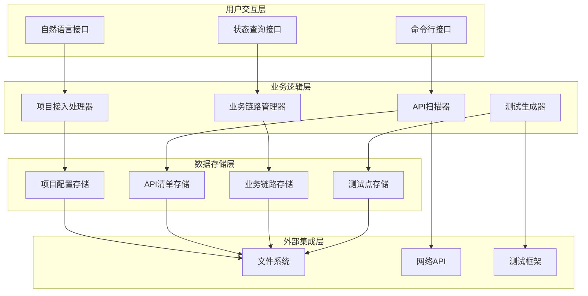
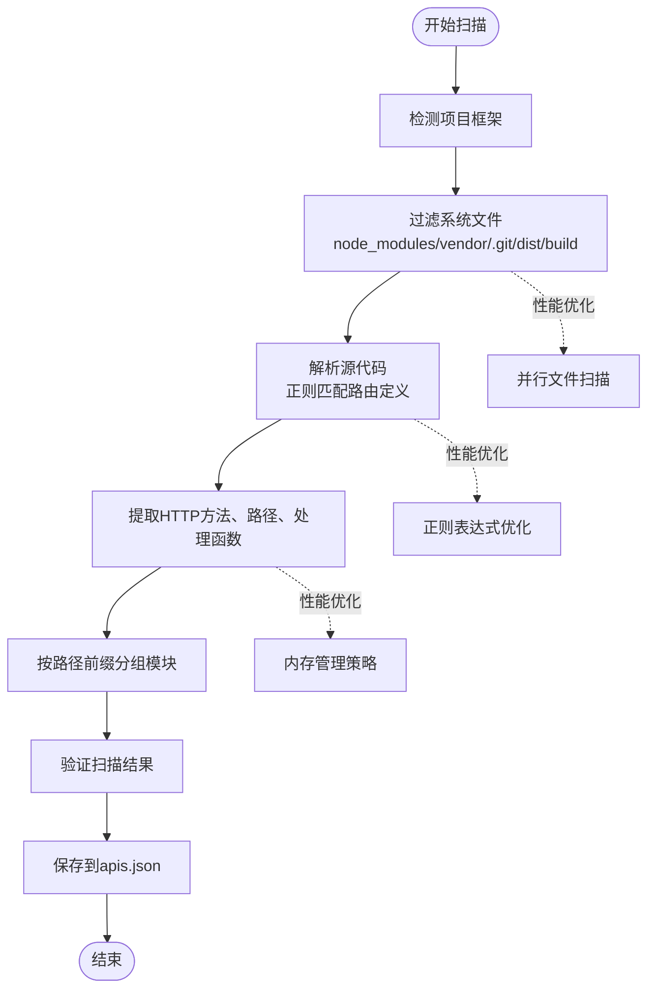
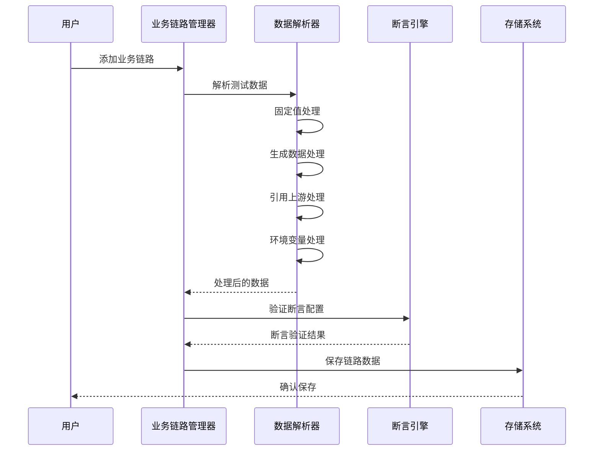
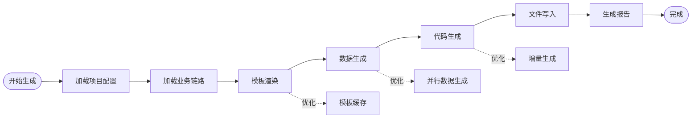
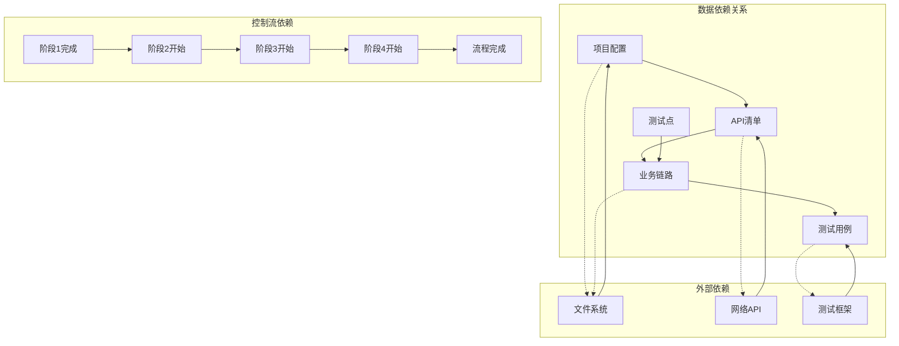

# 性能优化策略

<cite>
**本文档引用的文件**
- [README.md](file://README.md)
- [SKILL.md](file://SKILL.md)
- [flow-and-data-guide.md](file://flow-and-data-guide.md)
- [generation-reference.md](file://generation-reference.md)
</cite>

## 目录
1. [简介](#简介)
2. [项目结构](#项目结构)
3. [核心组件](#核心组件)
4. [架构概览](#架构概览)
5. [详细组件分析](#详细组件分析)
6. [依赖关系分析](#依赖关系分析)
7. [性能考虑因素](#性能考虑因素)
8. [故障排查指南](#故障排查指南)
9. [结论](#结论)
10. [附录](#附录)

## 简介

ARTA（Automation Regression Test Assistant）是一个端到端 API 自动化测试流程引导工具，旨在帮助开发团队从项目接入到测试用例生成的完整流程。该工具通过四个阶段的测试工作流程，提供从项目接入、API扫描、业务链路记录到测试用例生成的完整解决方案。

ARTA的核心优势在于其自然语言优先的设计理念，无需记忆复杂的指令，用户可以通过自然语言描述需求即可完成整个测试流程。同时，ARTA支持断点续作、增量操作、智能提醒等功能，大大提升了测试流程的灵活性和效率。

## 项目结构

ARTA项目采用简洁明了的文档驱动结构，主要包含四个核心文件：

**图表来源**
- [README.md:1-176](file://README.md#L1-L176)
- [SKILL.md:1-443](file://SKILL.md#L1-L443)

**章节来源**
- [README.md:1-176](file://README.md#L1-L176)
- [SKILL.md:1-443](file://SKILL.md#L1-L443)

## 核心组件

ARTA系统由四个主要阶段组成，每个阶段都有特定的性能优化策略：

### 阶段一：项目接入
- **目标**：收集项目基本信息和配置
- **关键优化点**：快速初始化、配置验证、错误处理
- **性能指标**：配置收集时间、验证成功率

### 阶段二：API扫描
- **目标**：自动分析代码路由或解析OpenAPI规范
- **关键优化点**：文件过滤、正则匹配优化、并发处理
- **性能指标**：扫描速度、API发现准确性

### 阶段三：业务链路记录
- **目标**：定义API调用序列、测试数据和断言规则
- **关键优化点**：数据引用解析、断言优化、状态管理
- **性能指标**：链路构建效率、数据处理速度

### 阶段四：测试用例生成
- **目标**：基于链路自动生成多框架测试代码
- **关键优化点**：模板渲染、文件I/O优化、并发生成
- **性能指标**：生成速度、代码质量、输出稳定性

**章节来源**
- [SKILL.md:34-295](file://SKILL.md#L34-L295)
- [README.md:7-20](file://README.md#L7-L20)

## 架构概览

ARTA采用分层架构设计，从上到下分为用户交互层、业务逻辑层、数据存储层和外部集成层：

**图表来源**
- [SKILL.md:10-16](file://SKILL.md#L10-L16)
- [SKILL.md:420-431](file://SKILL.md#L420-L431)

## 详细组件分析

### API扫描组件性能优化

API扫描是ARTA中最关键的性能瓶颈之一，涉及大量文件处理和正则匹配操作。

#### 扫描策略优化

**图表来源**
- [SKILL.md:81-140](file://SKILL.md#L81-L140)

#### 大规模项目处理策略

对于大型项目，建议采用以下优化策略：

1. **文件过滤优化**
   - 使用.gitignore模式排除无关文件
   - 实施文件大小限制，跳过超大文件
   - 采用增量扫描，只处理变更文件

2. **并发处理策略**
   - 多线程文件扫描
   - 异步正则匹配处理
   - 分批处理API结果

3. **内存使用优化**
   - 流式文件读取
   - 分页处理API列表
   - 及时释放中间结果

**章节来源**
- [SKILL.md:81-140](file://SKILL.md#L81-L140)

### 业务链路处理效率提升

业务链路记录涉及复杂的数据引用和断言配置，需要高效的处理策略。

#### 数据处理优化

**图表来源**
- [SKILL.md:143-257](file://SKILL.md#L143-L257)
- [flow-and-data-guide.md:77-145](file://flow-and-data-guide.md#L77-L145)

#### 处理效率优化策略

1. **数据引用解析优化**
   - 实现引用缓存机制
   - 采用延迟计算策略
   - 实施引用验证预检查

2. **断言配置优化**
   - 断言规则预编译
   - 批量断言验证
   - 异常断言快速失败

3. **状态管理优化**
   - 链路状态缓存
   - 增量状态更新
   - 并发状态同步

**章节来源**
- [SKILL.md:143-257](file://SKILL.md#L143-L257)
- [flow-and-data-guide.md:77-145](file://flow-and-data-guide.md#L77-L145)

### 测试生成速度优化

测试生成是ARTA的最后一个阶段，也是最耗时的阶段之一。

#### 生成流程优化

**图表来源**
- [SKILL.md:297-377](file://SKILL.md#L297-L377)
- [generation-reference.md:218-287](file://generation-reference.md#L218-L287)

#### 生成速度优化策略

1. **模板渲染优化**
   - 实现模板缓存机制
   - 预编译常用模板
   - 采用流式模板处理

2. **数据生成优化**
   - 并行数据生成
   - 缓存生成函数结果
   - 实施数据生成队列

3. **文件I/O优化**
   - 批量文件写入
   - 异步文件操作
   - 内存缓冲区管理

**章节来源**
- [SKILL.md:297-377](file://SKILL.md#L297-L377)
- [generation-reference.md:218-287](file://generation-reference.md#L218-L287)

## 依赖关系分析

ARTA系统的依赖关系相对简单，主要体现在数据流和控制流两个方面：

**图表来源**
- [SKILL.md:420-431](file://SKILL.md#L420-L431)
- [README.md:151-162](file://README.md#L151-L162)

**章节来源**
- [SKILL.md:420-431](file://SKILL.md#L420-L431)
- [README.md:151-162](file://README.md#L151-L162)

## 性能考虑因素

### 内存使用优化

ARTA在处理大规模项目时需要特别关注内存使用：

1. **流式处理策略**
   - 文件读取采用流式方式，避免一次性加载大文件
   - API结果分页处理，控制内存峰值
   - 数据序列化采用增量方式

2. **垃圾回收优化**
   - 及时释放不再使用的对象引用
   - 实施对象池模式，重用临时对象
   - 监控内存使用情况，及时触发GC

3. **缓存策略**
   - 实现LRU缓存，控制缓存大小
   - 分级缓存策略，区分热数据和冷数据
   - 缓存失效机制，保证数据一致性

### 并发处理策略

ARTA支持多种并发处理模式：

1. **文件扫描并发**
   - 多线程文件遍历
   - 异步正则匹配
   - 并行结果合并

2. **数据处理并发**
   - 并行数据生成
   - 异步断言验证
   - 并行模板渲染

3. **I/O操作并发**
   - 并发文件写入
   - 异步网络请求
   - 并行报告生成

### 缓存机制实现

ARTA实现了多层次的缓存机制：

1. **模板缓存**
   - 缓存已编译的模板
   - 实现模板版本管理
   - 支持模板热更新

2. **数据缓存**
   - 缓存API扫描结果
   - 实现增量缓存更新
   - 支持缓存失效策略

3. **结果缓存**
   - 缓存业务链路处理结果
   - 实现结果去重机制
   - 支持缓存持久化

**章节来源**
- [SKILL.md:81-140](file://SKILL.md#L81-L140)
- [SKILL.md:143-257](file://SKILL.md#L143-L257)
- [SKILL.md:297-377](file://SKILL.md#L297-L377)

## 故障排查指南

### 常见性能问题及解决方案

#### API扫描缓慢问题

**问题表现**：
- 扫描时间过长
- 内存使用过高
- CPU占用率异常

**诊断方法**：
1. 检查项目文件数量和大小
2. 分析正则表达式复杂度
3. 监控文件I/O性能

**解决方案**：
1. 优化文件过滤规则
2. 实施并行扫描
3. 增加内存限制

#### 业务链路处理卡顿

**问题表现**：
- 数据引用解析缓慢
- 断言验证耗时
- 状态更新延迟

**诊断方法**：
1. 分析数据引用深度
2. 检查断言复杂度
3. 监控状态同步性能

**解决方案**：
1. 实现引用缓存
2. 优化断言引擎
3. 采用异步状态更新

#### 测试生成速度慢

**问题表现**：
- 模板渲染缓慢
- 代码生成耗时
- 文件写入阻塞

**诊断方法**：
1. 分析模板复杂度
2. 检查数据生成性能
3. 监控磁盘I/O

**解决方案**：
1. 实施模板缓存
2. 采用并行生成
3. 优化文件写入策略

### 性能监控指标

ARTA建议监控以下关键性能指标：

1. **扫描阶段指标**
   - 文件扫描速度（文件/秒）
   - API发现准确率
   - 内存使用峰值

2. **处理阶段指标**
   - 数据引用解析时间
   - 断言验证速度
   - 链路构建效率

3. **生成阶段指标**
   - 模板渲染时间
   - 代码生成速度
   - 文件写入性能

### 基准测试方法

建议采用以下基准测试方法：

1. **单元测试基准**
   - 测试单个API扫描性能
   - 验证数据处理效率
   - 评估生成速度

2. **集成测试基准**
   - 完整流程性能测试
   - 大规模项目处理能力
   - 并发处理性能

3. **压力测试基准**
   - 高并发场景测试
   - 内存压力测试
   - 磁盘I/O压力测试

### 性能调优工具推荐

1. **内存分析工具**
   - Node.js profiler
   - Python memory profiler
   - Java VisualVM

2. **性能监控工具**
   - APM工具（如New Relic）
   - 自定义性能指标收集
   - 日志分析工具

3. **基准测试工具**
   - Apache JMeter
   - Locust（Python）
   - 自定义基准测试框架

**章节来源**
- [SKILL.md:81-140](file://SKILL.md#L81-L140)
- [SKILL.md:143-257](file://SKILL.md#L143-L257)
- [SKILL.md:297-377](file://SKILL.md#L297-L377)

## 结论

ARTA作为一个完整的API自动化测试工具，其性能优化策略涵盖了从项目接入到测试生成的全流程。通过合理的架构设计、高效的算法实现和完善的缓存机制，ARTA能够在保证功能完整性的同时，提供优秀的性能表现。

针对不同规模项目的优化建议：

**小型项目（<100个API）**：
- 重点关注代码分析阶段的文件过滤
- 优化正则表达式匹配效率
- 实施基础的并发处理

**中型项目（100-1000个API）**：
- 实施并行文件扫描
- 采用分页处理策略
- 建立模板缓存机制

**大型项目（>1000个API）**：
- 实施分布式扫描架构
- 采用增量计算策略
- 建立多级缓存体系

通过持续的性能监控和基准测试，ARTA能够适应不断增长的项目规模，为用户提供稳定高效的测试自动化服务。

## 附录

### 性能优化最佳实践清单

1. **代码分析阶段**
   - 实施智能文件过滤
   - 优化正则表达式
   - 采用流式处理

2. **业务链路阶段**
   - 实现引用缓存
   - 优化断言引擎
   - 采用异步处理

3. **测试生成阶段**
   - 实施模板缓存
   - 采用并行生成
   - 优化I/O操作

### 配置参数建议

1. **内存配置**
   - 最小堆大小：2GB
   - 最大堆大小：8GB
   - 新生代比例：30%

2. **并发配置**
   - 文件扫描线程数：CPU核心数×2
   - 数据处理并发度：CPU核心数
   - I/O操作并发度：CPU核心数×4

3. **缓存配置**
   - 模板缓存大小：1000项
   - 数据缓存大小：10000项
   - 结果缓存有效期：24小时