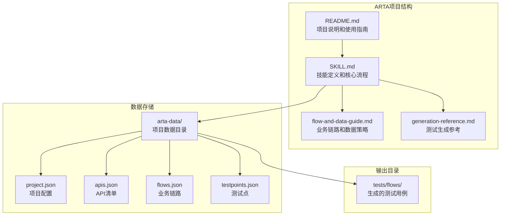
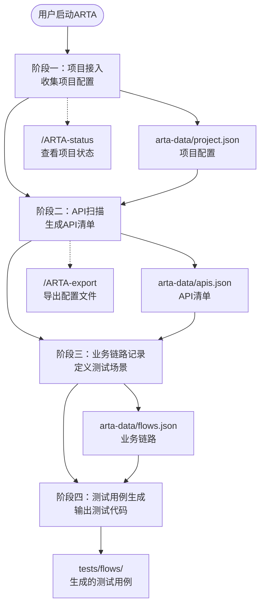
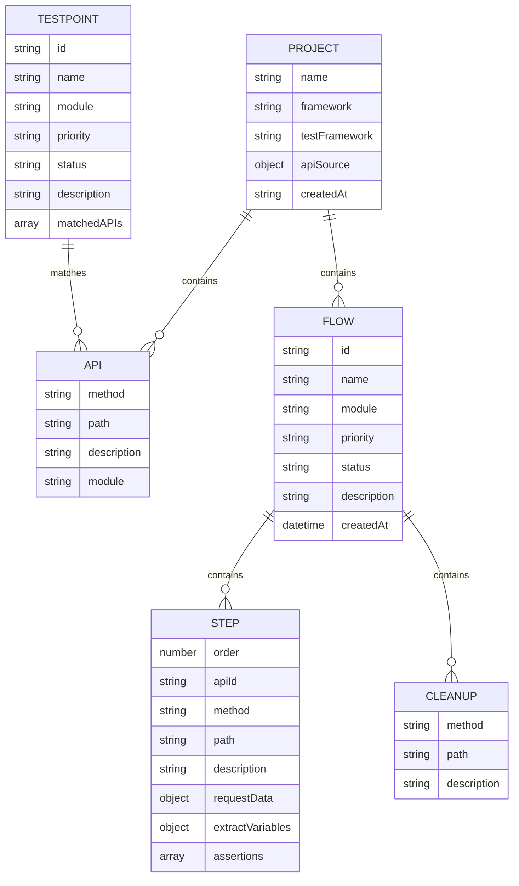
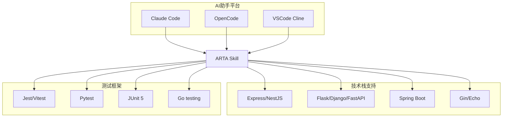
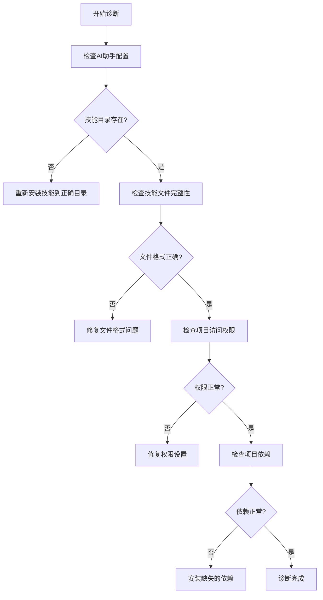

# 故障排除指南

<cite>
**本文档中引用的文件**
- [README.md](file://README.md)
- [SKILL.md](file://SKILL.md)
- [flow-and-data-guide.md](file://flow-and-data-guide.md)
- [generation-reference.md](file://generation-reference.md)
</cite>

## 目录
1. [简介](#简介)
2. [项目结构](#项目结构)
3. [核心组件](#核心组件)
4. [架构概览](#架构概览)
5. [详细组件分析](#详细组件分析)
6. [依赖分析](#依赖分析)
7. [性能考虑](#性能考虑)
8. [故障排除指南](#故障排除指南)
9. [结论](#结论)

## 简介

ARTA（Automation Regression Test Assistant）是一个端到端 API 自动化测试流程引导工具，旨在帮助开发团队从项目接入到测试用例生成的完整测试流程。该工具通过四个阶段的测试工作流程，提供从项目接入、API扫描、业务链路记录到测试用例生成的完整解决方案。

## 项目结构

ARTA项目采用简洁的文档驱动结构，主要包含以下核心文件：



**图表来源**
- [README.md:151-162](file://README.md#L151-L162)
- [SKILL.md:419-431](file://SKILL.md#L419-L431)

**章节来源**
- [README.md:1-176](file://README.md#L1-L176)
- [SKILL.md:1-443](file://SKILL.md#L1-L443)

## 核心组件

ARTA系统的核心组件包括四个主要阶段，每个阶段都有特定的功能和数据结构：

### 阶段一：项目接入
负责初始化项目配置，收集项目基本信息和测试框架选择。

### 阶段二：API扫描
自动分析项目代码或解析OpenAPI规范，生成API清单。

### 阶段三：业务链路记录
定义完整的业务场景，包括API调用序列、测试数据和断言规则。

### 阶段四：测试用例生成
基于业务链路自动生成多框架测试代码。

**章节来源**
- [SKILL.md:34-78](file://SKILL.md#L34-L78)
- [SKILL.md:81-140](file://SKILL.md#L81-L140)
- [SKILL.md:143-258](file://SKILL.md#L143-L258)
- [SKILL.md:297-377](file://SKILL.md#L297-L377)

## 架构概览

ARTA采用分层架构设计，通过清晰的数据流和控制流实现完整的测试流程：



**图表来源**
- [SKILL.md:10-16](file://SKILL.md#L10-L16)
- [SKILL.md:421-431](file://SKILL.md#L421-L431)

## 详细组件分析

### 数据存储架构

ARTA使用JSON文件作为主要数据存储格式，确保数据的可移植性和易维护性：



**图表来源**
- [flow-and-data-guide.md:7-75](file://flow-and-data-guide.md#L7-L75)
- [SKILL.md:423-429](file://SKILL.md#L423-L429)

### 测试数据策略

ARTA支持四种类型的测试数据，每种都有特定的用途和语法：

```mermaid
flowchart LR
subgraph "测试数据类型"
A[固定值<br/>直接写值]
B[生成数据<br/>{{函数()}}]
C[引用上游<br/>${步骤.字段}]
D[环境变量<br/>$ENV{变量}]
end
subgraph "生成函数"
E[uuid()]
F[random_email()]
G[random_phone()]
H[increment(prefix)]
I[faker(name)]
end
B --> E
B --> F
B --> G
B --> H
B --> I
```

**图表来源**
- [flow-and-data-guide.md:92-131](file://flow-and-data-guide.md#L92-L131)
- [flow-and-data-guide.md:148-185](file://flow-and-data-guide.md#L148-L185)

**章节来源**
- [flow-and-data-guide.md:77-145](file://flow-and-data-guide.md#L77-L145)

### 断言类型体系

ARTA提供多种断言类型来验证API响应的正确性：

| 断言类型 | 用途 | 示例 |
|---------|------|------|
| status | 验证HTTP状态码 | `{ "type": "status", "expected": 200 }` |
| jsonpath + exists | 验证字段存在 | `{ "path": "$.data.token", "condition": "exists" }` |
| jsonpath + equals | 验证值相等 | `{ "path": "$.data.status", "condition": "equals", "expected": "active" }` |
| jsonpath + contains | 验证包含关系 | `{ "path": "$.message", "condition": "contains", "expected": "success" }` |
| response_time | 验证响应时间 | `{ "type": "response_time", "max_ms": 1000 }` |
| header | 验证响应头 | `{ "type": "header", "name": "Content-Type", "contains": "application/json" }` |

**章节来源**
- [flow-and-data-guide.md:133-145](file://flow-and-data-guide.md#L133-L145)

## 依赖分析

ARTA系统的主要依赖关系如下：



**图表来源**
- [README.md:22-30](file://README.md#L22-L30)
- [SKILL.md:45-46](file://SKILL.md#L45-L46)

**章节来源**
- [README.md:31-55](file://README.md#L31-L55)
- [SKILL.md:18-31](file://SKILL.md#L18-L31)

## 性能考虑

ARTA在设计时考虑了以下性能因素：

1. **增量处理**：支持随时添加新API和新链路，无需从头开始
2. **断点续作**：通过状态检查实现断点续作功能
3. **数据缓存**：使用JSON文件存储中间结果，减少重复计算
4. **并行生成**：测试用例生成支持多框架并行处理

## 故障排除指南

### 常见问题诊断方法

#### 1. API扫描失败

**症状表现**：
- `/ARTA-scan`命令执行后无API清单
- 扫描结果显示0个API
- 报错提示找不到项目文件

**诊断步骤**：
1. 验证项目路径配置是否正确
2. 检查项目根目录是否存在支持的框架标识文件
3. 确认项目代码可访问且无权限问题
4. 验证OpenAPI文件格式是否正确

**解决方案**：
- 对于本地代码分析：检查package.json、requirements.txt等文件是否存在
- 对于OpenAPI解析：验证YAML/JSON格式是否符合规范
- 对于权限问题：确保AI助手有访问项目目录的权限

**章节来源**
- [SKILL.md:81-140](file://SKILL.md#L81-L140)

#### 2. 业务链路解析错误

**症状表现**：
- `/ARTA-flow`命令执行时报错
- 链路保存后无法正常生成测试用例
- 断言配置无效

**诊断步骤**：
1. 检查`arta-data/flows.json`文件格式是否正确
2. 验证API调用序列中的API ID是否存在
3. 确认测试数据语法是否符合规范
4. 验证断言配置的JSONPath表达式

**解决方案**：
- 修复JSON格式错误，使用在线JSON验证工具
- 确保引用的上游步骤在当前步骤之前执行
- 检查断言路径是否与实际响应结构匹配

**章节来源**
- [flow-and-data-guide.md:5-75](file://flow-and-data-guide.md#L5-L75)

#### 3. 测试生成异常

**症状表现**：
- `/ARTA-generate`命令执行失败
- 生成的测试代码编译错误
- 测试用例覆盖率统计异常

**诊断步骤**：
1. 检查`arta-data/flows.json`是否包含已完成的链路
2. 验证项目配置中的测试框架设置
3. 确认生成的测试文件语法正确
4. 检查环境变量配置

**解决方案**：
- 确保所有链路状态都为`done`
- 验证测试框架依赖已正确安装
- 检查生成的代码是否符合目标语言规范

**章节来源**
- [SKILL.md:297-377](file://SKILL.md#L297-L377)

### 日志分析方法

#### 1. 错误信息解读

ARTA的错误信息通常包含以下关键信息：
- **错误类型**：具体的操作失败原因
- **受影响的数据**：哪个文件或配置出现问题
- **解决建议**：针对问题的具体修复方案

#### 2. 问题定位技巧

**文件完整性检查**：
1. 验证`arta-data/`目录下的所有JSON文件格式
2. 检查关键文件的必需字段是否存在
3. 确认文件编码格式为UTF-8

**数据一致性验证**：
1. 检查API ID与API清单的对应关系
2. 验证步骤顺序的逻辑正确性
3. 确认引用关系的循环依赖问题

**章节来源**
- [SKILL.md:419-431](file://SKILL.md#L419-L431)

### 系统性问题诊断流程

#### 环境检查



#### 依赖验证

**技术栈依赖**：
1. 验证目标项目的技术栈支持
2. 检查测试框架的版本兼容性
3. 确认生成器模板的可用性

**外部服务依赖**：
1. 验证API服务的可达性
2. 检查认证服务的配置
3. 确认数据库连接状态

#### 数据完整性检查

**核心数据文件验证**：
1. `project.json`：验证项目配置的完整性
2. `apis.json`：检查API清单的准确性
3. `flows.json`：确认业务链路的逻辑正确性

**章节来源**
- [README.md:151-162](file://README.md#L151-L162)

### 紧急恢复措施

#### 1. 数据备份与恢复

**自动备份机制**：
- 每次重要操作都会生成备份文件
- 支持一键恢复到上一个稳定状态

**手动备份步骤**：
1. 复制`arta-data/`目录到安全位置
2. 备份生成的测试文件
3. 记录当前项目状态

#### 2. 数据修复方法

**JSON文件修复**：
1. 使用在线JSON验证工具检查格式
2. 逐步注释可疑部分定位问题
3. 使用文本编辑器的JSON格式化功能

**配置重置**：
1. 删除有问题的JSON文件
2. 重新执行相应的阶段操作
3. 逐步重建数据结构

#### 3. 系统重置

当遇到严重问题时，可以执行完全重置：
1. 备份重要数据
2. 删除`arta-data/`目录
3. 重新执行完整的初始化流程

### 用户常见操作错误

#### 1. 指令使用错误

**常见错误**：
- 忘记使用`/ARTA-`前缀
- 混淆相似的指令含义
- 在不适当的状态执行操作

**预防措施**：
- 使用`/ARTA-status`定期检查项目状态
- 遵循阶段化的操作流程
- 在执行重要操作前先查看帮助信息

#### 2. 数据配置错误

**常见错误**：
- API路径格式不正确
- 测试数据语法错误
- 断言配置不当

**纠正建议**：
- 使用提供的示例作为参考
- 逐步验证每个配置项
- 利用AI助手的智能提示功能

#### 3. 与AI助手平台集成问题

**兼容性问题**：
- 不同AI助手平台的指令差异
- 技能加载失败
- 权限配置问题

**解决方案**：
- 确认技能文件放置在正确的目录
- 检查AI助手的日志输出
- 参考各平台的官方文档

**章节来源**
- [SKILL.md:380-443](file://SKILL.md#L380-L443)

## 结论

ARTA故障排除指南提供了从基础诊断到高级修复的完整解决方案。通过理解系统的架构设计、数据流和关键组件，用户可以有效地识别和解决各种问题。

关键要点包括：
- 建立系统性的诊断流程
- 理解数据存储结构和依赖关系
- 掌握常见错误的识别和修复方法
- 建立预防性措施和应急恢复机制

建议用户在日常使用中：
1. 定期备份项目数据
2. 遵循标准化的操作流程
3. 及时关注系统更新和改进
4. 建立团队内部的知识分享机制

通过这些措施，可以最大限度地提高ARTA的使用效率和稳定性，确保测试流程的顺利进行。