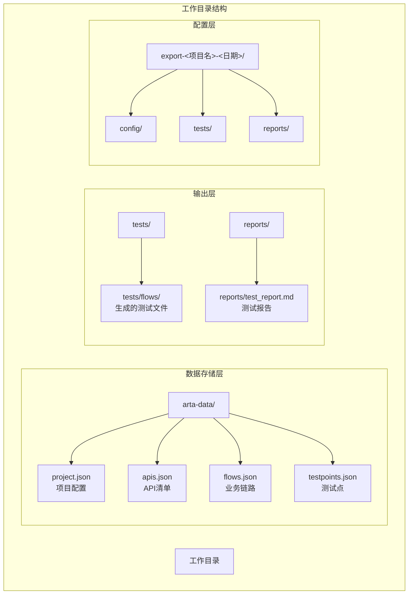
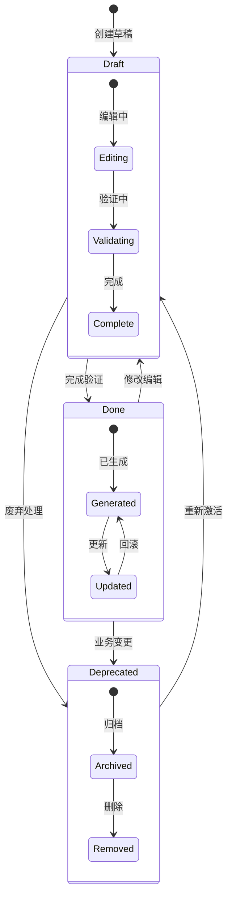
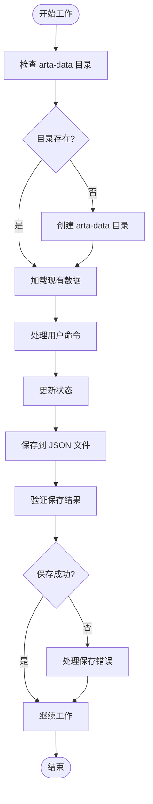
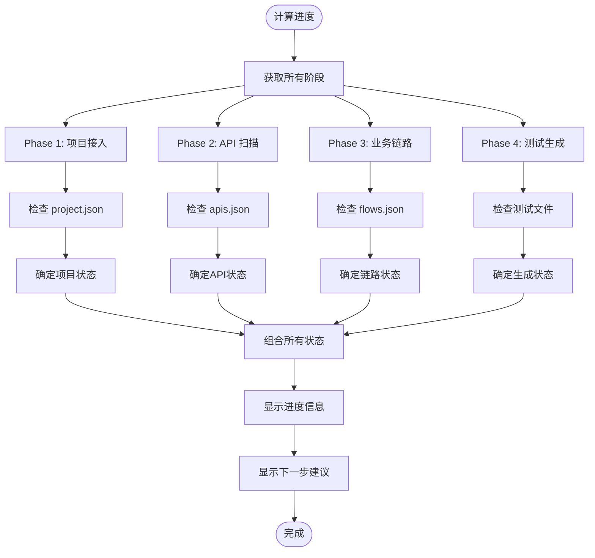
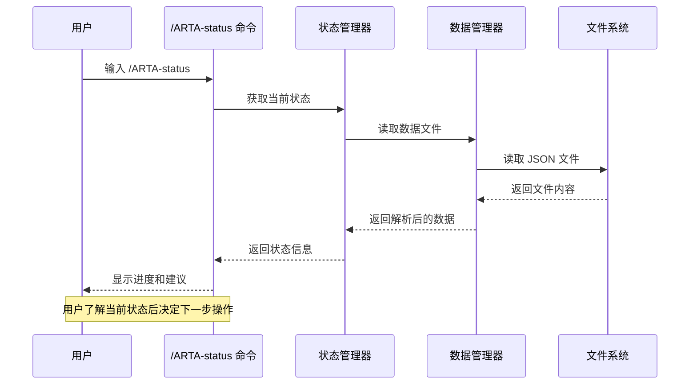
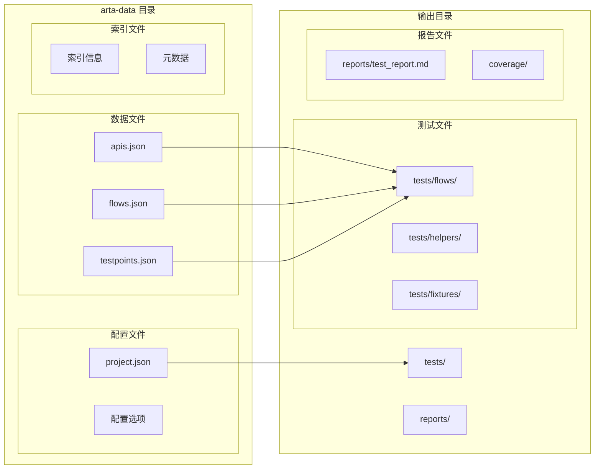

# 断点续作功能

<cite>
**本文档引用的文件**
- [README.md](file://README.md)
- [SKILL.md](file://SKILL.md)
- [flow-and-data-guide.md](file://flow-and-data-guide.md)
- [generation-reference.md](file://generation-reference.md)
</cite>

## 目录
1. [简介](#简介)
2. [项目结构](#项目结构)
3. [核心组件](#核心组件)
4. [架构概览](#架构概览)
5. [详细组件分析](#详细组件分析)
6. [依赖关系分析](#依赖关系分析)
7. [性能考虑](#性能考虑)
8. [故障排除指南](#故障排除指南)
9. [结论](#结论)

## 简介

ARTA（Automation Regression Test Assistant）是一个端到端 API 自动化测试流程引导工具，专门设计支持断点续作功能。该功能允许用户在任何测试流程阶段暂停，通过自然语言描述恢复之前的测试流程，而不会丢失已建立的工作进度。

断点续作功能的核心价值在于：
- **灵活性**：用户可以在任何阶段暂停，无需强制完成整个流程
- **连续性**：通过状态跟踪确保工作流的连续性和完整性
- **易用性**：通过 `/ARTA-status` 指令提供实时进度信息，便于用户了解当前状态
- **可靠性**：基于文件系统的数据持久化策略确保数据安全

## 项目结构

ARTA 采用模块化的项目结构，专门为断点续作功能提供支持：



**图表来源**
- [README.md:151-162](file://README.md#L151-L162)
- [SKILL.md:419-431](file://SKILL.md#L419-L431)

**章节来源**
- [README.md:151-162](file://README.md#L151-L162)
- [SKILL.md:419-431](file://SKILL.md#L419-L431)

## 核心组件

### 数据持久化组件

ARTA 的断点续作功能主要依赖于以下核心数据组件：

#### 项目配置组件 (project.json)
负责存储项目的基本信息和配置状态：
- 项目名称和描述
- 后端框架类型
- 测试框架选择
- API 信息来源配置
- 创建时间戳

#### API 清单组件 (apis.json)
维护扫描得到的 API 列表及其元数据：
- HTTP 方法和路径
- API 描述和模块分类
- 参数和响应信息
- 状态标记和版本控制

#### 业务链路组件 (flows.json)
存储完整的业务流程定义：
- 链路基本信息（名称、模块、优先级）
- API 调用序列和依赖关系
- 测试数据配置策略
- 断言规则和验证逻辑
- 清理步骤和资源管理

#### 测试点组件 (testpoints.json)
管理从思维导图导入的测试点：
- 测试点树状结构
- API 关联映射
- 自动生成的测试用例建议

**章节来源**
- [README.md:157-160](file://README.md#L157-L160)
- [SKILL.md:423-428](file://SKILL.md#L423-L428)

### 状态管理组件

ARTA 实现了多层级的状态管理系统：



**图表来源**
- [flow-and-data-guide.md:211-218](file://flow-and-data-guide.md#L211-L218)

**章节来源**
- [flow-and-data-guide.md:211-218](file://flow-and-data-guide.md#L211-L218)

### 进度跟踪组件

进度跟踪系统提供实时的状态监控和可视化：

#### 阶段状态跟踪
- Phase 1 - 项目接入：done/进行中/未开始
- Phase 2 - API 扫描：done/进行中/未开始  
- Phase 3 - 业务链路：done/进行中/未开始
- Phase 4 - 测试生成：done/进行中/未开始

#### 任务进度监控
- 业务链路完成率统计
- API 覆盖度分析
- 测试用例生成进度

**章节来源**
- [SKILL.md:380-400](file://SKILL.md#L380-L400)

## 架构概览

ARTA 的断点续作架构采用分层设计，确保各组件间的松耦合和高内聚：

```mermaid
graph TB
subgraph "用户交互层"
User[用户界面]
Status[/ARTA-status 指令]
Commands[命令处理器]
end
subgraph "业务逻辑层"
Workflow[工作流引擎]
StateManager[状态管理器]
DataManager[数据管理器]
end
subgraph "数据持久化层"
FileSystem[文件系统]
Artadata[arta-data/目录]
ProjectFile[project.json]
ApiFile[apis.json]
FlowFile[flows.json]
TestpointFile[testpoints.json]
end
subgraph "辅助服务层"
Exporter[导出服务]
Reporter[报告生成器]
Validator[数据验证器]
end
User --> Commands
Commands --> Status
Commands --> Workflow
Status --> StateManager
Workflow --> StateManager
StateManager --> DataManager
DataManager --> FileSystem
FileSystem --> Artadata
Artadata --> ProjectFile
Artadata --> ApiFile
Artadata --> FlowFile
Artadata --> TestpointFile
Workflow --> Exporter
Workflow --> Reporter
DataManager --> Validator
```

**图表来源**
- [SKILL.md:34-78](file://SKILL.md#L34-L78)
- [README.md:151-162](file://README.md#L151-L162)

## 详细组件分析

### 状态保存机制

状态保存机制是断点续作功能的核心，确保用户工作不会因中断而丢失：

#### 文件系统持久化策略



**图表来源**
- [SKILL.md:65-75](file://SKILL.md#L65-L75)
- [SKILL.md:120-137](file://SKILL.md#L120-L137)
- [SKILL.md:224](file://SKILL.md#L224)

#### 数据一致性保证

为了确保数据一致性，ARTA 实现了以下机制：

1. **原子性操作**：每个状态更新都是原子性的，要么完全成功，要么完全失败
2. **事务性处理**：批量操作在单个事务中完成，避免部分更新
3. **版本控制**：关键数据文件包含版本信息，支持向后兼容
4. **校验和验证**：保存前进行数据完整性校验

**章节来源**
- [SKILL.md:65-75](file://SKILL.md#L65-L75)
- [SKILL.md:120-137](file://SKILL.md#L120-L137)
- [SKILL.md:224](file://SKILL.md#L224)

### 进度跟踪算法

进度跟踪算法负责计算和显示当前的工作进度状态：

#### 阶段进度计算



**图表来源**
- [SKILL.md:380-400](file://SKILL.md#L380-L400)

#### 业务链路进度统计

业务链路进度统计采用加权计算方法：

| 状态 | 权重系数 | 描述 |
|------|----------|------|
| draft | 0.0 | 草稿状态，未完成 |
| done | 1.0 | 完成状态，可生成测试 |
| deprecated | 0.0 | 已弃用状态 |

**章节来源**
- [SKILL.md:380-400](file://SKILL.md#L380-L400)

### 恢复流程

恢复流程确保用户能够无缝地从上次中断的地方继续工作：

#### 恢复流程序列



**图表来源**
- [SKILL.md:380-400](file://SKILL.md#L380-L400)

#### 恢复决策支持

恢复流程提供智能的决策支持：

1. **状态可视化**：清晰显示每个阶段的完成状态
2. **进度统计**：提供百分比和绝对数量的进度信息
3. **下一步建议**：基于当前状态给出最优的操作建议
4. **风险提示**：指出可能影响后续工作的状态问题

**章节来源**
- [SKILL.md:380-400](file://SKILL.md#L380-L400)

### 数据持久化策略

ARTA 采用文件系统作为主要的数据持久化存储，确保数据的安全性和可靠性：

#### 文件组织策略



**图表来源**
- [README.md:151-162](file://README.md#L151-L162)
- [SKILL.md:419-431](file://SKILL.md#L419-L431)

#### 数据备份策略

为了确保数据安全，ARTA 实现了多层次的备份机制：

1. **自动备份**：每次状态更新时自动创建备份文件
2. **版本管理**：支持多版本数据文件的管理
3. **增量备份**：只备份发生变化的数据部分
4. **手动导出**：提供 `/ARTA-export` 命令进行完整导出

**章节来源**
- [README.md:151-162](file://README.md#L151-L162)
- [SKILL.md:402-416](file://SKILL.md#L402-L416)

## 依赖关系分析

ARTA 的断点续作功能涉及多个组件间的复杂依赖关系：

```mermaid
graph TB
subgraph "核心依赖"
StatusCmd[/ARTA-status 命令]
WorkflowEngine[工作流引擎]
StateManager[状态管理器]
end
subgraph "数据依赖"
ProjectJSON[project.json]
ApisJSON[apis.json]
FlowsJSON[flows.json]
TestpointsJSON[testpoints.json]
end
subgraph "外部依赖"
FileSystem[文件系统]
JSONParser[JSON 解析器]
PathResolver[路径解析器]
end
subgraph "辅助依赖"
ExportService[导出服务]
ReportGenerator[报告生成器]
Validator[数据验证器]
end
StatusCmd --> WorkflowEngine
WorkflowEngine --> StateManager
StateManager --> ProjectJSON
StateManager --> ApisJSON
StateManager --> FlowsJSON
StateManager --> TestpointsJSON
ProjectJSON --> FileSystem
ApisJSON --> FileSystem
FlowsJSON --> FileSystem
TestpointsJSON --> FileSystem
FileSystem --> JSONParser
JSONParser --> PathResolver
WorkflowEngine --> ExportService
WorkflowEngine --> ReportGenerator
StateManager --> Validator
```

**图表来源**
- [SKILL.md:34-78](file://SKILL.md#L34-L78)
- [README.md:151-162](file://README.md#L151-L162)

### 组件耦合度分析

| 组件 | 内聚性 | 耦合度 | 说明 |
|------|--------|--------|------|
| 状态管理器 | 高 | 低 | 专注于状态管理，与其他组件解耦 |
| 数据管理器 | 高 | 中等 | 处理数据读写，与文件系统耦合 |
| 命令处理器 | 中等 | 低 | 处理用户命令，保持简单职责 |
| 导出服务 | 中等 | 高 | 需要访问多个数据源，耦合度较高 |

**章节来源**
- [SKILL.md:34-78](file://SKILL.md#L34-L78)
- [README.md:151-162](file://README.md#L151-L162)

## 性能考虑

断点续作功能在设计时充分考虑了性能优化：

### 数据访问性能

1. **延迟加载**：只在需要时加载相关数据文件
2. **缓存机制**：频繁访问的数据在内存中缓存
3. **批量操作**：支持批量数据更新以减少文件 I/O 操作

### 内存使用优化

1. **流式处理**：大文件采用流式读取方式
2. **分页加载**：业务链路列表采用分页加载
3. **垃圾回收**：及时释放不再使用的对象引用

### 并发安全性

1. **文件锁机制**：防止并发写入导致的数据损坏
2. **事务性操作**：确保数据操作的原子性
3. **状态一致性检查**：定期验证数据完整性

## 故障排除指南

### 常见问题及解决方案

#### 状态文件损坏

**症状**：`/ARTA-status` 命令无法正常显示进度信息

**诊断步骤**：
1. 检查 `arta-data/` 目录是否存在
2. 验证 JSON 文件格式是否正确
3. 检查文件权限是否正确

**解决方法**：
1. 使用 `/ARTA-export` 命令导出当前状态
2. 删除损坏的 JSON 文件
3. 重新执行相应的命令重建数据

#### 数据不一致

**症状**：不同命令显示的状态不一致

**诊断步骤**：
1. 检查所有 JSON 文件的时间戳
2. 验证业务链路的依赖关系
3. 确认 API 清单与实际代码的一致性

**解决方法**：
1. 执行 `/ARTA-status` 命令重新计算状态
2. 手动修复不一致的数据
3. 使用备份文件恢复

#### 性能问题

**症状**：命令响应缓慢或超时

**诊断步骤**：
1. 检查磁盘空间是否充足
2. 验证网络连接状态（如果是远程 API）
3. 监控系统资源使用情况

**解决方法**：
1. 清理不必要的测试文件
2. 优化业务链路的复杂度
3. 考虑分批处理大量数据

### 最佳实践建议

#### 数据备份策略

1. **定期备份**：建议每天执行一次完整的数据备份
2. **版本保留**：保留最近 7 天的备份版本
3. **异地存储**：将备份文件存储在不同的物理位置
4. **自动化备份**：配置定时任务自动执行备份

#### 状态检查机制

1. **每日检查**：每天开始工作前检查系统状态
2. **关键节点检查**：在重要的里程碑节点进行状态验证
3. **异常告警**：设置异常状态的自动告警机制
4. **定期审计**：定期对数据完整性进行审计

#### 异常恢复处理

1. **快速恢复**：制定标准的异常恢复流程
2. **数据恢复**：确保能够从最近的备份快速恢复
3. **业务连续性**：最小化异常对业务的影响
4. **经验总结**：记录异常处理经验，持续改进

**章节来源**
- [SKILL.md:402-416](file://SKILL.md#L402-L416)

## 结论

ARTA 的断点续作功能通过精心设计的数据持久化策略、智能的状态管理和直观的进度跟踪机制，为用户提供了可靠的自动化测试工作流体验。该功能的核心优势包括：

### 技术优势

1. **可靠性**：基于文件系统的持久化策略确保数据安全
2. **灵活性**：支持任意阶段的暂停和恢复
3. **易用性**：通过自然语言和简单指令提供友好的用户体验
4. **扩展性**：模块化的架构设计支持功能扩展

### 业务价值

1. **提高效率**：减少重复工作，提高测试流程效率
2. **降低风险**：通过状态跟踪和备份机制降低数据丢失风险
3. **增强协作**：支持多人协作和知识传承
4. **提升质量**：通过完整的测试覆盖提升软件质量

### 发展前景

随着测试需求的不断增长和技术的持续演进，ARTA 的断点续作功能将继续完善，为用户提供更加智能化、自动化的测试工作流解决方案。未来的发展方向包括：

1. **云端集成**：支持云端数据存储和协作
2. **AI 辅助**：利用人工智能技术提供更智能的建议
3. **可视化增强**：提供更丰富的可视化工具
4. **生态扩展**：与更多测试工具和平台集成

通过持续的技术创新和用户体验优化，ARTA 的断点续作功能将成为自动化测试领域的重要基础设施，为软件质量和开发效率的提升做出重要贡献。