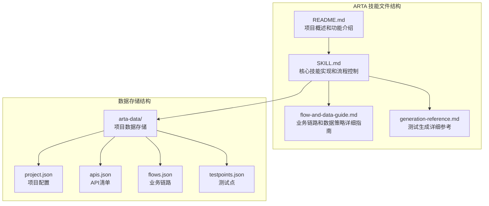
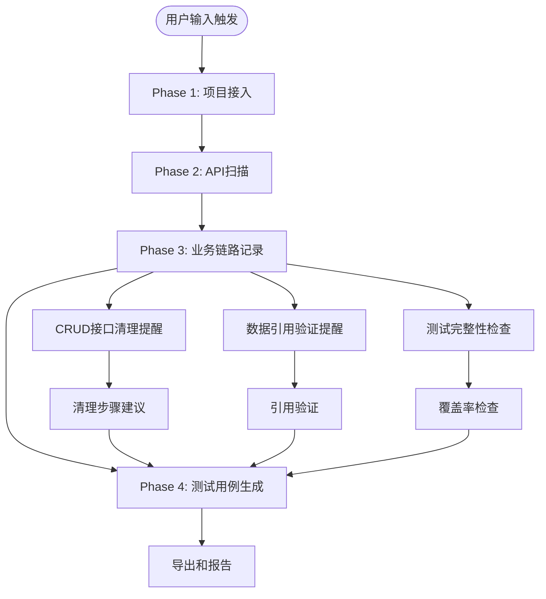
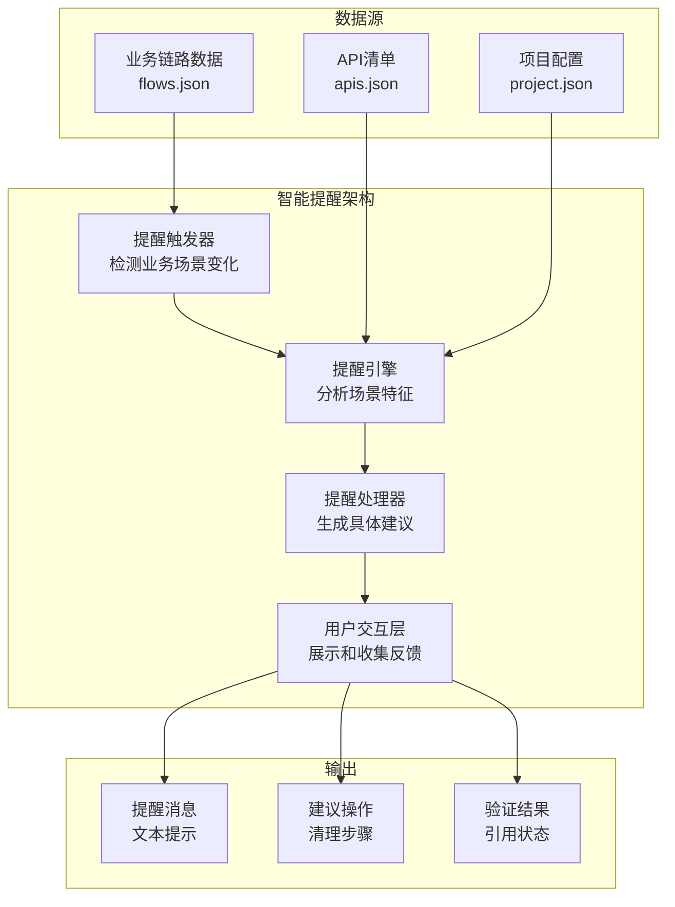
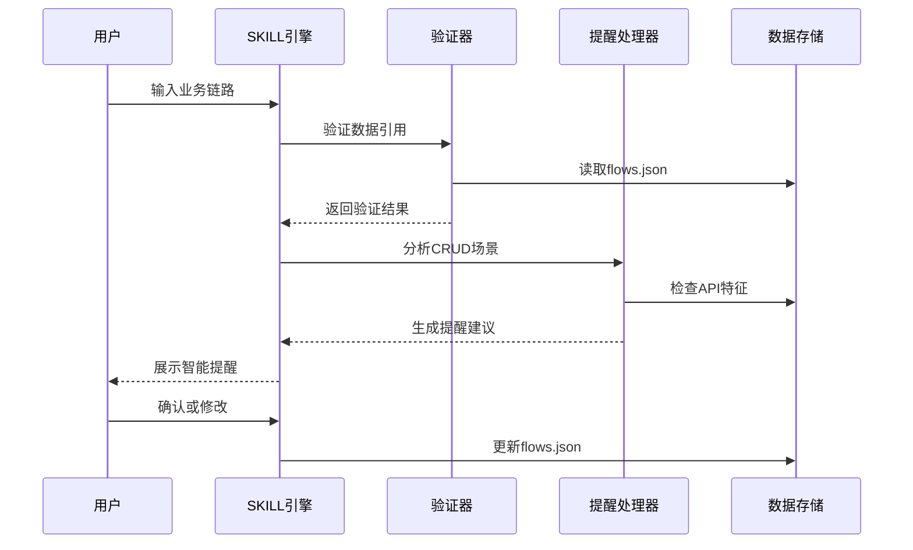
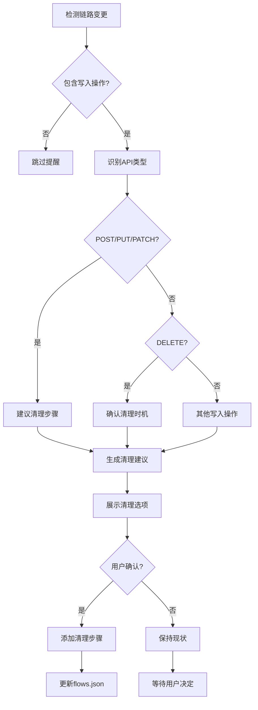
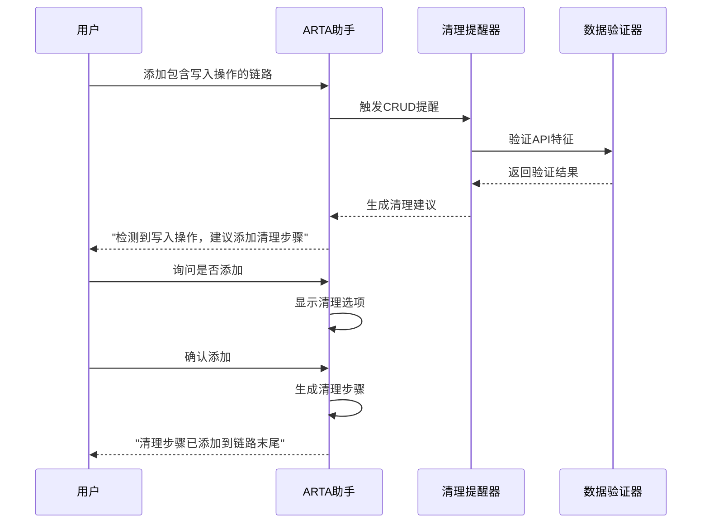
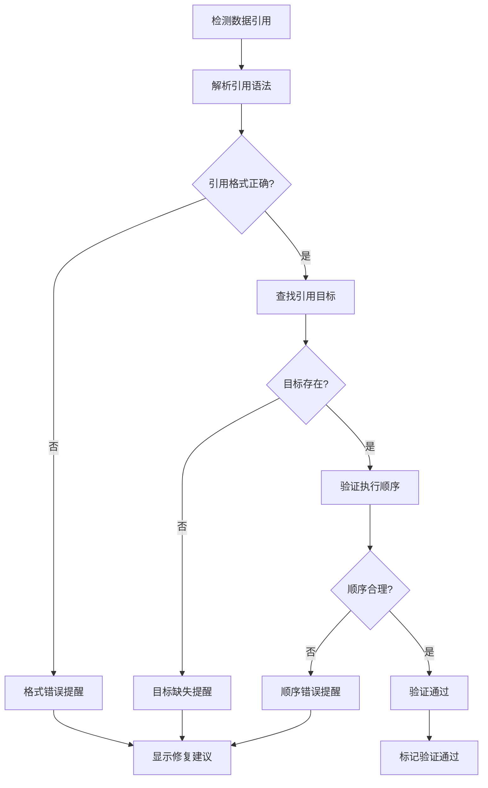
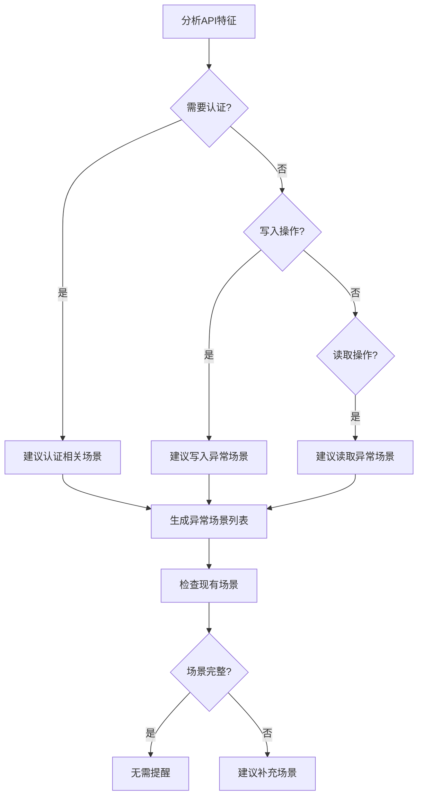
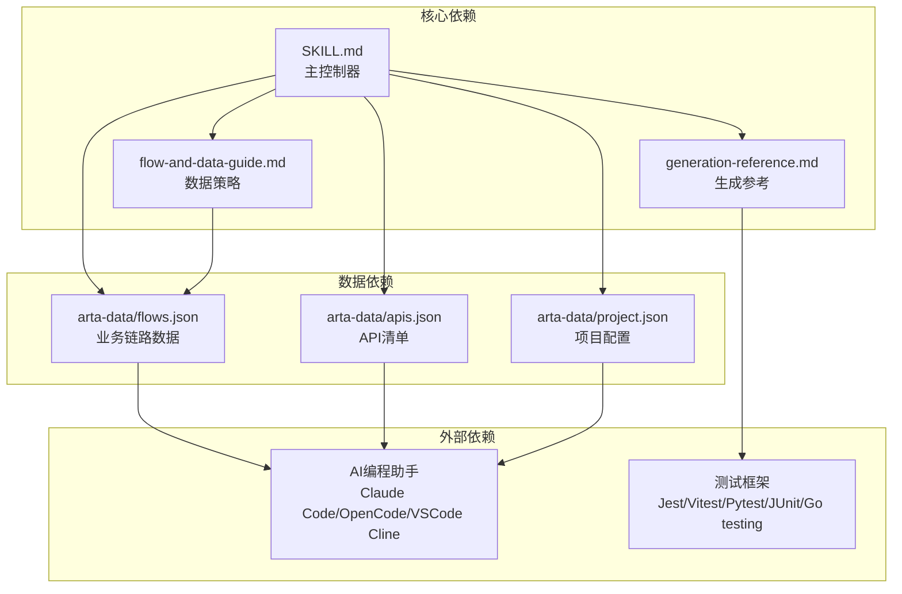
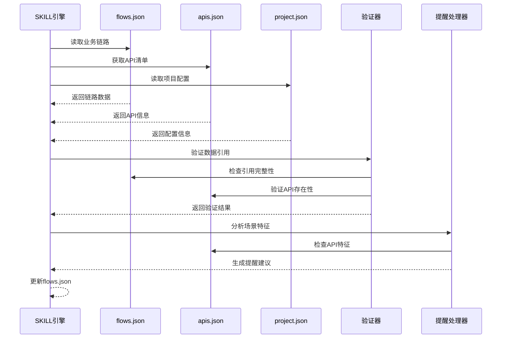

# 智能提醒机制

<cite>
**本文档引用的文件**
- [README.md](file://README.md)
- [SKILL.md](file://SKILL.md)
- [flow-and-data-guide.md](file://flow-and-data-guide.md)
- [generation-reference.md](file://generation-reference.md)
</cite>

## 目录
1. [简介](#简介)
2. [项目结构](#项目结构)
3. [核心组件](#核心组件)
4. [架构概览](#架构概览)
5. [详细组件分析](#详细组件分析)
6. [依赖关系分析](#依赖关系分析)
7. [性能考虑](#性能考虑)
8. [故障排除指南](#故障排除指南)
9. [结论](#结论)
10. [附录](#附录)

## 简介

ARTA（Automation Regression Test Assistant）是一个端到端的API自动化测试流程引导工具，专门设计用于帮助开发团队从项目接入到测试用例生成的完整测试工作流程。该系统的核心特色之一是其智能提醒机制，能够自动识别业务场景并提供针对性的测试建议。

智能提醒机制主要包含三个核心功能：
- **CRUD接口清理提醒**：自动检测包含写入操作的链路并建议添加清理步骤
- **数据引用验证提醒**：验证测试数据引用的完整性和正确性
- **测试完整性检查**：确保测试场景覆盖的完整性和合理性

## 项目结构

ARTA项目采用模块化的文档结构，四个核心文件构成了完整的技能实现：

**图表来源**
- [README.md: 1-176:1-176](file://README.md#L1-L176)
- [SKILL.md: 1-443:1-443](file://SKILL.md#L1-L443)

**章节来源**
- [README.md: 1-176:1-176](file://README.md#L1-L176)
- [SKILL.md: 1-443:1-443](file://SKILL.md#L1-L443)

## 核心组件

### 智能提醒系统架构

智能提醒机制基于ARTA的四阶段工作流程，在每个阶段的关键节点提供智能化的指导和建议：

**图表来源**
- [SKILL.md: 246-258:246-258](file://SKILL.md#L246-L258)
- [flow-and-data-guide.md: 146-218:146-218](file://flow-and-data-guide.md#L146-L218)

### 提醒触发条件

智能提醒机制的触发基于以下核心条件：

#### CRUD接口清理提醒触发条件
- **写入操作检测**：链路中包含POST、PUT、PATCH、DELETE等写入操作
- **资源创建识别**：检测到可能创建持久化资源的API调用
- **清理步骤缺失**：链路末尾缺少相应的清理操作

#### 数据引用验证提醒触发条件
- **上游引用检测**：发现`${步骤.字段}`形式的引用
- **引用完整性**：被引用的步骤或字段不存在
- **数据流验证**：引用顺序不符合执行逻辑

#### 测试完整性检查触发条件
- **场景覆盖不足**：关键异常场景缺失
- **数据准备不充分**：前置条件数据不完整
- **断言配置不完整**：缺少必要的断言规则

**章节来源**
- [SKILL.md: 246-258:246-258](file://SKILL.md#L246-L258)
- [flow-and-data-guide.md: 146-218:146-218](file://flow-and-data-guide.md#L146-L218)

## 架构概览

### 整体架构设计

智能提醒机制采用事件驱动的设计模式，在ARTA的各个工作阶段自动触发相应的提醒逻辑：

**图表来源**
- [SKILL.md: 434-443:434-443](file://SKILL.md#L434-L443)
- [flow-and-data-guide.md: 5-75:5-75](file://flow-and-data-guide.md#L5-L75)

### 数据流架构

智能提醒机制的数据流遵循严格的处理顺序：

**图表来源**
- [SKILL.md: 246-258:246-258](file://SKILL.md#L246-L258)
- [flow-and-data-guide.md: 5-75:5-75](file://flow-and-data-guide.md#L5-L75)

## 详细组件分析

### CRUD接口清理提醒系统

#### 触发机制

CRUD接口清理提醒是智能提醒机制中最核心的功能，它能够自动识别包含写入操作的业务链路并建议相应的清理步骤：

**图表来源**
- [SKILL.md: 246-258:246-258](file://SKILL.md#L246-L258)

#### 提醒内容生成算法

清理提醒的生成遵循以下算法：

1. **API类型识别**：通过HTTP方法判断API属于CRUD操作类别
2. **资源创建检测**：识别可能创建持久化资源的API
3. **清理时机确定**：根据API特性确定最佳清理时机
4. **清理步骤生成**：生成对应的清理API调用建议

#### 用户交互流程

**图表来源**
- [SKILL.md: 246-258:246-258](file://SKILL.md#L246-L258)

**章节来源**
- [SKILL.md: 246-258:246-258](file://SKILL.md#L246-L258)

### 数据引用验证提醒系统

#### 验证算法

数据引用验证提醒系统采用多层次的验证策略：

**图表来源**
- [flow-and-data-guide.md: 108-122:108-122](file://flow-and-data-guide.md#L108-L122)

#### 关键词匹配识别机制

智能提醒系统通过关键词匹配来识别不同的业务场景：

| 关键词类别 | 匹配方法 | 匹配路径模式 |
|-----------|----------|-------------|
| 登录/签入 | POST | /login, /auth/login, /signin |
| 注册/注册 | POST | /register, /signup |
| 查询/搜索/列表 | GET | /list, /search, /query |
| 创建/添加/新增 | POST | /create, /add |
| 更新/修改/编辑 | PUT/PATCH | /update, /modify |
| 删除/移除 | DELETE | /delete, /remove |

**章节来源**
- [SKILL.md: 275-285:275-285](file://SKILL.md#L275-L285)

### 测试完整性检查系统

#### 场景覆盖分析

测试完整性检查系统基于API特征自动建议异常场景：

**图表来源**
- [generation-reference.md: 230-241:230-241](file://generation-reference.md#L230-L241)

#### 异常场景规则

| API特征 | 建议异常场景 |
|---------|-------------|
| 需要认证 | 401未认证 / token过期 |
| POST创建 | 400缺少必填字段 / 409重复创建 |
| GET带路径参数 | 404资源不存在 |
| PUT/PATCH更新 | 403无权限 / 404不存在 |
| DELETE删除 | 403无权限 / 404不存在 |

**章节来源**
- [generation-reference.md: 230-241:230-241](file://generation-reference.md#L230-L241)

## 依赖关系分析

### 组件间依赖关系

智能提醒机制的各个组件之间存在紧密的依赖关系：

**图表来源**
- [SKILL.md: 18-31:18-31](file://SKILL.md#L18-L31)
- [README.md: 151-162:151-162](file://README.md#L151-L162)

### 数据流依赖

智能提醒机制的数据流依赖关系如下：

**图表来源**
- [flow-and-data-guide.md: 5-75:5-75](file://flow-and-data-guide.md#L5-L75)
- [SKILL.md: 434-443:434-443](file://SKILL.md#L434-L443)

**章节来源**
- [SKILL.md: 18-31:18-31](file://SKILL.md#L18-L31)
- [README.md: 151-162:151-162](file://README.md#L151-L162)

## 性能考虑

### 提醒处理性能

智能提醒机制在设计时充分考虑了性能优化：

1. **延迟计算**：提醒只在必要时触发，避免不必要的计算开销
2. **缓存机制**：对API特征和项目配置进行缓存，减少重复查询
3. **增量更新**：只对发生变化的链路进行重新验证
4. **异步处理**：大型链路的验证采用异步处理方式

### 内存使用优化

- **数据分片**：将大型数据集分片处理，避免内存溢出
- **引用传递**：大量使用引用而非复制，减少内存占用
- **垃圾回收**：及时释放不再使用的临时对象

## 故障排除指南

### 常见问题及解决方案

#### 提醒不触发问题

**问题描述**：智能提醒没有按照预期触发

**可能原因**：
- 业务链路数据格式不正确
- API清单缺失或格式错误
- 项目配置不完整

**解决步骤**：
1. 检查`arta-data/flows.json`格式是否正确
2. 验证`arta-data/apis.json`中API定义
3. 确认`arta-data/project.json`配置完整

#### 提醒内容不准确

**问题描述**：智能提醒提供的建议与实际需求不符

**解决步骤**：
1. 检查业务链路中API的HTTP方法和路径
2. 验证数据引用的语法格式
3. 确认测试场景的覆盖范围

#### 用户交互问题

**问题描述**：用户无法正确接收或处理提醒

**解决步骤**：
1. 检查AI编程助手的日志输出
2. 验证提醒消息的格式和内容
3. 确认用户反馈的处理流程

**章节来源**
- [SKILL.md: 434-443:434-443](file://SKILL.md#L434-L443)

## 结论

ARTA的智能提醒机制通过精心设计的算法和用户友好的交互界面，为API自动化测试提供了强大的辅助功能。该系统不仅能够自动识别业务场景并提供针对性的建议，还能确保测试数据的完整性和测试场景的覆盖率。

智能提醒机制的核心优势在于：

1. **自动化程度高**：减少了手动检查的工作量
2. **准确性强**：基于严格的验证算法确保提醒质量
3. **用户友好**：提供清晰的交互界面和操作指导
4. **可扩展性强**：支持自定义提醒规则和配置选项

随着ARTA系统的不断发展，智能提醒机制将继续完善，为开发团队提供更加智能化的测试辅助服务。

## 附录

### 配置选项和自定义机制

#### 提醒类型配置

| 配置项 | 类型 | 默认值 | 说明 |
|--------|------|--------|------|
| CRUD清理提醒 | 布尔值 | true | 是否启用CRUD接口清理提醒 |
| 数据引用验证 | 布尔值 | true | 是否启用数据引用验证提醒 |
| 测试完整性检查 | 布尔值 | true | 是否启用测试完整性检查 |
| 关键词匹配规则 | 对象数组 | 预定义规则 | 自定义关键词匹配规则 |

#### 提醒时机调整

- **实时提醒**：在用户输入时立即触发
- **批量提醒**：在链路保存时统一处理
- **定时提醒**：定期检查数据完整性

#### 自定义机制

1. **关键词扩展**：支持添加新的业务场景关键词
2. **提醒规则定制**：允许用户修改提醒触发条件
3. **交互界面定制**：支持调整提醒显示格式
4. **集成接口**：提供API接口供外部系统集成