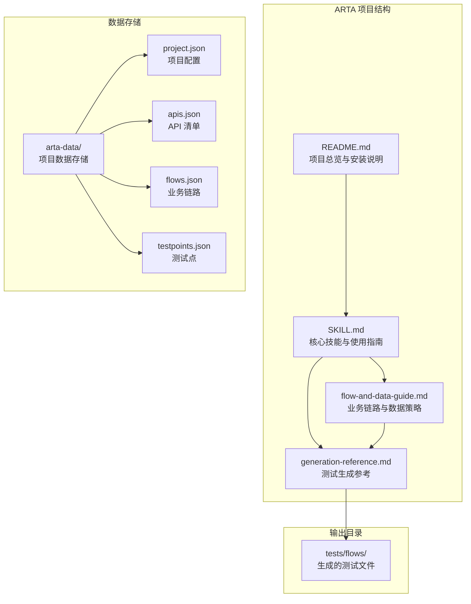
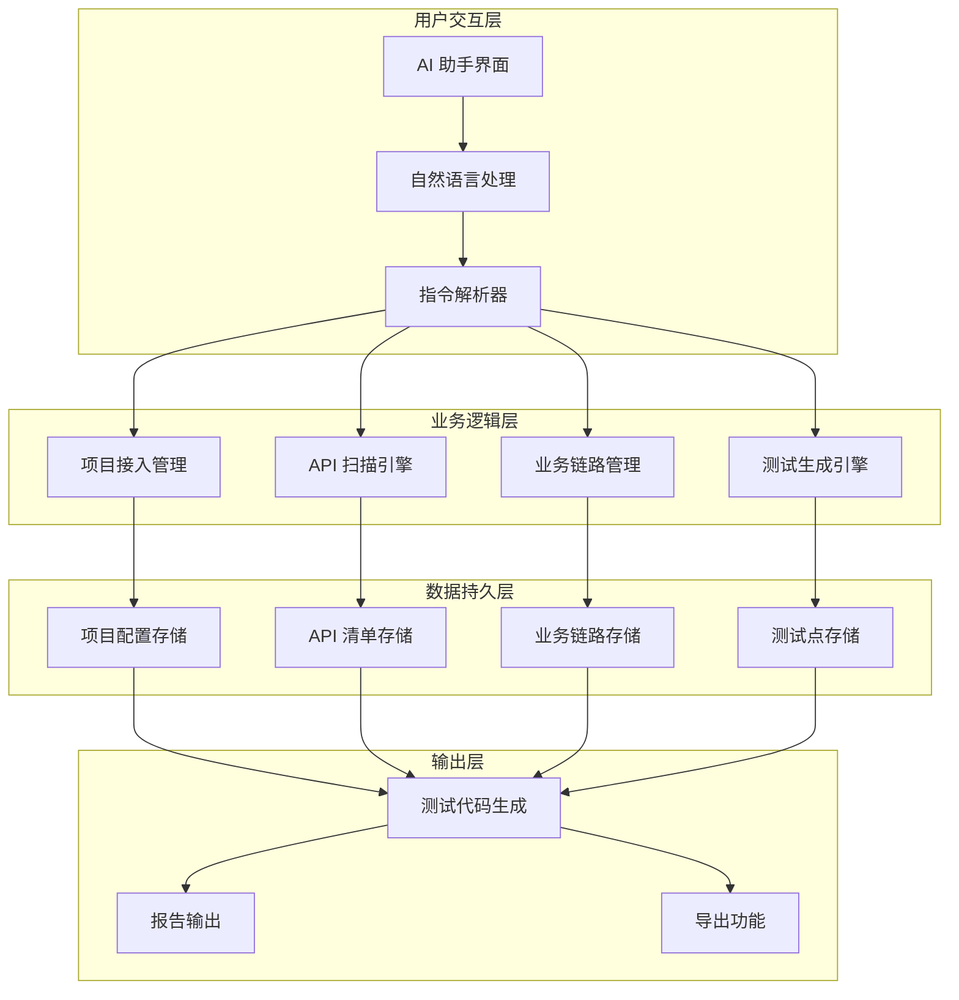
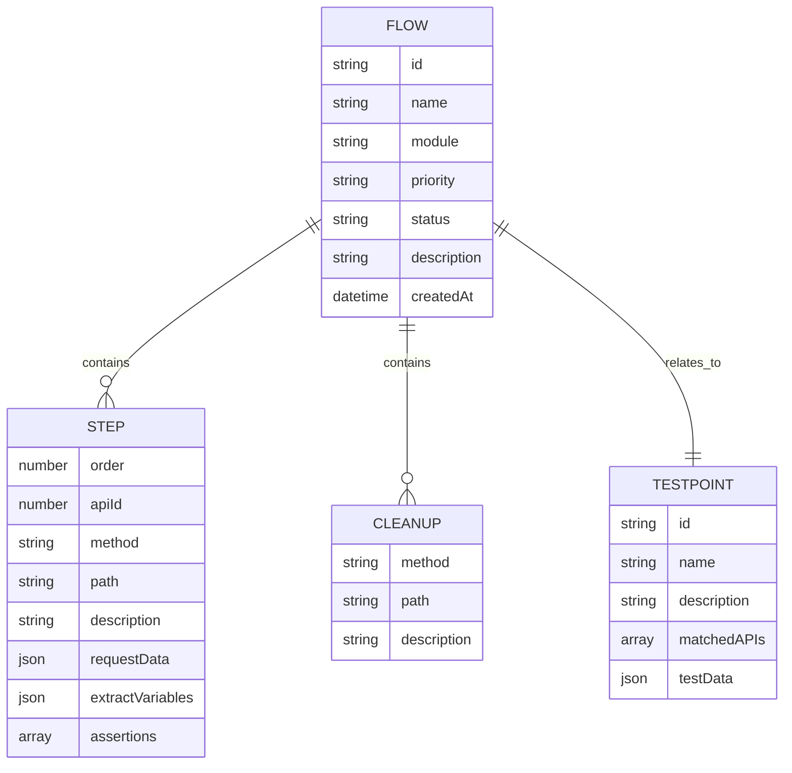
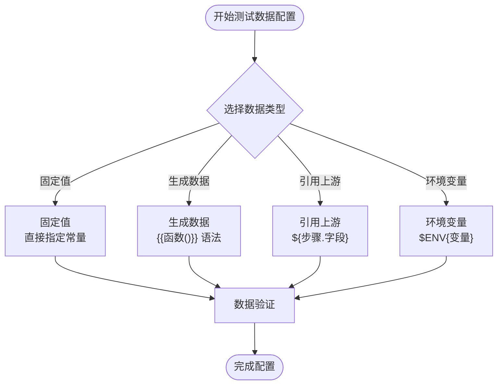
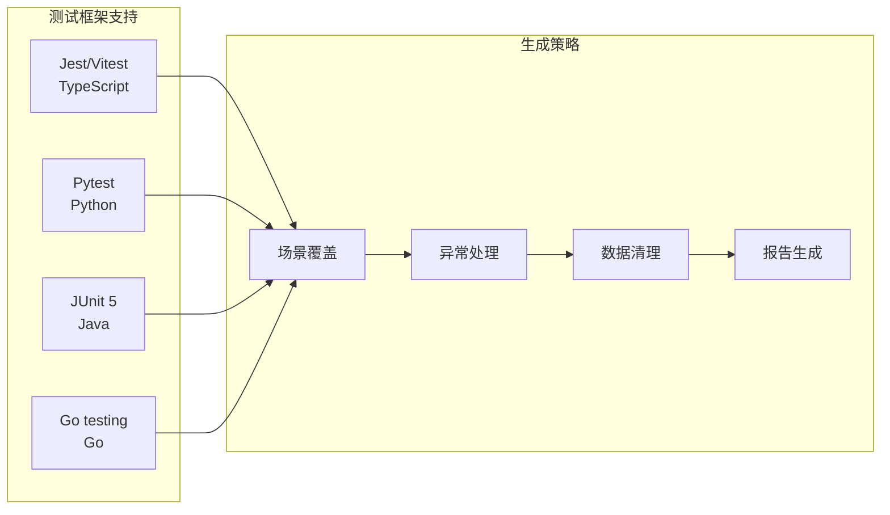
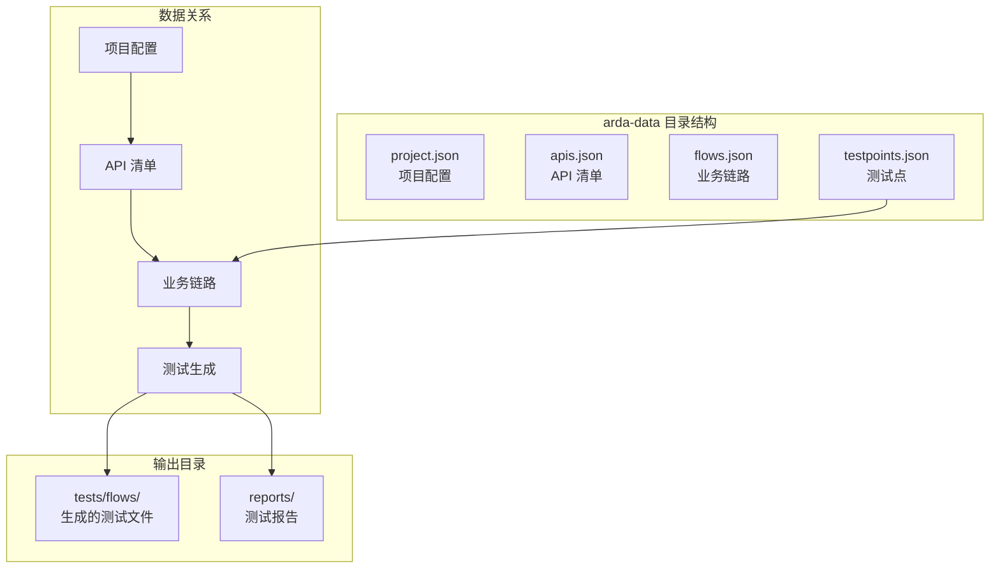
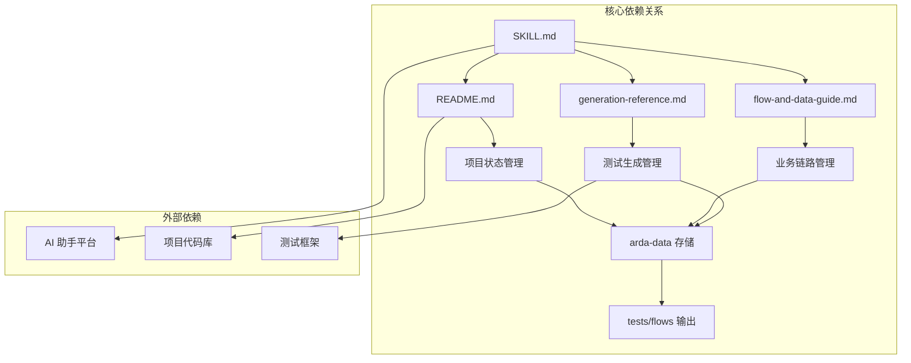
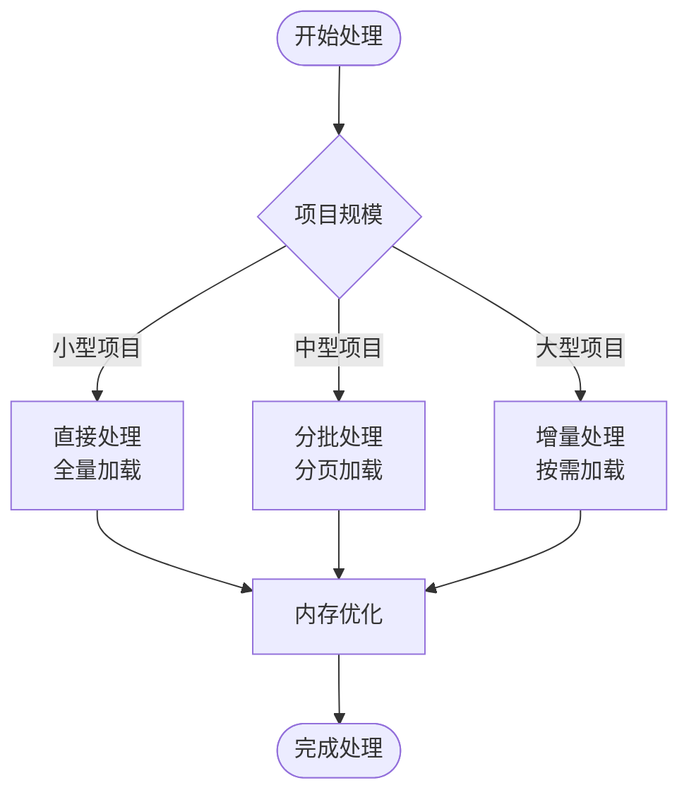

# 高级功能与技巧

<cite>
**本文档引用的文件**
- [README.md](file://README.md)
- [SKILL.md](file://SKILL.md)
- [flow-and-data-guide.md](file://flow-and-data-guide.md)
- [generation-reference.md](file://generation-reference.md)
</cite>

## 目录
1. [简介](#简介)
2. [项目结构](#项目结构)
3. [核心组件](#核心组件)
4. [架构概览](#架构概览)
5. [详细组件分析](#详细组件分析)
6. [依赖关系分析](#依赖关系分析)
7. [性能考虑](#性能考虑)
8. [故障排除指南](#故障排除指南)
9. [结论](#结论)
10. [附录](#附录)

## 简介

ARTA（Automation Regression Test Assistant）是一个端到端 API 自动化测试流程引导工具，专为开发团队设计，帮助从项目接入到测试用例生成的完整测试流程。该工具的核心优势在于其智能化的断点续作能力、增量操作支持和智能提醒机制。

ARTA 提供了四个阶段的测试工作流程：
- **阶段 1：项目接入** - 配置项目基本信息、选择后端框架和测试框架
- **阶段 2：API 扫描** - 自动分析代码路由或解析 OpenAPI/Swagger 规范
- **阶段 3：业务链路记录** - 定义 API 调用序列、测试数据和断言规则
- **阶段 4：测试用例生成** - 基于链路自动生成多框架测试代码

## 项目结构

ARTA 项目采用简洁明了的文档驱动结构，主要包含四个核心文件：

**图表来源**
- [README.md: 151-162:151-162](file://README.md#L151-L162)
- [SKILL.md: 419-431:419-431](file://SKILL.md#L419-L431)

**章节来源**
- [README.md: 1-176:1-176](file://README.md#L1-L176)
- [SKILL.md: 419-431:419-431](file://SKILL.md#L419-L431)

## 核心组件

### 断点续作系统

ARTA 的断点续作功能是其最突出的特性之一，允许用户在任何阶段暂停并随时恢复工作。

#### 状态管理系统
- **项目状态跟踪**：通过 `/ARTA-status` 指令查看当前项目进度
- **阶段状态维护**：每个阶段都有明确的状态标识（done、draft、deprecated）
- **进度可视化**：清晰显示已完成和进行中的任务

#### 恢复机制
- **状态持久化**：所有项目状态保存在 `arta-data/` 目录下的 JSON 文件中
- **断点标记**：系统自动标记用户的断点位置
- **进度回溯**：支持查看历史进度和变更记录

**章节来源**
- [README.md: 172-173:172-173](file://README.md#L172-L173)
- [SKILL.md: 380-400:380-400](file://SKILL.md#L380-L400)
- [SKILL.md: 434-443:434-443](file://SKILL.md#L434-L443)

### 增量操作支持

ARTA 的增量操作策略允许用户在不重新开始整个流程的情况下添加新功能。

#### 新 API 添加策略
- **独立扫描**：支持随时添加新的 API 到现有项目中
- **智能合并**：自动处理重复 API 和版本冲突
- **模块化管理**：新 API 自动归类到相应模块

#### 新链路添加机制
- **独立创建**：新业务链路不影响现有链路状态
- **状态隔离**：草稿状态的链路不会影响生成流程
- **增量生成**：只生成新增链路对应的测试代码

**章节来源**
- [README.md: 173-174:173-174](file://README.md#L173-L174)
- [SKILL.md: 143-258:143-258](file://SKILL.md#L143-L258)

### 智能提醒机制

ARTA 的智能提醒系统通过分析业务链路的 CRUD 操作特征，自动建议必要的清理步骤。

#### CRUD 操作识别
- **创建操作检测**：自动识别 POST 请求作为创建操作
- **清理步骤建议**：为每个写入操作建议对应的删除操作
- **条件触发**：只有在链路包含写入操作时才触发提醒

#### 清理策略
- **自动建议**：系统自动生成清理步骤建议
- **手动确认**：用户可以选择接受或拒绝建议
- **最佳实践**：遵循测试数据清理的最佳实践

**章节来源**
- [SKILL.md: 246-257:246-257](file://SKILL.md#L246-L257)
- [flow-and-data-guide.md: 146-185:146-185](file://flow-and-data-guide.md#L146-L185)

## 架构概览

ARTA 采用模块化的架构设计，每个组件都有明确的职责和边界：

**图表来源**
- [SKILL.md: 10-16:10-16](file://SKILL.md#L10-L16)
- [SKILL.md: 419-431:419-431](file://SKILL.md#L419-L431)

## 详细组件分析

### 业务链路管理系统

业务链路是 ARTA 的核心概念，代表一个完整的业务场景的 API 调用序列。

#### 链路数据结构
每个业务链路包含以下关键元素：

**图表来源**
- [flow-and-data-guide.md: 7-75:7-75](file://flow-and-data-guide.md#L7-L75)

#### 测试数据策略

ARTA 支持四种类型的测试数据，每种都有特定的使用场景：

**图表来源**
- [flow-and-data-guide.md: 77-132:77-132](file://flow-and-data-guide.md#L77-L132)

**章节来源**
- [flow-and-data-guide.md: 7-132:7-132](file://flow-and-data-guide.md#L7-L132)

### 测试生成引擎

ARTA 的测试生成引擎支持多种编程语言和测试框架，提供高度一致的测试体验。

#### 多框架支持策略

**图表来源**
- [generation-reference.md: 5-304:5-304](file://generation-reference.md#L5-L304)

#### 生成场景覆盖

ARTA 默认为每个业务链路生成以下场景：

| 场景类型 | 说明 | 数量 |
|---------|------|------|
| 正向流程 | 完整业务链路端到端 | 1 |
| 单步正向 | 每个 API 单独的成功场景 | N (API数量) |
| 关键异常 | 认证失败、资源不存在、参数错误 | 2-4 |

**章节来源**
- [generation-reference.md: 218-241:218-241](file://generation-reference.md#L218-L241)

### 数据存储与管理

ARTA 采用 JSON 文件作为主要的数据存储格式，确保数据的可移植性和易维护性。

#### 数据存储策略

**图表来源**
- [README.md: 151-162:151-162](file://README.md#L151-L162)
- [SKILL.md: 419-431:419-431](file://SKILL.md#L419-L431)

**章节来源**
- [README.md: 151-162:151-162](file://README.md#L151-L162)
- [SKILL.md: 419-431:419-431](file://SKILL.md#L419-L431)

## 依赖关系分析

ARTA 的组件之间存在清晰的依赖关系，形成了一个有机的整体：

**图表来源**
- [SKILL.md: 1-443:1-443](file://SKILL.md#L1-L443)
- [README.md: 1-176:1-176](file://README.md#L1-L176)

**章节来源**
- [SKILL.md: 1-443:1-443](file://SKILL.md#L1-L443)
- [README.md: 1-176:1-176](file://README.md#L1-L176)

## 性能考虑

### 大规模项目处理策略

对于大型项目，ARTA 提供了多种性能优化策略：

#### API 扫描优化
- **增量扫描**：只扫描新增或修改的代码文件
- **并行处理**：利用多核处理器并行分析多个文件
- **缓存机制**：缓存已扫描的 API 结果，避免重复计算

#### 业务链路管理
- **分页加载**：大量链路时采用分页显示和加载
- **懒加载**：只在需要时加载链路的详细信息
- **内存优化**：及时释放不再使用的链路数据

#### 测试生成优化
- **并行生成**：多个链路可以并行生成测试代码
- **增量生成**：只生成新增链路的测试代码
- **模板缓存**：缓存常用的代码模板

### 内存使用优化

## 故障排除指南

### 常见问题诊断

#### 项目状态异常
**症状**：`/ARTA-status` 显示状态不正确
**解决方案**：
1. 检查 `arta-data/` 目录下的 JSON 文件完整性
2. 使用 `/ARTA-export` 导出并重新导入项目
3. 重新初始化项目配置

#### API 扫描失败
**症状**：扫描过程中出现错误或遗漏 API
**解决方案**：
1. 检查项目代码的语法正确性
2. 确认项目根目录包含正确的配置文件
3. 手动添加缺失的 API 到 `arta-data/apis.json`

#### 业务链路生成错误
**症状**：生成测试代码时出现语法错误
**解决方案**：
1. 检查链路中的数据引用是否正确
2. 验证断言规则的语法
3. 确认测试框架配置正确

#### 性能问题
**症状**：处理大型项目时响应缓慢
**解决方案**：
1. 使用增量操作逐步处理
2. 优化业务链路的复杂度
3. 考虑分批生成测试代码

**章节来源**
- [SKILL.md: 380-400:380-400](file://SKILL.md#L380-L400)
- [flow-and-data-guide.md: 211-218:211-218](file://flow-and-data-guide.md#L211-L218)

### 最佳实践建议

#### 项目组织最佳实践
- **模块化设计**：按照业务模块组织 API 和链路
- **命名规范**：使用清晰、一致的命名约定
- **版本控制**：定期备份项目数据

#### 测试数据管理
- **数据隔离**：使用生成的数据避免冲突
- **清理策略**：为每个写入操作设计清理步骤
- **环境适配**：使用环境变量适应不同测试环境

#### 性能优化技巧
- **增量处理**：充分利用 ARTA 的增量操作功能
- **并行处理**：合理安排多个链路的生成顺序
- **资源管理**：及时清理不再使用的测试数据

## 结论

ARTA 作为一个智能化的自动化测试助手，通过其独特的断点续作、增量操作和智能提醒机制，为开发团队提供了高效、可靠的 API 测试解决方案。其模块化的架构设计和丰富的多框架支持，使其能够适应各种技术栈和项目规模的需求。

通过深入理解和掌握 ARTA 的高级功能，开发团队可以显著提高测试效率，减少重复工作，并确保测试覆盖率和质量。无论是小型项目还是大型企业应用，ARTA 都能提供相应的优化策略和最佳实践指导。

## 附录

### 高级使用技巧

#### 专家级使用策略
- **预设模板**：创建常用业务场景的模板，快速复用
- **批量操作**：利用增量功能批量添加相似的链路
- **自动化集成**：将 ARTA 集成到 CI/CD 流程中

#### 效率提升方法
- **快捷指令**：熟练掌握各种指令的组合使用
- **数据复用**：合理设计测试数据的复用策略
- **报告分析**：定期分析测试报告，持续改进测试策略