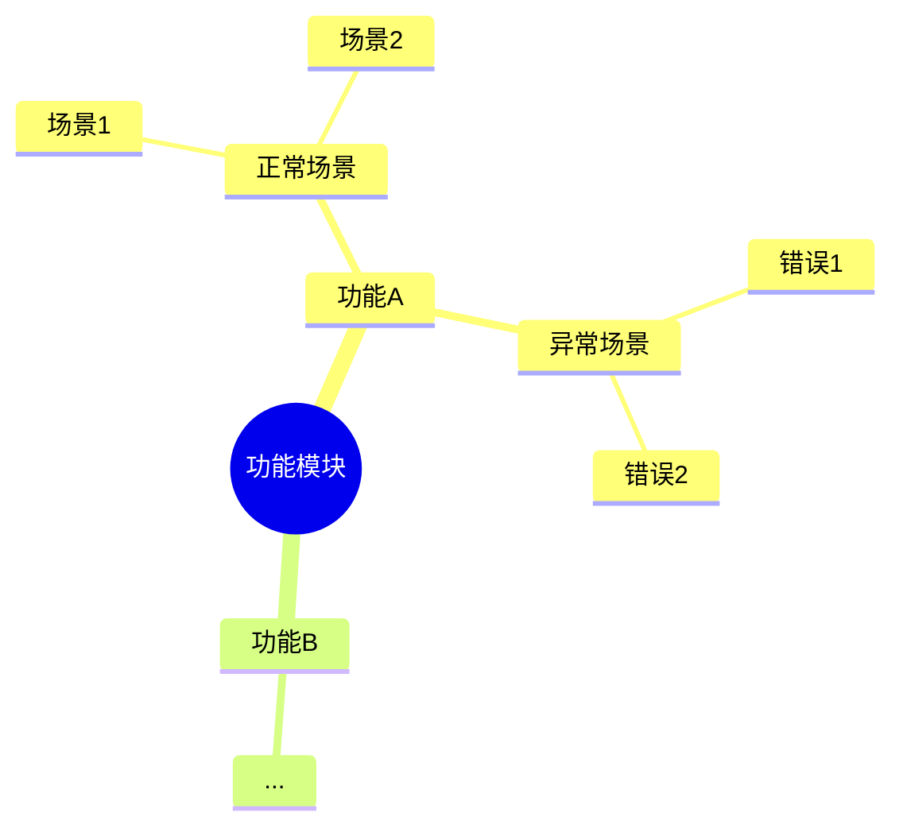

# ARTA - 自动化回归测试助手

**ARTA (Automation Regression Test Assistant)**

专注于 API 自动化测试和回归测试的智能助手

支持项目接入、API分析、业务链路记录、测试点转换、测试用例生成

---

## 简介

ARTA 是一个模块化的自动化测试助手，帮助您：

- 🚀 **快速接入项目** - 自动分析代码或解析 OpenAPI 规范
- 📊 **管理 API 清单** - 查看和管理所有 API 接口
- 🔗 **记录业务链路** - 完整记录业务流程和 API 调用序列
- 📝 **处理测试点** - 将思维导图测试点转换为测试用例
- ✅ **生成测试用例** - 基于业务链路自动生成测试代码
- 🧠 **智能学习** - 自动学习模式，提供数据和断言推荐
- 🤖 **多 Agent 协作** - 复杂任务自动分解，多 Agent 并行执行

---

## Agent 协调机制

ARTA 采用多 Agent 协作架构，通过中央协调器 (arta-coordinator) 分发和协调复杂任务，实现高效的并行处理和智能任务分解。

### 架构概览

```
┌─────────────────────────────────────────────────────────────┐
│                    ARTA Coordinator                         │
│                    (中央协调器)                              │
├─────────────────────────────────────────────────────────────┤
│                                                             │
│  ┌─────────────┐  ┌─────────────┐  ┌─────────────┐         │
│  │   Analyzer  │  │   Flow      │  │    Test     │         │
│  │   Agent     │  │  Recorder   │  │  Generator  │         │
│  └─────────────┘  └─────────────┘  └─────────────┘         │
│         │                │                │                 │
│  ┌─────────────┐  ┌─────────────┐                          │
│  │    Data     │  │   Pattern   │                          │
│  │ Strategist  │  │   Learner   │                          │
│  └─────────────┘  └─────────────┘                          │
│                          │                                  │
│                   结果合成与输出                             │
│                                                             │
└─────────────────────────────────────────────────────────────┘
```

### 可用 Agent

| Agent | 职责 | 触发场景 |
|-------|------|----------|
| arta-coordinator | 中央协调、任务分解 | 复杂任务 |
| arta-analyzer | 项目分析、API 识别 | 项目接入、重新分析 |
| arta-flow-recorder | 业务链路记录 | 添加/编辑链路 |
| arta-test-generator | 测试用例生成 | 生成测试用例 |
| arta-data-strategist | 测试数据策略 | 配置测试数据 |
| arta-pattern-learner | 模式学习 | 链路完成时 |

### 自动协调场景

协调器会在以下场景自动启动多 Agent 协作：

| 场景 | 协作 Agent | 说明 |
|------|------------|------|
| 端到端测试生成 | analyzer + flow-recorder + data-strategist + test-generator | 完整的测试生成流程 |
| 项目接入 | analyzer + pattern-learner | 分析项目并学习现有模式 |
| 业务链路完成 | pattern-learner + data-strategist | 学习模式并推荐数据策略 |
| 测试点导入 | flow-recorder + test-generator | 识别链路并生成用例 |

### 协调指令

使用 `/ARTA-coord-*` 指令手动触发协调任务：

| 指令 | 说明 |
|------|------|
| `/ARTA-coord-analyze <模块>` | 协调分析指定模块 |
| `/ARTA-coord-generate <模块>` | 协调生成指定模块测试用例 |
| `/ARTA-coord-status` | 查看当前协调任务状态 |

### 协调示例

```
用户: "为订单模块生成完整的测试用例"

协调器分解:
┌────────────────────────────────────────────────────────────┐
│ 任务: 订单模块测试生成                                      │
├────────────────────────────────────────────────────────────┤
│ 并行任务:                                                   │
│   [arta-analyzer] 分析订单模块 API                         │
│   [arta-pattern-learner] 加载订单相关模式                  │
├────────────────────────────────────────────────────────────┤
│ 串行任务:                                                   │
│   [arta-flow-recorder] 确认订单业务链路                    │
│        ↓                                                    │
│   [arta-data-strategist] 配置测试数据策略                  │
│        ↓                                                    │
│   [arta-test-generator] 生成测试用例                       │
├────────────────────────────────────────────────────────────┤
│ 完成: 生成 15 个测试用例文件                                │
└────────────────────────────────────────────────────────────┘
```

### Skills 与 Agents 关系

- **Skills**: 功能模块的定义，描述"做什么"和"怎么做"
- **Agents**: 执行实体，负责具体执行任务并协作

| Skill 模块 | 关联 Agent |
|------------|------------|
| arta-project | arta-analyzer |
| arta-api | arta-analyzer |
| arta-flow | arta-flow-recorder |
| arta-testpoint | arta-flow-recorder, arta-test-generator |
| arta-generation | arta-test-generator |
| arta-learning | arta-pattern-learner |
| arta-core | arta-coordinator |

---

## Agent 依赖与状态管理

### 依赖协作机制

ARTA Agent 之间通过依赖声明和状态文件实现协作调度。

#### 依赖关系图

```
端到端测试生成任务的依赖图:

┌─────────────────┐     ┌─────────────────┐
│ arta-analyzer   │     │ arta-pattern-   │
│ (无依赖)        │     │ learner (无依赖)│
└────────┬────────┘     └────────┬────────┘
         │                       │
         └───────────┬───────────┘
                     ↓
         ┌───────────────────────┐
         │ arta-flow-recorder    │
         │ 依赖: analyzer,       │
         │       pattern-learner │
         └───────────┬───────────┘
                     ↓
         ┌───────────────────────┐
         │ arta-data-strategist  │
         │ 依赖: flow-recorder   │
         └───────────┬───────────┘
                     ↓
         ┌───────────────────────┐
         │ arta-test-generator   │
         │ 依赖: data-strategist │
         └───────────────────────┘
```

#### 调度流程

```
1. 协调器启动任务
   ├── 加载任务模板 (agent_dependencies.json)
   ├── 初始化状态文件 (agent_status.json)
   └── 计算依赖图

2. 并行启动无依赖 Agent
   └── arta-analyzer, arta-pattern-learner 并行执行

3. Agent 完成时
   ├── 更新状态文件 (status=completed, outputs)
   ├── 标记下游依赖为 satisfied
   └── 检查并启动可执行的下游 Agent

4. 依赖阻塞处理
   └── Agent 状态设为 blocked，等待依赖满足
```

### 状态文件

| 文件 | 路径 | 用途 |
|------|------|------|
| 状态进度文件 | `assets/runtime/agent_status.json` | 实时记录各 Agent 执行状态 |
| 依赖配置文件 | `assets/configs/agent_dependencies.json` | 定义任务模板和依赖关系 |

#### 状态文件结构

```json
{
  "currentTask": {
    "taskId": "task-001",
    "type": "coord-generate",
    "status": "running"
  },
  "agents": {
    "arta-analyzer": {
      "status": "completed",
      "progress": 100,
      "outputs": {
        "apiInventoryPath": "assets/templates/api_inventory.json"
      }
    },
    "arta-flow-recorder": {
      "status": "running",
      "progress": 60,
      "currentStep": "确认 API 序列",
      "dependencies": {
        "arta-analyzer": "satisfied"
      },
      "inputs": {
        "apiInventory": "assets/templates/api_inventory.json"
      }
    },
    "arta-test-generator": {
      "status": "blocked",
      "blockedBy": ["arta-data-strategist"],
      "dependencies": {
        "arta-data-strategist": "pending"
      }
    }
  }
}
```

#### Agent 状态流转

```
idle → running → completed
           ↘ failed
           ↘ cancelled
           ↘ blocked (等待依赖)
```

### 进度查询

使用 `/ARTA-coord-status` 查询实时进度：

```
┌────────────────────────────────────────────────────────────┐
│ 📊 协调任务状态                                             │
├────────────────────────────────────────────────────────────┤
│ 当前任务: 订单模块测试生成                                  │
│ 状态: running                                              │
│ 进度: 60%                                                  │
│                                                            │
│ 已完成:                                                    │
│   ✅ [arta-analyzer] API 分析完成                          │
│       └─ 输出: api_inventory.json (8 APIs)                │
│   ✅ [arta-pattern-learner] 模式加载完成                   │
│       └─ 输出: 3 个模式                                    │
│                                                            │
│ 进行中:                                                    │
│   🔄 [arta-flow-recorder] 确认业务链路... (60%)            │
│                                                            │
│ 待执行 (阻塞):                                              │
│   ⏳ [arta-data-strategist] 等待 flow-recorder             │
│   ⏳ [arta-test-generator] 等待 data-strategist            │
└────────────────────────────────────────────────────────────┘
```

---

## 平台支持

ARTA 支持以下 AI 编程助手平台：

| 平台 | 类型 | 配置目录 |
|------|------|----------|
| **Claude Code** | CLI 工具 | `.claude/` |
| **OpenCode** | CLI 工具 | `.opencode/` |
| **VSCode Cline** | VSCode 插件 | `.cline/` |

---

## 安装配置

### Claude Code

1. 将 `skills/` 目录复制到您的项目或 Claude Code 的 skills 目录

```bash
# 方式一：复制到项目目录
cp -r skills/ /path/to/your/project/.claude/skills/arta/

# 方式二：复制到 Claude Code 全局目录
cp -r skills/ ~/.claude/skills/arta/
```

2. 在项目中触发 ARTA

```
输入: ARTA
或: /ARTA-help
```

### OpenCode

1. 将 `skills/` 目录复制到 OpenCode 配置目录

```bash
# 复制到项目目录
cp -r skills/ /path/to/your/project/.opencode/skills/arta/

# 或复制到全局目录
cp -r skills/ ~/.opencode/skills/arta/
```

2. 在 OpenCode 中使用

```
输入: ARTA
或: /ARTA-init
```

### VSCode Cline 插件

1. 在 VSCode 中安装 Cline 插件

2. 将 `skills/` 目录复制到项目目录

```bash
cp -r skills/ /path/to/your/project/.cline/skills/arta/
```

3. 在 Cline 对话框中使用

```
输入: ARTA
或使用指令: /ARTA-init
```

---

## 快速开始

### 1. 初始化项目

```
/ARTA-init
```

根据提示选择项目类型和 API 来源。

### 2. 查看 API 概况

```
/ARTA-api-list
```

### 3. 添加业务链路

```
/ARTA-flow-add 用户登录流程
```

### 4. 导入测试点

```
/ARTA-testpoint-import
```

粘贴 mermaid 格式的思维导图。

### 5. 生成测试用例

```
/ARTA-generate-cases
```

---

## 指令参考

### 📁 项目管理

| 指令 | 说明 |
|------|------|
| `/ARTA-init` | 初始化新项目 |
| `/ARTA-project-set <路径>` | 设置项目地址 |
| `/ARTA-openapi-set <URL>` | 设置 OpenAPI 来源 |
| `/ARTA-project-info` | 查看项目信息 |
| `/ARTA-project-analyze` | 重新分析项目 |

### 📊 API 管理

| 指令 | 说明 |
|------|------|
| `/ARTA-api-list [模块]` | 查看 API 概况 |
| `/ARTA-api-add <方法> <路径> <描述> [模块]` | 添加 API |
| `/ARTA-api-edit <序号>` | 编辑 API |
| `/ARTA-api-delete <序号>` | 删除 API |

### 🔗 业务链路

| 指令 | 说明 |
|------|------|
| `/ARTA-flow-list [状态]` | 查看所有链路 |
| `/ARTA-flow-add [名称]` | 添加业务链路 |
| `/ARTA-flow-edit <序号>` | 编辑链路 |
| `/ARTA-flow-delete <序号>` | 删除链路 |
| `/ARTA-flow-view <序号>` | 查看链路详情 |

### 📝 测试点

| 指令 | 说明 |
|------|------|
| `/ARTA-testpoint-import` | 导入测试点思维导图 |
| `/ARTA-testpoint-continue` | 继续处理测试点 |
| `/ARTA-testpoint-progress` | 查看处理进度 |

### 📄 输出

| 指令 | 说明 |
|------|------|
| `/ARTA-generate-cases [链路序号]` | 生成测试用例 |
| `/ARTA-generate-report` | 生成测试报告 |
| `/ARTA-export [输出目录]` | 导出所有文档 |

### ⚙️ 配置

| 指令 | 说明 |
|------|------|
| `/ARTA-config-list` | 查看配置列表 |
| `/ARTA-config-show <配置名>` | 查看配置内容 |
| `/ARTA-config-edit <配置名>` | 编辑配置 |
| `/ARTA-config-reset <配置名>` | 重置配置 |

### 🧠 学习机制

| 指令 | 说明 |
|------|------|
| `/ARTA-learning-stats` | 查看学习统计 |
| `/ARTA-pattern-list [类型]` | 查看已学习模式 |
| `/ARTA-pattern-show <模式ID>` | 查看模式详情 |
| `/ARTA-learning-config` | 查看学习配置 |
| `/ARTA-learning-reset` | 重置学习数据 |

---

## 最佳实践

### 1. 项目接入

**推荐流程**：

```
1. 准备 API 信息来源
   ├── 优先使用 OpenAPI/Swagger 规范文件
   ├── 次选使用项目代码自动分析
   └── 最后考虑手动输入

2. 运行初始化命令
   /ARTA-init

3. 确认 API 概况
   检查自动识别的 API 是否完整准确

4. 按模块组织 API
   使用 /ARTA-api-edit 为 API 分配模块
```

### 2. 业务链路记录

**建议顺序**：

```
1. 从核心业务开始
   - P0: 登录、下单、支付等核心流程
   - P1: 搜索、评论等重要功能
   - P2: 设置、通知等一般功能

2. 完整记录每个链路
   - API 调用序列
   - 测试数据策略
   - 关键断言

3. 保持链路独立
   - 每个链路聚焦单一业务场景
   - 复杂场景拆分为多个链路
```

### 3. 测试点处理

**思维导图格式**：



**处理建议**：

```
1. 按层级组织测试点
   - 一级节点：功能模块
   - 二级节点：功能分类
   - 三级节点：具体测试场景

2. 使用标准关键词
   - 登录、注册、查询、创建、更新、删除
   - 便于自动匹配 API

3. 逐点确认测试用例
   - 检查 API 匹配是否正确
   - 补充测试数据
   - 完善断言
```

### 4. 测试用例生成

**生成策略**：

```
1. 优先完成业务链路
   - 确保链路状态为 "completed"
   - 配置完整的测试数据和断言

2. 选择合适的测试框架
   - TypeScript 项目推荐 Vitest/Jest
   - Python 项目推荐 Pytest
   - Java 项目推荐 JUnit

3. 分批生成
   - 先生成核心流程用例
   - 再补充边缘场景
```

### 5. 多平台协作

**Claude Code (CLI)**

```bash
# 适合场景：命令行工作流、脚本集成
# 优势：快速、可自动化

claude "使用 ARTA 分析项目 /path/to/project"
```

**OpenCode (CLI)**

```bash
# 适合场景：开源项目、团队协作
# 优势：跨平台、可定制

opencode "ARTA - 分析 OpenAPI: https://api.example.com/openapi.json"
```

**VSCode Cline (插件)**

```
# 适合场景：日常开发、可视化交互
# 优势：集成开发环境、实时反馈

在 Cline 对话框中输入：
"使用 ARTA 为登录功能生成测试用例"
```

---

## 项目结构

```
arta/
├── skills/                      # Skill 模块
│   ├── arta-core/              # 核心模块
│   │   └── SKILL.md
│   ├── arta-project/           # 项目管理
│   │   └── SKILL.md
│   ├── arta-api/               # API 管理
│   │   └── SKILL.md
│   ├── arta-flow/              # 业务链路
│   │   └── SKILL.md
│   ├── arta-testpoint/         # 测试点处理
│   │   └── SKILL.md
│   ├── arta-generation/        # 测试生成
│   │   └── SKILL.md
│   └── arta-learning/          # 学习机制
│       └── SKILL.md
├── agents/                      # Agent 定义
│   ├── arta-coordinator.md     # 中央协调器
│   ├── arta-analyzer.md        # 项目分析 Agent
│   ├── arta-flow-recorder.md   # 业务链路记录 Agent
│   ├── arta-test-generator.md  # 测试生成 Agent
│   ├── arta-data-strategist.md # 测试数据策略 Agent
│   └── arta-pattern-learner.md # 模式学习 Agent
├── references/                  # 参考文档
│   ├── PROJECT_ONBOARDING.md
│   ├── BUSINESS_FLOW_RECORDER.md
│   ├── TESTPOINT_GUIDE.md
│   ├── COMMAND_REFERENCE.md
│   ├── DATA_STRATEGY_GUIDE.md
│   └── CRUD_HANDLING_GUIDE.md
├── assets/
│   ├── configs/                # 配置文件
│   │   ├── analyzer_config.json
│   │   ├── analyzer.yaml       # YAML 格式配置
│   │   ├── flow_diagram_config.json
│   │   ├── testpoint_config.json
│   │   └── learning_config.json # 学习配置
│   ├── data/                   # 学习数据
│   │   └── patterns.json       # 模式存储
│   └── templates/              # 数据模板
│       ├── project_config.json
│       ├── api_inventory.json
│       ├── business_flow.json
│       ├── data_strategy.json
│       └── testpoint_template.json
├── scripts/                     # 脚本工具
│   ├── analyze_project.py
│   ├── parse_openapi.py
│   ├── generate_flow_diagram.py
│   └── parse_testpoint_mindmap.py
├── SKILL.md                     # 主入口（兼容）
└── README.md                    # 本文件
```

---

## 支持的框架

### 后端框架

| 框架 | 语言 | API 分析支持 |
|------|------|-------------|
| Express | Node.js | ✅ |
| NestJS | Node.js | ✅ |
| Flask | Python | ✅ |
| Django | Python | ✅ |
| FastAPI | Python | ✅ |
| Spring Boot | Java | ✅ |
| Gin | Go | ✅ |
| Echo | Go | ✅ |

### 测试框架

| 框架 | 语言 | 用例生成支持 |
|------|------|-------------|
| Jest | TypeScript | ✅ |
| Vitest | TypeScript | ✅ |
| Mocha | TypeScript | ✅ |
| Pytest | Python | ✅ |
| JUnit | Java | ✅ |
| Go testing | Go | ✅ |

---

## 常见问题

### Q: 如何更新已识别的 API？

```
/ARTA-project-analyze
```

重新分析项目，会对比现有清单并标记变更。

### Q: 测试点无法匹配 API？

检查关键词是否在 `assets/configs/testpoint_config.json` 中定义。可以：

```
/ARTA-config-edit testpoint
```

添加自定义关键词映射。

### Q: 如何切换测试框架？

```
/ARTA-config-edit project
```

修改 `testFramework` 字段。

### Q: 生成的测试用例不完整？

确保业务链路状态为 `completed`：

```
/ARTA-flow-list
/ARTA-flow-edit <序号>
```

补充缺失的测试数据和断言。

---

## 许可证

MIT License

---

## 贡献

欢迎提交 Issue 和 Pull Request！
