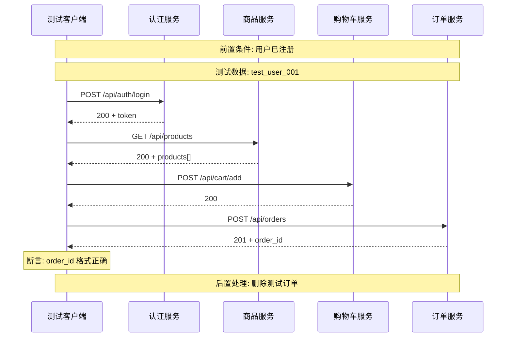

# 业务链路记录引导

本文档提供业务链路记录的详细引导流程。

## 触发场景

- 用户输入 `/ARTA-flow-add` 指令
- 项目接入完成后选择"添加业务链路"
- 测试点处理时需要新增链路
- 用户需要编辑现有链路

## 引导流程概览

```
┌──────────────────────────────────────────────────────────────┐
│              业务链路记录流程                                 │
├──────────────────────────────────────────────────────────────┤
│  步骤1: 链路基本信息                                         │
│  步骤2: API 调用序列选择                                     │
│  步骤3: 接口类型检测与特殊处理                               │
│  步骤4: 测试数据来源定义                                     │
│  步骤5: 前置条件确认                                         │
│  步骤6: 预期结果与断言                                       │
│  步骤7: 后置处理配置                                         │
│  步骤8: 生成流程图和文档                                     │
└──────────────────────────────────────────────────────────────┘
```

## 步骤1：链路基本信息

> 📝 **链路基本信息**
> 
> 请提供以下信息：
> 
> 1. **链路名称**：如"用户下单流程"
> 2. **链路描述**：简要描述业务目的
> 3. **所属模块**：从已有模块选择或输入新模块
> 4. **优先级**：P0（核心）/ P1（重要）/ P2（一般）

示例交互：
```
用户输入: 用户下单流程
Agent: 链路名称已记录。请简要描述这个流程的业务目的：
用户输入: 用户从浏览商品到完成订单创建的完整流程
Agent: 描述已记录。请选择所属模块：
       1. 认证
       2. 用户
       3. 订单
       4. 商品
       或输入新模块名称
用户输入: 3
Agent: 模块已选择"订单"。请选择优先级（P0/P1/P2）：
用户输入: P0
Agent: ✅ 基本信息已记录完成
```

## 步骤2：API 调用序列选择

> 🔗 **API 调用序列**
> 
> 当前项目 API 列表：
> 
> | 序号 | 路径 | 方法 | 描述 |
> |------|------|------|------|
> | 1 | /api/auth/login | POST | 用户登录 |
> | 2 | /api/products | GET | 商品列表 |
> | 3 | /api/cart/add | POST | 加入购物车 |
> | 4 | /api/orders | POST | 创建订单 |
> 
> 请选择此链路涉及的 API（输入序号，用逗号分隔，按调用顺序）：
> 或输入 `自定义` 手动添加 API

示例交互：
```
用户输入: 1,2,3,4
Agent: 已选择 4 个 API，调用顺序如下：
       
       1. POST /api/auth/login - 用户登录
       2. GET /api/products - 商品列表
       3. POST /api/cart/add - 加入购物车
       4. POST /api/orders - 创建订单
       
       是否正确？(确认/调整)
用户输入: 确认
Agent: ✅ API 序列已确认
```

## 步骤3：接口类型检测与特殊处理

根据选择的 API 类型，自动触发对应的询问。

### 3.1 新增接口 (POST) 处理

检测到 POST 类型接口时：

> 📥 **新增接口数据处理策略**
> 
> 检测到新增类型接口：
> - `POST /api/auth/login`
> - `POST /api/cart/add`
> - `POST /api/orders`
> 
> 请逐一配置：
> 
> **POST /api/auth/login**
> 1️⃣ 新增的数据是否需要在后续流程中复用？
>    - A. 是，需要复用 → 提取字段供后续使用
>    - B. 否，仅用于当前测试
> 
> 2️⃣ 是否需要减少测试数据产生？
>    - A. 启用数据复用池
>    - B. 每次独立创建
> 
> 3️⃣ 测试完成后如何处理？
>    - A. 自动清理（推荐）
>    - B. 标记为测试数据
>    - C. 不处理

### 3.2 编辑接口 (PUT/PATCH) 处理

检测到 PUT/PATCH 类型接口时：

> ✏️ **编辑接口数据处理策略**
> 
> 检测到编辑类型接口：`PUT /api/users/{id}`
> 
> 1️⃣ 编辑前的数据来源？
>    - A. 使用现有测试数据
>    - B. 临时创建测试数据
>    - C. 使用生产数据副本
> 
> 2️⃣ 编辑后的数据验证策略？
>    - [ ] 验证修改后值正确
>    - [ ] 验证未修改字段不变
>    - [ ] 验证关联数据一致性
> 
> 3️⃣ 测试完成后是否需要复原？
>    - A. 是，自动恢复原始值（推荐）
>    - B. 否，保留编辑后的状态

详见 [CRUD_HANDLING_GUIDE.md](CRUD_HANDLING_GUIDE.md)

### 3.3 删除接口 (DELETE) 处理

检测到 DELETE 类型接口时：

> 🗑️ **删除接口执行策略**
> 
> 检测到删除类型接口：`DELETE /api/orders/{id}`
> 
> ⚠️ 警告：删除操作不可逆
> 
> 请选择执行方式：
> 
> A. 🎭 Mock 模拟（推荐）
>    - 不真实执行删除
>    - Mock 返回成功响应
> 
> B. 🔄 软删除验证
>    - 验证数据标记为"已删除"状态
> 
> C. 📝 创建后删除
>    - 先创建临时测试数据
>    - 执行删除该临时数据
> 
> D. ⚡ 真实执行（需确认）
>    - 直接执行删除操作

详见 [CRUD_HANDLING_GUIDE.md](CRUD_HANDLING_GUIDE.md)

## 步骤4：测试数据来源定义

为每个 API 的参数定义数据来源。

> 📊 **测试数据来源定义**
> 
> 为每个参数选择数据来源：
> 
> **API #1: POST /api/auth/login**
> 
> | 参数 | 来源选择 |
> |------|----------|
> | username | ? |
> | password | ? |
> 
> 数据来源选项：
> - A. 📝 固定数据 - 用户主动提供
> - B. 🔧 生成数据 - 自动生成
> - C. 🔗 链路生成 - 从前序响应提取
> - D. 📊 数据池 - 从预设数据池获取

示例交互：
```
Agent: 参数 `username` 的数据来源？
用户输入: A
Agent: 请输入固定值：
用户输入: test_user_001
Agent: 参数 `password` 的数据来源？
用户输入: A
Agent: 请输入固定值：
用户输入: Test@123456
Agent: ✅ API #1 数据配置完成
```

详细策略见 [DATA_STRATEGY_GUIDE.md](DATA_STRATEGY_GUIDE.md)

## 步骤5：前置条件确认

> 📋 **前置条件确认**
> 
> 请确认以下前置条件：
> 
> 1. **用户状态**
>    - [ ] 用户账号已注册
>    - [ ] 用户状态正常（未封禁）
> 
> 2. **数据状态**
>    - [ ] 商品有库存
>    - [ ] 购物车为空
> 
> 3. **环境要求**
>    - [ ] 测试环境正常
>    - [ ] 支付服务可用
> 
> 4. **依赖链路**
>    - 是否依赖其他链路先执行？
>    - 示例：依赖「用户注册流程」先完成

## 步骤6：预期结果与断言

> ✅ **预期结果与断言定义**
> 
> 1. **最终预期结果**
>    描述整个链路的预期结果：
>    - 订单创建成功
>    - 返回有效的订单 ID
>    - 订单状态为"待支付"
> 
> 2. **关键断言点**
>    为每个 API 添加断言：
> 
>    **API #1: POST /api/auth/login**
>    - [ ] 响应状态码 = 200
>    - [ ] 返回有效的 token
>    - [ ] token 格式正确
> 
>    **API #4: POST /api/orders**
>    - [ ] 响应状态码 = 201
>    - [ ] order_id 格式: ORD-xxxx
>    - [ ] 订单金额正确

### 断言格式

```yaml
assertions:
  - step: 1
    path: "$.status"
    operator: "=="
    expected: 200
    
  - step: 1
    path: "$.data.token"
    operator: "exists"
    
  - step: 4
    path: "$.data.order_id"
    operator: "regex"
    expected: "^ORD-\\d+$"
```

## 步骤7：后置处理配置

> 🔄 **后置处理配置**
> 
> 配置测试完成后的清理操作：
> 
> 1. **数据清理**
>    - [ ] 删除创建的测试订单
>    - [ ] 清空购物车
>    - [ ] 用户登出
> 
> 2. **状态恢复**
>    - [ ] 恢复修改的数据
>    - [ ] 恢复配置项
> 
> 3. **清理执行时机**
>    - A. 每个用例执行后立即清理
>    - B. 整个测试套件执行后统一清理

### 清理配置示例

```yaml
cleanup:
  - step: 4
    action: delete
    endpoint: DELETE /api/orders/{order_id}
    params:
      order_id: "{{response.step4.data.order_id}}"
    condition: "response.step4.status == 201"
    
  - step: 1
    action: request
    endpoint: POST /api/auth/logout
    condition: "always"
```

## 步骤8：生成流程图和文档

### 生成 Mermaid 时序图



### 生成结构化文档

```markdown
## 业务链路：用户下单流程

### 📌 基本信息
- **链路ID**: BF-001
- **所属模块**: 订单
- **优先级**: P0
- **创建时间**: 2026-03-11

### 🔗 API 调用序列
| 序号 | API | 方法 | 描述 | 特殊处理 |
|------|-----|------|------|----------|
| 1 | /api/auth/login | POST | 用户登录 | token 复用 |
| 2 | /api/products | GET | 商品列表 | - |
| 3 | /api/cart/add | POST | 加入购物车 | 测试后清理 |
| 4 | /api/orders | POST | 创建订单 | 测试后清理 |

### 📋 前置条件
- [ ] 用户账号已注册且状态正常
- [ ] 商品有库存 (>0)
- [ ] 测试环境正常

### 📊 测试数据
| 参数 | 来源 | 值/规则 |
|------|------|---------|
| username | 固定 | test_user_001 |
| password | 固定 | Test@123456 |
| product_id | 链路生成 | {{response.step2.data[0].id}} |
| quantity | 生成 | {{random_int(1,5)}} |

### ✅ 断言规则
- [ ] 登录返回 status: 200
- [ ] 商品列表不为空
- [ ] 订单 ID 格式正确

### 🔄 后置处理
- 删除测试订单
- 清空购物车
- 用户登出
```

## 链路管理操作

### 查看所有链路 `/ARTA-flow-list`

```
┌──────────────────────────────────────────────────────────────┐
│  📋 业务链路列表                                             │
├──────────────────────────────────────────────────────────────┤
│                                                              │
│  | 序号 | 名称           | 模块   | 优先级 | API数 | 状态   | │
│  |------|----------------|--------|--------|-------|--------| │
│  | 1    | 用户下单流程   | 订单   | P0     | 4     | ✅完成 | │
│  | 2    | 用户注册流程   | 认证   | P0     | 1     | ✅完成 | │
│  | 3    | 商品管理流程   | 商品   | P1     | 3     | 📝草稿 | │
│                                                              │
│  总计: 3 条链路                                              │
└──────────────────────────────────────────────────────────────┘
```

### 编辑链路 `/ARTA-flow-edit <序号>`

```
Agent: 当前链路「用户下单流程」
       请选择要修改的部分：
       
       1. 基本信息
       2. API 序列
       3. 测试数据
       4. 前置条件
       5. 断言规则
       6. 后置处理
       
用户输入: 3
Agent: 进入测试数据编辑...
```

### 删除链路 `/ARTA-flow-delete <序号>`

```
Agent: 确认删除链路「用户下单流程」？
       此操作不可恢复。(y/n)
用户输入: y
Agent: ✅ 链路已删除
```

## 流程图服务映射配置

### 配置文件

当默认服务映射无法满足需求时，可通过配置文件自定义：

**配置文件路径**：`assets/configs/flow_diagram_config.json`

```json
{
  "serviceMap": {
    "member": "会员服务",
    "coupon": "优惠券服务",
    "logistics": "物流服务"
  }
}
```

### 默认映射

| 路径前缀 | 服务名称 |
|----------|----------|
| auth | 认证服务 |
| user/users | 用户服务 |
| order/orders | 订单服务 |
| product/products | 商品服务 |
| cart | 购物车服务 |
| payment | 支付服务 |

### 配置引导

检测到未知服务时自动引导添加：

```
Agent: 检测到未配置的服务路径: /api/member/xxx
       请输入服务名称：
用户输入: 会员服务
Agent: ✅ 已添加映射到配置文件
```

## 数据存储

业务链路数据存储到 `assets/templates/business_flow.json`：

```json
{
  "version": "1.0",
  "lastUpdated": "2026-03-11T19:00:00Z",
  "flows": [
    {
      "id": 1,
      "name": "用户下单流程",
      "description": "用户从浏览商品到完成订单创建的完整流程",
      "module": "订单",
      "priority": "P0",
      "apis": [
        { "apiId": 1, "order": 1, "note": "获取token" },
        { "apiId": 8, "order": 2, "note": "浏览商品" },
        { "apiId": 12, "order": 3, "note": "加入购物车" },
        { "apiId": 15, "order": 4, "note": "创建订单" }
      ],
      "preconditions": [
        "用户账号已注册",
        "商品有库存"
      ],
      "testData": {
        "username": { "source": "fixed", "value": "test_user_001" },
        "password": { "source": "fixed", "value": "Test@123456" },
        "product_id": { "source": "chain", "path": "response.step2.data[0].id" }
      },
      "assertions": [...],
      "cleanup": [...],
      "status": "completed",
      "createdAt": "2026-03-11T18:00:00Z",
      "updatedAt": "2026-03-11T18:30:00Z"
    }
  ]
}