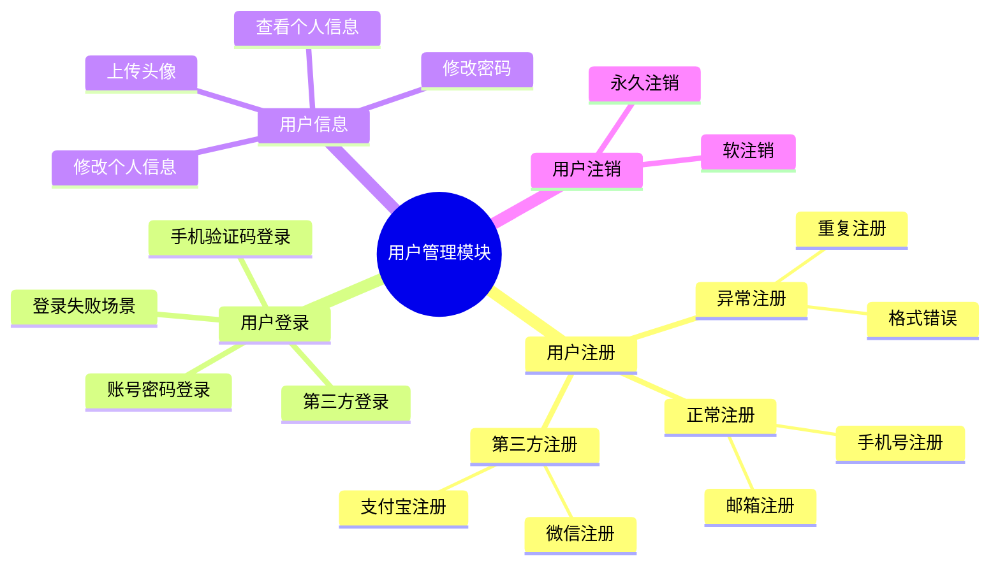

# 测试点处理指南

本文档提供测试点思维导图解析和转换的详细引导。

## 触发方式

- 用户输入 `/ARTA-testpoint-import`
- 用户粘贴 mermaid 思维导图内容
- 项目接入完成后选择"导入测试点"

## 支持的思维导图格式

### Mermaid Mindmap 格式



## 处理流程概览

```
┌──────────────────────────────────────────────────────────────┐
│              测试点思维导图解析流程                           │
├──────────────────────────────────────────────────────────────┤
│  步骤1: 接收思维导图                                         │
│  步骤2: 智能分析测试点                                       │
│  步骤3: 生成测试点分析报告                                   │
│  步骤4: 逐点处理（支持跳过）                                 │
│  步骤5: 生成处理总结报告                                     │
└──────────────────────────────────────────────────────────────┘
```

## 步骤1：接收思维导图

> 📥 **导入测试点**
> 
> 请提供 mermaid 格式的思维导图内容：
> 
> 方式一：直接粘贴内容
> ```
> mindmap
>   root((模块名称))
>     ...
> ```
> 
> 方式二：提供文件路径
> `/ARTA-testpoint-import-file <文件路径>`
> 
> 方式三：使用已有模板
> 输入 `模板` 查看示例模板

## 步骤2：智能分析测试点

解析思维导图并提取测试点结构：

1. **识别模块层级**
   - root 为模块根节点
   - 子节点为功能分类
   - 叶子节点为具体测试点

2. **匹配已有 API 概况**
   - 根据测试点名称匹配 API 路径
   - 根据测试点描述推断接口类型

3. **标记链路状态**
   - ✅ 已有对应业务链路
   - ⚠ 需要新增业务链路
   - ❌ 无匹配 API

## 步骤3：生成测试点分析报告

> 📊 **测试点分析结果**
> 
> ```
> ┌─────────────────────────────────────────────────────────────┐
> │ 模块: 用户管理                                              │
> │ 总测试点: 15 个                                             │
> │                                                             │
> │ ├─ 用户注册 (4点)                                           │
> │ │  ├─ 正常注册                                              │
> │ │  │  ├─ 手机号注册 ✓ 已有链路 (BF-001)                     │
> │ │  │  └─ 邮箱注册 ✓ 已有链路 (BF-002)                       │
> │ │  ├─ 异常注册                                              │
> │ │  │  ├─ 重复注册 ⚠ 需新增链路                              │
> │ │  │  └─ 格式错误 ⚠ 需新增链路                              │
> │ │  └─ 第三方注册                                            │
> │ │     ├─ 微信注册 ⚠ 需新增链路                              │
> │ │     └─ 支付宝注册 ⚠ 需新增链路                            │
> │ │                                                           │
> │ ├─ 用户登录 (4点)                                           │
> │ │  ├─ 账号密码登录 ✓ 已有链路 (BF-003)                      │
> │ │  ├─ 手机验证码登录 ⚠ 需新增链路                           │
> │ │  ├─ 第三方登录 ⚠ 需新增链路                               │
> │ │  └─ 登录失败场景 ⚠ 需新增链路                             │
> │ │                                                           │
> │ ├─ 用户信息 (4点)                                           │
> │ │  ├─ 查看个人信息 ✓ 已有链路 (BF-004)                      │
> │ │  ├─ 修改个人信息 ⚠ 需新增链路                             │
> │ │  ├─ 修改密码 ⚠ 需新增链路                                 │
> │ │  └─ 上传头像 ⚠ 需新增链路                                 │
> │ │                                                           │
> │ └─ 用户注销 (2点)                                           │
> │    ├─ 软注销 ❌ 无对应API                                   │
> │    └─ 永久注销 ❌ 无对应API                                 │
> │                                                             │
> │ 统计:                                                       │
> │ ✓ 已有链路: 4 (27%)                                        │
> │ ⚠ 需新增: 9 (60%)                                          │
> │ ❌ 无API: 2 (13%)                                           │
> └─────────────────────────────────────────────────────────────┘
> ```

## 步骤4：逐点处理

### 开始处理提示

> 📝 **开始处理测试点 [1/15]**
> 
> ```
> ┌─────────────────────────────────────────────────────────────┐
> │ 测试点: 用户注册 > 正常注册 > 手机号注册                    │
> │                                                             │
> │ 路径: 用户管理 > 用户注册 > 正常注册                        │
> │                                                             │
> │ 状态分析:                                                   │
> │ ✓ 已匹配 API: POST /api/auth/register                      │
> │ ✓ 已有业务链路: 用户注册流程 (BF-001)                       │
> │                                                             │
> │ 请选择操作:                                                 │
> │                                                             │
> │ A. ✅ 使用已有链路生成测试用例                              │
> │ B. ✏️ 修改已有链路                                         │
> │ C. ➕ 新增链路变体                                          │
> │ D. ⏭️ 跳过此测试点                                         │
> │ E. ❌ 标记为不需要自动化                                    │
> └─────────────────────────────────────────────────────────────┘
> ```

### 场景 A：使用已有链路

```
用户输入: A
Agent: 正在基于链路 BF-001 生成测试用例...
       ✅ 测试用例已生成: TC-001 手机号注册测试
       
       继续处理下一个测试点 [2/15]...
```

### 场景 B：需要新增链路

> 📝 **处理测试点 [3/15]**
> 
> ```
> ┌─────────────────────────────────────────────────────────────┐
> │ 测试点: 用户注册 > 异常注册 > 重复注册                      │
> │                                                             │
> │ 状态分析:                                                   │
> │ ✓ 已匹配 API: POST /api/auth/register                      │
> │ ⚠ 无对应业务链路 - 需要测试重复注册的异常场景               │
> │                                                             │
> │ 建议操作: 新增「重复注册」异常链路                          │
> │                                                             │
> │ 请选择操作:                                                 │
> │                                                             │
> │ A. ➕ 新增业务链路                                          │
> │    → 将触发 business-flow-recorder 引导                     │
> │ B. ⏭️ 跳过此测试点                                         │
> │ C. 📝 手动关联已有链路                                      │
> │ D. 🔍 查看相似链路                                          │
> └─────────────────────────────────────────────────────────────┘
> ```

```
用户输入: A
Agent: 正在加载业务链路记录器...
       → 进入 [BUSINESS_FLOW_RECORDER.md](BUSINESS_FLOW_RECORDER.md) 流程
       
       预填充信息:
       - 链路名称: 重复注册异常测试
       - 关联 API: POST /api/auth/register
       - 测试类型: 异常场景
       
       请继续完善链路信息...
```

### 场景 C：无匹配 API

> 📝 **处理测试点 [14/15]**
> 
> ```
> ┌─────────────────────────────────────────────────────────────┐
> │ 测试点: 用户注销 > 软注销                                   │
> │                                                             │
> │ 状态分析:                                                   │
> │ ❌ 未找到匹配 API                                           │
> │                                                             │
> │ 可能原因:                                                   │
> │ 1. API 尚未开发                                            │
> │ 2. API 命名不同                                            │
> │ 3. 功能在其他模块                                           │
> │                                                             │
> │ 请选择操作:                                                 │
> │                                                             │
> │ A. 🔍 手动搜索 API 关键字                                   │
> │ B. ➕ 手动添加 API 信息                                     │
> │ C. ⏭️ 跳过此测试点                                         │
> │ D. ⏭️ 跳过整个分支 (用户注销)                               │
> │ E. 📝 标记为待开发                                          │
> └─────────────────────────────────────────────────────────────┘
> ```

## 批量操作指令

在逐点处理过程中，支持以下批量操作：

| 指令 | 说明 |
|------|------|
| `全部跳过` | 跳过剩余所有测试点 |
| `跳过该分支` | 跳过当前分支下所有子测试点 |
| `全部使用已有链路` | 对所有匹配的测试点使用已有链路 |
| `暂停处理` | 保存进度，下次继续 |
| `查看进度` | 显示当前处理进度统计 |

### 批量操作示例

```
用户输入: 跳过该分支
Agent: 已跳过「第三方注册」下所有测试点 (2点)
       继续处理下一个测试点 [6/15]...
```

```
用户输入: 全部使用已有链路
Agent: 将对所有已有匹配链路的测试点自动生成测试用例
       确认？(y/n)
用户输入: y
Agent: 正在批量生成...
       ✅ 已生成 3 个测试用例
       剩余 6 个测试点需要手动处理
       继续处理 [9/15]...
```

## 步骤5：生成处理总结报告

> 📊 **测试点处理完成报告**
> 
> ```markdown
> ## 测试点处理报告
> 
> ### 📊 处理统计
> | 类型 | 数量 | 百分比 |
> |------|------|--------|
> | ✅ 已生成测试用例 | 5 | 33% |
> | ➕ 新增业务链路 | 4 | 27% |
> | ⏭️ 跳过 | 4 | 27% |
> | ❌ 无对应API | 2 | 13% |
> | **总计** | **15** | **100%** |
> 
> ### 📋 处理明细
> | 序号 | 测试点 | 处理结果 | 关联链路/备注 |
> |------|--------|----------|---------------|
> | 1 | 手机号注册 | ✅ 已生成 | BF-001 |
> | 2 | 邮箱注册 | ✅ 已生成 | BF-002 |
> | 3 | 重复注册 | ➕ 新增 | BF-005 |
> | 4 | 格式错误 | ➕ 新增 | BF-006 |
> | 5 | 微信注册 | ⏭️ 跳过 | 用户选择跳过 |
> | 6 | 支付宝注册 | ⏭️ 跳过 | 分支跳过 |
> | 7 | 账号密码登录 | ✅ 已生成 | BF-003 |
> | ... | ... | ... | ... |
> | 14 | 软注销 | ❌ 无API | 待开发 |
> | 15 | 永久注销 | ❌ 无API | 待开发 |
> 
> ### 📁 生成文件
> - `test_cases/user_module_testcases.md` - 测试用例文档
> - `flows/user_module_flows.json` - 新增业务链路配置
> - `reports/testpoint_analysis_20260311.md` - 分析报告
> 
> ### ⚠️ 待处理项
> - [ ] 软注销 - 需确认 API 开发进度
> - [ ] 永久注销 - 需确认 API 开发进度
> - [ ] 微信注册 - 需确认是否需要自动化
> - [ ] 支付宝注册 - 需确认是否需要自动化
> ```

## 进度保存与恢复

### 暂停处理

```
用户输入: 暂停处理
Agent: 进度已保存
       已处理: 8/15
       下次使用 /ARTA-testpoint-continue 继续
```

### 继续处理

```
用户输入: /ARTA-testpoint-continue
Agent: 恢复上次进度
       已处理: 8/15
       继续处理测试点 [9/15]...
       
       ┌─────────────────────────────────────────────────────────┐
       │ 测试点: 用户登录 > 第三方登录                            │
       │ ...
       └─────────────────────────────────────────────────────────┘
```

### 查看进度

```
用户输入: /ARTA-testpoint-progress
Agent: 当前处理进度
       
       ┌─────────────────────────────────────────────────────────┐
       │ 📊 测试点处理进度                                        │
       ├─────────────────────────────────────────────────────────┤
       │ 总数: 15                                                │
       │ 已处理: 8 (53%)                                         │
       │ 待处理: 7 (47%)                                         │
       │                                                         │
       │ 已处理明细:                                             │
       │ ✅ 已生成: 4                                            │
       │ ➕ 新增链路: 2                                          │
       │ ⏭️ 跳过: 2                                             │
       └─────────────────────────────────────────────────────────┘
```

## 数据存储

测试点处理数据存储到 `assets/templates/testpoint_template.json`：

```json
{
  "version": "1.0",
  "lastUpdated": "2026-03-11T19:30:00Z",
  "source": "mermaid-mindmap",
  "totalPoints": 15,
  "processedPoints": 8,
  "status": "in_progress",
  "testpoints": [
    {
      "id": 1,
      "path": "用户管理 > 用户注册 > 正常注册 > 手机号注册",
      "level": 3,
      "status": "completed",
      "result": "generated",
      "linkedFlow": "BF-001",
      "linkedTestCase": "TC-001"
    },
    {
      "id": 3,
      "path": "用户管理 > 用户注册 > 异常注册 > 重复注册",
      "level": 3,
      "status": "completed",
      "result": "new_flow",
      "linkedFlow": "BF-005"
    },
    {
      "id": 5,
      "path": "用户管理 > 用户注册 > 第三方注册 > 微信注册",
      "level": 3,
      "status": "completed",
      "result": "skipped",
      "skipReason": "用户选择跳过"
    }
  ],
  "pendingTestpoints": [
    {
      "id": 9,
      "path": "用户管理 > 用户登录 > 第三方登录"
    }
  ]
}
```

## 测试点与业务链路关联

当测试点需要新增业务链路时，系统会：

1. **预填充信息**
   - 链路名称基于测试点名称
   - 自动关联匹配的 API
   - 标注测试类型（正常/异常场景）

2. **跳转引导**
   - 加载 [BUSINESS_FLOW_RECORDER.md](BUSINESS_FLOW_RECORDER.md)
   - 完成链路记录后返回测试点处理流程
   - 自动关联生成的链路

3. **状态同步**
   - 链路生成成功后自动更新测试点状态
   - 继续处理下一个测试点

## 关键词映射配置

### 配置文件

当默认的关键词映射无法满足需求时，可通过配置文件自定义：

**配置文件路径**：`assets/configs/testpoint_config.json`

```json
{
  "keyword_map": {
    "自定义中文关键词": ["english", "keywords"]
  },
  "method_map": {
    "自定义中文关键词": "HTTP方法"
  },
  "indent_size": 2
}
```

### 示例：添加业务关键词

```json
{
  "keyword_map": {
    "审批": ["approve", "audit", "review"],
    "退款": ["refund", "return"],
    "发货": ["ship", "deliver"]
  },
  "method_map": {
    "审批": "POST",
    "退款": "POST",
    "发货": "PUT"
  }
}
```

### 默认关键词映射

| 中文关键词 | 匹配的英文路径关键词 |
|------------|----------------------|
| 登录 | login, auth, signin |
| 注册 | register, signup, create |
| 查询 | get, list, query, search |
| 创建 | create, add, post, new |
| 修改 | update, edit, modify |
| 删除 | delete, remove |
| 详情 | detail, info, get |
| 列表 | list, all, query |
| 导出 | export, download |
| 导入 | import, upload |

### 配置引导

当测试点无法匹配 API 时：

```
Agent: 测试点「会员审批」无法匹配到API
       请选择操作：
       A. 手动选择 API
       B. 添加关键词映射
       C. 跳过
用户输入: B
Agent: 请输入"审批"对应的英文关键词：
用户输入: approve, audit
Agent: ✅ 已添加映射到配置文件
```
