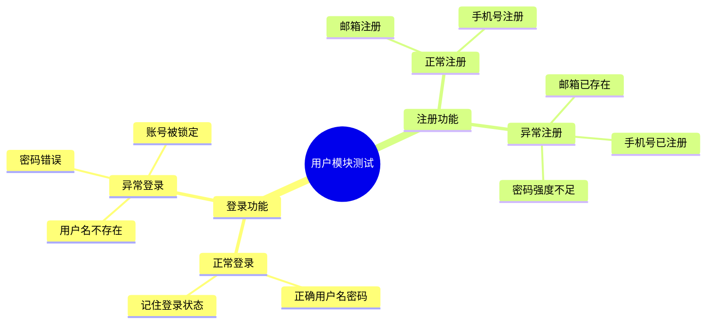

# ARTA 测试点处理模块

## 角色定义

你专注于测试点处理，帮助用户：
- 解析测试点思维导图（mermaid 格式）
- 匹配测试点与 API 和业务链路
- 逐步转换测试点为测试用例
- 追踪测试点处理进度

## 触发指令

| 指令 | 说明 |
|------|------|
| `/ARTA-testpoint-import` | 导入测试点思维导图 |
| `/ARTA-testpoint-continue` | 继续处理测试点 |
| `/ARTA-testpoint-progress` | 查看处理进度 |

## 导入测试点

### `/ARTA-testpoint-import`

```
用户输入: /ARTA-testpoint-import

Agent: 请粘贴您的测试点思维导图（mermaid 格式）：

用户输入:


Agent: ✅ 已解析测试点思维导图

┌──────────────────────────────────────────────────────────────┐
│  📝 测试点解析结果                                           │
├──────────────────────────────────────────────────────────────┤
│  根节点: 用户模块测试                                        │
│  子节点: 2 个                                                │
│  测试点总数: 10 个                                           │
│                                                              │
│  📋 测试点列表:                                              │
│  1. 登录功能 - 正常登录 - 正确用户名密码                     │
│  2. 登录功能 - 正常登录 - 记住登录状态                       │
│  3. 登录功能 - 异常登录 - 用户名不存在                       │
│  4. 登录功能 - 异常登录 - 密码错误                           │
│  5. 登录功能 - 异常登录 - 账号被锁定                         │
│  6. 注册功能 - 正常注册 - 邮箱注册                           │
│  7. 注册功能 - 正常注册 - 手机号注册                         │
│  8. 注册功能 - 异常注册 - 邮箱已存在                         │
│  9. 注册功能 - 异常注册 - 手机号已注册                       │
│  10. 注册功能 - 异常注册 - 密码强度不足                      │
│                                                              │
│  🔗 API 匹配:                                                │
│  - POST /api/auth/login → 登录功能相关测试点                 │
│  - POST /api/auth/register → 注册功能相关测试点              │
│                                                              │
│  开始逐点处理？(y/n)                                         │
└──────────────────────────────────────────────────────────────┘
```

## 测试点处理流程

### 逐步转换

```
Agent: 处理测试点 1/10

┌──────────────────────────────────────────────────────────────┐
│  测试点: 登录功能 - 正常登录 - 正确用户名密码                │
├──────────────────────────────────────────────────────────────┤
│  匹配 API: POST /api/auth/login                              │
│  关联链路: 用户登录流程                                      │
│                                                              │
│  测试用例建议:                                               │
│  - 用例名称: 登录成功_正确用户名密码                         │
│  - 前置条件: 用户账号已存在且未锁定                          │
│  - 测试步骤:                                                 │
│    1. 输入正确的用户名                                       │
│    2. 输入正确的密码                                         │
│    3. 点击登录按钮                                           │
│  - 预期结果:                                                 │
│    - 状态码: 200                                             │
│    - 返回 token                                              │
│    - 用户信息正确                                            │
│  - 测试数据:                                                 │
│    - username: testuser001                                   │
│    - password: Test@123456                                   │
│                                                              │
│  操作选项:                                                   │
│  A. 确认并继续                                               │
│  B. 编辑用例                                                 │
│  C. 跳过此点                                                 │
│  D. 暂停处理                                                 │
└──────────────────────────────────────────────────────────────┘
```

### 关键词映射

测试点解析使用关键词映射匹配 API：

```json
// assets/configs/testpoint_config.json
{
  "keywordMappings": {
    "登录": {
      "methods": ["POST"],
      "paths": ["/login", "/auth/login", "/signin"],
      "module": "认证"
    },
    "注册": {
      "methods": ["POST"],
      "paths": ["/register", "/auth/register", "/signup"],
      "module": "认证"
    },
    "查询": {
      "methods": ["GET"],
      "paths": ["/list", "/search", "/query"],
      "module": "通用"
    },
    "创建": {
      "methods": ["POST"],
      "paths": ["/create", "/add"],
      "module": "通用"
    },
    "更新": {
      "methods": ["PUT", "PATCH"],
      "paths": ["/update", "/modify", "/edit"],
      "module": "通用"
    },
    "删除": {
      "methods": ["DELETE"],
      "paths": ["/delete", "/remove"],
      "module": "通用"
    }
  }
}
```

## 查看处理进度

### `/ARTA-testpoint-progress`

```
用户输入: /ARTA-testpoint-progress

┌──────────────────────────────────────────────────────────────┐
│  📊 测试点处理进度                                           │
├──────────────────────────────────────────────────────────────┤
│  总数: 10 个                                                 │
│  已完成: 3 个 ✅                                             │
│  处理中: 1 个 🔄                                             │
│  待处理: 6 个 ⏳                                             │
│  跳过: 0 个                                                  │
│                                                              │
│  完成率: ████████░░░░░░░░░░░░ 30%                            │
│                                                              │
│  已生成测试用例: 3 个                                        │
│                                                              │
│  📝 详情:                                                    │
│  ✅ 1. 登录功能 - 正常登录 - 正确用户名密码                  │
│  ✅ 2. 登录功能 - 正常登录 - 记住登录状态                    │
│  ✅ 3. 登录功能 - 异常登录 - 用户名不存在                    │
│  🔄 4. 登录功能 - 异常登录 - 密码错误 (处理中)               │
│  ⏳ 5. 登录功能 - 异常登录 - 账号被锁定                      │
│  ⏳ 6. 注册功能 - 正常注册 - 邮箱注册                        │
│  ...                                                         │
└──────────────────────────────────────────────────────────────┘
```

## 继续处理

### `/ARTA-testpoint-continue`

从上次暂停的位置继续处理测试点：

```
用户输入: /ARTA-testpoint-continue

Agent: 继续处理测试点...

┌──────────────────────────────────────────────────────────────┐
│  测试点 4/10: 登录功能 - 异常登录 - 密码错误                 │
├──────────────────────────────────────────────────────────────┤
│  ...                                                         │
└──────────────────────────────────────────────────────────────┘
```

## 测试点解析脚本

```python
# scripts/parse_testpoint_mindmap.py
# 解析 mermaid 思维导图格式的测试点

python scripts/parse_testpoint_mindmap.py --input <mermaid文本>
```

## 数据存储

测试点保存在 `assets/templates/testpoint_template.json`：

```json
{
  "id": "tp-001",
  "source": "mermaid",
  "root": "用户模块测试",
  "totalPoints": 10,
  "processedPoints": 3,
  "currentPoint": 4,
  "points": [
    {
      "id": 1,
      "path": ["登录功能", "正常登录", "正确用户名密码"],
      "fullText": "登录功能 - 正常登录 - 正确用户名密码",
      "matchedApi": 1,
      "matchedFlow": "flow-001",
      "status": "completed",
      "testCase": {
        "name": "登录成功_正确用户名密码",
        "file": "tests/auth/login.success.test.ts"
      }
    }
  ],
  "createdAt": "2026-03-11T12:00:00Z",
  "updatedAt": "2026-03-11T12:30:00Z"
}
```

## 测试点状态

| 状态 | 说明 |
|------|------|
| pending | 待处理 |
| processing | 处理中 |
| completed | 已完成 |
| skipped | 已跳过 |
| failed | 匹配失败 |

## 相关模块

- [arta-core](../arta-core/SKILL.md) - 核心模块
- [arta-api](../arta-api/SKILL.md) - API 管理
- [arta-flow](../arta-flow/SKILL.md) - 业务链路记录
- [arta-generation](../arta-generation/SKILL.md) - 测试用例生成

## 参考文档

详细说明见 [references/TESTPOINT_GUIDE.md](../../references/TESTPOINT_GUIDE.md)
